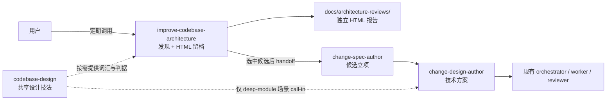
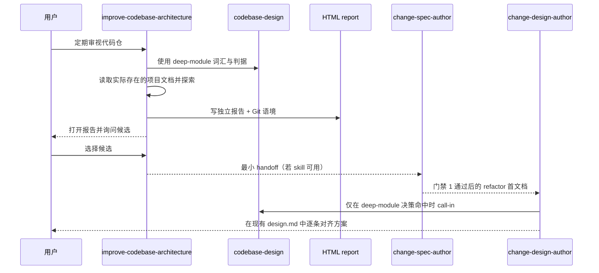
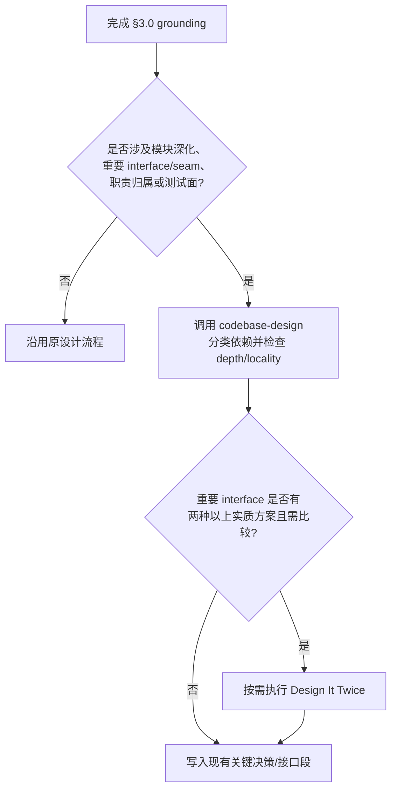

# feat-457: 引入通用架构巡检与深模块设计能力 — 技术方案

> 对齐: spec.md v1
> Unit branch: `unit/feat-457` (will be created by orchestrator)

## Changelog

## 现状分析

### 涉及范围

- `.claude/skills/improve-codebase-architecture/` —— 当前是从上游直接复制、尚未纳入 Git 的 `SKILL.md + HTML-REPORT.md`；主体探索逻辑和报告视觉保留，只改通用流程兼容点。
- `.claude/skills/codebase-design/` —— 当前不存在；从上游引入 `SKILL.md + DEEPENING.md + DESIGN-IT-TWICE.md`，作为独立的深模块设计技法 skill。
- `.claude/skills/change-design-author/SKILL.md` —— 现有设计流程已负责代码仓 grounding、关键决策对齐和 Milestone 拆分；本 unit 只增加 deep-module 场景的按需 call-in，不改变门禁、产物和角色边界。
- `docs/architecture-reviews/` —— 运行 `improve-codebase-architecture` 时按需创建并写入 HTML 报告；本 unit 不预建占位文件，也不增加候选台账。
- `docs/specs/{kernel,im,gateway,cli}/spec.md` 与 `src/` —— 只读、不改；本 unit 不改变四个产品包的对外行为。

### 既有约束

- skill 按 `.claude/skills/<name>/SKILL.md` 自动发现，无 manifest 或注册表；相邻资料放在同一 skill 目录并由 `SKILL.md` 按需引用。
- `change-design-author` 是首文档通过门禁 1 后唯一的设计作者；新增能力只能作为其内部技法，不能另起一套 spec/design/implementation 主流程。
- `improve-codebase-architecture` 是通用 skill，不绑定 nano-multiagent 的目录、扫描过滤规则、架构检查清单或领域词汇。
- 项目已经定义的正式名称优先。`module/interface/seam/...` 是分析架构关系时的共享词汇，不能把真实产品名、类型名或项目正式术语机械改名。
- 报告是用户要求保留的历史审视产物，不按普通临时生成物处理；但每份报告独立，不衍生状态文件。
- 上游 `mattpocock-skills` 采用 MIT License。引入的两个 skill 目录各保留一份上游许可证，满足复制和修改时的 notice 要求。

### 可复用能力

- 上游 `improve-codebase-architecture`（commit `d574778f94cf620fcc8ce741584093bc650a61d3`）——**改**：保留 organic exploration、deletion test、候选卡片、before/after 图、推荐强度和 top recommendation；替换强制领域文档、临时目录和 grilling/domain-modeling continuation。
- 上游 `codebase-design` 同一 commit 下的三份文档——**改**：整体引入 glossary、deepening 依赖分类、seam discipline、interface-as-test-surface 和 Design It Twice；补上“项目正式术语优先”和“Design It Twice 非默认步骤”的兼容说明。
- `change-design-author §3.0/§3.2` ——**扩展**：grounding 后先判断是否存在模块深化、interface/seam、职责归属或测试面决策；命中才调用 `codebase-design`，结论仍写入现有关键决策与接口段。
- `change-design-reviewer` 的“架构进攻”——**不改**：它已用删除测试、深浅和归属等判据审查完成的 design；本 unit 补的是 design-author 产出方案时的能力，不与 reviewer 合并。

### 相关历史

- `feat-432-design-reviewer-architecture-attack` 已把删除测试、深/浅和职责归属用于门禁 2 前的独立审查。本 unit 与它互补：author 用共享词汇形成方案，reviewer 仍独立进攻，不因共享方法而免审。
- `feat-396-systematic-debugging-skill` 已验证“独立技法 skill + 在角色 skill 内按场景 call-in”的接入模式；本 unit 沿用该模式，不创建新的 orchestrator 角色。

> **契约层 grounding**：N/A。本 unit 只修改 `.claude/skills/` 方法论文档，不涉及 `src/` 或四个产品入口；四份 canonical spec 均无行为增量。

## 架构总览

本 unit 形成两层能力：`improve-codebase-architecture` 独立完成“发现并留档”，现有 change-* 流程完成“立项并实施”；`codebase-design` 是两者共享的深模块设计语言，但不成为新的流程所有者。



**before**：巡检报告落在临时目录，强依赖另一套领域文档，并在选中候选后切入未安装的 grilling/domain-modeling 流程；设计作者没有显式的 deep-module call-in。

**after**：巡检仍保持原始探索风格，但报告成为带 Git 语境的独立仓库产物；候选经一个小 handoff 进入项目现有变更流程；设计作者只在相关场景借用 `codebase-design`。

## 关键决策

### 决策 1: `codebase-design` 作为独立技法 skill 最小引入

**引入上游三份设计文档，只补通用术语优先级和非机械触发说明。**

- **理由**：`improve-codebase-architecture` 已明确依赖这套词汇；独立 skill 还能被 design-author 复用，避免在两个调用方复制判断法。
- **拒绝**：只把 glossary 摘进巡检 skill——会失去 deepening 与 Design It Twice 的完整方法，并让 design-author 再复制一次；整体引入 Matt 的 workflow——与现有 change-* 角色重叠。
- **风险**：上游“必须只用这些词”的强约束可能覆盖项目正式名称。兼容补丁明确：共享词汇描述架构关系，项目领域名、产品名、类型名和正式架构术语保持原样。

### 决策 2: `improve-codebase-architecture` 保留主体，只替换三个不兼容接点

**探索与 HTML 候选表达不重写，只改可选 grounding、报告持久化和候选 continuation。**

- **理由**：用户需要的正是上游成熟的 organic exploration 和可视化表达，当前仓库没有特殊到需要另造扫描器。
- **拒绝**：限定 `git ls-files`、加入固定排除目录或 nano-multiagent 架构清单——把通用 skill 误做成仓库插件；重写候选结构——没有需求收益。
- **风险**：organic exploration 的扫描成本随仓库大小变化。沿用上游行为，由执行 agent 根据仓库和用户范围控制探索深度，不新增硬编码过滤。

### 决策 3: 报告是带版本语境的独立快照，不是候选数据库

**每次写 `docs/architecture-reviews/architecture-review-<timestamp>-<short-sha|no-git>.html`，正文记录完整 Git 语境，绝不覆盖旧报告。**

- **理由**：commit + branch + clean/dirty 足以回答“这份分析基于什么状态”；用户不需要候选生命周期管理。
- **拒绝**：`candidates.md`、稳定候选 ID、状态机、历史 diff 或汇总索引——都把独立审视扩成维护系统。
- **风险**：dirty 报告不能靠 commit 单独复现。报告必须显著注明“包含未提交工作区状态”，不能把 commit 表述成完整快照。

### 决策 4: 候选选择只产生 handoff，不在巡检阶段设计 interface

**选中候选后输出固定的最小上下文；有 `change-spec-author` 就以 refactor 需求交给它，没有则停在独立 handoff。**

- **理由**：发现、需求对齐、技术设计各有单一所有者，避免巡检 skill 绕过门禁 1 直接做方案或修改领域文档。
- **拒绝**：保留 grilling/domain-modeling continuation——相关 skill 未引入且与 change-* 流程重叠；巡检内直接调用 Design It Twice——interface 尚未进入设计阶段。
- **风险**：不同宿主暴露 skill 的方式不同。handoff 不能硬编码绝对路径；按当前可用 skill 能力判断，有则调用，无则明确把文本交还用户。

### 决策 5: `change-design-author` 以决策触发器按需调用 `codebase-design`

**只有设计真的涉及模块深化、重要 interface/seam、职责归属或测试面时才 call-in，产物仍落在现有 design 段落。**

- **理由**：这是设计技法，不是新门禁或新文档类型；复用现有“现状分析 → 关键决策 → 接口与数据流”即可承载结论。
- **拒绝**：每个 unit 固定调用、在模板增加必填 deep-module 章节——会把普通配置、文案和局部设计机械复杂化。
- **风险**：触发条件过软会漏用或滥用。`change-design-author` 写明四类正向触发和普通设计的反向例子；是否触发及理由在对话中一句话说明。

### 决策 6: Design It Twice 是二级可选分支

**仅当重要 interface 确有两种以上实质方案、且用户要比较取舍时，才读取并执行 `DESIGN-IT-TWICE.md`。**

- **理由**：多方案探索对承重 interface 有价值，但不是每个技术决策都值得 fan-out。
- **拒绝**：固定三路方案或把普通备选都升级为 Design It Twice——增加协调成本，违背本 unit 的轻量接入目标。
- **风险**：什么叫“实质不同”可能被滥判。判据是方案在 interface 形状、seam 位置或依赖策略上不同；只改命名或参数顺序不算。

## 接口与数据流

### 架构巡检调用契约

| 项目 | 契约 |
|---|---|
| 输入 | 当前代码仓；用户可额外限定目录或主题，但 skill 不强制固定扫描集合 |
| grounding | 先读项目实际存在的 instructions、架构文档和决策记录；`CONTEXT.md`、`CONTEXT-MAP.md`、ADR 存在则使用，不存在则继续且不创建 |
| 分析 | organic exploration + deletion test + deep/shallow、seam、leverage、locality 判据 |
| 输出 | 一份独立 HTML，保留候选卡片、before/after、推荐强度和 top recommendation |
| continuation | 用户选中候选后输出 handoff；不设计 interface、不改代码、不维护候选状态 |

### 报告路径与元数据契约

1. 能取得 Git 根目录时，以 `git rev-parse --show-toplevel` 的结果为报告根；不能取得时，以当前工作目录为根。
2. 写入 `<root>/docs/architecture-reviews/`；目录不存在时创建。
3. 文件名使用本地生成时间 `YYYYMMDD-HHMMSS` + 短 SHA；无 Git 信息用 `no-git`。若同名已存在，追加递增后缀，禁止覆盖。
4. HTML header 至少展示：生成时间、仓库/目录名、完整 commit SHA、branch、working tree `clean|dirty`；无 Git 信息的字段明确显示 `unavailable`。
5. dirty 时增加醒目标记：报告分析包含未提交工作区状态，commit 不是完整可复现快照。
6. 写完后沿用上游跨平台打开方式，并始终告诉用户绝对路径；打开失败不删除报告。

### 候选 handoff 契约

```markdown
## Architecture candidate handoff

- Source report: <absolute path>
- Reviewed revision: <full commit | unavailable>; branch=<branch | unavailable>; working-tree=<clean | dirty | unavailable>
- Candidate: <title>
- Files: <paths>
- Current friction: <problem>
- Expected improvement: <solution + locality/leverage/test gain>
- Open questions: <still undecided constraints; none if empty>
- Suggested next step: <change-spec-author as refactor | project/user-selected flow>
```

### 主流程



### `change-design-author` call-in 判定



`codebase-design` 不新增独立 design 产物。调用结果投影到现有章节：事实进“现状分析”，选定的 module/interface/seam 与取舍进“关键决策”，调用顺序和测试面进“接口与数据流”，不确定性进“风险与回退”。

## 契约层增量 (delta-spec)

- kernel: no spec delta
- im: no spec delta
- gateway: no spec delta
- cli: no spec delta

> 本 unit 只改变仓库内工程 skill 的工作方式，不改变四个产品包经 `agent.sdk` 或产品入口的消费者可观察行为。

## 风险与回退

- **prompt 行为难以像代码一样完全自动验证**：文档存在不等于每次 agent 都正确执行。对策是把路径、元数据、handoff 字段和 call-in 触发器写成可逐条核对的契约，并由 reviewer 做真实 skill 调用走查。
- **共享词汇与项目正式术语冲突**：上游的禁止替换规则过强。对策是在 `codebase-design`、巡检主文件和 HTML 指南三处统一写明术语优先级，避免调用方只读其中一处时漏掉。
- **dirty 报告的复现边界**：只有 commit 和 dirty 标记，无法还原未提交 diff。接受该边界，但报告必须明确提醒，不能宣称 commit 可完整复现。
- **CDN 报告离线渲染受限**：上游 Tailwind/Mermaid CDN 方案保持不变；HTML 文件本身会持久化，但离线时图表样式可能不完整。本 unit 不扩展为资源打包器。
- **call-in 形成循环**：巡检依赖 `codebase-design`，但候选选择不能再在巡检里进入 Design It Twice。通过决策 4/6 把 interface 比较严格放到 design-author 阶段。
- **回退**：删除新增 `.claude/skills/codebase-design/`，revert `improve-codebase-architecture` 和 `change-design-author` 的兼容段。已生成 HTML 是独立历史产物，不因 skill 回退自动删除。

## Runbook for Reviewer

**无常驻服务**——本 unit 只新增或修改 `.claude/skills/` 下的 Markdown 技法和运行时生成 HTML 的说明，不涉及需要启停的产品进程。

**Review 驱动方式**：真调用 skill。至少在一个没有 `CONTEXT.md`/ADR 的临时 Git 仓与一个非 Git 临时目录运行巡检，检查报告路径、元数据、打开提示和候选 handoff；再用一个 deep-module 设计样例与一个普通设计样例核对 `change-design-author` 的 call-in/不 call-in。无需启动 nano-multiagent 产品服务。

## Milestones

| ID | 标题 | 依赖 | 并行组 | 范围 | 退出标准 |
|---|---|---|---|---|---|
| feat-457-M1 | skill-suite | — | A | `.claude/skills/codebase-design/`；`.claude/skills/improve-codebase-architecture/`；`.claude/skills/change-design-author/SKILL.md` | 见下方两轨退出标准 |

默认单 M1：预计 8 个文件、纯 skill 文档改动，不超过单 worker 窗口；三个落点共享术语优先级与调用契约，拆开反而容易产生交叉不一致，不满足多 milestone 的硬触发条件。

### feat-457-M1 两轨退出标准

- `[reviewer]` 在任意仓库显式调用巡检时，仍获得 organic deepening candidates、before/after、推荐强度和 top recommendation；没有项目专用扫描规则（覆盖“通用架构审视”全部 Scenario）。
- `[reviewer]` 在没有 `CONTEXT.md`、`CONTEXT-MAP.md` 和 ADR 的仓库中，巡检继续完成且不创建这些文档。
- `[reviewer]` 在 Git 仓库运行后，报告进入 `docs/architecture-reviews/`，文件名带时间与短 SHA，正文带完整 SHA、branch、clean/dirty；目录不存在可自动建立，连续两次运行不覆盖且没有候选台账。
- `[reviewer]` 在非 Git 目录运行后，报告仍进入当前目录的 `docs/architecture-reviews/`，Git 元数据明确为 `unavailable`。
- `[reviewer]` 选择候选后，得到字段完整的 handoff；有 `change-spec-author` 时进入 refactor 首文档流程，无该 skill 时 handoff 独立可用；巡检不直接设计 interface、不改代码。
- `[reviewer]` deep-module 设计样例会触发 `codebase-design` 并保留项目正式术语，普通设计样例不触发；只有重要 interface 的实质多方案比较才进入 Design It Twice。
- `[worker]` `.claude/skills/codebase-design/` 含上游 `SKILL.md`、`DEEPENING.md`、`DESIGN-IT-TWICE.md` 与 MIT `LICENSE`；除术语优先级、按需触发兼容说明外保持上游方法完整，来源基线为 `d574778f94cf620fcc8ce741584093bc650a61d3`。
- `[worker]` `.claude/skills/improve-codebase-architecture/` 含 `SKILL.md`、`HTML-REPORT.md` 与 MIT `LICENSE`；与上游的差异只覆盖可选 grounding、仓库报告路径/Git 元数据、handoff continuation、正式术语优先级，未加入固定扫描过滤、候选账本或仓库专项规则。
- `[worker]` `.claude/skills/change-design-author/SKILL.md` 明确四类正向触发、普通设计反向条件、现有章节投影和 Design It Twice 二级门槛；不修改 design 模板、门禁、Milestone 或下游角色职责。
- `[worker]` 四包均无 delta-spec；`src/`、`change-orchestrator`、worker、verifier、reviewer 和 code-review 未被修改。
- `[worker]` 所有 Markdown frontmatter 可解析，skill 名与目录一致，内部相对链接可解析，`git diff --check` 通过。
