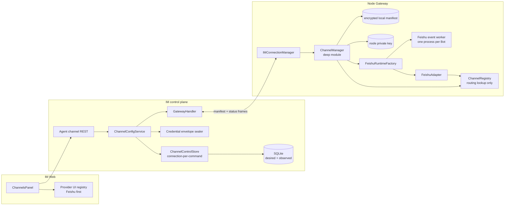
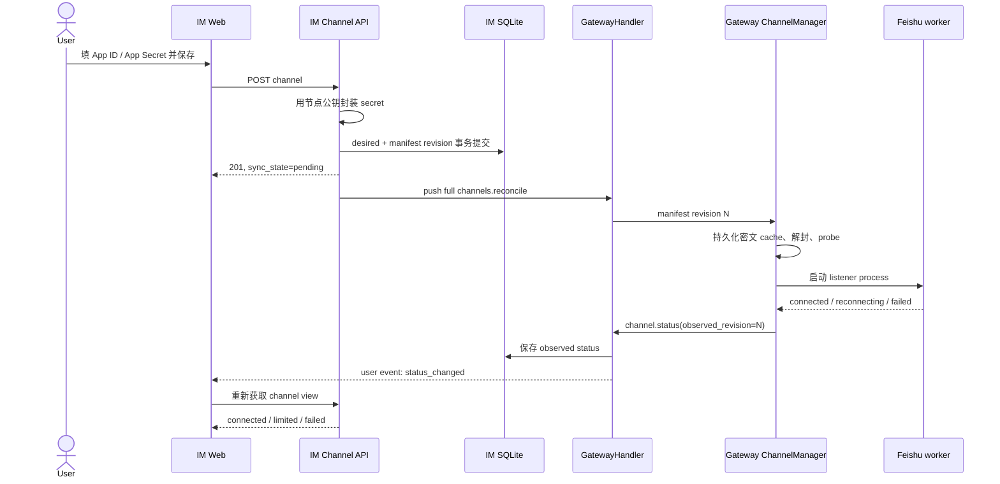
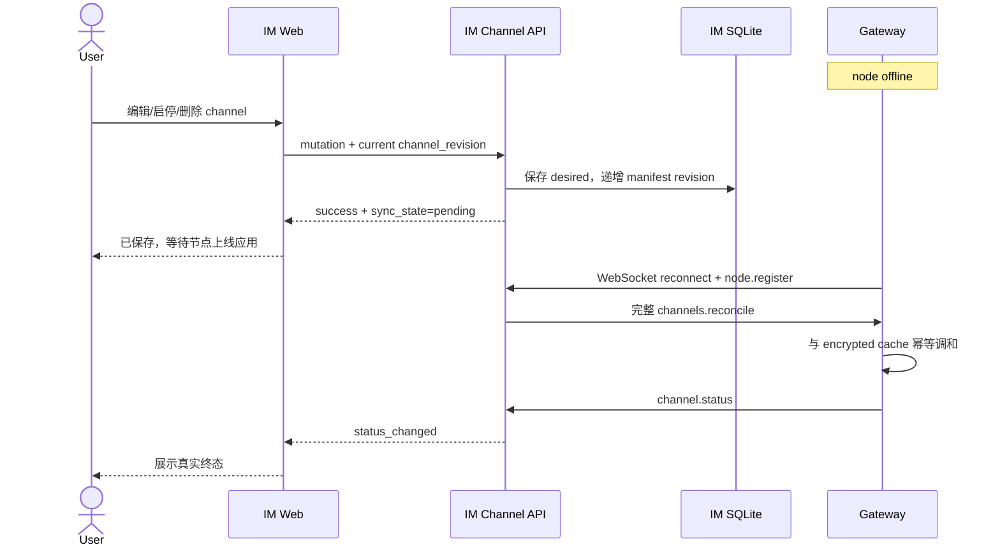
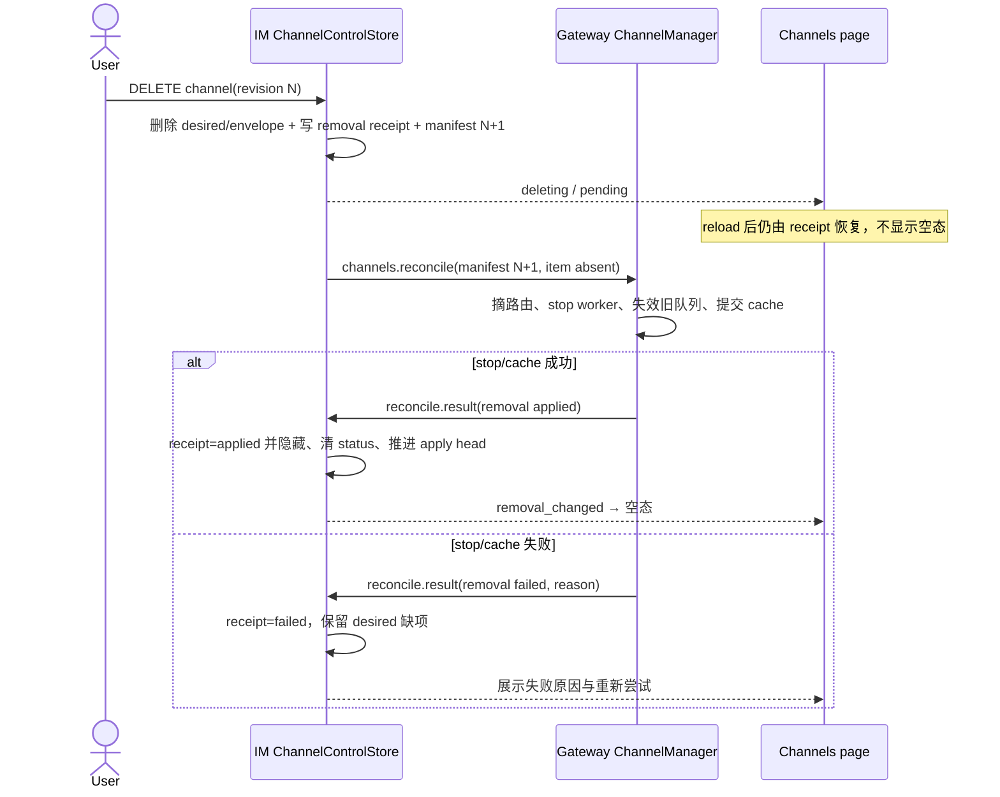
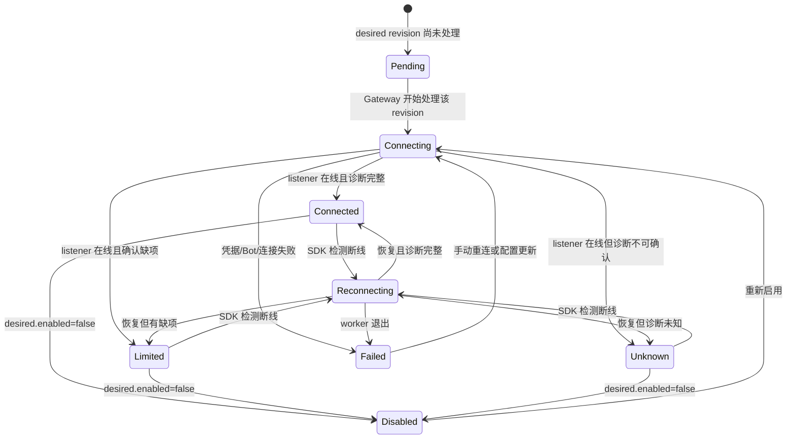

# feat-464: IM 外部通道配置页 — 技术方案

> 对齐: spec.md v1
>
> Unit branch: `unit/feat-464-im-channel-settings`

## Changelog

- v6 (2026-07-15): 禁止已绑定节点跨 owner 改绑；补 status negative ACK/FIFO 释放与 stale runtime quarantine；receipt GC 绑定 applied head 并提供超期终态。
- v5 (2026-07-15): manifest 显式携带未确认 removal intents，按 token 持久 result outbox/幂等 receipt；固定 stop-old → active-new → seq1 → start-new 的 runtime cutover。
- v4 (2026-07-15): 为 DELETE 增加短期 removal receipt、reconcile result/applied head/失败重试，并用 worker incarnation + status sequence 闭合跨 lane 同 revision 顺序。
- v3 (2026-07-15): 闭合 register-before-bind 的可重入初始化状态机、App ID scoped metadata generation、IM 异常/确认 delta、启停原型投影与 worker queue backpressure。
- v2 (2026-07-15): 根据独立 design review 收口 SQLite transaction owner、managed Feishu identity/activation、双向 card-action IPC、显式凭据 keep/replace、状态更新时间、delta-spec 与原型异常/确认态。
- v1 (2026-07-15): 初版三层 channel control plane、节点公钥 envelope、离线 manifest 与三 Milestone 方案。

## 现状分析

### 涉及范围

- `src/IM/frontend/src/features/settings/agents/agent-detail-page.tsx`：Agent 详情页已经有“通道”页签，但当前只渲染占位内容；同页“配置”页签已经提供节点离线时仍可编辑、保存 IM 镜像配置的交互基线。
- `src/IM/api/routes/agents.py`、`src/IM/application/config_service.py`、`src/IM/infra/db.py`、`src/IM/infra/repositories.py`：IM 当前持久化 Agent 配置并用 `profile_version` 做乐观锁，但没有外部 channel 的期望配置、凭据或运行状态模型。
- `src/IM/ws/gateway_handler.py`、`src/personal_assistant/ws/im_connection.py`：IM 与 Gateway 已有长连接、下行通知和 request/result RPC 模式，可承载 channel 调和命令和运行状态回报；当前协议只覆盖 Agent 配置与能力等既有场景。
- `src/personal_assistant/config/local_store.py`、`src/personal_assistant/main.py`：Gateway 当前把 `channels[]` 从本地 YAML 解析为 `ChannelConfig`，启动时一次性构建 adapter；飞书 `appSecret` 以明文保存在 YAML 中。
- `src/personal_assistant/gateway/channel_registry.py`、`src/personal_assistant/gateway/bootstrap.py`：`ChannelRegistry` 只负责注册和查找，进程启动/退出时统一 start/stop，不具备单 channel 幂等新增、替换、停用、删除或状态查询能力。
- `src/personal_assistant/channels/feishu/client.py`、`adapter.py`：已有飞书消息能力、scope 探测及 SDK 重连钩子基础，但权限结果只写日志；现有 `stop()` 不会关闭 SDK WebSocket/线程，不能满足热停用和换密钥语义。
- 当前 `lark-oapi` 的 WebSocket client 使用包级全局事件循环，且没有公开的停止接口。现有“每个 Feishu adapter 各起一个线程”的方式既无法可靠终止，也无法证明多个 Bot 能在同一 Gateway 进程内并行运行。

### 既有约束

- IM 不得 import Agent 内核；IM 与 Gateway 只能通过既有 HTTP/WebSocket 集成面通信。
- Gateway 是外部 IM 主路径的运行时 owner；IM 整体离线时，已运行的飞书 channel 仍须继续工作。
- 配置页既有语义是“IM 保存期望配置，节点在线时推送，离线时等待重连后调和”；通道页应复用该语义，但必须把“保存成功”和“运行连接成功”分开呈现。
- 通道页只管理可配置的外部 channel，不展示内置 `web_relay` / Web IM。
- 当前产品契约允许多个 Agent 分别绑定飞书 Bot，但同一个 Agent 只能绑定一个飞书 Bot；本期前端按 provider 可扩展的多 channel 模型设计，不实现同类型多实例。
- 删除 channel 只删除配置和凭据并停止后续收发，不级联删除既有影子会话和聊天历史。
- App Secret 不得经读取接口回显明文；节点离线时仍允许新增或替换 secret，因此方案必须明确安全的离线持久化、节点密钥丢失和密钥轮换边界。
- 新增测试文件不得以 Milestone 编号命名，且每个新测试文件不超过 400 行。

### 可复用能力

- **改** IM Agent 配置的“持久化期望状态 + 版本 + 在线推送 + 重连调和”模式：复用语义和传输骨架，不把 channel 字段硬塞进 `AgentProfile`。
- **改** IM/Gateway WebSocket 的 request/result 与事件上报模式：增加 channel 领域帧，不新建 Gateway 入站 HTTP 服务。
- **用** `ChannelAdapter` 的消息收发 seam、`InboundPipeline`、`OutboundRouter` 与飞书影子会话路径；本 unit 不重写既有飞书消息语义。
- **不用作生命周期 owner** `ChannelRegistry`：它是浅容器，缺少调和、串行化、状态机、错误归一和真实停止语义。新增的深模块统一封装 adapter 构建、启停、替换、诊断与状态快照；registry 只保留并发安全的路由查找。
- **改** `FeishuClient.has_scope()`：保留三态探测能力，但升级为一次列出 scopes 并产出结构化权限诊断，而不是只打日志。
- **继承** Agent 详情页现有卡片、页签、移动端布局、React Query 加载/重试模式；通道页使用独立表单和保存状态，不能复用“配置”页签的单一 submit footer假装运行状态。

### 相关历史

- `feat-447-feishu-channel` 建立了 `feishu:<agent_id>`、一 Agent 一 Bot、影子会话、外部/内部触发源隔离、群背景上下文和权限审批等现有行为。本 unit 只改变配置入口与生命周期控制，必须保持这些行为不回归。
- `feat-447` 的长青契约仍把本地 YAML 视为 channel 配置入口；本 unit 完成后需在 Gateway `external-channels` 与 IM `agents-nodes` 的最窄 area 中补充控制面增量。
- `refactor-454-gateway-runtime-protocol` 强化了 Gateway 运行时的显式 protocol seam；本 unit 的 channel 调和模块遵循同样的依赖注入和“接口即测试面”原则，不把动态生命周期继续堆进 `main.py`。
- 当前 canonical spec 与代码在“YAML 启动时加载、Gateway 离线自治、IM 配置镜像”上相符；channel 热管理和状态回报尚无契约。另有一个由本 unit 正面解决的实现缺口：飞书 SDK client 没有公开 stop，现有代码无法兑现动态停用/替换。

## 架构总览

本方案把 channel 分成三个互不混淆的层次：

1. **期望状态**：IM `ChannelConfigService` 持久化用户希望存在的外部 channel、版本和加密凭据。
2. **调和与运行**：Gateway `ChannelManager` 从本地密文缓存启动，并在 IM 上线后用完整 manifest 幂等收敛 adapter。
3. **实际状态**：Gateway 把连接、重连、失败和权限检查结果上报给 IM；页面用期望 revision 与已处理 revision 的差异表达“等待应用”。

`ChannelManager` 是本 unit 的深模块。其调用者只需提交完整 manifest、要求重连或读取快照；adapter 替换顺序、本地缓存、密钥解封、Feishu worker 进程、错误分类和状态上报全部藏在模块内部。



Before：YAML 是唯一 channel 配置源，adapter 只在 Gateway 启动时构建，权限问题只在日志里可见。

After：IM 是已初始化节点的期望状态控制面；Gateway 本地密文 manifest 保证 IM 离线自治；用户在同一页面区分“已保存”“等待节点应用”和真实连接/权限状态。

## 关键决策

### 决策 1：凭据使用节点公钥信封加密，IM 与本地缓存都不持久化明文

**每个 Gateway 节点持有稳定的 X25519 私钥，IM 只保存公钥；App Secret 以版本化的 X25519 + HKDF-SHA256 + AES-256-GCM envelope 存储。**

- Gateway 在 config 目录生成 `channel-credentials-v1.pem`，权限固定为 `0600`；`key_id` 为公钥摘要。私钥不通过 IM 协议上传。
- `node.register` 携带公钥、`key_id` 和算法版本，IM 缓存在 `node_credential_keys`。
- 浏览器只通过认证 HTTPS 提交新 secret。IM 在请求内存中立即生成 envelope，持久化前删除明文字段；响应、异常、审计事件和日志都禁止包含 secret。
- envelope 的 AAD 固定包含 `owner_id/node_id/agent_id/channel_id/provider/credential_revision`，防止把某节点或 Agent 的密文替换到另一条配置。`credential_revision` 只在 replace secret 时递增；普通配置更新选择 keep 时可原样复用旧 envelope，不要求 IM 解密后重封装。
- Gateway 本地缓存保存同一 envelope，运行时用私钥解封；因此 Gateway 重启而 IM 离线时，已配置外部 channel 仍能启动。
- GET/list 响应只返回 `secret_configured: true|false` 和 `credential_key_id`，绝不返回 envelope 或明文。
- POST 必须使用 `credentials.mode=replace`；PATCH 使用 `keep` 或 `replace`。不存在“传空字符串表示保留”的隐式语义。
- PATCH 若 normalized App ID 与已保存值不同，必须在同一请求使用 `credentials.mode=replace`；App Secret 属于具体应用，不能把旧 App 的 secret 隐式带到新 App。服务端以 `422 channel_credentials_required` 拒绝 App ID change + keep，前端检测到 App ID 变化时自动切到 replace 并显示原因，改回原 App ID 才允许 keep。
- 节点从未登记公钥时，离线新增/替换 secret 返回 `409 channel_credential_key_unavailable`，页面说明“需让节点至少上线一次以建立安全凭据存储”。已有缓存公钥时，节点离线不影响保存。
- 节点私钥丢失、`key_id` 变化或 Agent 迁移到另一节点时，旧密文不自动搬运；配置进入 `credential_reentry_required`，用户必须重新输入 secret。安全失败优先于尝试降级解密。

拒绝 IM master key：它让 IM 具备解密所有节点凭据的能力，而且 Gateway 离线自治仍需要第二套本地加密。拒绝只存 Gateway：它无法满足节点离线时新增或替换凭据。

由于 IM 与 Gateway 不能互相 import，封装/解封分别落在各自包内，通过 envelope v1 固定测试向量做跨包 contract，不引入新的共享顶层包。

### 决策 2：期望状态与实际状态分表、分版本

**“配置保存成功”和“运行连接成功”是两个正交状态；页面不得从节点在线状态推断 channel 已连接。**

- `agent_channels` 保存期望配置和 `channel_revision`。
- `agent_channel_status` 保存 Gateway 最近处理的 `observed_revision`、连接状态、诊断状态、错误码、检查项和 IM 接收时间。
- `channel_manifest_heads` 为每个节点保存 desired `manifest_revision`、最近完整成功的 `applied_manifest_revision`、`last_apply_error_json` 与 `initialized_at`。任何 create/update/enable/disable/delete 都在同一事务内递增 desired revision；apply head 只能由当前绑定 Gateway 的 reconcile result 单调推进。
- IM 每次都向 Gateway 下发完整 manifest。运行面的删除仍由“更高 manifest revision 中缺少旧 channel_id”表达；控制面另存无凭据的短期 `agent_channel_removals` receipt。Gateway 确认旧 runtime 已停止和本地 cache 已提交后，receipt 标成 applied、立即从产品投影隐藏，并只为 result 幂等保留 7 天；它不是永久投递 tombstone。
- 页面计算：
  - `observed_revision < channel_revision` 或无 status：`pending`，文案“配置已保存，等待节点应用”。
  - revision 相等：展示真实 `connected/limited/reconnecting/failed/disabled`。
  - Gateway 报告某 revision 处理失败时，`observed_revision` 仍推进到该 revision，连接状态为 `failed`；它不再被误报为“仍在排队”。
  - pending/failed removal receipt 存在：展示 `deleting`，不显示空态；若 outcome failed，展示停止失败原因与“重新尝试应用”。只有 removal applied result 把 receipt 标成 applied 并隐藏后才显示空态。
- IM 以接收时间作为展示新鲜度，拒绝比当前 channel revision 新、归属不符或比现有 observed revision 旧的上报；revision 相等时再以当前 `runtime_incarnation/status_sequence` CAS，接收时间不能用于覆盖因果顺序。

**所有 channel control 数据库操作统一由 `ChannelControlStore` 串行化，禁止新 repository 直接复用现有 app-scoped SQLite connection 开事务。** 当前 IM 的同一 connection 会被同步 route worker 与异步 Gateway handler 跨线程共享；仅在 service 里写“同一事务”无法阻止别的请求在同一 handle 上交错。

- `ChannelControlStore` 以 `resolved_db_path` 注入 connection factory；每个 list/read/desired mutation/bootstrap/status command 都打开独立短连接，统一设置 `foreign_keys=ON`、WAL 与 `busy_timeout=5000ms`。测试使用临时文件数据库，不使用彼此隔离的 `:memory:` handle。
- create/update/enable/disable/delete 与 bootstrap 使用 `BEGIN IMMEDIATE`：在一个数据库事务内核对 Agent 的 `owner_id/node_id`、检查 `channel_revision`、写 desired row、递增 manifest head，并读取该 revision 对应的完整 manifest snapshot。SQLite 写锁是跨 connection、线程和进程的唯一 transaction owner；不会出现两个旧 revision 同时成功。
- `channel.status`、provider metadata 与 `channels.reconcile.result` 也只经该 store，以独立 `BEGIN IMMEDIATE` 做归属、revision 与 stale 检查；HTTP mutation 和 Gateway WebSocket handler 不直接调用底层 channel repository/connection。
- 事务 commit 后才 best-effort push 返回的 manifest snapshot。并发的下一次 mutation 可以随后推送更高 revision；Gateway 按 manifest revision 丢弃旧快照。超过 busy timeout 返回可重试的 `503 channel_store_busy`，不得在共享 connection 上降级执行。

### 决策 3：IM 保存完整 desired manifest，Gateway 用本地缓存保证离线自治

**控制面在线时 IM desired state 是权威；运行面启动时 Gateway encrypted cache 是可用性来源。**

- Gateway 启动先调用 `ChannelManager.start_cached()`，不等待 IM，保证已经配置的飞书 channel 可继续收发。
- Gateway 完成 `node.register` 后，IM 下发当前完整 manifest；`ChannelManager.reconcile()` 幂等收敛并原子覆盖本地缓存。
- REST mutation 先提交 IM 事务，再 best-effort push 新 manifest。Push 失败不回滚已保存配置，响应明确返回 `sync_state=pending`。
- 重连时无需重放每条离线命令；完整 manifest + 单调 revision 天然把新增、编辑、启停和删除收敛到最终状态。
- 同一 manifest 重复下发不重复重启 adapter；旧 manifest 被忽略。
- `ChannelManager.reconcile()` 在 desired items 处理到终态、过期 runtime 完成 stop、旧 generation 队列失效且密文 cache 原子提交后，回传 `channels.reconcile.result`。空 manifest 也必须回 result；删除只有出现在 `removal_outcomes.applied` 后才算实际完成。
- IM 在每次 `channels.reconcile` 中附带全部尚未确认的无凭据 `removals[]`，每项固定 `removal_token/channel_id/agent_id/provider/deletion_manifest_revision`。因此离线 create→delete-before-first-sync 时，Gateway 即使从未见过 channel，也能在确认 registry/cache 均不存在该 identity 并提交当前 cache 后回 `already_absent`；absence 不再要求 Gateway 从旧 cache 猜 channel_id。
- result 包含 `manifest_revision/outcome/applied_channel_ids/removal_outcomes[]/failures[]`。全部处理完成（配置无效但已形成明确 failed status 也算已处理）时 outcome 为 `applied` 并推进 node applied head；任何 runtime 无法停止或 cache 无法提交时为 `retryable_failed`，记录 apply error 且不推进 applied head。已成功的 removal outcome 可独立把对应 receipt 标成 applied/hidden，避免被无关 channel 的失败阻塞。
- `ChannelControlStore` 只接受当前绑定 node 的 result。applied head 取单调 max；只有 result manifest 等于 current desired manifest 才更新 current `last_apply_error`。removal receipt 仅在 result revision 不小于其 `deletion_manifest_revision`，且 `removal_token/channel_id` 同时匹配、outcome 为 `applied|already_absent` 时标成 applied；旧 manifest result 不能确认未来删除。
- manager 分开记录 `last_seen_manifest_revision` 与 `last_applied_manifest_revision`：相同 revision 在上次 `retryable_failed` 时必须重试未完成动作；已 applied 的重复 manifest 只对 runtime no-op，仍回放 result。在线时按有界退避自动重试；页面“重新尝试应用”只重新 push当前完整 manifest，不制造新 desired revision。
- 本地 cache transaction 同时持久化结构化 `reconcile_result_outbox`，不是单槽 last result：node head result 可合并到最高 applied revision；每个 removal outcome 以 `removal_token` 独立保留，后续 manifest/result 只能更新同 token outcome，不能被无关新 revision 覆盖。发送 result 时组合当前 head + 全部未确认 token；收到 IM 对各 token 的 `accepted|already_applied|already_applied_by_head` ack 后才逐项清除。Gateway restart/WS reconnect 先补发 outbox，ACK 丢失后跨任意 revision 仍保真。
- IM 首次接受 applied/already_absent 时把 removal receipt 标成 `applied` 并立即从 GET/唯一性 guard 隐藏。后台只在 `applied_at` 超过 7 天且同 node `applied_manifest_revision >= deletion_manifest_revision` 时清理；若 applied head 尚未覆盖则继续保留隐藏 receipt，不按墙钟单独删除。
- receipt 已清理后的 token 重放仍有 terminal 结果：在当前绑定 node/owner 匹配、同 channel_id 无 active desired、且 applied head 已覆盖 deletion revision 时，IM 返回 `already_applied_by_head`，Gateway 从 per-token outbox 删除；任一条件不满足返回 fatal/unknown 而不猜测成功。由此 ACK 丢失并离线超过 retention 不会形成永久 outbox，partial removal 又不会被未覆盖的 node head误确认。
- 本地 cache 只供启动和 IM 离线期间续航，不接受 UI 之外的第二写入路径。
- cache header 固定记录 `node_id/key_id/manifest_revision`；当前 config 的 `node_id` 与 cache 不一致时拒绝加载并上报隔离错误，不能把 worktree 或另一节点的密文 manifest 当成本机配置。

### 决策 4：用 `ChannelManager` 作为唯一动态生命周期 owner

**`main.py` 只装配一次 `ChannelManager`；所有 managed external channel 的新增、替换、停用、删除、重连和状态都穿过它。**

外部接口保持小而完整：

```python
class ChannelManager:
    async def start_cached(self) -> tuple[ChannelStatusSnapshot, ...]: ...
    async def reconcile(self, manifest: ChannelManifest) -> ReconcileReport: ...
    async def reconnect(self, channel_id: str) -> ChannelStatusSnapshot: ...
    async def close(self) -> None: ...
```

- `ChannelManager` 内部持有 manifest store、credential opener、provider runtime factories、并发安全 registry 和 status sink。
- `channel_id` 是只在 control-plane、cache、status 与 lifecycle command 中使用的稳定 UUID；runtime factory 必须由受信 provider + Agent 派生稳定 `runtime_name`。飞书永远是 `feishu:<agent_id>`，该值继续写入 `InboundMessage.channel_name`、outbound route 与 session key，禁止把 UUID 渗入既有消息/影子会话身份。
- Feishu factory 同时接管既有激活副作用。其 `FeishuActivationPolicy` 是唯一 owner：enabled channel 启动前，用现有 Agent config sync seam 为显式非空 skill allowlist 幂等加入 `feishu-doc`，按 `profile_version` 冲突后 refetch/retry，持久化并刷新 live pipeline；disable/delete 不自动移除，避免删除用户显式选择且保持现有单向补充语义。若 IM 暂不可用，已持久化过的本地 Agent config 继续生效；尚未完成的激活写入 cache pending marker、通道可降级连接但诊断显示 `feishu_doc_activation_pending`，重连 IM 后重试，完成前不得报告 diagnostics complete。旧 `ensure_feishu_doc_skill_for_feishu_agents()` 改为把 legacy/bootstrap item 送入同一 policy，不再另行枚举静态 YAML。
- `agent_channels.provider_runtime_json` 保存 Gateway 发现的非敏感 `bot_open_id/owner_open_id`，但其 owner 是具体 Feishu App identity，不是抽象 provider。IM 从 normalized App ID 计算 `provider_identity_fingerprint=SHA-256("feishu\0" + app_id)`，并保存单调 `provider_identity_revision`；两者随完整 manifest 下发，fingerprint 不由浏览器或 Gateway 自报。
- App ID 不变的 secret replace 可以保留 owner/bot metadata；App ID 发生变化时，`ChannelControlStore` 在同一个 desired transaction 内递增 `provider_identity_revision`、清空全部 `provider_runtime_json`、递增 channel/manifest revision。新 runtime 必须重新 probe bot，并由新 App 下首个合法 sender 重新绑定 owner，旧 App 的 `open_id` 不能继承。
- adapter binder 只调用 `ChannelManager.record_provider_metadata(channel_id, generation, patch)`。`generation` 固定包含 `provider_identity_fingerprint/provider_identity_revision/channel_revision/credential_revision` 并在 runtime 创建时捕获；manager 先对当前 cache 做 generation CAS，再经认证 WS 上报相同 generation。IM `ChannelControlStore` 只接受当前绑定 node 且四项 generation 与 current row 完全一致的 patch，旧 worker、旧 cache 和离线补传一律返回 stale，不递增 manifest。
- owner 写入使用 generation 内的 set-if-null first-wins；并发的第二个 sender拿到权威既有 owner，不覆盖。Bot probe 的 `bot_open_id` 走同一路径但使用独立字段 CAS。合法 patch 先原子写本地 cache，再上报 IM；IM 离线时留在 cache，重连后只有仍匹配最新 manifest generation 的 patch 才补传。审批 callback 从 manager 当前 generation metadata 读取 owner，不再回写或遍历静态 `config.channels`。
- metadata 变化不改变稳定 `runtime_name`；owner 变化只刷新 binder，App identity 变化进入 provider runtime fingerprint 并触发安全替换。迁移与 UI 新建共用上述 generation 规则，浏览器不能读写 provider metadata。
- 调和按 channel 串行、跨 channel 可并行；同一 channel 不允许 reconcile 与 manual reconnect 交错。
- 替换配置时先做不启动 listener 的凭据/Bot probe，再从 registry 摘除旧 adapter、真实 stop 旧 worker、启动新 runtime，最后注册新 adapter。新凭据无效时旧 adapter 也会停止，避免继续使用用户已经替换掉的凭据。
- disable/delete 先从 registry 摘除，阻止新 outbound，再停止 worker；delete 额外从本地 manifest 删除，但不触碰 IM conversations/messages。
- 静态 `web_relay` 继续由 bootstrap 管理，不进入 managed manifest，也不出现在通道页；`ChannelManager` 拒绝 provider/name 为 `web_relay` 的项目。
- `ChannelRegistry` 增加锁、`replace/remove`，但不获得调和规则。删除 `ChannelManager` 后复杂度会重新散回 WS handler、main 和 adapter，因而该模块通过 deletion test。

### 决策 5：Feishu WebSocket listener 隔离为每 Bot 一个可终止进程

**父 Gateway 保留 Feishu adapter、REST client、approval state 与 kernel decision callback；只把 SDK WebSocket listener 放入独立 worker process，通过有界事件队列 + 双向 card-action RPC pipe 通信。**

- 现有 SDK 的全局 event loop 和无 public stop 使线程模型无法可靠支持热停用、多 Bot 或换密钥。
- 每个 Feishu channel 的 worker process 内独占 SDK event loop。IPC 分三条 lane：普通消息进入固定容量 FIFO；非终态连接状态写入 latest-value mailbox（同 channel 的 `connecting/reconnecting` 可合并）；`failed/connected` 等终态与 stop/error 走 priority control pipe，不与消息争容量。card action 使用下面的独立 duplex RPC。
- 三条 lane 不拥有状态顺序；唯一顺序 owner 是 parent 创建的 `worker_incarnation` + 该 incarnation 共享的单调 `status_seq`。所有 child/parent 产生的连接状态在进入任一 lane 前取得 sequence，frame 都携带二者；parent 只接受当前 active incarnation 且 `status_seq > last_forwarded_seq` 的状态，再经单一串行 status sink 上报。mailbox 可以跳过中间非终态，但不能让较小 sequence 覆盖较大 sequence。
- 新 runtime cutover 只有一个合法顺序，并在 per-channel lifecycle lock 内完成：①分配 incarnation B，但不启动 B、不发 B 状态；②从 registry 摘路由并 stop/join incarnation A；③原子设置 `active_incarnation=B,last_forwarded_seq=0`，从此 A 的任何 lane/frame 都拒绝；④经同一 serial status sink 上报 `B seq=1, instance_started=true, connecting`；⑤把共享 counter 初始化为 1 后启动 B，child/parent 后续只能产生 seq≥2。初次启动/Gateway restart 视作无 A；若 A 无法停止则不切 B，保持可见 failed。IM 只有在当前 node、current channel revision 且合法 seq=1 `instance_started` 时切换 incarnation，之后以 `(runtime_incarnation,status_seq)` CAS 拒绝迟到状态。SDK 自动 reconnect 沿用同一 incarnation 并递增 sequence。
- seq=1 是可重放的 incarnation barrier：parent 在启动 B 前先把 barrier 原子写入本地 status outbox；不等待 IM 在线即可启动 B，保持外部 IM 自治。barrier 获得 IM `accepted|already_current` ack 前，同 incarnation 的后续状态只在 outbox 合并为 latest snapshot，不越过 barrier 上报；Gateway reconnect 先重放 barrier，ack 后再发送最新 sequence。新 incarnation 会原子替换旧 incarnation 尚未确认的 barrier/snapshot，旧者因 inactive 不再有效。
- `channel.status` 的 correlated result 不是 generic error，固定 outcome：`accepted|already_current|terminal_stale_revision|terminal_channel_removed|retryable_store_busy|fatal_owner_mismatch`。IM 对已认证但语义过期的 barrier 必须回正常 terminal result，确保现有单槽 upstream FIFO 可以 dequeue；generic `error` 只留给无法关联/协议损坏。
- Gateway 收到 `terminal_stale_revision` 时，原子丢弃该 channel/revision 的 barrier 与 latest snapshot，释放当前 pending frame，等待随后完整 manifest 收敛；收到 `terminal_channel_removed` 时还立即从 registry 摘除并 quarantine/stop cached runtime，随后由 reconcile removal intent 完成 cache/result 闭环。两者都不能把旧状态改写成新 revision 重试。
- `retryable_store_busy` 同样先 dequeue 当前 WS frame，但保留 outbox 并在退避后重新入队尾部，不阻塞后续 register/reconcile result；`fatal_owner_mismatch` 关闭 WS、停止并 quarantine 全部 managed runtimes、保留密文 cache 供修复取证，不继续外部收发。result handler 必须按 `request_id` 释放 `_awaiting_ack_type`，不能只记录 error。
- 用户消息不可静默丢弃。worker 向 FIFO `put` 最多等待 2 秒；满载后通过 priority pipe 上报 `event_backpressure` 并关闭当前 WS worker，使 channel 进入可见 `failed` 和有界退避重启，而不是继续宣称 connected。平台可能重投的 event/message ID 继续由既有去重路径处理；方案不把重投当作无损保证，页面和日志必须暴露过载失败。
- parent 记录 queue depth、连续满载次数和最近 drain 时间，不记录消息 payload；健康监视发现 consumer 卡住同样上报 `event_backpressure`。小容量压力测试固定 FIFO 顺序、status coalescing、priority error 不被饿死与无 silent drop。
- 状态压力测试主动逆序调度 mailbox 与 priority pipe，验证 `reconnecting(seq=N+1)` 不会被迟到 `connected(seq=N)` 覆盖，恢复后的 `connected(seq=N+2)` 也不会停留在旧 failed；同 revision、不同 incarnation 的旧帧必须双端拒绝。
- Card action 保留 SDK 要求的同步 response：worker callback 生成唯一 `request_id` 和 monotonic deadline，通过 duplex control pipe 发送 `card_action.request`；父进程把 payload 交给现有 approval callback，在 deadline 内回送 `card_action.result(request_id, response_payload)`，worker 校验 correlation 后构造 `P2CardActionTriggerResponse` 返回 SDK。approval first-wins、resolved/expired 与 permission decision 状态仍只在父进程，子进程不持 kernel 或审批状态。
- 每个 worker 有 pending RPC map；重复、未知或迟到 result 丢弃并记录不含 payload 的结构化错误。父进程在处理前检查 deadline；worker 超时、pipe EOF 或 parent shutdown 时返回确定的“暂时无法处理，请重试”卡片响应且不在子进程应用决定。父进程若已经完成决定但 result 丢失，后续点击仍由既有 first-wins 状态返回最终 resolved card。
- outbound send、reaction、chat info、history 和 scope probe 保持在父进程 REST client，不把 Gateway pipeline、GroupContextStore 或权限 broker 搬进子进程。
- `stop()` 先停止接收新 action、把父端 pending RPC 以 shutdown error 结算，再关闭 IPC、向 worker 发终止信号、限时 join，超时后 terminate；worker crash 会使父端 pending RPC 失败并上报 `failed`。正常 Gateway shutdown 给当前 generation 已入队消息最多 5 秒 drain；disable/delete/replace 已先使 generation 失效，因此旧 generation 队列立即丢弃且只记录 drop count，绝不在停用后路由。进程退出由 OS 关闭 WebSocket，完成前不得发布 `disabled`。
- SDK 初次连接状态由一个很薄的兼容 adapter 观察 `_connect`，重连使用 SDK 1.6.9 的 `on_reconnecting/on_reconnected`；依赖下限提升为 `lark-oapi>=1.6.9,<2`，并以 contract test 锁住该私有 seam。SDK 2.0 升级必须显式适配，不能静默猜测。
- worker 异常退出由父进程观察并上报 `failed`；由 SDK 自身触发的暂时断线显示 `reconnecting`，不销毁 desired config。

拒绝继续使用 daemon thread：它无法兑现 stop，且第二个 WSClient 会争用包级事件循环。拒绝重写飞书 WebSocket 协议：维护成本和协议漂移风险远高于隔离官方 SDK。

### 决策 6：运行状态与权限诊断分开建模

**连接状态回答“链路是否在跑”，诊断状态回答“承诺的能力是否完整”；权限检查失败不得伪装成权限缺失。**

`connection_state`：

- `disabled`
- `connecting`
- `connected`
- `reconnecting`
- `failed`
- `credential_reentry_required`

`diagnostics_state`：

- `complete`
- `limited`：已确认缺少一项或多项权限/平台配置，但可继续使用剩余能力。
- `unknown`：scope list 或某项检查暂时无法完成。

Feishu provider 内部维护 capability catalog，每项包含 `check_id`、可接受 scopes、受影响能力、严重度和修复文案。首版至少覆盖当前代码真实使用的能力：

| 检查 | 可接受权限/配置 | 缺失影响 |
|---|---|---|
| 单聊接收 | `im:message.p2p_msg:readonly`（兼容现有旧 scope） | 无法收到用户私聊 |
| 群聊 @Bot 接收 | `im:message.group_at_msg:readonly`（兼容旧 `im:message.group_at_msg`） | 群中 @Bot 不触发 |
| Bot 发消息 | `im:message:send_as_bot` 或 `im:message` | Agent 无法回复 |
| 普通群消息 | `im:message.group_msg` | 未 @ 消息无法进入群背景上下文 |
| 历史消息 | `im:message:readonly` 或 `im:message`，群聊同时要求 `im:message.group_msg` | 断线补拉/群历史上下文不完整 |
| THINKING reaction | `im:message.reactions:write_only` 或 `im:message` | 思考表情不可用，消息主链路仍可用 |
| 群信息 | `im:chat:readonly`、`im:chat:read` 或 `im:chat` | 群影子会话标题可能退化为 ID |
| Bot/长连接/事件订阅 | Bot probe、worker status；事件订阅无法由现有 API 确认时为 unknown | 无法接收事件或状态待确认 |

飞书官方当前明确：接收普通群消息需要 `im:message.group_msg`；发送消息可用 `im:message:send_as_bot` 或 `im:message`；reaction 可用 `im:message.reactions:write_only`；群信息可用 `im:chat:readonly`。实现时以 provider catalog 常量集中维护，不把 scope 字符串散落在 UI。

每个诊断项返回：

```json
{
  "check_id": "feishu.group_messages",
  "state": "missing",
  "required": ["im:message.group_msg"],
  "effect": "未 @Bot 的群消息不会进入群背景上下文",
  "remediation": "在飞书开放平台为应用添加该权限并发布版本"
}
```

前端展示 raw scope、影响和修复方向，并统一链接到用户指定的飞书开放平台入口：
`https://open.feishu.cn/page/launcher?from=backend_oneclick`。

### 决策 7：REST 使用通用 channel 资源，provider 表单留在前端 registry

**HTTP 资源、desired/observed 模型和列表卡片通用化；飞书字段验证与表单通过 provider registry 扩展。**

- 不增加动态 provider catalog HTTP 接口：本期只有一个真实 provider，服务端动态 schema 会制造浅层元数据协议。
- 前端 `CHANNEL_PROVIDERS` registry 负责 provider label、图标、说明和 form renderer；列表、状态、动作和错误处理是通用组件。
- IM 服务端用 provider validator registry 校验 `config_json` 与 credential 字段，当前只有 Feishu adapter，测试使用 in-memory fake 而不是向产品暴露假 provider。
- 唯一约束为 `UNIQUE(owner_id, agent_id, provider)`；`channel_id` 使用稳定 UUID，避免未来允许同类型多实例时重做所有路由。

### 决策 8：旧 YAML 只做一次 bootstrap，初始化后“缺失”才具有删除语义

**用 node manifest head 的 initialized 状态消除“IM 没配置”和“用户删除了全部配置”的歧义。**

首次初始化不是一次性的 register 回调，而是 IM `ChannelControlInitializationCoordinator` 管理的可重入状态机：只有 `node registered + owner bound + manifest head uninitialized` 三个条件同时成立才发送 bootstrap request。Gateway register 完成、人工/auto bind confirm 提交完成、WebSocket reconnect 三类事件都只调用同一个 `ensure_initialized(node_id)`；coordinator 以 per-node lock 合并并发触发，已经 initialized 时只下发当前 manifest，重复 bootstrap response 由 `ChannelControlStore` 幂等拒绝或返回既有 head。

- `node.register` 可能早于 owner binding：IM 先在当前 `GatewayConnection` 暂存 credential public key，不创建带错误 owner 的 channel row；register ack 发出后异步触发 coordinator，未绑定时只进入 `waiting_for_owner`。
- `BindService.confirm()` 在 owner/node/profile 事务提交后调用注入的 `node_bound` event sink；manual 与 auto bind 共用同一 confirm 路径。coordinator 若看到当前 WS 仍在线，会立即发送 `channels.bootstrap.request`，无需 Gateway 断线重连；若不在线，下一次 register/reconnect 继续同一状态机。
- 已绑定节点 register/reconnect 时，coordinator 把暂存公钥落入该 owner 的 `node_credential_keys` 后再 bootstrap/reconcile。request/response 有 `request_id`，失败保持 head 未初始化并在当前连接上有界退避重试；进程重启后条件仍可由持久 head 重建，不依赖内存 flag。
- WS handler 必须在 `node.register` ack 已发送后调度 coordinator，避免 bootstrap frame 先于 register ack；HTTP bind route 不直接拼 channel 协议，只发布 committed binding event。

**本期明确禁止已绑定节点跨 owner 改绑，不自动迁移或 relabel channel 凭据。** envelope AAD、manifest head、removal receipt 和 Gateway cache 都绑定 owner；直接改写 owner 会造成跨租 Bot 继续运行或密文不可解。

- `BindService.confirm_bind()` 在同一事务先读取 `nodes.owner_id`：为空时正常首次绑定；与请求 owner 相同则幂等确认并再次触发 initialization coordinator；与请求 owner 不同则返回 `409 node_owner_transfer_not_supported`，不修改 node、Agent profile、channel/head/key/removal 任何 row。
- manual 与 auto bind 走同一 guard，不能由 auto-bind 绕过。拒绝结果不触发 `node_bound` event，也不改 Gateway 本地 cache；旧 owner 的 channel 继续属于旧 owner，旧/新 owner API 都按既有隔离规则检查。
- owner transfer 是独立的安全运维流程，需先停 Gateway、撤销 channel/cache/凭据并重新录入，不在本 unit 内实现。当前用户若确需换 owner，必须配置新的 `node_id`；cache header 的 node mismatch 会拒绝旧 encrypted manifest，防止旧 Bot 在新节点身份下启动。

- Gateway 未配置 IM，或从未成功初始化 channel control 时，继续按旧 YAML 启动，保持 standalone 行为。
- 首次连接支持该能力的 IM 时：
  1. Gateway 先注册 credential public key。
  2. 若 `channel_manifest_heads.initialized_at IS NULL`，IM 请求 `channels.bootstrap`。
  3. Gateway 把旧 YAML 中 `feishu:<agent_id>` 转成通用 desired items，并用本机公钥封装 secret。
  4. IM 在一个事务内校验 Agent/node/owner、写入 items、设 initialized、生成 manifest revision 1。
  5. Gateway 收到权威 manifest、写入 encrypted cache 后，从 YAML 中移除 managed `appSecret`，只保留非敏感 `credentialRef`/迁移标记；`web_relay` 不变。
- initialized 之后，IM 的空 manifest 表示“所有 managed external channels 已删除”，Gateway 不再从旧 YAML 复活它们。
- 提供仅供运维回退的 `scripts/channel-control-export-legacy.py`：用节点私钥把本地 cache 导出回旧 YAML 结构。正常运行和 UI 不调用它。

### 决策 9：Milestone 按用户可用的纵向切片顺序实施

**本 unit 预计超过 20 个生产/测试文件、远超 800 行且包含密码学、跨进程和前端状态机，因此拆成三个串行纵向 Milestone。**

- M1 交付“在线新增/编辑/连接”，把安全控制面、真实 stop 和基础通道页一起打通。
- M2 交付“离线收敛与完整生命周期”，包括 legacy migration、本地启动、启停/删除/重连。
- M3 交付“可操作权限诊断和所有异常/响应式状态”，并完成真栈验收。
- 三个 Milestone 都跨 IM、Gateway 和前端形成可观察能力，不采用“先全部后端、再全部前端”的横切拆法；因共享文件较多，明确串行而不伪装成可并行。

## 接口与数据流

### IM 数据模型

```sql
node_credential_keys(
  node_id PRIMARY KEY,
  owner_id,
  key_id,
  algorithm,
  public_key,
  updated_at
)

channel_manifest_heads(
  node_id PRIMARY KEY,
  owner_id,
  manifest_revision,
  applied_manifest_revision,
  last_apply_error_json,
  applied_at,
  initialized_at,
  updated_at
)

agent_channels(
  channel_id PRIMARY KEY,
  owner_id,
  agent_id,
  node_id,
  provider,
  enabled,
  config_json,
  provider_identity_fingerprint,
  provider_identity_revision,
  provider_runtime_json,
  credential_envelope_json,
  credential_key_id,
  credential_revision,
  channel_revision,
  created_at,
  updated_at,
  UNIQUE(owner_id, agent_id, provider)
)

agent_channel_removals(
  channel_id PRIMARY KEY,
  removal_token UNIQUE,
  owner_id,
  agent_id,
  node_id,
  provider,
  display_config_json,
  deleted_channel_revision,
  deletion_manifest_revision,
  apply_state,
  apply_error_code,
  apply_error_message,
  applied_at,
  expires_at,
  created_at,
  updated_at
)

CREATE UNIQUE INDEX one_pending_removal_per_provider
ON agent_channel_removals(owner_id, agent_id, provider)
WHERE apply_state != 'applied';

agent_channel_status(
  channel_id PRIMARY KEY,
  node_id,
  observed_revision,
  runtime_incarnation,
  status_sequence,
  connection_state,
  diagnostics_state,
  status_code,
  status_message,
  checks_json,
  received_at
)
```

- `agent_channels` 删除不级联外部影子会话；它与 conversations/messages 不建级联 FK。DELETE 同事务删除 desired/envelope、保留最后 status、写无 secret 的 removal receipt；receipt applied 后清理 status，receipt 本身仅作限时 idempotency 记录。
- removal pending/failed 时同 owner/agent/provider 的 POST 返回 `409 channel_deletion_pending`，防止旧 runtime 尚未停止就建立同 provider 新实例；applied receipt 不参与 partial unique guard。`display_config_json` 只保留渲染所需的脱敏 App ID 后缀。
- 所有 channel command 都由 `ChannelControlStore` 在自己的短连接事务内查询 `agent_profiles` 确认 `owner_id/node_id`；既有只读代码若需单独查询 Agent，实际 repository 入口为 `AgentProfileRepository.get_profile_for_owner()`。
- SQLite migration 只新增表，不改写既有 Agent/Conversation 数据。

### HTTP 接口

| 方法 | 路径 | 行为 |
|---|---|---|
| GET | `/im/v1/agents/{agent_id}/channels` | 返回 active `ChannelView` 与 pending/failed `ChannelRemovalView`、desired/observed/sync 状态；有 removal 时不得渲染空态，加载失败不得返回空数组兜底 |
| POST | `/im/v1/agents/{agent_id}/channels` | 创建 provider 实例；Feishu 要求 `app_id` 和 `credentials.mode=replace` |
| PATCH | `/im/v1/agents/{agent_id}/channels/{channel_id}` | 带 `channel_revision` 乐观锁更新 config、enabled、keep/replace credential |
| DELETE | `/im/v1/agents/{agent_id}/channels/{channel_id}?channel_revision=N` | 删除 desired config/envelope、写短期 removal receipt、递增 manifest；返回 `ChannelRemovalView`，不删历史 |
| POST | `/im/v1/agents/{agent_id}/channels/{channel_id}/actions/reconnect` | 不改 desired revision，在线时触发同 revision 重连；离线返回明确 409 |
| POST | `/im/v1/agents/{agent_id}/channel-removals/{channel_id}/actions/retry` | 节点在线时重新 push 当前完整 manifest，不创建 desired revision；离线返回明确 409 |

统一响应 `ChannelView`：

```json
{
  "channel_id": "ch_...",
  "provider": "feishu",
  "enabled": true,
  "config": {"app_id": "cli_..."},
  "secret_configured": true,
  "channel_revision": 3,
  "sync_state": "applied",
  "observed": {
    "observed_revision": 3,
    "connection_state": "connected",
    "diagnostics_state": "limited",
    "status_code": "permission_missing",
    "checks": [],
    "status_updated_at": "2026-07-15T14:34:12Z",
    "status_stale": false
  },
  "updated_at": "..."
}
```

顶层 `updated_at` 只表示 desired config 最近修改时间。`observed` 在 Gateway 尚未上报时为 `null`；`status_updated_at` 严格取 IM 接收并落库的 `agent_channel_status.received_at`，不能用配置时间替代。节点被 IM 判为 offline 时 `status_stale=true`，页面以“最后状态（时间）”呈现而不把旧 `connected` 冒充实时连接；节点重新在线并收到新 status 后恢复 false。

`provider_runtime_json` 是 Gateway-authored internal manifest metadata，不进入 `ChannelView`，也不能通过 POST/PATCH 写入；前端只消费由它间接产生的审批、skill 与连接诊断结果。

`ChannelRemovalView` 只含 `channel_id/provider/display_config/deletion_manifest_revision/apply_state/apply_error/created_at`，不含 config 明文或凭据。`apply_state=pending|failed` 在 reload 后保持；收到 applied removal outcome 后 receipt 标成 applied、从 GET/guard 隐藏并发 user-stream 事件，下一次 GET 才真正不含该 provider。

错误码至少包括：

- `channel_provider_already_exists`（409）
- `channel_deletion_pending`（409）
- `channel_revision_conflict`（409，返回最新 view）
- `channel_credential_key_unavailable`（409）
- `channel_credentials_required`（422）
- `channel_node_offline`（409，仅 manual reconnect）
- `channel_not_found`（404，跨 owner 同样 404）

### WebSocket 协议

| 方向 | type | 关键字段 |
|---|---|---|
| Gateway → IM | `node.register` 扩展 | `credential_key_id/algorithm/public_key` |
| IM → Gateway | `channels.bootstrap.request` | `request_id/node_id` |
| Gateway → IM | `channels.bootstrap` | `request_id/items`，仅未初始化节点接受 |
| IM → Gateway | `channels.reconcile` | `manifest_revision/items[]/removals[]`；item 含密文 envelope，removal 含无凭据 token/identity/revision |
| Gateway → IM | `channels.reconcile.result` | `request_id/manifest_revision/outcome/applied_channel_ids/removal_outcomes/failures`，空 items 也回报；IM 按 token ack 后清 outbox 对应项 |
| IM → Gateway | `channels.reconcile.result.ack` | `request_id/head_outcome/removal_token_outcomes[]`，含 accepted/already-applied/by-head/retryable/fatal |
| IM → Gateway | `channel.reconnect` | `channel_id/channel_revision` |
| Gateway → IM | `channel.status` | `request_id/channel_id/observed_revision/runtime_incarnation/status_sequence/instance_started/connection_state/diagnostics/checks`；incarnation barrier 用 result ack |
| IM → Gateway | `channel.status.result` | `request_id/outcome/current_revision`，语义 stale/removed 也必须 terminal dequeue |
| Gateway → IM | `channel.runtime_metadata` | `channel_id/provider_runtime_patch/provider_identity_fingerprint/provider_identity_revision/channel_revision/credential_revision`，仅当前绑定 node 且 generation 全匹配时可写 |

`channels.reconcile` 为下行通知，不让 HTTP 请求等待飞书连接完成；apply result 是异步运行事实，不改变 DELETE 已提交语义。Gateway status/result 写入后，IM 通过 user stream 发布 `agent.channel.status_changed` 或 `agent.channel.removal_changed`，前端 consumer 精确失效对应 Agent 的 channels query。

`channels.bootstrap` 与 `channel.runtime_metadata` 使用现有 request/result correlation。metadata generation 不匹配返回 `channel_runtime_metadata_stale`；Gateway 收到后丢弃本地 pending patch并以最新 manifest 为准，不能自动改写 generation 重试。初始化 coordinator 只在绑定提交后或已绑定 register/reconnect 后发 bootstrap request。

所有 channel-control result（status、metadata、reconcile result）都携带原 `request_id` 和 terminal/retryable outcome；`IMConnectionManager` 新增统一 correlated-result dispatch，在任何已关联 outcome 上先释放当前 `_awaiting_ack_type` 再调用领域 handler。领域 handler 决定 drop、outbox retry 或 fatal quarantine，禁止让普通 semantic rejection 落入“只记日志、不 dequeue”的 generic error 分支。

### 在线保存与连接



### 离线保存与重连收敛



### 状态推导

删除单独使用 removal receipt，避免 desired row 消失后丢掉 observed owner：





`Pending` 是 sync projection，不写入 Gateway connection state；`Limited/Unknown` 是 `connected + diagnostics_state` 的页面投影。

### 旧配置迁移

- `ChannelManifestStore`、node key 和控制面初始化 marker 均位于 Gateway config 文件同目录，使用临时文件 + fsync + rename 原子写，文件权限 `0600`；manifest header 的 `node_id` 必须与当前 config 一致。
- bootstrap 上传前不修改 YAML；只有 IM 事务成功、权威 manifest 回传且本地 cache 落盘后才清除旧 `appSecret`。
- 任一步失败都继续使用原 YAML，不产生“IM 空 manifest 删除本地 channel”的半迁移状态。
- export-legacy 脚本只读本地私钥和 cache，默认输出到 stdout 时拒绝 TTY，必须显式指定 `--output` 且目标权限 `0600`，避免误把 secret 打到终端记录。

## 前端原型

- 原型文件：[prototype.html](prototype.html)
- 覆盖范围：Agent 详情“通道”页的空态、添加飞书、已连接、节点离线待应用、权限受限、加载失败、启停/删除确认及移动端排布。
- 原型不展示 Web IM，也不虚构 Slack/微信等尚未实现 provider。

### 现有 UX grounding

| 当前产品入口 / 组件 | 必须继承的 UX 特征 | 本次增量如何嵌入 |
|---|---|---|
| `/settings/agents/:agentId` Agent detail | 桌面左侧 240px 深色 Agent rail；右侧白色 header、Agent 身份与顶部 tabs | “通道”继续作为现有 tab，在同一 panel body 内渲染 |
| Agent config cards | 浅灰页面、白色圆角卡、细边框、13px 主文案、紧凑按钮 | channel list、空态、权限诊断沿用同一卡片密度 |
| Agent detail offline behavior | 节点离线时仍可读 IM 镜像和保存配置，节点状态在 header 可见 | 通道页增加页面级离线提示，并在每张有变更的卡上显示 pending，不禁用保存 |
| React Query loading/error | 首次加载失败有明确错误和 retry，不伪装成空态 | channel query 独立拥有 loading/error/empty 三态 |
| 移动端 detail | 隐藏左 rail、保留返回按钮、内容单列、触控按钮不小于可用尺寸 | channel card 动作折到两行；modal 变为底部全宽 sheet |

### 原型对齐契约

| 原型区域 / 状态 | 对齐级别 | 产品入口 | 必验 viewport / 状态 | 下游验收投影 |
|---|---|---|---|---|
| `#channels-empty` 通用空态与“添加通道” | must-match | Agent detail → 通道 | desktop + empty | M1-E1、M1-E2 |
| `#add-feishu` provider 选择与轻量飞书向导 | must-match | 添加/编辑通道 | desktop + 已添加 provider 禁选 + required error + 显式 secret keep/replace | M1-E2、M1-E3、M1-E4 |
| `#channel-connecting` 保存后的连接进度 | must-match | 新增/编辑保存 | online + connecting | M1-E4 |
| `#channel-connected` 通用卡片与 desired/observed 信息层级 | must-match | 通道列表 | desktop + connected | M1-E5 |
| `#channel-pending` 离线横幅和等待应用状态 | must-match | 通道列表 | desktop + node offline | M2-E1、M2-E2 |
| `#channel-actions` / `#channel-disabling` / `#channel-disabled` 启停与确认 | must-match | channel card actions | disable confirm → pending/disabling → observed disabled；re-enable → connecting；delete confirm | M2-E1、M2-E3、M2-E5 |
| `#channel-deleting` 删除 apply receipt | must-match | 删除确认后 | offline reload pending + stop failure/retry + applied 后空态 | M2-E1、M2-E5、M2-E8 |
| `#channel-reconnecting` / `#channel-failed` | must-match | channel status | stable reconnecting + actionable credential/Bot/worker failure | M2-E4、M3-E2 |
| `#channel-limited` 缺失权限、影响、修复方向逐项展示 | must-match | channel diagnostics | limited + unknown check | M3-E1、M3-E2 |
| `#channels-error` 加载失败与 retry | must-match | 通道页 | list error | M3-E3 |
| `#channels-mobile` 移动端单列与底部 sheet | must-match | Agent detail → 通道 | 375×812 | M3-E4 |
| provider icon 细节、阴影和过渡时长 | may-adapt | 全页 | all | N/A |
| 未来 provider tile、Web IM | out-of-scope | provider picker | all | N/A；真实产品不展示 |

## 契约层增量 (delta-spec)

- kernel: no spec delta
- im: `specs/im/agents-nodes.md`
- gateway: `specs/gateway/external-channels.md`
- cli: no spec delta

## 风险与回退

| 风险 | 约束/缓解 | 回退 |
|---|---|---|
| 节点私钥丢失导致密文不可解 | 稳定文件、0600、key_id 检测；失败显示 credential re-entry | 用户重新输入 secret；不尝试弱恢复 |
| Feishu worker 进程增加资源占用 | 仅 listener 进程化；队列有界；每 Bot 进程数和退出受测 | feature rollback 前运行 export-legacy 恢复 YAML，由旧启动路径接管 |
| SDK 私有 `_connect` seam 漂移 | 依赖下限 1.6.9、启动 contract test、2.0 上限 | seam 不匹配时 fail-fast，不宣称 connected |
| desired/observed 事件乱序 | channel + manifest 双 revision；IM 拒绝 stale report | 重新下发完整 manifest 即可收敛 |
| SQLite 共享 handle 交错事务 | channel control 使用独立短连接 + `BEGIN IMMEDIATE`，不复用 app-scoped handle | busy timeout 后返回可重试 503，不做非原子降级 |
| 首次迁移半完成 | IM transaction + 本地原子 cache 成功后才清 YAML | 任一步失败继续旧 YAML；manifest 未 initialized 时可重试 |
| register 早于人工 bind | 三条件初始化 coordinator 同时监听 register/bind-confirm/reconnect | head 未初始化时可重入重试，不要求断线 |
| 已绑定 node 被另一 owner 确认 | BindService 首次/同 owner/跨 owner 三分支；跨 owner 409 且零写入 | 使用新 node_id；本期不自动转移跨租凭据 |
| App ID 更换复用旧 open_id | app fingerprint + identity revision；desired transaction 原子清 metadata；双端 generation CAS | 旧 patch 拒绝，新 App 首个 owner 重绑 |
| worker event queue 满载 | 消息 FIFO 超时即显式 backpressure failure；状态合并、终态走优先 pipe | 有界退避重启，不静默维持 connected |
| 删除后历史误删 | channel 表与 conversation/message 无级联；删除服务不调用会话仓库 | DB 恢复不需要；测试直接验证历史仍在 |
| DELETE desired 已删但旧 runtime 仍活 | 短期 removal receipt + explicit removal intent/result；stop/cache 成功后才标 applied 并隐藏 | 同 revision 自动/手动重试，失败原因持续可见 |
| 同 revision 状态跨 IPC lane 乱序 | worker incarnation + status sequence；parent merge + IM CAS | 丢弃旧 incarnation/sequence，不按接收时间猜顺序 |
| 离线 barrier 重连时已 stale/removed | correlated terminal ACK 先释放 FIFO，再 drop/quarantine outbox/runtime | 完整 manifest 随后收敛，不让旧 frame 堵住 result/status |
| removal ACK 丢失超过 retention | cleanup 需 applied head 覆盖；清理后可由 head 返回 terminal already-applied | per-token outbox 收到终态后删除 |
| 受限权限误报 | missing 与 unknown 分开；catalog 集中；scope list 失败不猜测 | 页面降级为“权限待确认”，消息链路继续 |
| 回滚旧二进制不能读 credentialRef | 实施时提供 export-legacy 脚本并纳入 reviewer runbook | 停 Gateway → 导出旧 YAML → 切旧二进制 → 启动 |

## Runbook for Reviewer

| 服务 | 停止命令 | 启动命令 | 健康检查 |
|---|---|---|---|
| IM + Gateway 真栈 | `./scripts/e2e-down.sh` | `cd src/IM/frontend && npm run build && cd ../../../.. && ./scripts/e2e-up.sh` | `source .e2e-ports.env && curl -fsS "$IM_URL/openapi.json" >/dev/null && kill -0 "$(cat .gateway.pid)"` |

**Review 驱动方式**：本 unit 改了客户端面，reviewer 必须真驱动浏览器中的 Agent detail → 通道页；至少走空态新增、在线连接、离线保存后重连、权限受限展开、停用/启用、手动重连、删除并确认历史仍在。确定性集成测试通过 composition root 注入 `FakeChannelRuntimeFactory`，直接驱动真实 `ChannelManager`/IM 协议；它不是生产配置开关，`e2e-up.sh` 不假装可切 fake provider。真实浏览器旅程走本机真 IM/Gateway，涉及确定性权限/断线投影时使用测试专用 runtime harness；另用真实飞书测试应用做一次凭据、长连接、card action request/result、权限目录和 stop/restart smoke。测试应用准备只使用页面中的开放平台链接，不扩写教程。

额外验证：

- 最窄后端：`.venv/bin/pytest -q tests/unit/IM/test_agent_channels.py tests/unit/personal_assistant/test_channel_manager.py tests/integration/test_channel_reconcile.py`
- 前端：`cd src/IM/frontend && npm test -- agent-channels-panel.test.tsx && npm run build`
- 非 e2e 回归：`.venv/bin/pytest -m "not e2e"`
- 格式/静态：`.venv/bin/ruff check src tests`
- 真飞书 smoke 结束后确认 worker PID 已退出、同一 Bot 没有重复 listener、App Secret 未出现在 IM DB、Gateway cache、HTTP 响应或日志中。
- 首次迁移 e2e 必须让 Gateway 先 register、再由浏览器人工 confirm bind，并保持同一 WebSocket 不重连；确认旧 YAML channel 仍会被 bootstrap 一次。App ID replacement e2e 随后注入旧 generation metadata patch，确认 IM/Gateway 双端拒绝且新 owner 重新绑定。

## Milestones

补充验收约束：M1-E6 覆盖 same-owner bind 幂等、online/offline cross-owner bind 返回 409 且 DB/cache/旧 owner API 隔离不变。M1-E7 必须覆盖 App ID replacement 清空 app-scoped metadata、新 owner 重绑、旧 generation patch 双端拒绝与审批 first-wins；这里的 legacy 只验 provider factory/generation seam，完整 bootstrap/credentialRef/export 仍归 M2。M1-E8 必须覆盖小容量 IPC queue 的 backpressure、status coalescing、priority error、stop drain/drop，以及跨 lane 逆序时 incarnation/sequence 归并；主动交错 A terminal frame 与 B seq=1，证明 stop A → active B → B seq=1 → start B 的 cutover 不变量。M2-E1/E5 必须覆盖 offline create→delete-before-first-sync、reload 仍显示 removal pending、zero-item `removals[]`/result 后才空态、stop/cache failure 可见且同 revision 可重试、result ACK 丢失后跨新 revision 的 per-token outcome 仍重放，以及离线超过 receipt retention 后由 applied head 返回终态。M2-E6 必须覆盖 Gateway 不重连的人工 bind-confirm 仍触发一次 bootstrap；M2-E8 的原型证据同时包含 `#channel-disabling/#channel-disabled/#channel-deleting`，验证启停/删除只在 observed/apply result 后进入终态。M3-E6 额外覆盖同 revision 的旧 incarnation/status sequence 不覆盖新状态，并覆盖 offline N barrier 对 IM N+1/delete 的 terminal ACK 会释放 FIFO、drop/quarantine 后继续 reconcile/result/status。

| ID | 标题 | 依赖 | 并行组 | 范围 | 退出标准 |
|---|---|---|---|---|---|
| M1 | 在线安全接入与热连接 | — | G1 | IM `ChannelControlStore` 独立事务 owner、channel tables/service/REST、node public-key registration、manifest head、完整 reconcile/status/metadata frames 与 envelope v1；Gateway `ChannelManager` 外部 seam、稳定 runtime identity、Feishu activation policy、双向 card-action IPC worker、registry 动态路由；前端通用 provider registry、channels list、飞书新增/编辑表单和 connected/failed 状态；对应 contract/unit/integration/frontend tests | **M1-E1 [reviewer]** 未配置时通道页显示通用空态和添加入口，不展示 Web IM。 **M1-E2 [reviewer]** 已有飞书时 provider picker 显示“已添加”并禁止第二个实例。 **M1-E3 [reviewer]** 向导只提供简短说明、指定开放平台链接、App ID/Secret 必填校验。 **M1-E4 [reviewer]** 在线保存无需改文件/重启，先显示 pending/connecting，最终显示 connected 或具体 failed；再次编辑不回显 secret，必须显式选择 keep 或 replace，replace 才出现必填输入。 **M1-E5 [reviewer]** 真实产品入口呈现 `#channel-connected` 的卡片层级和最近状态更新时间。 **M1-E6 [worker]** 独立 connection 的并发旧 revision 只有一个成功，desired+manifest 原子；envelope 固定向量、credential revision、AAD 篡改、key mismatch、跨 owner、响应/日志无 secret 全部受测。 **M1-E7 [worker]** 飞书 runtime 始终使用 `feishu:<agent_id>`；UI 新建和 legacy migration 都能持久化 owner/bot identity、启用 `feishu-doc`，审批 card action request/result（correlation/timeout/crash/first-wins）受测。 **M1-E8 [worker]** Feishu worker 可真实 stop/join，同节点两个 fake/Feishu listener 不争用事件循环，替换凭据不留下旧收发路径；原型三锚点有浏览器证据，前端 build 和最窄测试通过。 |
| M2 | 离线收敛、迁移与完整生命周期 | M1 | G2 | 本地 encrypted manifest store、旧 YAML bootstrap/credentialRef/export-legacy、worktree e2e key/cache 隔离；离线 create/update/enable/disable/delete、manual reconnect 与重连时完整调和；前端 offline banner、pending projection、动作菜单和确认框；e2e reconcile tests | **M2-E1 [reviewer]** 节点离线时新增、修改、启用、停用、删除均保存成功并显示“等待节点应用”，不误报 connected。 **M2-E2 [reviewer]** 节点重连后无需再次保存，完整 manifest 自动收敛为真实终态。 **M2-E3 [reviewer]** 停用需确认且完成后不再收发，重新启用无需重填未变 secret。 **M2-E4 [reviewer]** 手动重连有稳定 connecting/reconnecting 状态和结果；离线点击得到可理解反馈。 **M2-E5 [reviewer]** 删除后卡片移除且后续不收发，既有飞书影子会话和历史仍可查看。 **M2-E6 [reviewer]** 旧 YAML 飞书配置首次上线后自动出现在通道页，之后空 manifest 不会复活已删除配置；IM 离线重启 Gateway 仍从密文 cache 启动。 **M2-E7 [worker]** 重复/stale manifest、离线最终态、半迁移失败、node_id/key_id mismatch、原子文件写、export-legacy、delete-no-cascade 全部受测；`e2e-up/down.sh` 隔离/清理新 key/cache。 **M2-E8 [worker]** 原型 `#channel-pending/#channel-actions/#channel-reconnecting/#channel-failed` 有真实浏览器证据并对账。 |
| M3 | 权限诊断、异常态与响应式验收 | M2 | G3 | Feishu capability catalog、scope/config probes、structured status checks、user-stream status invalidation；前端 limited/unknown diagnostics、list error/retry、移动端 sheet；长青 delta 对账、关键旅程与真飞书 smoke | **M3-E1 [reviewer]** 基础链路可用但缺权限时显示“连接受限”，逐项展示 raw scope、影响和修复方向；缺 `im:message.group_msg` 明确说明群背景上下文不完整。 **M3-E2 [reviewer]** scope 检查失败显示“权限状态暂时无法确认”，不伪造缺失项；连接暂断显示 reconnecting 并自动恢复或允许手动重试。 **M3-E3 [reviewer]** channel list 读取失败显示错误和 retry，不渲染空态。 **M3-E4 [reviewer]** 375×812 下真实页面呈现 `#channels-mobile` 的单列卡片和底部 sheet，关键动作可触达。 **M3-E5 [worker]** catalog 覆盖当前 Feishu client 实际调用的 receive/send/history/reaction/chat 能力，missing/unknown/error 分类单测齐全。 **M3-E6 [worker]** user-stream 乱序/stale status 不覆盖新 revision，`status_updated_at` 始终来自 IM 接收时间且节点离线标为 stale，前端 query 精确失效受测。 **M3-E7 [worker]** 原型 `#channel-limited/#channels-error/#channels-mobile` 有真实浏览器证据；ruff、frontend test/build、`pytest -m "not e2e"` 通过，新测试文件遵守 400 行限制。 **M3-E8 [reviewer]** 真实飞书测试应用完成连接、受限诊断和 stop/restart smoke，期间无 secret 泄漏、无重复 listener。 |
