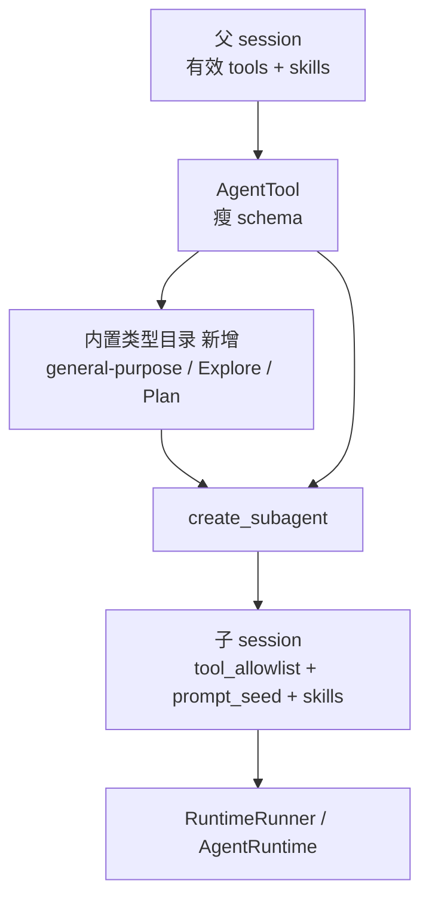
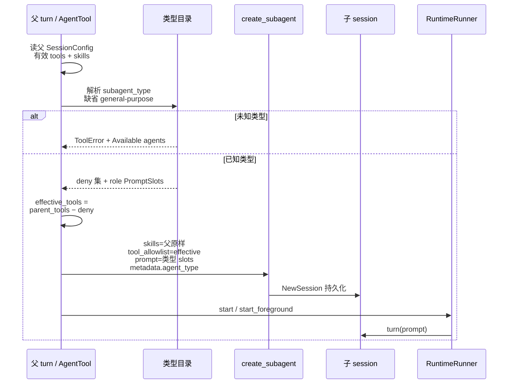

# feat-474: agent 工具更好用 — 技术方案

> 对齐: spec.md v1
>
> Unit branch: `unit/feat-474` (will be created by orchestrator)

## Changelog

## 现状分析

### 涉及范围

- `src/agent/platform/tools/builtins/agent.py` — `AgentTool`：入参 schema、校验、建子 session、前后台派发、`agent_id` 续跑；本期主改点。
- `src/agent/sdk/kernel.py` — `_SessionSubagentControl.create_subagent`：当前只传 `skills` + `metadata`，**不传** `tool_allowlist` / `prompt_seed`；且 `skills` 空序列会被折叠成 `None`（需修）。
- `src/agent/core/session/types.py` — `NewSession` 已具备 `tool_allowlist`、`prompt_seed`、`skills` 字段（可复用，今日未用满）。
- `src/agent/core/agent/runtime.py` — `tool_allowlist is None` → 落产品默认全套工具，故类型无法换工具集。
- `src/agent/platform/background_tasks/runtime_runner.py` — 跑子 agent turn；本期几乎不动。
- `docs/specs/kernel/background-tasks.md`、`skills.md`、`tools-hooks.md`、`prompts.md` — 需 delta。

### 既有约束

- 产品（CLI / Gateway）只许 import `agent.sdk`；类型目录与差异逻辑不能塞进产品包去绕开内核。
- 子 agent 模型继承父 run（bugfix-443）；本期不引入 `model` 参数。
- 主→子插话、120s 自动转后台、`<task-notification>` 保持 feat-337 语义。
- nano agent 可配置可见 skill 白名单；子 agent 不得比父更宽。

### 可复用能力

- Session 级 `tool_allowlist` + `prompt_seed`（PromptSlots）——真类型差异应走这两条，不新开 runner。
- `AgentTool` + background registry / `agent_id` continuation —— 生命周期保留。
- 实机 CC 提示词摘录：`cc-subagent-system-prompts/` —— 角色文案语义参考。

### 相关历史

- feat-337：CC 式后台与 `agent` 命名；参数仍带 oh-my-opencode 遗产（`load_skills`/`category`）。
- bugfix-431 / 443 / 450：skills 同源校验、模型继承、running follow-up —— 续跑路径需回归不退化。

### 契约层 grounding

- 代码与契约一致：`subagent_type` 基本是标签；`load_skills` 仍硬校验 —— 与本期目标冲突，需改 kernel delta-spec。

### 本变更沿用的既有模式

- **扩展**「session 配置决定工具集 + prompt slots」；新增「内置 subagent 类型目录」映射到上述配置。不另造执行通道。

## 架构总览

核心思路：把「类型名」从 metadata 标签升级为 **内置类型目录（deny-list ∩ 父有效工具 + 角色 PromptSlots）**，在 `create_subagent` 时写入子 session；`AgentTool` schema 变瘦。



before：`subagent_type` 只进 metadata，`tool_allowlist=None` → 可比父更宽；无类型专用 prompt。  
after：解析类型 → 显式写入子 session allowlist + 角色 prompt + 继承父 skills；未知类型失败并列出可用名。

## 关键决策

### 决策 1: 内置类型目录归属与定义形状

**选了 A：目录放在内核 platform（靠近 AgentTool）；定义 = `{name, disallowed_tools, when_to_use, role_prompt_slots}`。**

- **理由**: 真类型是内核行为，产品只经 sdk 消费；本期无产品定制类型需求；与既有 `tool_allowlist` + `prompt_seed` 扩展点对齐。`disallowed_tools` 与决策 2 / CC 同构（`general-purpose` 的 deny 为空）。
- **拒绝**: B（经 build_kernel 注入可替换 registry）——本期无调用方、面过大；C（常量全塞进 agent.py）——工具名单 + 长提示会撑爆工具文件。
- **风险**: 日后若要产品级自定义 agents 目录，需另开 unit 把目录抽成可注入 registry；本期不预埋。

### 决策 2: Explore / Plan 工具约束

**选了 B：相对父会话有效工具做 deny-list 再求交；general-purpose = 父会话有效工具全集（显式写入，禁止再 `None`→registry 全量）。**

- **理由**: 与 CC `disallowedTools` 同构；并修掉现状「子 agent 可比父更宽」的洞。
- **拒绝**: A（显式 allowlist）——父新增工具不会自动进入只读类型；C（只靠提示词）——验收不可靠。
- **风险**: DENY 集需随产品工具演进维护。起步 DENY = `{write, edit, agent, skill_manage}`。Bash 保留，靠角色提示约束只读用法。

### 决策 3: 类型角色提示注入方式

**选了 A：不继承父产品 PromptSlots；类型文案写入子 session 的 head（短身份）+ body（角色指引 / READ-ONLY）。**

- **理由**: 对齐 CC「专用人格」而非主会话副本；走既有 PromptSlots 语义，不绕骨架。
- **拒绝**: B（继承父再追加）——会带入 cron/心跳等主会话噪音；C（整段塞 custom）——绕开 head/body 约定。
- **风险**: 文案需按 nano 工具名改写（语义对齐 `cc-subagent-system-prompts/`，非逐字强制）。

### 决策 4: 删掉 load_skills 后的 skill 可见范围

**选了 C：子 session 继承父会话的 `skills` 配置；不再提供 `load_skills` 覆盖或加宽。**

- **理由**: nano 每个 agent 可配置可见 skill 白名单；子 agent 不得比父更宽。与 CC「Skill 工具默认可发现项目 skill」不同——CC 无这层会话/agent 级白名单。
- **拒绝**: A（固定 `skills=None` 全开）——破坏父 agent 的 skill 范围配置；B（固定零 skill）——与「写进 prompt 点名使用」冲突。
- **风险**: 须区分 `None` / 非空 / 空元组；修掉 `create_subagent` 把假值折叠成 `None` 的现状。

### 决策 5: 可用类型如何暴露给模型

**选了 A（follow CC）：`subagent_type` 为可选 string；description 列出类型 whenToUse + 工具约束摘要；未知类型失败并带 `Available agents: …`。**

- **理由**: 对齐 CC Agent 工具提示与运行时校验文案；目录扩展不必改 schema enum。
- **拒绝**: B/C（schema enum）——与 CC 不符，扩展成本高。
- **风险**: 模型仍可能胡写类型名，依赖运行时失败纠偏（与 CC 相同）。

### 决策 6: Milestone 拆分

**选了 A：单 M1 一次交付。**

- **理由**: 改动粘在同一条创建路径；无真并行模块、无分阶段环境验证硬依赖。
- **拒绝**: 先瘦参数再真类型的横切拆分。
- **风险**: 单 milestone 体积中等；用 roadpoint（R1/R2）在 worker 内分期即可。

## 接口与数据流

### 主路径：新建子 agent



### 对外 / 内核表面变化（消费者可观察）

| 表面 | 变化 |
|---|---|
| `agent` 工具 schema | 删除 `load_skills` / `category` / `timeout_seconds`；`required` 仅 `description` + `prompt`；`subagent_type` 可选 string |
| `agent` 工具 description | 列出 `general-purpose` / `Explore` / `Plan` 的 whenToUse + 工具约束摘要；注明缺省 `general-purpose` |
| 未知 / 错误大小写类型 | 工具失败；文案含类型未找到 + `Available agents: general-purpose, Explore, Plan`（顺序稳定、与 CC 同风格） |
| 子 session 配置 | 新建时写入显式 `tool_allowlist`、类型 `prompt_seed`、继承的 `skills`；`metadata.agent_type` 仍为类型名 |
| 前台预算 | 常量保留（约 120s）；不再暴露为模型参数 |
| 续跑 / `agent_id` / `task_stop` | 行为不变 |

### `create_subagent` 扩展（sdk 内部控制面）

在既有 `_SessionSubagentControl.create_subagent` 上增加并贯通到 `NewSession`：

- `tool_allowlist: Sequence[str] | None` — 本期新建路径应传**已解析的显式列表**（不要 `None`）
- `prompt: PromptSlots | None` — 转为 `prompt_seed`（与 `Kernel.create_session` 同路径）
- `skills: Sequence[str] | None` — **保留三态**：`None` / 非空 / 空序列；禁止 `if skills else None` 折叠

父有效工具解析：读父 session 的 `tool_allowlist`；若为 `None`，取父 turn 当前运行时已解析的可用工具名集合（与父 LLM 实际可见工具一致），再应用类型 deny。

### 类型目录模块（platform 新增）

建议落点：`src/agent/platform/tools/subagent_types/`（或等价邻近路径），导出：

- 三类型常量定义
- `resolve_agent_type(name: str | None) -> Definition | error`
- `format_available_agents() -> str`（供 description 与错误文案共用）
- `apply_tool_deny(parent_tools, disallowed) -> list[str]`

`AgentTool` 只编排，不内联长文案。

## 风险与回退

| 风险 | 应对 |
|---|---|
| Explore/Plan 仍有 `bash`，模型可能用 shell 改文件 | 工具 deny 去掉 write/edit；prompt READ-ONLY 禁止写向命令；验收用「write/edit 不在工具列表」为主判据，shell 写盘为提示层约束（与 CC 同） |
| `create_subagent` 空 skills 折叠成 `None` 导致父「零 skill」被加宽 | 显式修三态传递；单测覆盖 `skills=()` |
| 父 `tool_allowlist=None` 时若子仍写 `None`，子会拿到 registry 全量 | 新建路径必须写入**解析后的显式列表** |
| 旧调用方 / 测试仍传 `load_skills`/`category` | 视为未知字段忽略或校验失败（实现选一并测）；契约与 description 不再要求 |
| 续跑路径误用类型目录再次改 allowlist | 续跑不重建类型配置；只跟已有子 session |
| 回滚 | 回退本 unit diff；无数据迁移。已创建的旧子 session 仍按当时 config 跑 |

降级：无「半开真类型」开关；要么完整交付，要么回滚。

## Runbook for Reviewer

### Review 驱动方式

端到端真栈。本 unit **不改 IM 前端客户端面**；可用 Coding CLI 或 Gateway+IM 聊天走同一 `agent` 工具路径验收。优先：**CLI 或已登录 Web IM 对话**，让主 agent 真实调用 `agent`。

### 常驻服务

无新常驻服务。若用 Web IM 旅程：

```bash
# 停止（按本机既有实例）
PYTHONPATH=src python -m personal_assistant.main stop
# 或 worktree: ./scripts/e2e-down.sh

# 启动（主仓示例；worktree 用 e2e-up.sh）
IM_JWT_SECRET="demo-jwt-secret-for-feat340-testing" \
  PYTHONPATH=src python -m uvicorn IM.app:app --host 127.0.0.1 --port 8011
PYTHONPATH=src python -m personal_assistant.main

# 健康检查
curl -s -o /dev/null -w "%{http_code}" http://127.0.0.1:8011/
# Gateway: 进程存活且 IM 节点在线（设置页 Nodes / 日志无 bind 失败）
```

仅验内核/CLI 时可不启 IM；用 `PYTHONPATH=src python3 -m coding_cli.main` 即可。

### 验收前置

- 测试账号（若走 IM）：`nano` / `nano1234`（见 AGENTS.md）
- 可用 LLM（本地代理或配置中的 default_model）
- **无**额外第三方租户 / 硬件

### 建议旅程对照

1. 最少参数派发 → 默认 general-purpose，能改文件（父允许范围内）
2. `Explore` / `Plan` → 只读结论；工具面无 write/edit
3. `explore` / `oracle` → 失败且含 `Available agents`
4. 长前台任务 → 仍自动转后台；schema 无 `timeout_seconds`
5. 持 `agent_id` 插话 → 进入同一子 agent

## Milestones

| ID | 标题 | 依赖 | 并行组 | 范围 | 退出标准 |
|---|---|---|---|---|---|
| feat-474-M1 | agent-type-ergonomics | — | A | `src/agent/platform/tools/builtins/agent.py`；新增 `src/agent/platform/tools/subagent_types/`（或等价）；`src/agent/sdk/kernel.py`（`create_subagent`）；必要时 `src/agent/core/session/` 仅当三态 skills 传递需动；相关单测；`docs/specs/kernel/{tools-hooks,background-tasks,skills,prompts}.md`（经本 unit delta 归并） | `[reviewer]` 覆盖 spec：最少参数默认 general-purpose；Explore/Plan 只读；未知/错大小写失败含 Available agents；无 load_skills/category/timeout_seconds；前台超时自动转后台仍在；agent_id 插话仍在。<br/>`[worker]` 最窄相关 pytest 全绿（AgentTool schema/类型解析/deny 求交/skills 三态/未知类型文案）。<br/>`[worker]` 子 session 新建路径写入显式 tool_allowlist + 类型 prompt_seed + 继承 skills；续跑不改配置。 |

目录：`docs/changes/feat-474-agent-tool-ergonomics/M1-agent-type-ergonomics/`

## Spec delta

见 `docs/changes/feat-474-agent-tool-ergonomics/specs/kernel/`：

- `tools-hooks.md` — agent 参数面与真类型
- `background-tasks.md` — 去掉 category 措辞；保留自动转后台语义
- `skills.md` — 移除 load_skills 子 agent 校验 scenario
- `prompts.md` — 子 agent 按类型注入 PromptSlots

gateway / im / cli：**no spec delta**（产品只消费内核 `agent` 行为变化，无独立产品契约增量）。
