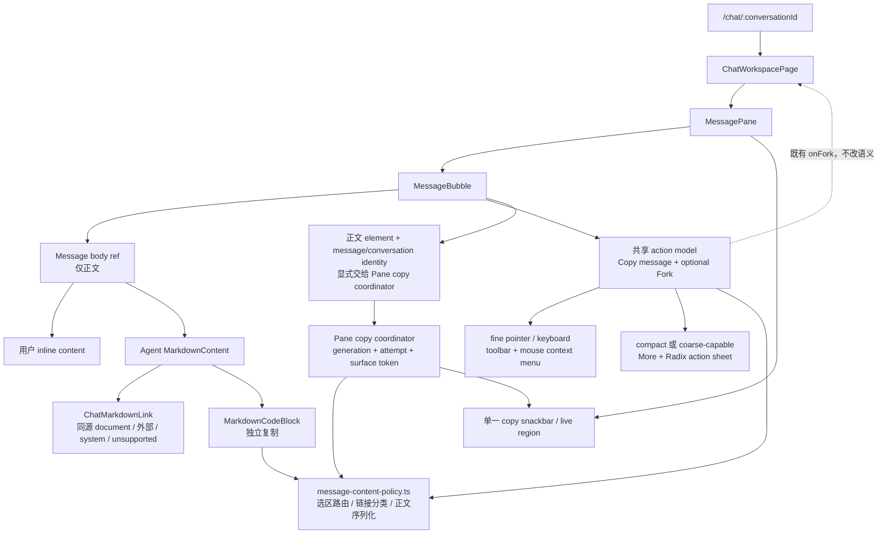
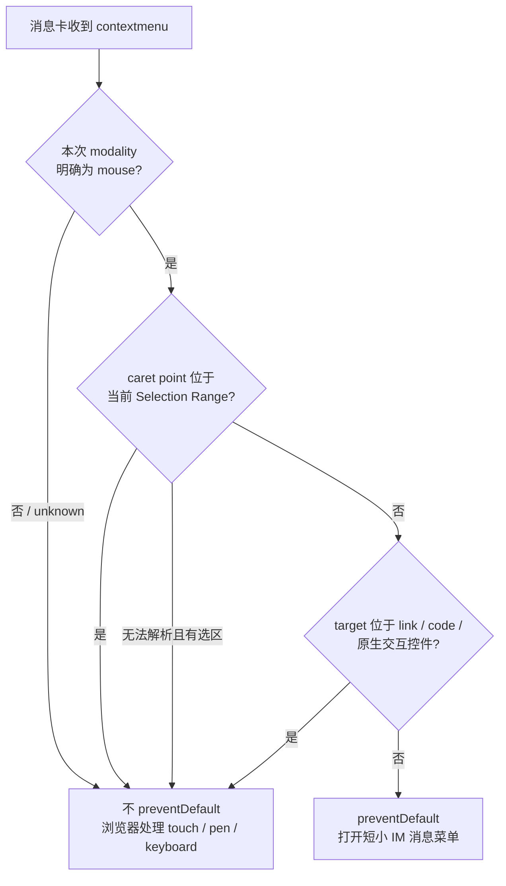

# feat-484: 商业级消息内容交互 — 技术方案

> 对齐: [spec.md](spec.md) v1
>
> Unit branch: `unit/feat-484`（由 `change-orchestrator` 在实施阶段创建）

## Changelog

- 2026-07-27: 根据首轮 Gate 2 评审，移除会污染原生选区的外链隐藏文本，拍死 disabled Branch 三表面、默认 URL sanitizer 边界与 mobile modal 焦点契约；同步更新 prototype 和退出标准。
- 2026-07-27: 根据第二轮 Gate 2 评审，将响应式布局与事件输入方式解耦，以右键坐标精确命中 Selection；同源链接退回浏览器 document navigation，mobile sheet 改用既有 Radix Dialog，并补 WebKit/hybrid 验收矩阵。
- 2026-07-27: 根据第三轮 Gate 2 评审，补齐 recent-pointer modality resolver 的纯策略接口，并以 conversation generation、surface token、copy attempt/notice token 拍死 Pane 级 Clipboard 异步所有权。
- 2026-07-27: 根据第四轮 Gate 2 评审，以 `contextmenu.button` 区分浏览器上报为 mouse 的键盘菜单事件，并让 Copy/Branch 等 action-induced close 同样遵守 connected-trigger 回焦契约。
- 2026-07-27: 根据第五轮 Gate 2 评审，将 macOS Control-click 纳入 secondary-click facts；把 rich-copy 的列表/表格/code/link 精确文本 fixture 冻结进退出标准，并补齐 prototype 的同源资源与 unsupported link 样例。

## 现状分析

### 涉及范围

- `src/IM/frontend/src/app/router.tsx` 把 `/chat` 与 `/chat/:conversationId` 接到生产入口 `ChatWorkspacePage`；`chat-workspace-page.tsx` 通过 `<768px` 的 `useIsMobile()` 结果选择响应式布局，并把真实消息、fork 可用性和回调传给 `MessagePane`。该 flag 只代表布局宽度，不代表 mouse/touch/pen；本 unit 不改路由、取数或 fork 回调链，也不再让它决定正文事件所有权。
- `src/IM/frontend/src/features/chat/components/message-pane.tsx` 的 `MessageBubble` 是生产唯一消息气泡实现。它当前同时持有桌面 `contextmenu`、移动端 600ms 长按、整条复制和 fork 入口；桌面右键无条件 `preventDefault()`，移动端又通过 touch handler 接管长按。
- 同文件的 `MarkdownContent` 由 `react-markdown + remark-gfm + remarkMention` 渲染 Agent 正文。当前只覆写 table 与 mention span，没有自定义 link/code 行为，因此外链仍按普通 `<a>` 在当前页打开，代码块也没有独立复制入口。
- `src/IM/frontend/src/styles/global.css` 中 `.chat-bubble-card` 在粗指针设备上设置 `user-select:none`，并在所有设备关闭 `-webkit-touch-callout`；这正面压制移动端原生选区与链接长按。现有 `.chat-bubble-fork`、`.chat-message-menu`、`.im-md a/pre/code` 是本 unit 的视觉改造落点。
- `src/IM/frontend/src/i18n/{zh,en}.json` 已有 `copy`、copy error、fork 与 fork feedback 文案，但中文仍直接显示英文 `fork`，且缺少“复制整条消息”“复制代码”“更多操作”“已复制”“外链新标签页”等文案。
- `src/IM/frontend/src/features/chat/components/message-pane.test.tsx` 已覆盖当前右键复制、移动长按菜单、Clipboard 失败和 Markdown 链接/代码渲染；`message-pane-fork.test.tsx` 守护既有 fork 资格与 disabled/in-flight 语义。现有测试正好能先改成新行为红测。

### 既有约束

- 这是 IM 前端内部变更：不得引入 `agent`、`personal_assistant` 或 `coding_cli` 依赖，也不改 HTTP、WebSocket、消息模型和持久化。
- fork 的资格仍是“direct user↔agent + completed Agent 回复 + 有 `kernel_message_id`”；Agent 离线或请求 pending 时保留既有禁用语义，后端仍是最终校验者。
- Agent 原始 HTML 继续由 `react-markdown` 默认安全路径转义；不得为链接或复制引入 `rehype-raw`。
- 用户消息仍走现有 inline renderer，Agent 消息仍走 CommonMark/GFM；本 unit 只扩展渲染组件，不另写 Markdown parser。
- `docs/IM前端蓝图.md` 要求信息密度高但不压迫、桌面与手机竖屏各自自然、消息动效克制。原截图中的灰色大气泡、头像/发送者、底部时间与过程/token 信息层级必须保留。
- `src/IM/frontend/dist/` 是生成产物，不提交。前端行为回归优先落 Vitest；真浏览器截图/录屏是一次性验收证据，按 `docs/development/testing.md` 留在 milestone `progress.md`，不伪装成单测。

### 可复用能力

- **既有 fork 判定与 `onFork(message.id)` 链**：用。只把入口汇入新的消息 action model，不改资格、请求、跳转和成功 toast。
- **`react-markdown` 的 `components` 扩展点**：用。链接分类与 code block copy 都在现有渲染管线末端完成，不二次解析 Markdown。
- **浏览器原生 anchor navigation**：用。跨 origin HTTP(S) anchor 加 `target="_blank"`；same-origin/relative/hash anchor 不加 target、不做 SPA click interception，因此产品 route 在当前标签打开，同源文档/API/download 也不会被错误交给 Router。
- **Async Clipboard `writeText`**：改后复用。原生选区复制完全交给浏览器；产品入口只为“整条消息”和“代码块”写入一个明确的 `text/plain` payload，失败进入统一反馈。
- **既有 `@radix-ui/react-dialog` + modal/bottom-sheet 视觉语言**：用。Radix Dialog 负责 portal、modal background isolation、focus trap、Escape/outside close、scroll lock 与 restore；只在 Content/Overlay 上复用项目已有颜色、圆角、边框与阴影，不新造通用 modal framework。
- **当前长按定时器、合成 mouse-down 忽略逻辑和粗指针 `user-select:none`**：不用并删除。它们服务的目标与本 unit 的“原生内容交互优先”相冲突。

### 相关历史

- `feat-451-chat-history-pagination` 首次加入“桌面右键 / 移动长按 → 自定义 Copy/fork 菜单”。其验收为了让菜单稳定，明确关闭了移动端文本选择；本 unit 是对这项旧产品决策的有意替换，不是偶发 CSS 修补。
- `feat-445-message-fork-branch` 定义了逐气泡 fork 资格、离线禁用、pending 防双击和成功跳转。本 unit 只重排前端入口，必须保持这些语义与守护测试。
- `bugfix-413-im-markdown-block-render` 把 Agent 正文收口到 `react-markdown + remark-gfm` 并保留 raw HTML 安全边界。本 unit 沿用该扩展点，不回退到手写 Markdown 分支。

## 架构总览

核心变化是把“消息正文”与“消息级操作”分开：正文恢复浏览器原生内容语义；所有显式产品操作共享一份 action model 与复制策略。



现状是一个 `MessageBubble` 同时抢占正文事件并直接复制 `message.content`；改后仍只有一个生产气泡组件，但正文 DOM 成为明确边界，浏览器原生操作与产品操作不会再互相覆盖。新增的 `message-content-policy.ts` 是唯一新接缝：集中五个必须一致、且适合纯测试的内容规则，不引入 store、controller 或通用 design system。

## 关键决策

### 决策 1: 正文事件按本次输入方式与精确触发点判定所有权

**选了“原生内容交互优先”的上下文路由，而不是继续无条件接管右键与长按。**

- **理由**: 选区、链接和代码是内容对象，用户预期浏览器提供复制、打开方式和触控预览；只有无选区的普通气泡空白/正文区域才属于消息级操作。
- **拒绝**: 继续全局 `preventDefault()` 后在自定义菜单补“复制选区/复制链接”——会重造浏览器菜单，并持续遗漏平台能力。
- **风险**: 响应式宽度不等于输入方式，`event.target` 也不等于选区内的准确字符位置。策略必须用本次 contextmenu 的 modality 与 `clientX/clientY` 解析 caret point；不能看到页面任意选区或同一个 `<p>` 就放行。

布局与事件所有权是两条独立契约：

- `<768px` 的 `isMobile` 只继续服务现有响应式布局，不进入 context-menu policy。
- 气泡在 capture phase 记录最近一次 `pointerdown` 的 `pointerType`、`button`、`ctrlKey`、坐标、`timeStamp` 与 message id；只把这份事实和 `contextmenu` 的 `pointerType/button/buttons/ctrlKey` 交给纯函数 `resolveContextMenuModality`。`mouseSecondaryKind` 只有两种非空值：常规 `button === 2` 为 `button-2`，macOS 浏览器产生 contextmenu 的 `button === 0 && ctrlKey === true` 为 `control-primary`。判定顺序固定为：`button < 0` 先返回 `keyboard`（Chromium 的 ContextMenu 键/Shift+F10 会给 `pointerType:"mouse", button:-1`）；direct `touch/pen` 原样返回；direct `mouse` 只有存在 secondary kind 才返回 `mouse`，其他 button 返回 `keyboard`；无有效 direct pointerType 时，context 也必须有 secondary kind，且 recent record 同时满足 same-message、`0 <= context.timeStamp - pointer.timeStamp <= 1500ms`、`Math.hypot(dx, dy) <= 8px`，其中 recent mouse 的 secondary kind 还必须与 context 完全相同，才采用 recent modality。其余统一返回 `unknown`，绝不让 recent mouse 覆盖键盘事件。
- 只有明确解析为 `mouse` 的普通区域右键可以打开 IM menu。`touch`、`pen`、keyboard 或无法判定的 modality 一律不 `preventDefault()`；keyboard 用户使用可聚焦 toolbar，不依赖自定义 context menu。
- mouse 右键存在当前消息内选区时，坐标若在正文 root 的 bounding rect 外直接判为选区外；否则先用 `document.caretPositionFromPoint(clientX, clientY)`，再以 WebKit/Blink 的 `caretRangeFromPoint` 作为兼容路径，得到 collapsed caret。任一 Selection Range 对该 text node/offset 的 `comparePoint(...) === 0` 才算“右键在选区内”。
- caret API 不存在、返回正文外节点或比较失败时，只要当前消息存在非空选区就保守交给浏览器；现代浏览器可精确区分“同一段选中前半句、右键后半句”并在后者打开 IM menu。



### 决策 2: 三种消息操作表面共享同一 action model

**选了 fine-pointer/keyboard toolbar、mouse 普通区域右键菜单、compact/coarse-capable More action sheet 三种表面共用同一份 Copy/Fork 可用性。**

- **理由**: 设备需要不同入口，但动作集合和 disabled 原因必须一致；共享 model 可避免 hover 有 fork、右键或移动端却漂移。
- **拒绝**: 所有设备统一只用右键/长按——移动端会再次抢选择，键盘也不可发现；所有按钮常驻气泡——破坏阅读密度。
- **风险**: 桌面 toolbar 视觉隐藏时仍需可被键盘聚焦；使用 `opacity/pointer-events` 与 `:focus-within`，不能用会移出无障碍树的 `display:none`。

surface 选择只影响入口，不反向改变正文事件所有权：

| 环境 | toolbar | More | contextmenu |
|---|---|---|---|
| 宽屏 mouse/trackpad | hover/focus 时显示 | 隐藏 | mouse 普通区域可开 IM menu |
| compact `<768px` touch | 不作为触控入口 | 显示 | touch/pen/unknown 始终原生 |
| 宽屏 touch-only | toolbar 只保留 keyboard focus 路径 | CSS `(any-pointer: coarse)` 显示 | touch/pen/unknown 始终原生 |
| hybrid（fine + coarse） | 保留 hover/keyboard toolbar | 同时显示克制 More | mouse 可开 IM menu；touch/pen 原生 |

More button 始终渲染，CSS 仅在 compact viewport 或 `(any-pointer: coarse)` 下显示；点击 More 才打开 action sheet。这样 768px iPad、横屏 tablet 和触控 laptop 不会因 layout breakpoint 丢失入口。

Action model 只有两项：

- `copy-message`：正文有可复制内容时可用；附件、过程盘、token、授权卡不属于 payload。
- `fork`：仅结构上满足既有 fork 资格时出现；Agent 离线或 fork pending 时显示为 disabled 并给本地化原因，避免入口因瞬时状态无解释地消失。

`fork` 状态在三种表面使用同一个枚举与 reason，不允许各自推断：

| 状态 | toolbar | context menu | mobile action sheet |
|---|---|---|---|
| non-candidate | 不渲染 Branch | 不渲染 Branch | 不渲染 Branch |
| available | 可操作 icon + 常规 tooltip | 可操作单行 item | 可操作单行 row |
| offline | 保持可聚焦的 `aria-disabled` icon；hover/focus tooltip 显示“Agent 离线，暂不可分支” | `aria-disabled` item 保留在 roving focus；第二行常显同一原因 | `aria-disabled` row；第二行常显同一原因 |
| pending | 保持可聚焦的 `aria-disabled` icon；hover/focus tooltip 显示“正在创建分支…” | `aria-disabled` item 保留在 roving focus；第二行常显同一原因 | `aria-disabled` row；第二行常显同一原因 |

disabled action 使用 `aria-disabled="true"` 而不是原生 `disabled`，因此 keyboard/touch 用户仍能发现原因；事件执行层必须拒绝触发 `onFork`。context menu 与 sheet 的原因是常显 secondary text，toolbar 的原因通过 `aria-describedby` 关联到 hover/focus tooltip。

### 决策 3: “复制整条消息”序列化已渲染正文为单一纯文本

**选了从正文 DOM 做语义化 `text/plain` 投影，不复制原始 Markdown，也不同时提供多种可见复制格式。**

- **理由**: 用户要的是屏幕上可复用的正文；原始 `message.content` 会保留 Markdown 符号且无法表达具名链接真实地址，复制整个卡片 DOM 又会混入工具、token 和按钮。
- **拒绝**: 复制整个气泡 `innerText`——会带入外围信息与新增按钮；重新解析 Markdown 源——与现有渲染管线形成第二套 parser；写入 rich HTML——兼容和安全成本超过本期需求。
- **风险**: DOM 文本规整很容易压扁列表/表格或破坏代码空行；必须按可见语义遍历并用纯函数测试代表性结构。

`message-content-policy.ts` 的序列化契约：

- 输入只能是 `.chat-message-body` 根节点；工具、thinking、附件、token、权限卡、时间和 action 本来就不在根内。
- 忽略带 `data-clipboard-exclude` 的 UI 节点（代码复制按钮、外链提示等）。
- 段落/标题/引用/list item/table row/code block 保持边界；list item 带可读项目符号，table cell 以 tab 分隔。
- code block 保留内部换行和缩进；只规整正文块之间的多余空行。
- 具名链接输出 `label (absolute URL)`；判断“可见文字就是 URL”时，将 trim 后 label 以当前页面为 base 解析并与 anchor 的序列化 absolute URL 比较，因此 trailing slash、host 大小写和 default port 不造成重复。
- 输出 trim 外围空白后通过 `navigator.clipboard.writeText()` 一次写入。Clipboard 不存在或拒绝时不做 deprecated fallback，明确反馈失败。

列表与富文本的纯策略测试使用固定 DOM fixture，精确期望以下 `text/plain`；无序项用 `- `，嵌套层级每级两个空格，有序项沿用 `ol[start]`/`li[value]` 的序号，table cell 用 tab，code 内部空行不折叠：

```text
Intro

- Alpha
- Beta
  - Nested

3. Third
4. Fourth

Name	Value
Count	2

if (ready) {

  run();
}

Docs (https://example.com/docs)
```

### 决策 4: 链接按 origin 分类，外链新标签、同源由浏览器当前标签导航

**选了在 `react-markdown` 的 anchor component 内做四类链接分派。**

- **理由**: `<a>` 的目标语义只能在渲染时稳定决定；保留真实 anchor 才能继续使用中键、右键、复制地址和键盘访问。消息 feature 不拥有全局 Router manifest，不能把“same-origin”猜成“SPA route”。
- **拒绝**: 给 Markdown 容器挂统一 click handler + `window.open()`——会破坏原生链接行为和键盘语义；所有链接一律新标签——内部会话导航割裂。
- **风险**: malformed URL 或危险 scheme 不能在分类时被误当作同源内链；继续依赖 `react-markdown` 默认 URL 安全转换，并在产品层只允许明确类别。

分类契约：

| 类别 | 识别 | 渲染与导航 |
|---|---|---|
| same-origin-document | 相对地址、hash、或解析后与 `window.location.origin` 同源的 `http(s)` | 普通 `<a>`，不设 target、不拦 click；浏览器在当前标签导航，产品 route 或同源资源各自按真实 URL 处理 |
| external | 跨 origin 的 `http(s)` | `<a target="_blank" rel="noopener noreferrer">` |
| system | `mailto:` | 普通 `<a>`，交给系统处理 |
| unsupported | 空、malformed、`tel:` 或其他未被默认 sanitizer 放行的 scheme | 可见文字保留，但不渲染成可正常点击的链接 |

不覆写 `react-markdown` 的默认 `urlTransform`：classifier 只接收安全转换后的 `href`，因此默认被清空的 `tel:` 直接进入 unsupported，不自行扩大协议白名单。

具名 external link 用 `user-select:none` 的 CSS pseudo-element 显示克制的 `↗`，不在正文 DOM 中插入 glyph 或 sr-only 文本节点；所有 external anchor 通过本地化 `aria-label="<可见 label>，在新标签页打开"` 告知辅助技术。是否为裸 URL 使用与 serializer 相同的 URL normalization 比较，因此 `https://example.com` 与 `https://example.com/` 不会被误判为具名链接。原生选区的 `Selection`/Clipboard 只包含真实可见正文；右键始终由浏览器处理。

### 决策 5: 代码块由 Markdown renderer 提供独立复制入口

**选了自定义 `pre`/code block renderer 包一层轻量 copy button，inline code 保持纯文本。**

- **理由**: `pre` component 能拿到单个代码块的实际 children，复制范围天然精确，不需要从整条消息反查。
- **拒绝**: 只依赖选区或整条复制——长代码难选且会带正文；给所有 inline code 也加按钮——产生视觉噪音。
- **风险**: fenced code 通常带 renderer 追加的单个尾换行；代码复制只移除这一个结构性尾换行，不能 trim 用户有效缩进或内部空行。

### 决策 6: Pane 级状态驱动既有 Radix Dialog 与单一反馈

**选了每次只显示一个消息菜单/Radix action sheet 和一个 copy snackbar，并为所有入口定义焦点回返。**

- **理由**: 反馈与菜单是 pane 级瞬时 UI；单一状态可避免多个气泡同时残留菜单或多个 live region 重复播报。
- **拒绝**: 每个气泡各自永久挂全局监听和 toast——长会话会堆积状态与监听；成功无反馈——用户无法确认 Clipboard 是否写入。
- **风险**: 菜单关闭、消息分页或会话切换时原 trigger/body 可能已卸载；Clipboard Promise 又不可取消，旧结果可能关闭后来打开的菜单或污染新会话。Pane 必须显式持有 body/action handoff，并以 conversation generation、surface token、copy attempt token 隔离异步结果；Radix `onCloseAutoFocus` 只在 trigger 仍 connected 时 restore。

交互约束：

- desktop toolbar：hover 或 `focus-within` 显示；按钮为真实 `<button>`，有本地化 `aria-label`、tooltip 和 `:focus-visible`。
- mouse context menu：按 `clientX/clientY` 打开并做 viewport clamp；打开后聚焦首个 enabled item，ArrowUp/ArrowDown/Home/End 导航，Escape/外部点击关闭。keyboard 用户从 toolbar 进入，不伪造 context-menu 坐标；浏览器产生的 ContextMenu/Shift+F10 事件保留原生菜单。
- mobile/coarse More：放在时间/耗时所在 metadata 行旁，视觉克制但触控区域不小于 44×44px；由受控的 `@radix-ui/react-dialog` Root + Portal + Overlay + Content + Title 打开浅 action sheet。Radix 负责全 app background isolation、focus trap、Tab/Shift+Tab、Escape/outside close、scroll lock 与卸载清理；Title 使用本地化“消息操作”，Content 打开后聚焦首个 action，关闭后回到仍存在的 More。Cancel 使用 Dialog Close；不在 `MessagePane` 手写 inert/focus loop。
- copy 成功：仅当结果仍属于当前 conversation generation 与最新 attempt，且 surface-bound attempt 仍拥有同一个 surface token 时，关闭该菜单/sheet、把焦点还给仍 connected 的触发入口，并显示约 1.6s 的非模态“已复制”；失败在同样的 ownership guard 下保留原操作表面并显示约 4s 的“复制失败，请重试”。Branch action 关闭表面时遵守相同回焦规则；若成功导航已卸载 trigger，则安全跳过。失去 ownership 的旧 Promise 静默丢弃结果，不关闭后来表面、不发布 stale notice。两者使用 `aria-live="polite"`，不改滚动位置。
- 新中文文案用“复制整条消息”“复制代码”“从此处分支”，不出现孤立英文 `fork`；英文对应 `Copy message`、`Copy code`、`Branch from here`。

### 决策 7: 变更止于 Web IM 前端

**选了不改消息 schema、后端 fork、实时流、历史分页、附件和工具时间线。**

- **理由**: 所有问题都能在生产前端的事件路由、渲染组件和剪贴板投影解决；扩大边界只会增加回归面。
- **拒绝**: 后端新增“可复制正文”字段——服务端不知道最终可见 DOM 与本地化 label；重做消息卡 design system——不受本 spec 驱动。
- **风险**: 无数据迁移；主要风险集中在浏览器差异和视觉遮挡，由 Vitest + 真浏览器双层验证。

## 接口与数据流

### 内部接口

`src/IM/frontend/src/features/chat/components/message-content-policy.ts` 暴露最小、无副作用的策略接口：

| 接口 | 输入 | 输出 / 约束 | 调用方 |
|---|---|---|---|
| `classifyChatLink` | 默认 `urlTransform` 后的 `href`、可见 label、当前页面 URL | `same-origin-document / external / system / unsupported` disposition；不执行导航；空 href（含被 sanitizer 拒绝的 `tel:`）为 unsupported | `ChatMarkdownLink` |
| `resolveContextMenuModality` | `{ messageId, pointerType?, button, buttons, ctrlKey, clientX, clientY, timeStamp }` context facts + nullable `{ messageId, pointerType, button, ctrlKey, clientX, clientY, timeStamp }` recent pointer record | `mouse / touch / pen / keyboard / unknown`；mouse secondary kind 是 button-2 或 control-primary；`button < 0` 与其他 direct-mouse button 为 keyboard；fallback 还必须满足 same-message、0–1500ms、欧氏距离 ≤8px，recent mouse 与 context 的 secondary kind 完全相同 | `MessageBubble` context-menu handler |
| `shouldKeepNativeContextMenu` | `modality`、正文 root、event target、`clientX/clientY`、当前 Selection，以及 document 的 caret-point 能力 | 是否完全交给浏览器；只对明确 mouse、非原生 target、且精确触发点在选区外的事件返回 false；无法解析时保守 native | `MessageBubble` |
| `serializeMessageBody` | `.chat-message-body` HTMLElement | 干净、结构化的 `text/plain`；跳过 `data-clipboard-exclude` | Copy message action |
| `extractCodeText` | code element 的可见 text | 精确代码；保留缩进/内部空行，仅去一个 renderer 尾换行 | code block action |

这些函数不读 React state、不写 Clipboard、不导航。DOM 副作用仍由用户事件发起处承担，便于对策略做稳定单测。

`MessagePane` 是操作表面与 Clipboard 副作用的唯一 owner；`MessageBubble` 不做 DOM query，也不在自身维护异步反馈：

- 每次打开菜单/sheet，Pane 分配单调递增的 `surfaceToken`，并保存 `activeMessageAction: { surfaceToken; conversationId; messageId; bodyElement; surface: "context-menu" | "action-sheet"; anchor?; trigger } | null`。气泡的打开请求必须把自身 `.chat-message-body` ref 当前值显式传入；执行前再次要求 `bodyElement.isConnected` 且 conversation generation 未变。toolbar 的 Copy 也把同样的 `{ conversationId, messageId, bodyElement }` 交给 Pane coordinator，只是不创建 surface。
- code button 把 `{ conversationId, messageId, codeElement }` 交给同一个 `requestCopy`；coordinator 根据 target kind 调 `serializeMessageBody` 或 `extractCodeText`，然后才调用一次 `navigator.clipboard.writeText()`。menu/sheet 从 `activeMessageAction` 取 target，因此不存在按 message id 查询 DOM 或闭包猜 ref 的第二条路径。
- Pane 用 `[conversation.id]` 的 `useLayoutEffect` 在新会话绘制前递增 `conversationGeneration` ref、清空旧 surface/notice、取消旧 notice timer；因此 A→B→A 也产生不同 generation。若旧 Promise 在切换 commit 前完成，它只会更新仍在屏幕上的旧会话，随后 layout effect 在新会话 paint 前清掉；commit 后完成则 generation 不匹配。每次 `requestCopy` 再分配递增 `attemptToken` 并覆盖 `latestCopyAttempt`，记录 `{ attemptToken, conversationGeneration, surfaceToken | null }`。
- Clipboard resolve/reject 只有在 attempt 仍是 latest 且 conversation generation 未变时才可发布结果；若它来自菜单/sheet，还必须 `activeMessageAction.surfaceToken` 与捕获值相同。直接来自 toolbar/code 的 attempt 从不关闭任何后来打开的 surface。会话切换立即清空 surface/notice 并使所有旧 generation 失效；目标 DOM 卸载则让 surface-bound result 失去 ownership。
- `copyNotice: { noticeToken; attemptToken; conversationGeneration; kind: "success" | "error"; message } | null` 驱动唯一 snackbar/live region。每次 notice 自带单调 token；timeout 只可用 functional state update 清除仍匹配自身 token/generation 的 notice，且新 notice 创建前取消旧 timer，所以旧 1.6s/4s timer 不能清掉后来反馈。
- 关闭操作表面时，只在原 `trigger` 仍 `isConnected` 时回焦；会话切换、目标消息卸载或分页淘汰时直接清空状态并使其 `surfaceToken` 失效。
- mobile sheet 的 `activeMessageAction` 驱动受控 Radix Dialog；portal、全 app background isolation、focus scope 与 teardown 由 primitive 负责。`onCloseAutoFocus` 仅处理 trigger 已卸载的降级，不复制 primitive 行为。

共享 action model 由当前消息派生为 `copy-message` 与可选的 `branch`，并携带 label、disabled 与 disabled reason。toolbar、mouse context menu 和 More action sheet 只负责不同的呈现与焦点模型，不得各自重写资格或执行语义。

### DOM 与 action 边界

```text
.chat-bubble
  sender/meta
  .chat-bubble-card
    .chat-message-body [ref]        ← whole-message copy 的唯一输入
      user inline content
      或 .im-md
        ChatMarkdownLink
        .im-code-block
          copy button [data-clipboard-exclude]
          pre > code
    attachments                     ← 排除
    tool/thinking panel             ← 排除
    token chip / permission cards   ← 排除
    fine-pointer/keyboard toolbar   ← 排除
  .chat-bubble-status
    timestamp / elapsed / delivery
    compact/coarse More trigger     ← 排除
```

### 主流程

```mermaid
sequenceDiagram
    participant U as User
    participant B as MessageBubble
    participant O as MessagePane copy coordinator
    participant P as content policy
    participant C as Clipboard API
    participant N as MessagePane notice

    U->>B: 选 Copy message / code copy
    B->>O: target element + conversation generation + optional surface token
    alt whole message
        O->>P: serializeMessageBody(bodyElement)
        P-->>O: clean text/plain
    else code block
        O->>P: extractCodeText(codeElement)
        P-->>O: exact code text
    end
    O->>O: allocate latest attemptToken
    O->>C: navigator.clipboard.writeText(text)
    alt success
        C-->>O: resolved
        O->>O: verify latest + generation + optional surface ownership
        O->>N: copied(success), only if still authoritative
        O->>O: close only the owned menu/sheet; restore connected trigger
    else unavailable/rejected
        C-->>O: rejected
        O->>O: verify same ownership guards
        O->>N: copy failed(error), only if still authoritative
        O->>O: keep only the owned menu/sheet for retry
    end
    Note over O,N: stale completion and stale notice timer are no-ops
```

链接点击不经过上面 action 流程：external anchor 由浏览器在用户手势下创建新标签；same-origin/relative/hash anchor 在当前标签执行原生 document navigation，产品 route 与同源资源都不被 feature 层截获。两者都不写消息、会话或 composer state。

## 前端原型

- 原型文件: [prototype.html](prototype.html)
- 覆盖范围: desktop 默认阅读态/hover toolbar/mouse 上下文右键、正文真实选区、外链与同源 document link、code copy、copy snackbar；mobile metadata More、modal action sheet、原生长按说明与触控尺寸；1024px hybrid 同时有 toolbar + More；Branch available/offline/pending/non-candidate；中英文字切换。
- 原型顶部的 viewport/state/Branch/language 控制条仅用于评审，不进入真实产品。standalone 脚本只模拟 Radix Dialog 的可观察 modal 契约；生产实现必须使用仓内既有 `@radix-ui/react-dialog`，不得照抄原型的 focus/inert 演示代码。

### 现有 UX grounding

| 当前产品入口 / 组件 | 必须继承的 UX 特征 | 本次增量如何嵌入 |
|---|---|---|
| `/chat/:conversationId` desktop | 两栏工作区、浅灰消息区、Agent 左侧头像/名称、最大 72% 灰气泡、时间/耗时在气泡下 | 原型保留相同信息层级；只把现有右上 fork pill 收敛成两枚 icon toolbar |
| `MessageBubble` 普通阅读态 | 正文是视觉主角，过程/token/授权位于正文之后；操作不应常驻成墙 | toolbar 默认透明，仅 hover/focus 出现；copy payload 用正文 ref 排除所有附属信息 |
| `.im-md` | 蓝色下划线链接、深色 code block、现有段落/列表/表格密度 | 只补外链 indicator、focus state 与 code copy button，不改 Markdown 主题 |
| compact `<768px` 或任意 coarse pointer | 单页 chat 保持紧凑；触控操作靠显式入口而非 hover；hybrid 不能因宽度丢入口 | More 始终渲染并由 media query 决定显示；点击后用 Radix Dialog 呈现既有 bottom-sheet 视觉 |
| 现有 fork/copy failure feedback | fork 用轻量 toast；错误不会清空聊天状态 | copy 使用更轻的底部 snackbar；成功短显、失败可重试，不改变 fork toast |

本 unit 明确改变两项旧 UX：移动长按不再打开 IM 菜单，桌面单独的 `fork` 文字 pill 被统一 toolbar 取代。两项都已由 spec 冻结，并投影到 M1-R1/R2/R6。

### 原型对齐契约

| 原型区域 / 状态 | 对齐级别 | 产品入口 | 必验 viewport / 状态 | 下游验收投影 |
|---|---|---|---|---|
| fine pointer/keyboard 普通阅读态 + hover/focus icon toolbar | `must-match` | `/chat/:conversationId` MessageBubble | 1440×900，default / hover / keyboard focus；Branch 四状态 | M1-R2, M1-R6 |
| mouse 精确选区/链接/code 保留原生菜单；普通区域开短 IM menu | `must-match` | 同上 | 同一 text node 选区内/外、跨 text node、具名外链、link/code/plain card；touch/pen/unknown | M1-R1, M1-R2 |
| clean whole-message copy + success/error snackbar | `must-match` | 同上 | rich body / existing selection / Clipboard reject | M1-R3 |
| named external、raw URL、same-origin product/resource 与 unsupported link | `must-match` | Agent Markdown body | pointer hover/focus/right-click/click | M1-R4 |
| code block 独立 copy button | `must-match` | Agent Markdown body | desktop + mobile / keyboard | M1-R5, M1-R6 |
| compact/coarse More + shallow Radix action sheet | `must-match` | `/chat/:conversationId` compact/hybrid | 390×844 + 1024×768 hybrid / Branch 四状态 / portal modal isolation / focus trap / close+restore | M1-R1, M1-R2, M1-R6 |
| 原型色值、阴影和微间距 | `may-adapt` | 现有 `global.css` tokens | desktop + mobile | M1-R9；只能按现有 token 微调，不改结构/层级 |
| prototype viewport/state/language 控制条和演示侧栏内容 | `out-of-scope` | 无 | prototype only | N/A；真实产品保持现有导航与会话数据 |

## 契约层增量 (delta-spec)

- kernel: no spec delta
- im: [specs/im/web-chat-ux.md](specs/im/web-chat-ux.md)
- gateway: no spec delta
- cli: no spec delta

只有 Web IM 终端用户可观察行为变化；HTTP/WS、Gateway、Kernel 和 CLI 契约均不变。

unit 收尾归并 delta 时，除更新 `docs/specs/im/web-chat-ux.md` 外，还要把 `docs/specs/im/spec.md` 的 Web Chat UX Requirement 计数从 10 更新为 12；本 design 阶段不提前修改 canonical。

## 风险与回退

- **正文序列化失真**：最高风险是 list/table/code 在不同 DOM 结构下被压平。应对是纯策略测试覆盖段落、嵌套列表、引用、表格、多代码块、mention、具名/裸链接和 clipboard-exclude；运行时只在用户点击复制时遍历单条正文，不增加 render 成本。
- **输入方式/选区点判定漂移**：viewport 不能代替 pointer modality，element target 不能代替字符点。策略测试覆盖 mouse/touch/pen/unknown、recent pointer fallback、同一 text node 选区内/外、跨 node 与 caret API unavailable；真浏览器另验 mouse 和 touch 在 hybrid 环境各走自己的路径。
- **原生菜单/选区的浏览器差异**：Vitest 只能证明是否调用 `preventDefault`，不能证明 OS 菜单与 Selection 结果。Chromium 覆盖 desktop/hybrid action 与 Clipboard；Playwright WebKit mobile 必须覆盖 Selection、link long-press 事件不被接管、computed `user-select`/`-webkit-touch-callout`，并专门拖选“只含具名外链”和“跨过具名外链”的 range。条件允许时补一轮真 Safari/iOS 手测；OS 菜单像素不作为自动化断言。
- **浮层遮挡或焦点丢失**：长气泡、视口边缘和分页卸载都可能影响菜单。mouse menu 继续按 viewport clamp；Radix sheet 的 portal/overlay/focus scope 覆盖 AppShell 与 mobile bottom nav，Content 固定底部并考虑 safe area；trigger 卸载时由 `onCloseAutoFocus` 安全降级。
- **Clipboard 异步竞态**：`writeText()` 不可取消，旧消息结果可能晚于新 surface 或会话。Pane coordinator 用 conversation generation + latest attempt + optional surface token 三重 guard；notice timeout 再用 notice token guard，测试以 deferred Promise 强制重排 resolve/reject 顺序。
- **Clipboard 权限/非安全上下文**：不静默兜底到过时 API。localhost/HTTPS 正常写入；不可用时保留操作表面、显示失败，原生选区复制仍是降级路径。
- **链接导航被误分类**：跨 origin、同源绝对、relative、hash、同源 `/openapi.json`/download、mailto、被默认 sanitizer 拒绝的 tel 与 malformed scheme 都进入策略测试；同源始终是普通 current-tab anchor，不在 feature 层复制 Router route ownership。
- **回滚**：无数据库、协议或消息迁移。整体 revert unit 前端 diff 即恢复 feat-451 的旧菜单；若只需紧急降级，可先撤 toolbar/sheet/code copy，同时保留“链接外开 + 不劫持原生选区”两项无状态修复。

## Runbook for Reviewer

本 unit 改客户端面，必须在隔离真栈中构建并真驱动浏览器。IM/Gateway 后端代码不变，但 IM 是构建后前端的托管入口，Gateway 用于产出带真实 `kernel_message_id` 的可 fork Agent 回复。

| 服务 | 停止命令 | 启动命令 | 健康检查 |
|---|---|---|---|
| 隔离 IM + Gateway 验收栈（IM 托管 Web 前端） | `./scripts/e2e-down.sh` | `cd src/IM/frontend && npm ci && npm run build && cd ../../.. && ./scripts/e2e-up.sh && source .e2e-ports.env` | `curl -sf "$IM_URL/openapi.json" >/dev/null`；`.gateway.log` 出现 ready/registered 信号；浏览器打开 `$IM_URL/login` |

**Review 驱动方式**: 端到端真栈，且本 unit 改了客户端面，必须真驱动 Web IM：

- macOS Chromium 1440×900 mouse/keyboard：同一段选区内与选区外右键、跨 text node 选区、link/code/plain card、物理 secondary click、Control-click 与 ContextMenu/Shift+F10 的 event facts/ownership、hover/focus toolbar、Branch 四状态、整条复制、Copy/Branch action-close 回焦、外链新 tab、同源 product/resource 当前标签、code copy、i18n 与 Clipboard reject。
- Chromium 1024×768 hybrid（fine + coarse/touch）：toolbar 与 More 同时可达；mouse 普通区域开 IM menu，touch/pen context 不被接管，draft/scroll 保持。
- Playwright WebKit 390×844 + touch：真实 Selection/Cmd-C（只选具名外链 label、跨过具名外链）、正文/link 长按路径不被 IM handler 接管、More/Radix sheet、safe area、focus trap/Escape/回焦；复核 computed `user-select:text` 且无 `-webkit-touch-callout:none`。另以 1440×900 做一次 Control-click/keyboard event-facts 小探针；条件允许时用真 macOS Safari 复核 Control-click、用真 iOS Safari 补 OS callout 手测，并在 `progress.md` 标明环境或限制。

**验收前置**:

- `~/.nano-assistant/config.yaml` 必须存在且包含 `llm:` 与至少一个 Agent；设计阶段已确认当前机器满足（4 个 Agent）。
- 本地 LLM upstream `http://127.0.0.1:4000/health` 设计阶段返回 200；review 前用 `curl -sf http://127.0.0.1:4000/health` 复核。
- e2e 脚本会注册 `nano / nano1234`；登录后选择同步进来的 Agent，发一条要求同时返回“多段正文、列表、引用、具名外链、裸 URL、IM 内链、两个代码块”的消息，确保得到 completed 且可 fork 的真实回复。
- `src/IM/frontend` 已声明 Playwright；review 前确认 Chromium 与 WebKit browser runtime 可启动，缺 WebKit 时执行 `cd src/IM/frontend && npx playwright install webkit` 后回到仓库根目录。
- Clipboard 测试必须由用户手势触发；浏览器若曾拒绝 Clipboard 权限，先恢复站点默认权限。外网不可达不影响检查新标签创建，但至少使用一个可解析的 `https://example.com`。
- reviewer 结束后执行 `./scripts/e2e-down.sh`；不复用主仓 8011/5173 端口，不提交 `dist/` 或 e2e 运行文件。

## Milestones

单 M1。它是一条紧耦合的前端垂直切片：同一 MessageBubble 的事件所有权、action model、Markdown link/code、Clipboard payload、Radix sheet、CSS 与 i18n 必须一起交付才能形成可用体验；拆成“逻辑/样式/测试”会成为禁止的横切拆分。估算约 600–900 行、8 个文件、约 6 小时，不命中多 milestone 硬触发。

| ID | 标题 | 依赖 | 并行组 | 范围 | 退出标准 |
|---|---|---|---|---|---|
| feat-484-M1 | message-interactions | — | A | `src/IM/frontend/src/features/chat/components/message-pane.tsx`；新增 `message-content-policy.ts` 及其测试；`message-pane.test.tsx`；`message-pane-fork.test.tsx`；`src/IM/frontend/src/styles/global.css`；`src/IM/frontend/src/i18n/{zh,en}.json` | M1-R1–R10 |

### M1 退出标准

- **M1-R1 `[reviewer]`** 常规 button-2 secondary click 与 macOS Control-click 在同一 text node 选区内保留浏览器菜单、选区外打开 IM menu；跨 text node/具名外链 range 同样按 caret point 精确判断。“只选具名外链 label”和“跨过具名外链”两种 Clipboard 都不含 `↗` 或隐藏 new-tab 文本；link/code 右键原生。浏览器真实 ContextMenu/Shift+F10 即使上报 `pointerType:"mouse"` 也不得被 IM 接管，recent mouse 记录不得覆盖它；touch/pen/unknown 在 compact、768px tablet 与宽屏 hybrid 同样原生，正文可选、link 走系统能力。（覆盖“消息正文支持原生文本选择与局部复制”全部 Scenario，以及“链接与正文选区保留原生右键能力”“移动端长按外部链接”）
- **M1-R2 `[reviewer]`** fine-pointer/keyboard 阅读态安静，hover/focus 出现 Copy message + eligible Branch toolbar；mouse 普通区域右键出现同一短菜单；compact 或任意 coarse-capable 环境的 More 打开同一动作集合，hybrid 同时有 toolbar + More。Branch non-candidate 在三表面均不出现；offline/pending 在三表面均保持可聚焦的 `aria-disabled`，toolbar tooltip 与 menu/sheet secondary text 显示同一本地化原因，且不会调用 `onFork`。（覆盖“消息级操作可发现且不干扰阅读”全部 Scenario；must-match prototype desktop/mobile/hybrid actions）
- **M1-R3 `[reviewer]`** whole-message copy 在有无页面选区时都得到当前目标消息的干净正文，且上文固定 rich-copy fixture 必须逐字符匹配：无序 `- `、两空格嵌套、有序 3/4、table tab、code 内部空行、named-link absolute URL 均保留；不含头像/发送者/时间/耗时/token/过程/思考/授权/投递状态。成功与失败反馈正确且不改变 draft/scroll。A surface 的延迟 Clipboard 结果不得关闭后来打开的 B surface 或发布 stale notice；切换会话及 A→B→A 后，旧 generation 的 resolve/reject 均为 no-op；旧 notice timer 不清除新 notice。（覆盖“复制整条消息得到可复用正文并获得反馈”全部 Scenario；must-match prototype copy/snackbar）
- **M1-R4 `[reviewer]`** named external link 有不进入 selectable DOM text 的克制外跳提示并在新 tab 打开，所有 external anchor 的本地化 aria-label 告知新标签；raw URL 不重复显示提示。当前 chat、draft 与 scroll 不变；same-origin/relative/hash 输出无 target 的普通 anchor，IM product route 与 `/openapi.json`/download 等同源资源都由浏览器当前标签按真实 URL 处理，不被 Router 错拦；mailto 交系统，默认 sanitizer 清空的 tel 与其他 unsupported target 不伪装成可用 link。（覆盖“聊天链接按目标自然导航”全部 Scenario；must-match prototype links）
- **M1-R5 `[reviewer]`** 每个 fenced code block 只复制自身 code，保留缩进/内部空行且不带 fence/其他正文；inline code 无按钮；pointer 与 keyboard 产生相同反馈。（覆盖“代码块支持独立精确复制”全部 Scenario；must-match prototype code block）
- **M1-R6 `[reviewer]`** toolbar/menu/sheet/link/code button 均有明确 focus ring、本地化名称和合理回焦；中文没有孤立 `fork`；More 与 action row 触控区稳定不小于 44px。sheet 使用仓内 `@radix-ui/react-dialog` Portal/Overlay/Content；打开后 AppShell（含 mobile bottom nav）不可交互/不可被 AT 浏览，Tab/Shift+Tab 困在可见 action（含 aria-disabled Branch）与 Cancel。outside/Escape/Cancel 以及 Copy success/Branch action-induced close 都回到仍存在的 More 或 menu trigger；Branch 导航导致 trigger 卸载时安全跳过且不抛错。（覆盖“消息交互跨设备与输入方式保持一致”全部 Scenario；must-match prototype focus/mobile）
- **M1-R7 `[worker]`** 既有 fork `onFork(message.id)`、资格、offline/pending disabled、防双击与成功跳转语义不变；`message-pane-fork.test.tsx` 及相关 workspace tests 全绿，不改后端/API/types。
- **M1-R8 `[worker]`** `message-content-policy.test.ts` 直接覆盖 `resolveContextMenuModality` 的 `pointerType:"mouse", button:2`、`pointerType:"mouse", button:0, ctrlKey:true` Control-click、`pointerType:"mouse", button:-1` ContextMenu/Shift+F10、direct touch/pen、recent mouse 不覆盖 keyboard、same-message/同 secondary 组合、0/1500ms 边界、负/超时、8px 欧氏距离边界、未知 pointerType，并覆盖同一 text node 选区内/外、跨 node、caret API fallback、native target；另覆盖默认 sanitizer 后 URL 四分类（含同源 product/resource、mailto 与被清空的 tel）、上文 rich-copy fixture 的逐字符 expected string、URL normalization、具名/裸 link、clipboard-exclude 与 code whitespace。`message-pane.test.tsx` 覆盖三种操作表面、hybrid More、Branch 四状态/同一 reason/拒绝 disabled 执行、Clipboard success/failure、Copy/Branch close 的 connected-trigger 回焦、external aria-label、Radix Dialog open/close/focus restore/i18n 与 Markdown anchor/code DOM；用 deferred Clipboard Promise 覆盖 same-pane 新 surface、conversation switch、A→B→A、newer attempt supersedes older attempt，以及旧 notice timer 不清新 notice。删除或改写 feat-451 已废弃的 mobile long-press 测试，不保留“绿但无价值”的旧路径。
- **M1-R9 `[worker]`** 按 Runbook 在真栈完成 Chromium desktop、Chromium hybrid 与 Playwright WebKit mobile 三矩阵；保存物理 secondary、macOS Control-click、ContextMenu/Shift+F10 的真实 `pointerType/button/buttons/ctrlKey` 与 IM handler ownership、Copy/Branch close 后的 `document.activeElement`、上文 rich-copy fixture 的精确 Clipboard 字符串、Selection 字符串、Radix focus trap 与 computed CSS 结论到 `M1-impl/`，并记录进 `progress.md`，不得只留 `/tmp` 路径。Branch 四状态匹配所有 `must-match` 行；真 macOS Safari/iOS 若不可用，明确记录环境限制而不伪称已测。
- **M1-R10 `[worker]`** `cd src/IM/frontend && npm run test -- src/features/chat/components/message-content-policy.test.ts src/features/chat/components/message-pane.test.tsx src/features/chat/components/message-pane-fork.test.tsx`、`npm run build`、`git diff --check` 全绿；不提交 `src/IM/frontend/dist/`，不触及 Milestone 范围外产品文件。
