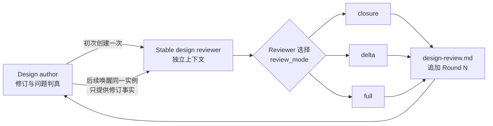
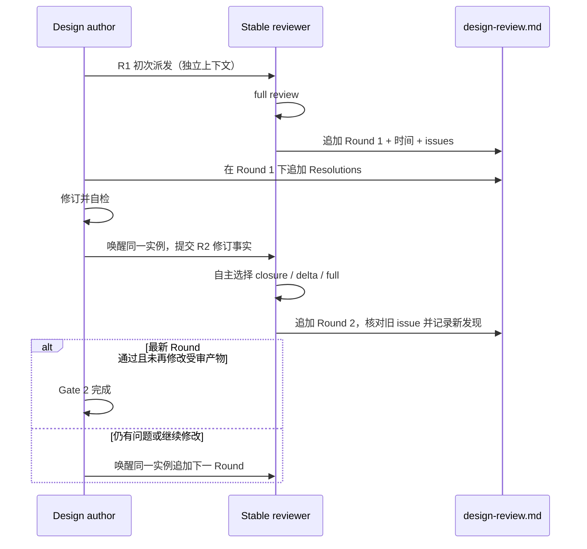

# feat-485: Design review 轮次生命周期 — 技术方案

> 对齐: spec.md v3
>
> Implementation branch: `codex/design-review-round-history`（用户明确要求在独立 worktree 实施）

## Changelog

## 架构总览

Gate 2 仍由 design-author 编排、design reviewer 独立判断，但 reviewer 的生命周期从“每轮一次性实例”提升为“每个 unit 一个稳定实例”。稳定实例拥有检查深度的路由权，`design-review.md` 则成为按轮次追加的审查日志。



主流程中 author 不再承担检查深度判断，也不创建第 N 个 reviewer：



## 现状分析

| 现状 | 证据 | 后果 |
|---|---|---|
| design-author 要求每轮创建全新 reviewer，且禁止复用 | `.claude/skills/change-design-author/SKILL.md:561-567` | 每轮都重复加载完整 unit 与代码上下文 |
| 任意返工都强制全量复审 | `.claude/skills/change-design-author/SKILL.md:583-589` | 局部修订与高风险架构改写承担同样成本 |
| 固定报告路径只保留最新报告，并明确不保留轮次台账 | `.claude/skills/change-design-author/SKILL.md:593-597` | 无法按轮复盘耗时、问题和收敛过程 |
| reviewer 输出格式只有单次报告，没有轮次元数据或 mode | `.claude/skills/change-design-reviewer/SKILL.md:161-214` | reviewer 无法表达复验范围，author 也无法稳定引用历史 issue |
| feat-475 把 fresh/full/overwrite 写成原始需求 | `docs/changes/feat-475-design-review-loop/spec.md:62-73,138-144` | 本 unit 必须作为显式后续决策覆盖旧流程，不能静默改词 |
| orchestrator 已有“复用热上下文 + 按 delta 选复验范围”的相邻模式 | `.claude/skills/change-orchestrator/SKILL.md:575-639` | 可复用其 `closure/delta/full` 词汇，但路由所有权改由 design reviewer 承担 |

本 unit 不涉及产品 runtime、常驻服务或 canonical 产品行为契约；没有 delta-spec。

## 关键决策

### 决策 1：Reviewer 以 unit 为生命周期，首轮创建、后续只唤醒

R1 由 author 创建一个不继承 author 设计对齐上下文的独立 reviewer，并保存 harness 返回的稳定 target/agent 标识。R2 及以后必须通过 `SendMessage`、`followup_task` 或当前 harness 的等价恢复机制唤醒该标识，不允许为了方便重新派一个 reviewer。

“独立”定义为 reviewer 与 author 角色和上下文分离，不定义为 reviewer 每轮遗忘。复用 reviewer 的历史上下文正是本次优化要保留的资产。

唯一 failover 是原实例客观不可恢复。author 必须先确认恢复失败，再创建替代 reviewer；替换原因、旧/新标识写入下一轮元数据，替代者首轮强制 `full`。

### 决策 2：Reviewer 拥有 review-mode 路由权

author 的返工派发包只提供事实，不提供 `review_mode` 或期望结论：

| 字段 | 内容 |
|---|---|
| `round` | 下一轮编号 |
| `unit_id` / `unit_dir` | unit 定位 |
| `reviewer_target` | 被唤醒的稳定 reviewer 标识 |
| `changed_artifacts` | 改过的文件与段落 |
| `resolutions` | 上轮 issue ID、author 判真结果、改动位置与证据 |
| `task` | 先判定影响，再自主选择 mode，完成检查并追加本轮 |

reviewer 先读历史轮次、当前产物与 author 提供的修订事实，验证影响边界后选择：

| mode | 适用条件 | 最低检查范围 |
|---|---|---|
| `closure` | 仅证据、引用、措辞消歧或其他不改变架构/契约语义的局部修正，影响可封闭 | 逐条关闭旧 issue，核改动位置与直接依赖，确认没有语义漂移 |
| `delta` | 有有界的设计语义变化，但未改变需求范围、核心架构边界或无法枚举的共享契约 | 旧 issue + 全部 changed atoms + 其上下游依赖 + 受影响的架构进攻角度 |
| `full` | R1；reviewer failover/上下文丢失；需求或非目标变化；核心边界、跨模块接口、数据流、milestone 拆分、共享契约发生高风险变化；影响无法界定 | 完整重建五类承重原子台账并执行全部四角度架构进攻 |

`closure`/`delta` 过程中一旦发现新副作用、未声明 delta、影响无法封闭或新的 CRITICAL/WARNING，reviewer 在同一轮扩大范围并记录升级后的 mode；author 无权阻止或降级。

轻量 mode 省的是**未失效证据的重复取证**，不是降低审查维度。每个 `closure`/`delta` Round 都必须有 `Coverage`：

| 分组 | 要记录什么 |
|---|---|
| `rechecked` | 本轮重新核实的旧 issue、changed atoms、直接/间接依赖和架构进攻角度，以及新证据 |
| `retained` | 未重跑的 atom/angle 按可审计分组列出 `inherited_from: Round N`，以及为什么本轮 delta 没有使结论失效 |

不能证明某组 retained evidence 仍有效、无法枚举影响边界、或发现未声明变化时，必须扩大 `rechecked`，必要时升级 `full`。不得让未重跑项从报告里静默消失；严重度和四角度定义保持不变。

### 决策 3：`design-review.md` 以 Round 为不可覆盖的一级单元

文件只有一个，轮次按完成顺序追加：

```markdown
# Design Review: feat-485

## Round 1

### Metadata
- reviewer: <stable target>
- review_mode: full
- mode_reason: first review
- started_at: 2026-07-27T10:00:00+08:00
- completed_at: 2026-07-27T10:21:34+08:00
- duration: 21m34s

### Verdict
Issues Found — 1 CRITICAL / 1 WARNING

### Coverage
...

### 核实台账
...

### 架构进攻
...

### Issues
- [R1-C1][CRITICAL] ...
- [R1-W1][WARNING] ...

### Recommendations
- [R1-R1] ...

### Author Resolutions
- [R1-C1] accepted — 改动 ...；证据 ...
- [R1-W1] rejected — 证据 ...

## Round 2
...
```

reviewer 写入的 Round 正文在完成后不可改写；author 只能在该 Round 末尾追加 `Author Resolutions`。后续纠错通过新 Round 的“历史 issue 核实”说明，不回写旧结论。稳定 issue ID 使用 `R<round>-C<n>`、`R<round>-W<n>`、`R<round>-R<n>`。

### 决策 4：每轮记录可复盘的时间

reviewer 在开始读取本轮输入前记录 `started_at`，落盘前记录 `completed_at`，并计算 `duration`。两个时间都使用 ISO 8601 和显式时区；duration 使用人可读 wall-clock 时长。

不记录 sha256、byte length 或完整产物 manifest。reviewer 根据历史、当前产物和实际 delta 判断 Coverage；append-only 由明确写入规则约束，不增加机器证明。

### 决策 5：Design-author 以最新完成 Round 收口 Gate 2

Gate 2 通过需同时满足：

1. `design-review.md` 最后一个完成的 Round 为 `Approved`，且 `0 CRITICAL / 0 WARNING`；
2. author 已处理并记录该轮及仍开放历史 issue，确认无实质问题；
3. 最新 Round 完成后，author 没有再修改受审产物。

任一受审产物随后变化，就追加下一轮；旧 Round 保留，不再称“最新报告覆盖旧报告”。

`change-orchestrator` 不读取或校验 `design-review.md`。Gate 2 的审查闭环由 design-author 在交接前完成，orchestrator 保持只检查 `design.md` 结构的既有职责。

### 决策 6：同步全部已提交消费入口，不复制主仓在途文档

本分支同步：

- `.claude/skills/change-design-author/SKILL.md`
- `.claude/skills/change-design-reviewer/SKILL.md`
- `docs/changes/readme.md`
- `AGENTS.md`

创建 worktree 时，主仓的 `docs/README.md` 和 `docs/development/` 仍未提交，属于其他任务。本 unit 不复制它们的工作副本。合并顺序是硬 gate：

- 若文档重构先进入 main，本分支必须先 rebase，并把同一 Gate 2 契约并入新的 `docs/development/change-workflow.md` 后才能合并。
- 若本分支先合并，文档重构分支必须先 rebase feat-485，并删除其中恢复 `fresh reviewer/full every round/overwrite` 的旧口径后才能提交。

## 接口与数据流

### Author → stable reviewer

R1 派发只包含 unit 定位和“完整独立审查”的中性任务，不附 author 的预判。后续派发通过稳定 reviewer target 发送，携带当前修订事实和上一轮 resolution；author 不传 mode。

### Stable reviewer → report

reviewer 负责：

1. 确认 round 编号等于文件中最后一轮 + 1；
2. 记录开始时间；
3. 选择并执行 mode，必要时升级；
4. 记录 Coverage、完成时间与 duration；
5. 一次性把完整 Round 追加到文件末尾。

### Author → report

author 对本轮每个 Issue/Recommendation 独立判真，在同一 Round 的 `Author Resolutions` 末尾追加处理结果。若需要用户重新拍板，状态写 `escalated`，不得伪装为已关闭。

## 风险与回退

| 风险 | 应对 |
|---|---|
| 复用 reviewer 产生锚定偏差 | R1 仍是隔离上下文；mode 由 reviewer 决定；高风险和不明影响强制 full；author 不传期望结论 |
| author 低报 delta 诱导轻量检查 | reviewer 必须先验证实际产物与 resolution，发现未声明变化就升级范围并报 issue |
| 轻量 mode 变成静默少审 | 每轮把未重跑维度列入 retained coverage，并证明本轮 delta 未使其失效；证明不了就升级 |
| 旧轮内容被后续 agent 改写 | reviewer 与 author skill 都禁止覆盖、重排、改写旧 Round；纠错只能在新 Round 说明 |
| 报告无限增长 | 历史是用户明确要求的复盘资产；不拆文件、不压缩，阅读时从最新 Round 和未关闭 issue 开始 |
| 原 reviewer 丢失 | 留痕 failover，新 reviewer 首轮 full，不伪造上下文连续性 |
| author 通过后又改 design | design-author 的停止条件明确要求最新 Round 后未再修改；有修改就继续唤醒同一 reviewer |
| 与主仓在途文档架构冲突 | 分支不复制未提交文件；合并前 rebase 后把契约归并到届时 canonical workflow |

回退方式：恢复 feat-475 的 fresh/full/overwrite 规则，同时保留已经生成的历史报告，不删除既有 Round。

## Runbook for Reviewer

- 常驻服务：无。
- 仓库外前置：无。
- Review 驱动方式：本 unit 自身就是可控 workflow canary。
  1. 读取 `design-review.md` 的 Round 1 与 `Author Resolutions`。
  2. 通过 harness 的 follow-up/SendMessage 唤醒 Round 1 记录的同一 reviewer target，不传 mode，只传 changed artifacts 与 resolutions。
  3. 验证 Round 2 的 reviewer 标识不变、mode 由 reviewer 给出且有理由、Coverage 区分 rechecked/retained、Round 2 有完整时间字段，Round 1 仍原样保留。
  4. 确认所有写入都发生在指定 worktree，主仓目标路径没有本 unit 引入的改动。
- 最窄验证：
  - 对两个修改的 skill 分别运行 `/Users/czj/Repos/nano-multiagent/.venv/bin/python /Users/czj/.codex/skills/.system/skill-creator/scripts/quick_validate.py <skill-dir>`。
  - 运行 `git diff --check`。

## Milestone

| ID | 标题 | 依赖 | 并行组 | 范围 | 退出标准 |
|---|---|---|---|---|---|
| feat-485-M1 | skill-contract | 无 | serial | `change-design-author`、`change-design-reviewer`、`docs/changes/readme.md`、`AGENTS.md` 与 feat-485 文档 | `[reviewer]` spec 中 reviewer 复用、mode 路由、轮次留痕、时间记录与主仓隔离场景全部成立；`[worker]` 两个 skill 校验和 diff check 全绿 |

milestone_dir 为 `M1-skill-contract`。不拆多 milestone：reviewer 生命周期、mode 路由与报告格式共同定义一个不可分割的 Gate 2 审查协议。

## Delta-spec

no spec delta。本 unit 只改变仓库内 agent workflow，不改变 kernel、IM、Gateway 或 CLI 的产品行为。
