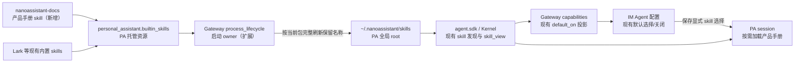
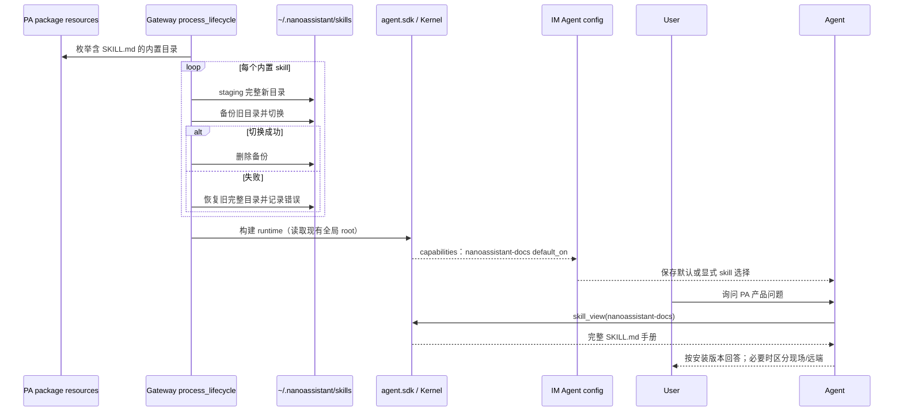

# feat-502: PA 产品说明书 skill — 技术方案

> 对齐: spec.md v2

> Unit branch: `unit/feat-502` (will be created by orchestrator)

## Changelog

## 现状分析

### 涉及范围

- `src/personal_assistant/builtin_skills/` 是随 PA Python package 发布的内置 skill 资源树；`pyproject.toml` 已把 `builtin_skills/**` 纳入 package data。
- `personal_assistant.builtin_skills.bootstrap` 在 Gateway 前台进程启动时把包内完整 skill 目录安装到 `~/.nanoassistant/skills`；`gateway.process_lifecycle` 是生产启动 owner。
- `personal_assistant.product` 把 `~/.nanoassistant/skills` 作为 PA 第一部署级 skill root 交给 `agent.sdk`；Kernel 现有 `list_skills`、prompt 候选注入与 `skill_view` 完成发现和按需加载。
- `personal_assistant.reporter.upstream_reporter` 把全局 root 中发现的 skill 投影为 `default_on=true`；IM 的 Agent 新建页据此形成默认选择，详情页按 profile 中的显式 `skills` 列表显示和保存用户选择。
- 产品手册内容来自 `README.md`、`docs/product/`、`docs/operations/` 与 `docs/specs/{gateway,im}/` 的 current 产品事实；本 unit 只把 PA 用户所需内容投影成随包手册，不把 coding CLI、Kernel 内部或开发流程带入。

### 既有约束

- `personal_assistant` 只能经 `agent.sdk` 使用内核能力；本 unit 不新增对 `agent.core` / `agent.platform` 的依赖，也不改变 Kernel skill 契约。
- PA、IM 与 `coding_cli` 互不 import。IM 继续只消费 Gateway 上报的 capabilities 和 Agent profile，不读取 Gateway 文件系统。
- current Gateway 契约要求内置 skill 自举只安装缺失目录、不得覆盖用户已有同名文件；目标态按修订后的 spec 将该行为改为“全部随包内置 skill 由 PA 托管并按当前安装包完整刷新”。
- current IM 契约与代码都让新建 Agent 采用 capability defaults、让已有显式 skill 选择保持权威；刷新资源不能改写 profile。
- 产品基础问答必须离线可用；远端信息、现场配置和运行状态只在对应问题需要且相关工具可用时核实，不能用说明书默认值冒充现场事实。
- 当前 checkout 有与本 unit 无关的 dirty/untracked 内容；设计与实施只能触及 feat-502 明确列出的路径。

### 可复用能力

- **直接复用**：包资源发现、Gateway 启动安装、PA 全局 root、Kernel skill 发现/`skill_view`/使用统计、Gateway capability 投影、IM 默认选择与取消保存的整条链路。
- **扩展**：包内增加一个普通产品手册 skill；把现有缺失安装改成面向所有随包内置目录的事务式刷新。
- **不使用**：`openai-docs` 的 OpenAI Docs MCP、Codex manual helper、latest-model resolver 与专属网络来源。参考仅限“以 skill 向 Agent 提供产品手册”的形态和按需加载/有界不确定性行为。
- **不修改**：`src/personal_assistant/gateway/bootstrap.py` 中未被生产生命周期调用的旧同名 installer；生产 owner 仍是 `personal_assistant.builtin_skills.bootstrap`。

### 相关历史

- `feat-447-feishu-channel` 建立了包内 skill 资源、package data 与全局 root 自举模式。
- `bugfix-499-lark-skill-bundle` 将完整 Lark bundle 接入该模式，并确认空 allowlist 保持默认发现语义；本 unit 只推翻其中“同名目录不覆盖”的一项所有权语义。
- `refactor-470-managed-channel-composition` 把安装副作用从 composition 移到真实 Gateway 前台生命周期；本 unit保持该职责归属。
- `feat-430-im-slash-skill-picker` 及后续 current 实现补齐了 skill location/default projection 与 IM 选择语义；本 unit不新建前端入口。

契约层与当前代码在发现、默认选择、显式配置和旧非覆盖行为上相符，未发现需要顺带修复的 drift。本 unit 未命中 `codebase-design`：现有安装、发现与选择 seam 足够，不调整公共 interface、模块职责或测试边界。

## 架构总览

本 unit 只改变 PA 包资源进入现有全局 skill root 的供给语义，并新增产品手册资源。全局发现、capabilities、IM 选择和会话内按需加载仍走原链路。

Before：包内 skill 只在目标缺失时复制，旧版本目录会永久保留。After：所有随包内置名称在 Gateway 启动时与当前包版本同步；用户自建名称、IM profile 和 Kernel/IM 接口均不变。

## 关键决策

### 决策 1: 随包内置 skill 的所有权与更新边界

**所有随包内置 skill 目录都由 PA 托管，Gateway 启动时完整替换为当前安装包版本。**

- **理由**: 产品手册和 Lark bundle 都是版本化产品能力；只有完整替换才能同时更新正文、references、脚本并清除已退役文件，避免新旧资源混用。
- **拒绝**: 继续“缺失才安装”会让升级后的 Agent 使用旧手册；只覆盖同名文件会保留包中已删除的旧文件；另建 managed root 会重复现有发现与默认选择机制。
- **边界**: 只替换包内当前存在 `SKILL.md` 的保留名称；其他名称的用户 skills 不动，Agent profile 的启用/关闭列表不动。用户需要定制时复制成其他名称。
- **风险**: 对保留名称的本地直接修改会在下次 Gateway 启动时丢失；这是 spec 已确认的产品语义，必须通过文档与测试锁定。未来若删除整个内置 skill 名称，需在对应变更中显式迁移；本 unit只保证当前包仍声明的名称完成目录替换。

### 决策 2: 刷新事务与失败语义

**每个内置 skill 独立完成同文件系统 staging、旧目录备份和目录切换；失败恢复旧完整目录并继续启动。**

- **理由**: Gateway 必须尽量可用，同时不能让一次复制失败留下半新半旧目录。逐 skill 隔离也避免一个坏资源阻断其他内置 skills 更新。
- **拒绝**: 先删后复制会暴露残缺目录；失败后保留部分新文件无法判定版本；任一失败就阻止 Gateway 启动会把资源更新故障扩大为整个 PA 不可用。
- **错误边界**: staging 完成前不触碰旧目录；切换失败恢复备份并清理 staging。单项失败记录 skill 名与原因，下一次 Gateway 启动重试；成功项不回滚。
- **风险**: 失败项会暂时停留旧版本。该退化优于残缺目录或整机不可用，并由启动日志明确暴露。

### 决策 3: 产品手册的资源形态

**新增普通 `nanoassistant-docs` skill，其单份 `SKILL.md` 同时承载触发规则和完整产品手册；只启用 `skill_view` 也能取得全部手册内容。**

- **资源**: `SKILL.md` 的 frontmatter 仅放名称和精确触发描述；正文按章节覆盖 PA 定位、Web IM、Agent、模型、skills/tools/memory、Gateway 与外部渠道、heartbeat/cron、启动与排障，并内置来源优先级、现场核实、最新版查询和有界不确定性规则。
- **理由**: current Kernel 的 `skill_view` 会返回命中 `SKILL.md` 全文，但 Agent 可以合法关闭 `read`。单文件使“启用手册 skill + `skill_view`”本身就是完整可达契约，不暗中绑定第二个工具。手册只在命中产品问题时按需加载，不进入每轮 system prompt。
- **容量边界**: 手册全文必须低于 `skill_view` 现有 50,000 字符结果上限；worker 以测试锁定，不依赖截断结果。
- **拒绝**: references 会让手册正文额外依赖 `read`；运行时读取源码仓 docs 会让已安装产品依赖仓库布局；新增 helper/MCP/文档服务超出“以 skill 提供手册”的要求。
- **维护边界**: canonical specs/operations 仍是仓库 current 权威；本 `SKILL.md` 是随安装版本发布的用户手册投影。后续 change 改变相关 PA 用户行为时，同一 change 必须同步更新该手册章节。

### 决策 4: 问答来源优先级

**默认从随当前安装版本提供的 `SKILL.md` 手册回答；现场问题核实本机状态；只有明确询问最新版时才查项目官方远端。**

- **稳定产品问题**: 调用 `skill_view` 取得完整已安装手册，直接回答，不要求 `read` 或联网。
- **现场问题**: 在相关工具可用时读取当前 Agent 配置、Gateway/IM 状态或任务数据；把产品规则与观察结果分开。工具不可用时明确无法核实。
- **最新版问题**: 仅在用户明确询问最新/升级差异时，使用已有 `web_search` / `web_fetch` 查询 `Mrchen116/nano-multiagent` 官方仓库的 current 文档，并区分远端与本机；远端不可用时退回已安装手册并声明边界。
- **范围外问题**: coding CLI、Kernel 内部和开发流程不冒充 PA 手册内容；有合适来源时只做路由。
- **拒绝**: 每次问答都联网会破坏离线可用与版本一致性；只看手册默认值回答现场问题会产生虚假事实；从非官方网页推断产品行为缺乏权威性。

### 决策 5: 选择与前端接入

**不改 IM/前端；依靠现有全局 skill `default_on`、新建默认选择和详情页显式 allowlist 语义完成启用/关闭。**

- **理由**: 新 skill 安装到现有 PA 全局 root 后，Gateway 已会把它上报为默认项，现有 UI 已能显示、取消和保存；新增 UI 或协议只会制造第二套配置语义。
- **既有 Agent**: 空/默认集合自动发现新手册；非空显式列表不被补写，用户可在 IM 手动开启。
- **工具依赖**: `skill_view` 继续是按需读取入口。用户关闭手册或关闭 `skill_view` 后，产品不承诺 Agent 能调用该手册。
- **前端结论**: 无组件、布局、文案或交互设计变化，因此不产 `prototype.html`。

## 接口与数据流

### 内部接口

| 接口 / 资源 | 目标契约 | 调用方 / 消费方 |
|---|---|---|
| `install_builtin_skills(target_root=None) -> dict[str, Path]` | 保留现有入口；返回本次成功同步的内置 skill → `SKILL.md` 路径。按包内直接子目录稳定排序逐项处理，单项失败不抛出到其他项 | `gateway.process_lifecycle.install_builtin_skills_for_gateway()`、聚焦单测 |
| 包资源 `personal_assistant.builtin_skills/<name>/` | 含 `SKILL.md` 的直接子目录即当前包声明的 PA 托管内置 skill；同步时整个目录是替换单元 | builtin installer |
| `nanoassistant-docs/SKILL.md` | frontmatter 暴露精确触发描述；正文是完整、自包含、随包且低于 50,000 字符的已安装版本手册 | Kernel 候选注入、模型、`skill_view` |
| Gateway capability `skills[]` | 沿用 `{name, description, location, default_on}`；`nanoassistant-docs` 因位于 PA 全局 root 自动 `default_on=true` | IM 新建/详情页 |

`pyproject.toml` 的 `personal_assistant = ["builtin_skills/**"]` 已覆盖新资源，不新增 package-data 规则。`agent.sdk`、IM HTTP/WS schema 与前端组件均无接口变化。

### 启动刷新与问答主流程

staging 和 backup 都放在目标 root 的同一文件系统，避免跨设备 rename。替换完成后才清理 backup；异常路径先恢复再清理。Gateway 在 runtime 构建前完成同步，因此运行中的 Kernel 不会观察到切换中间态。

## 契约层增量 (delta-spec)

- kernel: no spec delta
- im: `specs/im/agents-nodes.md`
- gateway: `specs/gateway/agent-capabilities.md`
- cli: no spec delta

Kernel 的 skill 发现、`skill_view`、使用统计和 prompt 注入行为不变；CLI 不消费 PA 内置资源。IM 只增加一个由现有 capabilities 驱动的默认可选项，不改 API/组件。Gateway delta 修改内置 skill 自举所有权，并增加产品手册问答契约。

## 风险与回退

| 风险 | 应对 / 降级 |
|---|---|
| 保留名称下的用户修改被覆盖 | 这是 spec 明确的新所有权语义；手册说明定制应复制成新名称，测试锁定非内置名称不受影响 |
| 文件复制或目录切换中断 | 同文件系统 staging + backup；单项失败恢复旧完整目录、继续其他项并在下次启动重试 |
| 手册正文与 canonical docs 漂移 | `SKILL.md` 标注来源边界；本 unit 以 current docs 逐章投影，后续 PA 行为 change 的退出标准必须包含相关手册更新 |
| 模型对产品问题未调用 skill | frontmatter description 覆盖 PA 正式名称、常见实体和故障类问题；真实 LLM reviewer 旅程验证按需调用，不增加强制 prompt |
| 已有显式 Agent 列表不含新手册 | 按用户确认保留显式配置；IM 中可见但未选中，用户手动开启。空/默认集合自动发现 |
| 远端不可用或现场工具被关闭 | 回答限定在已安装手册，明确无法核实；不猜测最新或现场状态 |

回滚 feat-502 时，删除 `nanoassistant-docs` 包资源并恢复 installer 的 missing-only 行为即可；已同步到全局 root 的目录不会由代码回滚自动删除，若产品要退役整个保留名称，应在回滚/后续变更中显式迁移。Agent profile 没有新增字段，无数据回滚。

## Runbook for Reviewer

本 unit 修改 Gateway 启动期全局资源。所有验收必须使用隔离 HOME，不能刷新用户真实 `~/.nanoassistant/skills`。

| 服务 | 停止命令 | 启动命令 | 健康检查 |
|---|---|---|---|
| Worktree-isolated Gateway（脚本同时管理未修改的 IM 前置） | `./scripts/e2e-down.sh` | 先执行 `mkdir -p "$PWD/.e2e-home"`，再执行 `env HOME="$PWD/.e2e-home" PATH="$PWD/.venv/bin:$PATH" ./scripts/e2e-up.sh --main-config <绝对主配置路径>` | `source .e2e-ports.env` 后 `curl -fsS "$IM_URL/openapi.json" >/dev/null`，并确认 `.gateway.pid` 存活、`.gateway.log` 无启动错误 |

**Review 驱动方式**: 端到端真栈；本 unit 不改客户端面，允许用 Web IM 实际调用的 Agent capabilities/create/config 与消息接口驱动。至少走一次真实模型对话，观察 `skill_view` 调用与最终回答；不以源码阅读或 fake LLM 代替。

其中一条必验产品问答旅程把 Agent 的 skills 显式设为仅含 `nanoassistant-docs`，tools 显式设为仅含 `skill_view`（不含 `read`）；真实模型必须只通过该工具读到完整手册并回答一个基础 PA 产品问题。

**验收前置**:

- `<绝对主配置路径>` 提供可用的默认 LLM；reviewer 使用复制后的 worktree config，不改主配置。
- 隔离 HOME 中预置一个旧版/本地改写的内置 skill、一个额外文件和一个不同名称的用户 skill，用于验证完整刷新与非内置保留。
- 不需要飞书账号：Web IM 即可覆盖共享 PA session skill 链路；外部渠道路由本 unit未修改。
- “基础问答不联网”通过工具轨迹确认未调用 `web_search` / `web_fetch`，不通过断开 LLM 所需网络来验证。

## Milestones

本 unit 默认单 milestone。实现围绕同一启动供给链和同一个产品手册价值闭环，文件有逻辑依赖且不足以形成可独立交付的并行切片；拆成 installer/manual/tests 会成为禁止的横切式拆分。

| ID | 标题 | 依赖 | 并行组 | 范围 | 退出标准 |
|---|---|---|---|---|---|
| feat-502-M1 | product-docs-skill | — | A | `src/personal_assistant/builtin_skills/bootstrap.py`、`src/personal_assistant/builtin_skills/nanoassistant-docs/SKILL.md`、`src/personal_assistant/gateway/process_lifecycle.py`、`tests/unit/personal_assistant/test_builtin_skill_bootstrap.py`、必要的 Gateway capability/lifecycle 聚焦测试、`docs/specs/{gateway/agent-capabilities,im/agents-nodes}.md` 与本 unit delta | `[reviewer]` 覆盖 spec 五个 Requirement 的全部 Scenario：默认可关闭的产品手册、全部内置 skill 随版本刷新、按需产品问答、版本一致性、产品规则/现场状态的证据边界；使用隔离 HOME + 真 IM/Gateway + 真实 LLM，并包含“仅启用该 skill + `skill_view`、关闭 `read`”时仍能回答基础 PA 产品问题的旅程。 `[worker]` 新装、旧版、被修改、含额外旧文件、非内置用户 skill、单项同步失败恢复/继续等 installer 测试全绿；包内 `nanoassistant-docs/SKILL.md` 的 frontmatter 可发现、正文覆盖指定 PA 主题且低于 50,000 字符；仅开启 `nanoassistant-docs` + `skill_view`、未开启 `read` 的会话级聚焦测试证明 `skill_view` 返回未截断的完整手册；capabilities/prompt preview 中该 skill 可见且 `default_on=true`，显式 Agent skills 不被刷新改写。 `[worker]` `.venv/bin/pytest -q tests/unit/personal_assistant/test_builtin_skill_bootstrap.py tests/unit/personal_assistant/test_gateway_pid_lifecycle.py tests/unit/personal_assistant/test_gateway_upstream_reporter.py`、触及文件的 `ruff check` / `ruff format --check`、`PYTHON="$PWD/.venv/bin/python" ./scripts/docs-check`、`git diff --check` 全绿。 |
