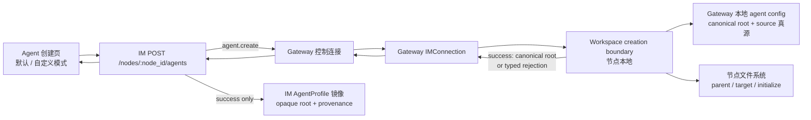
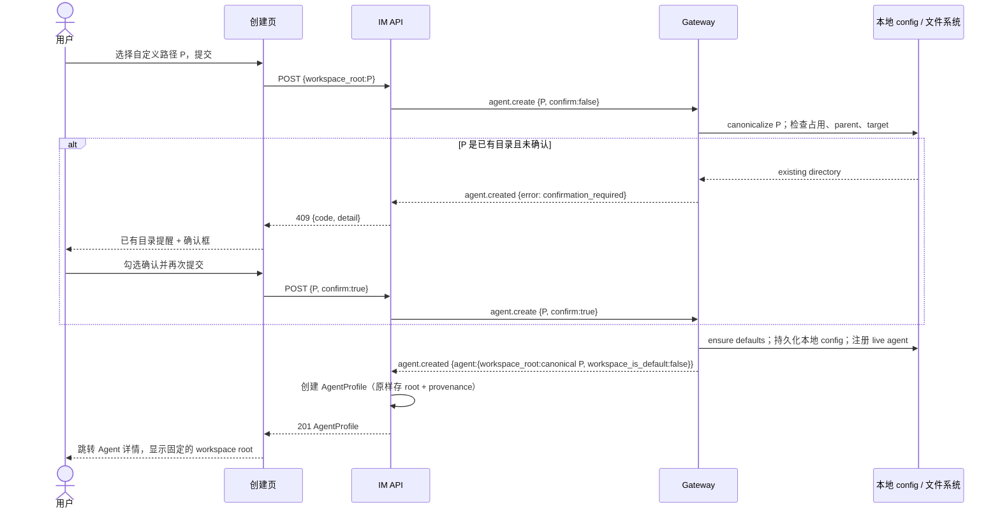

# feat-515: Agent Workspace Root Selection — 技术方案

> 对齐: spec.md v1
>
> Unit branch: `unit/feat-515` (will be created by orchestrator)

## Changelog

## 现状分析

### 涉及范围

- `src/IM/frontend/src/features/settings/agents/agent-create-page.tsx` 是
  `/settings/agents/new` 的创建表单。请求类型已包含 `workspace_root`，但
  `normalizeDraft()` 目前始终把它归一为 `null`，页面也没有工作目录输入。
- `src/IM/api/routes/nodes.py` 只做 owner-scope 节点门禁和 HTTP/WS 转发；成功后将
  Gateway 回传的 `workspace_root` 写入 `AgentProfile`。
- `src/IM/ws/gateway/control.py` 与
  `src/personal_assistant/ws/im_connection.py` 承载 `agent.create` / `agent.created`
  控制帧；当前回帧只有成功 agent payload，不能把可恢复的创建校验结果返回页面。
- `src/personal_assistant/gateway/agent_config_sync.py` 是 Gateway 接收创建请求、创建
  工作区、写入本地配置和注册 live agent 的收口点。它拥有 `workspace_base`、本地
  agent config 和真实文件系统。
- `src/IM/application/config_service.py` 与 agent profile repository 将创建结果镜像到
  IM，并且更新配置的路径已明确排除 `workspace_root`。不过当前
  `workspace_root_for_profile()`、`workspace_is_default_for_profile()` 会在 IM 主机
  `resolve()` 路径；`nodes.py` 的新建前 prompt preview 也在 IM 侧从 agent id 推导路径。
  这些是本 unit 必须一并消除的跨机语义 drift，而不只是创建时的存储问题。

### 既有约束

- IM 与 Gateway 可以跨机；IM 不得直接检查、解析或读写 Gateway 本地的工作区。
  节点本地 config 是 runtime workspace root 的真源，IM profile 是展示和路由镜像。
- 新建 Agent 必须挂在当前用户拥有且在线的节点下；节点离线仍维持当前的 503 语义。
- workspace root 在创建时确定，更新配置时必须继续忽略该字段；本 unit 不增加编辑、
  迁移或重新分配入口。
- `ensure_workspace_defaults()` 已具备幂等初始化行为：已有文件不覆盖。新流程必须在
  用户确认已有目录前不调用它，且不得创建不存在的父目录。
- 前端必须沿用 Agent 创建页的卡片、窄屏单栏、草稿离开确认和既有 i18n 方式；不引入
  对远端节点目录的浏览器或文件选择器。

### 可复用能力

| 现有能力 | 决定 | 原因 |
|---|---|---|
| `NodeAgentCreateRequest.workspace_root` | 扩展使用 | 已是创建请求的正确承载字段；默认模式继续发送 `null`。 |
| Gateway `_workspace_root_factory()` | 复用 | 默认模式仍由节点配置决定路径，前端不猜测或展示待创建路径。 |
| `ensure_workspace_defaults()` | 复用并调整调用时机 | 保留已有目录内容不覆盖的语义；仅在全部校验及确认通过后初始化。 |
| Gateway 本地 agent config | 复用为同节点唯一性索引 | 它与实际节点文件系统、runtime 的 ownership 同机且同源，不新增 IM 全局路径索引。 |
| `agent.created` 回包 | 扩展为显式 outcome | 让一次创建请求能返回成功或用户可处理的拒绝，避免新增易失效的远端预检 API。 |
| IM workspace mirror accessor | 收窄并统一 | 所有 profile response 与下行 workspace RPC 都从一个“不触碰文件系统”的 accessor 取得存储值；不再在 IM 主机 `resolve()`。 |
| Gateway `AgentWorkspaceConfig` | 扩展 | 把 `workspace_is_default` 作为与 root 同生命周期的本地 provenance 持久化；新创建的 default/custom 不再由 IM 路径比较猜测。 |

### 相关历史

- `bugfix-404-bg-notify-workspace-isolation` 已定下“Gateway 本地 config 为 workspace
  真源、IM 镜像不参与 runtime”的边界。本设计沿用该边界，把所有路径判断留在节点。
- 当前 IM Agent 创建页已确立桌面连续导航、移动端单栏和离开草稿保护；workspace 选择
  作为 Identity 与 Behavior 之间的一张增量卡片，而不是另起设置流程。

## 架构总览

创建请求仍是一条 HTTP → Gateway WebSocket → HTTP 的链路。变化是 Gateway 将“选根、
校验、确认、占用与初始化”收口成一个有明确 outcome 的创建边界；IM 只负责 owner/node
路由、把 outcome 映射为 HTTP 结果，并在成功后镜像 Gateway 的 canonical root **和它是
默认还是自定义的 provenance**。



这个结构的重点是：路径 P 只在选中节点上 canonicalize 和比较。N1 与 N2 即使都传入
`/srv/team/project`，也不会看到对方的本地 config，因而可各自创建。

## 关键决策

### **一次提交即是非破坏性检查；已有目录用显式确认后的第二次同一请求完成创建。**

不增加一个“远端路径预检”端点。第一次提交若发现已有目录，Gateway 返回
`workspace_confirmation_required`，且不创建文件、不写 config、不注册 agent；页面将路径
处展示醒目的警示和确认框。勾选后以相同创建 payload 加
`confirm_existing_workspace: true` 重试。这样确认时仍由当前节点重新检查真实状态，不会把
预检与真正创建之间的竞态交给前端处理。

备选的前端仅提示或 IM 先行检查都会让用户看到不可靠的状态：前者无法保证真正的节点确认，
后者会把远端路径当成本地路径。单独的预检 RPC 同样会产生陈旧结果，且增加一条浅层协议。

### **默认模式只表达“交给节点”，自定义模式透传非空目标节点输入。**

前端的表单状态新增 `workspaceMode: "default" | "custom"`，它不是持久化配置。默认模式
发送 `workspace_root: null`；Gateway 继续通过既有 factory 在其 `workspace_base` 下分配根。
自定义模式发送用户填写的非空 opaque value；仅 Gateway 依据本机规则判断其是否是可接受路径、展开
`~` 并取得 canonical absolute path。成功 outcome 必须
同时回传 `{workspace_root: canonicalPath, workspace_is_default: boolean}`：default 为 `true`，
custom 为 `false`，由 Gateway 连同 root 写入自己的 `AgentWorkspaceConfig`。页面和 IM 都使用
Gateway 回传的 canonical path 与 provenance，而不使用输入字符串或 IM 主机路径猜测结果。

这保留默认目录的既有行为，也让 `~`、相对路径、符号链接等只按目标节点的语义处理。前端和 IM
只拒绝空自定义输入，并将其他文本作为 opaque value 原样转发；**目标 Gateway 独自判断其本机
路径是否绝对、如何展开及 canonicalize**。`workspace_is_default` 的意思固定为“这次 root 是否由
Gateway 默认 factory 分配”，不是“这个字符串是否碰巧等于 IM 主机上的某个目录”。

新建前 prompt preview 也必须遵守同一归属：IM 不再根据 `agent_id_hint` 派生 root。它把模式、
agent id hint 和可选 custom 输入透传给节点；Gateway 用同一个 default factory 做**不创建目录**的
候选解析，或在 custom 模式下仅在本机解析该输入后交给 preview provider。这样 workspace-specific
skills 的预览仍针对选中节点，同时预览不会初始化目录、占用 root 或要求已有目录确认。

### **同节点唯一性以 canonical root 与 Gateway 本地已配置 Agent 比较。**

Gateway 在初始化之前，读取本地 agent config 中各 agent 的 root，以与候选路径相同的
canonicalization 规则比较。命中时拒绝 `workspace_already_assigned`，并回传已归属的
`agent_id` 供页面说明“该目录已经归属 Agent A”。由于同一 Gateway 对本地配置的创建处理是
顺序收口的，成功创建在回包前已持久化，后一个请求会看到占用；不需要在 IM 数据库加入跨节点
路径唯一索引。local config 还持久化 `workspace_is_default`，避免默认 root 被序列化为普通
字符串后丢失创建来源。

路径相等按 canonical path 判断，而不是字面字符串判断，避免符号链接或 `..` 绕过；不同节点
没有共享索引，因此不会冲突。

### **父目录是可创建新 workspace 的边界；已有目标目录只允许“目录 + 明示确认”。**

对于自定义路径，Gateway 先检查 canonical target：

1. target 不存在时，canonical parent 必须已存在且为目录；只创建 target 及其初始内容，
   不创建任何缺失的父级。
2. target 已存在且不是目录时，以 `workspace_target_not_directory` 拒绝，不提供确认。
3. target 已存在且为目录时，未确认返回 `workspace_confirmation_required`；确认后才运行
   `ensure_workspace_defaults()`。既有文件保持不覆盖。
4. parent 的 stat、目标创建或初始化因权限、只读文件系统等失败时，返回
   `workspace_parent_unusable` 或 `workspace_initialization_failed`；IM 把明确但不泄露宿主
   内部细节的原因展示在路径字段旁。

默认模式不展示或要求用户确认节点默认目录：它沿用既有 Gateway 分配和初始化行为。

### **成功才写 IM 镜像；验证失败是可呈现的 HTTP 错误，而不是连接故障。**

`agent.created` 新增可选 `error`，成功保持已有 `agent` payload。IM 将可预期的 workspace
错误映射为带 `code` 和 `detail` 的 422（输入/父目录）或 409（确认需要/路径已归属）；只有
Gateway 离线、超时或非法回包才保留现有 503/502 语义。IM profile 仅在 success outcome 后
创建，因此失败不会遗留 AgentProfile。

IM 把 Gateway root 当 opaque node-local routing/display value：创建时只做非空守卫并
原样存储，所有 profile response、`config.sync`、capabilities、prompt preview、cron、skill usage
和 heartbeat RPC 都经同一个 accessor 原样读取，绝不调用本机 `Path.expanduser()` / `resolve()`。
Gateway live snapshot 也不得用另一个 root 覆盖 profile 的镜像 root。这样跨机部署时，P 从创建成功
到详情展示及回传节点的每一步都是同一个 canonical P。

## 接口与数据流

### 创建请求和 outcome

HTTP 与 Gateway 内部 payload 增加的字段均为向后兼容的可选字段：旧调用不带它们时仍为默认
目录创建。`code` 是 UI 分支用的稳定 machine-readable 值；`detail` 是用户可见的本地化描述。

| 边界 | 成功形态 | 可恢复失败形态 |
|---|---|---|
| Browser → `POST /im/v1/nodes/{node_id}/agents` | `{..., workspace_root: string, workspace_is_default: boolean}` | `{detail: string, code: WorkspaceCreateCode, agent_id?: string}` |
| IM → `agent.create` | `{agent: {..., workspace_root: string | null, confirm_existing_workspace?: boolean}}` | 无独立预检帧 |
| Gateway → `agent.created` | `{request_id, node_id, agent: {..., workspace_root: canonicalPath, workspace_is_default: boolean}}` | `{request_id, node_id, agent: {}, error: {code, detail, agent_id?}}` |

`WorkspaceCreateCode` 的值和 HTTP 映射如下：

| code | HTTP | 页面行为 |
|---|---:|---|
| `workspace_confirmation_required` | 409 | 保留草稿，显示已有目录提醒和确认框；重试时带确认字段。 |
| `workspace_already_assigned` | 409 | 保留草稿，在路径字段显示归属 Agent；不显示确认框。 |
| `workspace_parent_missing` / `workspace_parent_unusable` | 422 | 在路径字段显示父目录不可用。 |
| `workspace_target_not_directory` / `workspace_initialization_failed` | 422 | 在路径字段显示目标不可用；不创建 profile。 |

### Root 镜像与 provenance

`workspace_root` 和 `workspace_is_default` 是同一个创建决定的两个不可拆分字段。Gateway 是二者的
唯一生产者；IM 只存储、展示和把 root 回传给同一节点，绝不从路径字符串反推 provenance。

| 位置 | root 规则 | provenance 规则 |
|---|---|---|
| Gateway `AgentWorkspaceConfig` / YAML | 存 Gateway canonical absolute path | 存布尔 `workspace_is_default`；默认 factory 创建为 true，自定义为 false。 |
| `agent.created` 与 `node.register` | 发送 canonical root | 发送同 agent 的 `workspace_is_default`；register 使用 per-agent map。 |
| IM `AgentProfile` / SQLite | 原样存 Gateway root | nullable `workspace_is_default` 镜像字段；新创建和有 seed 的首次注册写入。 |
| IM HTTP response | 用唯一 accessor 原样输出 root | 直接输出镜像 bool，不再比较 IM managed path。 |

IM schema migration 增加 nullable `workspace_is_default`，不批量用 IM 本机路径反推旧记录。旧 Gateway
帧或未保存 provenance 的旧 profile 保持 `NULL`；公开的既有 boolean 字段在这种 legacy 状态保守
返回 `false`，而 root 仍原样可见。Gateway 在下一次 `node.register` 提供 source map 时，只为该
profile 的空 provenance 补齐值，绝不修改 root，也绝不覆盖新版本已经记录的 true/false。Gateway
本地旧 YAML 未含该字段时，loader 按“隐式未写 root = default；显式 root = custom”初始化并在下一次
持久化时写出字段；新创建的 Agent 没有此歧义。

为了保持这些字段的单一读法，worker 必须把 `ConfigService.workspace_root_for_profile()` 改为唯一的
opaque mirror accessor，并迁移 `to_agent_config_response`、agent summary/list、agent prompt preview、
capabilities、cron list/delete、skill usage 和 heartbeat RPC；同时取消 `nodes.py` 从
`managed_workspace_root(agent_id_hint)` 生成 preview root 的路径。仅旧 `node.register` 缺 root seed
时可保留既有 managed-root fallback，并标为 legacy，不得用于任何非空 Gateway root。

主流程（已有目录的第一次提交）如下；新目录和默认目录跳过红色 rejection 分支，直接进入
初始化与成功回包。



### 失败和并发边界

- 同一节点的两个并发请求都在 Gateway 创建收口处重查本地 config；先成功持久化者获得 root，
  后者收到 `workspace_already_assigned`。不靠前端禁用或 IM 全局查询保证唯一性。
- 确认界面显示期间，目录可能被删除、替换或被其他 Agent 占用。第二次请求重新执行所有检查，
  并据当前结果创建、再次提示或拒绝。
- 任何可预期失败都必须在初始化和 local config 持久化之前返回。持久化之后发生的现有系统级
  故障由 Gateway 记录为失败；本期不尝试删除用户目录或回收初始文件，避免破坏已有数据。

## 前端原型

- 原型文件: [prototype.html](prototype.html)
- 覆盖范围: 默认目录初态、自定义路径输入、已有目录的二次确认、同节点路径冲突，以及窄屏
  单栏布局。它是可交互的视觉/状态说明，不替代现有表单的路由、节点加载和草稿离开保护。

### 现有 UX grounding

| 当前产品入口 / 组件 | 必须继承的 UX 特征 | 本次增量如何嵌入 |
|---|---|---|
| `/settings/agents/new`、`AgentCreatePage` | 白色页头、节点状态、灰底内容区、连续创建表单、取消/创建 footer | 保留整体面板和按钮位置，只在 Identity 与 Behavior 之间插入 Workspace 卡片。 |
| `.im-agent-card` / `.im-agent-card-grid-2` | 12px 圆角白卡、紧凑标题/辅助文字、桌面双列、720px 以下单列 | Workspace 使用同一白卡；两种模式在桌面并排，在窄屏堆叠。 |
| 既有表单错误与草稿行为 | 字段附近给出原因，草稿离开时确认 | 路径错误、目录占用和已有目录提示均定位在 Workspace 卡；不重置其它草稿字段。 |

### 原型对齐契约

| 原型区域 / 状态 | 对齐级别 | 产品入口 | 必验 viewport / 状态 | 下游验收投影 |
|---|---|---|---|---|
| Workspace 卡位于 Identity 与 Behavior 之间 | must-match | `/settings/agents/new` | desktop 新建页 | M1 [reviewer] #1；M1 [worker] #1 |
| “使用默认目录 / 自定义路径”二选一及默认选中 | must-match | `/settings/agents/new` | desktop 与 390px 窄屏 | M1 [reviewer] #1；M1 [worker] #2 |
| 自定义路径字段说明“目标节点”、父目录要求与字段错误 | must-match | `/settings/agents/new` | custom / parent 无效 | M1 [reviewer] #2；M1 [worker] #3 |
| 已有目录醒目提示、确认框和再次提交 | must-match | `/settings/agents/new` | custom / existing directory | M1 [reviewer] #3；M1 [worker] #4 |
| 颜色、间距、控件实现 | may-adapt | Agent 现有样式与 design tokens | desktop / narrow | 不得改变既有 Agent 面板层级 |

## 契约层增量 (delta-spec)

- kernel: no spec delta
- im: [`specs/IM/agents-nodes.md`](specs/IM/agents-nodes.md)
- gateway: [`specs/gateway/service-lifecycle.md`](specs/gateway/service-lifecycle.md)
- cli: no spec delta

## 风险与回退

| 风险 | 控制措施 | 回退 |
|---|---|---|
| IM 与 Gateway 的路径语义不一致 | Gateway 产出 canonical root + provenance；IM 以 opaque accessor 统一读/转发，preview 也交回节点解析 | 回退前端选择 UI 与新增 outcome 映射，默认创建路径仍由既有 factory 提供。 |
| 用户误把已有项目交给 Agent | 第一次请求零副作用；确认框说明会使用该目录；已有文件不覆盖 | 取消或不勾选确认不会留下 Agent、配置或初始化文件。 |
| 两次创建争用同一目录 | Gateway 在持久化前后顺序收口、以本地 canonical root 重查 | 后到请求收到可理解的 409，用户选择另一目录。 |
| 远端权限或挂载状态在确认后变化 | 第二次请求重新 stat/创建并返回字段错误，不信任旧提示 | 不自动创建父级、不删除已有目录；用户修正节点目录后重试。 |
| 新 structured control outcome 与旧 Gateway/IM 混跑 | `error`、root provenance 均是可选扩展；IM 把空/未知回包仍按现有网关错误处理 | 分阶段回退任一端时，默认创建保持旧成功路径；发布期间按兼容窗口同步部署。 |
| 老 profile 没有默认/自定义来源 | 新 IM column 可为空，register 仅补齐空值；不依据 IM 主机路径伪造答案 | legacy 响应保守为 `workspace_is_default=false`，不会迁移或改写既有 workspace root。 |

## Runbook for Reviewer

本 unit 改动常驻 IM 服务、Gateway 和 Vite 客户端。reviewer 必须在隔离 worktree 使用成对
脚本启动，不复用主实例的 `:8011` 或 Gateway 配置；完成或失败后均执行停止命令。

| 服务 | 停止命令 | 启动命令 | 健康检查 |
|---|---|---|---|
| IM + Gateway 隔离真栈 | `"$REPO_ROOT/scripts/e2e-down.sh" --wt "$WT_ROOT"` | `PATH="$NANO_MAIN_ROOT/.venv/bin:$PATH" "$REPO_ROOT/scripts/e2e-up.sh" --wt "$WT_ROOT"` | `source "$WT_ROOT/.e2e-ports.env" && curl -fsS "$IM_URL/openapi.json" >/dev/null` |
| Vite（仅客户端验收时） | 终止 reviewer 启动的前台进程 | `VITE_PORT="$("$REPO_ROOT/scripts/free-ports.sh" 1)"; cd "$REPO_ROOT/src/IM/frontend" && VITE_IM_PROXY_TARGET="$IM_URL" npm run dev -- --host 127.0.0.1 --port "$VITE_PORT" --strictPort` | 浏览器打开 Vite URL，完成真实登录后的 Agent 创建旅程 |

**Review 驱动方式**: 端到端真栈；本 unit 改动客户端面，必须真驱动 `/settings/agents/new`。依次
验默认创建、自定义新目录、父目录错误、已有目录确认、同节点冲突和不同节点同字符串路径；同时
在桌面和 390px 窄屏检查 Workspace 卡的 must-match 层级与交互。测试完成后执行 IM + Gateway
停止命令，并确认 reviewer 自己启动的 Vite 已停止。

### 两节点同字符串路径的真栈补充

`e2e-up.sh` 只启动一个 Gateway；验“不同节点同字符串路径”时，在已经启动并 `source`
`.e2e-ports.env` 的同一隔离 worktree 内，按以下方式启动第二个**同一 IM、不同 node id 和不同
local config** 的 Gateway。它不启动第二个 IM，也不使用用户日常配置。第二个 config 必须有一个
不同的预置 Agent，因为当前 Gateway 配置校验要求 agents 非空。

```bash
SECOND_GW_RUNTIME_DIR="$WT_ROOT/.gateway-node-2-runtime"
SECOND_GW_CONFIG="$SECOND_GW_RUNTIME_DIR/gateway.yaml"
SECOND_GW_ROOT="$SECOND_GW_RUNTIME_DIR/workspace"
SECOND_GW_PID="$SECOND_GW_RUNTIME_DIR/gateway.pid"

mkdir -p "$SECOND_GW_RUNTIME_DIR"
cp "$WT_ROOT/.gateway-config.yaml" "$SECOND_GW_CONFIG"
SECOND_GW_CONFIG="$SECOND_GW_CONFIG" SECOND_GW_ROOT="$SECOND_GW_ROOT" \
  "$NANO_MAIN_ROOT/.venv/bin/python" - <<'PY'
import os
from pathlib import Path
import yaml

config_path = Path(os.environ["SECOND_GW_CONFIG"])
root = Path(os.environ["SECOND_GW_ROOT"])
with config_path.open(encoding="utf-8") as stream:
    config = yaml.safe_load(stream)
config["node"]["node_id"] = "e2e-node-2"
config["node"]["workspace_base"] = str(root)
config["agents"] = [{
    "agent_id": "e2e-node-2",
    "title": "E2E Node 2",
    "workspace_root": str(root / "e2e-node-2"),
    "features": {"heartbeat": False, "cron_scheduling": False},
}]
(root / "e2e-node-2").mkdir(parents=True, exist_ok=True)
with config_path.open("w", encoding="utf-8") as stream:
    yaml.safe_dump(config, stream, allow_unicode=True, sort_keys=False)
PY

PYTHONPATH="$REPO_ROOT/src" "$NANO_MAIN_ROOT/.venv/bin/python" -m personal_assistant.main \
  --config "$SECOND_GW_CONFIG" --im-service-url "$IM_URL" --foreground --auto-bind \
  > "$SECOND_GW_RUNTIME_DIR/gateway.log" 2>&1 &
echo $! > "$SECOND_GW_PID"
```

该 runtime 目录必须与第二 Gateway config 同级，避免 Gateway 的 config-adjacent runtime state 与主
Gateway 混用。等待 `.gateway-node-2-runtime/gateway.log` 出现 `auto-bound to IM`（并以 `kill -0 "$(cat "$SECOND_GW_PID")"`
确认进程仍存活）后，在两个节点各创建一个 Agent，均提交同一 disposable absolute path
`$WT_ROOT/.multi-node-shared-root`。第二个节点仍会看到“已有目录”确认，因为两条测试进程共享
同一台开发机；确认后它必须成功，且不得出现“已归属另一 Agent”的错误。该受控真栈只验证
**node-scoped ownership**，不得在这个共享目录上运行 Agent 会话。结束时先停止第二 Gateway，
再停成对栈：

```bash
kill -TERM "$(cat "$SECOND_GW_PID")"
wait "$(cat "$SECOND_GW_PID")" || true
"$REPO_ROOT/scripts/e2e-down.sh" --wt "$WT_ROOT"
```

**验收前置**: 无外部账号、第三方服务或 LLM 成功响应要求；需可运行的项目 Python 环境、Node
依赖，以及隔离脚本自动生成的 IM 测试用户/节点。多节点场景使用两个各自隔离的 Gateway config，
不得连接用户日常 Gateway。

## Milestones

单一垂直创建旅程同时涉及页面、IM 转发和 Gateway 本地文件系统，独立拆分会把同一协议的 producer
与 consumer 交给不同里程碑并引入假并行；因此采用一个可独立验收的 M1。

| ID | 标题 | 依赖 | 并行组 | 范围 | 退出标准 |
|---|---|---|---|---|---|
| feat-515-M1 | 创建时选择并固定 Agent workspace root | 无 | A | Gateway workspace creation outcome、WS/HTTP 映射、opaque IM mirror/provenance、Agent 创建页与 i18n、IM/Gateway delta specs、自动化与真栈验收 | [reviewer] 1. 在桌面和 390px 窄屏真实创建页，Identity 与 Behavior 之间有 Workspace 卡，默认模式默认选中，可切换自定义且保持既有草稿离开保护。<br>[reviewer] 2. 默认模式成功由选中节点分配路径；自定义新路径仅在父目录已存在时成功，详情显示该固定 root，已有 Agent 页面无修改/迁移操作。API 在两种成功场景分别返回正确的 default/custom provenance。<br>[reviewer] 3. 父目录无效、目标不是目录、同节点已归属根均不创建 Agent，且路径字段显示明确原因；按 Runbook 启动第二 Gateway 后，另一节点可在确认已有目录后采用同字符串路径。<br>[reviewer] 4. 已有目录第一次提交不创建任何 Agent 或 `.nanoassistant` 初始化内容，页面显著提示；确认后才创建，并保留已有文件。<br>[worker] 1. 以真实浏览器在 desktop + 390px 截图/录屏对照 [prototype.html](prototype.html)，记录在 `M1-workspace-creation/progress.md`，四项 must-match 均为通过。<br>[worker] 2. 前端测试覆盖默认 `null`、自定义 path、确认重试、路径冲突与 gateway code 解析；`npm` 相关测试和 production build 通过。<br>[worker] 3. Gateway/IM 测试覆盖 canonical 同节点唯一性、不同节点隔离、缺失/不可用 parent、已有目录无副作用/确认后不覆盖、HTTP/WS code 映射以及成功后才建 profile；覆盖 canonical root 与 default/custom provenance 的 Gateway 回包、register seed、SQLite migration、legacy fallback，以及 config/list、capabilities、preview、cron、skill usage、heartbeat 只原样转发 root。<br>[worker] 4. 运行针对性 Python 测试、`ruff`、`git diff --check`、docs check；使用 Runbook 的单/双 Gateway 隔离真栈完成完整旅程，停止全部服务并留下命令和结果证据。 |
