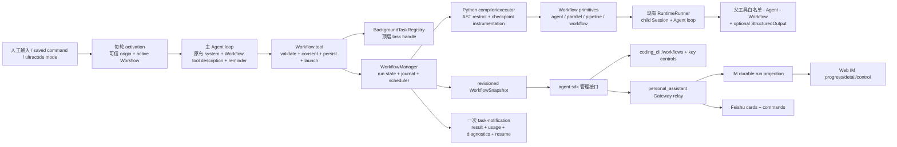
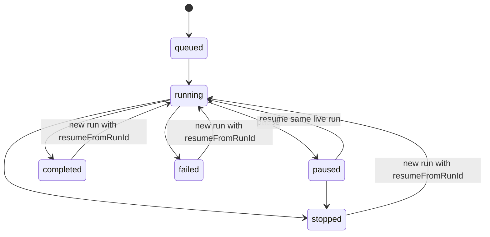

# feat-517：Python Dynamic Workflows 技术方案

> Gate 1 已收口：除脚本语言与相应语法改为 Python 外，行为基线取 Claude Code 2.1.226 Dynamic Workflows 与实现期官方文档；不新增自动激活、资格校验或另一套权限体系。
>
> 本文是 Full unit 的实现前设计，不包含产品代码。用户契约见 [`spec.md`](spec.md)，逆向证据见 [`../../research/studies/claude-code-dynamic-workflows-2026-08-08/`](../../research/studies/claude-code-dynamic-workflows-2026-08-08/)。

## Changelog

- 2026-08-09：完成初稿；补录 Claude Code 2.1.226 `/effort ultracode` 的 Luna 最小 trace，确认会话态 reminder 的逐字内容与 tool schema 同时进入 provider 请求。
- 2026-08-09：按独立设计审查 R1 收口并发 ordinal、provider reminder placement、模型 override、save symlink 与 canonical MODIFIED 契约。

## 现状分析

### 已固定的上游基线

本设计不从功能名称猜实现，而是同时使用四条证据链：当前官方文档、本机固定版本的 provider 请求、固定二进制的静态调用链、本仓实际接缝。复刻目标中的事实与 locator 如下。

| 事实 | 证据 | 本设计约束 |
|---|---|---|
| Workflow 是一次 tool call 后后台运行的编排程序，完成后以 task notification 返回 | Claude Code 2.1.226 Luna 完整生命周期 session `896b1c37-dec8-402f-9116-238c55377086` | `Workflow.run()` 只完成校验、持久化、注册和启动，不同步等待子 Agent |
| provider 获得完整 Workflow tool description/schema；没有另一段稳定 Workflow system prompt | `2026-08-08_17-59-46_754-req-anthropic_messages.json`；canonical tool object 21,259 chars、description 19,214 chars、schema 1,775 chars | 核心指导写在 tool description；工具未启用时它自然完全不进入 provider payload，不新增常驻 prompt section |
| 人工 typed `ultracode` 追加精确 keyword reminder | 同一 session 的 transcript 与 request | 仅可信人工来源追加逐字 reminder；普通 SDK、cron、heartbeat、notification 不因同词触发 |
| `/effort ultracode` 是 session-only 的 xhigh + standing Workflow opt-in | 2026-08-09 Luna session `aa5fe232-c31f-45bf-a0dd-c416fb1dc66c`；request `2026-08-09_00-56-12_152-req-anthropic_messages.json` | 会话配置同时保存 xhigh effort 和 workflow mode；`/new` 重置，普通 `/effort high` 关闭 standing opt-in |
| JavaScript 先经 Acorn 提取 meta、限制和插桩，再由 `vm.Script.runInContext` 真执行 | 固定 Mach-O SHA-256 `013a1cf17df5ff1dcc189d5d6fd3fdd5f097ddc3cd41aa9992e99805574febbe` | Python 版同样采用 AST 校验/插桩 + Python 编译执行，不实现一套逐节点 AST 解释器，也不另起 Python subprocess |
| 子 Agent 复用既有 query harness；Workflow child 不再获得 Agent/Workflow | 主/子 provider request 对账 | 复用 `RuntimeRunner`/SessionDirectory；继承父工具集合后去掉 `Agent`、`Workflow`，按需加内部 structured-output tool |
| resume key 是 chained SHA-256 v2 | 二进制静态恢复 | 严格按前缀 key 复用，不按脚本文本整图缓存，不把 label/phase 错算为行为变化 |

本次新 trace 的 provider-facing standing reminder 逐字为：

```text
Ultracode is on: optimize for the most exhaustive, correct answer — not the fastest or cheapest. Use the Workflow tool on every substantive task; token cost is not a constraint. See the Workflow tool's **Ultracode** section and quality patterns. Solo only on conversational/trivial turns.
```

已捕获 keyword reminder 逐字为：

```text
The user included the keyword "ultracode", opting this turn into multi-agent orchestration — use the Workflow tool to fulfill the request.
```

这两段是 turn attachment/reminder，不是常驻 system section。两份实 capture 都是当前 human `user` message 之后的独立尾部 `role="system"` message；不是 leading system、也没有拼入 user text。Python 移植保留原文、role 和相对顺序，避免在三个产品入口各写一版近义提示造成行为 drift。

### 本仓当前接缝

| 当前能力 | 代码入口 | 设计结论 |
|---|---|---|
| 会话工具白名单与 prompt 按每轮快照解析 | `agent.core.agent.loop`、`PromptContext.has_tool()`、`Kernel.preview_prompt()` | `Workflow` 是否进入 active tools 是唯一能力开关；tool schema/description、reminder、commands 都从同一 resolved capability 派生 |
| 产品只通过 SDK 使用内核 | `agent.sdk.build_kernel` / `Kernel`，由 contract 测试守边界 | Workflow 管理 DTO 和方法由 `agent.sdk` 暴露；CLI/PA 不 import core/platform，IM 仍不 import agent |
| 已有子 Agent 会话、执行和工具继承 | `_SessionSubagentControl`、`RuntimeRunner`、`AgentTool` | 新增 Workflow child adapter，只扩 effort、origin、permission route 和 return-value contract，不复制 LLM loop |
| 已有后台任务注册、stop handle、单次通知 | `BackgroundTaskRegistry`、`_NotifyingStore`、`task_stop` | 增加 `WORKFLOW` 类型作为顶层 task handle；详细 phase/agent/journal 仍归 Workflow manager，不把通用 registry 变成工作流数据库 |
| 已有 permission broker 与 Web/飞书批准面 | `auto_mode_gate`、`PermissionBroker`、`PermissionCard`、`FeishuPermissionApprovalSurface` | 扩展 request presentation 和一次 tool-owned decision callback；继续使用同一 broker/request id，不建第二条审批链 |
| PA 工具为显式真白名单，配置下一轮整体生效 | `resolve_enabled_tools()`、`SessionComposition`、`PA_OPTIONAL_TOOL_IDS` | `Workflow` 是 optional、默认关闭；勾选后下一轮完整出现，取消后下一轮完整消失，进行中的旧轮次保持启动快照 |
| Web IM 已有 slash picker、工具时间线和 Agent allowlist | `slash-candidates.ts`、`tool-calls-panel.tsx`、`allowlist-selector.tsx` | 复用现有组件语言；新增运行进度层和 Workflow 特化批准卡，不把进度塞进普通 tool output 长文本 |
| Session JSONL 根由 product config dirname 派生 | `JsonlSessionFiles` | Workflow artifact 与 session 同根，不硬编码 `.nanocode`/`.nanoassistant` |

### 既有约束

- `coding_cli`、`personal_assistant` 只能 import `agent.sdk`；`IM` 不调用 `agent`；`core` 不依赖 `platform`。
- Tool protocol 的执行入口是同步 `run()`，registry 通过 worker thread 执行；Workflow tool 必须在返回前只做有界启动工作，后台 runtime 自己拥有 async loop。
- 主会话历史只保留 launch result 与完成 notification；大量 child transcript、阶段日志和返回值留在 Workflow artifact 中。
- 真实文件、shell、网络和 MCP 权限只属于子 Agent 的既有 tool layer。Workflow Python 代码只获得编排 primitives，不能成为权限旁路。
- 本 unit 不把开发用 `agent.platform.worktree_runtime` 当产品 worktree API；它只服务 milestone 隔离栈，生命周期与 Workflow agent isolation 不同。

## 架构总览

Workflow 是一个深模块：外部只看到一个 tool、少量 SDK 管理方法和一种 revisioned snapshot；脚本解析、调度、journal、resume、child 生命周期与保存发现全部藏在模块内。



### 模块归属

| 层 | 新增/扩展责任 | 不拥有 |
|---|---|---|
| `agent.core.workflows` | frozen models、状态转换、pure-literal meta、AST policy/插桩、resume signature、调度接口 | 文件系统、git、threads、具体 child runner、产品 UI |
| `agent.platform.workflows` | `WorkflowManager`、Python executor、run/journal store、saved registry、consent store、child adapter、worktree manager | 产品命令和 IM persistence |
| `agent.platform.tools.builtins.workflow` | model-facing `Workflow` schema/description、launch permission presentation、调用 manager 后立即返回 | 长期运行状态机和 UI |
| `agent.sdk` | SDK-owned snapshots/requests 与 Kernel 查询/控制/保存方法 | platform 实现类型 |
| `coding_cli` | 默认启用、slash commands、terminal progress/detail/controls | 运行状态真源 |
| `personal_assistant` | optional capability projection、human-origin 标注、SDK event/control relay、飞书适配 | Workflow 调度与 journal |
| `IM` | Agent 工具选择、Workflow snapshot 持久投影、Web command/进度/批准 UI | import `agent` 或解释 Python workflow |

## 关键决策

### 决策 1：`Workflow` active tool 是唯一能力开关，不另设稳定 system prompt feature

当前同一会话的 active tool snapshot 已同时决定发给模型的 tool schema 和 prompt 的 `has_tool()`。本设计把所有 Workflow 表面从这一个事实派生：

```python
# before：PA 只按 allowlist 解析普通工具
enabled_tools = resolve_enabled_tools(agent_config)

# after：仍只解析一份 allowlist；没有第二个 workflow_enabled 真源
enabled_tools = resolve_enabled_tools(agent_config)
workflow_active = "Workflow" in enabled_tools
```

- active：provider 获得 Python 版 Workflow tool object；可信人工 `ultracode` 或 session ultracode mode 可追加对应 reminder；产品暴露 `/workflows`、saved commands、`/effort ultracode` 和规模配置。
- inactive：这些 model-facing 和运行入口从下一轮完整缺席；`Workflow` tool call 也会被现有执行层白名单拒绝。
- 进行中的一轮和已启动 Workflow 持有启动时 snapshot，不被中途配置更新拆成混合状态。

不新增 `CORE_WORKFLOW_GUIDANCE`。这样关闭工具时无需靠多处分支“记得删 prompt”，也与已捕获 Claude Code 请求一致。

### 决策 2：tool prompt 以逐字 capture 为 source of truth，只做 Python 语法机械变换

实现时从 trace 提取 19,214-char description 与 1,775-char schema，形成仓内 versioned `workflow_tool_prompt.md` 和 schema constant。变换 ledger 只允许：

1. `JavaScript`/`JS`/`TypeScript` 改为 Python 对应描述；
2. `export const meta` 改为顶层 `meta = {...}` 与 `async def main()`；
3. JS 示例改为语义等价 Python；
4. option `agentType` 在 Python primitive 内写为 `agent_type`；外层 tool input 仍保留 `scriptPath`、`resumeFromRunId`；
5. `.claude/workflows` 改为 product-derived `<config-dir>/workflows`，Claude 专属 UI 名称改为本产品入口。

opt-in、hybrid、pipeline default、barrier 判断、quality patterns、limits、budget、resume、worktree、structured result、model/effort 和 size guideline 各段不得删成短 surrogate。测试对 prompt 做 clause inventory 与 Python 禁词/示例编译检查；capture hash 作为 provenance 记录，而不是要求变换后的文本拥有同一 hash。

对外 tool schema 保持 Claude Code 字段与优先级：

```json
{
  "script": "inline Python, max 524288 chars",
  "scriptPath": "existing Python artifact; precedence 1",
  "name": "saved/built-in/plugin name; precedence 3",
  "args": "any JSON value",
  "resumeFromRunId": "^wf_[a-z0-9-]{6,}$",
  "description": "accepted but ignored",
  "title": "accepted but ignored"
}
```

选择顺序固定为 `scriptPath > script > name`；三者皆无或源不可读时在启动前返回可定位错误。兼容 ignored 字段是上游现有 schema，不扩展出第四种输入。

### 决策 3：Python 同样是“AST 辅助 + 真编译执行”，不是 AST 解释器或 subprocess

Python program contract：

```python
meta = {
    "name": "review-changes",
    "description": "Review changed files and verify every finding",
    "whenToUse": "Use for broad code review",
    "phases": [
        {"title": "Review", "detail": "independent dimensions"},
        {"title": "Verify", "detail": "adversarial verification"},
    ],
}

async def main():
    phase("Review")
    results = await pipeline(
        args["dimensions"],
        lambda dimension, original, index: agent(
            dimension["prompt"],
            label=f"review:{dimension['key']}",
            phase="Review",
            schema=FINDINGS_SCHEMA,
        ),
        lambda review, original, index: parallel([
            lambda finding=finding: agent(
                f"Try to refute: {finding['title']}",
                phase="Verify",
                schema=VERDICT_SCHEMA,
            )
            for finding in review["findings"]
        ]),
    )
    return results
```

顶层只允许：一个 pure-literal `meta`、pure-literal 常量、普通/async helper definitions，以及恰好一个 `async def main()`；不执行其他顶层语句。`meta.name`、`meta.description` 必填，`whenToUse`、`phases` 可选；phase title 精确匹配。

编译链固定为：

```text
ast.parse
  → ast.literal_eval(meta)
  → capability policy validation
  → 在 main/helper 入口、循环 back-edge 和 await 边界插入 __workflow_checkpoint__
  → compile(filename=<artifact path>, mode="exec")
  → dedicated daemon thread + private asyncio loop
  → exec(restricted_globals) 后 await main()
```

允许正常 Python 控制流、comprehension、literal/container、异常处理和确定性 safe builtins；拒绝 import、class、global/nonlocal、文件/进程/网络 API、动态代码生成、反射和任何以下划线开头的 name/attribute。`args` 与跨 runtime 的 return value 先 JSON clone。`open/eval/exec/compile/__import__/getattr/setattr/vars/dir/type/object` 不进入 builtins；时间与随机值由 `args` 传入。

这是一层 capability sandbox，不宣称能在同一 Python 进程里抵抗蓄意利用解释器漏洞。与 Claude Code 一样，信任边界是用户在 launch approval 看到脚本后决定是否执行；脚本本身没有 OS authority，所有副作用下沉到受既有权限控制的 child Agent。

### 决策 4：primitives 只表达编排，所有 Agent effect 进入同一 manager

Python 注入面固定为：

```python
await agent(prompt, *, label=None, phase=None, schema=None,
            model=None, effort=None, isolation=None, agent_type=None)
await parallel(thunks)
await pipeline(items, stage1, stage2, ...)
await workflow(name_or_ref, args=None)
phase(title)
log(message)
args
budget.total
budget.spent()
budget.remaining()
```

语义与上游对齐：

- `agent()` 无 schema 返回 final text；有 schema 返回 validated JSON value；terminal API error 或用户 stop 返回 `None`。
- `parallel()` 是 barrier，保留输入位置；thunk error 变 `None`，调用本身不因单项失败 reject。
- `pipeline()` 对每个 item 独立流过全部 stages，无跨 item barrier；stage 收 `(previous, original, index)`，单项错误变 `None` 并跳过该 item 后续 stages。
- `workflow()` inline 等待 child workflow result，共享 semaphore、agent counter、abort、journal tree 和 token ledger；只允许一层 nesting。
- `phase()` 改当前顺序执行的默认 phase；并发 stage 应显式传 `phase=`，避免全局 phase race。
- `log()` 只生成 progress narrator event，不写进主聊天正文。

manager 统一守三个上游硬上限：并发 `max(1, min(16, cpu_count - 2))`、run lifetime 1000 个 Agent、一次 parallel/pipeline 4096 items。并发多出的 effect 排队；超过 agent/item 硬上限明确失败，不静默截断。

Python 并发下的“agents started 顺序”由 manager 的单一 admission coordinator 定义，不取决于 coroutine 抢占或 semaphore 唤醒时机：

- 注入的 `agent()` 是同步构造 `AgentCall` awaitable 的普通函数；构造时即在任何 `await` 和 semaphore 前，经同一锁取得 run-global 单调 `start_ordinal`。`await AgentCall` 才等待结果，FIFO dispatcher 按 ordinal 开始 live child，脚本写法仍是 `await agent(...)`。
- `parallel(thunks)` 要求同步 thunk，并在调用线程按输入 index 依次调用它们取得 awaitable，随后才允许并发；因此首批 effect 顺序等于输入顺序。async helper 可包在单个 Agent 的 prompt 生成外，但不能作为 parallel thunk 偷渡另一套调度顺序。
- `pipeline(items, ...)` 的 stage driver 按 item index 同步调用 stage 0；后续 stage 在上一 stage terminal event 写 journal 后调用，先完成者先进入下一 stage，同一 journal 批次以 item index 破平。这里的“确定”是对该 run 已记录事实的确定，不承诺两个全新 LLM run 有相同完成时序。
- nested Workflow 不建立自己的 counter；其 effect 与父 script 共用同一 admission coordinator 和全局 ordinal。
- resume replay 已缓存 result 时，replay coordinator 按原 journal 的 terminal ordinal 释放 cached completion；这会重现原 run 的 pipeline 下游 admission。第一处 miss 之后全部走 live FIFO，不能再回到 cache。

journal 同时记录 `start_ordinal` 与 `terminal_ordinal`。永久测试 oracle 固定 parallel 输入顺序、pipeline 首 stage/item 与后续 completion 顺序、同批 item-index 破平、nested 全局顺序；再对同一 journal 做 100% replay 和中途 key 变化的 prefix cut-off。实现不得以 `asyncio.create_task()` 实际调度顺序替代这份契约。

### 决策 5：复用现有 child Agent loop，以 return-value contract 和内部 structured tool 收口

Workflow child 仍由 `SessionDirectory` 创建子 session、由 `RuntimeRunner` 执行。相比普通 `AgentTool`，adapter 只增加：

- `RunOrigin.WORKFLOW`、parent Workflow run/call id、父 permission route；
- 继承父 resolved model/effort，允许本次 `agent()` 显式 override，并服从 build-scoped Workflow child model override；
- child system addendum 说明“final text 是脚本 return value，不是发给人的消息”；
- child active tools = 父轮 resolved tools − `{Agent, Workflow}`；
- 若传 `schema`，临时追加只在该 child 可见的 `StructuredOutput` tool。

`StructuredOutput` 的 provider schema 使用调用方传入的 JSON Schema，tool result 由既有 tool-call 校验层验证；不合法结果作为 tool error 回给 child 继续修正。manager 从 `TurnResult.tool_calls/tool_results` 读取最后一个成功的 `StructuredOutput` 参数，不解析 final prose。新增 `jsonschema` runtime dependency，用于 provider 无法原生约束 tool schema 的统一验证。

### 决策 6：Workflow 状态由 append-only journal + atomic snapshot 持久化

所有路径从 session 的实际 storage base 派生；未配置独立 `data_dir` 时形态为：

```text
<workspace>/<config-dir>/sessions/
  <session-id>.jsonl
  <session-id>/
    workflows/
      scripts/<slug>-<run-id>.py
      runs/<run-id>/run.json
      runs/<run-id>/journal.jsonl
      runs/<run-id>/worktrees/<call-id>/
    subagents/<child-session-id>.jsonl
```

`journal.jsonl` 是 effect/result/transition 的诊断与 resume 真源，事件包含 `run_started`、`phase_changed`、`log`、`agent_started`、`agent_result|agent_error|agent_stopped`、`run_*`，每条带 run revision 与稳定 ordinal。`run.json` 是供 UI/SDK 快速读取的完整 snapshot，以临时文件 + replace 原子更新；启动恢复时可从 journal 重建。实现不承诺跨机器复制或跨版本 cache migration。

状态机：



暂停只阻止新 effect 获得 dispatch slot；已在跑的 child 可自然完成并写 journal。停止 selected Agent 取消其当前 attempt，script await 得到 `None`，其他分支继续。停止整 run 取消所有 attempts 并进入 `stopped`。restart selected Agent 取消/替换同一个 logical call，原 script await 最终收到 replacement result，不新建第二个逻辑 ordinal。

### 决策 7：resume 严格复刻 chained v2 最长相同调用前缀

每个实际 `agent()` 开始时计算：

```text
options = canonical_json({schema, model, effort, isolation, agentType}, sort_keys=True)
key[0] = "v2"
key[n] = sha256(key[n-1] + NUL + prompt + NUL + options)
```

`None` 字段按上游 canonical object 的实际省略规则处理；`label`、`phase` 不进入 key。resume 必须属于同一 parent session。调用次序严格采用决策 4 的 run-global admission ordinal；按 original start ordinal 比较 previous journal：只要当前 key 与同 ordinal 已完成 result 相同，就立即 replay，并按 original terminal ordinal 释放 cached completion；遇到第一个 incomplete、changed 或 missing effect 后关闭该 run 后续所有 replay。这样同脚本/args 可 100% 命中，改第二个调用只重跑第二个及以后。

暂停的同一 live run 用 checkpoint 继续，不经 cache 重启；停止/失败/完成后的恢复总是创建新的 run id 并记录 `resumed_from`，避免把两个生命周期混成一个状态。

### 决策 8：启动审批复用现有 broker，Workflow child 权限回到父交互面

`Workflow.check_permissions()` 解析并验证 script source/meta 后返回非 safety-check 的 `ask`，presentation 带 `name`、`description`、phases、size guideline、estimated scale warning、source kind 与 script artifact/preview。选项严格为 Once、Always、Deny，不显示普通工具的 Allow-for-session。

最小扩展为：

```python
PermissionRequest(..., presentation={"kind": "workflow_launch", ...})

# auto_mode_gate 在 ask resolution 后调用可选 tool hook
tool.on_permission_decision(identity, decision, auto_mode=config.enabled)
```

- default/accept-edits：每次 launch ask，除非该 saved name/canonical script path 已 Always consent。
- Auto mode：第一次 launch ask；任一 Yes 按上游语义持久同一 name/path consent。
- ultracode、dangerously bypass、非交互 `-p`/SDK：不产生 launch card。Workflow launch ask 不是 bypass-immune safety check。
- inline script 的 consent identity 使用 pure-literal `meta.name`；named/built-in/plugin 使用 resolved name；`scriptPath` 使用 canonical path。存储跟 product config root 走，不放进 session JSONL。

Workflow child 永远采用 accept-edits：若父 allowlist 本来含 write/edit，则对应调用无需再次批准；它不会凭空获得父 allowlist 没有的工具。shell、web、MCP 等仍走现有 gate。交互式 Workflow child 的 permission request 使用全局 broker request id，但只把 permission request/resolved 事件路由到 parent session，并附 `workflow_run_id`/`agent_call_id`；Web/CLI/飞书沿现有批准通道响应。无人值守 child 继续走现有 unattended fallback，不能制造无人可答的挂起卡。

### 决策 9：只在可信人工入口生成 opt-in reminder，运行时不再加第二道资格硬门

`RunOrigin` 增加 `HUMAN` 与 `WORKFLOW`：

- interactive CLI typed input、Web IM 已认证用户消息、外部 IM 已认证人类消息 → `HUMAN`；
- CLI `--text`、普通 SDK submit、webhook/bot/system 转发 → 保持非 human；
- Workflow child → `WORKFLOW`；heartbeat/cron/background notification 保持原值。

turn preparation 在 active tools 已解析后执行：`HUMAN` 原始文本包含 `ultracode` 时追加已捕获 keyword reminder 与 `workflow_keyword_request` metadata attachment；session mode 为 ultracode 时追加已捕获 standing reminder。provider-independent 输入使用专门的 `LLMMessage(role="turn_system", ...)` 表示这种 mid-conversation system turn：它紧跟当前 human message，排在模型调用前其他动态 turn-system 内容的末尾；provider mapper 将它原位映射为独立 `role="system"` message，不能把它提升并合并到 top-level/leading system，也不能拼进 user text。若同一轮同时符合 keyword 与 standing，两段按 keyword、standing 顺序进入同一尾部 turn-system message，各出现一次。

这些 reminder 都不是一条 runtime allow token：模型仍可因用户自己的自然语言、saved command 或 skill instruction 显式调用 Workflow，与 Claude Code tool description 一致。执行层只使用正常 tool allowlist，不发明“没有 reminder 就拒绝 tool call”的额外资格校验。provider request golden 覆盖 Workflow inactive、active 无 reminder、active keyword、active standing 四种状态，并断言最终 role/order 与逐字内容。

`+500k` 风格 token target 同样只从可信 human turn 解析，创建本轮共享 `OutputTokenBudget`。父模型与本轮所有 Workflow child 的 completion tokens 累计到同一 ledger；达到 total 后允许当前 model call 收尾，但后续 `agent()` 在 dispatch 前抛出明确 budget error。

### 决策 10：saved Workflow 沿 product config roots 发现，命令只是显式 tool invocation

保存/发现规则：

- project discovery：从 cwd 到 git root 的每一级都读取 `<config-dir>/workflows`；不同名称累计，同名由离 cwd 最近的定义覆盖；
- project save：选择最近的既有 `<config-dir>/workflows`，若都不存在则落 git root；只要 project config dir、`workflows` dir 或目标 `.py` 文件任一是 symlink 就拒绝保存；
- personal：`~/<config-dir>/workflows`；
- personal save 只在目标 `.py` 文件本身是 symlink 时拒绝；允许 personal config/workflows 目录由 dotfiles 工具以 symlink 管理；
- 最近 project 同名优先，再到 personal；project 优先于 personal。discovery 只按上述 precedence 正常读取，不增加未经取证的 symlink 拒绝规则；
- bundled `/deep-research` 是随产品提供的 Python script；
- plugin adapter 可经 `build_kernel(workflow_search_roots=...)` 注册 namespace/root，命令为 `/<plugin>:<name>`，内核不引入通用 plugin manager。

`/<name> [args]`、`/deep-research` 和 namespaced command 都解析为对当前 active `Workflow` 的显式 invocation，使用同一审批、artifact、manager 和 notification。禁用工具时命令不进入 CLI/Web/外部 IM command discovery，也不能绕开 session allowlist 直接调 manager。

### 决策 11：worktree isolation 是 Workflow 自有的短生命周期 git adapter

`isolation="worktree"` 只在 Agent 会修改文件且与并发兄弟冲突时使用。manager 在 dispatch 前从 parent workspace HEAD 创建 detached worktree：

```text
<session workflow root>/runs/<run-id>/worktrees/<call-id>
```

child cwd/repo_root 都指向该 worktree。完成后无 diff 自动 `git worktree remove`；有 diff 则保留路径并在 agent/run detail 中展示，由用户自行检查/合并。不是 git repo 或创建失败时，该 agent call 在派发前明确失败；不退回共享目录，不自动 merge，也不新增分支策略。

### 决策 12：SDK 只暴露 query/control，不泄漏 manager

`agent.sdk` 新增 SDK-owned `WorkflowRunInfo`、`WorkflowAgentInfo`、`WorkflowPhaseInfo`、`SavedWorkflowInfo` 与 control/save enums。`Kernel` 提供五个窄方法：

```python
kernel.list_workflow_runs(session_id=...)
kernel.get_workflow_run(session_id=..., run_id=...)
kernel.control_workflow(session_id=..., run_id=..., action=..., agent_call_id=None)
kernel.save_workflow(session_id=..., run_id=..., scope=..., name=None)
kernel.list_named_workflows(workspace_root=...)
```

产品不取得脚本 executor、store 或 child session 对象。`control_workflow` 的 action 只含 `pause|resume|stop|restart_agent`，参数组合由 DTO 验证。tool launch 与 SDK management 共用同一 manager instance，由 `build_kernel` 装配。

`build_kernel` 的公共装配增量只有 `workflow_search_roots=()` 与 `workflow_subagent_model=None`；前者接收消费者拥有的 named/plugin roots，后者承载决策 5 的进程级 child override。CLI/PA 仍只从 `agent.sdk` 导入这两个 seam，不取得 platform registry。

## 接口与数据流

### Tool result、snapshot 与完成通知

启动成功立即返回：

```json
{
  "status": "async_launched",
  "taskId": "wt_...",
  "runId": "wf_...",
  "name": "review-changes",
  "scriptPath": "/.../scripts/review-changes-wf_....py",
  "transcriptDir": "/.../runs/wf_...",
  "guideline": "medium"
}
```

`WorkflowRunInfo` 是 revisioned complete snapshot，而非 patch：

```text
run_id, task_id, parent_session_id, revision, status, meta,
current_phase, phases[], agents[], logs[], usage, duration_ms,
size_guideline, large_warning, script_path, transcript_dir,
resumed_from, result, error
```

每次 transition 发布 session event `workflow_run_updated`。coding_cli 直接消费；Gateway 将其映射为 relay event `workflow_run_updated`，IM 持久化为独立 Workflow run projection，并向浏览器发 canonical `workflow.run.updated`。revision 小于等于当前值的 event 幂等忽略；因此断线 replay、Gateway shadow replay 和实时流不会制造倒退。

终态由 background notifier 只注入一次：

```xml
<task-notification>
  <task-id>wt_...</task-id>
  <workflow-run-id>wf_...</workflow-run-id>
  <status>completed|failed|stopped</status>
  <result>...</result>
  <diagnostics>script/journal/transcript locators and resume hint</diagnostics>
  <usage>...</usage>
</task-notification>
```

`BackgroundTaskType.WORKFLOW` 的 stop handle 走 cooperative manager stop；`task_stop` 不提前把它当 bash 同步 kill，以免 generic terminal race 抢先丢失 partial result。manager 写终态时同步更新 generic record，由既有 notified flag 保证没有 tool result + 两条 notification。

### 规模 guideline 与模型路由

resolved setting 值为 `unrestricted|small|medium|large`，默认 `medium`；tool description 末尾动态附当前值：small `<5`、medium `<15`、large `<50`、unrestricted 无建议上限。运行计划超过 25 Agent 或预计 1.5M tokens 时显示 `Large workflow`；若用户明确选了 guideline，则 Agent count warning threshold 使用该 guideline 边界；ultracode 隐藏 advisory warning。warning 不自动暂停。

CLI 从 `~/.nanocode/config.yaml` 与最近 workspace `.nanocode/config.yaml` 解析 `workflows.size_guideline`、`workflows.disabled`，workspace 覆盖 global；环境变量 `NANOCODE_DISABLE_WORKFLOWS=1` 是最终 disable。PA 的 Agent config 增加 `workflow_size_guideline`，只有 `Workflow` tool active 时参与下一轮 runtime snapshot；取消工具不删除保存值。Web Agent 设置在 Workflow card 内提供同一四档选择，外部 IM 可用 `/config workflowSizeGuideline <value>` 修改该 Agent。CLI 也提供相同窄 `/config` 子命令，不借本 unit 扩成通用 settings framework。

Agent model/effort 默认继承 parent resolved runtime；`agent(model=..., effort=...)` 可覆盖。为机械对应 Claude Code 的 child override，nano 新增唯一进程配置 `NANO_MULTIAGENT_WORKFLOW_SUBAGENT_MODEL`：CLI 与 PA factory 都读取它并传给 `build_kernel(workflow_subagent_model=...)`，任意外部 SDK 消费者也可直接传同名参数。解析优先级固定为 `workflow_subagent_model > agent(model=...) > parent resolved model`，不读取 `CLAUDE_CODE_SUBAGENT_MODEL`，也不复用会改变父模型的 `NANO_MULTIAGENT_LLM_MODEL`。

每次 child admission 先保留 requested model，再对当前 `LLMConfig` catalog 解析。requested 在 catalog 时直接采用；不在时替换为必定已解析的 parent model，并在 run snapshot/CLI/Web/飞书进度中只产生一次 `workflow_model_substituted` warning，包含 requested 与 resolved，不静默替换也不使整个进程启动失败。session ultracode mode 把主轮 effort 设 xhigh，Workflow child 默认继承；显式 child effort 仍只能取 resolved model catalog 声明支持的档位。

### 产品控制与可视化

#### coding_cli

- 默认启用 `Workflow`，除非配置/env disable。
- `/workflows` 打开最近 runs；运行中视图用一行 progress + 可展开 phase/agent tree。
- key controls 对齐上游：`p` pause/resume、`x` stop selected agent/run、`r` restart selected running agent、`s` save；非 TTY 用显式 `/workflows <run-id> <action>`。
- `/effort ultracode` 只在 active Workflow 且模型支持 xhigh 时出现；`/effort high` 关闭 mode；`/new` 重置。
- `/name` saved commands 进入现有 slash candidate/dispatch；`--text` 即使含 ultracode 也不自动加 keyword reminder，但用户直接说“run workflow”仍是模型可见的显式语言。

#### Web IM

- Agent 设置沿用 allowlist card；`Workflow` 是 optional、默认未勾选，勾选后显示四档 guideline。
- chat composer 上方只在当前会话有 active run 时显示紧凑 progress strip；点击或 `/workflows` 打开 detail sheet。
- detail 显示 phase、agent status/count、token/time、logs；选择 Agent 显示 prompt、recent tools、result/error、worktree path；提供 pause/resume/stop/restart/save。
- launch approval 用 Workflow-specific presentation：名称、说明、phases、规模/token caution、查看原始 Python；按钮 Once/Always/Deny。
- tool disabled 后，新一轮不再发现 saved commands、`/workflows`、ultracode 或 launch UI。由已启动旧轮拥有的 progress/control 继续可见直至终态，避免用户因取消工具失去停止在跑任务的能力；终态后不在新的 command discovery 中暴露管理入口，历史消息仍保留已发生 tool row。

#### 外部 IM / 飞书

- 人工消息走与 Web 相同的 human-origin、saved command 和 control command parser。
- launch approval 是原生互动卡，内容/选项与 Web 一致；按钮回同一 broker request id。
- progress 查询/控制用 `/workflows` 互动卡；后台不逐 agent 刷屏，只在显式查看时更新卡，终态发一次结果卡/文本。
- 外部 channel 仍不发送普通内部 tool timeline；Workflow progress 是用户显式选择的 task surface，不改变该契约。

## 前端原型

- 原型文件：[`prototype.html`](prototype.html)
- 覆盖：Agent tool selection、launch approval、chat progress strip、run detail、终态与 disabled 对照、desktop/mobile。

### 现有 UX grounding

| 当前入口/组件 | 必须继承 | 本次嵌入 |
|---|---|---|
| `AllowlistSelector` / Agent detail | 白卡、teal selected state、现有工具真值 | 直接出现 `Workflow` option；选中后在卡内展开 guideline，不加另一枚 feature toggle |
| `MessagePane` / composer | 对话主体和 composer 层级稳定 | progress strip 贴 composer 上方，不占 assistant bubble，不挤走 slash picker |
| `SlashPicker` | `/` 起始触发、command/skill 同一候选语言 | active 时加入 `/workflows`、`/deep-research`、saved/plugin workflows；inactive 时完全不组装 |
| `PermissionCard` | inline pending、resolved 后由 tool row 留审计结论 | `presentation.kind=workflow_launch` 选择 Workflow 专属正文，提交仍走原 permission endpoint |
| `ToolCallsPanel` | tool row 是“发起动作”而非长期任务面板 | Workflow row 展示 launch/run id；持续进度由独立 run projection 展示 |

### 原型对齐契约

| 原型区域/状态 | 对齐级别 | viewport/状态 | 下游验收 |
|---|---|---|---|
| Agent 设置中单一 Workflow tool card + guideline | must-match | desktop / mobile；selected / deselected | M2 worker #1；M2 reviewer #1 |
| Workflow launch approval 的 meta/phases/caution/raw script | must-match | pending / resolved / denied | M2 worker #2；M2 reviewer #2 |
| composer 上方 compact progress strip | must-match | running / paused / no active run | M2 worker #3；M2 reviewer #3 |
| run detail phases/agents/usage/control | must-match | running / failed / completed | M2 worker #4；M2 reviewer #4 |
| disabled 对照时命令和新入口消失 | must-match | next-turn config boundary | M2 worker #5；M2 reviewer #5 |
| 具体字体、阴影、动画时长 | may-adapt | 复用现有 tokens | 不改变信息层级和控件可达性 |

## 契约层增量（delta-spec）

- kernel：[`specs/kernel/workflows.md`](specs/kernel/workflows.md)、[`specs/kernel/spec.md`](specs/kernel/spec.md)、[`specs/kernel/runs.md`](specs/kernel/runs.md)、[`specs/kernel/background-tasks.md`](specs/kernel/background-tasks.md)、[`specs/kernel/sdk-boundary.md`](specs/kernel/sdk-boundary.md)
- cli：[`specs/cli/interactive-repl.md`](specs/cli/interactive-repl.md)、[`specs/cli/spec.md`](specs/cli/spec.md)
- gateway：[`specs/gateway/workflows.md`](specs/gateway/workflows.md)、[`specs/gateway/spec.md`](specs/gateway/spec.md)、[`specs/gateway/agent-capabilities.md`](specs/gateway/agent-capabilities.md)
- im：[`specs/im/workflows.md`](specs/im/workflows.md)、[`specs/im/spec.md`](specs/im/spec.md)、[`specs/im/agents-nodes.md`](specs/im/agents-nodes.md)

`kernel/workflows.md`、`gateway/workflows.md`、`im/workflows.md` 是新增 canonical areas，因此各包 `spec.md` 只增 area index；其他文件只写对应消费者可观察增量，不记录模块/类名。

## 测试策略

| 风险 | 最低能暴露的 seam | 永久保护 |
|---|---|---|
| Python policy、meta、插桩、primitives、limits、resume key/state machine | pure core interfaces | `tests/unit/agent/core/workflows/`，fake child adapter，不起 LLM |
| tool prompt/schema 与 active/inactive payload | tool registry + provider mapper request | 扩展 tool/prompt golden contract；clause inventory、schema snapshot、inactive absence |
| child return、structured output、permission route、background notification | Kernel + real in-process session/runtime | `tests/integration/agent/workflows/`，stub LLM/provider，验证一次通知和 parent route |
| SDK/import boundaries、event/snapshot schema | public SDK + contract tests | 扩展 `tests/contract/` 既有边界与 event schema，不重复内部状态测试 |
| CLI command/progress/control | CLI subprocess/async REPL | `tests/integration/coding_cli/`；TTY key handling 单测 + 非 TTY command journey |
| PA selection next-turn boundary、Gateway relay、IM persistence | Gateway/IM protocol and API | 扩展 agent config operation、relay、event bridge/repository tests |
| Web visual/control/slash/approval | real browser + isolated full stack | `tests/e2e/` Playwright；desktop + 390px，网络 event/revision 与 UI 一起断言 |
| 飞书 card/action/delivery | dedicated Feishu E2E profile | adapter tests + 隔离真实 `--feishu` probe/用户旅程 |
| 真 model 生成合法 Python/执行一 Agent | LLM Proxy Luna | 一条 `@pytest.mark.e2e` 最小 lifecycle；主/child 都固定 Luna、low，严禁规模实验 |

新增测试先搜索既有 owner：tool registry/prompt 归入现有 tool/prompt tests，background/permission/CLI command/IM event 各扩其现有文件；只有 Workflow core state/compiler 与 Workflow IM projection 没有语义 owner 时才新建按行为命名文件。实现 worker 在各 milestone 的 `tasks.md` 记录具体 keep/rewrite/delete，对同一失败原因不做 unit/integration/e2e 三份机械复制。

## 风险与回退

| 风险 | 控制与验证 | 回退边界 |
|---|---|---|
| Python sandbox 被误当安全容器 | 明确 capability boundary；拒绝反射/动态代码；所有副作用仍需 child permissions | 可全局 disable Workflow；不能临时给脚本开放 fs/shell |
| tool prompt 变短导致模型编排质量不兼容 | 逐字 capture provenance + 仅 Python 机械变换 ledger + clause inventory | 回退到上一版完整 Python prompt，不用短 surrogate |
| tool 取消后残留 reminder/command | 同一 active tool snapshot 生成 provider payload 与 commands；开/关 A/B request golden | 回退 capability 注册；不得只藏 UI 保留 hidden prompt |
| pause/stop/notification race | journal revision、manager 单一终态、generic record cooperative stop、notified flag | 停止新 dispatch，保留 journal/partial result；不删除诊断 artifact |
| 并发 resume ordinal 不稳定 | 单一 admission coordinator；parallel 输入、pipeline completion/item tie-break、nested global ordinal 与 cached terminal replay 均有测试 oracle | resume 失败时明确从头新 run，不冒充 cache hit |
| child permission 卡发到不可见 session | parent permission route + broker request id + workflow identifiers；三入口测试 | 无可交互 surface 时走既有 unattended fallback，不无限 parked |
| worktree 有改动被误删 | 只 auto-remove clean worktree；dirty path 展示并保留 | disable isolation；不退回共享 cwd 自动运行 |
| IM live/replay 状态倒退或重复 | complete snapshot + monotonic revision + durable projection | 暂停 live progress，`/workflows` 按 SDK 真源查询；不拿 message bubble 当状态库 |
| 成本失控 | guideline/advisory、hard caps、共享 turn budget、可见 usage/stop；E2E 固定 Luna minimal | disable launch，新 run 不接收；在跑 run 可 stop 并保留 artifact |

功能回退以“停止发现和新 launch，但仍能终止已在跑 run、读取诊断”为原则。不得通过删 journal、删 dirty worktree 或让 tool disabled 后进度失联来回退。

## Runbook for Reviewer

### 静态与自动化

```bash
PYTHON=.venv/bin/python
$PYTHON -m pytest -m "not e2e" tests/
$PYTHON -m ruff check src tests
$PYTHON -m ruff format --check src tests
PYTHON="$PYTHON" ./scripts/docs-check
git diff --check
```

### CLI + Luna 最小 Workflow

使用用户现有 LLM Proxy，主模型和 child 都固定 Luna、low；只运行一个不调用工具、返回固定字符串的 Agent：

```bash
export ANTHROPIC_BASE_URL="http://127.0.0.1:4000"
export ANTHROPIC_AUTH_TOKEN="token"
unset ANTHROPIC_API_KEY
export NANO_MULTIAGENT_LLM_PROVIDER="anthropic"
export NANO_MULTIAGENT_LLM_BASE_URL="http://127.0.0.1:4000"
export NANO_MULTIAGENT_LLM_API_KEY="token"
export NANO_MULTIAGENT_LLM_MODEL="codexOAuth:gpt-5.6-luna"
export NANO_MULTIAGENT_WORKFLOW_SUBAGENT_MODEL="codexOAuth:gpt-5.6-luna"
PYTHONPATH=src .venv/bin/python -m coding_cli.main
```

Reviewer 先用普通明确 opt-in 运行一 Agent Python Workflow，检查 async launch、`/workflows`、pause/resume、完成 notification、script/journal；再在同会话对比 Workflow enabled/disabled 的 provider request，断言 inactive 时 tool object、reminder、saved commands、ultracode entry 均不存在。真实 request locator 记 `progress.md`，不提交 proxy payload。

### Web IM + Gateway + 浏览器

必须使用隔离真栈，不复用主实例端口/config：

```bash
REPO_ROOT="$(git rev-parse --show-toplevel)"
WT_ROOT="$REPO_ROOT"
NANO_MAIN_ROOT="/Users/czj/Repos/nano-multiagent"

cleanup() { "$REPO_ROOT/scripts/e2e-down.sh" --wt "$WT_ROOT"; }
trap cleanup EXIT INT TERM
PATH="$NANO_MAIN_ROOT/.venv/bin:$PATH" "$REPO_ROOT/scripts/e2e-up.sh" --wt "$WT_ROOT"
source "$WT_ROOT/.e2e-ports.env"
curl -fsS "$IM_URL/openapi.json" >/dev/null
```

另起受控前台 Vite，使用 `.e2e-ports.env` 的 `VITE_IM_PROXY_TARGET` 和空闲端口。以 E2E config 的固定用户登录；按原型对齐契约验证 tool selection next-turn A/B、approval、progress/detail/controls、refresh/reconnect revision、desktop 和 390px。完成后停 Vite，并由 trap/down 清理 IM/Gateway。

### 飞书真实入口

本机前置已在设计时核实：`feishu-e2e.env` 存在且 mode `0600`，非 default profile `e2e-feishu-testagent` 的 `auth status --json --verify` 通过。Reviewer 仍在自己的 worktree 重新验证后启动唯一测试 Bot：

```bash
./scripts/e2e-up.sh --wt "$WT_ROOT" --feishu
./scripts/e2e-feishu-probe.py --wt "$WT_ROOT"
```

从测试用户发送明确 Workflow opt-in，验证原生 launch card、一次 Luna minimal run、`/workflows` 状态/stop、终态一次投递；再取消 Agent 的 Workflow tool 后确认下一轮命令/关键词不触发。任何失败都执行 `e2e-down.sh`，不得复用生产 channel。

## Milestones

本 unit 预计跨 core/platform/sdk、CLI、Gateway、IM backend/frontend 与 Feishu，明显超过 800 LOC、10 files 和 4 小时，必须拆分。切片按可独立使用的产品旅程，而非 backend/frontend 横切。

| Milestone | 纵向目标 | 主要范围 | 依赖 | 退出标准 |
|---|---|---|---|---|
| `M1-cli-workflow-runtime` | 用户在 coding_cli 从明确 opt-in 生成/批准/后台运行 Python Workflow，查看、控制、恢复、保存并收到完成结果 | core/platform runtime、tool prompt/schema、SDK、background/permission、saved registry、CLI commands/progress、Python bundled deep-research | 无 | `[worker]` pure/unit/contract + CLI integration 全绿，provider 四态 request golden、并发 ordinal/resume、一次 notification 有确定断言；`[reviewer]` Luna 1-agent lifecycle 及 CLI approve/progress/pause/stop/resume/save 旅程通过，artifact 可复查，CLI 可独立交付 |
| `M2-assistant-workflow-surfaces` | 同一 runtime 经 Agent tool selection 到 Web IM 与飞书，完整提供批准、进度、控制、保存命令与 ultracode/disabled A/B | PA capability/origin/relay、IM config/API/projection/events、Web/Feishu UI、prototype 对齐 | M1 的稳定 SDK/snapshot | `[worker]` Gateway/IM/frontend/protocol tests 全绿，revision、origin、command/tool next-turn A/B 有确定断言；`[reviewer]` 隔离真栈 desktop/mobile 和专用 Feishu profile 旅程通过，取消工具后下一轮 provider/UI/command 全部无 Workflow，所有服务清理 |

Milestone 目录只存实现期 `tasks.md`/`progress.md`；当前先建立空目录骨架。M2 不复制调度逻辑，发现 SDK 不足时回到 M1 seam 补齐后再继续。
