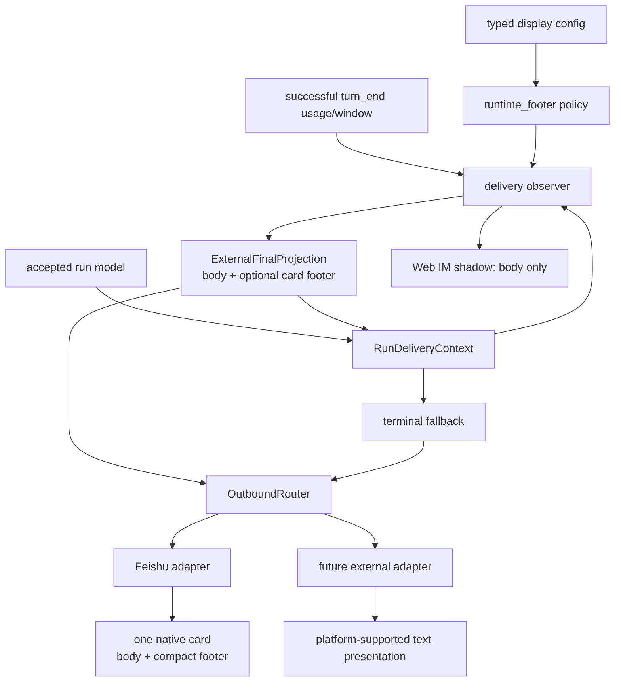
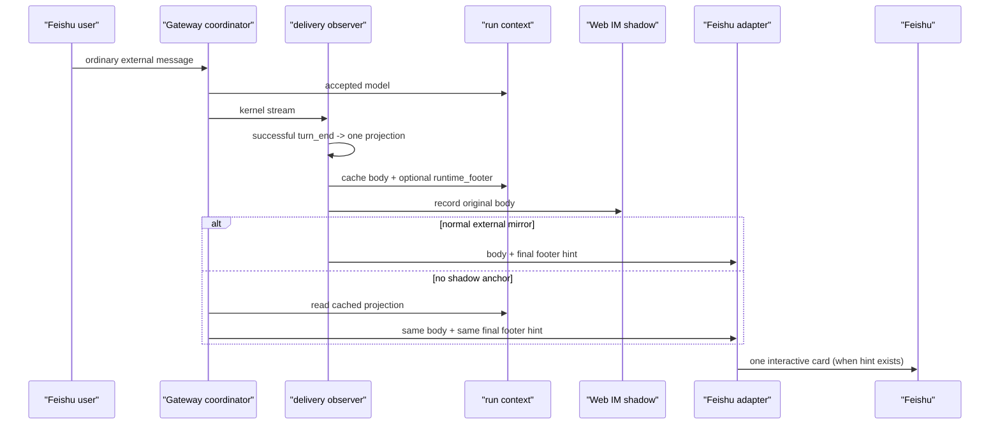

# feat-523: External runtime presentation — 技术方案

> 对齐: `spec.md` v2
> Unit branch: `unit/feat-523`
> 状态: 用户在已开 PR 的文本 footer 验收后明确要求飞书卡片；本设计重新打开 Gate 2，替换旧的“adapter 无感知文本附加”方案。

## Changelog

- 2026-08-15: 根据「Hermes 不是这个效果的，他是有卡片的啊」重做飞书呈现。保留 Gateway 统一的运行信息语义、默认关闭和 future-channel 覆盖；飞书普通最终回复改为单张原生卡片。
- 2026-08-15: Gate 2 R4 补齐 canonical delta 替换、Markdown 图片 preparation 和单卡 UTF-8 payload budget/截断契约。

## 目标与约束

- 仅在外部用户触发的普通最终 assistant 回复上，按配置显示本轮真实模型和 context 占用；缺失字段静默省略。
- 飞书在启用且有可显示信息时，发送一张原生交互卡片：正文在上、底部紧凑信息区显示 `model · ctx N%`。不另发第二条页脚消息，也不把信息拼成普通 post 正文；单卡超限时正文明确截断，信息区保留。
- Gateway 仍是“是否显示、显示哪些真实事实”的唯一 owner；Feishu adapter 只把 Gateway 已决定的卡片呈现提示映射为平台 payload。未来 channel 继承同一 Gateway 语义，未实现原生卡片能力前以其现有文本能力呈现。
- 内部 Web IM/external shadow 永远记录原正文；中间文字、工具进度、审批卡、控制确认和空回复没有运行信息。
- 默认关闭，保留全局开关与按 platform 覆盖。真实验收只使用隔离 Feishu E2E 栈。

## 现状分析

### 现有路径

- `RuntimeConfigOwner.snapshot()` 提供 immutable `LocalConfig`；`display.runtime_footer` 已有默认关闭、全局和 platform 覆盖的 typed config。
- `SessionRunCoordinator` 在 run 接纳时解析 `SessionRuntimeConfig.model`，lifecycle/context 已把这个 run-bound model 保存到 `RunDeliveryContext`。`runtime_delivery/observer.py` 在成功 `turn_end` 有规范化 prompt token 和可选 context window。
- observer 先以原正文写 external shadow，再经 `OutboundRouter` 镜像真实外部回复；`SessionRunCoordinator._deliver_final_reply()` 保留无 shadow 锚点时的 terminal fallback。两条路径必须消费同一 run-owned 投影，不能重新计算。
- `OutboundMessage.metadata` 已可携带 adapter-scoped 提示。Feishu client 已有用于审批卡的 `send_interactive_message()`；普通回复目前经 `send_message()` 发送 `post`，并在构建 payload 前解析 Markdown 图片来源为 Feishu image key。

### 不能破坏的边界

- `IM` 不 import `personal_assistant`，不接收这项外部专属呈现。外部可见回复是完整 assistant 气泡，终态不可重复；router 的 final 去重仍以同一 run 的同一正文投递为边界。
- adapter 不能自行读取 config、usage 或 agent model；否则未来 channel 会复制产品策略，也会与 observer/fallback 脱节。
- 不能捏造 `0%`、`unknown` 或过期模型；缺少模型和有效 prompt/window 时必须保持原回复。

## 架构总览

Gateway 在成功 `turn_end` 只构造一次 `ExternalFinalProjection`，并缓存到该 run 的 delivery context。它保持影子正文不变，同时包含实际外发正文和一个可选的 `runtime_footer` 呈现提示。observer 镜像和 coordinator fallback 都消费同一 projection；只有 Feishu adapter 看到这个提示时，才把该 final reply 编码为一张交互卡片。

## 关键决策

### 决策 1：run-owned projection 一次生成，两个正常终态路径只消费它

**结论：observer 在成功 `turn_end` 生成并缓存 `ExternalFinalProjection`；observer 镜像和 coordinator fallback 不再分别格式化文本或重读 config。**

projection 有 `text` 和可选 `runtime_footer`。`text` 是该 adapter 应发送的最终正文：对 Feishu 有卡片提示时保持原正文；对非 Feishu external adapter 沿用兼容的正文后运行信息文本。`runtime_footer` 只在 Feishu 启用且至少一项真实事实可用时存在。shadow 始终使用 `cleaned_text`，不使用 projection。

模型来自 accepted/recovery-adopted lifecycle 的 run-bound model；百分比只来自同一 successful `turn_end` 的 prompt token 与正 context window，四舍五入且钳制为 `0..100`。两者均缺失时 projection 等同原正文、没有 footer hint。该 projection 在 observer 判断 shadow 是否可镜像之前缓存，因而 fallback 也得到相同正文和提示；不允许 fallback 再估算。

### 决策 2：一个小型 Gateway policy 决定事实和平台语义，不建立 card 抽象层

**结论：`runtime_footer` 模块从 config、adapter name 与 `TerminalFooterFacts` 生成 `ExternalFinalProjection`，收拢开关优先级、缺值规则、model display 和 `ctx %` 格式。**

有效开关仍为 global 默认值再由 platform key 覆盖；`feishu:plato` 归为 `feishu`。当启用时，Feishu 的 projection 保留原 `text` 并设置 `runtime_footer`；其余 external adapter 的 projection 把同一 compact string 追加到 `text`，这样 future channel 不会漏掉用户要求的运行信息。没有第二个已接入平台，故不提前发明跨平台 card protocol 或 renderer registry。

compact string 仅包含实际可得的字段：`provider:model · ctx 42%`、仅模型、或仅 `ctx 42%`。这比原先裸 `%` 更明确地表达用户请求的 context 占用。

### 决策 3：Feishu adapter 在最终回复把 Gateway hint 渲染为单张原生卡片

**结论：`FeishuAdapter.send()` 只在 `reply_phase == "final"` 且 metadata 中有非空 `runtime_footer` 时调用既有 `send_interactive_message()`；否则保持现有 `send_message()`。**

卡片为一条 native interactive message，elements 顺序固定为：已准备的 assistant Markdown 正文、分隔线、紧凑 note。footer note 的内容完全采用 Gateway 提供的 string；adapter 不知道 model、token、config 和 percent 计算。它不发送第二条消息，也不重写 shadow。审批卡继续走既有审批路径，不能因为同名卡片能力被误标。

`FeishuClient` 新增一个小的公开 body-preparation seam，复用当前 `send_message()` 的 Markdown 图片上传/image-key 替换；普通 post 与 runtime card 都只调用这一个 seam。adapter 先准备正文，再构建 card，确保启用功能不会把原来可显示的 Markdown 图片退化为裸 source。

card JSON 保持与仓库已有 Feishu approval card 相同的兼容形状（`wide_screen_mode`、`markdown`、`hr`、`note`），不加入未经真实平台验证的新 header/折叠/按钮装饰。adapter 的私有 card builder 以 `FeishuClient.send_interactive_message()` 同一 `json.dumps(card, ensure_ascii=False).encode()` seam 计完整 UTF-8 payload，严格小于 30,000 bytes。若正文使整卡超限，builder 只保留正文开头并在字符边界追加 `... truncated`，反复以完整序列化结果校准，直到单卡合格；footer note 不删、不会拆分或补发正文。若合格 card 的 provider 发送仍报错，沿用现有外发错误处理而不悄悄退回为带文本 footer 的普通消息；真 Feishu E2E 是此 payload 的必经门。

### 决策 4：metadata 是窄的 delivery hint，且不影响去重或 Web IM

**结论：projection 的 `runtime_footer` 仅随 final external `ReplyContext.metadata["runtime_footer"]` 传给 adapter；route/dedupe 仍用同一原正文，且双方路径都传同一 metadata。**

这避免改变 generic `OutboundRouter` 的消息模型，也避免让 IM 看见卡片 payload。中间、control、approval 和空回复不会得到该 metadata。Feishu 有 hint 时 body 不含 footer 文字，故 interactive card 的内容与 Web IM shadow 的 body 分叉是受控、可测试的产品边界。

## 接口与数据流

| Carrier | Owner | Lifetime | Rule |
|---|---|---|---|
| `TerminalFooterFacts` | observer | successful terminal handling | model is admission-bound; usage/window are this terminal event only |
| `ExternalFinalProjection` | observer / run context | until completed lifecycle cleanup | immutable final external representation; fallback only reads it |
| `metadata.runtime_footer` | Gateway delivery seam | one final `OutboundMessage` | Feishu presentation hint only; absent for all other phases |

## 文件与测试范围

| 区域 | 改动 | 责任 |
|---|---|---|
| `gateway/runtime_footer.py` | 从 facts/config 构造 projection、平台覆盖和 compact string | Gateway policy |
| `gateway/runtime_delivery/context.py`, `observer.py`, `composition.py`, `session_run_coordinator.py` | 保存并转交一份 projection 给 mirror/fallback | terminal delivery correctness |
| `channels/feishu/client.py`, `adapter.py` | 复用普通 post 的 Markdown 图片 preparation；把 final footer hint 变为受完整 UTF-8 budget 约束的原生 card | Feishu rendering |
| unit tests + Feishu probe | projection 分支、图片 preparation、card payload/overflow、双路径一致、shadow 不变、真实 card message | durable verification |
| delta `external-channels.md` | `MODIFIED` 既有运行信息页脚 requirement，消除已归并文本页脚与卡片行为冲突 | canonical behavior |

## 验收策略

- 纯单测：config precedence、部分 facts、Feishu projection 与 future-adapter text projection；observer-first/fallback-only 的 `(body, runtime_footer, reply_phase)` 相同；Feishu final card payload；普通 Markdown 与 Markdown 图片共用 preparation；完整 JSON UTF-8 `<30_000` bytes 的 oversized-card 显式截断；intermediate/control/approval 仍用原 transport。
- Gateway suite：既有 shadow 与 final dedupe 场景不退化，recovery adoption 仍携带原 run model。
- 隔离 Feishu E2E：fixture 明确开启 feature；probe 通过专用 profile 的 chat message list 将 nonce 绑定到新 Bot reply，断言恰有一条 `msg_type=interactive` 的 final card，card 同时有原正文和 footer string，并断言 Web IM shadow 只有原正文。
- 人工产品验收：在专用 Feishu 测试 chat 打开新 Bot 卡片并截图；截图必须看到同一张卡片的正文和底部运行信息区，不能以 Web IM 或 API 文本替代。

## Runbook for Reviewer

| 服务 | 停止命令 | 启动命令 | 健康检查 |
|---|---|---|---|
| 隔离 IM + Gateway（含专用 Feishu listener） | `"$WT_ROOT/scripts/e2e-down.sh" --wt "$WT_ROOT"` | `PATH="$MAIN_ROOT/.venv/bin:$PATH" "$WT_ROOT/scripts/e2e-up.sh" --wt "$WT_ROOT" --feishu` | `source "$WT_ROOT/.e2e-ports.env" && curl -fsS "$IM_URL/openapi.json" >/dev/null`; 再运行 `"$WT_ROOT/scripts/e2e-feishu-probe.py" --wt "$WT_ROOT"` |

验收前置：`${XDG_CONFIG_HOME:-~/.config}/nano-multiagent/feishu-e2e.env` 存在且 0600；声明的非 default `lark-cli` profile 已验证；测试用户与测试 Bot 在同一专用 chat。`config/e2e/gateway.yaml` 是隔离 fixture，明确启用 feature；reviewer 不得改本地/生产 config。完成或失败后均执行 `e2e-down.sh`，保留必要的无 secret 证据。

## 风险、回退与边界

- 卡片 schema 与客户端显示不符：用已存在 approval card 的元素形状，并把真实 Feishu E2E 和实际截图设为阻断验收；不能用 HTTP 201 或 Web IM shadow 代替。
- 原普通回复中的 Markdown 图片在卡片路径失效：把解析/upload/image-key 替换留在 FeishuClient 的共享 preparation seam，并以 post/card 共用的回归测试保护。
- 长正文超过 interactive payload 上限：以完整 JSON UTF-8 序列化而不是字符数预算；明确截断 body 并保留 footer，禁止拆成第二条消息。
- 两条终态路径 metadata 不同：projection 作为唯一 carrier，测试同时断言 body 和 footer hint 相同；不重新计算。
- 未来 channel 被误做成 Feishu card：policy 为它们提供普通文本呈现，不向 generic router 暴露 Feishu card JSON。
- 信息外露：默认关闭；operator 关闭全局或单个 platform 即恢复原普通回复，不迁移历史数据。

## Milestones

| ID | 标题 | 依赖 | 范围 | 退出标准 |
|---|---|---|---|---|
| M1 | Gateway runtime card presentation | Gate 2 | projection policy/propagation；Feishu native card rendering；shared Markdown-image preparation；single-card budget/truncation；canonical modified delta、tests、real E2E evidence | [worker] focused/unit/contract/docs checks green；observer/fallback complete delivery tuple parity；post/card 共用图片 preparation；normal and oversized card JSON UTF-8 `<30_000` with visible truncation；non-final transport tests green。 [reviewer] canonical delta replaces rather than conflicts with the text-footer rule；enabled dedicated Feishu final reply is one native card whose visible body and compact `model · ctx %` footer are correct; no second footer post; shadow remains plain; native screenshot is captured; E2E services are stopped. |
