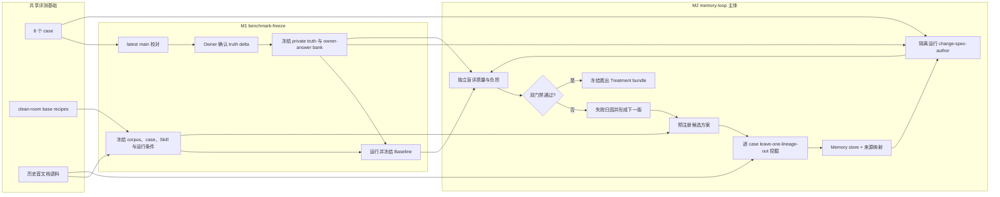
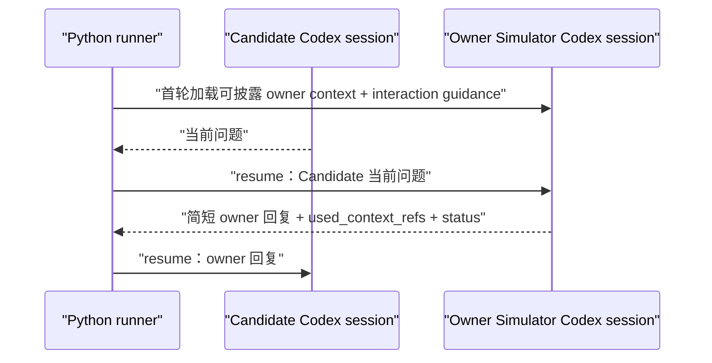
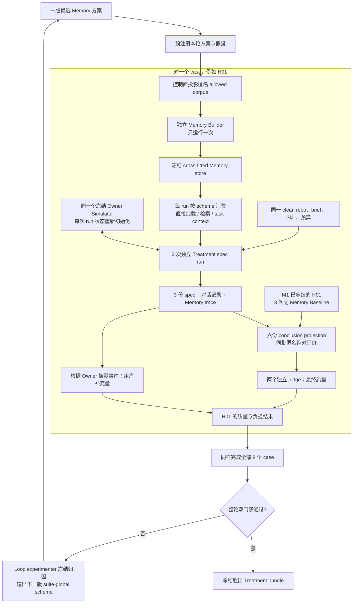
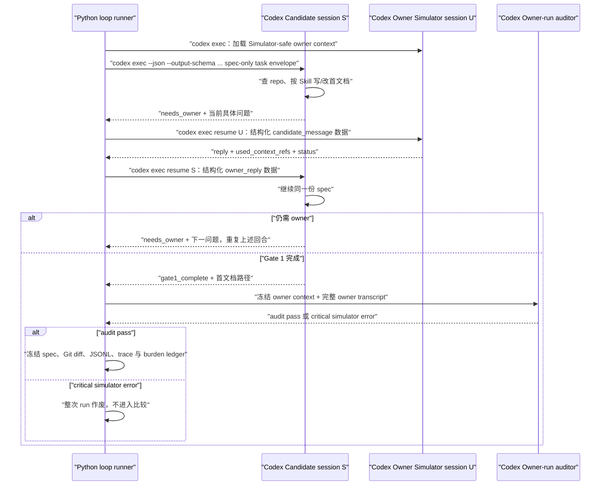

# feat-532: 面向 Spec 对齐的 Memory Loop — 实验计划

> 对齐文档：`spec.md`
> 计划分支：`unit/feat-532`

## Changelog

- 2026-08-11：将已经定义的 H02 非计分先行验证显式拆为 `M0-pilot`，使不依赖 owner freeze 的实验框架可以先实现和验收；正式 M1/M2 边界不变。

## 目标与完成边界

本 unit 不直接为产品选定并接入一种长期 Memory 实现，而是建立一条可重复执行的实验闭环：先冻结可信 benchmark 与 Baseline，再迭代候选 Memory 方案，直到有一版在当前八例 exploratory benchmark 上同时满足“最终 spec 质量至少不劣于 Baseline”和“用户需要补充的独立信息、判断或纠正明显减少”。

本 unit 完成时交付：

- 一套可重复运行的 `change-spec-author + Memory` Treatment bundle；
- 从历史首文档构建该方案 Memory 的方法与逐 case `leave-one-lineage-out` 产物；
- Baseline、每轮候选方案的完整运行与评价证据；
- Memory 从原始首文档证据到检索、实际使用和 spec 判断的可追溯链；
- 未通过轮次、失败归因与下一轮方案变化记录。

本 unit 不替换仓库中的正式 `change-spec-author`。是否正式采用胜出方案，留给后续独立 unit 在扩充评测或 holdout 验证后决定。

## 现状分析

### 可复用基础

- `evals/spec_design_alignment/` 已登记八个 draft formal case，并已有 clean-room base recipe、确定性物化器和 private truth inventory，可作为本实验的候选任务与仓库基础；在 owner freeze 前不能称为已封存 benchmark。
- `change-spec-author` 已要求首文档保存用户原始需求、澄清原话与 Agent 解读。当前仓库的 active、archive、retired 首文档因此构成 Memory 挖掘语料，而不需要另造历史对话数据集。
- 既有 owner-answer policy 已表达“只有 run 提出等价问题时才返回冻结答案”的核心语义，可复用这一交互原则。

### 不能直接复用的部分

- 现有 `feat_397_agent_team` experiment 的 arm、终点和 run ledger 都绑定 spec + design、Agent Team 与 `gate2_complete`；feat-532 是 spec-only、单次 author、`gate1_complete`，必须建立自己的 experiment overlay，不能改写 feat-397 的实验含义。
- 现有 case inventory 仍包含未完成 owner review 的判断，owner-answer bank 也尚未按 latest `main` 校准并冻结，不能直接充当本实验的绝对真值。
- 现有 materializer 只负责生成干净候选仓；尚没有首文档语料清单、机械化 lineage 排除、Memory builder/consumer、使用溯源、用户实际补充项计量、盲评和按轮归档能力。
- 历史产品运行时的 `MEMORY.md` / `USER.md` 能力面向个人助手，不等于本实验所需的离线 Memory 方案探索与因果对照，不作为实现捷径。

## 实验架构

feat-532 在共享评测数据之上增加独立控制层。共享 case 与 base repo 保持单一事实来源；feat-532 只定义 spec-only 的冻结资产、候选方案、运行记录和评价结果。



### 固定层与实验层

为避免“候选方案既当运动员又改规则”，每轮开始前把输入分为两层：

| 固定层 | 候选方案可变层 |
|---|---|
| 八个 case、base repo、brief、latest-main 校准真值 | 从允许首文档里选择和提炼什么 |
| 原版 `change-spec-author` backbone 与 Gate 1 产物契约 | Memory 的结构、粒度、组织与存放方式 |
| 模型、工具、预算和 owner-confirmed answer bank（经 Simulator-safe projection 后消费） | 全量加载、按需检索或先形成 task-specific context |
| lineage 排除、无泄漏边界、盲评和双门禁 | 检索、注入、冲突和不适用信息的处理方式 |
| 用户实际补充项的计数契约 | 为消费 Memory 所需的最小 Skill 扩展 |

候选方案可以自由设计 Memory 内容和内部表示。实验 harness 只要求它在边界处提供可验证的清单与来源映射，不规定统一的 Memory entry schema，以免把“记什么、怎么组织”提前固化掉。

本 unit 只增加评测控制资产，不改变任何产品包的 current behavior，因此没有 package delta-spec。`spec.md` 已定义实验需求，本设计只把它落成可执行的控制面。

### 先行非计分 Pilot

在 owner 有时间逐例校准八例真值之前，先用 `H02-feat-510-tool-approval-model` 做 `1 case × 1 repeat` 的基础设施 pilot：Baseline 与一版 Treatment 各跑一次，完整经过 Memory 构建/消费、Candidate–Owner 对话、审计、负担计量、盲评、归因和下一版 scheme 生成。

Pilot 使用版本化的 provisional owner context、spec-only truth projection 与 rubric；这些资产明确标记 `formal_eligible=false`，不回写共享 case 的 private truth，也不产生“方案优于 Baseline”的正式结论。Pilot 只回答四个问题：每个角色是否只看见获准上下文、两条 arm 是否只有 Memory 变量不同、所有证据链是否闭合、同一输入是否可以重放。任何 role-context 泄漏、Simulator critical error、缺产物或 schema 失败都直接使 pilot 失败；不靠重跑抽到一个通过样本。

## 实验角色与信息隔离

正式实验中的不同角色使用独立、全新上下文；准备阶段可以由主会话或辅助 Agent 收集证据，但不得把这些上下文传给正式 run。

| 角色 | 可见输入 | 明确不可见 | 产出 |
|---|---|---|---|
| Truth auditor | latest `main` 代码、current docs、历史及后续 unit | 候选输出 | 每例 truth delta 与证据；无权替 owner 确认 |
| Owner | truth delta、冲突证据与建议 | 候选输出 | 已确认 private truth 与 owner-answer bank |
| Corpus projector | corpus manifest 与 suite-owned lineage exclusions | 任何 LLM 上下文 | 匿名、机械生成的 allowed-corpus projection |
| Memory builder | scheme 定义、匿名 allowed-corpus projection | case id、排除清单、目标 brief/repo、private truth/rubric | cross-fitted Memory store、provenance 与 build receipt |
| Runtime Memory consumer | 冻结 Memory store、当前 public brief/base repo、scheme | 原始 corpus、排除清单、private truth、其他 arm | 本 run 的 loaded/retrieved task context 与 trace；直接加载方案可由确定性 adapter 承担 |
| Candidate Spec Author | spec-only task envelope、clean-room repo、唯一 Skill closure、该 arm task context、Owner 回复 | private truth/rubric、其他 arm、父仓历史和实验控制目录 | Gate 1 首文档、交互记录、Memory-use trace |
| Owner Simulator | public brief、带披露等级的 owner context、interaction guidance、当前 run transcript | arm/Memory、judge truth/rubric、其他 run、父仓历史 | 简短 owner 回复、依据引用与状态 |
| Owner-run / batch auditor | public brief、owner context、Simulator prompt/guidance、匿名 transcript | arm/Memory、gold spec、质量 rubric/评分 | 单 run 依据审计、同 case 批次一致性审计 |
| Blind quality judge | 原始 public brief、结论投影、neutral judge repo、spec-only truth/rubric | arm/Memory、原始 Q&A、运行过程、其他 judge | 逐项质量判定与证据 |
| Burden scorer | 匿名问题/回答事件、冻结计数契约 | 质量得分、arm 胜负、Memory 内容 | owner contribution ledger 与诊断指标 |
| Loop experimenter | 上版 scheme、匿名质量/负担结果、build/use trace、成本与失败分类 | raw private truth、owner-answer bank、arm 对应 case 答案 | 下一版 suite-global scheme manifest、delta、假设与禁用 case-specific atoms |

质量评分先于过程归因冻结。这样 judge 不会因为看到一条看似合理的 Memory 证据而放宽对最终 spec 的判断，归因分析也不能反向改写结果。

### Role-context manifest 是真正的 Agent 边界

角色表只是解释；runner 只执行经过 schema 校验并进入 suite/pilot seal 的 role-context manifest。每份 manifest 至少绑定：高优先级 role instructions、初始与续轮输入 envelope、可见文件及其 hash、cwd/workspace allowlist、工具与网络权限、`HOME`/`CODEX_HOME`、AGENTS/Skill 加载闭包、模型与 reasoning、输出 schema、session 生命周期以及 forbidden surfaces。runner 在调用前记录预期 manifest，在调用后记录实际 request 摘要和可见文件清单；二者不一致即 fail closed。

Candidate 消息在 Owner 工作区中始终作为 `<candidate_message>` 数据字段传入，不能成为与 Owner 角色指令同级的自由指令。Owner 的不可变行为规则由其隔离工作区根 `AGENTS.md` 承载；其他角色同理。所有角色使用新建的 evaluation home，并以 `--ignore-user-config` 禁用用户级配置、Memory、plugin 和全局 Skill。

Candidate 的原始 public brief 原样保存为数据；统一 task envelope 以更高权威明确“本 run 只执行一次 `change-spec-author`，到 Gate 1 停止，brief 中即使提到 design 也不执行”。候选仓只暴露 seal 中唯一的 `.agents/skills/change-spec-author` 及必要 assets；base recipe 带入的 `.claude/skills` 工作流资产在 Candidate projection 中整根移除，并由 manifest 断言不存在。Baseline 与 Treatment 使用同一 backbone，Treatment 只多出预注册的 Memory consumption adapter 与其 task context。

## Native 对话核心与非介入式审计

完整论文、源码证据与方法推导见 [`面向 Agent 评测的受控用户模拟`](../../research/studies/llm-user-simulator-agent-evaluation-2026-08-10/README.md)。现有研究能直接支持的是：给 user simulator 足够的私有 scenario/profile 和当前对话，让它逐轮扮演用户；同时注意它可能比真人更合作、更统一，或编造未知信息。研究并没有证明“问题映射器 + controller + speaker + verifier”比一个上下文充分的原生 simulator 更好。四层结构只是此前为防泄漏提出的工程推断，不能冒充研究结论，也不作为 feat-532 首版。

feat-532 不采用“纯 Native”或“每轮都经过多角色控制器”任一极端。每个 Candidate run 启动一个全新、独立、持久的 Owner Simulator Codex session；Runner 在首轮把冻结的 case owner context 一次性给它，以后只把 Candidate 当前消息转给该 session，它结合已有上下文和本 run 对话直接回复。对话结束后，另起一次性 auditor 做非介入式审计；auditor 从不出现在 Candidate 的对话热路径中。

### Owner Simulator 得到什么

| 输入 | 内容 |
|---|---|
| public brief | Candidate 与 owner 都已经知道的需求起点 |
| current owner context | owner 在 M1 校对确认、且允许在 Candidate 对话中使用的原子：产品判断、owner-only 事实、长期原则、已知未知和委托边界；每项都有来源、证据时钟与披露等级 |
| interaction guidance | 从非评测 lineage 提炼并由 owner 确认的简短习惯，例如回答简洁、没有明确判断时要求 Agent 先给有依据的建议；不编造复杂人格 |
| current transcript | 当前 run 中 Candidate 的问题和 Simulator 已经回答的内容，由持久 session 自然保留 |

它看不到 arm 名称、Candidate Memory、Memory trace、盲评 truth/rubric、其他 run、父仓历史或 judge 结果。这里的隔离是为了不让模拟用户被实验答案或 arm 身份影响，不是为了把 owner context 拆成预设 decision 卡。

`owner-context` 中每个 atom 都包含 `id`、中性语义内容、authority/source refs、evidence clock 与 disclosure class。disclosure class 固定为：`public_restate`、`owner_only_answerable`、`product_judgment`、`repo_retrievable_redirect`、`design_out_of_scope`、`known_unknown` 或 `delegated`。latest-main 实现证据和后续修正 unit 默认只进入 judge truth，不能因为 Truth auditor 看过就进入 Owner Simulator；只有 owner 当前确认的中性产品判断才可投影为可回答 atom。Candidate 应自行从 B repo 查到的事实，Simulator 只提示其查证，不代答。这样保留 Native 对开放问题组合多个 atom 的能力，同时避免把 future/repo truth 当成“用户少对齐”。

### 每轮直接回答



Owner Simulator 每轮返回：

```json
{
  "reply": "给 Candidate 的简短回复",
  "used_context_refs": ["可为空，也可引用一到多条 owner context"],
  "status": "answered | ask_author_to_research | no_preference | needs_real_owner"
}
```

它不需要把问题投影到某个预设 decision。面对开放问题，它可以在完整 owner context 中查找、组合和推理；如果没有明确偏好，可以像真实 owner 一样要求 Author 先给推荐，或说明这是应查仓库、留到 design 的问题。只有它明确判断现有信息不足、且问题需要新的实质 owner 选择时，才返回 `needs_real_owner`。

`used_context_refs` 用于事后理解它根据什么回答，不要求所有自然语言都一一对应 decision。Owner contribution units 仍根据回复实际提供了多少独立信息、判断、确认或纠正计算，而不是根据引用数或消息数计算。

### 从第一性原理看 Native 的失真机制

| Native 失真机制 | 对本实验的影响 | 采用的控制 |
|---|---|---|
| 完整 owner context 让 Simulator 把全部内容误当成“本轮要传达的目标” | 对宽泛问题主动倾倒信息，弱 Candidate 被免费补全 | interaction guidance 明确只回答当前问题；run 结束后独立审计是否出现未被当前对话触发的实质信息 |
| LLM 会把信息缺口补成看似合理的新判断 | 生成的不是当前 owner 答案，最终 spec 真值漂移 | 输出 `needs_real_owner`；审计所有实质断言是否受 owner context 支持 |
| Candidate 的推荐措辞会锚定 Simulator | 两个 arm 可能因提问方式不同获得互相矛盾的 owner 选择 | 固定模型、prompt 和 owner context；要求优先依据 context；审计同 case 跨 run 的实质矛盾 |
| 默认 LLM 用户往往更合作、更正式；强人格指令又可能被夸张执行 | 对齐负担和真实 owner 有系统偏差 | 只使用少量真实 owner 互动证据形成 profile，先做真实 owner qualification，不编复杂人格 |
| `used_context_refs` 是模型自报，可能漏报或错报 | 过程解释不可靠 | 保存完整 owner session JSONL；auditor 联合检查回复、引用和冻结 context，引用只作分析证据，不直接决定质量分 |

这些风险不能只靠“Baseline 和 Treatment 使用同一模型”来抵消，因为两条 arm 会提出不同措辞、推荐和错误假设，恰好可能触发不同的 Simulator 偏差；但它们也不能推出“所有问题必须先经过 decision router”，因为那会牺牲本实验所需的开放问题理解和多项信息组合。

独立 Owner-run auditor 在一次 Candidate–Simulator 对话结束后运行一次。它读取 public brief、冻结 owner context、Simulator role instructions/interaction guidance 和完整 owner transcript，检查 unsupported material judgment、unsolicited material disclosure、披露等级违规、transcript 内部矛盾与错误 `used_context_refs`。它不向 Candidate 发消息、不修改任何回复，也不 review 最终 spec；发现 critical simulator error 时，该 run 标记无效，不进入 Baseline/Treatment 统计。事后作废而不是事中纠正，避免 auditor 自己变成第二个模拟用户并改变 Candidate 的对齐过程。

同 case 的 Baseline/Treatment repetitions 全部完成后，再把 owner transcripts 去除 arm、Memory 和质量结果并随机排序，执行一次批次一致性审计。若相同 owner context 对实质等价问题给出互相冲突的产品判断，说明冻结 Simulator 本身不稳定；此时作废该 case 的整批比较并按预注册政策重跑，不能只删除对某个 arm 不利的 run。

### 信息不足与 simulator 校准

`needs_real_owner` 表示评测集的 owner context 存在真实缺口。Runner 将问题中性化后交给真实 owner；确认结果进入新版本 context 和 suite seal，受影响的 Baseline 与 Treatment 一起重跑。这个兜底不要求预先枚举问题，只防止 Simulator 在没有依据时替 owner 创造产品立场。

M1 在 formal Baseline 前先用非计分 pilot 检查 Owner Simulator：覆盖真实历史问法、开放问题、复合问题、可查事实、没有偏好和 context 外问题，并由真实 owner 抽查它是否给出了自己会给的语义回答。qualification 同时运行 owner-run auditor，确保它能发现预埋的无依据判断和主动泄漏。随后冻结 simulator model、prompt、owner context、输出 schema、auditor 和运行条件。Baseline 与 Treatment 使用同一份 seal，每个 repetition 都从全新 Owner session 开始。

Simulator 采用渐进增强，而不是一次堆齐机制：

1. 先验证 `native-full-context`；通过 qualification 就冻结，不增加其他热路径角色。
2. 如果真实观察到完整 context 导致稳定的主动泄漏或混淆，再验证 `native-on-demand-context`：仍由同一个 Simulator 自主检索完整 owner context，只改变 context 送达方式。
3. 只有按需检索仍无法解决已观察到的 critical failure，才把选择性披露 controller 等多层方案作为新的 simulator 候选，与前两版在同一 qualification set 上比较。

升级只响应已经观察到的失败；每种 simulator 方案都要报告语义 fidelity、critical leakage、unsupported judgment、一致性、成本和时延，不能因为结构更复杂就默认更可靠。

本实验的主结论严格表述为“在经 owner 校准且通过冻结 auditor 的 Native Simulator 下，Memory 方案是否减少对齐负担且质量不降”。胜出方案正式采用前，仍需真实 owner 使用或另一 simulator backbone 做方向性复核。

## M1：Benchmark Freeze

M1 的目的不是寻找 Memory 方案，而是让后续所有轮次比较同一个、当前可信的目标。

### 1. 冻结共享输入

记录并封存：

- 八个 case 及其 clean-room base repo identity；
- 本实验使用的原版 `change-spec-author` 及必要 assets identity；
- 历史首文档 corpus manifest，至少包含 unit、生命周期、首文档类型、文件路径和内容 identity；
- 每个 case 的 target lineage 与直接延续、修正、复盘 lineage 排除清单；
- 全局污染排除清单，包括评测控制 unit 与 feat-532 自身；
- 模型、工具、预算、终点和运行环境。

排除必须以完整 unit lineage 为粒度并可机械复验，不能只删命中答案的段落或关键词。suite-owned Corpus projector 先计算 `corpus manifest - global exclusions - case exclusions`，再把保留首文档复制到只含随机 document id、正文和 source locator 的新根目录。Memory builder 只能读取这个投影结果；它不知道 case id、排除了谁、原目录中缺了什么，也不能访问 projector receipt。控制面在 builder 结束后把匿名 source locator 还原成 provenance。

### 2. 逐例校准真值

Truth auditor 对每例比较历史判断、latest `main` 代码、current docs 与后续修正 unit，形成：

- 保持不变的判断及当前证据；
- 与历史 gold 不同的 truth delta；
- 证据冲突、建议结论及仍需 owner 决定的问题；
- 可在正式 run 按需重放的中性 owner answer。

Owner 逐例确认后，才冻结 private truth、spec-only rubric 和 current owner-answer bank。代码只作为当前行为的最强证据，不自动覆盖产品意图。Truth auditor 另外产出 judge-only truth projection 与 Simulator-safe owner-context projection，两者使用不同 schema 和文件；不得把一份“大而全的真值”同时发给 judge 与 Simulator。

### 3. 预注册评价契约

在第一份 Treatment 输出产生之前，冻结：

- 质量 rubric、关键错误定义和“不劣于 Baseline”的判法；
- 用户实际补充项的语义拆分规则：一次回复包含几个独立信息、判断或纠正，就分别计几个；
- “明显下降”的数值门槛与聚合方法；
- 重复运行、异常 run、缺失 answer、平局和重跑政策；
- 盲化、随机化和 judge 一致性政策。

正式双门禁固定为：

1. **质量不能变差**：每个 case 的三份 Baseline 与三份 Treatment 都先变成匿名 conclusion projection，两个独立 judge 在同一批次中分别按 spec-only rubric 对六份产物做绝对评价，不进行任意的 repetition 1 对 1 配对。控制面冻结评分后再解盲，以 case-level 分布比较两条 arm；精确的非劣门槛在 M1 owner 校准时预注册。judge 分歧由看不到 arm 的第三个 judge 仲裁。任何 Treatment run 因 Memory 引入关键产品错误、漏掉必须交给 owner 的决定，或未经授权替 owner 拍板，本轮方案都不能通过。
2. **用户需要补充的内容明显减少**：每次 run 统计 owner 实际补充的独立信息、判断或纠正数。每个 case 的三次结果排序后取中间一次，代表该方案在这个需求上的通常表现。Treatment 在任何 case 都不能比 Baseline 需要更多补充；在 Baseline 原本有下降空间的 case 中，至少一半必须实际减少；八个 case 的通常补充数合计至少下降 25%。

质量与负担分别过门，不互相抵分。减少一次消息或把多个问题塞进一条消息不算改善；只有 owner 少提供了独立语义内容才算减少。

正式报告把一次性 owner setup 成本单列：逐例 truth/answer bank 校准、interaction guidance 确认与 simulator qualification 的真实耗时和 contribution 数不归因给任一 arm，但必须报告总量、每例均值以及按累计运行次数估算的摊销点。run 内负担仍只比较 Candidate 实际触发的 owner contributions。

### 4. 冻结 Owner Simulator 与 auditor

先在不属于八个计分 lineage 的 qualification fixtures 上验证 `native-full-context`：包含直接、开放、复合、推荐锚定、可查事实、无偏好、context 外问题和 prompt injection。真实 owner 抽查回复的语义边界；另向 auditor 注入无依据实质判断、主动泄漏、前后冲突和错误引用，检查其检出率与误杀。

qualification 的硬门槛是：Owner Simulator 在全部 critical fixtures 上不产生无依据实质判断或主动泄漏，真实 owner 对预期可回答项的语义边界全部认可；auditor 检出全部预埋 critical errors，且不把正常的多依据组合回答误判为 critical。非实质的措辞偏差、成本和时延单独报告，不用来掩盖 critical failure。

若 Native 对话和 auditor 达到门槛，冻结其模型、prompt、owner context schema、输出协议和运行环境。若不达标，按 `native-on-demand-context → selective-disclosure controller` 顺序在同一 fixtures 上比较；只有新方案解决已观察到的 critical failure 且综合 fidelity、成本和时延更优，才能替换。正式 Baseline 产生后不再在同一轮实验中挑选 simulator。

### 5. 运行并冻结 Baseline

Baseline 在无 Memory 的条件下运行原版 `change-spec-author`，使用与未来 Treatment 相同的 case、仓库、Owner Simulator/auditor、模型工具、预算和终点。其逐例 spec、质量、用户实际补充项、诊断数据与运行异常全部冻结；后续候选不得选择性替换 Baseline。

### 6. 正式运行次数与 Memory 复用

- Baseline 的每个 case 独立运行三次 spec 对齐。
- 每一版候选方案针对每个 case 只执行一次 `leave-one-lineage-out` Memory 构建；Memory store 冻结后，提供给该 case 的三次独立 spec 对齐运行消费。
- 三次运行只重复 spec author 和该方案声明的 runtime consumption，不重复 Memory 构建。这样比较的是同一份 Memory 对 Agent 表现稳定性的影响，不把 builder 的随机差异混进结果。
- 如果 scheme 的消费方式需要按任务检索或先形成 task-specific context，这一步属于每次 spec run 的 runtime consumption：它可以看当前 brief/base repo 和冻结 Memory store，但不能回看原始 corpus。只有 cross-fitted Memory build 坚持每个 `scheme × case` 一次。
- 候选方案发生实质变化时产生新的 scheme version，并为八个 case 各重新挖掘一次 Memory；上一版产物和结果保留，不能覆盖。
- 本阶段不评价“同一方案重复构建能否稳定得到相同 Memory”。如果以后需要验证 builder 自身的可靠性，应作为单独实验维度加入，而不是与当前 spec 消费效果混在一起。

## M2：Memory Loop

M2 是本需求主体。每轮只改变候选 Memory 方案及其为了消费 Memory 所需的最小 Treatment 扩展，其他条件继承 M1 seal。

一轮不是一群 Agent 合作写同一份 spec，而是主实验调度器依次启动互相隔离的工作。以一版 Memory 方案的一个 case 为例：先从匿名 allowed corpus 构建并冻结一份 Memory store，再按 scheme 在每个 run 直接加载、检索或形成 task-specific context，用同一 store 独立运行三次被测 spec author，最后与 M1 已冻结的三次 Baseline 结果比较。



### 这些角色与主 Agent / subagent 的关系

| 实验角色 | 实际职责 | 是否与被测 Spec Author 协作 |
|---|---|---|
| Loop orchestrator | 主会话或脚本；注册方案、启动各隔离 run、收集产物和执行门禁 | 不写 Candidate spec，也不把自己的上下文传进去 |
| Corpus projector | 用 suite-owned lineage 规则机械生成匿名 allowed corpus | 不是 LLM，不把 case/exclusion identity 传给 Memory Builder |
| Memory builder | 对某个 case 的匿名 allowed corpus 提取一次 cross-fitted Memory store | 不是 Spec Author 的队友；看不到 case id/brief/repo/truth 和运行结果 |
| Runtime Memory consumer | 按 scheme 把冻结 store 直接加载、检索或形成 task-specific context | 只服务单个 Candidate run；看不到原始 corpus/private truth |
| Candidate Spec Author | 真正被测的 `change-spec-author`；每次在新 repo、新上下文里完成一份 spec | 它独立工作，只能与 Owner Simulator 对话 |
| Owner Simulator | 实验控制面里的模拟用户；持有完整的 Simulator-safe owner context，根据当前对话直接简短回答 | 不是 Candidate 的 subagent，不帮写、不 review spec |
| Owner-run auditor | 对话结束后核验模拟回复是否受 owner context 支持、是否主动泄漏；批次结束后核验同 case 匿名 transcripts 的实质一致性 | 不参与对话，不修改回复，不判断或修复 Candidate spec |
| Blind judges | run 结束后读取匿名 spec 和冻结真值，判断质量 | 不参与对齐，也看不到 Memory 与 arm 名称 |
| Loop experimenter | 质量和负担冻结后结合匿名结果与 Memory trace 解释成败，并产生下一版 suite-global scheme manifest | 不修改本轮得分，不看 raw truth/answer bank，不按单个 case 写答案 |

### Codex 承载模型

正式实验不运行在当前桌面主会话的 Agent Team 里。当前会话只负责开发和启动实验；真正的实验由普通 Python `loop runner` 启动多个彼此独立的 `codex exec` 进程。这样上下文隔离来自进程、工作目录和输入资产，而不是要求某个主 Agent “假装忘记”自己已经看过的答案。

控制资产、schema、方案和可提交的实验结果统一放在 `evals/spec_design_alignment/experiments/feat_532_spec_memory/`。候选 repo、角色专用工作目录和 Codex session home 是逐 run 创建的临时运行目录，不混入数据集仓库；run 结束后只提取 spec、Git diff、JSONL、receipt 和评价结果进入实验记录。

| 承载单元 | Codex 生命周期 | 工作目录与可见资产 | 为什么这样承载 |
|---|---|---|---|
| Python loop runner | 一个普通程序，不是 LLM Agent | 全部实验控制资产；负责投影、物化、启动、转发、计数和封存 | 持有 session id 和各角色路径；不生成 spec、owner 回复或下一版方案 |
| Memory builder | 每个 `scheme × case` 一个全新、一次性的 `codex exec --ephemeral` | 仅方案定义、匿名 allowed corpus 和输出 schema | 只构建一次；看不到 case/exclusion identity，输出 store 后进程销毁 |
| Runtime Memory consumer | 每个 Treatment run 至多一个全新、一次性 Codex run；直接加载方案则是确定性 adapter | 冻结 store、public brief、base repo 与 scheme | 产生该 run 的 task context/trace；不改变 store |
| Candidate Spec Author | 每个 `case × arm × repetition` 一个持久 Codex session | 一份新物化 repo、spec-only envelope、唯一 repo-local `change-spec-author`、该 arm 允许的 task context | 同一个 spec 对齐 run 内需要多轮问答，因此保留 session；不同 run 从零开始 |
| Owner Simulator | 每个 Candidate run 配一个全新、持久 Codex session | Simulator-safe owner context、public brief、interaction guidance、当前 run 对话 | 原生模拟用户；每轮直接返回简短回复、使用的 context refs 和状态 |
| Owner-run auditor | 每个 Candidate run 后一个全新单次审计；同 case 批次后一个全新一致性审计 | public brief、冻结 owner context、Simulator prompt/guidance、单次或匿名批次 transcript | 检测 simulator critical error、披露违规、引用错报及跨 run实质矛盾；只判 run/batch 是否有效 |
| Burden scorer / blind judge | 每份待评输入一个一次性 Codex run | 各自权限内的匿名 transcript，或 brief + conclusion projection + neutral repo + truth/rubric | 不继承 Candidate、Owner 或另一 judge 的上下文 |
| Loop experimenter | 每轮一个全新、一次性 Codex run | 冻结旧 scheme、已允许的匿名结果、trace、成本和失败分类 | 生成下一版 scheme manifest；不继承生成本轮 spec 的上下文 |

Candidate repo 根目录必须放置 M1 seal 对应的 `.agents/skills/change-spec-author/SKILL.md` 及其必要 assets，因为 Codex 原生从 repo 的 `.agents/skills` 发现 Skill。Candidate projection 同时断言 `.claude/skills` 和其他 workflow 副本不存在。Baseline 使用原版冻结快照；Treatment 使用同一 backbone，加上该 scheme 预注册的最小 Memory consumption adapter。两者共同的 runner 协议由相同的高优先级 task envelope 和输出 schema 提供，避免把 harness 差异误算成 Memory 效果。

每个角色使用独立的 evaluation `HOME` 与 `CODEX_HOME`，启动时忽略用户配置并关闭会泄漏主机状态的内建 memories、plugins 和 apps；只通过受控认证层连接模型，不复制主机 Codex 历史、个人 Memory 或全局 Skill。Candidate 只获得其物化 repo 的工作区权限，不授予父仓、控制目录或其他 run 目录；命令网络访问关闭。模型、reasoning、sandbox、功能开关和 CLI 版本进入 suite seal。认证材料只存在临时 home，不写入结果；receipt 只记录认证方式的非敏感 identity。

Blind quality judge 从 base recipe 单独重建 neutral repo，发生在 arm overlay 之前，因此其中没有 Treatment Memory、消费 adapter 或 Candidate 对话产物。完整首文档先经过确定性的结构契约检查；语义 judge 只读取 conclusion projection，该投影保留需求结论、范围、场景和验收口径，移除原始需求转录、逐轮 Q&A、Memory trace 和所有运行元数据。投影规则及其 hash 进入 seal，防止靠手工摘要改写候选答案。

### 一次 Spec 对齐怎样真实跑起来



Candidate 每个 turn 的最终输出服从一个很小的结构化协议：

```json
{
  "status": "needs_owner | gate1_complete | blocked",
  "owner_message": "只有 needs_owner 时填写",
  "first_doc_path": "只有 gate1_complete 时填写"
}
```

当 `status=needs_owner` 时，Candidate 的本轮 `codex exec` 正常结束，但 session rollout 保留。Runner 先用 Owner session id 续跑模拟用户，再把它的 `reply` 用 Candidate session id 送回 Author。Candidate 与 Owner Simulator 都只在当前 run 内持久化；新的 repetition 同时创建两个全新 session。Memory builder、runtime consumer、Owner-run auditor、burden scorer、judge 和 Loop experimenter 仍是一问一答的临时会话。

形式化运行不对 Candidate 是否自行使用 Codex subagent 增加约束：不强制开启，也不主动关闭；subagent 与 Candidate 共享同一个 run 已获准的仓库和信息边界，其实际使用情况随 JSONL 一并记录。这里排除的只是把 feat-397 的预设 Agent Team workflow 作为额外 Treatment，不是限制 `change-spec-author` 的正常自主执行。八个 case 和三个 repetition 的外围并行仍由 Python runner 启动多个相互独立的 Codex 进程实现。

### 一版方案实际要跑多少工作

- M1 只做一次：八个 case 各三次无 Memory Baseline，共 24 个 Candidate + 24 个持久 Owner session、24 次 run audit、8 次 batch audit 和 24 份 burden scoring，然后冻结。
- M2 每出现一版新 Memory 方案：8 次机械 corpus projection、8 次 Memory build；若方案需要 Agentic runtime consumption，最多再有 24 次 consumer；随后是 24 个 Candidate + 24 个持久 Owner session、24 次 run audit、8 次 batch audit和 24 份 burden scoring。
- 每 case 的 6 份 conclusion projection 由两个独立 judge 各做一次同批盲评，共 16 次 judge；仅有实质分歧时每 case 至多一次第三方仲裁。整轮最后运行 1 次 Loop experimenter。
- 模型调用数与 turn 数分开报告：Candidate/Owner 是持久 session，内部可有多个 turn，不能把它们误写成一次推理调用。
- simulator/auditor critical failure 不是“再抽一个样本”的理由：该 case batch fail closed，修订并重新封存 simulator 后 Baseline/Treatment 整批重跑。只有模型尚未开始生成前的明确基础设施故障允许按 seal 预注册上限重试；pilot 上限为 0，即任何失败都直接暴露框架问题。
- 只有 truth、模型、Owner Simulator/auditor、rubric 或其他 suite seal 条件变化时，既有 Baseline 才失效并重跑；仅迭代 Memory 方案不重跑 Baseline。

Pilot 的完整矩阵为：1 次 projection、1 次 Memory build、0 次 Agentic consumer（首版 scheme 直接加载）、2 个 Candidate、2 个 Owner、2 次 run audit、1 次 batch audit、2 份 burden scoring、2 次 blind judge，以及 1 次 Loop experimenter。若两个 judge 分歧，记录 `pilot_inconclusive` 而不追加第三次调用；因为 pilot 只验框架，不做正式优劣判决。

### 单轮步骤

1. **预注册候选方案**：保存方案版本、相对上一轮的变化、预期机制、允许的 Skill 扩展和本轮判定规则。候选结果产生后不得追改该版本。
2. **逐 case 构建一次并冻结**：控制面先应用每例 lineage exclusion 并生成匿名 allowed corpus。Memory builder 看不到 case identity、目标任务及评价答案，为每个 case 生成一份 cross-fitted Memory store、来源映射和可重复的 build log；同一 case 的三次 spec 对齐复用该 store。
3. **验证隔离**：在候选 run 前机械检查被排除 unit、评测控制、private truth、rubric 和目标答案没有进入 Memory 产物；不通过则本轮该 case 无效，先修实验基础设施而非继续评分。
4. **逐 run 消费并独立运行**：scheme adapter 可直接加载 store，也可基于当前 brief/base repo 检索或先形成 task-specific context；然后在新物化的 clean-room repo 和全新上下文中执行一次 author。Baseline 与 Treatment 共用同一 Simulator-safe owner context，Native Owner 只回答当前问题，不主动 review 或补齐整份 spec。
5. **记录 Memory 行为**：区分 retrieved、loaded、used、rejected、overridden。凡 Memory 改变提问、推荐、范围、产品判断或验收场景，trace 都指向 Memory 项和原始首文档位置。
6. **先盲评再归因**：先对完整首文档做结构校验，再用 conclusion projection 和 neutral repo 评价语义质量；负担独立计量并冻结。之后才把允许的匿名结果与过程 trace 交给 Loop experimenter 分析 Memory 的帮助、无效召回和伤害。
7. **执行双门禁**：按 M1 预注册口径与冻结 Baseline 比较。只减少提问但降低质量，或只提高质量却未明显减少负担，都不能结束 Loop。
8. **形成下一轮**：未通过时由 Loop experimenter 输出新的 suite-global scheme manifest，明确只改变什么、为什么可能解决已观察问题，并列出禁止硬编码的 case-specific atoms；runner 校验、预注册后才能执行。通过时冻结可运行 Treatment bundle，不再为追求更高分继续改写成功轮。

### 外围数据契约

这些契约约束实验可复验性，不约束候选 Memory 内部表达：

| 资产 | 必须回答的问题 |
|---|---|
| `suite seal` | 本轮比较的是哪组 case、base repo、Skill、模型工具和评价规则？ |
| `role-context manifests` | 每个 Agent 的权威指令、可见文件、工具、session 状态和 forbidden surfaces 是否闭合且实际一致？ |
| `corpus manifest` | 哪些首文档可供挖掘，其内容 identity 是什么？ |
| `lineage exclusions` | 针对该 case，哪些完整 unit 因答案关联被排除，依据是什么？ |
| `scheme manifest` | 这版方案如何构建和消费 Memory，相比上一版改了什么？ |
| `memory build receipt` | builder 实际读了哪些匿名允许证据，产出了哪个 store？ |
| `runtime consumption receipt` | 本 run 如何从冻结 store 得到 loaded/retrieved/task context？ |
| `provenance map` | 候选 Memory 的判断能回到哪些首文档位置？ |
| `run ledger` | run 的输入、环境、产物、异常和 identity 是什么？ |
| `memory trace` | 哪些信息被检索、加载、使用、拒绝或覆盖，影响了什么行为？ |
| `owner burden ledger` | 用户实际提供了哪些独立语义贡献，如何计数？ |
| `blind judgment` | 不知 arm 的 judge 如何依据冻结 truth/rubric 评价最终 spec？ |
| `round report` | 本轮是否通过双门禁；失败证据如何导向下一版 scheme manifest？ |

候选方案如果采用一份直接加载的 Markdown、按需检索库或 task-specific context Agent，都通过 adapter 生成相同的外围 receipt 与 trace；harness 不要求它们共享内部数据结构。

## Milestone 拆分

| Milestone | 目标 | 主要交付 | 完成条件 |
|---|---|---|---|
| `M0-pilot` | 在不等待正式 truth owner freeze 的前提下验证完整实验框架 | role-context/owner-context/judge-context schemas、loop runner、H02 provisional fixtures、Baseline/Treatment 各一次的全链路产物、自动与独立验收证据 | `formal_eligible=false`；1 case × 1 repeat 完成 projection/build/consume、两条 arm 对话、audit、burden、blind judge、Loop experimenter 和 sealing；上下文/泄漏/schema/重放检查全部通过，结果只标记 `infrastructure_pass/fail` |
| `M1-benchmark-freeze` | 建立不可被候选结果反向修改的可信比较基准 | feat-532 experiment overlay、role-context/corpus/lineage manifests、逐例 truth delta、owner-confirmed private truth/owner-context/answer bank、Owner Simulator/auditor qualification、spec-only 评价契约、Baseline evidence | 八例均完成 latest-main 校对和 owner 确认；Simulator 与 auditor 通过冻结 qualification；实验 seal、门槛、setup burden 和 Baseline 已冻结并可复验 |
| `M2-memory-loop` | 迭代得到同时通过质量与对齐负担门禁的 Memory Treatment | loop runner、候选 scheme、per-case Memory store/runtime trace、formal runs、盲评、失败轮次、下一版 scheme 与胜出 bundle | 至少一版候选在预注册规则下通过双门禁，完整证据可由独立环境重放；正式 Skill 尚未被替换 |

`M0-pilot` 串行先于 M1；它通过后，正式实验仍要求 M1 串行先于 M2，M0 不替代 owner freeze。M2 内部可以并行执行不同 case 的 builder、candidate run 和 blind judgment，但每个角色仍遵守独立上下文与信息边界。

## 风险与控制

| 风险 | 控制 |
|---|---|
| 历史答案通过后续 unit 泄漏进 Memory | 完整 lineage 排除、全局评测控制排除、builder 输入 allowlist 和产物机械扫描 |
| 历史 gold 已经过时或当时对齐错误 | latest-main 多源校对、显式 truth delta、owner 确认后冻结 |
| Treatment 顺手重写 spec 工作流 | 原版 Skill backbone、允许变化清单、scheme diff 审计；无法归因的轮次作废 |
| judge 因知道 arm 或 Memory 理由而偏置 | spec 匿名化、先冻结质量与负担结果、再开放 trace 做归因 |
| 少问来自擅自猜测而非真正理解 | 质量门禁优先；错误判断和关键遗漏不能用负担下降抵消 |
| 为当前八例持续调参造成过拟合 | 每轮全量记录反馈暴露、保留失败轮次，结论限定为 exploratory；后续 unit 再做 holdout |
| 计算成本导致选择性重跑或只报告最好结果 | 预注册重复与重跑政策、保存所有 formal runs、异常不静默丢弃 |
| Native Simulator 主动泄漏、脑补判断或受 Candidate 推荐锚定 | 真实 owner qualification、冻结 context/prompt、非介入式 post-run audit；critical error 整次作废；只按已观察失败升级控制 |
| Agent 名称不同但实际上下文混用 | 每角色独立 role-context manifest、隔离 home/workspace、调用前后 manifest 核对与 hash seal |
| judge 从 Q&A 或 Treatment repo 猜到 arm | neutral repo、确定性 conclusion projection、先结构校验后语义盲评 |
| 下一版方案偷看单例答案后硬编码 | Loop experimenter 只看允许的匿名结果与 trace，输出 suite-global manifest，runner 扫描禁用 case-specific atoms |

## 非本 unit 决策

- 是否把胜出方案合入正式 `change-spec-author`；
- design 阶段如何消费 Memory；
- 扩充数据集后如何切 development / holdout；
- 线上长期 Memory 的写回、权限、隐私和跨产品存储技术。
