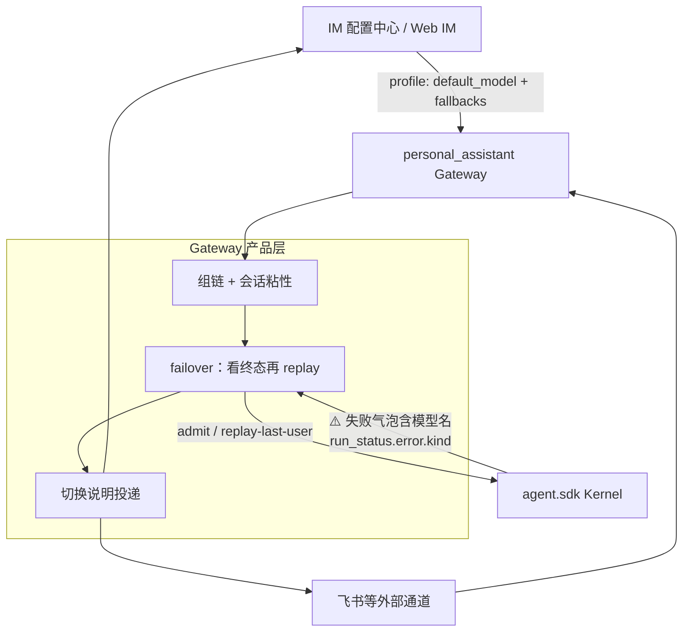
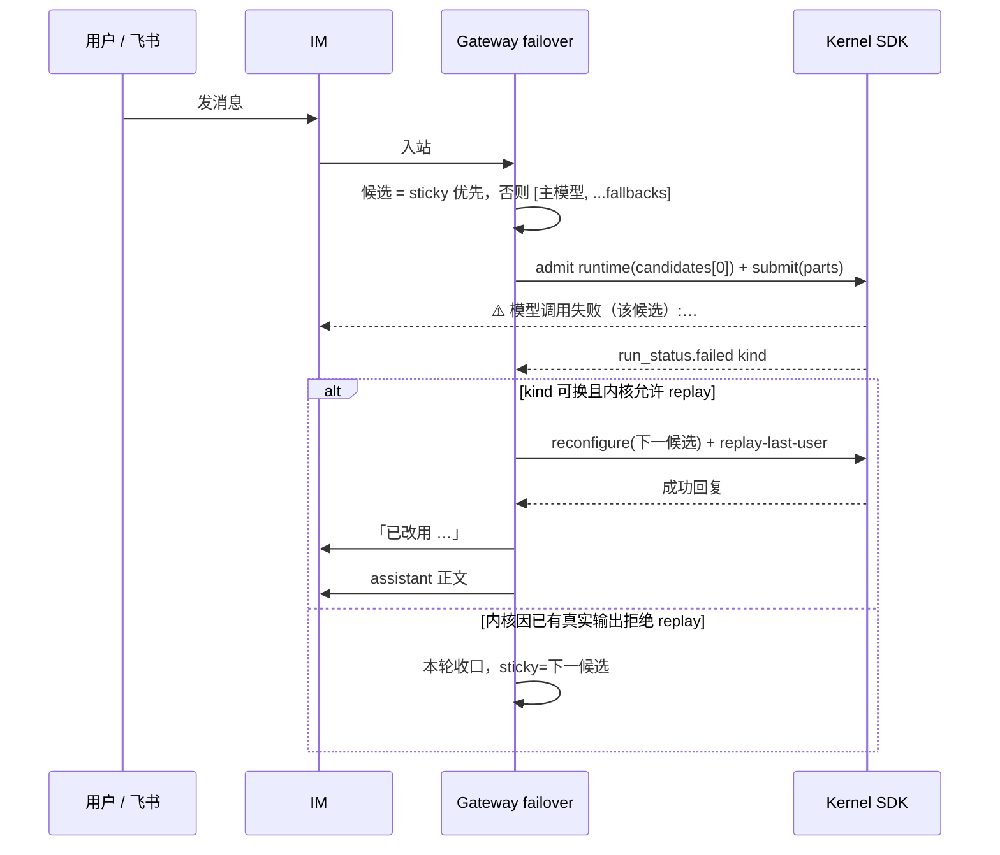
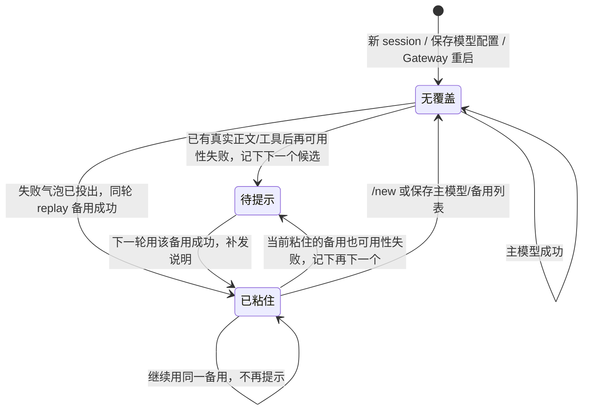

# feat-541: Agent 模型备用链 — 技术方案

> 对齐: spec.md
> Unit branch: `unit/feat-541` (will be created by orchestrator)

## Changelog

## 现状分析

### 涉及范围

- `src/IM/frontend/src/features/settings/agents/agent-detail-page.tsx` 与 `agent-create-page.tsx`：主模型是单个 `<select>`，紧挨 `ModelReasoningField`；折叠备用入口嵌在这里。
- `src/IM/api/routes/agents.py`、`src/IM/infra/repositories/agents.py`：Agent profile 只有 `default_model`，SQLite + 乐观锁 apply；备用列表作为同一次配置保存。
- `src/personal_assistant/config/local_store.py` 的 `resolve_run_model`：产品层唯一选模函数（`explicit > agent.default_model > 平台默认`）；聊天、心跳、cron 共用。
- `src/personal_assistant/gateway/kernel_client.py`：心跳/cron 只走 `submit_message`。该 shim **无论 caller 是否传 `model=`** 都会 `resolve_run_model` 再 `kernel.submit(model=resolved_model)`（`kernel_client.py:218-229`）；`explicit` 为空时解出链头（`local_store.py:669-672`），不是「让 runtime 生效」。心跳今天传 `model=agent.default_model`（`heartbeat_scheduler.py:518-525`）；cron 只传 `agent_id=`（`cron_runner.py:149-157`）。内核要求 submit 的 model 与 session runtime 一致，否则 `ValueError`（`kernel.py:1755-1758`）。聊天不走这条 shim，直调 `Kernel.submit` 且不传 `model=`（`session_run_coordinator.py:1387-1393`）。
- `src/personal_assistant/gateway/session_composition.py`：把「本轮有效模型」写进 `SessionRuntimeConfig.model`。
- `src/agent/sdk` Kernel：**窄开三条缝**，不持有 fallbacks。per-run 单模型；`RetryingLLMClient` 对同一请求重试；已产出部分内容后禁止原位重放。失败气泡今天不含模型名；`run_status.error` 今天丢掉 `ModelError` 事实。
- `src/agent/core/llm/error_classifier.py`：欠费/限流可重试；上下文超长走永久/`CompactionError`。Gateway **不** `except ModelError`、不 import `agent.core`；判定入口是 SDK 投影的 `run_status.error.kind`。不改分类器重试表。
- `src/personal_assistant/gateway/runtime_footer.py`：外部通道可选「实际模型」页脚，默认关；**不用**它充当切换说明。

### 既有约束

- `personal_assistant` 只能 import `agent.sdk`；IM 不调用 agent、不执行 LLM。
- 内核不持有对话默认模型；选模是产品层职责（bugfix-429）。
- 已开始的整轮不中途换运行配置；换候选 = 本 run 终态后再 `reconfigure` + replay-last-user。
- 聊天生产路径 `submit` **不传** `model=`，模型来自 session runtime。
- 工具审批专用模型失败不得改用对话模型（feat-510，本期非目标）。

### 可复用能力

- **用并扩展** `resolve_run_model`：仍只回答保存的链头；备用链与粘性在它之上组候选。
- **用** SDK `run_status.error.kind` 判断该不该换候选，不重写 `error_classifier`，不 import `agent.core`。
- **用** bugfix-380 的失败气泡通道；只改文案带上模型 id。
- **用** `_deliver_control_reply`（压缩确认同一出站）发「已改用」说明。
- **不用** `node.system_message` 当飞书可见提示（其它系统通知不外发飞书）。
- **不用** 运行信息页脚：默认关，语义是「本轮用了什么模型」，不是「因为主模型挂了才换」。

### 相关历史

- bugfix-429：选模收敛到产品层，`resolve_run_model` 聊天/心跳/cron 共用。
- feat-514：内核 per-run 模型 + 同请求重试 + 部分输出不重放。
- feat-517：Agent `default_model` 下轮生效。
- feat-523：外部运行信息页脚，默认关。
- feat-510：审批模型失败不降级到对话模型。

契约层与代码一致。缺口：配置面只有一个有效模型；运行面失败气泡不含模型名，且 `run_status.error` 丢掉判定事实。

## 架构总览

核心思路：Gateway 持有备用链与粘性；每次只让 Kernel 跑 **per-run 单模型**。可用性失败先把带模型名的失败气泡投给用户，再对下一候选重跑同一条用户消息。内核不知道 fallbacks 列表。

Before：一次 submit，失败气泡没有模型名，整轮停住。After：失败气泡带模型名；Gateway 按链 replay 同一条用户消息，成功后再发「已改用」。

## 关键决策

### 决策 1: 备用链落点

**选了 Gateway 持有备用链与粘性；内核仍 per-run 单模型，但窄开三条消费者缝，不持有 fallbacks 列表。**

- **理由**: 换谁、粘性、提示仍是产品选模（bugfix-429）。生产上失败气泡已经由 bugfix-380 投出，`run_status.error` 又丢掉 `ModelError` 事实，再 `submit` 会重复写入用户消息——完全不改内核则做不到「先看到失败、同一轮继续跑」。三条缝只服务 SDK 消费者：① 失败气泡带模型 id；② `run_status.error` 带可判定 `kind`；③ 复用上一条用户消息换模型再跑。Coding CLI 不调用备用链，只会看到带模型名的失败文案。
- **拒绝**: 内核内按 Agent fallbacks 自动换模型 — 审批/摘要会被误伤，Coding CLI 被拖进产品语义。IM 自己换模型 — IM 不执行 Agent。完全不改内核 — 用户会卡在失败气泡且无法同轮续跑，或 Gateway 只能猜字符串、再投一条用户消息。
- **风险**: 窄开的 replay 入口若被误用到审批模型路径会换错模型。约束：只包对话/心跳/cron 的用户可见 run，不包 `tool_approval_model`。

### 决策 2: 失败可见性与何时还换

**选了 可用性失败先把带模型名的失败气泡投给用户，再在同一轮对下一候选重跑；已经产出真实正文或工具时间线后再失败，本轮收口不换。**

- **理由**: 用户明确纠正：要先看到「⚠️ 模型调用失败」，且必须能看出是哪个模型。失败气泡沿用 bugfix-380 通道。**Gateway 不读气泡、不看 `reply_text` 是否为空、不匹配 `⚠️`。** 是否还换：只看 `kind` 是否可换；是否已有真实输出：以内核拒绝 replay 为准。
- **拒绝**: 静默换、对用户隐藏失败 — 用户已否定。用「有 assistant 文本就不换」— 失败气泡也会挡住 failover。解析 `⚠️` — 违反决策 6。
- **风险**: 链上每个失败都会留一条气泡。接受。

### 决策 3: 粘性存放位置

**选了 记在 Gateway，键就是 `kernel_session_id`；不写回 Agent 配置，不进内核。每次新回复的第一次 admit 和随后的 `kernel.submit` 都用 `candidates[0]`（有 sticky 就是备用）。**

- **理由**: `/new` 换新 session 即清除；保存主模型/备用列表时 Gateway 按 Agent 清相关覆盖。心跳优先复用 owner canonical 直聊的 kernel session，因此与该直聊**共享**粘性；没有直聊、退回 `:heartbeat` session 时那份单独记。编辑页始终显示保存过的主模型。`resolve_run_model` 只当组链输入。心跳/cron 必须经 `submit_message(model=candidates[0])` 显式传入；省略会被 shim 注入链头，与 sticky runtime 冲突（`kernel.py:1755-1758`）。
- **拒绝**: 写进 IM profile — 等于改保存的主模型。Agent 全局一份 — 一个聊天会污染其它聊天。按「心跳专用 session」另建命名空间 — 与生产不符，canonical 切换后状态会分叉。
- **风险**: Gateway 重启后内存覆盖会丢，下一轮会再从主模型试起；若主模型仍挂，会再走一遍链并再提示一次。可接受，不为本期做跨进程持久化。

### 决策 4: 切换说明的投递形态

**选了 复用压缩/控制确认同一条系统消息路径（`_deliver_control_reply`），不新开气泡类型，也不走运行信息页脚。**

- **理由**: 用户指定「类似压缩」。`/compact` 成功时发「已压缩当前会话。」，经控制确认同时到 Web IM 与飞书（外部触发时）。切换说明同样是一句短系统消息，粘住后的轮次不再发。
- **拒绝**: 运行信息页脚 — 默认关且语义是「本轮用了什么模型」。只写 IM 的 `node.system_message` — 飞书用户看不到（外部-channels 明确：其它系统通知不外发飞书，但控制确认会外发）。
- **风险**: 控制确认和 assistant 回复是两条消息，用户会先看到一句系统说明再看到备用模型的回复（或相反，取决于投递顺序）。实现上应先发说明再发回复，与「压缩确认独立成条」一致。

### 决策 5: 切到备用时的推理强度

**选了 一律用该备用模型自己的默认档，不沿用主模型保存的强度，也不沿用会话 `/effort`。**

- **理由**: 用户确认「用默认」。备用模型与主模型常常不是同一能力表，把主模型的「高」硬套过去会失败或静默降档。回到主模型后，仍按现有规则用 Agent 保存的强度和合法 `/effort`。
- **拒绝**: 沿用编辑页给主模型存的强度；切备用时保留会话 `/effort`。
- **风险**: 用户在会话里设过 `/effort`，自动切换后强度会回到备用模型默认，看起来像「档位丢了」。`/new` 或改回主模型后按既有规则恢复。接受为自动切换的代价。

### 决策 6: 何时换候选（Gateway 判定，不改内核分类器）

**选了 Gateway 读 `run_status.error.kind`（SDK 投影），不 `except ModelError`、不 import `agent.core`。欠费/额度、过载/5xx、超时、限流、认证失败都换；上下文超长不换。不把 `retryable` 当作唯一开关。**

- **理由**: 生产上 `ModelError` 被压成 `{code: "run_execution_failed", message: str(exc)}`，`agent.sdk` 也不导出该类型。认证失败在分类器里不可重试，但换另一家模型仍有意义。上下文超长走压缩路径。内核把既有分类结果投影成稳定 `kind`，不改 `error_classifier` 的重试表。
- **拒绝**: 只在 `retryable=True` 时换 — 认证失败将被漏掉。产品层解析 `⚠️` 字符串 — 文案一改就失效。把 failover 列表塞进内核 — 违反决策 1。
- **风险**: `kind=other` 不换，避免把工具/逻辑失败当成模型可用性失败。写错的模型名若被标成 auth/not-found 仍会走进备用链；可接受。

## 接口与数据流

主流程：**每一次新回复的第一次 admit** 用 `candidates[0]`（有 sticky 就是备用，不是保存的主模型）。随后打进 `kernel.submit` 的 model 必须仍是这个值。聊天直调 Kernel、省略 `model=`。心跳/cron 经 `submit_message` 必须显式 `model=candidates[0]`，不能省略（shim 会把链头打进去）。`resolve_run_model` 只当组链输入。失败气泡照常投出；`kind` 可换则 replay，不复制用户消息。

粘性状态（按 Kernel session，Gateway 内存）：

### 配置字段

Agent 配置新增有序列表 `model_fallbacks: string[]`，与 `default_model` 同一次乐观锁 apply。

| 字段 | 形状 | 语义 |
|---|---|---|
| `default_model` | `string \| null` | 不变。编辑页始终显示这个保存值。 |
| `model_fallbacks` | `string[]` | 有序备用模型 id，来自该节点同一模型目录。缺省 / `[]` = 没配。 |

校验（apply 时，与推理强度同一拒绝语义）：

- 每项必须在当前节点可用模型目录中；
- 去重、去掉与当时有效主模型相同的项（有效主模型 = `default_model` 或它为空时的平台默认）；
- 非法目录项 → 冲突，不写新 profile。

落点：IM `AgentProfile` / config API / SQLite、Gateway `AgentWorkspaceConfig`、本地 YAML `agents[].model_fallbacks`。旧配置无此字段视为 `[]`。

### 选模

`resolve_run_model` 仍只回答「保存的主模型 / 平台默认」，**不读粘性**。它只是组链的链头输入，不是本轮第一次 admit 的模型。

新增产品层（名称实施期自定）：

1. **组链** `resolve_model_candidates(agent, product_default, sticky) -> string[]`
   - 无 sticky：`[链头] + model_fallbacks`（已去重、不含链头）。
   - 有 sticky：`[sticky.model] + 链上 sticky 之后的剩余项`。不再把已经失败的链头放回本轮。
   - 没配备用且无 sticky：单元素 `[链头]`，行为与现在相同。
2. **每一次新回复的第一次 admit**（聊天 `_project_runtime` / 心跳 `ensure_agent_runtime` / cron 建会话 runtime）必须用 `candidates[0]`，不是裸 `resolve_run_model`。已粘在 B 上时，下一轮直接 admit B，不再先撞主模型。
3. **入队 `kernel.submit` 的 model 必须与这次 admit 相同**：
   - 聊天：继续直调 `Kernel.submit` 且省略 `model=`（`session_run_coordinator.py:1387-1393`），runtime 已是 `candidates[0]`。
   - 心跳/cron **只走** `InProcessKernelClient.submit_message`。该 shim 无论 caller 是否传 `model=`，今天都会 `resolve_run_model` 再 `kernel.submit(model=resolved_model)`（`kernel_client.py:218-229`）；`explicit` 为空时解出的是保存的链头，不是 runtime。因此禁止「像聊天一样省略」。心跳/cron 必须显式 `submit_message(model=candidates[0])`。禁止 `model=agent.default_model`。`resolve_run_model` 只给组链当链头。
4. **failover 循环**在等终态之后：
   - 聊天：`session_run_coordinator._await_terminal_run` 之后；observer **照常转发**失败气泡（不要 hold）。
   - 心跳：`heartbeat_runner` 等到 `stream_run_to_completion` 之后。
   - cron：`CronRunTerminalConsumer`（`cron_execution_service.py`）等终态，不在 `cron_runner.submit`。
   - 换候选：**禁止**再次 `submit` 同一份 user parts。走 SDK replay-last-user：先 `reconfigure_session` 到下一模型（及该模型默认 reasoning），再发起不携带新 user parts 的 run。
5. **粘性表** `kernel_session_id -> { model, noticed: bool }`，仅 Gateway 进程内存。
   - `/new` 换 session → 自然消失。
   - 该 Agent 的 `default_model` 或 `model_fallbacks` 成功 apply → 清掉该 Agent 所有 session 的覆盖。
   - 不写 IM profile、不进 Kernel、不进磁盘。

### 本轮何时换 / 何时提示

失败文案：`⚠️ 模型调用失败（{model}）:{原因}`。Coding CLI 走同一内核文案，但不走备用链。

SDK `run_status.error.kind`：`quota` / `overload` / `timeout` / `rate_limit` / `auth` / `context_length` / `other`。Gateway：前五项尝试换；`context_length` 与 `CompactionError` 不换；`other` 不换。

**产品循环（写死，禁止第三种猜法）**：

1. observer 照常转发所有 assistant，包括失败气泡。
2. 终态后只看 `kind`：可换且链上还有下一候选 → 调用 replay-last-user；不可换 → 本轮收口。
3. **不要**用 `reply_text` 是否为空，**不要**匹配 `⚠️`，**不要**从 stream metadata 猜 `is_provider_error`（生产上这些通道区分不了失败气泡和真回复）。
4. 内核若因「本 run 已有非 provider-error 的 assistant 正文或工具事件」拒绝 replay → 本轮收口；若链上还有下一候选，sticky=`{model:下一候选, noticed:false}`。
5. 内核接受 replay → 失败气泡已经在聊天里；继续下一候选。

| 本轮情况 | 动作 |
|---|---|
| 第一次 admit 的候选成功，且等于保存的链头 | 清 sticky；不发「已改用」 |
| 候选成功，且不等于链头（含第一次就 admit sticky，或本轮 replay 成功） | sticky.model=该候选；若 `noticed` 为假：先发「已改用」再发正文，置 `noticed=true` |
| `kind` 可换，内核接受 replay，链上还有下一候选 | 失败气泡已投出；replay 下一候选 |
| `kind` 可换，内核拒绝 replay | 本轮收口；sticky=下一候选且 `noticed=false` |
| 整链耗尽 | 每条失败气泡都留下；不发「已改用」；不伪装成功 |

### 推理档

- 候选是保存的链头：现状不变（Agent `reasoning_effort` + 仍合法的会话 `/effort`）。
- 候选不是链头：该模型自己的默认档；**跳过** `_reconcile_runtime` 对 `/effort` 的 overlay，也不套用 Agent 给主模型存的强度。
- 切回链头后按既有规则恢复。

换候选时对 Kernel 再 `submit`/`reconfigure` 带新的 `SessionRuntimeConfig.model`（及对应默认 reasoning）。其余 prompt/skills/tools/features 与本轮开始时同一份 Agent 快照。

### 切换说明

- 文案：`已改用 {model}，因为主模型不可用。` `{model}` 用目录里的模型 id（与选择器一致）。
- 投递：复用 `_deliver_control_reply`（与「已压缩当前会话。」同一出站）。若该函数目前绑死 compact 的 `ControlOperation`，抽一层短系统文本投递供 compact 与 fallback 共用，用户可见形态不变。
- 顺序：先说明，再备用正文。
- Web IM：普通 Agent 短气泡（压缩确认就是这种，不是居中 `chat-bubble-system`）。
- 飞书等外部通道：同一句 Bot 文本（控制确认会外发；其它系统通知不会）。
- 心跳/cron 若本轮向用户发出了可见内容：先带模型名的失败提示（若发生了可用性失败），成功后再「已改用」再正文。

### 测试面

Gateway 产品层：组链、粘性、失败气泡不挡换、真实正文后不换、replay 不复制用户消息、说明只发一次、心跳/cron 同链。Kernel：失败文案含模型 id、`error.kind`、replay-last-user。IM：`model_fallbacks` 读写。前端：折叠/数量/增删。不测内核同请求 `RetryingLLMClient`。

## 前端原型

- 原型文件: [prototype.html](prototype.html)
- 覆盖范围: Agent 新建/编辑页折叠备用入口；Web IM 首次切换三条消息（带模型名的失败气泡、「已改用」、正文）。

### 现有 UX grounding

| 当前产品入口 / 组件 | 必须继承的 UX 特征 | 本次增量如何嵌入 |
|---|---|---|
| `agent-detail-page.tsx` / `agent-create-page.tsx` 访问卡片 | 白底 12px 圆角卡、标题「访问与模型」、主模型是 `im-input` `<select>`，紧挨 `ModelReasoningField` | 主模型 select 与推理档位置、文案、控件都不改 |
| 同卡「View skill statistics」 | 0.78rem 无底文字链、强调色 | 折叠入口用同类文字链，不新开卡片、不用 `
` 整块把表单撑开 |
| 字段 label | 0.78rem semibold，字段纵向 gap 很小 | 「备用 · 未设置 / N 个」放在「默认模型」**标签行右侧**，收起时不增加表单高度 |
| 聊天 `message-pane` 压缩确认与失败气泡 | 短句独立成 Agent 气泡；bugfix-380 失败也是 Agent 气泡 | 失败文案改为含模型名；「已改用」仍走压缩确认形态；顺序：失败 → 已改用 → 正文 |

不改变既有 UX 骨架。备用列表展开后用与主模型相同的 `im-input` select，行左序号、行右 ✕；「+ 添加备用」仍是文字链。

### 原型对齐契约

| 原型区域 / 状态 | 对齐级别 | 产品入口 | 必验 viewport / 状态 | 下游验收投影 |
|---|---|---|---|---|
| 默认折叠：主模型 select 原位，标签行右侧「备用 未设置」，不撑高表单 | must-match | Agent 新建页、编辑页 | desktop 1440、mobile 375；空备用 | M1 `[reviewer]` 折叠不占位 |
| 已配备用仍折叠：右侧显示「备用 N 个」，主模型仍是保存值 | must-match | Agent 编辑页 | 已保存 ≥1 个备用、未点开 | M1 `[reviewer]` 未展开能看出已配 |
| 展开后点「+ 添加备用」立刻多一行 select（预填下一个未占用模型并 focus）；✕ 删除；不能选主模型或已占用项；目录用尽后添加入口消失 | must-match | 同上 | 从空添加、改主模型挤掉冲突项、删到空 | M1 `[reviewer]` 展开保存 |
| 清空备用保存后折叠文案回到「未设置」 | must-match | Agent 编辑页 | 清空并保存 | M1 `[reviewer]` 清空等价从未配置 |
| 聊天首次切换：失败气泡（含模型名）→ 短说明 → 正文；无弹窗/按钮 | must-match | Web IM `/chat` 单聊 | 主模型不可用且本轮切到备用 | M1 `[reviewer]` Web IM 说明 |
| 飞书同样：失败提示（含模型名）→ 说明 → 正文 | must-match | 飞书原 chat | 外部通道触发的同轮切换 | M1 `[reviewer]` 外部通道说明 |
| 原型里技能/工具选择器、推理档内部选项 | out-of-scope | — | — | 真实页保持现有实现 |
| 折叠控件是否用 button vs summary | may-adapt | Agent 表单 | — | 必须保持「标签行右侧文字链、默认不占垂直空间」；可用现有 button 类，不要改成第二张卡或默认展开的多行 select |

## 契约层增量 (delta-spec)

- kernel: [specs/kernel/model-runtime.md](specs/kernel/model-runtime.md)、[specs/kernel/runs.md](specs/kernel/runs.md)
- im: [specs/im/agents-nodes.md](specs/im/agents-nodes.md)
- gateway: [specs/gateway/agent-capabilities.md](specs/gateway/agent-capabilities.md)、[specs/gateway/external-channels.md](specs/gateway/external-channels.md)、[specs/gateway/heartbeat-cron.md](specs/gateway/heartbeat-cron.md)
- cli: no spec delta（不实现备用链；失败文案随内核变化，属 model-runtime 契约）
- im/web-chat-ux: no spec delta（失败气泡与「已改用」都是既有 Agent 气泡）

## 风险与回退

- **部分输出后无法本轮续跑**：内核禁止原位重放。应对：已有真实正文/工具后再失败则本轮收口，粘性留给下一轮。失败气泡本身不挡住换候选。
- **Gateway 重启丢粘性**：接受，本期不持久化。
- **心跳 submit 盖住粘性**：今天 `submit_message(model=agent.default_model)` 在 runtime 已是备用时会被内核拒；只删这个 kwargs、不改成 `candidates[0]`，shim 仍会注入链头。应对：心跳/cron 显式 `model=candidates[0]`。worker 单测必须覆盖「直聊已粘备用后心跳复用同一 session」。
- **重复用户消息**：第二次普通 `submit(parts)` 会在 IM 再写一条用户气泡。应对：只走 replay-last-user。
- **可见顺序**：失败气泡 →「已改用」→ 备用正文。observer 不 hold 失败气泡。
- **认证失败也会换模型**：写错的模型名可能走进备用链。接受。
- **降级**：`model_fallbacks` 为空时行为与现在相同（仅失败文案多了模型名）。回滚备用链时去掉 failover 循环与字段；失败文案带模型名可单独保留。

## Runbook for Reviewer

本 unit 改 IM 配置 API / Web 前端和 Gateway 选模。走隔离栈，不要动本机 `:8011` 生产 IM。

以实际 worktree 绝对路径为 `WT_ROOT`（orchestrator 派发后即该 milestone worktree；在 main 上预览设计时可用仓库根）。`NANO_MAIN_ROOT` 为本机主 checkout（有 `.venv`）。

| 服务 | 停止命令 | 启动命令 | 健康检查 |
|---|---|---|---|
| 隔离 IM + Gateway | `PATH="$NANO_MAIN_ROOT/.venv/bin:$PATH" "$NANO_MAIN_ROOT/scripts/e2e-down.sh" --wt "$WT_ROOT"` | Web IM 旅程：`PATH="$NANO_MAIN_ROOT/.venv/bin:$PATH" "$NANO_MAIN_ROOT/scripts/e2e-up.sh" --wt "$WT_ROOT" --main-config "$HOME/.nanoassistant/config.yaml"`；飞书旅程另加 `--feishu` | `source "$WT_ROOT/.e2e-ports.env"`；`curl -fsS "$IM_URL/openapi.json"`；`kill -0 "$(cat "$WT_ROOT/.im.pid")"`；`kill -0 "$(cat "$WT_ROOT/.gateway.pid")"`；打开 `$IM_URL/` 确认节点在线 |

启动前先 down 再 up，避免 stale binary。用完执行 down。`--main-config` 只把模型目录/凭据拷进 worktree 副本，不写回 `~/.nanoassistant/config.yaml`。

**Review 驱动方式**: 端到端真栈；本 unit 改了客户端面，必须真点 Web IM：Agent 新建/编辑页的折叠备用入口（1440 与 375）、保存后再打开；单聊发消息必须看到「带模型名的失败提示 → 已改用 → 正文」；`/new` 与改配置清粘性。飞书旅程必须真发飞书消息，不能只用 IM HTTP 代替。

**验收前置**:

- 节点模型目录至少两个可提交模型（本机 `~/.nanoassistant/config.yaml` 的 `llm.providers` 已有；e2e 默认目录也有多模型，但要用真实可用性失败需走 `--main-config` 带真实凭据的副本）。
- 制造主模型失败：把验收 Agent 主模型设为会认证失败/欠费/被代理拒绝的那一个，备用设为当前能聊的模型。不要用「目录里不存在的 id」（apply 会拒）。
- 飞书：本机已有 `${XDG_CONFIG_HOME:-~/.config}/nano-multiagent/feishu-e2e.env`。开始前 `lark-cli --profile <该文件中的非 default profile> auth status --json --verify` 必须通过。`--main-config` 副本里不要启用生产 Bot channel；飞书旅程只靠 `e2e-up.sh --feishu` 注入的测试 App。
- 心跳：该 Agent 打开 heartbeat，且 `HEARTBEAT.md` 有可冒泡内容；cron：启用并建一条会立刻跑的任务。上下文超长不换模型以 worker 单测为主；reviewer 灌不满窗口时核 worker 证据并注明环境限制。

## Milestones

默认单 M1：配置、failover、提示是一条用户可观察切片，前后端不能拆开交付。

| ID | 标题 | 依赖 | 并行组 | 范围 | 退出标准 |
|---|---|---|---|---|---|
| feat-541-M1 | impl | — | A | 前端：`agent-detail-page.tsx`、`agent-create-page.tsx`、`im-agent-config-api.ts`、i18n；IM：`api/routes/agents.py`、`domain/models.py`、`infra/repositories/agents.py`、`infra/db.py`、`application/config_service.py`、`application/agent_config_operations.py`；Gateway：`local_store.py`、`agent_config_sync.py`、`session_run_coordinator.py`、`session_composition.py`、`session_binder.py`、`kernel_client.py`、`heartbeat_scheduler.py`、`heartbeat_runner.py`、`cron_runner.py`、`cron_execution_service.py`；Kernel SDK 缝：`agent/sdk` 与 `run_status.error` / replay-last-user / 失败文案（`runtime.py` `_build_provider_error_message`、`runs/registry.py` 投影 kind）。不把 failover 列表放进内核，不改 coding_cli 产品逻辑。 | 见下方两轨 |

退出标准：

- `[reviewer]` 默认折叠不占位；未展开能看出已配数量；展开可增删保存，刷新顺序不变（Scenario: 默认折叠 / 展开后按序添加 / 清空备用）。覆盖 `prototype.html` 配置卡 must-match。
- `[reviewer]` 主模型可用性失败时先看到带该模型名的失败提示，不必再发消息即可收到备用回复；没配则只有这一条失败（带模型名）；整链耗尽时每条失败都带对应模型名；上下文超长不换。
- `[reviewer]` Web IM 顺序：失败气泡 →「已改用 {model}，因为主模型不可用。」→ 正文；无弹窗；粘住后不再每条提示；飞书原 chat 同样先失败提示再说明再正文。覆盖原型聊天 / 飞书 must-match。
- `[reviewer]` 编辑页仍显示保存的主模型；`/new` 或保存主模型/备用列表后下一轮从主模型试起；另一聊天互不影响。
- `[reviewer]` 心跳 tick 与 cron 在主模型不可用时仍能完成；若向用户发出可见内容，同样先有带模型名的失败提示，成功切换时再带说明。
- `[worker]` 组链、粘性接到第一次 admit，心跳/cron 经 `submit_message` **显式** `model=candidates[0]`（禁止省略、禁止 `model=agent.default_model`；含心跳复用 canonical 直聊时共享）、`kind` 可换则尝试 replay、以内核拒绝为准、不看 `reply_text`/不匹配 `⚠️`、replay 不复制用户消息、说明只发一次、心跳/cron 同链、配置保存清粘性、`kind` 认证仍换、上下文超长不换 — 最窄 PA / IM / kernel 单测全绿。
- `[worker]` Agent 新建/编辑页折叠与添加交互的前端测全绿；真实浏览器 1440/375 截图与 `prototype.html` 对照，证据落在本 unit 目录。
- `[worker]` 失败文案含模型 id；`run_status.error.kind` 经 `agent.sdk` 可见；replay-last-user 不追加 user parts。failover 列表不进入内核。coding_cli 无备用链逻辑。
