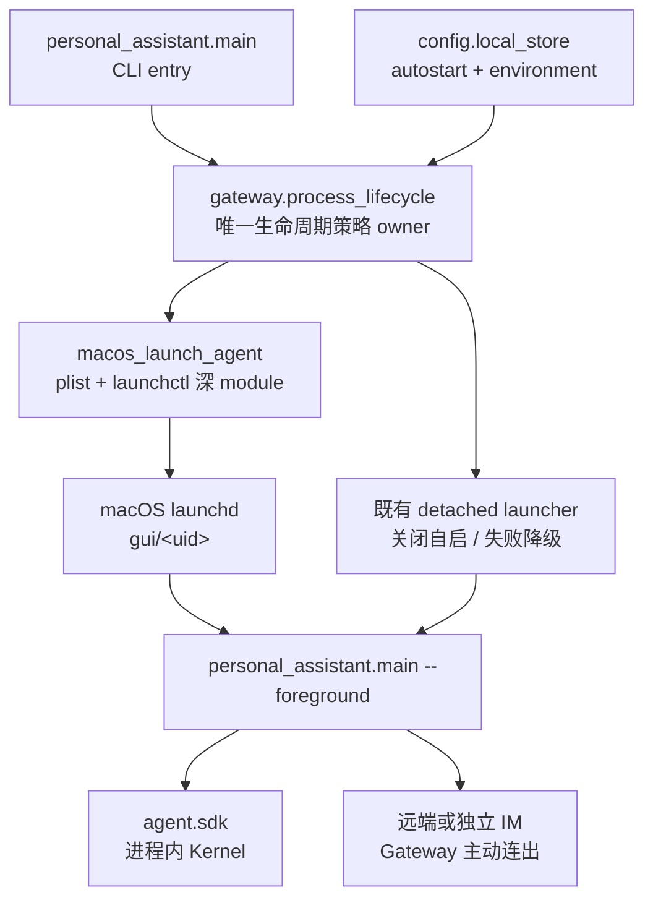
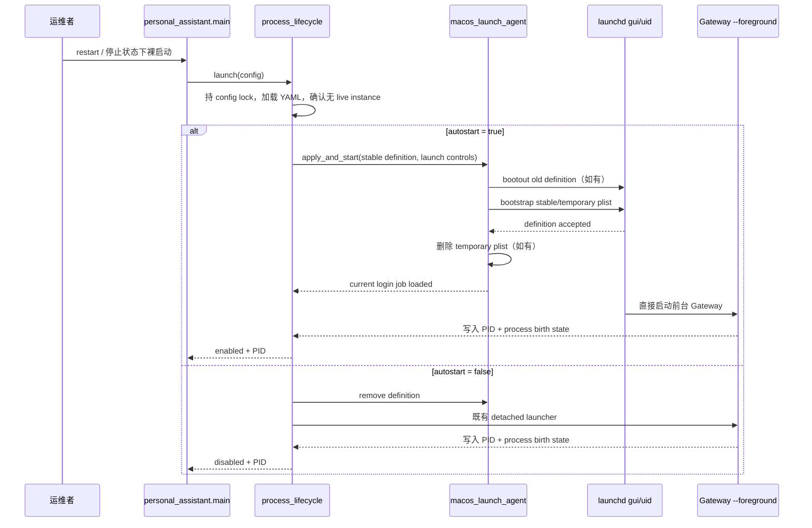
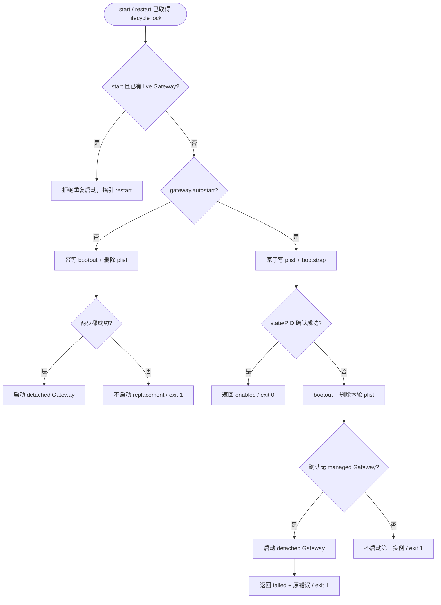

# feat-542: Gateway 可配置的 macOS 登录自启 — 技术方案

> 对齐: spec.md v1
> Unit branch: `unit/feat-542`（由 orchestrator 创建；design 阶段不创建）

## Changelog

## 现状分析

### 涉及范围

- `src/personal_assistant/main.py` 只负责解析 Gateway CLI，并把裸启动、`stop`、
  `restart` 和 `--foreground` 分派给生命周期 owner；当前启动结果只表达 PID、IM
  地址与日志路径。
- `src/personal_assistant/gateway/process_lifecycle.py` 是现有 Gateway 进程生命周期
  owner：它持有 config-scoped lock、前台运行、脱离终端的后台启动、PID/process
  birth 状态、进程组停止和 `restart` 原子序列。本 unit 要在这里加入“按配置选择
  launchd 或普通后台”的策略，但不把 macOS plist/`launchctl` 细节摊给 CLI。
- `src/personal_assistant/config/local_store.py` 负责 Gateway 本地 YAML 的 typed parse/save，
  且运行中的 token 刷新会通过该 owner 回写配置。本 unit 的 `gateway.autostart` 与
  `gateway.environment` 必须进入同一 typed model 和序列化路径，否则后续回写会丢失。
- `docs/operations/gateway.md`、`docs/operations/prod-fleet.md`、
  `docs/operations/local-stack.md`、`README.md`、随包
  `builtin_skills/nanoassistant-docs/references/getting-started.md` 和
  `.claude/skills/prod-fleet-deploy/SKILL.md` 仍把 Gateway 描述为手工启动的 detached
  process；实施时要同步为新的配置和验证方式。
- `docs/specs/gateway/service-lifecycle.md` 是本 unit 唯一发生行为增量的 canonical
  area；area 新增三个 Requirement 后，`docs/specs/gateway/spec.md` 的索引计数也要从
  7 更新为 10。`agent`、`IM` 与 `coding_cli` 不改。

### 既有约束

- `personal_assistant` 只能通过 `agent.sdk` 使用内核；本 unit 闭合在 Gateway 产品包
  与 macOS 本机服务机制内，不改变跨包依赖方向，也不让 IM 管理 Gateway 进程。
- `--foreground` 是 debug、E2E 和外部 supervisor 的直接入口；它不能反过来安装或
  修改 LaunchAgent，否则 worktree E2E 会污染用户登录服务。
- 同一 resolved config 的生命周期操作继续由现有 lock 串行；任何切换都必须保持
  单实例和 process-birth 校验，不能因 launchd 接管而出现第二个 Gateway。
- config、plist、日志、PID/state 和本机凭据都属于运行数据，不提交仓库；生产部署
  还必须保留用户当前 dirty/untracked checkout，并只在新服务已证明指向新
  `prod-main-*` worktree 后清理旧 worktree。
- 本 unit 只支持当前登录用户的 macOS GUI domain，不要求 root、登录前启动、Linux
  systemd、Windows Service 或 Web IM 配置页。

### 契约层 grounding 结论

- 当前 `docs/specs/gateway/service-lifecycle.md` 与代码一致：所谓“后台常驻”实际是
  `start_new_session=True` 的 detached child，启动确认只证明 state 中的 PID/process
  birth 存活，不承诺 runtime/channel ready。
- canonical spec 没有声明重启登录后自启或进程崩溃恢复；这正是本 unit 要追加的
  行为，不是现有实现 drift。
- 当前重复裸启动拒绝、`restart` 持锁完成 stop + start、`stop` fail-closed 校验进程
  身份等契约仍成立，本设计只扩展其运行方式。

### 可复用能力

- **改造复用** `run_gateway()`：它已经是 launchd 应直接托管的长生命周期前台入口，
  并在进入 runtime 前写原子 state、安装 SIGTERM handler，满足监督与优雅退出需要。
- **原样保留** 普通后台 launcher：配置关闭自启或 LaunchAgent 应用失败时仍由它提供
  当前会话内可用的降级路径。
- **原样复用** config-scoped lock、state/process-birth 校验、SIGTERM → SIGKILL 和
  expected-state 清理；launchd 只改变谁创建和重拉进程，不另建第二份 PID 真相。
- **新增一个深 module** `gateway/macos_launch_agent.py`，把 label/plist、GUI domain、
  `bootstrap`/`bootout`/`print` 与原子文件更新隐藏在小 interface 后。它是唯一 macOS
  实现，不建立没有第二种生产实现的跨平台 port；测试替换的是 module 内部命令执行
  seam，而不是向业务层暴露通用 ServiceManager。

### 相关历史

- `refactor-461-dead-kernel-subprocess-seam` 已冻结“启动确认不是 readiness”，并明确
  Gateway 自身后台 supervisor、PID lock 与进程组清理必须保留；本 unit 不恢复任何
  Kernel 子进程或 health probe。
- `refactor-470-managed-channel-composition` 把 CLI、进程生命周期与 runtime composition
  分到现有 owner。本 unit 沿用该结构，不把 plist 或配置策略塞回 `main.py`。
- 现有 LLM proxy LaunchAgent 的经验表明，`KeepAlive` 不能监督一个随后自行 daemonize
  的 launcher；需要让 launchd 直接拥有长期前台 Python 进程。

## 架构总览

现状是 CLI 直接创建 detached child；完成后，CLI 仍只调用同一个生命周期 interface，
由它根据配置选 launchd 或原有后台路径。macOS 细节集中在一个深 module，IM 与进程内
Kernel 的运行拓扑不变。

## 关键决策

### 决策 1: 自启意图和稳定运行环境都由 Gateway YAML 拥有

**选择 `gateway.autostart`（默认 `true`）与 `gateway.environment`；运行环境按“显式 CLI
控制 > Gateway 配置环境 > 启动进程继承环境”合成。**

- **理由**：登录后的 LaunchAgent 不继承用户执行 `start` 时的临时 shell 环境；把
  `SEARXNG_URL` 等 Gateway 运行条件写入既有 `0600` 本地配置，才能让手工启动、
  launchd 启动和配置回写使用同一份事实。
- **拒绝**：不复制当前 shell 的全部环境到 plist，避免隐式快照和凭据扩散；不只依赖
  `.zprofile`，因为生产命令当前使用 inline environment；不为 SearXNG 单独造一个
  只解决眼前变量的配置特例。
- **优先级**：`gateway.environment` 覆盖同名 inherited process environment，但不能取消
  本次显式 CLI control；例如 YAML 即使设置 `NANO_MULTIAGENT_AUTO_BIND` 为其他值，显式
  `--auto-bind` 最终仍强制为 `1`。这不是通用参数覆盖框架，只是保住现有 CLI 契约。
- **风险**：使用 Homebrew 等外部命令的 Agent 还需显式配置合适的 `PATH`；文档和生产
  配置必须把当前 inline `SEARXNG_URL` 迁入 YAML。`--auto-bind` 和
  `--im-service-url` 仍是单次启动控制，不并入稳定 environment。

### 决策 2: launchd 直接监督现有前台 Gateway

**使用当前用户 `gui/<uid>` 下的 LaunchAgent，`KeepAlive=true`，Program 直接执行绝对
Python 路径和 `personal_assistant.main --foreground`。**

- **理由**：直接监督才能同时获得登录加载、崩溃恢复、SIGTERM 优雅关闭与同进程组
  清理；`KeepAlive` 已隐含 RunAtLoad，无需再叠加启动脚本或 tmux。
- **拒绝**：不让 launchd 调裸启动或 `restart`，因为这两个命令会再创建 detached child，
  supervisor 会把 launcher 的正常退出误判成需要重拉；不使用系统 LaunchDaemon，避免
  root 权限和登录前凭据/GUI domain 问题。
- **风险**：连续启动失败会进入 launchd 自带节流；CLI 等待 startup state 失败后必须先
  bootout，不能把 crash loop 留在后台。

### 决策 3: 生命周期策略留在 `process_lifecycle`，macOS 机制单独收口

**CLI 继续只学习 start/stop/restart 结果；`process_lifecycle` 选择模式并维护单实例，
`macos_launch_agent` 只实现 plist 与 launchctl 机制。**

- **理由**：调用者与测试仍跨同一个生命周期 interface，现有 lock、state 和进程身份
  安全获得最大 leverage；删除 macOS module 时其复杂度会回流到 lifecycle，说明该
  module 有实际 depth，而不是 pass-through。
- **拒绝**：不新增跨平台 `ServiceManager` port 或 noop/Linux adapter；本期只有一个生产
  adapter，抽象会扩大 interface 而没有变化来源。
- **风险**：`process_lifecycle.py` 需要重排少量内部函数以共享“确认 live state”和“停止
  owned process”，但不得复制现有 PID 判断。

### 决策 4: 裸启动保留拒绝重复，只有 restart 替换运行实例

**Gateway 已运行时，裸启动继续报 `already running`；停止状态下的裸启动和任意
`restart` 才应用最新自启配置。**

- **理由**：保住当前单实例契约，避免用户误执行 start 时中断在途任务；修改运行中
  配置后使用 `restart` 是既有运维规则。
- **拒绝**：不把 start 改成幂等 reconcile-and-replace，因为这会掩盖运行实例被重启的
  破坏性变化。
- **风险**：用户只编辑配置后再次裸启动不会应用；错误信息与运维文档必须继续明确
  引导 `restart`。

### 决策 5: 人工 stop 只暂停当前登录，关闭配置才移除自启

**`stop` 幂等 bootout 当前 GUI-domain job 并保留 plist；`autostart: false` 只有在幂等
bootout 与 plist 删除都成功后才启动 detached Gateway 并报告 disabled。**

- **理由**：bootout 让 `KeepAlive` 不会立即重拉，保留 plist 又使下次登录重新加载；
  “本次暂停”和“长期关闭”因此分别由命令与持久配置表达。
- **拒绝**：不使用 `launchctl disable`，其禁用状态跨重启另存于 launchd，会形成 YAML
  之外的第二份长期意图；不让 `stop` 删除 plist，否则下次登录无法遵守仍为 true 的配置。
- **失败语义**：在可访问的 GUI domain 中确认 job 未 loaded、或确认 plist 已不存在，
  都算幂等成功；GUI domain/job 状态无法判定属于真实失败。真实 `bootout` 失败时不再
  单独 signal、不启动 replacement，保留现有实例并让 CLI 非零；`bootout` 成功但删除
  plist 失败时也不启动 detached、不宣称 disabled。这样任何失败都不会制造双实例或
  留下一份被误报为关闭的下次登录服务。
- **停止时限**：plist 的 `ExitTimeOut` 取
  `max(1, ceil(gateway.shutdown_grace_seconds))`，保证 launchd 不早于既有 grace 强杀；
  bootout 后仍由现有 process-birth waiter 使用精确配置值确认退出并清理 state。
- **风险**：直接手工修改/删除 plist 属于越过产品 interface 的运维操作，只提供排障
  说明，不把这种外部漂移当成新配置源。

### 决策 6: 每份 resolved config 拥有稳定且可替换的 LaunchAgent

**label 与 plist 路径由 resolved config path 的摘要稳定派生；持久 plist 只含稳定
config，显式 `--auto-bind` / `--im-service-url` 只进入当前 GUI-domain 的临时 bootstrap
定义，不跨 bootout 或重新登录。**

- **理由**：同一配置跨 restart 命中同一 job，自定义 config 互不冲突；服务定义指向
  当前实际加载的代码位置，使 production `prod-main-*` worktree 升级可以原子换向。
- **拒绝**：不用 `node_id` 做 label，因为 node identity 可以改且不是进程生命周期 key；
  不写固定仓库路径，因为本机生产明确从版本化 worktree 运行；不把临时 CLI override
  固化到 `~/Library/LaunchAgents`，避免 YAML 和 plist 形成两份长期 IM 配置。
- **临时控制传播**：每次 apply 先原子写入不含临时控制的稳定 plist；若本次 CLI 带
  `--auto-bind` 或 `--im-service-url`，再以同一 label 生成一个临时 bootstrap plist并由
  launchctl 从该文件加载，bootstrap 返回后立即删除临时文件。launchd 在当前登录会话
  的 KeepAlive 重拉仍沿用本次控制；bootout 或重新登录后只会从稳定 plist 按 YAML 启动。
- **稳定标识**：label 固定为
  `io.github.mrchen116.nano-multiagent.gateway.<sha256(resolved-config)前16位>`，持久文件名
  与 label 一致并以 `.plist` 结尾；start、stop、restart 和 reviewer 都复用同一派生函数。
- **风险**：旧 worktree 必须等新 plist 已加载、live process command/state 已指向新路径
  后才能清理；临时 plist 无论成功失败都要在调用结束前清理。

### 决策 7: 自启失败回滚为单一 detached Gateway，并以非零退出码报告降级

**LaunchAgent 写入、加载或 startup confirmation 任一步失败，都先撤销本轮 job/plist并
确认没有 managed Gateway，再走既有 detached launcher；detached 降级启动成功仍返回
非零并携带原始自启错误。**

- **理由**：当前助手可用与持久性配置成功是两个独立事实；结果对象同时表达 PID 和
  autostart status，CLI 才能对人说明“已运行但未常驻”，并让部署自动化阻断不完整交付。
- **拒绝**：不把降级打印为全成功，也不因 LaunchAgent 失败直接让本次 Gateway 离线。
- **风险**：若无法证明部分加载的 managed process 已退出，单实例安全优先，禁止再起
  detached 第二实例并直接报错；这是降级路径唯一允许的中止条件。

## 接口与数据流

### 配置与结果 interface

`GatewayLifecycleConfig` 增加两项稳定字段：

| 字段 | 语义 |
|---|---|
| `autostart: bool = true` | 仅在 macOS 裸启动/`restart` 时决定是否安装用户 LaunchAgent；`--foreground` 不应用服务设置 |
| `environment: Mapping[str, str] = {}` | `run_gateway()` 在 composition 前覆盖到进程环境，并由子进程继承；值不复制进 plist |

默认 launch 与 `restart` 的 lifecycle interface 显式接收现有
`im_service_url_override` 和新增 `auto_bind: bool`；`main.py` 不再只靠 parent environment
把 `--auto-bind` 偶然传给 detached child。普通后台 argv 和当前登录临时 plist 都把该
控制写成 child 的 `--auto-bind` 参数；foreground child 则把显式控制作为参数交给
`run_gateway()`，不再提前改 process environment。

`run_gateway()` 是 effective environment 的唯一应用点：先保留 inherited environment，
再覆盖 `gateway.environment`，最后把显式 `auto_bind=True` 强制映射为
`NANO_MULTIAGENT_AUTO_BIND=1`；未传 flag 时则允许 YAML 覆盖同名 inherited env。这样三种
启动方式共享同一优先级，两项 CLI control 都不是 `GatewayLifecycleConfig` 的持久字段。

现有 `BackgroundLaunchResult` 改为语义准确的 `GatewayLaunchResult`，保留 `pid`、
`log_path`、`im_service_url`，并增加
`autostart_status = enabled | disabled | failed | not_applicable` 与可选
`autostart_error`。`main.py` 只据此打印结果；`failed` 仍打印 PID/日志/IM 状态，但最终
返回 `1`。非 macOS 使用 `not_applicable` 并保持现有 detached 启动和既有输出，不打印
“enabled/disabled/failed”，也不调用 macOS module。

`macos_launch_agent` 的 module interface 只暴露 lifecycle 真正需要的三类动作：

| 动作 | 成功或幂等结果 | 真实失败后的保证 |
|---|---|---|
| apply and start | 稳定 plist 已更新，当前 GUI domain 已加载目标定义 | 抛出带 stderr 的错误，由 lifecycle 做 enable-fallback rollback |
| stop current login | job 已 bootout；原本未 loaded 也成功 | 不继续单独 signal，job/process/state 原样留作证据，CLI 非零 |
| permanently remove | current job 已停止且稳定 plist 不存在；两者原本不存在也成功 | 不启动 detached、不宣称 disabled，CLI 非零 |

label、plist XML、`launchctl print / bootstrap / bootout`、原子写文件及命令诊断都隐藏
在 module 内；命令 runner 是仅供该 implementation 测试的 internal seam。

### LaunchAgent 定义

| plist 项 | 稳定定义来源 | 当前登录临时定义差异 |
|---|---|---|
| `Label` | `io.github.mrchen116.nano-multiagent.gateway.<sha256(resolved-config)前16位>` | 无 |
| `Program` / `ProgramArguments` | 当前绝对 Python；`-m personal_assistant.main --config <resolved> --foreground` | 仅按本次 CLI 增加 `--auto-bind` / `--im-service-url` |
| `WorkingDirectory` | 当前加载 `personal_assistant` 的源码 checkout 根 | 无 |
| `EnvironmentVariables` | 仅派生源码根的 `PYTHONPATH` | 无；`gateway.environment` 由进程加载 YAML 后应用 |
| `StandardOutPath` / `StandardErrorPath` | config 同目录 `gateway.log` | 无 |
| `KeepAlive` | `true` | 无 |
| `ExitTimeOut` | `max(1, ceil(gateway.shutdown_grace_seconds))` | 无 |

### start/restart 主流程

LaunchAgent 的 Program/argv 使用绝对路径，`EnvironmentVariables` 只放使当前代码可导入
的派生 `PYTHONPATH`；Gateway 功能环境在 `run_gateway()` 读取 YAML 后应用，因此稳定
plist 不承载 SearXNG URL、API key 或任意 shell 快照。临时 bootstrap plist 只传既有
CLI control，不成为下次登录的配置来源。

### 模式切换与失败分支

`restart` 在同一把 lock 内先执行 stop-current-session，再重新加载并应用目标配置。
`stop` 先 `launchctl print`：not-loaded 作为幂等成功并继续处理可能存在的 detached state；
loaded 时必须 bootout 成功后才复用 state/process-birth waiter 收尾，避免 launchd 在
SIGTERM 后立即重拉。bootout 失败则整个命令非零并停止后续 signal/start。正常退出或
crash 时，旧进程只按 expected state 清理自己的记录，不会删除 launchd 已重拉新进程
写入的 state。

### 生产部署换向

两台 Gateway 的 `~/.nanoassistant/config.yaml` 写入各自 `gateway.environment.SEARXNG_URL`；
部署命令不再靠 inline `SEARXNG_URL` 表达重启后的稳定环境。mini 从主仓重启，本机从
新的 `prod-main-<sha>` worktree 执行 `restart`；验收除节点 online 外，还必须核对：

1. `launchctl print gui/<uid>/<label>` 显示已加载且有 live PID；
2. `.gateway-state.json` 的 PID/process birth 与 live process 一致；
3. live command、plist Program/WorkingDirectory/PYTHONPATH 指向本次目标代码路径；
4. 上述三项成立后才删除旧的 clean production worktree。

## 契约层增量 (delta-spec)

- kernel: no spec delta
- im: no spec delta
- gateway: `specs/gateway/spec.md`、`specs/gateway/service-lifecycle.md`
- cli: no spec delta

## 风险与回退

| 风险 | 应对 |
|---|---|
| launchd 已加载旧 worktree，而部署先删了目录 | restart 先重写/reload 服务并核对 live command + state；部署 skill 把旧 worktree 清理放到该证据之后 |
| `KeepAlive` 把人工 stop 当 crash | stop 首动作是 bootout 当前 GUI-domain job，确认 job 不再 loaded 后才收尾进程 |
| plist 应用一半后又起 detached，产生双实例 | 降级前必须完成 bootout并证明 managed process/state 不再存活；无法证明则 fail closed |
| bootout 或永久删除失败却继续切换模式 | not-loaded/missing 仅作幂等成功；真实失败立刻非零且不 signal、不启动 replacement、不宣称目标配置已应用 |
| 一次性 CLI override 变成长期影子配置 | 稳定 plist 只含 config；当前登录用临时 bootstrap plist 传控制并立即删除，bootout/重新登录后回到 YAML |
| config 回写丢失新字段 | typed parse/save 与 RuntimeConfigOwner round-trip 测试同时覆盖 `autostart` 和 `environment` |
| YAML 环境含密钥 | config 沿用现有敏感本地文件权限与原子保存；plist 不复制 `gateway.environment`，日志和 CLI 不打印值 |
| 新实现导致 Linux/CI 调 launchctl | 平台判断只在 macOS选择 LaunchAgent；其他平台与 `--foreground` 保持现有运行路径，本期不宣称跨平台自启 |
| 需要回滚版本 | `autostart: false` 后用旧版/新版 CLI stop，再删除对应 plist；代码回滚后仍可用现有 detached start，配置中的未知新字段由回滚操作前备份保护 |

## Runbook for Reviewer

| 服务 | 停止命令 | 启动命令 | 健康检查 |
|---|---|---|---|
| 隔离 Gateway LaunchAgent | `PYTHONPATH=<unit-worktree>/src /Users/czj/Repos/nano-multiagent/.venv/bin/python -m personal_assistant.main stop --config <isolated-config>` | `cd <unit-worktree> && PYTHONPATH=<unit-worktree>/src /Users/czj/Repos/nano-multiagent/.venv/bin/python -m personal_assistant.main --config <isolated-config>` | `launchctl print gui/$(id -u)/<derived-label>`、isolated `.gateway-state.json` 的 PID/process birth、隔离 IM 节点 online |

**Review 驱动方式**：端到端真栈；本 unit 不改客户端面，reviewer 用真实 Gateway CLI、
真实用户 GUI-domain `launchctl` 和隔离 IM 对外节点接口驱动。必须验证默认/显式开启、
显式关闭、crash 后 PID 改变并恢复 online、`stop` 后本登录不重拉、重新 bootstrap 留存
plist 后恢复，以及故障注入时 detached 降级与非零退出码；不得用 mock launchctl 代替
这些 reviewer 旅程。另以隔离配置故意设置与 `--auto-bind` 冲突的同名 environment，
验证显式 flag 仍生效且没有打开浏览器/等待人工绑定。

**验收前置**：一台已登录 GUI session 且当前用户可管理 `~/Library/LaunchAgents` 的 macOS
主机；一个按 `docs/development/worktree-runtime.md` 隔离的 Gateway config/node/workspace
与可用 IM 测试实例。不得读取或修改 `~/.nanoassistant/config.yaml`，不得复用生产 node_id，
结束后 bootout 并删除隔离 plist、config、state 与测试进程。

## Milestones

| ID | 标题 | 依赖 | 并行组 | 范围 | 退出标准 |
|---|---|---|---|---|---|
| feat-542-M1 | macos-gateway-autostart | — | A | `src/personal_assistant/{main.py,config/local_store.py,gateway/process_lifecycle.py,gateway/macos_launch_agent.py}`；相关 `tests/unit/personal_assistant/`；必要的 macOS 真 LaunchAgent 验收脚本/证据；`README.md`、`docs/operations/{gateway.md,local-stack.md,prod-fleet.md,troubleshooting.md}`、`src/personal_assistant/builtin_skills/nanoassistant-docs/references/getting-started.md`、`.claude/skills/prod-fleet-deploy/SKILL.md`；本 unit `specs/gateway/{spec.md,service-lifecycle.md}` 与对应两份 canonical gateway spec | [reviewer] 覆盖 spec 全部场景：缺省/显式开启在登录域运行并 crash 自动恢复；显式关闭只运行 detached 且下次加载不自启；仅编辑配置不改变当前模式；人工 stop 本登录不重拉但保留的定义可在下一登录域加载时恢复；应用失败时 Gateway detached 可用、提示降级且命令非零。 [reviewer] `--auto-bind` 在当前登录的 managed launch 中生效，且在 YAML environment 含同名冲突值时仍优先；`--im-service-url` 不跨 bootout/重新登录污染稳定 plist/YAML；stop/disable 的真实 bootout/remove 失败均非零且不出现第二实例或虚假 disabled。 [reviewer] 生产式版本换向后，plist、live command/state 指向新 worktree，节点 online，才允许清理旧 clean worktree；远端 IM/LLM 生命周期未被 Gateway 配置接管。 [worker] config default/校验/round-trip、environment precedence（显式 CLI > YAML > inherited env）、稳定/临时 plist 内容与清理、`ExitTimeOut` 映射、launchctl success/not-loaded/failure、start/stop/restart/重复启动/模式切换/降级、transient CLI controls、CLI 输出与退出码的聚焦测试全绿；既有 Gateway launch/PID/shutdown/auto-bind tests 不回归。 [worker] macOS module 保持一个具体 implementation + internal command seam，不引入跨平台 ServiceManager/noop adapter；`--foreground` 和非 macOS 不安装 LaunchAgent，非 macOS result 为 `not_applicable` 且保留既有输出。 [worker] Ruff、`git diff --check`、docs-check 与受影响 contract tests 通过；真 LaunchAgent 验收留下已清理的命令和证据，不包含 config secret。 |
