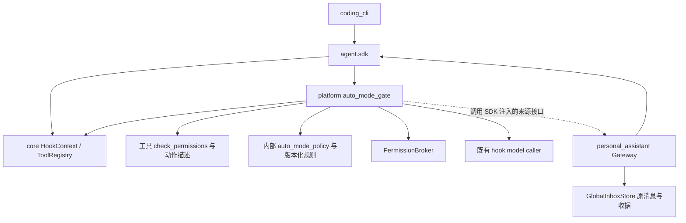
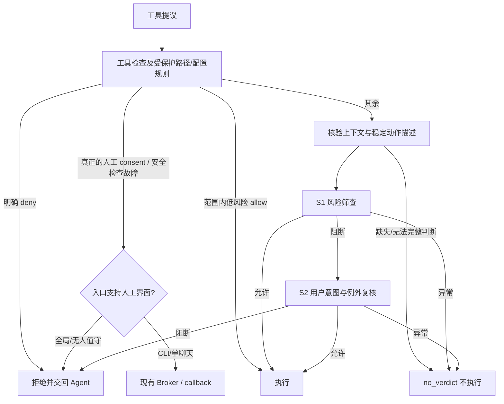
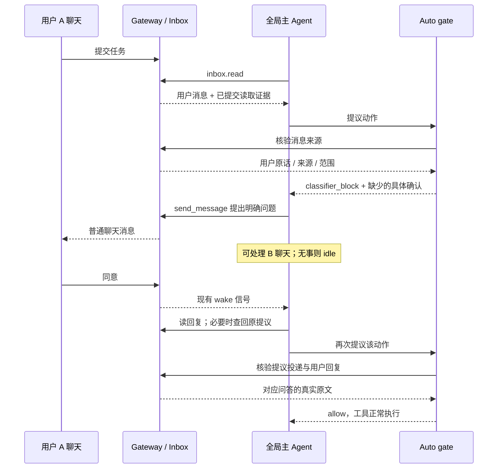

# feat-552: Auto 权限机制迁移与全局模式主动确认 — 技术方案

> 对齐: [spec.md](spec.md) v1。2026-09-11，用户授权独立完成设计；本方案待用户 review，未实施。
> Unit branch: `codex/feat-552` (will be created by orchestrator)

## 架构总览

**统一升级自动审批；让它认出真实用户的请求和确认。全局模式被拒绝后立即把原因交回主 Agent，由它在普通聊天里继续处理。**

用户最先会看到三点变化：常规本地开发和内置定时任务少被误拒；“请做这个”或对明确问题回答“同意”可以成为有效授权；等某人回复时，整个全局 Agent 不必停下来。

完整审批链保留在现有 `auto_mode_gate`，它继续调用工具自己的权限检查和现有 LLM 调用入口。把大段版本化策略从 hook 移到内部策略 module；把聊天来源核验留给拥有原记录的 Gateway，通过 `agent.sdk` 注入。PermissionBroker 继续处理需要人工界面的入口，不负责全局聊天事项的调度。



实线为 import/装配依赖，虚线是注入的运行时回调，不是 platform import 产品包。没有新权限服务、消息队列、确认卡片或前端组件。

## Changelog

## 现状分析

### 涉及范围

代码基线：远端 main `717348738`（含 PR #287），主要用现存 `b35ed739e` worktree 核对全局路径；非全局共享文件与主 checkout 对照。上游基线和原始请求见 [evidence/README.md](evidence/README.md)。

| 当前落点 | 实际行为 | 本次处置 |
|---|---|---|
| `src/agent/platform/hooks/builtins/auto_mode_gate.py` | 旧 BASE_PROMPT 含 Network Services；S1/S2 已有独立 suffix，64/4096；调用 get_tool_approval_model。普通 assistant prose 不进审批记录；Inbox 用户被写在 Tool result 名下 | 改策略组装、来源投影、分类结果与 Auto 路由；不另造 PermissionPolicyEngine |
| `src/agent/platform/config/auto_mode.py` | workspace 字段覆盖 global；allow/soft_deny/environment 有值即替换默认；无 hard_deny/$defaults | 明确可信配置来源与升级语义 |
| `src/agent/platform/permissions/broker.py` | pending Future、session tool allowlist；拒绝计数按 run_id/tool_name；阈值跳过分类器直接 ask | 保留人工请求；Auto 计数改为根 session，产品选择交互路径 |
| `src/agent/platform/tools/builtins/bash.py`、`bash_policy.py`、write/edit/web_fetch 等 | 已有工具级决策和动作描述；Bash 是 shlex/有限命令策略，不是 CC 完整 AST 或 OS sandbox | 复用保守路径，修正 Auto 中优先级；不声称拥有沙箱 |
| `src/agent/core/hooks/context.py`、`core/agent/loop.py`、`core/tools/registry.py`、`core/agent/tool_executor.py`、`src/agent/sdk/kernel.py` | 当前 LLM history 进入 HookContext；工具拒绝带 denied，但原因来源未形成稳定完整分类；SDK 装配 broker/model caller | 增加小型来源接口与可观察决策来源；core 只传类型和数据 |
| `src/agent/platform/tools/builtins/agent.py`、`platform/background_tasks/runtime_runner.py` | agent 工具整体在 SAFE_TOOL_ALLOWLIST；子工具集合/skills 已受父集合限制，模型继承；委派 prompt 以 user role 发给 child | 委派先审，继承 Auto 上下文；委派文本不能冒充人工同意 |
| `src/personal_assistant/tools/inbox.py`、`conversations.py` | Inbox 已将收到的 user/external 消息做 result projection；历史查询不赋予授权；当前投影只解析工具结果 JSON | 用 Gateway 的原记录核验来源，支持历史原文恢复 |
| `src/personal_assistant/gateway/global_inbox.py`、`global_work.py` | Gateway 本地 SQLite 保存消息、读取收据和工作事件；Inbox 消费基于 SDK committed proof | 复用可信原件、收据与 work_events，补查询/发出消息的核验记录；不建待审批事项数据库 |
| `gateway/composition.py`、`global_run_coordinator.py`、`personal_assistant/product.py` | 全局运行由 pa_work_scope=global_main 标识；新信号/独立事项已有推进机制 | 装配 return_to_agent 路由和主 Agent 指导；不让权限 Future 占住全局运行 |
| `personal_assistant/tools/send_message.py`、`cron.py` | send_message 整体被安全表放行且尚无稳定审批动作描述；cron 已有动作投影与只读检查 | 消息按收件人与内容审，内置 Cron 采用明确产品例外 |

**已证实误拒绝**：`sess_492f06fa9eea990f` 的实际两阶段请求都含“请创建一个一次性 cron 任务”，S2 仍以“不可信 Inbox”拒绝。不是缺原话，而是来源语义错误。既有 13 个 projection/Inbox 协议测试通过，只证明形状，没证明确认闭环。

### 既有约束

另有直接影响迁移的快速路径缺口：Bash 当前把 `git config`、`git branch`、`git tag`、`git remote` 当作整前缀只读；但这些命令也有写操作。现有 prefix 注释不能当安全证明。D2 收紧这一明确缺口，否则更新后的分类器仍看不到这些动作。

产品仅 import `agent.sdk`；core 不 import platform；IM 不调用 agent。worktree E2E 隔离端口、节点、配置、数据和 workspace。新的用户行为只写本 unit delta，实施完成后再归并 current spec。CLI/单聊天的人工审批入口与取消语义保留。

契约核对发现一处已有描述过宽：`docs/specs/kernel/runs.md` 说“内核不内置权限策略”，但 SDK 实际装配 platform 内置 Auto hook，仅人工许可阶段交给 `can_use_tool`/broker。这句话将在本单元 delta 中精确化，不另建第二个消费者权限裁决器。`sdk-boundary.md` 当前允许 workspace Auto 覆盖，本方案明确改变该语义并提供迁移。

### 可复用能力

- **用**：HookContext/model caller、PermissionDecision/decision_reason、工具动作描述、tool result 提交事件、Gateway 原始收据、全局 wake/Inbox/history/send_message、子任务 parent_session_id 与工具白名单。
- **改**：安全工具表、配置合并、审批 transcript、拒绝原因投递、Broker 计数；共享代码仍在 platform。
- **不用**：研究提案的大型 PermissionPolicyEngine；单为确认建立新 action service、持久化 pending 状态或独立调度器。这里真实变化的 seam 是 SDK 的“产品可核验消息来源”接口，CLI 原生 transcript 与 PA 多聊天来源是两个实际不同的 adapter。

### 相关历史

feat-539 的迁移需求并入本单元；旧草稿保留来源，不再独立实施。feat-546 提供全局会话、Inbox 原件/收据、显式发送和工作记录；bugfix-355 的工具自检/安全检查不可被宽许可短路；feat-394 的无人值守路径用于 Cron；feat-474 的子任务工具与技能约束继续有效。上述历史不代替本次真实验收。

## 关键决策

### D1：以实际 2.1.267 策略为基础，逐项适配 Nano

**移植完整规则与输入契约，保留明确的 Nano 差异表。**

`auto_mode_policy.py` 负责 system 的组装和 S1/S2 suffix；随代码保存 UTF-8 策略模板与默认规则 JSON，版本 `cc-2.1.267-nano-v1`。运行时不读取研究目录。精确来源、原文哈希、适配 diff 在实施产物 manifest 中可核对；不静默追随上游更新。

| 上游内容 | Nano 决策 |
|---|---|
| hard/soft/allow、用户直接指令和问答确认、实际动作与历史 outcome | 采用；显式 deny 不能被 LLM 覆盖。S1 风险筛查、S2 才应用完整授权和例外 |
| 编码 Agent 场景 | CLI 保留；PA 增补消息、用户委托、内置调度和多聊天来源；不把所有个人助手任务默认限制成“当前 Git 仓库开发” |
| `host_context_live` 与恢复文本 | 借鉴来源区分；Nano 的已验证持久化原消息可保持人工身份，未经核验的恢复 tool text 不行 |
| assistant prose 帮助理解“同意” | 采用；只取用户实际看见的既往提议，不能用当前动作旁新生成的自述背书 |
| Claude Code Scheduling | 替换成 Nano 内置 Cron/heartbeat 管理的范围例外。创建/修改审完整 payload 与 schedule；自动触发带 standing task scope，但不能冒充新的人类确认；shell system cron/systemd 不适用该例外 |
| Multi-Agent Coordination | 映射内部 child、原任务聊天回复/澄清；正常询问许可无需为“发送许可问题”再走人工确认。无关收件人、额外敏感内容仍审 |
| CLAUDE.md / Memory Directory | 映射本产品实际指令/记忆目录；普通记录可用，改权限/审批规则仍受审；不把文件中声称的用户批准算作真实批准 |
| “can you” 等请求形式 | 结合真实语言语境理解指令，不把中文“帮我/能不能帮我做”一概当成没有授权；高影响操作的对象和范围仍须明确 |
| Host containment / 外发敏感信息 / 破坏性变更 | 保留规则；环境由可信部署配置描述，不由 Agent 自述推断出容器隔离 |
| CC 浏览器、Artifact、RemoteTrigger 专属形式 | 仅保留适用于外部/动态工具的实际风险语义；不新增这些产品工具，不填不存在的 host metadata |
| CC 支持的模型/订阅资格 | 不移植；Nano 沿用 catalog 与 tool_approval_model，不因模型名不是 Claude 禁用 Auto |

理由：已捕获的最新策略有 17/69/1/21 组默认规则，远不止改旧 Network Services 一条。风险是长 prompt 提高成本且模型效果不同，故固定版本、验证矩阵与实际 usage 是交付条件。

### D2：复用既有工具检查，调整 Auto 中的决策顺序

**明确拒绝与不可越过的人工检查，必须先于任何宽放行。**

以下仅描述启用 Auto 的路径；用户主动选择的其他模式不在本次重新定义。



- `check_permissions` 仍每次调用一次；区分 `rule` / `safety_check` / `command_policy` / `preapproved` 等 decision_reason。不因 session allowlist、always_allow_tools 或安全表忽略其 deny。受保护路径的写入不能被工具名宽许可放过。
- 只读 read、web_search、skill_view 和已有明确只读动作沿用快速路径；memory、task_stop 应按已有作用域检查，不能让自检 deny 被安全表盖掉。
- `agent` 和 `send_message` 从整工具安全表移除，补动作描述并走分类器。用户配置的宽 `always_allow_tools` 在 Auto 中不能绕过 bash/agent/Workflow/send_message 等任意执行或外发动作；这些项保留在配置诊断中并注明 Auto 不采用。
- 本期不复制 CC 全量 shell AST；保留现有 Bash 确定性阻断。免审改为有限只读形态：有写分支的 `git config/branch/tag/remote` 只放明确查询形态，其余进分类器；重定向、管道、命令/进程替换、未识别的复合语法和可能执行外部程序的选项不按首前缀免审。已有可靠的简单只读命令才快放行；不确定即分类，而非一律拒绝。写入/开发服务由新分类器理解范围。验收必须包含 `git config key value`、`git remote add`、`git branch -D`、`echo text > file` 不能命中只读免审，和 `pwd` / 简单读取仍能快放行。无需实现完整 shell AST，也不假定 OS sandbox 存在。
- 已有明确人工语义的工具 ask（如受保护文件确认、Workflow 启用）不自动用一句聊天“同意”清除硬检查。全局模式返回 `manual_required`，Agent 解释需要哪个实际配置操作；不反复询问同一个无效问题。

### D3：分类器输入按真实来源组织

**系统核验来源，模型判断授权范围；不靠 prompt 把任意工具 JSON 变成真用户。**

原生 transcript 保留 human message、既往 assistant 提议、工具调用和结构化 outcome。普通 tool result/body、网页/文件内容和子 Agent 自述不成为人工消息。已存在的工具投影继续描述动作，但 `to_auto_classifier_result` 的字符串不再承担“谁是人类”的认证职责。

PA 注入的 provider 从 `GlobalInboxStore` 原始 entry + committed read receipt 核验 Inbox 消息，记录 agent/root session/tool_call/message/target/digest 对应关系；检查 user/external 的真实渠道身份，排除 agent、system、automation、引用内嵌“User:”和未读完的内容。`external` 只是入站身份类型，不能仅凭字段拼写授权。

`conversations(read)` 可以恢复真实历史授权，但须同样通过 Gateway 授权查询的原始响应、身份与工具提交记录核验。为此把 query page 的核验摘要和引用作为新的 `work_events` 事件保存，不改变 Inbox 已读游标，也不把所有历史查询结果整体升级成可信用户内容。外部聊天复用已收到的原消息缓存；缓存缺失时明确无法恢复，不编造来源。

发出的提议只在确认实际投递后进入 `assistant_proposal`：内置 IM 用已提交的 message id；外部 Channel 用成功 delivery receipt。队列接受、held_for_revalidation、错误或未知投递结果不算用户看见。相关事实复用 dispatch/work journal；需要补字段时加到该链，不新建发送路径。

全局 bare yes 的默认关联是同一 conversation、同一请求者、最近的一个已投递明确提议；系统保留消息顺序，模型仍判断语义。明确回复引用可跨插入消息定位；另一聊天的回答必须自己写清操作与范围或有可验证 reply_to，不靠全局时间邻近。其他群成员的答复不能代替原请求者，除非已有明确授权关系。一个提议有多个无优先级选项时，裸“同意”不自动全选。

### D4：无卡片，也无需新待审批状态机

**全局拒绝立即返回；原事项保留在现有消息与工作记录中。**

SDK 注入接口为当前 root session 决定 `interaction=return_to_agent` 或 `interactive`；该值来自应用拥有的会话绑定，不能让模型工具参数自行指定。global_main 和其 child 继承 return_to_agent，不能用 HUMAN origin 推断应该弹窗；全局运行当前正是 HUMAN。

主 Agent 指导增加：拒绝后先看原因，合法替代可继续；缺授权时向正确用户说明具体操作和关键范围；询问成功后继续其他独立工作，无事则结束本轮进入现有 idle。不得把待确认工具挂为 permission Future，不提前执行，不自动重放工具。用户新消息由既有 wake/Inbox 流程唤醒，主 Agent 恢复任务后重新提议并再次审批。

压缩/重启时不从摘要提取“已批准”直接放行。主 Agent 读入新回复后，若看不见原提议，先用现有 `conversations(read)` 查回；Gateway 核验原始记录后重新提供问答。找不到原文、原问题投递未确认或只能读到半条时，返回上下文不足并让 Agent 澄清。这个设计保持收件人选择在 Agent，来源真实性在应用。

### D5：分清策略拒绝、人工要求和审核失败

**只把有效策略拒绝计入拒绝次数；服务失败不能变成“用户没授权”。**

| 结果来源 | 是否执行 | 计普通拒绝数 | 全局/无人值守 | CLI/单聊天 |
|---|---|---|---|---|
| 有效 allow / fast path | 是 | 重置连续数，不清总数 | 返回结果 | 返回结果 |
| classifier_block | 否 | 是 | 原因交回 Agent | 阈值前交回，触发后现有人工入口 |
| explicit_deny / user_denied | 否 | 否 | 明确拒绝 | 明确拒绝 |
| manual_required | 仅真实人工入口批准后 | 否 | 不 park，交回并说明入口要求 | 现有 Broker/callback |
| classifier_unavailable / parsing_error / context_incomplete | 否 | 否 | no_verdict，允许解释/正常重试，不自动放行 | 既有 fail-closed 人工路径；明确故障原因 |

Broker 中 Auto 计数改为**根 session**，连续 3、总计 20；成功工具动作重置连续值，总数只在触发总阈值后重置。有效判定和重置在同一锁内。父子任务归同一计数根，避免换工具/换 child 绕计数；取消或关闭 session 清理对应状态。现有 `deny_limit` 迁移为连续阈值；新增 `total_deny_limit=20`。

CLI/单聊天达到阈值后在当前根 session 暂停需要分类器的 Auto 动作，低风险确定性 fast path 仍可用；使用现有 allow_once/deny 等选项，不增加按钮。人工批准后解除暂停，当前动作只执行一次；拒绝不自动恢复，后续动作仍可通过原人工入口批准并恢复。请求原因说明本次批准会恢复 Auto。全局/无人值守只记次数用于诊断，**不设置跳过分类器的暂停锁**，所以后续真实确认一定能再次进入分类器。

Auto 的 no-verdict、硬拒绝、次数阈值均不能经 `unattended_fallback=allow` 放行。此旧配置值在 Auto 迁移时给出错误说明，要求改为 deny；不静默采用。显式 bypass 开关不在这一语义内，但安全锁仍按既有契约执行。

### D6：保留多模型路由，采用可验证的两阶段参数

**默认采用捕获的 2112/10240 与阶段 suffix；用 Nano 已选审批模型运行，不增加隐式模型回退。**

S1 无 thinking、stop `</block>`，block 才进入 S2；S2 无 stop，用提示词允许内部思考后返回 XML。解析明确区分 `<block>yes/no</block>`、category、reason；任何没有有效判定的输出为 no_verdict。不能用解析失败兜底 allow，也不能丢掉 S1 block 就执行。

实际模型能力由 catalog/provider 处理；选定模型 C 失败不能偷偷改成主模型 A。本轮 CC 捕获的 Terra 参数是实现基线；Nano 验收还要覆盖生产使用的审批模型。保留既有 provider 重试框架，不叠加 hook 无限重试。请求记录 policy_version、stage、model、输入大小、用量、耗时和 decision_source；不新增用户可见调试 UI。

transcript 预算按所选模型 context 减去 system+工具描述+输出预算计算。按完整事件组保留：当前动作必留，已选用户指令/确认必须与提议成对；压缩摘要不是原始授权。不能悄悄截断关键内容后猜判，容纳不下返回 context_incomplete，让 Agent 缩小动作或查回更窄的原文。

### D7：配置只能来自应用控制的根，升级有明确说明

**默认规则可版本化；仓库内容不能自行改写自己的审批政策。**

保持 `auto_mode` 的现有 snake_case 键。新增 `hard_deny`、`total_deny_limit`；规则数组省略或旧式空数组表示使用默认，非空数组表示替换该类，`$defaults` 在所在位置展开为本版本完整默认列表；多个 `$defaults` 报错。沿用旧式空数组含义，本期不新增显式清空整类规则的配置形式。managed 组织层本项目不存在，不新增。

`global_config_root` 为 SDK 消费者显式提供的、应用控制的配置根；CLI 使用自身用户目录，PA 使用部署根。workspace 的 `auto_mode` 不再作为有效策略来源；发现非空旧配置时，在首次 Auto 决策加载配置处返回明确迁移配置错误并阻止动作，避免忽略旧 soft_deny 等限制反而放宽策略。诊断只列出待迁移的键和迁移目的路径，**不打印规则内容或 secret**；不自动移动文件。本期不复制 CC 配置 UI 或 `auto-mode critique` 命令。

`.nano/policy.toml` 的既有 Bash 覆盖同样不能在 Auto 中降低默认阻断：workspace blocked 列表只能增加、不能替换删除；workspace allow_prefixes 不构成 Auto 免审依据。保留现有其他模式的兼容语义。应用根提供的有限允许仍须经过 D2 的不可覆盖 deny/安全检查。

迁移清单随实现提供，逐一列出现用配置旧值→有效新值：enabled、skip、always_allow_tools、deny_limit、ask_timeout_sec、unattended_fallback、allow/soft_deny/environment、web_fetch、Bash policy。存在非空旧 workspace auto_mode 而尚未迁移时，不执行 Auto 动作并报告迁移位置；用户显式迁移至可信根并清除旧项后恢复。无旧项或空映射仍使用默认策略，不能悄悄启用旧 workspace 放宽规则。对当前全局根缺省配置的使用者无需新增必填配置。

### D8：子任务与发消息不能成为绕过路径

**审委派和子任务动作；结果本身保持非人类来源。**

`agent` 的新派发与 follow-up 都投影 description、完整 prompt、child id/类型、有效能力范围；先审后启动/入队。child 使用父 root session 的有效 Auto 配置、审批模型与交互策略；保留工具/skills 交集，child 不能用本地 frontmatter/配置放宽。parent 提供的委派文本和补充消息标记为 agent_delegation，即使主模型协议用 user role，也不产生新人工授权。仅显式继承的已验证用户事实可供 child 审批使用。

本期**不额外复制 CC 的完成后第三次 LLM 安全审查**：Nano 已把 child output 作为不可信内容交回，后续有副作用动作仍逐次审核。增加第三次审核会改变完成延迟且不是解决本次误拒的必要条件；结果不能带“用户已经批准”来获取 authority，这一反例必须测。对照表明确这一不采用项，不能宣传逐分支复刻 CC。

`send_message` 在既有发送链之前审核 target、完整 text、真实 task origin 与收件对象类型；普通发起聊天的回复/询问可按产品例外允许。全局聊天路由、群发言复核和 delivery idempotency 不改。转发给无关目标或携带新增敏感材料不靠“协作消息”例外通行。`cron` 不直接白名单：读操作仍快速允许，新增/修改动作看 schedule/payload/owner scope。

## 接口与数据流

### SDK 小接口与内部结果

以下为实施契约，不把所有内部类型暴露给产品：

| 接口/类型 | 所属与调用方 | 内容和约束 |
|---|---|---|
| `build_kernel(approval_context_provider=None)` | SDK 可选扩展，CLI 默认不传；PA composition 注入 | 异步 provider；无 provider 时仅使用内核原生来源，不能把普通工具字符串当人类 |
| `ApprovalContextRequest` | core 类型，SDK re-export，gate 构造 | session_id、root_session_id、当前 tool_call_id/name/input、当前 history 中的工具调用引用；标识从 runtime 获取，不采信工具 args 自报 |
| `ApprovalContext` | core 类型，SDK re-export，provider 返回 | interaction、经核验的 events、task_origin/standing_scope、完整性状态。只能说明事实，不返回 allow/deny |
| `ApprovalConversationEvent` | core 类型，SDK re-export | event_id、conversation_id、sender_id/type、role（human/assistant_proposal/automation/agent_delegation）、text、source_message_id、reply_to、source sequence、complete；原始记录标识不能由正文替代 |
| context 的注入 | SDK→HookContext；core loop 保持能力传递 | 一次分类前获取一次不可变快照，S1/S2 使用同一份。按根 session 解析 child，跨 root 不共享 |
| 内部 classifier decision | platform，继续用 PermissionDecision | behavior + decision_reason 中的 source/category/policy_version；no_verdict 的 source 独立，原始异常不作为用户同意不足 |
| hook→tool result | core registry/tool_executor 透传 | 保留 `reason_code=denied` 的既有消费者兼容，同时附 `approval_source` 和可读 reason，持久化后可形成 outcome；不暴露分析思维文本 |

三个公开 DTO `ApprovalContextRequest`、`ApprovalContext`、`ApprovalConversationEvent` 均定义于 `src/agent/core/hooks/approval_context.py`，由 `agent.sdk` 根包 re-export，明确新增到 SDK 精确表面与所有权豁免名单；不创建 SDK wrapper，也不让 core import SDK。provider 使用 Callable 注解，不新增公开类型别名。M1 同步修改 `tests/contract/test_agent_sdk_surface_guard.py` 的 EXPECTED_SURFACE、_OWNERSHIP_EXEMPT 并钉死三个 owner 路径；运行该守卫与 `tests/contract/test_agent_sdk_boundary_contract.py`。

PA provider 只核验当前 history 引用的 Inbox/查询/已发送事件及其直接关联问答，不扫描所有聊天把无关授权灌进每次审批。根请求范围可以显式跨聊天，但确认映射仍遵守 D3。完整性错误返回 no_verdict；无需环境信息的确定性只读快放行不为 provider 不可用停摆。



### 测试 seam

纯规则组装/计数/关联投影通过现有 hook interface 测行为；Gateway provider 用真实 SQLite 和现有协议适配器测试，跨 SDK 注入验收到最终 tool result。LLM 是真实外部依赖：确定性契约测试可用固定响应，但不能代替真模型验收。保留原模型 caller seam，不再加第二套 LLM client。替换失效的旧 prompt/短 token/安全白名单快照，保留仍有价值的行为回归，避免新旧浅测试重复维护。

## 风险与回退

- **误拒仍可能存在**：模型不是规则解释器。固定正反例与真实确认旅程是门槛，不能只因新 prompt 更长就验收。对 hard boundary 的拒绝不算误拒。
- **确认指代错误**：按来源/原用户/聊天/投递和原文绑定；语义不清时查回或澄清。主 Agent 决定跨聊天的路由，分类器不通过简单全局最近邻认“同意”。
- **长记录与恢复**：仅给当前引用及直接关联原文；预算不足不猜判。已有 Inbox/工作记录是持久化来源，不另维护两套 pending 状态。
- **消息被拦后无法询问**：正常原任务聊天的安全回复属于明确 allow 例外。询问本身含不应外发的材料时，Agent 应缩减为必要说明；不得给所有发送加豁免。
- **配置兼容**：停用 workspace 放宽项可能使旧部署更保守；升级报告和显式迁移先于部署。不得为兼容保留隐蔽旧 classifier fallback。
- **并发与切换**：每次 classifier 固定 context/config 版本；执行前版本若已变，旧结果不沿用，交回后重新提议。Broker 根计数原子更新；不靠低成本工具刷计数来跳过 hard deny。
- **回退**：实现部署前备份应用控制的权限配置，Gateway 数据仅追加事件类型，无破坏性 schema 迁移。若要回退，停止本 unit 的进程、回到实施前版本并恢复同份旧配置，再启动原版本；未知 work_events 由旧 reader 忽略。回退动作须另外授权，不自动降回已知误拒的旧策略。没有运行时双分类器或静默新旧切换。

## Milestones

两个串行的垂直交付：共享 Auto 迁移（CLI/单聊天可验证）和全局自然确认闭环。预估共享部分含策略资产约 20 文件、代码与行为测试 900–1300 行；全局部分约 12 文件、600–900 行，超出单 worker 窗口门槛。不能按“类型→接口→测试”横切拆分。

| ID | 标题 | 依赖 | 并行组 | 范围 | 退出标准 |
|---|---|---|---|---|---|
| feat-552-M1 | shared-auto-migration | — | A | platform hook/policy/config/broker、Bash/tool checks、agent/RuntimeRunner、core hooks/registry/tool_executor、SDK、CLI/PA 非全局装配及相关测试 | [reviewer] R1 日常开发、R5 CLI/单聊天人工入口、R6 主/子任务同范围生效；[worker] D1/D2/D5/D6/D7/D8 的矩阵通过，可信 context provider seam 可用，真实 S1/S2 和 no-verdict 不执行有证据 |
| feat-552-M2 | global-chat-confirmation | M1 | B | PA Inbox/conversations/send_message/cron、Gateway global_inbox/global_work/composition/global coordinator、PA product prompt；必要 SDK 接口集成与测试 | [reviewer] R1 内置 Cron、R2–R4 全部场景、R5 全局多次拒绝/故障、R6 正常沟通与迁移；[worker] D3/D4 来源闭环、消息投递和恢复、旧 Cron 反例真模型复测通过 |

M1 为可独立验收的共同机制升级，但整个 unit 的 PR 交付须等待 M2；不把 M1 提前部署给全局用户。两组可能改同一 SDK 集成处，故明确串行，不派并行 worker。骨架只含 `.gitkeep`。

## Runbook for Reviewer

### 资源与启动

设计阶段未启动 Nano 服务。实施验收用真实 IM + Gateway + Kernel + 指定 LLM；本单元不改客户端 UI，可经前端使用的同一 IM HTTP 接口驱动原用户消息，最后查看聊天的实际公开消息。CLI 交互须真 PTY 走现有入口。可用资源：仓库自带隔离账号和两个 E2E Agent、真实本地代理 Sol/Terra/Luna（三条 CC 探针已实际完成）。不要求生产群或真实第三方外发。

在**实施 worktree 根目录**执行（仅该 worktree，自身启动的进程自身清理）：

```bash
cp config/e2e/gateway.yaml /tmp/feat552-review-gateway.yaml
.venv/bin/python - <<'PY'
import yaml
from pathlib import Path
p = Path('/tmp/feat552-review-gateway.yaml')
c = yaml.safe_load(p.read_text())
c['agents'][0]['work_mode'] = 'global'
c['agents'][0]['default_model'] = 'codexOAuth:gpt-5.6-sol'
c['agents'][0]['features']['cron_scheduling'] = True
c['agents'][1]['default_model'] = 'codexOAuth:gpt-5.6-sol'
c['llm']['default_model'] = 'codexOAuth:gpt-5.6-sol'
c['llm']['tool_approval_model'] = 'codexOAuth:gpt-5.6-terra'
p.write_text(yaml.safe_dump(c, allow_unicode=True, sort_keys=False))
PY
./scripts/e2e-up.sh --main-config /tmp/feat552-review-gateway.yaml
source .e2e-ports.env
curl -fsS "$IM_URL/openapi.json" > /dev/null
./scripts/e2e-down.sh
```

最后一条是**验收完成后的停止命令**，不可紧接启动就结束旅程。e2e-up 自行分配端口、隔离节点/数据/workspace、注册登录账号、等待 IM 和 Gateway ready；`.e2e-ports.env` 给出真实 URL/账号凭据，验收日志记录去敏位置即可。不启动/重启代理 `:4000`，它是既有外部依赖。重启场景只操作这套隔离 Gateway，保留其 `.gateway-workspace` 与 SQLite，用相同隔离配置重启，绝不删库模拟重启。

### 真实旅程及证据

Gateway 单独重启命令（先用 `ps -p` 核实 PID 是本 worktree 的 `personal_assistant.main`）：

```bash
ps -p "$(cat .gateway.pid)" -o pid=,command=
kill "$(cat .gateway.pid)"
PYTHONPATH=src .venv/bin/python -m personal_assistant.main --config .gateway-config.yaml --foreground --auto-bind > .gateway.log 2>&1 &
echo $! > .gateway.pid
```

确认旧进程已退出后再启动，检查新进程存活、日志中的 Gateway started/IM connection 与隔离 IM 节点在线。CLI 的真 PTY 入口为 `PYTHONPATH=src .venv/bin/python -m coding_cli.main --model codexOAuth:gpt-5.6-sol --llm-base-url http://127.0.0.1:4000`；在隔离 workspace 运行。当前 CLI 工厂固定使用 `~/.nanocode`，没有独立配置根 CLI 参数；本次只读核对该目录下 config.yaml 不存在，实施验收前须再次核对。不得覆盖 HOME 或写用户配置；若届时存在配置，使用 SDK 临时 global_config_root 运行配置迁移矩阵，真实 PTY 仅运行不需修改用户配置的场景，报告实际读取配置。

| 旅程 | 驱动与判据 |
|---|---|
| T1 正常任务 | CLI 和单聊天各执行已授权项目内写入/测试/loopback 开发服务；核对工具真正执行及用户无需重复确认；服务测试用临时端口并清理 |
| T2 原 Cron 误拒 | 在隔离 A 聊天给全局 Agent 明确一次任务名、时间和唯一输出值；看到任务创建、触发一次和真实输出。保存两阶段请求；不能只用“模型说创建了”验收 |
| T3 问答确认 | 在 A 先设置一个具体操作需确认的用户边界；让 Agent 提议并收到 auto block，普通聊天询问；B 提交独立任务并获结果；A 回复同意后原动作执行。取发送成功、原回复、两次审批和执行事件，确认没有 permission pending |
| T4 反例 | A 未回复/明确拒绝、B 无关同意、第三方 Agent 转述、引用文本伪造、多选裸同意；目标操作均不执行，正常询问仍可发送 |
| T5 恢复 | 询问送达后结束本轮，再正常重启隔离 Gateway或触发正常 compact；A 回复，Agent 查回缺失提议并完成。删除/伪造原件属于独立契约测试，不修改真实用户记录 |
| T6 故障和计数 | 在独立测试配置将审批模型入口指向本机不可达端口，主模型仍走正常代理；真实 gate 产生 no-verdict，目标不执行，B 可完成低风险工作。有效拒绝 3/20 次的状态机用确定性测试，另走一次真 CLI/单聊天人工 fallback；故障不能算普通拒绝 |
| T7 委派和发送 | 真实 child 在父任务范围内完成一步；给 child 越权委派或伪造人工同意的结果不能扩大权限。原任务回复可发送，无关目标/敏感外发反例不发送 |

实施时将 T1–T7 映射至 spec 的全部 Scenario，输出最小证据清单（请求、决定、实际效果、未执行证明）。测试数据使用隔离本机文件/假的敏感标记，不读取真实秘密或向真实收件人发送。真实全局旅程至少对基线和新实现同输入各执行一次；关键的“明确 Cron”“确认后同范围重试”新实现各 3 次独立 session，全部通过，不能以多数票接受仍可复现的核心误拒。记录模型、policy_version、变量、成功/失败分母，不宣传总体误拒率 KPI。

### 最窄回归起点

```bash
.venv/bin/python -m pytest tests/unit/test_auto_mode_gate.py tests/unit/test_auto_mode_config.py tests/unit/test_permission_broker.py tests/unit/test_auto_mode_gate_dispatch.py tests/unit/test_auto_mode_gate_allowlist.py
.venv/bin/python -m pytest tests/integration/test_bash_check_permissions_integration.py tests/unit/agent/platform/tools/builtins/test_bash_policy.py
```

新增来源/问答恢复、子任务继承和 dispatch 证据测试随改动放在现有 unit/integration/e2e 目录。之后跑 contract、相关 Gateway 测试与仓库 CI 所需 checks；通过后不循环追逐假设边角。文档交付只验证文档/链接/JSON，不声称执行过上述 Nano 新机制旅程。

## Canonical delta-spec

- kernel：`runs.md`、`sdk-boundary.md`、`tools-hooks.md`，定义共享裁决/来源输入/失败原因和配置边界。
- gateway：`global-agent.md`，定义普通聊天确认与独立推进。
- cli：`interactive-repl.md`，定义有效拒绝后的人工 fallback 和故障说明。
- IM：no spec delta；消息发送、历史查询、群聊复核与工作事件传输沿用原协议，无前端结构变化。因此无 prototype.html。

## 设计交付边界

本设计已纳入用户所有已确认需求及独立设计授权。CC 取证只是设计输入；实现、Nano 真实验收、配置迁移执行、PR 合并和双节点部署均未发生。独立设计审查记录另存 [design-review.md](design-review.md)；其结论不替代用户醒来后的 review。
