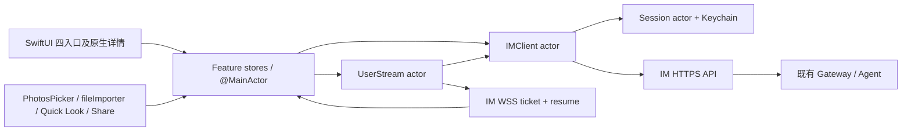

# feat-578: 完整原生 iOS App — 技术方案

> 对齐 [spec.md](spec.md)，用户已确认完整原生与首版 Web 全量管理。
> 状态：原技术方案 Gate 2 Round 2 已通过。2026-10-05 用户否定实际 UI/UX，视觉与交互设计重新打开；本轮视觉修订待独立复审。先完成 App 与模拟器，再安排真机的顺序不变。

## Changelog

- 2026-10-05：用户查看实际登录和聊天页后明确反馈“UI UX完全没有做设计吗”“我原本的Web好歹还稍微有点设计”。暂停功能验收，重新落实 Web 视觉继承与手机信息密度。此前结构/语义对齐不构成视觉通过。修订原型和 P6 视觉门槛，不改功能范围、原生技术路线、权限、API 或安装路线。

## 现状分析

### 涉及范围

基线 `ae625313c`（产品代码同 `e6a5c0ea5`）。新增独立 `src/IM/ios/` Xcode project、Swift sources/tests、构建脚本和安装运维文档；归并时更新 IM spec 入口、docs 地图与相关开发/运维入口。iOS 是 IM 的 HTTP/WS 客户端，不成为第五个 Python 运行服务。

Web 装配入口 `src/IM/frontend/src/app/router.tsx`；四个移动入口来自 `app/shell/app-shell.tsx`。完整源代码/操作映射见 [coverage.md](coverage.md)。当前 Web 全量功能均在 M1，不将通道、节点、公司或策略移到下一版本。

### 既有约束

遵守 AGENTS 的包边界：App 不 import/调用 Python agent，不直连 Gateway 文件或内部 RPC，不携带 IM 服务器签名密钥。只经 IM 公共 API，由服务器执行成员/owner/admin 检查。保留主 checkout 其他 dirty 文件，Gate 2 后由 simple orchestrator 创建独立 unit worktree，使用 `codex/feat-578-ios-app` 分支。

免费签名、当前 Mac 构建、Mini 续签、真机不争用和后台能力限制是已确认条件。新项目只有一个 iPhone App target，不申请 push、associated-domains、app-group 或后台常驻能力；不增加 extension 消耗额外 App ID。

### 可复用能力

| 能力 | 用法与边界 |
|---|---|
| `api/routes/auth.py` 程序 token pair | 直接复用，不发送 `X-IM-Session: browser`，不复制 Safari Cookie |
| `app.py` `/im/ws/user`、`ws/user_stream.py` | 复用 ticket、Origin 校验、resume/event/resync；URLRequest 显式加所选 IM origin，不放宽后端检查 |
| `web_im.py`、`messages.py`、`message_images.py` | 复用聊天、成员、typed timeline、上传与资源权限、caller idempotency；原生实现视图与状态 |
| `agents.py`、`nodes.py`、`agent_work.py`、`agent_channels.py` | 复用能力目录、配置 apply、Work、通道 desired/observed/removal；Swift DTO 与 reducer 独立实现 |
| `task_graphs.py`、`company.py`、`policies.py` | 复用读图、准入、策略/容量，客户端不引入新权限或图写入路径 |
| Web TypeScript | 作为 wire/行为对照，不运行于 App；不建立通用多端 UI schema 或脚本桥 |

### 相关历史与漂移

feat-554/572 定义公司准入、公开联系人与管理边界；feat-569 定义任务图；bugfix-574 定义备用模型。bugfix-577 正修改 Web viewport，本 unit 不改其文件，也不依赖用其 Web UI 达成原生验收。

`agents-nodes.md` 旧 cron prose 写 `/cron-jobs`，实际 route 与 Web 调用均为 `/cron/jobs`，后者作为 wire 路径；归并阶段对旧 prose做最窄纠正。Agent `sessions` 页目前是 `PrototypePlaceholder`，完整覆盖不意味着发明会话管理 API：原生保留等义“暂无独立会话管理，工作记录见 Work”的说明。`getAgentSkillsUsage` 离线实际返回 503；不能把它当无 Skills。Cron 空数组本身不区分离线/无任务，结合节点状态明确“离线时结果不可确认”，不从空数组推断成功读取。

## 架构总览

只添加一个独立客户端。共享网络会话、事件恢复与媒体读取，功能 store 持有自己的视图状态；不按每个 endpoint 建一层 service/repository。内部 URLSession transport seam 用于请求和断线测试，生产统一使用系统 URLSession。

## 关键决策

1. **SwiftUI + 必要 UIKit 包装，全部产品界面原生。** iOS 26 为部署基线，当前目标机 26.4；系统 NavigationStack/TabView/Form、原生文本输入、原生 Canvas 任务图。复杂消息以原生块渲染器表现 GFM 段落/列表/引用/表格/代码/链接/图片/提及。采用 Apple `swift-markdown` 的 AST 解析（实施时固定 release/Package.resolved）；不在 WebView 中渲染 Markdown 或 Task Graph。HTML 不执行，按 Web 当前可见文本/安全链接语义处理。外部链接可交系统浏览器。
2. **范围全量，默认单 M1。** 一个可安装产品是实际交付单元；仅底层构建或半套管理页不能作为产品完成，因此不按 UI/API 横切 milestone。实施内部可先跑通登录/聊天纵向路径，再管理、任务和签名，但不得把后半段标成非目标。
3. **只复用现有服务 API，不建立 iOS 专用后端。** 如真正缺失能力，暂停该实现并回 design 独立核对，不能以 mock 数据填满页面。原生 wire DTO 从已有返回结构显式定义；未知事件触发受影响权威快照刷新，不解释为成功。
4. **免费签名仍不提供 APNs。** 前台跨聊天新消息用 App 内轻提示，可在“我的 → 提醒与安装”关闭；默认不展示正文。关闭/后台时不新建本地通知假装推送，不申请通知权限。回前台先恢复权限/快照，再接增量事件，历史不补弹提醒。
5. **安装主路径用 AltStore Classic + Mini AltServer。** 当前 Mac 构建 release device app，打包供 AltStore 重新签名的 IPA；Xcode Personal Team 可用于首次调试验证，长期安装使用同一 AltStore 账号和 stable bundle identity。AltStore/AltServer 的实际 profile 与签名映射在首次安装时记录为本机证据，不能用 build 日期伪造到期日。帮助页引导查看 AltStore 的真实 expiry；不在 App 内伪造实时续签状态。
6. **保留既有产品结构，采用 iOS 导航与控件。** 四入口命名、浅色表面/青绿 accent、头像状态与设备标签、管理归属和操作含义保持；详情 push，编辑页用原生表单/确认。用户选择完整原生已经授权界面实现方式改变，不意味着删除功能或新造导航入口。

## 接口与数据流

### 模块边界及调用面

| 模块 | 简短调用面 | 内部隐藏责任 / 不变量 |
|---|---|---|
| `Session` actor | `signIn`, `register`, `authorizedRequest`, `signOut` | refresh single-flight、凭据原子更换、session generation、资格状态、Keychain；不让 View 读 token |
| `IMClient` actor | 各领域 typed async 方法，例如 `messages(chat,before:)`, `saveAgent(draft,version:)` | base URL、JSON/error mapping、限流、请求取消、同源资源验证；非幂等写不盲目重试 |
| `UserStream` actor | `start(session)`, `stop()`, `events: AsyncStream` | ticket/Origin、resume、应用层 ping/pong、前台网络恢复、event-id 去重与 generation |
| Feature stores | UI `send`, `save`, `loadMore`, `approve`, typed state | 表单草稿、分页锚点、typed timeline reduce、可见域刷新、权限消失时清理 |
| Media loader | `loadProtectedResource`, `prepareShare`, `cancelScope` | URLSession 鉴权、同源限定、临时文件和会话作用域；不把 token 加 URL |

具体目录保持浅层：`App/` 装配与导航，`Client/` session/HTTP/stream/DTO，`Features/{Auth,Chat,Tasks,Agents,Me}/`，`UI/` 共用消息/状态组件，`Tests/`。不做全局事件总线、离线同步引擎或跨端生成框架。调用示例：ChatStore 调 `client.sendMessage(chatID, draft, idempotencyKey)`，只拿 typed outcome；所有 refresh 与 transient failure 在网络/session 层收口，不散落各 View。

### 会话、恢复与写入

- 正式 base 固定默认 `https://im.nanoim.win`；登录前可配置另一 HTTPS origin 供隔离验收。只允许无 userinfo/query/fragment 的 origin；切换 origin 等同退出，清旧内存、临时文件和 session。Debug 可连接 loopback 开发 IM，Release 不配置通配 ATS 例外。
- refresh token 与已验证账户标识以单个 Keychain item（服务键包含 origin）保存，`WhenUnlockedThisDeviceOnly`；access 在内存。登录成功/刷新成功先原子更新 Keychain 再发布状态。失败不假装会话已恢复；401 清会话，网络/429 保留凭据给重试。
- actor 仍会重入：每次请求绑定 session generation。signOut 先增加 generation、取消流/请求并清 UI，串行收拢刷新后使用最新 refresh 吊销；最后清 Keychain。离线退出仍完成本地清理，说明服务器吊销未确认，不暗留后台任务。A 的迟到响应不能写回 B。
- 读请求可在一次 refresh 后重试一次；消息使用每次用户提交生成且在重试期间不变的 UUID caller key。HTTP 503 可能已经持久化且 relay 失败，先拉取消息对账；维持同一 key 再试，不以新 UUID 制造副本。不建立跨重启自动发送队列，用户未确认时不自动发。
- 配置用原 `profile_version`；409 保留草稿并重读权威，用户重新核对后再保存；`config_apply_pending` 禁重复编辑并只读查询，显示正在确认。创建保持同一内容恢复，成功后不再重试创建。通道保持 `channel_revision`/keep-replace，秘密仅 SecureField 内存活跃期保存，发送后/离开时清除；不是可恢复普通草稿。
- 初次进入 active：sync 得列表及 baseline；加载可见时间线；新 ticket + 指定 origin 建 WS，resume baseline；已处理增量按 event_id 去重；消息按 id upsert，delta 只应用一次，reconciled 覆盖权威内容，discarded 移除对应 provisional 消息。恢复连接先重新同步成员关系，去除不可访问聊天与媒体，再 resume 上次游标。`resync_required` 后读取 sync 高水位与当前可见快照，按恢复窗口缓冲/合并后续事件，不能在快照覆盖后丢并发新消息；以页面重读作权威收敛，不重放旧提醒。
- Scene background 关闭 WS/轮询，保留进程内草稿；active 先刷新资格/快照，再起 stream。新进程不承诺恢复尚未发送的附件；界面不自动 reload 丢失存活草稿。任务/Work 等没有完整事件流的页面只在 active+可见时按现有 3 秒节奏读，离开就取消。网络状态仅触发重试，成功以实际响应为准。
- Task Graph 用当前 schema 1、Canvas 边和原生节点；依赖分层沿用 Web `task-graph-layout.ts` 的算法语义，VoiceOver 提供同源节点/前后关系列表；不是截图。深链解析仅支持自己 origin 的已知聊天/任务/Agent 路径。免费 associated-domains 不可依赖，绑定入口支持主动粘贴完整 HTTPS 链接，fragment token 只留当前 flow 内存，不写历史/日志，不为补 universal links 放宽签名。
- 图片/文件上传按现有 raw body + `conversation_id`/`file_name` query 和 Content-Type；照片必要时转已支持格式；遵守现有每文件/总量/冷却限制。授权资源只请求同源受保护 path，拒绝跨 origin redirect；外部链接打开不附 token。图片预览与系统 share 文件在会话 scope 临时目录，退出/撤权取消、删除本任务临时文件，不误清用户已主动另存文件。

### 原生渲染与安全边界

工作模式的 wire enum 为 `single_thread` / `global`，对应“单 Thread”/“全局模式 · 实验”，不是编程/助手两种模式。Work 入口沿既有全局 Agent 语义；全局模式固定工具保持不可移除。群回复完整 enum 为 MENTION/ALWAYS/NO_REPLY；运行特性为 task graphs、memory curation、skill creation、cron、heartbeat，能力元数据与约束来自真实 Gateway。

消息 DTO 覆盖 `type:message|agent_config_changed`，工具、thinking、background_returns、reply_process、permission_requests、system_notice、token_usage、elapsed_ms。不能将工具 API 任意 JSON 拼成通用可执行 UI；按类型渲染原文、折叠长结果与未知值说明。Work 内容按现有公司可见性呈现，不自行收窄或放宽，原聊天/附件需再次服务端授权。配置能力按目标 Gateway 目录显示，不硬编码模型/工具列表。Tasks 编辑继续经 Agent 消息交办，不能原生增加用户直接写图身份。

## 前端原型

- [prototype.html](prototype.html)：原生导航/表单交互的 HTML 评审模型，**不是产品实现或 SwiftUI 性能证据**。
- 判断问题：全量功能能否在四入口中自然找到，聊天、任务回聊、Agent 子工作、管理表单与危险动作是否保留原语义。
- 呈现范围：一个可连续操作的手机 App 流程，管理长表单展示完整分组和关键字段；演示控制单独位于产品外层。正常状态默认，提供离线/冲突/等待确认及管理员/普通成员演示。原型不连真实服务器、不发消息、不保存秘密。

### 现有 UX grounding

| 当前入口 | 证据和来源 | 继承/改变 |
|---|---|---|
| 登录 | 本 chat 实际打开正式站，430×932 登录画面；`features/auth/*` | 沿用品牌、字段规则、语言；原生表单 |
| 聊天四入口 | 本 chat 前轮实际正式站桌面截图；`app-shell.tsx` 与 router | 四入口，聊天详情隐藏全局栏；系统返回替代浏览器返回 |
| 管理 | 本轮隔离真栈 `output/feat578/current-web-me-600.png` / `current-web-agent-600.png`，并核对 source | 继承信息/权限分组与字段集合，纵向 native grouped forms 替代横向 Web tabs |
| 任务 | `task-graphs-page.tsx`/layout/css + current task spec | 保留图/层级/回聊，原生 Canvas 与详细列表 |

已通过本次隔离真栈登录，补齐当前 Web 聊天、我的与 Agent 配置画面；这些是当前源码渲染，不代表正式服务已部署同版本。原型走查见 [evidence/design-validation.md](evidence/design-validation.md)。

### 视觉修订：Web 气质与手机交互

审阅入口：[九页视觉总览](visual-review.html)，各页面由同一 [prototype.html](prototype.html) 渲染，避免两套设计漂移。原型是假数据设计稿；真实 SwiftUI 截图另行采集。

本轮重新查看了当前源码构建的 390 宽 Web 登录与聊天页面（独立 IM `127.0.0.1:62008`，本地构建，不代表生产部署）。继承 `styles/global.css` 的白色内容、冷灰背景、`#243440` 深色正文、`#60717e` 次级文字、`#0f766e` 青绿主操作、`#e2e8ed` 细边界，以及现有 Nano check 品牌标记。原生使用系统字体及 SF Symbols，不引入 WebView 或装饰图片依赖。

| 区域 | 本轮设计决定 | SwiftUI 落地与视觉检查 |
|---|---|---|
| 共同基础 | 根页标题紧凑，正文深色，强调色只标动作/选中；12–16 pt 组内间距、约 20 pt 页边距；圆角只用于有分组意义的表面 | 普通字体下标题约 20–23、正文 15–17、摘要 12–14 pt；随 Dynamic Type 放大。按钮标签不继承浅色 tint 作为整行正文；不得出现无理由巨幅留白 |
| 登录/注册 | 顶部品牌与语言，简短引导，持续可见的字段标签，一组输入与单一实心主按钮；连接设置收为次级入口 | 使用原生 ScrollView/输入控件与键盘焦点，普通手机高度下主按钮可见；错误就近展示。保留服务器可配置、冷却、恢复及账号资格流程 |
| 聊天列表 | 白底连续列表，搜索与轻量筛选；名称+时间，单行摘要+未读；头像区分真人/Agent/群 | 不使用一个巨大 grouped 卡片承载全部会话，不把标题/摘要染青。使用真实时间、头像类型和未读；普通尺寸首屏至少可浏览 5 条常规会话 |
| 聊天详情 | 阅读优先、发送双方清楚；过程、指标与长结果折叠；编辑器留在安全区 | 原生返回与附件/输入能力不变。气泡/卡片边界克制，正文对比清晰；主要内容不可被底栏或键盘遮挡 |
| 任务与关系 | 列表按标题、类型、状态组织；关系图内容靠近顶部，避免少量节点居于巨大空画布中央 | 展示真实字段，不因设计稿样例虚构进度/更新时间。依赖和探索语义不变，保留列表替代入口及回聊草稿语义 |
| Agent 列表/详情 | 一致头像、名称、设备/模式、状态；详情先概览和发消息，再工作记录与管理 | 所有分组保持 owner/非 owner 权限；不通过颜色模拟在线。常见操作不用滚过长说明 |
| 配置和其他管理 | 按用户目标分组，工具与长说明默认折叠；保存作为明确、可达的主操作 | 保留所有字段及草稿。保存/冲突/确认中语义不变；不能把几十屏工具说明放在常用字段与保存之前。设备、成员、策略复用相同文字/表面/间距规则 |
| 我的 | 清晰账户身份，个人与设备、工作区、帮助分组；危险动作单独放置 | 身份与设备来自真实账号，不使用设计稿数据；普通成员权限继续由服务端检查 |

视觉质量单列门槛：先实际渲染登录、聊天、对话、任务/关系、Agent/详情、我的、配置/管理代表页，再恢复剩余功能旅程。HTML、DOM、自动测试或“结构 match”都不能代替 SwiftUI 视觉截图。独立 reviewer 必须分别评价视觉与功能；当前用户明确反馈未解决前，整体不得通过。

### 原型对齐契约

| ID / 区域 | 对齐级别 | 入口/状态/viewport | 退出标准 |
|---|---|---|---|
| P1 四入口、详情返回、键盘下 composer | must-match 结构与交互 | 390/430/600 宽，普通列表/详情/草稿 | M1-R1/W2，S1-2/S7 |
| P2 Tasks 图→节点→回聊追加引用 | must-match | Tasks/群任务，计划和探索 | M1-R1/W2，S14 |
| P3 Agent Work→子轨迹、审批待确认 | must-match | Agent/Work/子执行；等待确认 | M1-R1/W2，S12-15 |
| P4 全部配置/通道/节点/公司/策略入口和错误恢复 | must-match | owner/admin/普通成员、离线/冲突，长表单 | M1-R1/W2，S16-26 |
| P5 提醒与安装说明，前后台区分 | must-match | 我的→帮助；过期恢复说明 | M1-R1/W2，S27-30 |
| P6 视觉层级、颜色、信息密度及主操作可达 | must-match，独立于 P1–P5 的功能语义 | 上述九页，390/430 宽代表手机、普通字体及大字体 | 实际 SwiftUI 截图与原型逐页对照；根页无巨幅空白/整行浅青正文/巨大列表卡；管理常用动作可达。用户本轮视觉否定必须闭环 |
| 系统状态栏、导航/Tab 的系统材质、输入/选择器、Dynamic Type | may-adapt | 使用真实 iOS 系统组件，允许系统材质和字体度量差异；不允许因此丢失 P6 层级、对比、密度和操作顺序 | M1-W2/P6 |
| 固定 demo 账号/消息/节点、模拟键盘/AltStore 状态 | out-of-scope | 真 App 读真实服务器/系统数据，绝不保留 demo fixture | M1-W1 |

## 契约层增量

新增 [specs/im/ios-client.md](specs/im/ios-client.md) → `docs/specs/im/ios-client.md`，只写原生入口/与既有契约的关系、恢复/媒体/安装能力。已有 IM 业务规则通过链接复用，不逐份复制；归并时在 IM spec 短索引登记并加入 iOS 消费者。运维方案归并到 `docs/operations/ios-app.md`，构建命令在 `src/IM/ios/README.md`，分别更新入口；当前阶段不改 current。

## 风险与回退

- 功能全量不是小壳，wire shape/表单状态与授权语义容易漏项；[coverage.md](coverage.md) 每行验收，不用“页面有按钮”证明行为。
- 目前 Xcode 26.4.1 已安装且签名校验通过，协议经用户明确同意，iOS runtime 安装中；不能提前说 build 通过。Mini 只读 SSH 超时，AltServer 环境未核实；没有为安装改现有生产服务。
- 免费 profile 7 天到期，AltServer 需要运行、设备配对/同网，后台自动刷新不保证。Apple 原文、部署步骤和恢复见 [installation-plan.md](installation-plan.md)。用户自行登录/协议/信任，不保存秘密。
- UI/签名不需生产后端部署；失败可继续用现有 Web。App 回退使用之前可工作的 IPA，并保持同一 AltStore 账号/标识；不自动删除 App 或清数据。无后端 schema 迁移，原有用户/会话不迁走。

## Runbook for Reviewer

**Review 驱动方式：** 改客户端，必须实际运行 iOS App 操作端到端真栈；Python HTTP/Swift unit tests 不能替代 iPhone UI。外部通道要用独立测试 Bot 验证真实连接生命周期，不占主 Bot。前期原型只验导航语义，不替代此 gate。

真机使用 [隔离 HTTPS 接入方案](evidence/device-access-plan.md)：当前 Mac 独占 Tailscale Serve HTTPS 端口→本次 loopback IM，手机同 tailnet，使用可信证书和精确 WS Origin。Release 仍只接受 HTTPS，不改 ATS 或忽略证书。地址、启动、停止、健康与保留其他任务配置的命令见该方案；实际手机连通仍待落实。

本 unit 不部署新的常驻服务；隔离 IM/Gateway 为验收依赖，用本 unit worktree 自己启动和停止。Mini 现有服务没有任何停止命令，禁止为本 unit 调整。

| 资源 | 停止 | 启动/构建 | 可用性确认 |
|---|---|---|---|
| 隔离 IM/Gateway | `./scripts/e2e-down.sh`（unit worktree） | `IM_BROWSER_ORIGINS=http://127.0.0.1:<vite-port> ./scripts/e2e-up.sh`（仅隔离预览 origin）；通道旅程使用文档已配置的 `--feishu` 专用 Bot profile | `.e2e-ports.env`、自身 PID/cwd/listener、`$IM_URL/openapi.json`；账号来自同次 e2e config |
| iOS Simulator App | `xcrun simctl terminate booted win.nanoim.ios` | `xcodebuild -project src/IM/ios/NanoIM.xcodeproj -scheme NanoIM -destination 'platform=iOS Simulator,id=<selected-UDID>' -derivedDataPath <unit-temp>/DerivedData build test`；`simctl install/launch` 本次产物 | Xcode version、SDK、UDID、app build commit、实际四入口；不要 terminate 不属于本次的模拟器 App |
| Device archive | 无常驻进程 | `xcodebuild ... -destination generic/platform=iOS -configuration Release -archivePath <unit-temp>/NanoIM.xcarchive CODE_SIGNING_ALLOWED=NO archive`（实施时脚本固定项目/scheme并打包 Payload） | 验证 IPA 结构/架构；AltStore 安装/实际签名另验，未签名 archive 不是可运行证据 |
| AltServer@Mini | 仅停止本次安装的 AltServer，用户另行要求时；不碰 IM/Gateway | 官方 app，Mini 登录会话运行并设登录启动；详见安装方案 | 版本、运行进程、同网设备实际刷新时间与 iPhone 启动 |

**验收资源清单：**（当前 Mac 实际验证见 [工具链准备记录](evidence/toolchain-readiness.md)；构建环境设 `DEVELOPER_DIR=/Applications/Xcode.app/Contents/Developer`）

- 当前 Mac：官方 Xcode 26.4.1（17E202）已安装，Apple 签名校验通过，用户已明确同意首次协议；iOS 26.4 SDK 可用，独立 simulator runtime 下载中，尚未运行模拟器。后续账号验证按实际弹窗交接。
- iPhone 15 Pro Max / iOS26.4：已知设备；仍未安排本 chat UI 时段，不争用主 chat Mirroring。
- 免费签名 Apple Account/配对/Developer Mode：由用户在设备上完成，未验证。
- Mini AltServer：部署位置已授权；SSH 当次超时，版本/GUI 会话/配对/同网条件未验证。
- 隔离测试用户、owner、其他成员与管理员：从 worktree e2e setup 取得；全量管理场景需独立可处置的节点/Agent/群/cron 和至少两个 admin，不能操作生产对象。
- 通道专用测试 Bot 凭据：沿仓库 Feishu E2E profile；本机私有 env 已确认存在、0600，专用 profile 只读校验 verified=true、App ID 匹配且 bot ready；真实通道试验的独占使用仍待确认，不输出 secret。

用户于 2026-10-05 明确纠正前置时机：“你这么着急需要真机了吗？”、“你还没做出来呢，着啥急”。据此调整执行顺序：先完成原生实现、构建和模拟器验证，有可安装版本后再安排 iPhone、Mini AltServer、配对、同网及独占通道资源；这些未落实条件不再阻塞设计/实施准入，但继续阻塞对应最终验收。没有减少 S1–S30、没有把模拟器替代真机，也不占用当前手机。资源保持上述真实状态，不写成已到位。所有 actual/effective gate 版本与 run evidence 归 unit，截图缓存不提交，文档记录可复查路径及命令。

## Milestones

| ID | 标题 | 依赖 | 并行组 | 范围 | 退出标准 |
|---|---|---|---|---|---|
| M1-native-app | 原生全量客户端、免费安装与维护 | Gate 2 通过；先 SDK 构建/模拟器，再于可安装版本阶段落实真机及 Mini 等资源 | 单 worktree | `src/IM/ios/**`、相应 CI 构建入口、本 unit、归并期 docs/specs/im 和文档入口 | **M1-R1 [reviewer]** S1-S30 与 coverage 每项用真实客户端/真栈逐条通过，P1-P5 保留；**M1-W1 [worker]** Swift unit/HTTP contract、事件去重/重放/会话隔离/写入不确定性/版本冲突测试，sim+device release 构建，固定依赖和无 secrets；**M1-W2 [worker]** 390/430/600 及 Dynamic Type 原生截图和原型对照，中文 IME/键盘/权限/前后台真机证据；**M1-W3 [worker]** 无费签名安装、USB 拔除同网续签、过期恢复的实际证据与 runbook，独立 verifier/code/product gates 全部有效，current specs 归并与 CI/PR |
