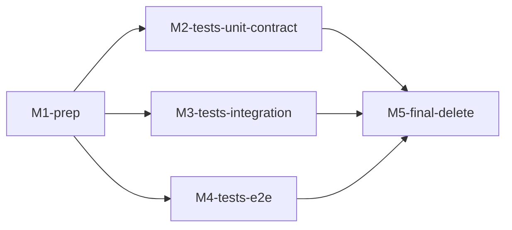

# refactor-360: JSONL session store 整合 — 技术方案

> 对齐: motivation.md v1
> Unit branch: `unit/refactor-360-jsonl-session-store-consolidation` (will be created by orchestrator)

## Changelog

<!-- 按时间倒序追加。格式：YYYY-MM-DD (Mx): 一句话 — 详见 Mx/progress.md -->

- 2026-05-19 (M3 实施期, orchestrator 用户授权扩范围): M3 worker 在迁移 compaction/runtime integration 测试到真实路径时发现两处产品 dead code/half-implementation,同属 F-330 半截 replace 雷区:
  1. `src/agent/core/agent/runtime.py:169` docstring 承诺 "ModelError: If provider call fails and overflow recovery cannot recover",但实际是 bare `raise`。worker 实现了 ~60 行 overflow recovery 逻辑(catch ModelError → compact OVERFLOW → 重跑一次)。
  2. `CompactionSettings.summary_model: str | None` 字段(`src/agent/core/agent/compaction/types.py:25`)已存在但全代码 0 引用(dead field)。worker 在 `AgentRuntime.__init__` 里接到 `CompactionSummarizer` 的 fork,允许 summarizer 用独立模型。
  按"真正解决问题"原则:这两处是 docstring/字段已承诺但实现缺失,与本 unit motivation #2「测试假装在跑」同质,顺手收尾;而非新增 feature。worker 在 M3 progress.md 必须详细记录范围扩张证据。

- 2026-05-19 (M1 实施期, orchestrator 用户授权澄清): 澄清决策 6「拒绝浅迁」解读 — 测 runtime / hook / compaction / skill 行为的测试若直造 SessionManager,即便核心断言不涉及 SessionService 元数据,**仍归 (a) 类**,改走 `SessionService.create_session` 真实路径。理由:motivation 现状痛点 #2「测试假装在跑」是本 unit 核心问题,(b) 平替不足以兑现。仅当测试核心断言就是 store IO 本身(append / load 字节流)才允许归 (b);这种场景几乎一定也是 (c)。M1 plan 已按此重做。

- 2026-05-19 (启动前): 澄清 spec Q1 第 2 条 — "包整体不再存在"放宽为"包内只剩 service.py + __init__.py";原表达是 spec 阶段实现层污染,SessionService 挪位置无价值。motivation.md Q1 解读同步更新。

## 现状分析

### 涉及范围

```
src/agent/platform/persistence/session/         ← 整个包候删 / 候改
├── __init__.py            导出 SessionStore / JsonlSessionStore(B) / SQLiteSessionStore(C) / LoadedSession
├── base.py                shim,re-export core/session/store.py 的 SessionStore
├── jsonl_store.py         (B) 死同名 JsonlSessionStore — 接口 append_event / load_session / save_snapshot
├── sqlite_store.py        (C) 死 SQLiteSessionStore — 同 (B) 接口
├── serializers.py         仅 (B)(C) 用,跟着删
└── service.py             ★ SessionService — 生产路径,**保留**(可能挪位置,见决策 2)

src/agent/core/session/
├── jsonl_store.py         (A) 生产用 JsonlSessionStore — 不动语义
├── store.py               SessionStore 抽象基类 — **删**(只有 (B)(C) 继承)
├── manager.py             SessionManager — 不动
└── entries.py / jsonl_writer.py / models.py — 不动

src/agent/platform/http_api/
└── app.py:46              session_store: SessionStore | None = None — 类型签名错(见决策 3)

docs/内核设计SPEC.md         ← 双重 stale,本 unit 顺手修(见决策 4)
└── line 47, 71-72, 346-348 都在描述老的 SessionStore / SQLiteSessionStore / JSONLSessionStore 三件套
```

### 既有约束

- **分层依赖单向**:`core` → `platform` → `products`,不允许反向。SessionService 在 platform 层调 core 层 (A),方向合规。
- **测试分层**:`tests/unit/` / `tests/integration/` / `tests/e2e/` / `tests/contract/`,迁移时按用途留在对应目录。
- **session 持久化按 SPEC 应在 `platform/persistence/session/`**:F-330 已经悄悄把生产实现挪到 `core/session/`,本 unit 要么承认这个现状(改 SPEC),要么把 (A) 挪回 platform(扩大 diff)。见决策 2。

### 可复用能力

- **(A) `agent.core.session.jsonl_store.JsonlSessionStore`** 自带 `create / append / load / list_session_ids / writer / find_session_by_metadata` 全套接口。直接用,不新增能力。
- **`SessionService.create_session()`** 已是生产创会话真实入口。(a) 类测试迁移目标就是它。
- **现有 76 处测试中的"等价覆盖"** 大量重叠 — design 阶段做分类清单时,(c) 类删除前必须找到等价覆盖来源(motivation Q4)。

### 相关历史

- `a33e63d9 feat-330` (2026-04-23) — 本 unit 的根源,引入 (A) 接管 SessionManager 但没删 (B)(C)、没更 SPEC
- `3555e11c feat-337` (2026-04-29) — 后续改过 (A) 的 jsonl_store.py,(A) 在持续演进,**本 unit 不能动它**(冻结 A)
- 无其它 unit 触过 (B)/(C)

## 架构总览

**Before**(当前 main):

```
                                  ┌─────────────────────────────────────────────┐
                                  │ agent/core/session/                         │
                                  │   ├── store.py  SessionStore (ABC)          │
                                  │   ├── jsonl_store.py  (A) JsonlSessionStore │  ← 生产真用,不继承 ABC
                                  │   └── manager.py  SessionManager(store=(A)) │
                                  └──────────────┬──────────────────────────────┘
                                                 │
                                                 ▼  (A 直接被注入)
SessionService.create_session() ─────────────────┘

[死代码群岛 — 0 src/ 引用,76 tests/ 引用]
agent/platform/persistence/session/
  ├── base.py   shim re-export SessionStore (ABC) ←─┐
  ├── jsonl_store.py  (B) ────────┐                  │
  ├── sqlite_store.py (C) ────────┤ ←─── 实现 ABC ───┘
  └── serializers.py              │
                                  └─→ tests/{unit,integration,contract,e2e}/   (76 处假装在测)

[文档 stale]
docs/内核设计SPEC.md  说 (C) 是 "生产默认 session store"
```

**After**(本 unit 完成后):

```
                                  ┌─────────────────────────────────────────────┐
                                  │ agent/core/session/                         │
                                  │   ├── jsonl_store.py  JsonlSessionStore     │  ← 唯一存活,语义不变
                                  │   └── manager.py  SessionManager(store=...) │
                                  └──────────────┬──────────────────────────────┘
                                                 │
                                                 ▼
agent/platform/persistence/session/service.py    │
   SessionService.create_session() ──────────────┘

[删干净]
agent/core/session/store.py             ✗ 删
agent/platform/persistence/session/base.py            ✗ 删
agent/platform/persistence/session/jsonl_store.py     ✗ 删
agent/platform/persistence/session/sqlite_store.py    ✗ 删
agent/platform/persistence/session/serializers.py     ✗ 删
agent/platform/persistence/session/__init__.py        ✗ 清干净导出
agent/platform/http_api/app.py:46  类型签名改 JsonlSessionStore   ✓ 顺手修

[文档接上]
docs/内核设计SPEC.md  改成描述 (A) 在 core/ 的现状
```

核心思路:**冻结 (A) 不动,把 (A) 周围所有死壳一次性清干净;测试按 motivation Q2 三分流迁/删;顺手修 F-330 留下的两颗雷(app.py 类型签名、SPEC 文档)。**

## 关键决策

### 决策 1: 删除顺序 — 先迁测试,最后删 store

- **选择**: M1 准备 → M2-M4 分批迁测试 → M5 终删 store + 包 + 抽象基类
- **理由**: 测试还在用 (B)(C) 时如果先删 store,会让大半个 pytest 套瞬间 collection error,失去增量验证能力。反过来"测试一处一处改、改一处跑一处子集 pytest"可以一直保持绿;最后删 store 时若某处漏迁,直接报错暴露,反而成兜底检测。
- **拒绝**: 同步删/迁(同 commit)—— commit 太大,审起来累,出问题难定位。
- **风险**: 迁测试期间如果有新 PR 引用 (B)(C),需提醒合 PR 顺序(本 unit 优先合,或临时 rebase)。

### 决策 2: SessionService 留在 `platform/persistence/session/` 包,不挪位置

- **选择**: 包结构保留,只删 (B)(C) 相关文件;包内最后剩 `service.py + __init__.py`,`__init__.py` 清空导出(只保留 `SessionService` 重导出)。
- **理由**: 改 `SessionService` 的 import path 是 scope creep —— `from agent.platform.persistence.session.service import SessionService` 在 app.py / deps.py / routes/session.py 都有引用,改 path = 改三处 + 改其它没列出的地方,且无真实价值。包内 2 文件的小结构是清晰的,不需要"为了对称去拆"。
- **拒绝**: 把 service.py 挪到 `agent/platform/persistence/session_service.py`(扁平)或 `agent/platform/session/service.py`(平行) —— 都属于无价值重组。
- **风险**: 包名 `platform/persistence/session/` 仍然暗示"session 持久化在这",但实际持久化在 core/。决策 4 通过更新 `docs/内核设计SPEC.md` 来消解这层认知错位。

### 决策 3: app.py 类型签名改 `JsonlSessionStore | None`,不引入新 Protocol

- **选择**: `src/agent/platform/http_api/app.py:46` 的 `session_store: SessionStore | None` 改成 `session_store: JsonlSessionStore | None`,直接 import (A)。
- **理由**: 删完 (B)(C) 后整个项目只有一个 store 类。再引一层 Protocol 抽象只是为了"将来可能多实现"而提前设计 —— YAGNI。哪天真出第二个 store,届时再加 Protocol,半天工作。
- **拒绝**:
  - `session_store: Any | None` —— 弱化类型,失去静态检查价值
  - 加 `SessionStoreProtocol` 让 (A) 隐式实现 —— 过度设计,本 unit 无第二实现
- **风险**: 无。

### 决策 4: 顺手修 `docs/内核设计SPEC.md` 的 4 处 stale 描述

- **选择**: 本 unit 范围内修正:
  - 删第 47 行 `core/session/store.py | SessionStore 持久化抽象接口`
  - 第 71-72 行两行合并改成 `core/session/jsonl_store.py | JSONL-based session store(生产默认,workspace-local .nano/sessions/)`
  - 第 346-348 行三件套表改成单行 `JsonlSessionStore | 生产默认,workspace-local .nano/sessions/ 下 JSONL 追加 + 快照`
- **理由**: 这份 SPEC 是 AGENTS.md 顶层文档索引指向的内核设计权威。F-330 没改它,留下来误导所有新读者(包括 agent)。本 unit 既然是 F-330 的收尾,顺手补完。仅 4 处微改,~10 行 diff,不算 scope creep。
- **拒绝**: 整篇重写 / 其它 stale 段落顺带改 —— 那是单独的 docs unit,本 unit 只补与 (A)(B)(C) 直接相关的部分。
- **风险**: SPEC 改动可能和其它正在写 design 的 unit 撞 —— 但 grep 全仓 `docs/changes/` 在跑的 unit 只有本 unit,无冲突。

### 决策 5: 测试分类清单作为独立文件 `test-migration-plan.md`,M1 worker 产出

- **选择**: M1 worker 产出 `docs/changes/refactor-360-jsonl-session-store-consolidation/test-migration-plan.md`,内容是 76 处 import 逐个 entry(文件路径 + 导入哪个死类 + 用途 + 分类 a/b/c + (c) 的等价覆盖来源 / 待补)。M2-M4 worker 依据它干活,M5 终删时也照它过一遍。
- **理由**: 76 entries 放 design.md 撑爆,放 milestone progress.md 是 worker 内私事不便共享。单独文件让所有 worker 共用同一份"清单状态机",改动可追踪,reviewer 也能照它走一遍验收。
- **拒绝**:
  - 放 design.md —— 撑爆
  - 每个 milestone progress.md 各自分析子集 —— 失去全局视图,(c) 覆盖来源跨 milestone 引用会卡
- **风险**: M1 worker 做完分类,M2-M4 worker 可能在执行中发现新的分类边界 case(原以为 (b) 实为 (a)),要回头改 plan。流程上接受,worker 改 plan + 在 milestone progress.md 留 note。

### 决策 6: (a) 类测试改走 SessionService 的"接通深度"

- **选择**: (a) 类测试改写后**完整走 SessionService.create_session → SessionManager.create_session → (A) JsonlSessionStore**,不绕过任何一层。如果测试本意只是验某个 hook 或 compaction 行为,允许在最少改动前提下注入 mock LLM / mock provider(因为这些不是 session store 范畴),但 session 创建/加载路径必须真。
- **理由**: 整个 refactor 的最大价值就是把测试从"测死代码"变成"测真路径"。如果 (a) 类只是浅迁(换 import 不换路径),没解决根本问题。
- **拒绝**: 浅迁(只把 store 换成 (A) 但仍直造 SessionManager) —— 没走 SessionService,丢掉了 default_session_metadata merge、SessionService 的元数据合并逻辑覆盖。这条本质上等于 (b) 类。
- **风险**: 某些测试当年是为了**测 store 接口本身**(append_event / save_snapshot / load_session 的契约)而写的,改走 SessionService 会跑通但不再覆盖原本想测的"接口契约"。这些测试本质上是 (c) 类,**M1 worker 分类时要严格识别**:测的是"会话语义"还是"store 接口契约",后者全归 (c)。

## 接口与数据流

本 unit 是 **删除型 refactor,不引入新接口、不改既有接口签名**。

唯一的 API 形态变化在 `src/agent/platform/http_api/app.py:46` —— 类型签名收紧:

```python
# Before
from agent.platform.persistence.session.base import SessionStore
def create_app(*, session_store: SessionStore | None = None, ...): ...

# After
from agent.core.session.jsonl_store import JsonlSessionStore
def create_app(*, session_store: JsonlSessionStore | None = None, ...): ...
```

调用方零修改 —— 所有调用方都不传 `session_store=` 参数(走默认 `_resolve_store`),即使传也是 (A) 实例,Python runtime 接受。

数据流不变:

```
HTTP POST /v1/sessions
   ↓
routes/session.py::create_session
   ↓
SessionService.create_session            (platform/persistence/session/service.py)
   ↓
SessionManager.create_session             (core/session/manager.py)
   ↓
(A) JsonlSessionStore.create              (core/session/jsonl_store.py)
   ↓
JSONL append to ~/.nano/sessions/{sid}/
```

每一步都已是生产现状,本 unit 不动。

## 风险与回退

**已知风险**:

1. **(a) 类测试改走 SessionService 后行为差异**:某些测试以前直造 SessionManager 时绕过了 SessionService 的 `default_session_metadata` shallow merge。改走真实路径后,session 的 metadata 字段会多一些来自 product profile 的默认值。如果测试断言里硬比对了 `metadata == {}`,会失败。**应对**:M1 plan 阶段把每条 (a) 项标记"已知 metadata 影响 / 无影响",M2-M4 实施时按需调整断言。

2. **(c) 类删前补 integration 测试可能 flaky**:真实路径 integration 测试比直造 store 慢、对环境更敏感(需要写 `.nano/sessions/`)。**应对**:沿用 `tmp_path` 隔离,避免污染真实 workspace;flaky 报告归本 unit 必修(不上线 flaky 测试)。

3. **(A) 在并行 unit 中可能被改**:`feat-337` 之后没有其它 unit 改 (A),`grep -l "core/session/jsonl_store"` 当前在跑的 unit 只有本 unit,无冲突。但合 PR 期间如果有人插队动 (A),要 rebase。**应对**:开 unit 期间 unit 锁文件 `data/locks/unit-refactor-360.lock` orchestrator 自动管理。

4. **`docs/内核设计SPEC.md` 改动撞车**:同上,grep 检查无人在改这份 SPEC。

5. **测试覆盖率隐性下降**:M4 (c) 类先补再删原则严格执行,但补的 integration 测试如果断言不足以替代被删测试的覆盖,会留下覆盖率债。**应对**:Q4 硬约束 ——"等价覆盖来源"栏空着的不允许进入"删"列表,worker 在 progress.md 必须给每条 (c) 列出对应已存在的覆盖测试名 + 行号。

**降级路径**: 本 unit 是 删除 + 迁移,无运行时降级概念。如果中途发现某条决策有问题,在 design.md Changelog 追加记录后调整;不阻塞 milestone 推进。

**回滚方案**:

- M5 终删前:任意 milestone 单独 revert 即可,不影响其它已合 milestone
- M5 合并后:发现 prod 受损 → `git revert <unit-merge-sha>` 一把全撤,所有删除文件恢复;`.nano/sessions/` 数据格式 (A) 全程未动,无数据兼容性风险
- 本机已有 `.nano/sessions/` 历史数据不会受任何影响 — (A) 的格式不变,文件不动

## Runbook for Reviewer

**无常驻服务**。

本 unit 改动:
- 删 `src/agent/platform/persistence/session/` 包内 (B)(C) 实现 + 抽象基类
- 改 `src/agent/platform/http_api/app.py:46` 类型签名
- 改 `docs/内核设计SPEC.md` 4 处 stale 描述
- 迁 / 删 76 处测试 import

所有改动只影响**静态代码 + 测试**,不动任何运行时实例。reviewer 不需要重启 IM / Gateway / kernel app —— 走旅程时这些服务的 binary 已经使用 (A)(本 unit 完成前后都是 (A)),没有 stale binary 问题。

如果 reviewer 仍想走一次冒烟旅程验"不变性"(motivation 验收标准第 1-4 条),用现有服务直接走 —— IM `http://127.0.0.1:8011/` 已在跑(本机 79111 真实 Gateway 仍在);需要 fresh 状态时按 AGENTS.md 标准重启即可。

## Milestones

依赖图:



| ID | 标题 | 依赖 | 并行组 | 范围 | 退出标准 |
|---|---|---|---|---|---|
| `refactor-360-M1` | prep | — | A | `docs/changes/refactor-360-.../test-migration-plan.md` 新建;`src/agent/platform/http_api/app.py:46` 类型签名;`docs/内核设计SPEC.md` 4 处 stale 修正 | `[worker]` test-migration-plan.md 含 76 处 import 全列、每条标 (a/b/c)、每条 (c) 附"等价覆盖来源"栏(空着的转 "needs new test before delete");`[worker]` `mypy` 不再为 app.py 该行报错;`[worker]` `grep "SQLiteSessionStore\|SessionStore 持久化抽象接口" docs/内核设计SPEC.md` 返回零(stale 描述全清);`[worker]` `pytest tests/` 套不回归 |
| `refactor-360-M2` | tests-unit-contract | M1 | B | `tests/unit/test_agent_runtime_m246.py` + `tests/contract/test_*` 3 个文件(2 + 1) | `[worker]` 这 3 个文件不再 import `agent.platform.persistence.session`;`[worker]` 这 3 个文件单跑 `pytest <file>` 全绿;`[worker]` 整套 `pytest tests/` 不回归 |
| `refactor-360-M3` | tests-integration | M1 | B | `tests/integration/` 下 16 个引用 (B)/(C) 的文件 | `[worker]` 16 个文件不再 import `agent.platform.persistence.session`;`[worker]` `pytest tests/integration/` 全绿;`[worker]` 整套 `pytest tests/` 不回归 |
| `refactor-360-M4` | tests-e2e | M1 | B | `tests/e2e/` 下 10 个引用 (C) 的文件 + 原 xfail 的 2 个 workspace_root 测试 | `[reviewer]` IM 网页能跑(motivation 不变性勾 #1);`[reviewer]` Coding CLI `create-session` / `send-message` / `--resume` 能跑(勾 #2);`[reviewer]` `.nano/sessions/` 历史数据 `--resume` 能加载(勾 #4);`[worker]` 10 个 e2e 文件 + 2 个 workspace_root 测试不再 import platform 层 store;`[worker]` 2 个 workspace_root 测试去掉 xfail 标记且 pass;`[worker]` `pytest tests/e2e/` 全绿(含 workspace_root 转 pass);`[worker]` 整套 `pytest tests/` 不回归 |
| `refactor-360-M5` | final-delete | M2,M3,M4 | C | 删 `src/agent/platform/persistence/session/base.py / jsonl_store.py / sqlite_store.py / serializers.py`;清 `src/agent/platform/persistence/session/__init__.py` 导出;删 `src/agent/core/session/store.py`;关闭 issue #25 | `[reviewer]` Gateway 启动 / 停止 / 重启(motivation 不变性勾 #3);`[worker]` `grep -rn "SQLiteSessionStore\|from agent.platform.persistence.session import \|from .sqlite_store\|from .base import SessionStore" src/ tests/` 返回零;`[worker]` `ls src/agent/platform/persistence/session/` 只剩 `__init__.py` + `service.py`;`[worker]` `ls src/agent/core/session/store.py` 不存在;`[worker]` `mypy src/` 不为本 unit 触及代码报新错;`[worker]` `pytest tests/` 全绿;issue #25 关闭 |

