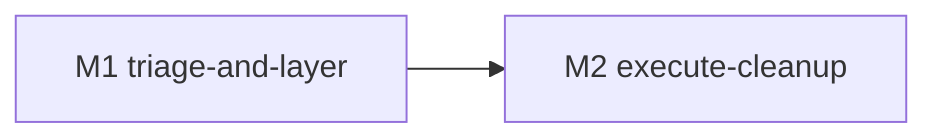

# refactor-372: 测试套件健康化 — 技术方案

> 对齐: motivation.md v1
> Unit branch: `unit/refactor-372` (will be created by orchestrator)

## Changelog

<!-- 按时间倒序追加。格式：YYYY-MM-DD (Mx): 一句话 — 详见 Mx/progress.md -->

## 现状分析

### 涉及范围

- `tests/e2e/` —— 28 个文件，**只有 4 个打了 `@pytest.mark.e2e`，24 个没打**，且**无任何 conftest 按路径自动标记**（无顶层 `tests/conftest.py`，`tests/e2e/conftest.py` 只做进程泄漏 finalizer，不打 marker）。后果：`pytest -m "not e2e"` 实际只排除 4 个文件，24 个需真实进程/服务器的 e2e 测试照跑照失败——这是 161 失败里的一大块，**不是腐烂，是错分层**。
- `tests/`（unit / integration / contract / im_service）—— 真·腐烂测试散落处。已确认三类样本：契约字段漂移（`test_core_types_contract`）、auth fixture 漂移（`test_conversation_rename` 全 401）、API 改名漂移（`test_sdk_client` 无 `send_message`）。
- `pyproject.toml` —— `[tool.pytest.ini_options].markers` 只定义 `e2e`；**`pytest-cov` 未安装**，覆盖率口径需先补工具。
- `ACCEPTANCE/*.py` + `tests/acceptance/` —— 一次性验收快照，部分被当永久测试留存。
- 巨型文件 6 个 >1000 行（`test_cli_main.py` 2754、`test_main.py` 2120、`test_gateway_pipeline.py` 1676…）。
- milestone 流水号命名一批（`m102`/`m103`/`m85`/`m86`/`m236`/`refactor353_corrigendum`），其中 `m102`+`m103` import 同一批 gateway 模块，疑似跨层重复。

### 既有约束

- **不改产品逻辑**：本 unit 是测试健康化，只动 `tests/` + 测试基础设施（conftest / markers / dev 依赖）。triage 若判定"测试对、产品错"=真回归 → `gh issue create` 单独走 bugfix，不在本 unit 改 `src/`。
- **TESTING_GUIDE 是标尺**：清理后须符合其规则（无流水号命名、e2e 必带 marker、单文件 ≤400 行、一次性证据不混入套件、可选依赖容错 import）。其中 §3 明确认可"用 conftest 给 e2e 目录按路径自动打 marker"。
- **契约只对齐不放宽**：修 `tests/contract/` 是让测试对齐现码事实，不是放宽四个包的对外契约。
- **TESTING_GUIDE 的"禁 skip/xfail 蒙混"**：本 unit 对真回归引入一个**狭窄合规例外**——见决策 3。

### 可复用能力

- `pytest_collection_modifyitems` collection hook —— pytest 原生能力，按 item 路径自动 `add_marker`，**用它**实现 e2e 自动标记，不自造机制。
- `coverage.py` / `pytest-cov` —— 标准覆盖率工具，**用 pytest-cov**（pytest 原生集成），不手写覆盖统计。
- bugfix-371 已让全量可收集 —— 本 unit 测量的前提，直接复用。

### 相关历史

- **bugfix-371**（刚合入）：修了 m170 收集炸弹，解锁全量收集；其 incident 已记录"161 failed"发现，本 unit 是它的后继。
- **feat-370**（刚合入）：立 TESTING_GUIDE，是本 unit 的清理标尺。
- 无其它近期改测试基础设施的 unit。

## 架构总览

本 unit 不改产品架构，改的是**测试套件的分层与健康度**。核心是一套"先正确分层、再按证据 triage、最后执行清理"的流程。

```
现状: pytest -m "not e2e"  →  161 failed / 2018 passed
                                  │
        ┌─────────────────────────┴─────────────────────────┐
   [M1 正确分层 + 测量]                                  (人审闸门)
        │                                                     │
  1. 加 e2e 路径自动 marker (conftest)                         │
     → 24 个误跑的 e2e 退出 "not e2e"                          │
  2. 装 pytest-cov，跑覆盖率                                   │
  3. 重跑 "not e2e"，对【残余失败】逐个分类 ──┐               │
  4. 盘点 重复 / 快照 / 巨型文件             │               │
        │                                    ▼               │
        └────────────→ triage 报告 (regression.md) ──────────┘
                                                  │ 人审通过
                          [M2 按清单执行] ◄────────┘
                          修腐烂 / 删快照·重复 / 去流水号 / 拆巨型
                                  │
                          pytest -m "not e2e" 绿 (xfail 计预期失败)
```

每个残余失败的分类决策树（M1 产出，M2 据此执行）：

```
某个 "not e2e" 失败的测试
  ├─ 是 e2e 性质(需真实进程/浏览器)却放在 unit/integration?
  │     → 移到 tests/e2e/ (自动获 marker) 或就地标 e2e  → 离开基线
  ├─ 断言反映的是"过期预期"(产品已主动改,测试没跟)?
  │     → 更新测试对齐现码; 若更新后与他处重复 → 删
  ├─ 测试对、产品违反它 = 真回归?
  │     → gh issue + @pytest.mark.xfail(strict, reason 含 #N)  (决策 3)
  └─ 一次性验收快照,无回归价值?
        → 删, 有价值断言先抽进常驻测试
```

## 关键决策

### 决策 1: e2e 用路径自动 marker，不逐文件手标

- **选择**: 在 `tests/e2e/conftest.py`（或顶层 `tests/conftest.py`）加 `pytest_collection_modifyitems`，对路径在 `tests/e2e/` 下的 item 自动 `add_marker(pytest.mark.e2e)`。
- **理由**: 24 个文件逐个手标易漏、新增 e2e 还会再漏；路径自动标记自维护，新加 e2e 文件天然被覆盖。TESTING_GUIDE §3 已认可此法。
- **拒绝**: 逐文件写 `pytestmark = pytest.mark.e2e` —— 24 处重复且无法防未来再漏。
- **风险**: 若有"名字像 e2e 但其实是纯逻辑"的文件被误标（如 m170 那种），会被错误排除出基线。缓解：M1 标记后人工扫一遍 `tests/e2e/` 确认每个文件确属 e2e；m170 这类已在 bugfix-371 移回 unit。

### 决策 2: 覆盖率用 pytest-cov，加入 [dev]

- **选择**: `pyproject.toml` 的 `[project.optional-dependencies].dev` 加 `pytest-cov`；triage 时 `pytest --cov=src --cov-report=term-missing` 判断测试是否贡献唯一覆盖。
- **理由**: 判断"某测试能否安全删"需要覆盖率证据（删了是否掉唯一覆盖），不能拍脑袋。pytest-cov 是标准、与 pytest 原生集成。
- **拒绝**: 手写 coverage 脚本 —— 重复造轮子。
- **风险**: 覆盖率只能证明"行/分支被执行"，不能证明"断言有意义"。所以删除判据是覆盖率 + 人工判断双闸，不单靠数字（见决策 4）。

### 决策 3: 真回归用 issue + 狭窄合规的 xfail，定义"绿基线"

- **选择**: triage 判定"测试对、产品错"=真回归时：① `gh issue create` 记录产品 bug；② 给该测试打 `@pytest.mark.xfail(reason="<现象>; tracked in #<N>", strict=True)`。"绿基线"= `pytest -m "not e2e"` 退出 0，xfail 计为预期失败、xpass（strict 下）计为失败。
- **理由**: 真回归的测试**有回归价值，不能删**（删=掩盖 bug）。strict=True 保证产品 bug 修好后该测试转 xpass→报错，强制有人回来摘掉 xfail，不会让例外永久沉淀。这与 TESTING_GUIDE "禁 skip/xfail 蒙混"不冲突——被禁的是"无说明、为掩盖失败"的 skip/xfail；这里是**带 issue 链接 + strict 的可追踪例外**。
- **拒绝**: (a) 删掉失败的真回归测试让基线变绿 —— 掩盖产品 bug，最坏的选项；(b) 把真回归留为裸 failed、定义"绿=除已知失败外全绿" —— CI 无法机械判定，等于没有绿基线。
- **风险**: xfail 被滥用成"懒得修就标 xfail"。缓解：xfail **必须带 issue 编号**，M1 triage 报告里逐条列出哪些测试将被 xfail + 对应 issue，人审把关。
- **补充**: 此例外需回写 TESTING_GUIDE（决策 6 §的产物之一），把"xfail 仅限带 issue 链接 + strict 的已知产品回归"写成明文规则。

### 决策 4: 删除判据 — 覆盖率 + 性质双闸

- **选择**: 一个测试可被**净删**仅当满足任一：(a) 覆盖率确认冗余——删除后它原本覆盖的行/分支仍被其它测试覆盖；(b) 它是一次性验收快照（TESTING_GUIDE §6 判据"半年后还该每次 CI 跑吗"=否），且有价值的断言已抽进常驻测试。
- **理由**: 防"凭感觉删了唯一覆盖某分支的测试"。
- **拒绝**: 只按"看起来重复/老旧"删 —— 高风险盲删。
- **风险**: 覆盖率口径（行 vs 分支）影响判断；M1 报告需对每个删除候选给出覆盖证据，M2 执行时再复核。

### 决策 5: 巨型文件按行为聚类拆分，行为保持

- **选择**: >400 行的测试文件按"被测行为/功能簇"拆成多个文件，测试内容不变（同样的用例、重新分组）。优先级低于"绿基线"。
- **理由**: TESTING_GUIDE §7 上限 400 行；拆分是纯结构调整，行为保持。
- **拒绝**: 借拆分顺手改测试逻辑 —— 会把"结构调整"和"行为变更"混在一起，难 review。
- **风险**: 拆分中误删/误改用例。缓解：拆分前后 `pytest <该文件相关>` 收集到的用例数与通过数必须一致。

### 决策 6: M2 范围在 M1 后才能定，且 M2 可能再拆

- **选择**: 本 design 完整定义 M1；M2 仅给出"按 triage 清单执行清理"的框架范围。M1 triage 报告人审后，回 design-author 在 Changelog 追加 M2 的细化范围（若 triage 显示真回归/腐烂/重复分布在互不重叠的独立模块、量大可并行，M2 可再拆成并行 milestone）。
- **理由**: M2 的具体动作、风险、可并行性**完全取决于 M1 的分类结果**，现在预拆是凭空想象（§4.2 "必须分阶段验证"触发条件）。
- **拒绝**: 现在就把 M2 拆成"修腐烂/删重复/拆巨型"等横切 milestone —— 违反 §4.3（横切式拆分），且范围未知。
- **风险**: M1 报告若显示 161 中真回归占比很高，M2 可能演变为大量 bugfix issue + 小清理，需重新评估投入。这正是 M1 设为人审闸门的原因。

## 接口与数据流

本 unit 无产品接口变更。涉及的"接口"是测试基础设施：

- **e2e 自动 marker**（决策 1）：
  ```python
  # tests/e2e/conftest.py (或 tests/conftest.py)
  def pytest_collection_modifyitems(config, items):
      for item in items:
          if "tests/e2e/" in str(item.path):   # 路径判定，行级实现交 worker
              item.add_marker(pytest.mark.e2e)
  ```
- **triage 报告**（M1 产出 → 人审 → M2 输入）：落在 `docs/changes/refactor-372-test-suite-health/regression.md`，结构：
  - 总览：`not e2e` 标记前/后失败数；残余失败按四类计数。
  - 逐条清单：`<测试路径::用例> | 分类(e2e错分层/过期预期/真回归/一次性快照/重复) | 证据(错误摘要/覆盖率) | M2 动作(标marker/移位/更新/删/xfail+issue) | issue#(若真回归)`。
  - 结构问题盘点：流水号命名文件列表、>400 行文件列表、一次性快照清单、跨层重复对（如 m102/m103）。
- **覆盖率口径**（决策 2）：`pytest --cov=src --cov-report=term-missing -m "not e2e"`，删除候选附"删前/删后该模块覆盖"对比。

## 风险与回退

- **风险 1：标了 e2e 自动 marker 后，被排除的不只是"该排除的"**。若某 `tests/e2e/` 文件其实是纯逻辑（像 m170），会被错误移出基线，掩盖其失败。缓解：M1 标记后人工逐个确认 `tests/e2e/` 28 个文件确属 e2e；可疑的移回 unit。
- **风险 2：把"测试对、产品错"误判成"过期预期"而改测试**，等于悄悄放宽产品契约、掩盖真 bug。缓解：M1 triage 对每个"更新测试"候选要说明"为什么现码行为是正确的预期",存疑则归真回归走 issue，不默认改测试。
- **风险 3：M2 体量失控**（161 中真回归占比高）。缓解：M1 人审闸门——报告出来后人决定 M2 是否拆分/分批/降范围。
- **回退**: 本 unit 全是测试 + 基础设施改动，产品逻辑不碰；每步独立小 commit，单步 `git revert` 即回上一稳定态。e2e 自动 marker 若引发问题，删掉 conftest hook 即恢复原状。真回归 issue 与本 unit 解耦，不阻塞回退。

## Runbook for Reviewer

**无常驻服务**。本 unit 只改测试代码 + 测试基础设施（conftest / pyproject markers / dev 依赖）+ 文档，不改任何产品常驻服务。

reviewer 的验收方式不是走产品旅程，而是跑测试套件：

| 动作 | 命令 | 期望 |
|---|---|---|
| 全量可收集 | `pytest --co -q` | 0 error |
| 快层基线 | `pytest -m "not e2e" -q` | M2 完成后退出 0（xfail 计预期失败；真回归均有 issue 链接） |
| e2e 已正确分层 | `pytest -m "not e2e" --co -q \| grep tests/e2e \|\| echo OK` | 不收集任何 `tests/e2e/` 用例 |

## Milestones

> 拆 M1/M2 的举证（§4.2 "必须分阶段验证"）：M2 的范围/动作/可并行性完全取决于 M1 的 triage 分类结果，M1 报告未经人审前 M2 无法确定范围。故 M1（分层+测量+报告，人审为闸）必须先合 unit 分支，M2 才能开干。

| ID | 标题 | 依赖 | 并行组 | 范围 | 退出标准 |
|---|---|---|---|---|---|
| refactor-372-M1 | triage-and-layer | — | A | `tests/e2e/conftest.py`（或新建 `tests/conftest.py`）、`pyproject.toml`（dev 加 pytest-cov）、`docs/changes/refactor-372-test-suite-health/regression.md`（新建） | `[worker]` 加 e2e 路径自动 marker 后 `pytest -m "not e2e" --co` 不再收集任何 `tests/e2e/` 用例；`[worker]` pytest-cov 装好、覆盖率可跑出；`[worker]` 对【标记后残余】的 not-e2e 失败逐个分类入 regression.md（四类 + 每条证据 + M2 动作 + 真回归 issue#），并盘点流水号命名/>400 行/一次性快照/跨层重复；`[reviewer]` 人审 regression.md 可读、分类有据、可据此决定 M2（M1 不动 `tests/` 内容、不删测试） |
| refactor-372-M2 | execute-cleanup | M1 | A | 由 M1 triage 报告确定（届时回写本表 + Changelog）；框架范围：`tests/` 下需修/删/移/重命名/拆分的文件 + 必要的 TESTING_GUIDE 规则补充（xfail 例外明文化） | `[reviewer]` `pytest -m "not e2e"` 退出 0（xfail 计预期失败，真回归均有 issue 链接）；`[reviewer]` 产品行为不变（本 unit 不改 `src/`，真回归走独立 bugfix issue）；`[worker]` 删除/合并的测试经覆盖率确认不掉唯一覆盖；`[worker]` 套件符合 TESTING_GUIDE：无 milestone 流水号命名测试、`tests/e2e/` 全部带 marker、无 >400 行测试文件（或在报告列明豁免理由）、一次性快照移出套件 |


