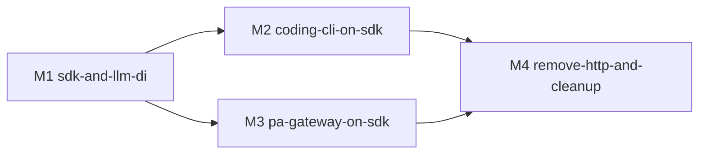

# refactor-387: 移除内核内置 HTTP API，内核改为纯 SDK 形态 — 技术方案

> 对齐: motivation.md v1

> Unit branch: `unit/refactor-387` (will be created by orchestrator)

## Changelog

## 现状分析

### 涉及范围

- **装配点**：`agent/platform/http_api/app.py:create_app()` —— 内核的装配函数体：`bootstrap_product` → `PermissionBroker` → `AgentRuntime` → `EventStreamHub` → `RunsRegistry` → `wire_background_tasks` → `build_tool_registry` / `build_hook_registry`。SDK 本质 = 这段装配减去 FastAPI / routes / middleware。
- **执行引擎**：`agent/core/runs/registry.py:RunsRegistry` —— `submit()` 返回 `RunRecord(run_id)`，把 turn 协程 `run_coroutine_threadsafe` 丢到它**自己后台线程内的 asyncio loop**（`_start_async_loop`）。`interrupt(session_id)` / `cancel(run_id)` / `get(run_id)` 均在此。
- **三个原语已在进程内**：流式 = `EventStreamHub.stream_session()`（async iterator，SSE 路由只是序列化它）；权限 = `PermissionBroker.resolve(request_id, decision)`（HTTP POST 只是调它）；取消/打断 = `runs.cancel` / `runs.interrupt`。
- **删除**：`agent/platform/http_api/`（app + routes/session·run·tool·hook·event·global + sse + auth + deps）、`agent/platform/sdk/client.py`、`coding_cli/client.py`、`coding_cli/kernel_app.py`、`coding_cli/managed_server.py`、`personal_assistant/kernel_app.py`、`personal_assistant/client/kernel_api_client.py`。
- **改造**：`agent/core/llm/factory.py`（#40）；coding_cli 消费侧 `session_stream.py`（现为 bg 线程跑 HTTP SSE iterator）+ `events/event_pipeline.py` + `commands.py` / `main.py`（去 mode / base-url）；PA `main.py`（删 kernel 子进程 spawn / 健康轮询）+ `gateway/inbound_pipeline.py`（改调 SDK 而非 `kernel_api_client`）。
- **新增**：`agent/sdk/`（真实表面 + 装配入口 `build_kernel()`）。
- **工具链 / 测试**：`scripts/e2e-up.sh:135-157`「起 Kernel API」段 + `.api.pid` / `.api.log` 删；~15 个 HTTP/ASGI 耦合 contract test（`test_runs_async` / `sse_event` / `run_cancel` / `session_interrupt` / `health` / `llm_config` / `tools` / `task_tool` 等）平移到 SDK 表面；`test_cli_http_only_contract.py`、`test_core_no_platform_imports.py` 去 xfail 改写。

### 既有约束

- 三层硬规则（`tests/contract/` 守卫）：`core` 不依赖 `platform` / `products`；`platform → products + core`。
- 产品包当前事实上已 import 内核内部（被 xfail 容忍），新规则落成「产品只能 import `agent.sdk`」。
- `RunsRegistry` 自带后台 loop 线程——进程内化不引入双 loop 问题（PA 自身 async loop、coding_cli 异步化后的 `asyncio.run` loop 均能与之共存，与今天经 HTTP 时「FastAPI loop / RunsRegistry loop」并存一致）。

### 可复用能力

- **直接复用、仅换出口**：`RunsRegistry`、`EventStreamHub`、`PermissionBroker`、`AgentRuntime`、`bootstrap_product`、`wire_background_tasks`、`build_tool_registry` / `build_hook_registry` 全部保留，SDK 在其上薄封装；HTTP 删的只是 routes / sse / auth / deps 这层序列化壳。
- **CLI 流式消费要重做**：现 `SessionStreamReader`（bg 线程 + 队列 poll）是为「同步 REPL 消费 HTTP SSE」而设；决策 2 把 CLI 改 async-native 后，bg 线程桥接整体删除，改为在 REPL 的 async loop 里 `async for ev in kernel.stream(...)`。`EventStreamHub` 本身（进程内 pub/sub）复用。
- `kernel_app.py` 的 `init_model_registry` + profile 选择逻辑迁进 SDK 的 `build_kernel()`。

### 相关历史

- **#39 / #40**：本 unit 的 Closes 目标，两处 xfail(strict) 固化的架构违例。
- **refactor-382**：LLM models 收进 Gateway config（`LLMConfigPayload`），`kernel_app.py` 已据此注入 `NANO_MULTIAGENT_LLM_CONFIG_JSON`；进程内化后改为直接把 payload 传给 `build_kernel()`。
- **#52 / #64 / #47 / #8 / #1**（Refs）：均在 HTTP/SSE 路径上，进程内化后路径消失或重做；#47（REPL+ASGI 测试 hang）对应的 ASGI 专属测试直接删。
- SPEC.md v1.2 对齐 M84，§2 架构图与 §5 边界规则随本 unit 改写。

## 架构总览

**核心思路**：把 `create_app` 里「装配内核」与「HTTP 序列化」两件事分离——前者抽成 `agent/sdk` 的 `build_kernel()` 复用，后者（routes/sse/auth/deps）整体删除。产品从「import 内部装配 + spawn uvicorn + loopback HTTP」改为「import `agent.sdk` 进程内直调」。

### Before

```
coding_cli ──import 内部──► kernel_app.py ──create_app()──► FastAPI app
   │                                                          ▲
   └─ spawn uvicorn 子进程 ──► loopback HTTP (ServerClient) ───┘
                                                    路由层序列化
personal_assistant ──同上一套（kernel_api_client + spawn kernel uvicorn）──►

层次：core ◄─ platform(含 http_api 装配+序列化) ◄─ products      产品违规 import 内部
```

### After

```
            ┌───────────────────────── agent/sdk (新, 第4层) ─────────────────────────┐
            │  build_kernel(product_profile, llm_config, can_use_tool) → Kernel        │
            │  Kernel(全 async) 暴露:  create_session / submit / stream(async iter) /  │
            │               interrupt / cancel / compact / ...  权限=注入 can_use_tool │
            │  内部持有: AgentRuntime · RunsRegistry · EventStreamHub ·                │
            │           PermissionBroker · tool/hook registry（复用，零改）           │
            └───────▲───────────────────────────────────────────────▲─────────────────┘
                    │ import agent.sdk（唯一允许的对外面）            │
        coding_cli ─┘  async-native REPL，进程内直调，无子进程/无端口   personal_assistant（gateway 进程内持有 Kernel）
                       async for ev in kernel.stream()             inbound_pipeline await Kernel

层次：core ◄─ platform(去掉 http_api) ◄─ products ◄─ sdk        产品只 import agent.sdk
```

## 关键决策

### 决策 1: SDK 落在顶层 `agent/sdk/`（第 4 层）

- **选择**: 新建顶层 `agent/sdk/`，与 core / platform / products 平级，依赖三者做装配（`sdk → platform + products + core`）。删除现有名不副实的 `agent/platform/sdk/`（它只是个 HTTP client）。
- **理由**: 让边界规则「产品只能 import `agent.sdk`，禁止 import `agent.core` / `agent.platform` 内部」最干净、可被 AST 守卫直接断言。
- **拒绝**: 塞进 `platform`（import 路径变 `agent.platform.sdk`，「只 import sdk」的边界含糊，且 platform 本不该是产品的对外面）。
- **风险**: 低。sdk 作为最高层不被任何内核内部反向依赖，新增 contract 守卫即可。

### 决策 2: 内核单一 async `Kernel`；两个消费方都 async-native（coding_cli 改异步 REPL）

> 判据：纯架构最优，不计工作量 / 后向兼容（用户 2026-05-29 指示）。本条由此从初版「sync REPL + 桥接(A)」翻为「async-native(B)」。

- **选择**: SDK 只暴露一个 async-native `Kernel`。两个消费方都 async-native：PA（async gateway）直接 `await`；coding_cli 也改成异步 REPL（主流程 `asyncio.run(repl_main())`、异步输入、所有内核调用 `await`），与 PA、CC 完全对称。不存在 `SyncKernel`、同步桥接、消费流的 bg 线程。
- **理由**: agent 内核天生异步（并发 I/O，与 CC 一致）。让两个消费方都 async-native 是**彻底消除 sync/async 阻抗**的唯一干净方案——内核表面只有一种调用约定，无桥接债。sync REPL 的不对称纯由「CLI 历史上选了阻塞 `input()`」造成，是消费方的债，纯架构下应还掉而非封装。CC 同样只暴露单一 async 表面。
- **拒绝**: (a) sync REPL + 薄桥接——保留 sync/async 不对称 + bg 线程消费流，是历史 UI 债。(b) 纯 sync 表面——PA 在 async loop 里调阻塞方法会卡 loop。(c) SDK 内置 SyncKernel 镜像类——把单一消费方的私事抬进内核 API。
- **风险**: coding_cli REPL 主循环全面异步化，回归面大（coding_cli 全套交互不变性需重验）；异步输入需 `prompt_toolkit` async 模式等。回归由「用户侧验收标准」逐 Scenario 兜底。

### 决策 3: 权限统一为 `can_use_tool` 回调（CC 模型），去掉事件 + resolve 旁路

> 同判据。本条由初版「两层（事件+resolve 基线 + 可选回调）」收敛为「单一回调」。

- **选择**: 权限只有一条路径——消费方在 `build_kernel(..., can_use_tool=...)` 提供一个异步策略函数，签名对齐 CC `CanUseToolFn`：`async (tool, input, ctx) -> PermissionDecision{behavior: allow/deny, updated_input}`。内核需确认工具时 `await` 它。PA 实现程序化 / auto-mode 策略；async CLI 在回调里 `await` 用户在 REPL 的输入。删除「`permission_request` 事件 + `resolve_permission` RPC」旁路。
- **理由**: 回调是「内核需要一个决定」最直接、统一的抽象——内核不关心决定怎么来。事件+resolve 是 HTTP 时代产物（HTTP 传不了回调，只能发事件 + 收 POST），进程内回调才是自然形态。单一机制优于两条并行路径。CLI 异步化（决策 2）后回调可自然 `await` 用户输入，无跨线程阻塞问题。
- **拒绝**: 两层（事件+resolve + 回调）——两套机制、broker 双重处理风险，纯架构下冗余。
- **风险**: `PermissionBroker` 的 park-future 机制内部保留，但 resolve 唯一来源是回调返回值；回调 `await` 用户输入期间该 turn 阻塞——符合语义（等人决定）。

### 决策 4: 依赖注入 `LLMClientFactory`，core 只持 `LLMClient` 端口（#40）

> 同判据。本条由初版「注册接缝（core 全局 registry）」翻为「依赖注入 factory」。

- **选择**: `AgentRuntime` 已有 `llm_client` 参数；进一步注入一个 `llm_client_factory`（callable `LLMFactoryConfig -> LLMClient`，或 Protocol）。构造与 `reconfigure_llm`（`runtime.py:671`）都经注入的 factory 建 client。具体 factory（provider→具体类映射 + 实例化）移到 `agent/platform/llm/factory.py`；`core` 只留 `LLMClient` 接口 + `LLMFactoryConfig` 配置 dataclass。`build_kernel` 把 platform factory 注入 runtime。删除 `core/llm/factory.py` 对 platform 的 import 与静态 `_PROVIDER_CLIENTS` dict。
- **理由**: `reconfigure_llm` 要在运行时按新 provider 重建 client，故须注入 factory 而非单个实例。DI 注入 factory 是最纯方案：core 零 platform 依赖、无全局可变 registry（service-locator 反模式 / 启动顺序耦合）、composition root（`build_kernel`）是唯一同时认识 core+platform 的装配点。
- **拒绝**: 注册接缝（core 全局 registry + platform 启动注册）——service-locator，全局可变状态 + 时序耦合；factory 留 core——即 #40 本身。
- **风险**: runtime 构造点（含裸测 runtime 的单测）都要提供 factory；core 单测需一个默认 factory fixture（或一个 core 内的假 client factory）。

## 接口与数据流

### `agent.sdk` 对外表面

```
build_kernel(*, product_profile, llm_config: LLMConfigPayload,
             can_use_tool: CanUseToolFn,
             repo_root: Path | None = None) -> Kernel
    # = create_app 函数体 - FastAPI/routes/middleware
    # 内部装配并持有: AgentRuntime · RunsRegistry(自带后台 loop) · EventStreamHub ·
    #                PermissionBroker · tool/hook registry · SessionService
    # 注入 platform 的 LLMClientFactory 进 runtime（决策 4）
    # llm_config 直接传入（替代 NANO_MULTIAGENT_LLM_CONFIG_JSON env，见决策 5）

class Kernel:                                              # 全 async-native，无 SyncKernel
    async def create_session(*, title=None, workspace_root, skills=None) -> SessionInfo
    async def fork_session(session_id, *, workspace_root) -> SessionInfo
    async def compact(session_id, *, workspace_root) -> CompactResult
    def submit(*, session_id, parts, origin=RunOrigin.USER,
               workspace_root, trace_id=None) -> RunRecord      # sync, 非阻塞（调度到后台 loop）
    def stream(session_id, *, after_sequence=None) -> AsyncIterator[Event]   # 持久 session 流
    def interrupt(session_id) -> str | None                     # sync
    def cancel(run_id) -> RunRecord | None                      # sync
    def get_run(run_id) -> RunRecord | None                     # sync
    def list_session_tools(session_id, *, workspace_root) -> ToolsInfo
    def get_llm_config() -> LLMFactoryConfig
    def reconfigure_llm(**patch) -> LLMFactoryConfig
    def close() -> None

# 权限策略由消费方实现并经 build_kernel 注入（决策 3）：
CanUseToolFn = Callable[[ToolType, Input, ToolUseContext], Awaitable[PermissionDecision]]
```

各方法直接委托既有部件：session 生命周期 → `AgentRuntime`；`submit/interrupt/cancel/get_run` → `RunsRegistry`；`stream` → `EventStreamHub.stream_session`；权限 → 注入的 `can_use_tool` 回调（SDK 在 broker park 点 await 它并 resolve）。SDK 不实现新逻辑，只做装配 + 委托 + 出口替换。

### 数据流（一次带工具的 turn）

```
消费方 → await/submit kernel.submit(session, parts) ──► RunsRegistry.submit() 调度协程到后台 loop，返回 run_id
后台 loop 跑 turn → AgentRuntime → LLM 流式 → 工具调用
   每步事件 → EventStreamHub.publish() ──► async for ev in kernel.stream() ──► 消费方渲染
   遇需确认工具 → auto_mode_gate hook park 一个 Future 进 PermissionBroker
        → SDK await can_use_tool(tool, input, ctx) → 用返回 decision resolve Future
          （PA: 程序化/auto-mode 策略；CLI: 回调里 await 用户在 REPL 的异步输入）
   工具继续/拒绝 → turn 完成 → run_status 事件
后台 bash 任务（run 结束后）→ 仍 publish 到同一 session 流 → 消费方仍能收到（保住 #8 不变性）
```

## 风险与回退

- **风险 1（最大）：coding_cli 异步 REPL 重写回归面大**。整套 REPL 交互不变性（流式渲染、权限确认、打断、`/`命令、后台通知）都要在新异步主循环下重验。缓解：M2 退出严格挂「用户侧验收标准」逐 Scenario；M2 单独派 reviewer 走全套 CLI 旅程。
- **风险 2：跨 loop 一致性**。`RunsRegistry` 在自有后台 loop 跑 turn；消费方在自己的 loop（PA 的 / CLI `asyncio.run` 的）迭代 `event_hub.stream()`、await `can_use_tool`。per-session `asyncio.Lock`、权限 `Future` 须绑定到产生它的 loop。缓解：今天 HTTP 模式「路由在 FastAPI loop / turn 在 RunsRegistry loop」的跨 loop 推送已存在且工作，沿用同隔离；M1 SDK 契约测试专门覆盖「跨 loop 流式 + 权限回调」。
- **风险 3：权限回调阻塞期的打断**。`can_use_tool` await 用户输入时 turn 挂起；此时若用户 `interrupt`，须能取消该等待（abort → 以 deny/cancelled resolve 回调 future），否则 turn 卡死。缓解：M1 在 broker park 点接 abort signal；契约测试覆盖「等权限时打断」。
- **风险 4：M4 一次性删 HTTP 依赖 M2/M3 都迁净**。缓解：M4 启动前置 = M2、M3 各自 reviewer 通过；删除分步 commit。
- **回退**：各 milestone 独立 commit 到 `unit/refactor-387`。M4 删除是最后一步——若 M4 后发现问题，可单独 revert M4 保留 M1–M3（SDK + 两产品迁移已在，HTTP 与 SDK 短暂并存，SDK 已是主路径），不回退已迁好的成果。

## Runbook for Reviewer

> 本 unit 后内核**不再有独立 API 进程**（已删）。`scripts/e2e-up.sh` 去掉「起 Kernel API」段后仍是一键入口。

| 服务 | 停止命令 | 启动命令 | 健康检查 |
|---|---|---|---|
| coding_cli（无常驻服务，CLI 进程内起内核） | Ctrl-D / 退出 REPL | `PYTHONPATH=src python -m coding_cli.main`（无 `--mode`/`--base-url`） | 进入 REPL 并能完成一轮带工具任务 |
| personal_assistant gateway（本 unit 改：内核进程内化） | `PYTHONPATH=src python -m personal_assistant.main --config <cfg> stop`（worktree 用 `e2e-down.sh`） | `PYTHONPATH=src python -m personal_assistant.main --config <cfg> --foreground --auto-bind`（worktree e2e 经 `e2e-up.sh`） | gateway 日志就绪 + IM 中该 agent 在线；**确认无独立 kernel uvicorn 子进程/`.api.pid`** |
| IM 服务（**非本 unit 改**，PA 旅程前置依赖） | `kill $(cat .im.pid)` | `IM_JWT_SECRET=<固定串> PYTHONPATH=src python -m uvicorn IM.app:app --port <N>`（或 `e2e-up.sh`） | `GET /openapi.json` 200 |

## Review 策略（orchestrator 据此派 reviewer）

> 用户指示（2026-05-29）：**reviewer 按产品分两次派**，不做单 unit 级大验收（两产品全套 agentic 旅程合一太重）。

- **Review-A（coding_cli）**：覆盖 motivation 的 `Requirement: coding_cli 多步工具调用的 agent 任务正常完成` 全部 Scenario + `LLM provider` 不变性。对应 M2。
- **Review-B（personal_assistant）**：覆盖 `Requirement: personal_assistant 经 IM/channel 的工具型 agent 任务保持一致` + `gateway 运维命令` 全部 Scenario。对应 M3。
- 两次 review 各自独立出 `acceptance.md`（或合并为一份含 A/B 两节，但旅程分开走）。M1（SDK/DI）、M4（删除/清理）由 `change-verifier` 核实现匹配 spec/design（无独立产品旅程），不单独走产品 review。

## Milestones



| ID | 标题 | 依赖 | 并行组 | 范围 | 退出标准 |
|---|---|---|---|---|---|
| refactor-387-M1 | sdk-and-llm-di | — | A | 新增 `agent/sdk/`（`build_kernel` + `Kernel`，装配 = `create_app` 体 - FastAPI）；#40 DI 重构：`core/llm/factory.py` 端口化（只留 `LLMClient` 接口 + `LLMFactoryConfig`）、具体 provider factory 移 `agent/platform/llm/factory.py`、注入 `AgentRuntime`（构造 + `reconfigure_llm`）；删 `core/llm/factory` 对 platform 的 import 与 `_PROVIDER_CLIENTS` 静态 dict | `[worker]` 新增 `agent/sdk` 表面契约测试 green（含跨 loop 流式 + 权限回调 + 等权限时打断）；`[worker]` `test_core_no_platform_imports.py` 去 xfail 后 green（core 零 platform import）；`[worker]` 新增「产品只能 import `agent.sdk`」边界守卫雏形 |
| refactor-387-M2 | coding-cli-on-sdk | M1 | B | `coding_cli` 改 async-native REPL（`asyncio.run(repl_main())` + 异步输入）+ import `agent.sdk`；权限走注入的 `can_use_tool` 回调（回调内 await 用户输入）；删 `coding_cli/client.py`、`kernel_app.py`、`managed_server.py`、`session_stream.py` 的 HTTP 桥；去 `--mode`/`--base-url` 及 `health`/`create-session`/`send-message` 子命令 | `[reviewer]` Review-A 全部 Scenario（多步工具任务/权限/打断/后台通知/子agent/skill/REPL命令/无模式进 REPL）pass；`[worker]` coding_cli 单测 green |
| refactor-387-M3 | pa-gateway-on-sdk | M1 | B | `personal_assistant` gateway 进程内持有 `Kernel`（`build_kernel` 注入 `LLMConfigPayload` + auto-mode `can_use_tool`）；`main.py` 删 kernel 子进程 spawn/健康轮询/相关 killpg；`gateway/inbound_pipeline.py` 改调 SDK；删 `kernel_app.py`、`client/kernel_api_client.py` | `[reviewer]` Review-B 全部 Scenario（IM 工具型任务/后台回发/heartbeat/多 agent/stop·restart）pass；`[worker]` personal_assistant 单测 green |
| refactor-387-M4 | remove-http-and-cleanup | M2, M3 | C | 删 `agent/platform/http_api/`、`agent/platform/sdk/client.py`；~15 个 HTTP/ASGI contract test 平移到 SDK 表面、删 ASGI 专属(#47)；`scripts/e2e-up.sh` 去「起 Kernel API」段 + `.api.pid`/`.api.log`；`test_cli_http_only_contract.py` 改写为「产品只 import `agent.sdk`」并去 xfail（Closes #39）；改写 SPEC.md §2 图/§5 边界、AGENTS.md 运行时章节 | `[worker]` 全量 contract/单测 green，边界守卫（四包 + 产品只 import sdk）green、无 xfail 残留；`[reviewer]` 两产品端到端旅程仍 pass（回归确认删除无副作用） |
