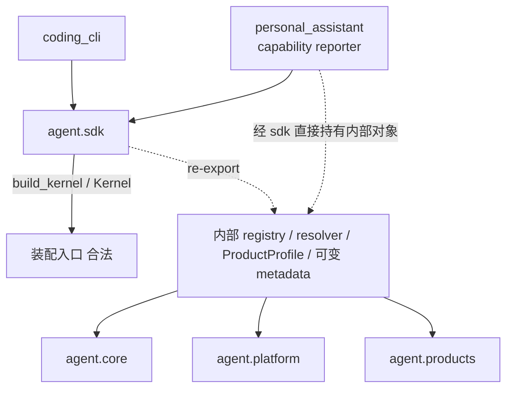
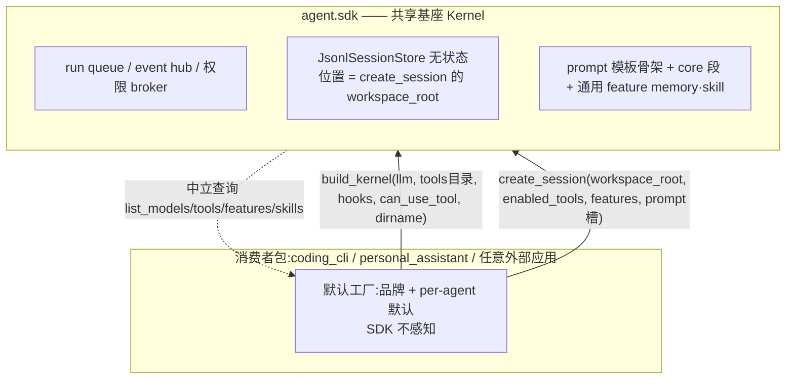
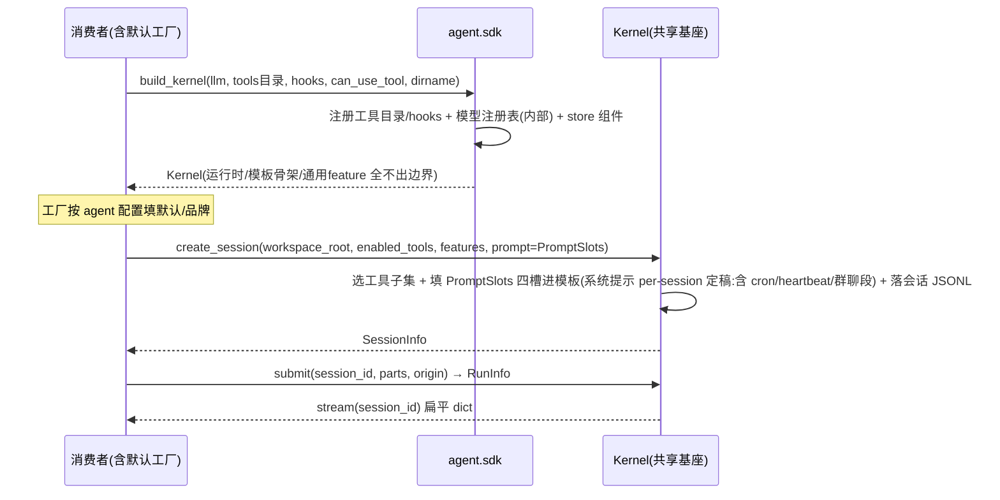
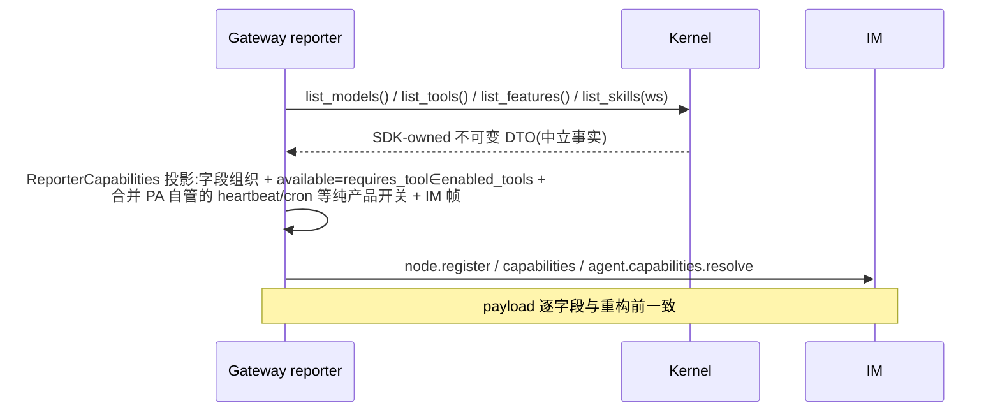

# refactor-406: 收敛 agent.sdk 公共表面 — 技术方案

> Unit branch: `unit/refactor-406` (will be created by orchestrator)
>
> 对齐: motivation.md v1

## Changelog

_（design 阶段留空——过程性对齐已原地收敛进正文；实施期偏差由 orchestrator/worker 追加。）_

## 现状分析

### 涉及范围

- `src/agent/sdk/` 当前既是内核装配入口，也是 `core` / `platform` / `products` 内部对象的
  转发出口。本 unit 收敛其顶层公开符号、Kernel 方法签名和装配/会话配置。
- `src/agent/platform/bootstrap.py`（`bootstrap_product`）当前把产品 profile 解析为 tool/
  hook/skill/config/session 等运行时对象。本 unit 把"工具目录装配"挪到 `build_kernel` 入参、
  "per-agent 配置"挪到 `create_session`，目录约定 `_product_root()` 退役。
- `src/agent/products/`（local_coding / personal_assistant 的 profile / prompt_sections /
  tools）—— 本 unit **解散**：产品定义逻辑下沉到各消费者包（`src/coding_cli/`、
  `src/personal_assistant/`）作为默认工厂；内核侧只保留产品中立的模板骨架 + 通用 feature。
- `src/agent/core/agent/prompt_sections/` —— 内核**模板骨架**（`PromptSection` 等）所在；产品段从
  `products/*/prompt_sections.py` 退场后，这里只留产品中立骨架（Milestone 范围列的此路径即指它，
  与上一条 products 侧的 `prompt_sections.py` 是不同层）。
- `src/personal_assistant/reporter/upstream_reporter.py` 当前直接消费 SDK 转发的 registry /
  resolver / profile / feature registry，自建磁盘布局链拼 IM capability payload。本 unit 改为
  调 `kernel.list_*()` 中立查询 + Gateway 自己投影。
- `src/personal_assistant/main.py`、`gateway/inbound_pipeline.py`、`src/coding_cli/commands.py`
  是公共表面迁移的主要调用方。
- `tests/contract/` 已有产品只能 import `agent.sdk` 的方向守卫（`test_agent_sdk_boundary_contract`）
  和行为冒烟（`test_agent_sdk_surface_contract`），但没有精确名单 / 所有权守卫。

### 既有约束

- `coding_cli` / `personal_assistant` 只能 import `agent.sdk`，不得迁移成直接依赖
  `agent.core` / `agent.platform` / `agent.products`。
- `agent.sdk` 可向下装配 `core` / `platform`，不能反向依赖 `coding_cli` / `personal_assistant` / `IM`。
- **内核必须产品中立**：经讨论确立的判据——内核只持有"进程级共享的真实资源"与"提示词工程 IP
  （模板骨架 / 缓存前缀 / 通用 feature）"；任何产品专属的身份、文案、工具、机制、条件 prompt
  都不进内核。两个一方产品（coding_cli / personal_assistant）与任意外部应用对 SDK 完全对等，
  内核眼里没有"一方产品"。
- 标准化扩展点 = `build_kernel` 的工具目录 / hooks + `create_session` 的 per-agent 配置；
  产品默认值是消费者工厂的事，不进 SDK。
- capability payload 的 models / skills / tools / 默认值 / 顺序 / workspace 差异为迁移不变量；
  prompt 在相同条件下逐字节等价（黄金等价测试守）。
- 本 unit 不为错误公开的内部符号提供兼容层；不顺带重构与 SDK 边界无关的 core/platform 问题。
- public API 必须有 Google 风格 docstring；测试先落最窄 SDK/Gateway/CLI 契约层，再跑跨包 contract。

### 契约层 Grounding

- `docs/specs/kernel/spec.md` 与当前代码在"产品只经 `agent.sdk` 进程内调用内核"上一致，但它仍以
  旧装配参数和内部类型描述公共接口，没有定义精确公开面、2 层装配/会话契约。本 unit 的 kernel
  delta-spec 系统重写 SDK 公共契约相关章节；会话、运行、流式事件、权限的既有**行为**语义不变。
- `docs/specs/gateway/spec.md` / `im/spec.md` 与 capability 查询、工作区 skill 差异、配置同步的当前
  代码一致，本 unit 保持其外部行为，不产生 Gateway/IM 行为增量。
- `docs/specs/cli/spec.md` 与 CLI 进程内创建 Kernel、流式、权限交互一致；本 unit 只换内部调用契约，
  不产生 CLI 行为增量。

### 可复用能力

- `bootstrap_product()` 的"一次解析得到 tool/skill registry、config resolver、默认工具、prompt"
  仍可复用其装配逻辑，但拆成 `build_kernel`（共享部分）+ `create_session`（per-agent 部分）两段。
- `Kernel.stream()` 已把内部 `StreamEvent` 转成稳定 dict——本 unit 沿用这条"边界处转换"facade 模式
  到所有 Kernel 出入参。
- `JsonlSessionStore` 已是**无状态** per-workspace JSONL 写手（位置由调用方传的 `workspace_root`
  当场拼）——正好支撑"会话位置 per-agent、store 组件共享"。
- Gateway 的 `ReporterCapabilities` / payload builder 继续作产品 adapter，只把底层数据源换成
  `kernel.list_*()`。

### 相关历史

- `refactor-387` 把独立 HTTP Kernel 改为进程内库，建立产品只 import `agent.sdk` 的方向约束；
  本 unit 完成其"稳定公共契约"部分并进一步取消产品层。
- `feat-379` / `feat-394` 建立当前 models/skills/tools/features capability 语义与 per-agent
  workspace 差异（回归基线）；其中把 communication_context 等 hook 拉进了内核段——本 unit 部分
  反向（条件 prompt 回 hook）。
- `bugfix-402` 引入 host capability dispatcher 作"cron 工具困在内核包"的折中桥；本 unit 把 cron
  迁出内核（决策 9），从根上消除该折中。

### 关键取证（决策依据）

下沉自各决策的代码事实，供需要细节的读者核对；决策段只引结论。

- **三段条件 prompt 全 per-session（决策 3/8）**：`create_session` 仅首次建会话、`submit` 不带
  participants/flags、`_ensure_binding` 有 binding 即复用——heartbeat/cron/群聊都在 create_session 时由
  agent 配置定、整会话不变。heartbeat poll 触发消息走调度器现有 `_build_heartbeat_message`，与系统提示
  无关、独立存在。群聊段现状渲染在 order 900（易变尾部之后）。
- **Protocol 避免 core→sdk 倒挂（决策 2）**：运行时工具/hook 收到的是内核真造的
  `core.tools.base.ToolContext` / `core.hooks.registry.HookAPI`；若公共契约用 sdk 具体类，内核需 import
  sdk 去造它 = core→sdk 倒挂。Protocol 是鸭子结构契约（与现有 `loader._is_tool()` 一致），内核对象天然
  满足、无需 import sdk。
- **model 现状本就 kernel 级（决策 5）**：`reconfigure_llm` 实为 CLI `/model` 机制
  （`coding_cli/commands.py:535`）；PA 不调它、`create_session`/`submit` 不带 model、runtime 用单一
  `self._llm_config.model`——故 PA 现状所有 agent 同一 model。
- **产品实际消费的 Kernel 出参字段（决策 6）**：只用 `session.session_id`、`run.run_id`/`.session_id`、
  status 字符串、`RunOrigin` 值——DTO 字段以此为限。C1 类型消费点：`RunOrigin` 在 core 的
  runtime/runs.registry/context_fork 大量用；`PermissionDecision` 在 platform `permissions.broker`；
  `TERMINAL_RUN_STATUSES` 是 core frozenset 常量；`CanUseToolFn` 定义在 `agent/sdk/kernel.py`（本就
  sdk-owned 的 `Callable` 别名）。
- **HostCapabilityDispatcher 唯一消费者是 cron（决策 9）**：`agent/core/tools/host_capability.py` 的
  dispatcher/context 仅 cron 工具用；决策 1/2 解开"产品工具困在内核包"限制后，桥（bugfix-402 折中）失去
  理由，cron 闭包改用 `call_soon_threadsafe` 直连 `CronExecutionService`。
- **FEATURE_REGISTRY.layer 死字段（决策 3）**：全仓无消费者，删除。

## 架构总览

> 打底图（静态结构 / 依赖）。终态是 2 层 + 消费者工厂：build_kernel 建共享基座，
> create_session 每 agent 带配置；SDK 里没有"产品"对象。

### Before



产品经 `agent.sdk` 持有内部 registry/resolver/profile/可变 metadata（虚线），SDK 边界只在语法上成立；
且"产品层"（`ProductProfile` / `LOCAL_CODING_PROFILE` / `PERSONAL_ASSISTANT_PROFILE`）把共享资源、
per-agent 配置、默认值混成一个对象。

### After（2 层 + 消费者工厂）



核心：**共享基座**（`build_kernel` 一次，持进程级共享资源）+ **per-agent 会话**（`create_session`
每 agent 带齐能力配置）。"产品默认值 + 品牌"退化为消费者包里的工厂函数，SDK 完全不知道"产品"。
内部对象一律止于 SDK 边界（出入参全转成 SDK-owned 类型）。三类消费者用法完全同构。

## 设计基准：对标 CC Agent SDK

CC Agent SDK 对外只有 `query()` / `ClaudeSDKClient(options)` + 扁平 `ClaudeAgentOptions`，扩展点只有
**tool / hook / 权限回调**，**没有"feature"也没有"产品"对象**——每个会话由 options 配齐。我们照这个
"小而清爽"的形状，只在产品形态（一个 Kernel 多 agent + IM + 多 provider + 个人助手自动化）逼出来的
几处有意加厚，且**把 CC 的"options per 会话"拆成"共享基座 build_kernel + per-agent create_session"**
（因为我们一个 Kernel 多 session，共享资源该建一次）：

| 维度 | CC | 我们（有意的差别） |
|---|---|---|
| 装配形状 | `ClaudeSDKClient(options)` 一个会话一份 options | `build_kernel(共享基座)` + `create_session(per-agent)` 两层（一 Kernel 多 session） |
| 加工具 | 只能 MCP（隔离） | `build_kernel(tools=...)` 装**原生工具目录**，工具拿富 `ToolContext`；`create_session` 选子集 |
| 加 hook | 标准化（matcher + 返回决策） | 标准化但更厚（INTERCEPT/OBSERVE/BACKGROUND）；不注入系统提示 |
| system prompt | 扁平字符串 / preset+append | 内核模板骨架 + `create_session(prompt=PromptSlots)` 填槽（纯 per-session）；per-turn 内容走消息 |
| 产品定义 | 内部 preset `claude_code` | **无产品对象**；品牌/默认在消费者工厂 |
| 会话/运行 | `query()`/`receive_response()` | 颗粒生命周期 + `submit_permission_decision`（IM 卡带外） |
| LLM | 扁平 model + env | `build_kernel(llm=catalog/连接)` + `list_models()`；model 维持 kernel 级（CLI `/model` 走 `reconfigure_llm`） |
| 能力查询 | 无 | `list_models/tools/features/skills`（供 Gateway IM 投影） |
| feature | 无 | 内核只留通用两条（memory/skill，配内核内置工具）；产品专属条件 prompt(cron/heartbeat/群聊)全 per-session,走 PromptSlots 四槽 |
| 副作用工具 | 你的工具闭包在你 app 里，无回桥 | **同 CC**：产品副作用工具（cron）住产品包闭包直连，无回桥（决策 9） |

## 关键决策

> 每条决策第一行是**给人审核的一句话结论**（扫这行就懂选了啥）；下面是给 worker 的细节。代码取证下沉
> §现状分析「关键取证」，决策只引结论。

### 决策 1：取消"产品层" — build_kernel(共享基座) + create_session(per-agent)

**选了 2 层装配 + 消费者工厂：SDK 不再有"产品"对象，`build_kernel` 建一次共享基座、`create_session` 每 agent 带配置，`agent/products/` 解散。**

- **入口**：`build_kernel(llm, tools, hooks, can_use_tool=None, workspace_config_dirname, repo_root=None)` 建进程级共享基座（LLM 连接、工具目录、hook 注册表、会话存储组件、run queue / event hub / 权限 broker）；`create_session(workspace_root, enabled_tools, features, prompt, …)` 每 agent 带齐配置。不导出 `ProductDefinition` / `LOCAL_CODING` / `PERSONAL_ASSISTANT`；"产品默认值 + 品牌"= 消费者包工厂，SDK 不感知。
- **理由**：产品层把"共享资源 / per-agent 配置 / 默认值"三类混进一个对象，是伪抽象。判据：进程级共享真实资源→build_kernel、按 agent 变→create_session、只是默认值→消费者工厂。这样 agent 间可真差异（不再"共享一套只能 allowlist 过滤"），两个一方产品与外部应用对等（对标 CC SDK，见§设计基准）。
- **拒绝**：保留 `ProductDefinition` 作"默认包"——仍三类混淆、逼出"工具共享一套只能过滤"。每 agent 独立 Kernel（CC 式一会话一 client）——多 agent 网关下 N 个 run queue / LLM 连接，资源浪费。
- **风险**：`create_session` 变重；须保证共享资源不因 per-session 配置重复实例化（基座持目录、session 选子集、不重建）。

### 决策 2：能力扩展 — 原生 Tool/Hook 对象，基座装目录、会话选子集；契约为 SDK-owned Protocol

**选了原生对象目录 + SDK-owned 结构化 Protocol：`build_kernel(tools, hooks)` 收原生对象目录，`create_session(enabled_tools)` 选子集；`Tool`/`ToolContext`/`HookAPI` 是 Protocol 不是具体类。**

- **形态**：`Tool` = `name`/`description`/`input_schema`/`run(args, ctx)` 结构化 Protocol（+ 可选便利基类）；`ToolContext`/`HookAPI` 同为只声明承诺字段子集的 Protocol。目录约定 `bootstrap._product_root()` 扫描退役；工作区 `.nano/tools` 运行时发现机制不变（另一机制）。
- **理由**：对象直传——类型安全、可单测、IDE 补全、不依赖文件布局，CC 一致；一 Kernel 多 session 下目录共享一次比 per-session 重传省。用 Protocol 而非 sdk 具体类是为避免 core→sdk 倒挂（取证见§现状分析）。
- **拒绝**：`tool_dirs` / 继承内核基类——泄漏内部实现、不可单测。
- **风险**：`ctx` 承诺字段子集 + hook 事件名集合成为公共契约，delta-spec 逐项列；非承诺字段不进 Protocol = 不承诺。

### 决策 3：feature — 内核只留通用两条，产品专属内容走 PromptSlots / 消息

**选了内核 feature 只留配内置工具的通用两条（memory/skill），heartbeat/cron/群聊不是内核 feature、全走 per-session 的 PromptSlots。**

| feature key | default_on | requires_tool | guidance 段 |
|---|---|---|---|
| `memory_curation` | ✅ true | `memory`（内核内置） | `core.memory_guidance` |
| `skill_creation` | ✅ true | `skill_manage`（内核内置） | `core.skills_guidance` |

- **机制**：两条开关在 `create_session(features={...})`，gate 内核模板对应 core 段（flag 开 + requires_tool 在场）。heartbeat/cron/群聊三段经核实全是 per-session（取证见§现状分析），由 `pa_factory.prompt_for(agent)` 拼进 PromptSlots（cron/heartbeat→body，群聊→tail，位置见决策 8）。`FEATURE_REGISTRY.layer` 死字段删除。
- **理由**："产品和外部应用无区别"→外部应用不能往内核塞 feature→PA 的 heartbeat/cron 也不能是内核 feature；只有装了对应机制才有意义的段不是通用 feature。通用两条配内核内置工具（任何应用都有）留内核合理。三段全 per-session → 内核中立 + 系统提示纯 per-session + 逐字节一致三者同时成立。
- **拒绝**：heartbeat/cron 留内核当"offered feature"——名不副实。产品传 `FeatureDefinition`——暴露 `PromptSection`/`PromptContext`/flags ABI。把三段挪 per-turn 消息（早期误判）——改 prompt 结构、破坏逐字节一致。
- **风险**：三段迁 PA PromptSlots，文本与位置须逐字节复现（heartbeat 守 K2.6 反射、群聊守 bugfix-358）；黄金等价测试钉死。

### 决策 4：能力查询 — Kernel 单项中立查询，Gateway 投影

**选了 Kernel 提供四个单项中立查询（list_models/tools/features/skills）返回 SDK-owned 不可变 DTO，产品语义投影归 Gateway。**

- **接口**：`list_models()`（模型+默认，CLI 选择器同用）、`list_tools()`（name/description）、`list_features()`（内核通用两条）、`list_skills(workspace_root)`。Gateway reporter 调它们投影成 IM payload（字段组织、按 enabled_tools 算 `available`、组帧），并把内核两条 + PA 自管纯产品开关（heartbeat/cron）合并投影，与内核目录不必一一对应。SDK 撤出 reporter 专用导出（`SkillRegistry`/`ConfigResolver`/`default_skill_search_roots`/`FEATURE_REGISTRY`/model registry 列表函数）。
- **理由**：消除 Gateway 手工重建内核磁盘布局（`upstream_reporter._product_root()`，现状最深越界）；查询来自已装配 Kernel，与运行时能力天然一致。单项查询是中立事实，"打包快照"形状由上报需求反向定义、不进内核。
- **拒绝**：`kernel.capabilities()` 聚合快照——产品需求反向定义内核接口。模块级查询函数——重引入初始化顺序问题。
- **风险**：四查询字段并集须覆盖 reporter 现用每项事实；迁移前先做"查询字段↔payload 字段"映射表。

### 决策 5：LLM — build_kernel 装 catalog/连接，model 维持 kernel 级（scope A）

**选了 `build_kernel(llm=LLMConfig)` 装目录+连接、注册表内部初始化、出入参 DTO 化；model 维持现状 kernel 级（不进 create_session）。**

- **范围**：`LLMConfig` 装 providers/models 目录+默认+连接，注册表初始化在 `build_kernel` 内部（"先 init 再 from_env" footgun 按构造消失），提供 `LLMConfig.from_env()`。撤出 `init_model_registry`/`get_default_model`/`get_default_provider`/`list_provider_models`/`list_supported_providers`/`LLMFactoryConfig`/`LLMConfigPayload` 全家；`get_llm_config()`/`reconfigure_llm()` 返回 SDK-owned `LLMConfig` DTO。
- **model 维持 kernel 级（scope A，守行为不变）**：`create_session` 不收 model，CLI `/model` 继续走 `reconfigure_llm`。PA 现状本就所有 agent 同一 model（取证见§现状分析），本 unit 原样保持。per-agent model 是行为新增，留单独 unit。
- **理由**：连接/目录是部署期共享事实→build_kernel；本 unit 只做 LLM 表面收敛，与 model 粒度正交。
- **拒绝**：model 改 per-session（scope B）——行为新增，超出"收敛表面"边界。LLM 目录并入 per-session——每会话重传部署配置，冗余。
- **风险**：内部全局注册表消费点多，worker 评估 build_kernel 内部初始化波及面；`reconfigure_llm` DTO 化须保 CLI `/model` 切换即时生效。

### 决策 6：Kernel 出入参 — SDK-owned 类型 + C1 豁免

**选了 Kernel 方法签名全用 SDK-owned 冻结 DTO（SessionInfo/RunInfo/LLMConfig），少数 core/platform 必拥有的边界类型走 re-export + 闸 2 豁免。**

- **DTO 化**：`create_session`/`fork_session`→`SessionInfo`（session_id/title/workspace_root/metadata）；`submit`/`get_run`/`cancel`→`RunInfo`（run_id/session_id/status）；`compact`/`append_message`/`list_session_tools`→定型 DTO/dict；`get_llm_config`→`LLMConfig`。这三个是真 SDK-owned 纯边界 DTO（边界处映射、core 不回引），字段以产品实际消费为限（取证见§现状分析）。
- **C1 边界类型（re-export + 闸 2 豁免）**：`RunOrigin`、`PermissionDecision`、`TERMINAL_RUN_STATUSES`——core/platform 大量引用、搬进 sdk 会倒挂，保持其拥有、sdk re-export（消费点取证见§现状分析）。`CanUseToolFn` 是 sdk-owned 的 `Callable` 别名（无 class `__module__`），闸 2 对 typing 别名特殊处理，不在 C1 豁免之列。
- **理由**：现状 Kernel 把内部 `Session`/`RunRecord` 整个端给产品，内部重构任一字段即隐式契约变更；typed DTO 给产品 IDE 补全与类型检查。
- **拒绝**：全返裸 dict（方法返回值应 typed）；继续 re-export 内部 dataclass（正是要消除的）。
- **风险**：属性名与现状一致（session_id/run_id/status），迁移基本无感；核对 Gateway `_KernelClientShim` 实际触碰字段。

### 决策 7：公共表面守卫 — 精确名单 + 所有权 + 豁免名单（contract 测试）

**选了在既有 contract 测试加两道闸：精确名单（`__all__ == EXPECTED_SURFACE` 逐字相等）+ 所有权（导出 `__module__` 须 sdk-owned，C1 走显式豁免名单）。**

- **两道闸**：① 精确名单——增删导出必须同步改 `EXPECTED_SURFACE`，"扩公共契约"成为 PR 里显式可 review 的动作。② 所有权——每个导出 `__module__`（实例按 `type(obj).__module__`）默认以 `agent.sdk` 开头；C1 类型（`RunOrigin`/`PermissionDecision`/`TERMINAL_RUN_STATUSES`）列入逐字钉死的豁免名单；`CanUseToolFn` 作 typing 别名特殊处理，不在豁免之列。既有方向守卫保留不动。
- **理由**：现状只有方向守卫、无表面守卫，正是"产品每要一个内部对象就加一行 re-export"反复发生的根因；contract 测试是本仓既有架构守卫惯例。
- **拒绝**：纯文档约定（已被证伪）；自定义 lint（表达不了所有权来源、偏离惯例）。
- **风险**：名单成为高频 review 焦点（设计目的，非缺陷）。

### 决策 8：prompt 组装 — 内核模板骨架 + PromptSlots（head/body/custom/tail），系统提示纯 per-session

**选了内核拥有固定顺序模板骨架，产品文案经 `create_session(prompt=PromptSlots)` 四槽填入、纯 per-session，产品不向系统提示做 per-turn 注入。**

- **骨架顺序**：head → core 行为规则 → 通用 feature 指引（memory/skill）→ body → 后台任务/runtime footer → 内核易变尾部(memory 快照/时间) → tail（排序/缓存前缀分界是内核 IP）。
- **四槽**（`PromptSlots` 为 SDK-owned 值对象，每槽一组 `PromptText(name, text)`）：`head`=身份/persona（core 规则前）；`body`=守则 + cron/heartbeat 指引（core 规则后、稳定前缀内）；`custom`=用户自定义指令；`tail`=内核易变尾部之后的最末（群聊上下文落此，对齐现状 order 900）。
- **纯 per-session**：产品内容由 `pa_factory.prompt_for(agent)` 在 create_session 一次拼好（三段都在此，见决策 3），整会话不变；内核易变尾部由内核自管，产品不碰。v4 给 hook 加的 `additional_system_prompt` 撤销（PA 三段经核实全 per-session、无 per-turn 系统提示需求）。`ProductProfile.prompt_sections*`/`PromptSection`/`PromptContext`/`RenderMode` 全家保持内核内部，不进公共面。
- **理由**：产品所有条件内容都 per-session → 全经 PromptSlots 四槽注入、内核模板零 PA 段；tail 槽专为复现群聊段尾部位置，使逐字节一致 + 内核中立 + 纯 per-session 三者同时成立。
- **拒绝**：公开 `PromptSection` 协议（ABI 泄漏）；给系统提示加 per-turn 注入通道（三段本就 per-session、徒增表面）；把三段挪 per-turn 消息（早期误判）——破坏逐字节一致。
- **风险**：四槽文案+位置须逐字节复现（heartbeat 守 K2.6 反射、群聊守 bugfix-358）；黄金等价测试钉死。

**system prompt preview（IM agent 设置页）**：
- **IM 契约不变**：`POST /im/v1/agents/{id}/prompt-preview` 请求/响应字段（features/custom_prompt/tool_ids/scenario/skill_ids/heartbeat_enabled/cron_enabled → {prompt, section_count}）一字不动，用户侧无感（im/gateway 无 spec delta）。
- **同源**：PA 预览 provider 用同一 `prompt_for` 工厂构造"假想 agent 配置"的 PromptSlots，预览所见=真实所跑。内核预览方法 `kernel.assemble_prompt_preview(*, prompt=PromptSlots, features, enabled_tools, workspace_root, scenario)` 走 `RenderMode.PREVIEW`（易变尾部出 `<runtime-injected:…>` 占位）→ `{prompt, section_count}`，内核侧 product-neutral。
- **同源即同测**：预览与真实走同一工厂+模板，同一黄金等价测试同时守两者 byte-identical，比现状（内核里另做一套 preview 门控）更不易漂。

### 决策 9：产品副作用工具归位 — cron/send_message/web_search 迁出内核

**选了 PA 专属工具迁到 `src/personal_assistant/` 经 `build_kernel(tools=)` 传入，副作用工具闭包直连自己的服务，`HostCapabilityDispatcher` 整组删除。**

- **迁移**：PA 工具从 `agent/products/personal_assistant/tools/` 迁 `src/personal_assistant/`；cron `run()` 闭包直接持有 Gateway 的 `CronExecutionService`（跨线程入队自行 marshalling），不经内核回桥。`HostCapabilityDispatcher`/`HostCapabilityContext` + `build_kernel` 的 `host_capabilities=` 参数 + `_inject_host_capabilities` 整组删除（唯一消费者是 cron，取证见§现状分析）。纯工具（bash/read/edit/write/agent…）留作内核 built-in 进目录。
- **理由**：对标 CC——自定义工具住你 app 里、闭包访问你的子系统，从不需要"工具反向回调宿主"的桥。桥是"产品工具困在内核包"逼出来的折中（bugfix-402）；决策 1/2 解开限制后桥失去理由，删桥并消解 C1 里 HostCapability 的归属矛盾。
- **拒绝**：保留 dispatcher 仅给 cron 用——为可删的桥长期开豁免口。
- **风险**：cron 是有测试的在用功能，迁移须保 ① 工具行为 ② 跨线程入队语义 ③ per-agent 路由（按 `agent_id` 路由到对应 `CronExecutionService`，迁后由 Gateway 装配时绑定）。对策：cron 单测 + e2e 旅程迁移前后过绿。

### 决策 10：会话存储 — JsonlSessionStore 无状态，位置由 workspace_root

**选了沿用现状：会话档案 = 每会话一个 append-only JSONL，store 组件无状态共享、位置由 `create_session(workspace_root)` 决定。**

- **落位**：`{workspace_root}/{workspace_config_dirname}/sessions/{session_id}.jsonl`；`JsonlSessionStore` 不持 `session_id→位置` 映射、调用方每次传 `workspace_root` 当场拼。`build_kernel` 持 store 组件 + `workspace_config_dirname` 约定（部署常量），位置 per-agent。无中心 session db 路径要配。
- **理由**：现状即如此，正好印证"store 组件共享、位置 per-agent"，是 2 层模型的天然例证。
- **拒绝**：中心化 session db 路径——与无状态 per-workspace 现状不符，且把 per-agent 位置错配成全局。
- **风险**：无（描述现状+明确归位）；注意区分会话档案 JSONL 与 `global_config_root/<session_db>` 全局配置文件（另一码事，本 unit 不动其语义）。

### 决策 11：迁移策略 — 三段式扩张/迁移/收缩（2 milestone 按消费者域垂直切，一次做到终态）

**选了三段式共存迁移（扩张→迁移→收缩，roadpoint 粒度）+ milestone 按消费者域垂直切 2 个（M1 sdk核心+CLI → M2 Gateway能力查询）。**

- **三段式（M1 内 roadpoint，非 milestone）**：① 扩张：新入口在 SDK 长出来、旧导出不动、全测试零改动保持绿；② 迁移：消费方逐个切（产品定义下沉工厂+黄金 prompt 钉字节、CLI 切、reporter→list_*、cron 迁出；动 reporter 前先录 capability payload 基线 fixture）；③ 收缩：删旧导出 + 决策 7 守卫落闸。每步独立 commit 可单独 revert。
- **milestone 拆 2**（详见 Milestones 段）：`M1 sdk-core-and-cli`（sdk 核心不可分大块 + CLI + cron + products 解散）→ `M2 gateway-capability`（reporter 切 list_*，唯一可垂直剥离的独立块，隔离 capability payload 漂移分阶段验证）。scope 仍是一次做到架构终态，只是分到两个派发单元。
- **理由**：`agent.sdk` 是两个在线产品唯一入口，原地改签名会让全消费方+测试同 commit 全改、回退粒度归零。三段式共存保回退粒度。
- **拒绝**：一步到位改签名（无回退粒度）；先删后迁（只能向前修）。
- **风险**：共存期 SDK 表面临时变大，靠收缩收口；本 unit 改动面广（sdk/products 解散/bootstrap/两消费者包），实施期独占这些路径。


## 接口与数据流

### 最终公共表面（决策 7 守卫名单的内容来源）

| 类别 | 导出 | 形态 | 替代的旧导出 |
|---|---|---|---|
| 装配 | `build_kernel(llm, tools, hooks, can_use_tool=None, workspace_config_dirname=…, repo_root=None)` | 函数 | 同名（签名重构：去 `product_profile`，改收基座入参） |
| 装配 | `Kernel` | 类 | 同名 |
| 工具/hook 契约 | `Tool` | SDK-owned 结构化 Protocol + 可选便利基类 | （新增） |
| 工具/hook 契约 | `ToolContext` | SDK-owned 结构化 Protocol（承诺字段子集，U3） | `agent.core.tools.base.ToolContext` 直 import |
| 工具/hook 契约 | `HookAPI` | SDK-owned 结构化 Protocol（U3） | （新增） |
| prompt | `PromptSlots`（head/body/custom/tail 四槽）/ `PromptText` | 冻结值对象 | profile.prompt_sections* 字段 |
| LLM | `LLMConfig`（含 `.from_env()`） | 冻结 dataclass（SDK-owned） | `LLMFactoryConfig` + `LLMConfigPayload` 全家 + `init_model_registry` |
| 结果 | `SessionInfo` / `RunInfo` | 冻结 dataclass（SDK-owned 纯边界 DTO） | 内部 `Session` / `RunRecord` |
| 枚举/常量（豁免） | `RunOrigin` / `TERMINAL_RUN_STATUSES` | core 拥有、sdk re-export、闸2 豁免 | 同名 re-export |
| 权限（豁免） | `PermissionDecision` | platform 拥有、sdk re-export、闸2 豁免 | 同名 re-export |
| 权限（sdk-owned） | `CanUseToolFn` | sdk-owned `Callable` 别名（已在 sdk.kernel） | 同名 |

**整体撤出、无替代**：`ProductDefinition` 概念（含 `LOCAL_CODING_PROFILE` / `PERSONAL_ASSISTANT_PROFILE`）、
`SkillRegistry`、`ConfigResolver`、`default_skill_search_roots`、`FEATURE_REGISTRY`、`init_model_registry`、
`get_default_model` / `get_default_provider` / `list_provider_models` / `list_supported_providers`、
`HostCapabilityDispatcher` / `HostCapabilityContext`（决策 9 删除）。

### build_kernel / create_session 入参面（2 层的核心）

| 入口 | 关键入参 | 性质 |
|---|---|---|
| `build_kernel` | `llm`（目录+连接）、`tools`（原生工具目录）、`hooks`、`can_use_tool`、`workspace_config_dirname` | 进程级共享基座 |
| `create_session` | `workspace_root`、`enabled_tools`（从目录选）、`features`（内核两条开关）、`prompt`（PromptSlots）、`title`、`metadata`（不含 model；model 维持 kernel 级，决策 5） | per-agent |

### Kernel 方法面（变更点）

| 方法 | 现返回/签名 | 改后 | 备注 |
|---|---|---|---|
| `create_session` | 内部 `Session`，仅 allowlist | `SessionInfo`，收 enabled_tools/features/prompt（不收 model） | 决策 1/6 |
| `fork_session` | 内部 `Session` | `SessionInfo` | 决策 6 |
| `submit` / `get_run` / `cancel` | 内部 `RunRecord` | `RunInfo` | 决策 6 |
| `compact` / `append_message` / `list_session_tools` | `Any` | 定型 DTO / dict | 决策 6 |
| `get_llm_config` | 内部 `LLMFactoryConfig` | `LLMConfig` DTO | 决策 5 |
| `reconfigure_llm` | 内部 `LLMFactoryConfig` | **保留**（CLI `/model`），返回 `LLMConfig` DTO | 决策 5 |
| `assemble_prompt_preview` | 现状（features/custom_prompt/tool_ids → prompt） | 入参对齐 create_session：`prompt=PromptSlots`/`features`/`enabled_tools`/`workspace_root`/`scenario`，PREVIEW 渲染（详见决策 8 预览节） | 决策 3/8 |
| `list_models/list_tools/list_features/list_skills` | （新增） | SDK-owned DTO | 决策 4 |
| `stream` / `get_session` / `interrupt` / `submit_permission_decision` / `current_event_sequence` / `aclose` | 不变 | 不变 | 已稳定 |

### 数据流 1：装配 + 开会话（主流程时序）

> 共享基座建一次，每 agent 经 create_session 带配置；内部对象止于边界。



### 数据流 2：Gateway 能力上报



### 扩展作者契约

- Tool：对象满足 `name: str` / `description: str` / `input_schema: dict` /
  `run(args: Mapping, ctx: ToolContext) -> Mapping`；`ToolContext` 是 SDK-owned 结构化 Protocol，
  承诺字段子集在 delta-spec 逐项列（基线 `session_metadata` / `repo_root` / 工作区路径族）。要触达产品
  子系统的副作用工具，在产品包内闭包直连自己的服务后经 `build_kernel(tools=)` 传入，不经内核回桥。
- Hook：callable `setup(hooks: HookAPI) -> None`；`hooks.on(event, handler, mode=…)`（tool_call 拦截 /
  observe / 后台等）。事件名集合为公共契约。hook **不注入系统提示**——系统提示纯 per-session（决策 8）。
- 条件 prompt（cron/heartbeat/群聊）：全 per-session，由消费者工厂在 `create_session(prompt=PromptSlots)`
  按 agent 配置拼（cron/heartbeat → body，群聊 → tail）。不经 hook、不经 per-turn 消息注入。
- Skill：产品自带 skill 经 `build_kernel`/目录约定提供（部署级）；per-agent skill 由 `create_session`
  的 `workspace_root` 在运行时解析（`list_skills(workspace_root)` 同源）。

## SDK 用法（端到端示意）

> 示意，钉"长什么样、谁调谁"，符号名实现期可微调。三类消费者用**同一对**入口
> `build_kernel(基座)` + `create_session(per-agent)`，差别只在传入内容；SDK 里没有"产品"。
> model 维持 kernel 级（决策 5 scope A）：`create_session` 不带 `model`；CLI `/model` 走 `reconfigure_llm`。

### A. coding_cli

```python
# src/coding_cli/product.py —— 消费者自己的默认工厂(SDK 不感知)
from agent.sdk import build_kernel, LLMConfig, PromptSlots

def build_cli_kernel():
    return build_kernel(
        llm=LLMConfig.from_env(),
        tools=[Bash(), Read(), Edit(), Write(), AgentTool(), …],   # 工具目录
        hooks=[…],
        can_use_tool=terminal_prompt,            # 终端 y/n(权限机制,进程级)
        workspace_config_dirname=".nanocode",
    )

def open_cli_session(kernel, cwd):
    return kernel.create_session(
        workspace_root=cwd,
        enabled_tools=["bash","read","edit","write","agent"],
        features={"memory_curation": True, "skill_creation": True},
        prompt=PromptSlots(head="# Nano Coding CLI\n…", body="## Guidelines\n…"),
    )
# /model:CLI 改 kernel 级 model(scope A)
kernel.reconfigure_llm(model=picked)                                   # 返回 LLMConfig DTO
# 跑一轮
run = kernel.submit(session_id=session.session_id, parts=[…], origin=RunOrigin.USER)  # RunInfo
async for ev in kernel.stream(session.session_id):
    if ev.get("event")=="run_status" and ev["status"] in TERMINAL_RUN_STATUSES: break
```

### B. personal_assistant

```python
# src/personal_assistant/product.py
from agent.sdk import build_kernel, LLMConfig, PromptSlots
from personal_assistant.scheduler import CronExecutionService
from personal_assistant.tools import make_cron_tool, make_send_message_tool, WebSearch

def build_pa_kernel(cron_svc, im_client):
    return build_kernel(
        llm=LLMConfig.from_env(),
        tools=[Bash(), Read(), Edit(),
               make_cron_tool(cron_svc), make_send_message_tool(im_client), WebSearch()],
        hooks=[…],                               # 仅 tool_call/observe 等;不注入系统提示
        can_use_tool=None,                       # 用 IM 权限卡(submit_permission_decision)
        workspace_config_dirname=".nano-assistant",
    )

def open_agent_session(kernel, agent):
    return kernel.create_session(
        workspace_root=agent.workspace,          # 会话 JSONL 落这里
        enabled_tools=agent.selected_tools,      # UI 勾选(从目录选)
        features=agent.kernel_features,           # 只含 memory/skill
        prompt=pa_factory.prompt_for(agent),      # 产品身份 + persona + custom + (开了cron则拼cron指引/群聊则拼群规则)
    )                                             # 不带 model:维持 kernel 级(决策 5 scope A)
# 能力上报:list_* → Gateway 投影(PA 把 heartbeat/cron 等纯产品开关并进 features 投影)
# 权限:kernel.submit_permission_decision(request_id=rid, decision="allow_once")
```

PA 三段条件 prompt 全是 per-session,全在 `prompt_for(agent)` 按 agent 配置拼进 PromptSlots（cron/
heartbeat → body,群聊 → tail）,create_session 时一次注入,逐字节复现现状：

```python
# src/personal_assistant/product.py —— 消费者工厂按 agent 配置拼 PromptSlots(全 per-session)
def prompt_for(agent):
    body = ["## Guidelines …", "## Routing …"]
    if agent.cron_enabled:       body.append("## Cron Jobs …")            # 现 pa.cron 段,逐字
    if agent.heartbeat_enabled:  body.append("## Heartbeats … reply HEARTBEAT_OK")  # 现 pa.heartbeat 段,逐字
    tail = None
    if agent.conversation_type == "group":
        tail = build_communication_context(agent)   # 现 pa.communication_context,放 tail(对齐 order 900)
    return PromptSlots(head=f"# {agent.display_name}\n…", body="\n\n".join(body),
                       custom=agent.custom_prompt, tail=tail)

# 注:heartbeat poll 的**触发消息**(调度器现有 _build_heartbeat_message,默认 30m 发)与系统提示无关、
#    独立存在、本 unit 不动;它和上面 body 里的 heartbeat 指引是今天就并存的两份,逐字保留即字节一致。
```

### C. 任意外部应用 — 和 A/B 完全同构

`build_kernel(llm, tools, hooks, can_use_tool, dirname)` + `create_session(workspace_root, enabled_tools,
features, prompt)`。要副作用工具就在自己包里闭包直连后放进 `tools`；条件内容 per-session 的进
`PromptSlots`、per-turn 的进 `submit(parts=…)` 消息。**SDK 眼里 coding_cli / personal_assistant /
外部应用没有任何区别。**

## 契约层增量 (delta-spec)

- kernel: `specs/kernel/spec.md`（重写 SDK 公共契约相关章节：2 层装配/会话、Protocol 扩展点、通用 feature、
  能力查询、出入参 DTO、表面守卫）
- im / gateway / cli: no spec delta（外部行为不变）

## 风险与回退

### 已知风险

1. **prompt 字节漂移**（决策 3/8）：cron/heartbeat/群聊三段从内核 segment 迁到 PA 的 PromptSlots
   （cron/heartbeat → body，群聊 → tail），模板装配改造；目标是**逐字节复现现状**，任何措辞/顺序/位置
   漂移都破坏 K2.6 HEARTBEAT_OK 反射规避（memory: project-k26-heartbeat-ok-reflex）、bugfix-358 mention
   格式与 provider 前缀缓存。对策：黄金等价测试（PA/CLI 全 prompt 逐字节）先行落地，红了即停。
2. **capability payload 漂移**（决策 4）：reporter 数据源整体替换。对策：动 reporter 前录 node/agent
   capability payload 成 fixture，切后逐字段比对。
3. **2 层重构波及面**（决策 1/2/5）：能力从 kernel-wide 改为 create_session 选子集、model 改 session 级，
   内部消费点多。对策：分三段式共存迁移；每步独立 commit 可回退。
4. **`_KernelClientShim` 隐式字段依赖**（决策 6）。对策：迁移前 grep 垫片全部属性访问，逐一映射。
5. **共存期路径独占**（决策 11）：本 unit 跨步持续改 `agent/sdk/`、`agent/products/`（解散）、bootstrap、
   两消费者包。对策：实施期独占，orchestrator 不并行派发触碰相同文件的其他 unit。

### 回退

- 三段式每 commit 独立可 revert；迁移期任一消费方失败 revert 该 commit 回旧表面，不影响其他。
- 收缩 commit revert 恢复旧导出 + 撤守卫，回共存态。
- 无数据迁移、无配置文件格式变更（`~/.nano-assistant/config.yaml`、CLI 启动参数语义不变）。
- 回退不得恢复"产品直接 import 内核内部"（motivation 红线）。

## Runbook for Reviewer

| 服务 | 停止命令 | 启动命令 | 健康检查 |
|---|---|---|---|
| IM | `stop_pidfile .im.pid` | `IM_JWT_SECRET=<unit随机串> PYTHONPATH=src python -m uvicorn IM.app:app --host 127.0.0.1 --port $IM_PORT > .im.log 2>&1 & echo $! > .im.pid` | `curl -sf http://127.0.0.1:$IM_PORT/ >/dev/null` |
| Gateway | `stop_pidfile .gateway.pid` | `PYTHONPATH=src python -m personal_assistant.main --config $WT_CFG --im-service-url http://127.0.0.1:$IM_PORT --foreground --auto-bind > .gateway.log 2>&1 & echo $! > .gateway.pid` | `.gateway.log` 出现 node.register 成功 + IM 节点 online |
| Coding CLI | 非常驻 | `PYTHONPATH=src python3 -m coding_cli.main` | REPL 可交互、`/model` 可切换 |

推荐 `./scripts/e2e-up.sh` / `./scripts/e2e-down.sh` 一键起停。

### Reviewer 实测场景矩阵（影响甚广，逐条实测，不抽样）

> 本重构触碰 `agent.sdk` 唯一入口 + 两个在线产品 + cron/prompt 装配，受影响面覆盖全部既有产品旅程。
> reviewer **必须把下表每一条都在真实运行时实测一遍**（不靠"看起来没问题"抽样，也不以"单测绿"代替
> 旅程实证）。每条判据统一是「与重构前不变量一致」。照上方 Runbook 重启涉及服务后逐条跑。

| # | 受影响场景 | 实测操作 | 不变量判据 | 关联 |
|---|---|---|---|---|
| R-CLI-1 | CLI 带工具调用任务 | 启动 CLI，提交需读/写/执行工作区的任务 | 创建会话、流式过程、工具调用、权限询问、中断、错误反馈全与重构前一致 | S1.1 / 决策 1·6 |
| R-CLI-2 | CLI 选模型启动 | 按现有命令/参数启动并指定模型 | 正常启动并用该模型，不需迁移配置 / 改启动参数 | S1.2 / 决策 5 |
| R-CLI-3 | `/model` 热切换 | CLI 内 `/model` 切换模型 | 即时生效，后续轮用新模型 | 决策 5 |
| R-PA-1 | Web IM 发消息 | Agent 在线，既有会话发消息 | 正常处理回复，消息状态 / 流式 / 最终结果一致 | S2.1 / 决策 6 |
| R-PA-2 | IM 离线 Gateway 自治 | Gateway 配外部通道，停掉 IM，外部通道发消息 | 仍由 Gateway 交 Agent 处理并回发，不依赖 IM 在线 | S2.2 |
| R-PA-3 | IM 权限卡 | 触发需授权工具 | 权限卡弹出，allow / deny 行为与重构前一致 | 决策 6 |
| R-CFG-1 | 创建 Agent 看节点能力 | 进入 IM 创建 Agent 流程 | models/skills/tools/features/默认模型 + 默认选中 + 可用状态逐字段与 capability 基线 fixture 一致 | S3.1 / 决策 4 |
| R-CFG-2 | 跨 workspace skill 差异 | 查看不同 workspace 的 Agent 配置 | 各展示其工作区可见 skill 名 / 描述，无跨工作区混用 / 丢失 | S3.2 / 决策 4 |
| R-CFG-3 | 保存并回显配置 | 选 model/skills/tools/features → 保存 → 重开 | 同步回显，字段语义 / 默认不因重构变 | S3.3 |
| R-CFG-4 | system prompt 预览 | IM agent 设置页触发 prompt-preview，切 heartbeat/cron/custom/scenario | 预览随开关变化（不同组合产生不同预览）、预览文本与重构前一致（"预览 = 真实会话"归 `[worker]` 同源测试，不在本矩阵） | 决策 8 预览节 |
| R-GW-1 | 现有配置启动 Gateway | 用现有启动命令起 Gateway | 正常装配内核、连 IM、注册节点、报在线，无新增兼容开关 | S4.1 / 决策 1 |
| R-GW-2 | 停止 / 重启 Gateway | 现有 stop / restart | 收拢活动任务、正常退出 / 重启 | S4.2 |
| R-GW-3 | 会话档案落位 | 两个不同 workspace 的 agent 各跑一轮 | JSONL 各落自己 `workspace_root`，互不混写 | 决策 10 |
| R-CP-1 | heartbeat 实跑 | 开 heartbeat 的 agent，触发 poll | 按 heartbeat 指引行为，K2.6 不返 HEARTBEAT_OK 死反射 | 决策 3 / memory k26 |
| R-CP-2 | cron 实跑 | 建 cron job → 触发 → 执行 | 结果回投到对应 agent 的会话，定时执行与回投行为与重构前一致 | 决策 9 |
| R-CP-3 | 群聊 @ mention | 群聊会话 @ 成员 | @ 正确渲染并指向该成员、参与者名单正确，候选 picker 行为不变（mention 字节格式归 `[worker]`） | 决策 8 tail |
| R-NEW-1 | 外部产品装配 | 跑"agent 包外应用仅经 sdk 装配 + 开会话"示例 / 测试 | 跑通带工具调用一轮（含闭包直连自己服务的副作用工具），不 import 内核内部 | S5.1·5.2 / 决策 1·2 |

R-CP-1/2/3 验的是 cron/heartbeat/群聊**迁移后的运行时行为**（执行/回投、自主活动、@ 指向），与
`[worker]` 黄金测试守的「prompt 字节前后一致」**互补**——reviewer 验行为、worker 验字节，两者都要绿。
任一条不达「与重构前一致」即判 fail，按 Recommended Action 路由回 worker。

## Milestones

> 拆 2 个 milestone，**按消费者域垂直切（非横切）**。结构依据：`kernel.py`(884) 是超级汇聚点，
> 决策 1/2/4产出/5/6 全改它，sdk 核心物理上不可分 → 整块进 M1；Gateway 能力查询（决策 4 消费侧）
> 是**唯一**文件独立、可垂直剥离、有独立用户可观察退出标准（capability payload 逐字段不变）的块 →
> 剥成 M2，把决策 4 最高风险之一（payload 漂移）从 sdk 地基重构里隔离出来分阶段验证。cron 因 cron.py
> 住 `products/` 与 M1 解散耦合，留 M1。**M2 依赖 M1（串行，非并行）**；拆分收益是分阶段验证 + 风险隔离，
> 非省时。收缩不独立成 milestone：删旧导出按域分摊，决策 7 守卫名单 M1 立（所有权/豁免闸）、M2 落精确
> 名单最终闸。依赖：`M1 → M2`。

| ID | 标题 | 依赖 | 并行组 | 范围 | 退出标准 |
|---|---|---|---|---|---|
| refactor-406-M1 | sdk-core-and-cli | — | A | `src/agent/sdk/`、`src/agent/platform/bootstrap.py`、`src/agent/core/agent/prompt_sections/`、`src/agent/core/tools/host_capability.py`（删）、`src/agent/products/`（解散）、`src/coding_cli/`、`src/personal_assistant/`（cron 工具迁入 + main 装配 + prompt 工厂；**不含 `reporter/`**）、`tests/contract/`（守卫脚手架 + 所有权/豁免闸）、PA/LC 黄金测试（+ cron verbatim） | `[reviewer]` Runbook 矩阵 **R-CLI-1/2/3、R-PA-1/2/3、R-CP-1/2/3、R-GW-3、R-NEW-1** 逐条真实运行时实测通过，每条与重构前不变量一致；`[worker]` 2 层入口（build_kernel 基座 + create_session per-agent）+ `list_*`（内核侧产出）可用且有单测；`[worker]` 外部产品最小证明：测试内构造一个 agent 包外应用，仅经 `agent.sdk` 装配 + 开会话跑通带工具调用的一轮（含一个闭包直连自己服务的副作用工具）；`[worker]` PA/LC **完整 system prompt 重构前 vs 重构后逐字节等价**（基线 = 重构前快照；cron/heartbeat/群聊三段经 PromptSlots 四槽复现，位置/措辞不漂）；`[worker]` **迁移前先补 cron 段逐字节 golden**——heartbeat（`test_heartbeat_segment_verbatim_openclaw_lines`）、群聊（`test_pa_golden_group_chat_mention_text_verbatim`）已有 verbatim，但 cron 段（`test_cron_prompt_sections`）仅 `len>20` 弱断言、**无逐字节防线**，迁 cron 出内核前必须先补；`[worker]` sdk/prompt/llm/cron/dto 域旧导出清零、`HostCapabilityDispatcher`/`host_capabilities=` 删除、cron 闭包直连 `CronExecutionService`；`[worker]` 决策 7 守卫脚手架立（所有权 + 豁免闸绿；精确名单暂含 reporter 旧导出，待 M2 落最终闸）；`[worker]` `coding_cli` 仅 import 新表面；`[worker]` 全测试树（`pytest -m "not e2e"` 全收集）绿 |
| refactor-406-M2 | gateway-capability | M1 | B | `src/personal_assistant/reporter/`、`src/personal_assistant/gateway/`（capability 投影）、capability payload 基线 fixture、`tests/contract/`（精确名单最终闸） | `[reviewer]` Runbook 矩阵 **R-CFG-1/2/3/4、R-GW-1/2** 逐条真实运行时实测通过，IM 配置 Agent 的 models/skills/tools/features/默认/跨 workspace skill 差异 + prompt 预览 + 节点注册上线逐字段与重构前一致；`[worker]` reporter 数据源换 `kernel.list_*`、撤 reporter 专用导出（`SkillRegistry`/`ConfigResolver`/`default_skill_search_roots`/`FEATURE_REGISTRY`/model registry 列表函数）；`[worker]` capability payload（node/agent register + resolve）逐字段比对基线 fixture 绿；`[worker]` 决策 7 **精确名单落最终闸**：reporter 旧导出清零后 `EXPECTED_SURFACE` 逐字钉死、三道闸全绿；`[worker]` `personal_assistant` 仅 import 新表面；`[worker]` 全测试树（`pytest -m "not e2e"` 全收集）绿 |
