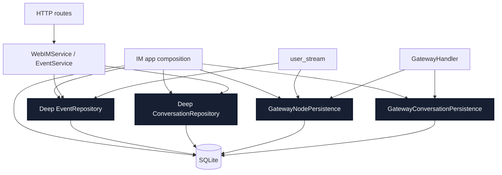
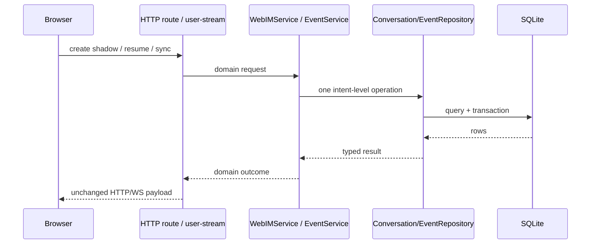
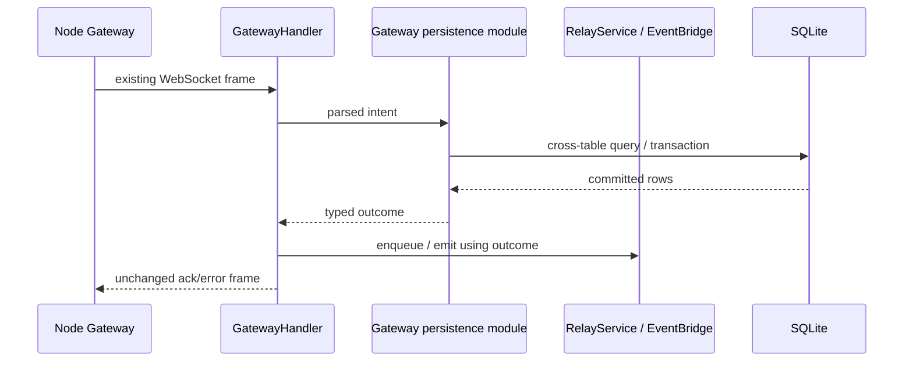

# refactor-459: 深化 IM 持久化 module — 技术方案

> 对齐: motivation.md v1
> Unit branch: `unit/refactor-459` (will be created by orchestrator)

## Changelog

## 现状分析

### 涉及范围

- `src/IM/infra/repositories.py` —— 当前 concrete SQLite persistence 的主体，包含 User、Conversation、
  Message、AgentProfile、Node、Event 等 repository。多数单实体读写已经有可复用 interface，但若干调用方
  仍通过 `repository._connection` 绕过 interface。
- `src/IM/ws/gateway_handler.py` —— Gateway WebSocket 协议 owner；当前同时直接查询/更新 users、nodes、
  agent_profiles、conversations、dispatch log，并从 `ConversationRepository._connection` 反向构造其他
  repository。node 注册、离线、group fanout、direct target、agent message 幂等的持久化知识散在 handler。
- `src/IM/application/event_service.py` —— 事件回放 enrichment owner；当前通过
  `EventRepository._connection` 查询 relay identity 与 agent display name。
- `src/IM/application/web_im_service.py` —— Web IM conversation workflow owner；当前先直查 external
  conversation 是否存在，再调用 repository 的 find-or-create，导致 `created` 语义跨 seam。
- `src/IM/ws/user_stream.py` —— 浏览器 user-stream 连接与回放 owner；当前同一文件混合 frame 编码、连接
  registry、recipient/replay/global cursor SQL 和 stale-node 扫描。
- `src/IM/api/deps.py`、`src/IM/api/routes/web_im.py`、`src/IM/app.py` —— composition 与产品入口。`deps.py`
  仍有 `_ConfigEnabledConversationRepository` 子类复制 base repository 已具备的查询；route 还直接读取
  profile/global cursor。`app.py` 是 SQLite connection 的合法 composition owner。
- `src/IM/application/relay_service.py`、`relay_watchdog.py` —— 只读关联范围，不在本 unit 深化。它们已各自
  以业务 interface 隐藏完整 relay/watchdog implementation，删除后复杂度会散回调用方，deletion test 通过。
- `tests/im_service/`、`tests/unit/IM/` —— 现有行为覆盖丰富，但多处测试通过 repository private connection
  或 handler private state 布置/断言，证明当前 persistence interface 还不是稳定 test surface。

### 既有约束

- `SPEC.md`：IM 是独立中心服务，不 import `agent` / `personal_assistant`；本 unit 必须完全在 `src/IM/`
  内闭合，不改变四包依赖方向。
- `docs/specs/im/`：账号/owner 隔离、会话消息、浏览器事件流、Agent/Node 状态与 Gateway relay 是 current
  行为契约。相关 Requirement 与代码主路径核对一致；本 unit 只重构 implementation，no spec delta。
- IM 生产 persistence 只有 SQLite 一个 adapter；`connect()` 创建 app-scoped shared connection，并允许
  FastAPI worker thread 共享。按 codebase-design 的“一 adapter = 假想 seam”，不得新增 Port/Protocol 或
  in-memory fake adapter。
- 本 unit 不改变公开 HTTP / WebSocket frame、domain response、SQLite schema shape 或用户数据语义。
  `agent_message_dispatch_log` 的既有 DDL 可以从 handler 移到 schema initialization，但表结构不得改变。
- composition root、测试 fixture、以及本身即为 deep module 的 `RelayService` / relay watchdog 可以持有 raw
  connection；WS handler、route、application service 不得越过注入 module 的 interface 获取 connection。
- 新 test 文件遵守 `docs/TESTING_GUIDE.md` 的 400 行上限；先跑最窄测试，再跑 IM suite、non-e2e 与关键路径。

### 契约层 grounding 结论

- `auth-tenancy.md` 的 owner 隔离由 owner-scoped repository 查询和 route authentication 落地；本 unit 保持
  query result/error 语义，不改变 owner 判定。
- `conversations-messages.md` 的 shadow conversation 幂等、message history、实时顺序与 fork 行为均有当前
  repository/service 路径。本 unit 只把 pre-query、recipient/replay 查询收回 persistence interface。
- `agents-nodes.md` 的 register/heartbeat/offline 状态广播由 `GatewayHandler` + NodeRepository + user-stream
  registry 落地；本 unit 保持 frame 与广播时机。
- `gateway-relay.md` 与 `tool-timeline.md` 的 relay receipt、后台通知、工具/权限/终态事件由 RelayService、
  EventBridge、Message/Event repository 协作落地；本 unit 不改 event schema 或 reducer semantics。
- 未发现上述 canonical 条目与本次涉及代码的新增 drift。live 代码中仍存在本 unit 之外的已知行为问题候选
  （例如 agent→agent direct conversation 的 owner 归属）；不在本 refactor 中修复，也不新增测试冻结错误行为。

### 可复用能力

- **改** `ConversationRepository`：它已经拥有 participant resolution、config snapshot、direct/group mapping、
  external conversation 幂等。把 `created` 结果、exists 查询等收回这里，比新建一层 pass-through module 更深。
- **改** `EventRepository`：它已经拥有 append/list/latest event。补齐 user-visible recipient、resume、global
  cursor 与 relay-enrichment query，`EventService` 保留 payload enrichment，`user_stream.py` 保留 WS lifecycle。
- **改** `AgentProfileRepository` / `NodeRepository`：复用 profile/node mapping 与 owner scope；简单单实体查询
  继续放在现有 repository，不塞进新的 gateway module。
- **新增** `src/IM/infra/gateway_persistence.py`：Gateway 注册与投递是跨 users/nodes/profiles/conversations/
  messages/dispatch-log 的真实事务 seam，现有 entity repository 无法在不泄漏事务顺序的情况下表达；用两个
  caller-oriented concrete module（node / conversation）承接。
- **删除** `_ConfigEnabledConversationRepository`：base `ConversationRepository` 已具备 config snapshot 与完整
 字段查询；删除它会让重复 complexity 消失而不是散到调用方，属于 shallow module。
- **保留** `RelayService` / relay watchdog：两者 interface 已提供高 leverage，内部 SQL 具有 locality；把其 SQL
  再包 repository 只会增加传递式抽象。

### 相关历史

- `feat-340` 建立 IM auth/owner scope、repository 与 user-stream 基线；本 unit 必须保住其 SQL-level tenant
  isolation，不把 owner filter 上移到 Python。
- `bugfix-362` 的决策 8 已要求 agent 对账 SQL 封在 repository，handler 只表达业务动作；本 unit 把同一原则
  扩展到剩余 Gateway persistence 路径。
- `refactor-395` 曾建议按文件拆 `repositories.py`。本 unit 不采纳“按类拆文件”作为目标；只有形成新的真实
  seam（Gateway cross-table persistence）才新增文件。
- `refactor-454` 已把 Gateway runtime protocol facts 收成 typed handoff；本 unit 不改 PA↔IM wire，只处理 IM
  接收 frame 之后的 persistence ownership。

## 架构总览

难点不是 SQLite 本身，而是同一 connection 上的 schema/事务知识跨 WS、application、route 与 repository
重复出现。After 结构把 raw connection 留在 composition root 和 concrete persistence implementation 内。

### Before

```mermaid
graph TD
    App[IM app composition] --> Conn[(SQLite connection)]
    App --> Repos[Entity repositories]
    Route[HTTP routes] -. direct query .-> Conn
    WS[GatewayHandler / user_stream] -. repository._connection .-> Conn
    Service[EventService / WebIMService] -. repository._connection .-> Conn
    WS --> Repos
    Service --> Repos
    Tests[Tests] -. private state .-> Conn
```

### After



`GatewayNodePersistence` 与 `GatewayConversationPersistence` 是同一文件内的两个 deep module：各有一个窄
interface，分别集中 node lifecycle 与 conversation delivery。它们不是可替换 adapter，也不导出 raw connection。

## 关键决策

### 决策 1: seam 按 caller 的业务意图切，不按数据库表或“万能 facade”切

**选择深化两个既有 repository，并新增 Gateway node/conversation 两个 concrete persistence module。**

- **理由**：Event/Conversation 已有真实 entity interface；Gateway 则有跨表事务与路由查询，放进任一 entity
  repository 都会把别的实体知识泄漏进去。caller-oriented interface 能隐藏最多 schema 与顺序知识。
- **拒绝**：单个 `IMPersistence` 暴露所有表方法——interface 几乎等于 implementation，是 shallow facade。
- **拒绝**：每条 SQL 一个 repository 方法——只把 SQL 文本挪位置，调用方仍需掌握调用顺序与事务。
- **风险**：Gateway module 仍可能膨胀；通过 node/conversation 两个 interface 分治，并用 interface 表限制职责。

### 决策 2: SQLite 是 concrete implementation，不新增 Port、Protocol 或 fake adapter

**把依赖分类为 local-substitutable，测试直接使用临时 SQLite。**

- **理由**：生产只有 SQLite；临时文件/内存 SQLite 已能提供快速真实 stand-in。新增 persistence Protocol 只会
  形成单 adapter 的假想 seam，并迫使测试复刻 SQLite constraint/transaction 语义。
- **拒绝**：为每个 repository 定义 Protocol + fake——interface 增倍，fake 与真实 schema 漂移。
- **风险**：SQLite 测试比纯 fake 慢；通过 module interface 的聚焦测试与共享 fixture 控制成本。

### 决策 3: GatewayHandler 只拥有协议、连接与投递编排，不拥有 schema/事务

**GatewayHandler 的 node/conversation 路径通过两个 persistence interface 获取 typed outcome，禁止再构造 repository 或访问 connection。**

- **理由**：handler 应解释 frame、维护 websocket/waiter/connection state、调用 RelayService/EventBridge 并回 ack；
  node/profile/user/conversation/dispatch-log 的跨表查询与事务由 persistence implementation 集中。现有
  MessageRepository / EventRepository / MetricsService 仍可通过其公开、高 leverage interface 使用，不必重复包一层。
- **拒绝**：仅给现有 repository 增加零散 getter——handler 仍要理解跨表顺序，locality 没有改善。
- **风险**：typed outcome 若携带过多表字段会泄漏 implementation；只返回 handler 作下一步投递所需的 domain facts。

### 决策 4: Web IM 与 user-stream 深化现有 repository，不新增平行 read model

**ConversationRepository 返回 external find-or-create 的 created 结果；EventRepository 承担 replay/recipient/cursor/enrichment 查询。**

- **理由**：这些行为本来就是对应 repository 的 implementation，调用方 pre-query 是 interface 缺口，而非需要
  新 module。补齐一个高 leverage operation 后可删除 application/WS 中重复 SQL。
- **拒绝**：新增 `WebIMPersistence` / `UserStreamPersistence` 仅转发 Event/Conversation repository——deletion test
  失败，删除后 complexity 不会散开。
- **风险**：EventRepository interface 变宽；仅接受“一个调用能隐藏完整 query/invariant”的 operation，不导出 row。

### 决策 5: 每个 persistence operation 自己拥有 transaction，跨 module side effect 不伪装成原子写

**Gateway register、offline transition、dispatch-log 写入各自在 concrete module 内提交；EventBridge/RelayService 仍由 handler 编排。**

- **理由**：调用方不再知道单个 persistence operation 的 commit 顺序；读-only fanout/resolve operation 返回
  immutable result，connection 在返回前不逃逸。当前 agent message 的 message/event/relay side effect 跨
  MessageRepository、EventBridge、RelayService，强行宣称一个数据库事务会改变既有错误语义，不属于本 refactor。
- **拒绝**：handler 调多个 auto-commit repository 后手工 commit——当前 leakage 的原形。
- **风险**：register transaction 收紧可能暴露既有隐式依赖；按 milestone 用真实 SQLite 锁定 success/error outcome。

### 决策 6: dispatch-log DDL 归 schema initialization，表形状保持不变

**把 `agent_message_dispatch_log` 的既有 `CREATE TABLE IF NOT EXISTS` 原样移到 `infra/db.py`。**

- **理由**：schema ownership 应集中；构造 GatewayHandler 不应有数据库副作用。已有数据库启动时幂等创建，数据
  与列定义不变，不构成用户迁移。
- **拒绝**：保留 handler lazy DDL——测试/运行时构造顺序继续影响 persistence。
- **风险**：遗漏初始化测试会让空库路径失败；schema test 与 Gateway dispatch integration 同时覆盖。

### 决策 7: replace-don't-layer，interface 是 test surface

**新增 interface 行为测试后删除依赖 repository private connection / handler private persistence state 的旧测试。**

- **理由**：同一行为保留两层测试会冻结 implementation，降低未来重构 leverage。Gateway frame routing 测试只看
  ack/广播/relay outcome；persistence 测试只穿过 concrete module interface。
- **拒绝**：保留全部旧测试再新增一层——测试数增加但 architecture 仍被 private state 锁死。
- **风险**：机械删测试可能丢边界；先建立 old→new coverage 对账表，再逐条替换。

### 决策 8: 三个纵向 milestone 串行迁移，不维护双实现

**按 Web IM/event、Gateway node lifecycle、Gateway conversation delivery 三个可独立验证 slice 迁移。**

- **理由**：预计超过 10 个文件、800 行和单 worker 四小时窗口，命中 multi-milestone 硬门槛；每个 slice 都能从
 真实 HTTP/WS 入口验证，不是“先数据层、后业务层”的横切拆分。
- **拒绝**：单 M1——review surface 过大，出现回归难定位。
- **拒绝**：按“新 class / 测试 / wiring”拆——任何一段都不能独立交付，属于 worker roadpoint。
- **风险**：M2/M3 会连续修改 `gateway_handler.py` 与 `gateway_persistence.py`，因此明确串行依赖，不伪装并行。

## 接口与数据流

### Interface 表

| Module | Interface operation | 隐藏的 implementation / invariant | 返回给 caller |
|---|---|---|---|
| `ConversationRepository` | `find_or_create_external_conversation(...) -> ExternalConversationWriteResult` | owner-scoped lookup、竞态恢复、create/update、created 判定 | `conversation`, `created` |
| `ConversationRepository` | `exists(conversation_id)` | conversations lookup | `bool` |
| `EventRepository` | `list_events_for_user_resume(user_id, after_event_id, ...)` | global gap、time window、owner-visible conversations、batch cap | `ReplayOutcome` |
| `EventRepository` | `recipient_user_ids(conversation_id)` / `global_max_event_id()` | participants/global cursor SQL | immutable ids / int |
| `EventRepository` | `relay_run_identities(...)` / `agent_display_names(...)` | historical relay lookup、profile join | typed mappings |
| `EventService` | `global_max_event_id()` | global cursor query delegation | int |
| `GatewayNodePersistence` | `register(...)` | node upsert、profile preserve/upsert、agent-user ensure、node bind、stale reconcile、transaction | `GatewayRegistrationResult` |
| `GatewayNodePersistence` | `heartbeat(...)` / `disconnect(...)` | status transition、last_error、agent ids、transaction | `NodeTransition` |
| `GatewayNodePersistence` | `stale_online_node_ids(cutoff)` | stale scan SQL | tuple of ids |
| `GatewayConversationPersistence` | `agent_user_id(agent_id)` | username mapping | id or None |
| `GatewayConversationPersistence` | `group_reply_route(...)` | participants、sender identity、peer agent node lookup | `GroupReplyRoute` or None |
| `GatewayConversationPersistence` | `resolve_send_target(...)` | target classification、canonical direct lookup/create、title、owner semantics | `DispatchResolution` |
| `GatewayConversationPersistence` | `find_dispatch(...)` / `record_dispatch(...)` | idempotency table与其 transaction | typed record / None |
| `GatewayConversationPersistence` | `system_user_id()` | system-user lookup / ensure | user id |
| `GatewayConversationPersistence` | `agent_node_id(...)` / `conversation_usage_scope(...)` | profile lookup、conversation owner/config lookup | typed ids |

这些是 package-internal Python interface，不进入 `docs/specs/im/`，也不作为跨包 import 面。

### 关键 typed result

| Type | 必需字段 | 约束 |
|---|---|---|
| `ExternalConversationWriteResult` | `conversation`, `created` | 同一 owner/source/chat/agent 重复调用时 `created=False` |
| `GatewayRegistrationResult` | `previous_node`, `current_node`, `agent_ids` | transaction 完成后才返回；agent_ids 稳定排序 |
| `NodeTransition` | `previous_node`, `current_node`, `agent_ids` | no-op 也返回可比较 snapshot；不返回 row/connection |
| `AgentRelayTarget` | `agent_id`, `node_id` | 只含可投递且非 source 的 peer |
| `GroupReplyRoute` | `sender_user_id`, `sender_display_name`, `targets` | targets immutable、稳定排序 |
| `DispatchTarget` | `kind`, `id` | kind 仅 `conversation_id|agent_id|user_id` |
| `DispatchResolution` | `target`, `conversation_id`, `target_node_id` | direct create 已完成；conversation target 可无 node |
| `AgentDispatchRecord` | request key、source/target、conversation/message ids | 用于 first-write-wins 幂等，不暴露 created_at SQL row |

### Web IM / user-stream 主流程



route/user-stream 不再 pre-query 或接收 raw connection；`created`、resume gap、recipient 与 cursor 规则各自在一个
interface operation 内闭合。

### Gateway 主流程



Handler 继续拥有 WebSocket connection、RPC waiter、frame validation 与发送时序；persistence module 不发送 frame、
不调用 Gateway、也不持有 `UserStreamRegistry`。

### Composition wiring

- `IM.app` 创建一个 app-scoped SQLite connection，并构造 singleton `EventRepository`、`MessageRepository`、
  `GatewayNodePersistence`、`GatewayConversationPersistence` 与 EventBridge。
- `GatewayHandler` 必须显式接收两个 Gateway persistence module、MessageRepository 与 EventBridge；删除“从
  conversation repository 私有 connection 自动构造 User/Message repository”的 fallback。MessageRepository、
  EventRepository 与 MetricsService 保留为已有公开 collaborator，只能调用其 interface，不能获取 connection。
- `api/deps.py` 可以在 composition 层从 app connection 构造 concrete repository，但不得执行业务 SQL；删除
  `_ConfigEnabledConversationRepository`，统一返回 base `ConversationRepository`。fork route 需要 profile 时通过
  dependency 获取 `AgentProfileRepository` 的公开 interface；sync global cursor 通过 EventService interface 获取。
- `app.state.connection` 暂保留给生命周期关闭和 integration fixture/black-box storage assertion；本 unit 的产品
  调用路径不再直接使用它执行业务查询。

### Architecture contract

新增 `tests/contract/test_im_persistence_seam_contract.py`，静态约束：

- `application/event_service.py`、`application/web_im_service.py`、`ws/gateway_handler.py`、`ws/user_stream.py`、
  `api/routes/web_im.py` 不得出现 repository private connection 或直接 SQL execute/commit。
- `api/deps.py` 不得定义 ConversationRepository 子类或执行业务 SQL；只允许构造 concrete dependency。
- raw connection owner allowlist 仅包含 composition root、`infra/*`、`RelayService` 与 relay watchdog；新增例外必须
  在后续 design 中解释 deletion test，而不是直接扩 allowlist。

## 契约层增量 (delta-spec)

- kernel: no spec delta
- im: no spec delta
- gateway: no spec delta
- cli: no spec delta

本 unit 是严格 behavior-preserving refactor；若 implementation 需要改变任何 HTTP/WS/UI/持久化可观察语义，
必须停止并回 `change-spec-author` 另立/修订首文档，不能在本 design 中补 delta。

## 风险与回退

| 风险 | 具体后果 | 缓解 |
|---|---|---|
| transaction 收紧改变隐式时序 | register 的中间状态或错误路径与现状不同 | register 用真实 SQLite 覆盖 success、no-op、failure；从真实 WS 入口核对 ack/广播；不改变跨 module side-effect 顺序 |
| typed result 夹带表结构 | 新 module 只是 row wrapper，caller 仍依赖 schema | result 只保留下一步投递所需 domain facts；contract test 禁 row/connection 逃逸 |
| Gateway module 变成 god module | interface 继续增长，depth 下降 | node/conversation 两个 interface 分治；新增 operation 必须通过 deletion test |
| 测试迁移误删边界 | private-state 测试删除后丢覆盖 | 建 old→new coverage 对账；先补 interface test，再删旧断言；全 IM suite + non-e2e 收口 |
| 已知产品 bug 被顺手改变 | refactor 混入行为修复，review 无法归因 | 不新增冻结 bug 的测试，也不修复；记录复现并另立 bugfix 候选 |
| shared SQLite 并发 | FastAPI worker thread 下出现锁/陈旧读 | 保持 app-scoped connection 配置；不新增连接池/多连接；真实 integration 与 e2e 驱动 |

**降级路径**：每个 milestone 合入后都是完整可运行的纵向 slice；若后续 slice 失败，保留前一 slice，不启用
双实现或 feature flag。未迁移的路径继续走原 implementation。

**回滚方案**：M1/M2/M3 各自可 revert；不改变 schema shape 和用户数据，因此无需数据库回滚。M3 的 DDL 仅
移动同一 `CREATE TABLE IF NOT EXISTS`，回滚后旧 handler 仍能识别现存表。

## Runbook for Reviewer

| 服务 | 停止命令 | 启动命令 | 健康检查 |
|---|---|---|---|
| worktree IM + Gateway 真栈 | `./scripts/e2e-down.sh` | `./scripts/e2e-up.sh` | `source .e2e-ports.env && curl -fsS "$IM_URL/openapi.json" >/dev/null`，并确认 `.gateway.log` 已注册 node |

**Review 驱动方式**：端到端真栈；本 unit 不改客户端面，允许用 Web IM 实际调用的 HTTP 与 user WebSocket、
以及 Gateway 实际使用的 `/im/ws/gateway` frame 代替人工点击。不得绕过 route/WS 直接调用 repository 作为
reviewer 证据。覆盖 motivation.md 的 8 个 Scenario；重启恢复场景复用同一 worktree DB，不能每次重建空库。

## Milestones

拆分依据：预计生产与测试改动超过 10 个文件、800 行、4 小时单 worker 窗口，命中 multi-milestone 硬门槛。
三段均是能从真实产品入口独立验证的纵向 slice，M2/M3 因文件重叠明确串行。

| ID | 标题 | 依赖 | 并行组 | 范围 | 退出标准 |
|---|---|---|---|---|---|
| refactor-459-M1 | web-im-persistence | — | A | `src/IM/infra/repositories.py`; `src/IM/application/{event_service,web_im_service}.py`; `src/IM/ws/user_stream.py`; `src/IM/api/{deps.py,routes/web_im.py}`; `src/IM/app.py`; seam contract 与对应 unit/integration tests | `[reviewer]` owner 隔离、direct/group、shadow conversation、过程事件与 user-stream resume/sync 对外结果不变（覆盖 Scenario 1–3、7）；`[worker]` Conversation/Event interface 测试覆盖 created race、recipient、cursor gap/window、enrichment；目标调用方无 private connection/SQL；最窄 IM tests + `ruff check/format --check` 通过 |
| refactor-459-M2 | gateway-node-persistence | refactor-459-M1 | B | `src/IM/infra/gateway_persistence.py`; `src/IM/infra/repositories.py`; `src/IM/ws/{gateway_handler,user_stream}.py`; `src/IM/app.py`; seam contract；node/register/status/offline tests | `[reviewer]` Gateway register、heartbeat、disconnect、timeout 后 Node/Agent 状态与广播不变（覆盖 Scenario 4）；`[worker]` GatewayNodePersistence 真实 SQLite 测试覆盖 first register、re-register、empty advertise、stale reconcile、offline no-op/error；handler 不再读 node/profile/user connection；相关 unit/integration tests 通过 |
| refactor-459-M3 | gateway-delivery-persistence | refactor-459-M2 | C | `src/IM/infra/{gateway_persistence.py,db.py}`; `src/IM/ws/gateway_handler.py`; `src/IM/app.py`; seam contract；gateway relay/group/direct/dispatch/message tests；unit 文档 | `[reviewer]` relay 回执、group fanout、agent/user/conversation target、过程事件、重启恢复均不变（覆盖 Scenario 5–8，并重跑 Scenario 1–4）；`[worker]` dispatch DDL 归 schema init且 shape 不变；GatewayConversationPersistence 真实 SQLite 测试覆盖 target resolution、canonical direct、fanout、first-write-wins、missing node；删除被替代的 private-state 测试；`pytest -m "not e2e"`、`scripts/e2e-critical.sh -m "not slow"`、ruff 全绿 |
