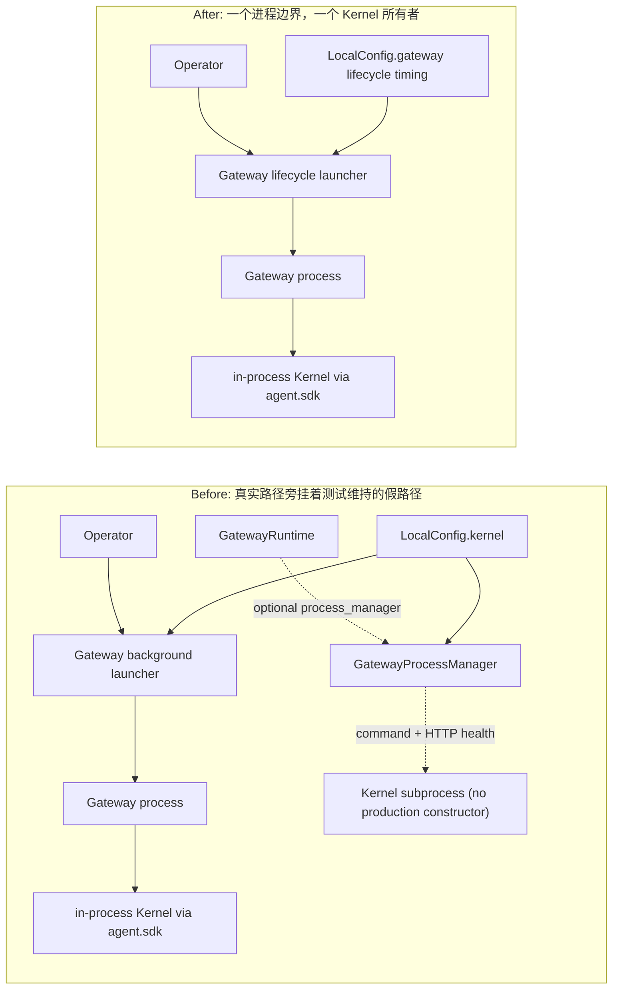
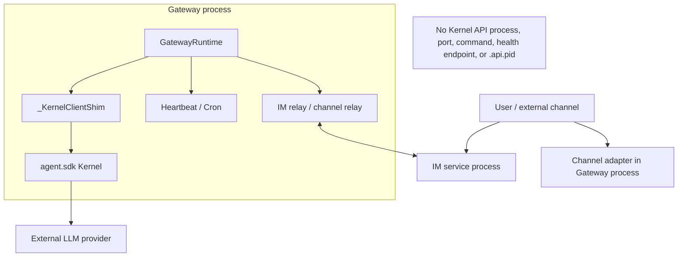

# refactor-461: 删除死 kernel subprocess seam — 技术方案

> Aligns with: `motivation.md` v1
> Unit branch: `unit/refactor-461`

## Changelog

## 设计目标

把 Gateway composition root 收敛到仓库当前唯一真实拓扑：Gateway 自身可以作为后台进程运行，但 Kernel 只能作为 `agent.sdk` 提供的进程内库存在。删除所有允许测试、配置或运维脚本重新叙述“独立 Kernel 子进程/HTTP API”的活跃 interface，同时不改变消息、heartbeat、cron、Gateway supervisor 和优雅关闭行为。

本设计治理的不是字符串，而是一个已失去生产构造点的抽象分支。完成后的删除判据是：复杂度从运行时 interface、配置 schema、状态协议和测试表面同时消失，调用者不需要在其他位置重新实现 Kernel 进程管理。

## 现状分析

### 涉及范围与当前生产 wiring

生产路径是：

1. `personal_assistant.main.main()` 进入 `run_gateway()`；
2. `build_runtime()` 经 `build_pa_kernel()` 构建进程内 Kernel；
3. `_KernelClientShim` 把同一个进程内 Kernel 交给消息路由、heartbeat、cron 和内部 dispatch；
4. `GatewayRuntime` 负责这些资源与 IM/channel 的有序关闭。

`GatewayProcessManager` 没有生产构造点。它只通过 `GatewayRuntime` 的可选 `process_manager` 参数和测试 double 存活，仍描述 command、health path、HTTP 健康轮询和子进程停止。这是一条由测试反向维持的假架构。

同时，`KernelConfig` 混合两类字段：

- 已死亡的 Kernel 连接/HTTP/command 字段：`base_url`、token、request id、HTTP timeout、`command`、`health_path`；
- 仍被 Gateway 后台 launcher 使用的 timing：`startup_timeout_seconds`、`shutdown_grace_seconds`、`health_poll_interval_seconds`。

后台状态中的 `health_url` 也仍按旧 Kernel `{"healthy": true}` 协议参与 stop 判定，但现在写入的可能是 IM URL 或 `pid=...`，已不具备协议含义。

后台 parent 的所谓 ready waiter 实际只等待 child 写出 PID file 并检查进程未退出；`GatewayRuntime._ready_event` 在 child 内部启动 channel/skill maintenance 后才设置，二者没有跨进程连接。因此本 unit 只能把 parent 结果表述为“启动确认”，不能把旧 health 字段改名成新的 readiness 字段。

涉及范围据此限于 `personal_assistant` composition root / 本地配置、Gateway 起停状态和与它们直接对账的 active scripts、operator 文档、tracked sample configs 与测试。active scripts 也包括仍指向已删除 HTTP app 的 `scripts/fixtures/README.md` / `anthropic_sse_error.py`，以及把纯内核集成测试叙述成 HTTP Kernel API 的 `tests/integration/test_provider_error_user_visible.py`。`agent.sdk`、Kernel 执行内部、IM 协议和 coding CLI 不在生产代码改动范围。

### 可复用能力

| 能力 | 结论 | 原因 |
|---|---|---|
| Gateway 后台 `subprocess.Popen` 与 PID 单例锁 | 保留 | 它管理的是 Gateway 自身进程，是用户可见的 start/stop/restart 能力 |
| `start_new_session=True` 与进程组清理 | 保留 | Gateway 需要回收自身拥有的 channel/tool descendants；只改掉“清理 kernel uvicorn”的旧注释 |
| `_KernelClientShim` | 保留 | heartbeat、cron、内部 dispatch 和 agent mapping 的生产活路径 |
| 进程内 Kernel 的 `aclose()` | 保留 | 结束活动 run、持久化并释放资源的真实生命周期 |
| `BackgroundProcessFactory` / `_FakeProcess` | 保留 | Gateway launcher 的真实可替换边界 |
| PID file waiter 与 `_check_im_reachable()` | 改名后复用 | 前者只证明 child start/liveness；后者只展示独立 IM HTTP 可达状态，均不得包装为 Gateway readiness |
| 默认 config 的 timestamp backup | 保留但不扩义 | 继续保护默认 config 的普通写入；另加所有路径专用的一次性 migration backup，避免改变既有 retention 规则 |
| `GatewayProcessManager` / `ProcessFactory` / `_spawn_process` | 删除 | 只服务无生产构造点的 Kernel subprocess 分支 |
| Kernel-style health probe 与状态 `health_url` | 不用并删除 | 已无可验证的 Kernel HTTP 协议，且现值会误指 IM/PID |

### 既有约束与契约 grounding

- `SPEC.md` 与 `docs/specs/kernel/sdk-boundary.md`：Kernel 是进程内库，不提供内建网络 API。
- `docs/specs/gateway/service-lifecycle.md`：Gateway 自身支持后台启动、停止、重启、PID 单例与优雅关闭。
- `docs/specs/gateway/heartbeat-cron.md`、`routing-delivery.md`：heartbeat、cron 与消息路由依赖进程内执行能力，不能因清理旧 seam 被改写。
- `AGENTS.md` 的硬依赖方向仍有效：`personal_assistant` 只能经 `agent.sdk` 使用内核，不能为本 unit 反向 import `agent.core` / `agent.platform`。
- `docs/SPEC_GUIDE.md`：本 unit 的用户可见增量是默认启动从伪 health 收口为 PID/liveness 启动确认，以及 Gateway lifecycle timing 的配置所有权/旧值迁移，落最窄 gateway delta spec；不把内部删类写成产品行为。
- 注释、测试和 commit 粒度仍遵守根目录 `AGENTS.md`、`COMMENTING_GUIDE.md` 与 `docs/TESTING_GUIDE.md`；本设计不以更新 stale 运维段落为理由突破这些规范。

### 相关历史

- `refactor-387-kernel-sdk-no-http-api` 已确立 Kernel 进程内化；其 M3 tasks 原本要求 `GatewayRuntime` 不再包含 `GatewayProcessManager`，实现却只把它变成 optional，留下本 unit 要删除的尾巴。
- feat-393 / feat-394 之后，heartbeat、cron 与主动投递实际复用 `_KernelClientShim`；refactor-406 又把产品装配收敛到 consumer factory。它们证明 shim 已是进程内聚合 adapter，不是旧 HTTP client 的同义残留。
- `AGENTS.md`、e2e/acceptance helper 和 tracked sample configs 仍保留 refactor-387 前拓扑；它们是 active 入口，需要与生产事实对账。`docs/changes/archive/**` 只作决策考古，明确不改。

## 架构总览

### 静态结构：删除假分支，保留唯一 composition root



`GatewayRuntime` 的 interface 变深而不是变宽：构造时直接要求其真实运行资源，不再暴露一个调用者必须理解的可选 Kernel 进程模式。测试从“能否注入假 manager”转向验证公开生命周期结果。

### 部署拓扑



这里仍有两个独立服务进程：IM 与 Gateway。不存在第三个 Kernel API 进程。Gateway 后台启动器只拥有 Gateway 进程边界；Kernel 的生命周期属于 Gateway 进程内的 `GatewayRuntime`。

## 关键决策

### D1. 直接删除 `GatewayProcessManager`，不建立替代 port

删除 `GatewayProcessManager`、只为它存在的 `ProcessFactory` / `_spawn_process` command runner，并从 `GatewayRuntime` 构造签名、成员、启动和停止顺序中移除 `process_manager`。共享的 `ProcessLike` 仍被 Gateway 后台 launcher 使用，保留。

不新增 `KernelLifecyclePort`、兼容 manager 或 noop adapter。生产只有一种实现时，额外 port 只会继续让不存在的部署形态显得可替换。真实的 Kernel 关闭通过已有 in-process Kernel resource 完成。

Gateway 自身 launcher 的 `BackgroundProcessFactory` 是另一个边界，仍有生产 `Popen` 与测试 fake，不能因名字都涉及 process 而被误删。

### D2. 将三项活 timing 迁到 Gateway 所有权

运行时数据结构改为：

```text
GatewayLifecycleConfig
├── startup_timeout_seconds
├── shutdown_grace_seconds
└── poll_interval_seconds

LocalConfig
└── gateway: GatewayLifecycleConfig
```

配置解析按字段执行单向迁移：

| 新字段 | 首选来源 | 兼容来源 | 默认 |
|---|---|---|---|
| `gateway.startup_timeout_seconds` | `gateway:` 同名字段 | `kernel.startup_timeout_seconds` | 保持当前默认 |
| `gateway.shutdown_grace_seconds` | `gateway:` 同名字段 | `kernel.shutdown_grace_seconds` | 保持当前默认 |
| `gateway.poll_interval_seconds` | `gateway:` 同名字段 | `kernel.health_poll_interval_seconds` | 保持当前默认 |

规则是逐字段而不是整块覆盖：新 mapping 中未提供的字段才读取旧值。旧 `kernel:` 的连接、认证、command、HTTP timeout 和 health path 不再进入运行时结构，也不再触发验证。

`save_local_config()` 只序列化 `gateway:` 中的非默认 lifecycle timing，并移除原文件中的 `kernel:`。loader 是唯一兼容读取边界；运行时不保留旧 schema wrapper。

因为裁掉 `kernel:` 是破坏性 schema 迁移，save 在覆盖任意现存 config 前必须检查磁盘原文：若原文含顶层 `kernel:` 且新文不再含该块，先在同目录创建 `<config-path>.pre-refactor-461.bak`。该 migration backup 有如下硬规则：

- 保存原文件字节与权限，覆盖默认 config、自定义 `--config` 和 worktree config，不复用“只保护默认 config”的 timestamp backup gate；
- 使用排他创建且永不覆盖。若同名 backup 已存在且内容与当前待迁移原文一致，可复用；若内容不同则中止 save，要求操作者先处理冲突；
- backup 创建、写入或落盘失败时，原 config 不得被覆盖；
- 只有磁盘原文确实还含 legacy `kernel:` 时才触发，因此迁移后的普通 token/config save 不会反复备份；`e2e-down.sh` 清理自己派生的 `.gateway-config.yaml.pre-refactor-461.bak`，其他自定义 config 的 backup 持久保留。

### D3. 删除 health/readiness 字段，启动确认与停止各用真实事实

新 `GatewayRuntimeState` 只保存：

- Gateway PID；
- config path；
- log path。

读取旧状态时忽略多余的 `health_url`，因此已有后台实例仍能被新版 `stop` 定位。新状态不再写该字段。

`stop_gateway()` 以 PID 存活、进程组 SIGTERM、宽限期轮询和必要时 SIGKILL 为判据；删除 `_healthcheck_reports_healthy()`、`_verify_stopped_health_url()` 及相应测试。IM 是否仍在线不能用来判断 Gateway 是否停止。

`BackgroundLaunchResult` 只保留 `pid`、`log_path` 与可选 `im_service_url`，彻底删除 `health_url`，也不新增 `readiness_hint` 等替代字段。`_print_gateway_started()` 打印真实的 `Gateway started (pid=...)`、Log，并在配置了 IM 时单独打印 IM service URL 与其 HTTP 可达状态；IM status 不持久化、不参与 Gateway stop，也不表示 Gateway WebSocket 已连接。

现有 `ReadyWaiter` / `_wait_for_gateway_ready()` 同步改名为 start/PID 语义：它只等待 PID file 并确认 child 未退出，`launch_gateway_in_background()` 的 docstring/测试也只承诺“background child accepted startup”。本 unit 不把 child 内存里的 `_ready_event` 暴露给 parent，不新增 pipe/socket/file IPC。gateway delta-spec 据此把既有“健康提示”收口为“启动确认”，明确不承诺 runtime/channel ready。

### D4. 只删除 manager 调用，启动与关闭顺序保持生产事实

```mermaid
sequenceDiagram
    participant O as Operator
    participant P as Parent launcher
    participant G as Gateway child
    participant R as GatewayRuntime
    participant C as Channels
    participant K as In-process Kernel
    participant I as IM

    O->>P: start
    P->>P: load gateway lifecycle timing
    P->>G: spawn Gateway process group
    G->>R: build runtime
    R->>K: build via agent.sdk
    G-->>P: write PID; child remains alive
    P-->>O: Gateway started (pid), log, separate IM status
    G->>R: run_forever
    R->>C: start channels
    R->>R: start dispatch + skill maintenance; set child-only ready_event
    R->>I: start IM supervisor, then heartbeat

    O->>P: stop
    P->>G: SIGTERM process group
    G->>R: request shutdown
    R->>R: dispatch cleanup; heartbeat close
    R->>C: stop channels
    R->>K: aclose active runs and resources
    R->>R: drain cron dispatcher
    R->>I: close IM; await IM task
    R->>R: run resource closers
    G-->>P: process exits
    P->>P: remove PID/state files
```

本 unit 在 startup 只删除 `process_manager.start_kernel_process()`，在 shutdown 只删除 `process_manager.stop_kernel_process()`；其余顺序和异常策略逐行保持。当前成功路径顺序是 dispatch cleanup → heartbeat close → `stop_channels` → Kernel `aclose` → cron drain → IM close/task await → resource closers。dispatch、Kernel、cron、IM 自己的既有 catch/log 继续保留；heartbeat close 与 `stop_channels` 当前不吸收异常，本 unit 不替它们新增异常聚合，也不承诺异常后一定继续后续步骤。若要治理该关闭策略，另立 unit。

### D5. 只清理活跃叙事，不篡改历史

实现必须清理下列当前入口中的旧拓扑：

- `AGENTS.md` 的运行时/e2e 指引；
- `scripts/e2e-up.sh`、`scripts/e2e-down.sh`；
- `scripts/fixtures/README.md` 与 `scripts/fixtures/anthropic_sse_error.py` 中指向已删除 `agent.platform.http_api.app:app` 的运行指引；
- e2e leak finalizer 中的 `personal_assistant.kernel_app` needle；
- `scripts/acceptance/m170_runtime.py` 中的 Kernel port/health/listener 语义；
- `tests/integration/test_provider_error_user_visible.py` 中把当前纯内核测试叙述成 HTTP Kernel API 的说明；
- tracked 示例配置中的 `kernel:` 块；
- 仅为旧 manager/health probe 存在的测试和 fixtures。

不修改：

- `docs/changes/archive/**` 和已完成 unit 的历史记录；
- 其他活跃 change unit 中作为当时上下文留下的设计文本；
- coding CLI 对已删除 HTTP kernel app 的负向 contract guard；
- 用户本地未跟踪的 `.gateway-config.yaml` 或持久化配置。

新增一个聚焦 active scope 的 contract test，阻止 `GatewayProcessManager`、`LocalConfig.kernel`、`personal_assistant.kernel_app`、`agent.platform.http_api.app:app`、`.api.pid` 和 Kernel API 运维叙事回流。guard 显式覆盖上述 fixture README/script 与 provider error integration docstring，但不扫描 archive/change history，避免把历史证据误判为产品 interface。

## 接口与数据流

### 生产代码与 interface

| 范围 | 变化 |
|---|---|
| `src/personal_assistant/main.py` | 删除旧 manager/command/health probe 和 `BackgroundLaunchResult.health_url`；把 ready 命名收口为 PID/start confirmation；简化 `GatewayRuntime`；迁移 launcher/stop timing；状态改为 PID-only 语义；保留 Gateway background process group 与 `_KernelClientShim` |
| `src/personal_assistant/config/local_store.py` | 用 `GatewayLifecycleConfig` / `LocalConfig.gateway` 替代 `KernelConfig`；实现 parser-edge 旧 timing 迁移、canonical save 与任意 config 的一次性迁移备份 |

若类型定义实际位于相邻私有模块，可做同等最小移动，但不为了本 unit 建立新的 lifecycle 子系统。

### 活跃工具与文档

| 范围 | 变化 |
|---|---|
| `AGENTS.md` | 使服务拓扑、一键起停、PID 列表与当前 in-process Kernel 一致 |
| `scripts/e2e-up.sh`, `scripts/e2e-down.sh` | 只管理 IM 与 Gateway，不叙述/清理 `.api.pid` |
| `scripts/fixtures/README.md`, `scripts/fixtures/anthropic_sse_error.py` | 保留上游错误 fixture，本地运行指引改走当前进程内 Kernel 的 Gateway/CLI 入口，不再启动已删除 HTTP app |
| `tests/e2e/conftest.py` | leak finalizer 只识别真实 Gateway 进程组 |
| `scripts/acceptance/m170_runtime.py` | start/stop 以 Gateway PID/state 与 IM node-online 为证据，不使用 Kernel port/health URL |
| `tests/integration/test_provider_error_user_visible.py` | 只修正测试说明为当前内核/持久化路径，不改测试行为 |
| `node-config.yaml`、`ACCEPTANCE/M171-node-config.yaml`、`ACCEPTANCE/M224-runtime-node-config.yaml` | 删除无效 `kernel:` 块；不顺手修整其他配置内容 |

### 测试表面

- 删除 `tests/unit/personal_assistant/test_gateway_process_manager.py` 中专测旧 manager 的用例；仍有价值的 `GatewayRuntime` 生命周期断言合并到 `test_gateway_runtime_lifecycle.py`。
- 所有 `LocalConfig(kernel=KernelConfig(...))` fixture 机械迁为 `gateway=GatewayLifecycleConfig(...)`。
- `test_local_store.py` 覆盖新默认、旧 timing 迁移、逐字段优先级、canonical save、旧连接字段被忽略，以及默认/自定义 config 的 migration backup、同内容复用、冲突/写失败时不覆盖原文件。
- `test_gateway_launch.py`、`test_gateway_pid_lifecycle.py` 覆盖 Gateway-owned timing、PID-only stop 和旧 state 额外字段读取。
- `test_gateway_main_command.py` 证明启动输出只包含 `Gateway started (pid)` / log / 独立 IM status，不出现 Health/Ready 承诺；launch waiter 只验证 PID/start confirmation。
- `test_gateway_runtime_lifecycle.py` 删除 fake process manager，并证明移除两个死调用后真实 shutdown 顺序与各步骤既有异常策略未改变。
- `tests/unit/test_e2e_conftest_finalizer.py` 与 `tests/unit/test_runtime_helpers.py` 只测试当前进程拓扑。
- 新增 active-scope zero-residue contract guard。

## 契约层增量 (delta-spec)

| 长青契约 | delta | 理由 |
|---|---|---|
| Kernel | 无 | “Kernel 无内建网络 API、经 SDK 进程内执行”已是现有契约，本 unit 只落实它 |
| Gateway | `specs/gateway/service-lifecycle.md` | 将默认启动输出的“健康提示”收口为只基于 PID/liveness 的启动确认，不新增 readiness 承诺；生命周期 timing 改为 Gateway 所有权，并规定旧三项逐字段单向迁移、per-file migration backup 与 canonical save |
| IM | 无 | 协议和行为不变 |
| CLI | 无 | Coding CLI 不在本 unit 范围 |

删除内部 class、test seam 和旧注释本身不进入长青产品 spec。

## 风险与回退

| 风险 | 控制 |
|---|---|
| 删除 `kernel:` 时丢失运维者的非默认 timeout | loader 对三项活 timing 做逐字段迁移；新旧冲突与 save round-trip 有测试 |
| canonical save 后旧代码无法读取 `gateway:` | 任意 config 在裁 `kernel:` 前创建不可覆盖的同目录 migration backup；失败即中止覆盖；回退先恢复 backup |
| 将 Gateway 自身 supervisor 当成旧 Kernel seam 一并删除 | 文件/符号级 keep list；保留 background factory、PID lock、process group 和强杀路径 |
| `_KernelClientShim` 因名称像旧 client 被误删 | 明确作为 heartbeat/cron/internal dispatch 的活 production adapter；相关关键路径回归 |
| stop 取消 HTTP probe 后遗留进程 | PID 存活与进程组是更直接的所有权证据；覆盖 graceful timeout 与 SIGKILL |
| active-scope guard 误扫历史文档 | guard 使用明确 current 文件/符号 allowlist，不扫描 `docs/changes/archive/**` |
| 大范围 fixture 改名掩盖行为回归 | 机械迁移与语义测试分开审阅；先跑最窄测试，再跑 non-e2e 全量 |

### 回退方式

本 unit 作为一个原子 milestone 回滚，不保留双架构开关。若运行期间配置已被 canonical save 为 `gateway:`，先把同目录 `<config-path>.pre-refactor-461.bak` 原样恢复到 config path，再回退 unit commit；默认 config 既有 timestamp backup 只是额外保护，不作为该步骤的必要前提。旧 `.gateway-state.json` 无需预迁移；新版忽略旧 `health_url`，旧版回滚时会重新生成自己的状态。

## Runbook for Reviewer

| 服务 | 停止命令 | 启动命令 | 健康检查 |
|---|---|---|---|
| Worktree IM + Gateway 真栈 | `./scripts/e2e-down.sh` | `./scripts/e2e-up.sh` | `source .e2e-ports.env && curl -fsS "$IM_URL/openapi.json" >/dev/null && test -s .gateway.pid && kill -0 "$(cat .gateway.pid)" && grep -Eq "auto-bound to IM|Gateway started|INFO im_connection" .gateway.log && test ! -e .api.pid && ! pgrep -f '[p]ersonal_assistant.kernel_app'` |

**Review 驱动方式**：端到端真栈；本 unit 不改客户端面，允许用 Web IM 客户端实际调用的同一 HTTP/WebSocket 接口驱动消息旅程，也可直接真驱动 Web IM。必须另行走真实 operator CLI 的默认 start、stop、restart，不能用直接调用 `GatewayRuntime` 或伪造 process manager 代替。默认 start 只验 `Gateway started (pid)` / Log / 独立 IM status，并在开始消息旅程前另用上表健康检查等待真栈；不得把 start 返回本身当 runtime ready。配置迁移使用 worktree 隔离副本：分别以旧 `kernel:` timing、新旧混合 timing 启动并触发 save，检查 `.gateway-config.yaml.pre-refactor-461.bak` 与原文一致且新文件只含 `gateway:`；不得修改 `~/.nano-assistant/config.yaml`。完成后执行 `./scripts/e2e-down.sh`，确认 Gateway PID 已退出，且 `.api.pid`、迁移副本和 `personal_assistant.kernel_app` 均无泄漏。

若本地 LLM proxy 可用，reviewer 至少完成一条普通消息和一条 heartbeat 或 cron 主动任务；若不可用，记录环境阻塞，并以既有 fixture critical path 覆盖进程内 Kernel 的消息与主动任务路径。实现期测试顺序为：最窄 config/lifecycle/helper 单测 → 新 contract guard → `ruff` → `pytest -m "not e2e"` → 对应 critical-path e2e。

## Milestones

**为什么最初只有一个 milestone**：这条 seam 横跨 runtime、schema、state 和测试，但每一部分单独合入都会暂时丢配置、留下假 interface 或让当前运维入口撒谎。按垂直行为切分后，最小可交付单位就是“旧配置可迁移、Gateway 可启停、关键路径不变、旧 seam 不可复活”的一次原子收敛；按文件横切成多个 milestone 反而制造不一致中间态。M2-M6 是独立验收后追加的返工 milestone，不改变原始实现切分。

| ID | 标题 | 依赖 | 并行组 | 范围 | 退出标准 |
|---|---|---|---|---|---|
| refactor-461-M1 | remove-dead-kernel-seam | — | A | `src/personal_assistant/{main.py,config/local_store.py}`；`AGENTS.md`；`scripts/{e2e-up.sh,e2e-down.sh,acceptance/m170_runtime.py,fixtures/README.md,fixtures/anthropic_sse_error.py}`；`node-config.yaml`；`ACCEPTANCE/{M171-node-config.yaml,M224-runtime-node-config.yaml}`；受影响的 `tests/unit/personal_assistant/**` fixtures/语义测试；`tests/e2e/conftest.py`；`tests/integration/test_provider_error_user_visible.py`；`tests/unit/{test_e2e_conftest_finalizer.py,test_runtime_helpers.py}`；新 active-scope contract guard；本 unit gateway delta-spec 与长青 spec 归并 | 见下方两轨退出标准 |
| refactor-461-M2 | fix-round-1-review-findings | refactor-461-M1 | B | `src/personal_assistant/{main.py,config/local_store.py}`；`scripts/{e2e-down.sh,acceptance/m170_runtime.py}`；`README.md`；`docs/operator-runbook.md`；相关 lifecycle/config/runtime-helper 回归测试 | 修复第一轮 reviewer/verifier/code-review 确认的问题；补齐 default start waiter、强杀清理、migration backup I/O/并发/别名/权限/目录持久化、非有限 timing、M170 鉴权绑定与 e2e residue 的持久回归；长青 spec 仍由 orchestrator 在最终验收通过后归并 |
| refactor-461-M3 | fix-round-2-transaction-and-process-identity-findings | refactor-461-M2 | C | `src/personal_assistant/{main.py,config/local_store.py}`；`scripts/{e2e-up.sh,e2e-down.sh}`；相关 lifecycle/config/e2e-down 回归测试与格式修复 | 修复第二轮 code-review 确认的 7 个问题：配置备份 FIFO/第三方 hardlink/source drift，启动 PID 匹配，强杀 ESRCH/退出确认，e2e 进程身份与原子停栈；补齐持久回归并通过完整 CI 格式、lint、non-e2e 与真实起停验证（post-acceptance fix, round 2） |
| refactor-461-M4 | fix-round-3-cross-process-and-fail-atomic-findings | refactor-461-M3 | D | `src/personal_assistant/{main.py,config/local_store.py}`；`scripts/{e2e-up.sh,e2e-down.sh}`；相关 lifecycle/config/e2e 回归测试与 M3 契约澄清 | 修复第三轮确认的 public stop PID identity、跨进程配置协调/backup path/mode/commit durability、bounded stop polling、e2e evidence fail-closed、stale residue/default symlink、冷启动 timeout 与失败回滚；明确 POSIX 文件事务只保证所有本系统 writer 通过稳定 sidecar lock 协调，并对不协作外部漂移作提交前检测（post-acceptance fix, round 3） |
| refactor-461-M5 | fix-round-4-startup-publication-and-cleanup-findings | refactor-461-M4 | E | `src/personal_assistant/main.py`；`scripts/{e2e-up.sh,e2e-down.sh}`；相关 launch/identity/e2e 回归测试 | 修复第四轮确认的 startup state/publication rollback、未确认强杀、含空格 argv、locale/TZ birth identity、e2e rollback 幸存 Gateway、dangling evidence 与 cleanup 半提交；进程身份查询和 lifecycle evidence 清理各收敛为单一可测试原语（post-acceptance fix, round 4） |
| refactor-461-M6 | fix-round-5-generation-and-descendant-ownership-findings | refactor-461-M5 | F | `src/personal_assistant/{main.py,config/local_store.py}`；`scripts/{e2e-up.sh,e2e-down.sh}`；相关 launch/config/e2e 回归测试 | 修复第五轮确认的 post-state liveness、public/e2e generation lock、backup content/mode gate、IM evidence preflight、startup group-only signal、Gateway descendant ownership与 Darwin test reap；全栈启动/停止以 generation 和 owned process set 为提交边界（post-acceptance fix, round 5） |

### refactor-461-M1 两轨退出标准

- `[reviewer]` Web IM 或外部通道消息仍由正确 Agent 回复；heartbeat 或 cron 仍按现有会话、投递与历史语义完成；IM 离线时外部通道本地自治不变。
- `[reviewer]` 实际执行默认 start、stop、restart：start 在 PID file + child liveness 后打印 `Gateway started (pid)`、日志路径与独立 IM status，不出现 Health/Ready 或 runtime-ready 承诺；同 config 单实例仍生效；优雅关闭超时可强杀；运行期没有独立 Kernel 进程或 `.api.pid`。
- `[reviewer]` 旧 `kernel:` 三项 timing config 继续按原值控制 Gateway；新旧混合配置逐字段以 `gateway:` 优先；触发一次 save 时先生成与原文一致的 per-file migration backup，再只回写 `gateway:`；旧连接/command/HTTP 字段不生效，backup 失败时原文件不变。
- `[reviewer]` 旧 `.gateway-state.json` 含额外 `health_url` 时仍能 stop；新 state 不再保存或探测该字段；IM 持续在线不会被误判为 Gateway 未停止。
- `[worker]` `GatewayProcessManager`、可选 `process_manager`、只为 Kernel command/health probe 存在的 factory/helper、`BackgroundLaunchResult.health_url` 和 runtime `KernelConfig` 从生产 interface 删除；没有新增 readiness 字段/IPC，也没有 adapter/manager/noop 兼容层重包同一 seam。
- `[worker]` `GatewayLifecycleConfig` / `LocalConfig.gateway` 默认与旧行为一致；旧三项迁移、逐字段优先级、canonical save、任意 config migration backup、冲突/失败不覆盖、死字段忽略和旧 state extra-field 读取均有回归测试。
- `[worker]` active scripts/docs/sample configs（含 LLM fixture README/script 与 provider error integration docstring）不再要求 Kernel API、port、`.api.pid`、`personal_assistant.kernel_app` 或 `agent.platform.http_api.app:app`；聚焦 contract guard 不扫描 archive/change history。
- `[worker]` 删除 manager start/stop 死调用后，heartbeat → channels → kernel → cron → IM 的现有 shutdown 顺序及各步骤异常策略保持不变；相关 runtime lifecycle 测试不再通过 fake manager 维持假路径。
- `[worker]` `_KernelClientShim`、Gateway background launcher、`ProcessLike` / `BackgroundProcessFactory`、PID lock、process-group cleanup、heartbeat、cron 和消息路由仍在生产 wiring 中。
- `[worker]` 最窄 config/lifecycle/helper 测试、新 zero-residue contract guard、`ruff check`、`ruff format --check`、`pytest -m "not e2e"` 通过；live e2e 若因外部环境跳过，`progress.md` 记录原因与替代证据。

### refactor-461-M1 明确不做

- 不删除 Gateway background supervisor、PID lock、process-group kill 或强杀兜底；
- 不删除 `_KernelClientShim`；
- 不新增跨进程 readiness IPC，也不把 PID/start confirmation 提升为 runtime ready；
- 不重排 GatewayRuntime 的 producer/channel/kernel/cron/IM 关闭顺序或修改既有异常策略；
- 不调整 Kernel session 聚合、主动投递所有权或其他 refactor candidate；
- 不修改 archive/已完成 change 历史；
- 不重构 acceptance/LLM fixture framework、改变 fixture/test 行为，或顺手修复 sample config 的其他问题；
- 不修改 coding CLI 的进程模型。
