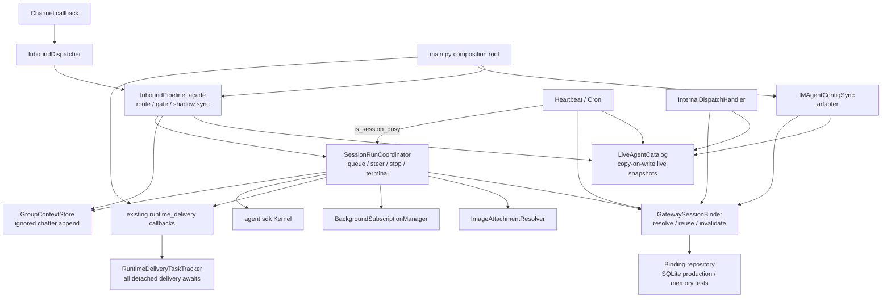
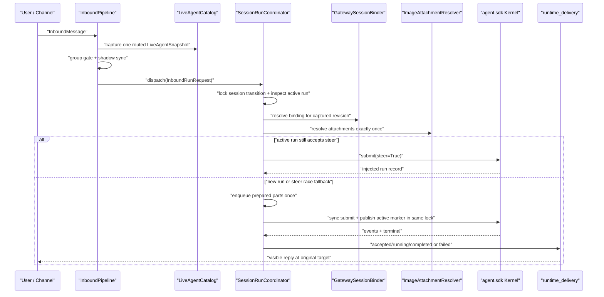
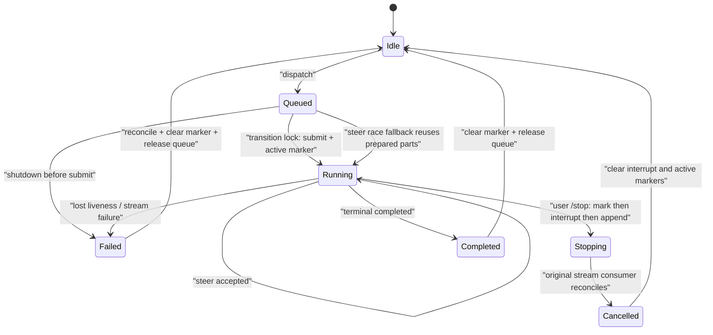

# refactor-463: 收回 InboundPipeline 状态所有权 — 技术方案

> 对齐: `motivation.md` v1
> Unit branch: `unit/refactor-463`（由 change-orchestrator 创建）

## Changelog

- 2026-07-16: 增加 Round 5 verification/code-review 闭环 Milestone M12：把静默 heartbeat 清理收回 Kernel transcript owner，保留 steer 多模态结构，限制 cron 终态索引常驻内存，并补齐 public SDK 契约、e2e 能力前置与真实 CI format gate。
- 2026-07-16: 增加 Round 4 code-review/verifier 闭环 Milestone M9-M11：原子化 steer 与 binding 热路径、收口 heartbeat/cron 真实终态与日志复杂度，并删除 session capability / IM HTTP owner 的重复投影；PR 前统一清理 whitespace gate。
- 2026-07-16: 增加 Round 3 验收闭环 Milestone M6-M8，并行修复 run/relay 终态所有权、binding 隔离与并发、delivery/typed capability 一致性；覆盖 verifier、reviewer 与 full code review 的全部阻断项。
- 2026-07-15: 增加 post-verification Round 2 修复 Milestone M5，把随进程轮换的 internal-dispatch endpoint 从 durable session seed 提升为 `SendMessageTool` 的 live provider，保持 session/history 重启续接。
- 2026-07-15: 增加 post-acceptance Round 1 修复 Milestone M4，闭合 revision/run-control、shutdown resource graph、internal-dispatch readiness 与真实重连问题；保留 `custom_prompt` 当前契约，不恢复已废弃 `system_prompt` 覆盖语义。
- 2026-07-15: 刷新 refactor-461 合入后的 main 基线；依赖已由 PR #197 满足，关键 lifecycle/config seam 与 Approved 设计假设一致。
- 2026-07-14: 根据第二轮独立 design review 把 producer seal 与 in-flight drain 分域，并把 internal-dispatch/fork semantic bind 纳入 post-await stale-write guard。
- 2026-07-14: 根据首轮独立 design review 修订生产消费者清单、完整 shutdown task graph、child drain deadline、配置 revision 发布协议与 submit/stop 线性化。

## 现状分析

### 涉及范围

当前生产入口 `personal_assistant.main.build_runtime()` 同时构造 Kernel、channel、IM 连接、heartbeat/cron、配置同步、会话存储、入站管线和投递 callback。候选 4 命中的不是全部 Gateway 生命周期，而是其中的入站子图：

- `src/personal_assistant/gateway/inbound_pipeline.py` 在 refactor-461 合入后的 main 基线为 1,930 行。`handle_inbound()` 之外还同时拥有 live agent map、session create/reuse、per-session queue、active-run map、steer、`/stop`、user-interrupt marker、group-buffer drain lock、image fetch/validate、kernel stream terminal、terminal reconcile 和 background subscriber map。
- `src/personal_assistant/main.py` 在 refactor-461 合入后的 main 基线为 4,517 行。它在构造 `InboundPipeline` 后再写入 `_shadow_sync`、`_relay_lifecycle_callback`、`_kernel_event_observer`、`_bg_reply_sender`、`_session_event_callback`、`_attachment_fetcher` 六个私有字段；session fork、cron、heartbeat、kernel shim 又直接读取 `_agents`、`_session_store`、`_run_queue`。
- `_IMConfigSyncClient` 和 `_IMShadowConversationSyncClient` 是有完整业务语义的 adapter，却嵌在 `main.py`，并分别把 pipeline 当 live registry/session invalidation owner、把 pipeline 私有字段当装配入口。
- `InternalDispatchHandler` 在真实 `/internal/dispatch` 产品工具路径直接持有 session repository 与启动时 workspace snapshot；`CronRunner` 也直接调用 repository 的 canonical lookup。两者都是 catalog/binder 必须迁移的生产消费者，不是测试旁路。
- `SessionRunQueue` 自己拥有活跃 session 集合，但 heartbeat scheduler 通过 `getattr(run_queue, "_active_sessions")` 判断忙闲；这使 queue 的私有表示成为跨模块契约。
- `BackgroundSessionEventSubscriber` 已封装单个 kernel session 的重连循环，但“每个 session 只启动一个 subscriber、何时关闭全部 subscriber”仍由 pipeline 的裸 dict 隐式承担。当前 Gateway shutdown 没有先停止这些长期任务。
- `runtime_delivery.observer` 用裸 `loop.create_task()` 派发 delta、tool terminal、permission、reconcile 与 bubble finalize；这些投递 task 不属于当前 dispatcher 或 pipeline，Gateway 即使等待 `handle_inbound()` 也可能先关 IM transport。
- 当前有 32 个测试文件直接使用 `InboundPipeline`；其中 18 个文件、108 处访问 pipeline 私有方法或字段。主要覆盖是必要的，但测试表面选错了层级。

本 unit 会调整 `src/personal_assistant/gateway/`、`src/personal_assistant/scheduler/heartbeat_scheduler.py`、`src/personal_assistant/scheduler/cron_runner.py`、`src/personal_assistant/main.py` 及对等测试。IM 服务、channel 协议和 `agent.sdk` 公共 API 不改。

### 既有约束

- `personal_assistant` 只能 import `agent.sdk`，不能穿透 `agent.core` / `agent.platform`；新增 Gateway 模块不得改变这个依赖方向。
- `InboundPipeline.handle_inbound()` 是 channel dispatcher 的稳定入口。外部 channel、Web IM、heartbeat/cron 的路由和投递结果必须保持现有契约。
- 同一 session 的 normal submit、steer、`/stop`、group-buffer destructive drain 和 terminal reconcile 共享并发不变量，不能按“看起来像不同功能”拆给独立 owner。
- live agent 配置会由 IM config sync 动态更新，下一轮用户消息、heartbeat 和 cron 必须读到同一份新快照；不能退回启动时 `config.agents` snapshot。
- session binding 使用 SQLite 在 Gateway 重启后续接，in-memory store 是测试 adapter；不改变表结构、session key 或 reply context 序列化格式。
- `runtime_delivery/lifecycle.py` 已是 relay lifecycle 的生产 seam，`runtime_delivery/background.py` 已拥有 IM/外部 channel 的可见文本投递规则。本 unit 复用它们，不再创建同义 emitter/router。
- `refactor-461` 已由 PR #197 合入，Gateway daemon、PID、timing config 和死 kernel subprocess seam 已清理。本 unit 直接基于该结果，只在真实 Gateway shutdown 中增加“停止入站长期任务”这一个资源步骤，不重新设计进程生命周期。
- refactor-461 的 `gateway.shutdown_grace_seconds` 是父 launcher 从 SIGTERM 到强杀进程组的外层宽限，不是 child `GatewayRuntime` 可直接消费的 drain deadline。本 unit 只能从该值派生严格更短的内部关闭窗口，不能假设已有 runtime budget。
- `refactor-462` 已合入 Kernel per-conversation ownership。本 unit 只依赖现有 `agent.sdk` 语义，尤其保留 `interrupt()` 同步停放 pending steer、`append_message()` 持久化 stop marker、下一次真实 submit 承接 held message 的顺序，不复制 Kernel session owner。
- 测试遵守 `docs/TESTING_GUIDE.md`：行为测试替换 white-box 测试，不在新旧两套测试表面上叠加；新增/拆分后的单测试文件不超过 400 行。

### 可复用能力

| 既有能力 | 结论 | 理由 |
|---|---|---|
| `InboundPipeline.handle_inbound()` | 保留并变窄 | channel 只需要一个入站 façade；路由、group gate、shadow sync 是同一边界决策。 |
| `SessionBindingStore` / `PersistentSessionBindingStore` | 作为 repository adapters 保留 | 已有 in-memory 与 SQLite 两个真实实现，适合作为 Gateway session owner 的内部存储 seam；schema 不需另造。 |
| `SessionRunQueue` | 作为 coordinator 私有实现保留 | per-session FIFO 算法有效；问题是它与 active-run/steer 分家并向 scheduler 泄漏私有集合。 |
| `GroupContextStore` | 保留单实例 | 它已是群背景数据 owner；pipeline 负责 append ignored chatter，run coordinator 在锁内 drain，双方不复制数据。 |
| `BackgroundSessionEventSubscriber` | 保留为单 session worker | reconnect/filter 行为已有覆盖；新增 manager 只拥有实例集合、ensure-once 和 close-all 生命周期。 |
| `runtime_delivery.lifecycle` | 原样复用 callback seam | accepted/running/completed/failed 的 relay 副作用已经集中；另提 `RunLifecycleEmitter` 只会增加一层同义转发。 |
| `runtime_delivery.background` | 保留并改接 Gateway session owner | 可见控制文本、后台回复和 session event 的 IM/外部 channel 语义已经集中。 |
| `runtime_delivery.observer` | 保留事件翻译，补 concrete task tracker | 事件到 IM/external 副作用的映射已有大量行为覆盖；不重写为第二套路由器，但所有 fire-and-forget coroutine 必须进入唯一可 freeze/drain 的 tracker。 |
| `_IMConfigSyncClient` / `_IMShadowConversationSyncClient` | 改名并迁到专属模块 | 两者是生产 adapter，不是 composition 代码；迁移时去掉对 pipeline 私有状态的依赖，不在 `main.py` 留兼容 re-export。 |
| 图片 MIME/结构校验与固定失败文案 | 整体迁入图片 module | 下载、大小、结构验证和 failure kind 是一个高内聚策略，不能只搬 fetch 函数。 |

### 相关历史

- `bugfix-404/410/417/426/430/433` 逐步建立 background reply、terminal reconcile、user-stop attribution、steer 与 group drain 原子性、群裸 `/stop` 和图片失败语义。这些不是待清理的偶然复杂度，而是 `SessionRunCoordinator` 必须隐藏的历史不变量。
- `feat-394` 把 heartbeat/cron 与用户直聊会话、live agent config、canonical binding 联系起来；它也是 `_agents`、`_session_store`、`_run_queue` 从 pipeline 泄漏到 scheduler 的来源。
- `refactor-460` 改 Web IM client runtime，不拥有 Gateway 入站状态；本 unit 只把其既有 relay/continuity 行为作为回归面。
- `refactor-461` 已通过 PR #197 合入并清理候选 8；当前 main 的 `GatewayLifecycleConfig` 与 `GatewayRuntime` shutdown 形态已复核。本 unit 不移动其 daemon、PID、timing migration 或 process shutdown 决策。
- `refactor-462` 的 Approved 设计把 Kernel session 事务收回 `ConversationSession`。Gateway 的 `GatewaySessionBinder` 只拥有“channel/session key ↔ kernel session id/reply target”的产品绑定，边界与 Kernel conversation owner 正交。

## 架构总览

完成后 `InboundPipeline` 只做入站边界决策；跨消息、跨 run、跨重启的状态分别由具体 deep module 拥有。composition root 显式构造对象图，不再在对象构造后修改私有字段。



Before，pipeline 是 live registry、session service、run owner、media policy 和 background task owner 的集合，`main.py` 与测试必须知道内部字段。After，façade 的调用者只知道 `handle_inbound()`；每个下游 module 的 interface 对应一组不可再拆的状态规则。

预计 `inbound_pipeline.py` 会从当前 1,930 行收敛到约 250–400 行的 façade/route policy，`main.py` 会从当前 4,517 行因配置同步与 shadow adapter 迁出、私有 post-wiring 删除而减少约 700–900 行。总仓代码不会等量减少，因为有价值的并发和投递规则只是被归位。成功判据是隐式 interface 与重复测试消失，不是追求行数 KPI。

## 关键决策

### D1. `InboundPipeline` 保持稳定 façade，只拥有入站边界决策

**保留 `handle_inbound(message)`；pipeline 只负责 agent route、group trigger gate、external shadow sync、ignored group chatter append，并把 stop 或正常 run 委托给 coordinator。**

它不再创建 kernel session、持有 queue/active run、读取 stream、下载图片或管理 subscriber。route/gate 是无长期可变状态的紧邻决策，留在 façade 比再拆 `Router` + `Gate` 两个浅 helper 更深；`GroupContextStore` 仍是数据 owner，pipeline 只调用其公开 append。

构造参数收敛为 `LiveAgentCatalog`、`SessionRunCoordinator`、`GroupContextStore`、不可变 `InboundRouteConfig` 和可选 `ShadowConversationSync`。`InboundRouteConfig` 只是 channel binding/default agent 的 immutable value，不伪装成 module。

拒绝把每个私有方法机械变成 handler 类；那会增加跳转次数，却不减少调用者要学习的并发不变量。

### D2. 用 concrete `LiveAgentCatalog` 收回带 revision 的 live agent 快照，不建立单实现 Protocol

**所有用户消息、config sync、session fork、internal dispatch、heartbeat、cron 和 kernel shim 通过同一个 `LiveAgentCatalog` 读写不可变 `LiveAgentSnapshot(config, revision)`。**

catalog 提供 `get`、`require`、`publish`、`is_current`、`values_snapshot`；不暴露 backing dict、mutable values view 或通用 `__getitem__`/`mapping` escape hatch。每次 runtime-relevant 配置变化生成单调 revision；`publish` 用短临界区替换整个 immutable mapping，读者只会捕获完整旧 snapshot 或完整新 snapshot，永不持有会被原地修改的 dict。model、workspace、prompt/tools 与 feature flags 都从同一个 snapshot 读取，禁止先取 config 再单独取 revision。

catalog 只有一个生产实现，不为测试凭空引入 `AgentCatalogPort`；测试直接使用 concrete catalog。远端 IM sync 才是真实外部 seam：把 `_IMConfigSyncClient` 移到 `gateway/agent_config_sync.py` 并命名为 `IMAgentConfigSync`，它完成 fetch/normalize/local-config persistence 后调用 catalog 和 binder。`_IMShadowConversationSyncClient` 同理移到 `gateway/shadow_sync.py`。`main.py` 不保留旧私有类名的 alias/re-export。

config sync 的一致发布协议固定为：先把 normalized config 持久化；再 `snapshot = catalog.publish(agent)`，该 publish 是“后续轮次读到新配置”的线性化点；随后不跨 `await` 调用 `binder.invalidate_stale(agent_id, current_revision=snapshot.revision)`。Binder 在任何 reuse/create 决策中都比较请求 snapshot revision，因此 publish 与 eager cleanup 之间即使发生线程切换，也不会把新 config 与旧 binding 组合使用。旧 snapshot 已开始的轮次可以完整使用旧 revision，但不能在 publish 后把旧 create 结果写回 repository。

删除 catalog 会迫使 config sync、pipeline、scheduler、fork 和 shim 重新共享裸 dict，满足 deletion test；它不是只包一层 getter。

### D3. `GatewaySessionBinder` 成为 Gateway binding 的唯一业务 owner

**session key 的 resolve/reuse/create、workspace 校验、reply context refresh、revision 校验、agent invalidation、reverse lookup、canonical direct lookup 和任意 conversation binding 都经 `GatewaySessionBinder`。**

`SessionBindingStore` 与 `PersistentSessionBindingStore` 降为 binder 内部 repository adapters。因为生产 SQLite 与测试内存是两个真实实现，这条 repository seam 保留；但 repository 不再直接注入 runtime delivery、scheduler、fork handler 或 config sync。调用方改用 binder 的业务方法，不能拿 `.store`。

Binder 构造时接收 concrete catalog，用于每一次 repository write 前的 `is_current(snapshot)` 校验；业务调用接收调用方在操作线性化点捕获的 `LiveAgentSnapshot`，不自行重新读取另一版 config。它拥有 session metadata、PromptSlots/enabled-tools 的 Gateway 组装和 workspace validation；Kernel conversation state 仍归 `agent.sdk`。Binder 在内存维护每个 agent/session binding 对应的 catalog revision，启动时把既有持久化 binding 视为与本地启动 snapshot 同 revision；revision 不写入 SQLite，持久化 key/schema/reply context 格式不变。

`resolve()` 只复用 revision 与请求 snapshot 相同的 binding；不同时用该 snapshot 创建 session。它在跨 `await kernel.create_session()` 前后同时对账 binder generation 与 `catalog.is_current(snapshot)`：若 publish 发生在创建期间，本次已经开始的消息仍可完整使用其旧 snapshot 与刚创建的 session，但旧结果不写回 repository；下一条消息必定按新 revision resolve。`invalidate_stale()` 只删除旧 revision binding，不误删 publish 后已经创建的新 binding。revision/generation check 与 repository bind/drop 在同一个短同步临界区，锁不跨 Kernel await。

`bind_conversation()` 与 create writeback 共用相同的 catalog-current + binder-generation guard，并返回 typed `ConversationBindResult(status="bound" | "stale", binding=...)`。Internal dispatch 在等待 IM ack 后若得到 `stale`，保留已经成功的 IM ack 与对本轮旧 snapshot workspace 的 append 结果，但不写 repository；下一条消息按新 revision 解析。session fork 在等待 `kernel.fork_session()` 后若得到 `stale`，返回失败并进入既有 IM fork rollback，不能把旧 row 留到重启后复活。两条路径都必须在外部 await 前捕获 snapshot、await 后把同一 snapshot 交 binder，调用方不能自行绕过 guard。

`InternalDispatchHandler` 改注入 catalog+binder：来源 Agent workspace 来自请求开始时捕获的 snapshot，IM ack 后调用上述 semantic bind，不再直接调用 `bind_conversation_session` 或持有启动 snapshot。session fork 使用同一个方法；`CronRunner` 与 heartbeat 通过 `find_canonical_direct()` 查 awareness/direct session，runtime delivery 通过 `find_by_kernel_session_id()` 反查，所有生产调用方都不能拿 repository。

拒绝只新增一个 `SessionBinder.bind()` 再让其他调用方继续拿 store；那会保留双 interface。也拒绝把 Gateway binding 与 refactor-462 的 Kernel `ConversationSession` 合并，两者跨的是不同产品边界。

### D4. `SessionRunCoordinator` 原子拥有 queue、steer、stop 与 terminal

**`SessionRunCoordinator` 是每个 Gateway session 从 submit admission 到 terminal cleanup 的唯一 owner；`/stop` 不单独提成 handler。**

它私有持有 `SessionRunQueue`、active-run map、bounded per-session transition-lock map、user-interrupted run set 和 run idle timeout。对外只有 `dispatch(request)`、`stop(request)`、`is_session_busy(session_key)`、`seal()`、`settle_admission(deadline)`、`drain(deadline)`；heartbeat scheduler 通过 `is_session_busy` 判断，不再读取 queue 私有集合。

以下时序作为一个 transaction 迁移，任何 milestone 不得拆开：

1. steer fast path 在同一 per-session transition lock 内完成 active-run check、binding resolve、group buffer destructive drain、图片 parts 构造和 `kernel.submit(steer=True)`。
2. 若 active run 在竞争窗口结束，已经构造的 parts 只转交 queued fallback 一次，不能重复 drain 或下载。
3. normal submit 在 queue slot 内取得 binding，并在同一 transition lock 内构造 parts、同步调用 `kernel.submit()`、立即登记 active marker，再释放锁并消费本 run 的 stream。当前 SDK `submit()` 是同步非阻塞调用，submit 成功与 marker publish 之间不得出现 `await` 或第二把锁；submit 抛错则不发布 marker。
4. `/stop` 与 steer 必须取得同一 per-session transition lock 后观察 active marker。这样 `/stop` 要么在线性化点前看到 idle，要么在线性化点后看到完整 run id，不存在“Kernel 已接纳但 Gateway 仍判 idle”的窗口。群聊 idle agent 在创建 binding 前零副作用返回；对 active run 先登记 user-interrupt marker，再 `kernel.interrupt()`，再 append 既有 user interruption message；reconcile 仍由原 run stream consumer发出，stop caller 不抢发。
5. terminal/stream-end/watchdog 都在同一 owner 内决定 completed/cancelled/failed、发 reconcile、清 active marker 和 interrupt marker，最后释放 queue；failure 不能悬住后续消息。

transition lock 同时取代现有 drain lock + global active-map lock 的跨锁观察；它可以跨 binding/image await，因为范围就是该 session 的 admission transaction，不阻塞其他 session。`is_session_busy()` 同时观察 queue/admission 与 active marker，但不暴露集合。

Coordinator 仍调用 `runtime_delivery.lifecycle` 产出的 callback，不创建新 emitter。`RelayLifecycleUpdate` / `PipelineResult` 等共享 DTO 移到 `gateway/inbound_models.py`，消除 `runtime_delivery.lifecycle -> inbound_pipeline` 的反向类型依赖；不在旧模块保留兼容 re-export。

删除 coordinator 会让 queue admission、steer fallback、stop attribution、watchdog 和 terminal cleanup 再次散回 façade 与 scheduler，满足 deep-module deletion test。

### D5. 图片解析是独立策略 module，但 group/input 原子性仍由 coordinator 控制

**`ImageAttachmentResolver` 整体拥有 fetch、size cap、magic/structural validation、MIME authority、base64 data URL 和 failure kind；coordinator 拥有“何时恰好调用一次”。**

`resolve(attachments)` 返回 typed `ImageResolution(parts, failure)`。无 fetcher 时继续保留 raw URL 的现有 product-agnostic/test 行为；任一坏图片仍整轮失败。固定用户文案和“失败不写 Kernel history”由 coordinator 的可见控制回复路径保持。

不把 group-buffer drain 放进 image resolver，也不建立 `MessagePartsBuilder` public seam。文本 sender prefix、background drain 与图片 parts 的组合属于 run transaction 的内部算法，暴露后只会让测试重新拼装同一不变量。

### D6. subscriber、入站 task 与投递 task 形成一张可封口的资源图

**每个 kernel session 最多一个 `BackgroundSessionEventSubscriber`，实例集合只存在于 `BackgroundSubscriptionManager`；所有脱离调用栈的 runtime-delivery coroutine 只由 concrete `RuntimeDeliveryTaskTracker` 创建。Gateway shutdown 先封 admission，再让 Kernel 终态穿过仍存活的 consumer，最后 drain 投递并关闭 IM。**

manager 的 `ensure(session_id, after_sequence, reply_context, agent_id)` 直接接收 agent id，不再从 `session_key.rsplit()` 猜。首次迁移保持当前 stream anchor/replay、session event filter、BACKGROUND_TASK dedupe key 和可见文本投递语义，不顺手修正 cursor 策略。已有 subscriber 不重建，避免 turn 间事件空窗。`seal()` 只拒绝新 subscriber；既有 subscriber 在 Kernel 关闭期间继续消费并保持原重连策略，不能在 Kernel 前被 cancel。Kernel `aclose()` 返回后，`aclose(deadline)` 才停止剩余 subscriber 并等待其当前 callback 收尾。

`RuntimeDeliveryTaskTracker` 由 composition root 单例构造并注入 `runtime_delivery.observer`。observer 内 delta、tool terminal、permission、external mirror、skill-created、`run_terminal_reconcile` 与 bubble finalize 的所有裸 `create_task` 都改走 `tracker.start(coro, name=...)`；ordering-critical callback 仍直接 await。tracker 在所有 event producer 结束前保持 open，之后 `close_and_drain(deadline)` 先拒绝新 task、反复 drain 到集合为空。它不改变投递规则，只补齐资源 ownership。

`InboundDispatcher` 从 `main.py` 移到 `gateway/inbound_dispatcher.py`，继续负责 sync channel callback → Gateway event loop 的线程边界，并追踪 event-loop task 与 `run_coroutine_threadsafe` future 对应的每个 `handle_inbound` root。`SessionRunQueue`/最终 coordinator 同时追踪自己创建的 per-session worker，不能以 root task 尚在 await future 为由忽略 worker owner。

所有 producer 必须把“逻辑上拒绝新 work”与“等待当前 handler/tick 结束”拆成两个动作。`InboundDispatcher.seal()`、`InternalDispatchHandler.seal()`、heartbeat/cron `request_stop()` 与 subscription/coordinator seal 都是 O(1) 同步状态切换：不做网络 I/O、不 join task、不等待 aiohttp handler、heartbeat tick 或 transition lock。已有 channel 即使在物理 stop 前回调，也会被 sealed dispatcher 拒绝；internal HTTP listener 尚未 cleanup 时，新 handler 只返回现有 unavailable/503 结果，不再触碰 Kernel。物理 `AppRunner.cleanup()`、heartbeat `close()` 与 cron drain 都属于 Kernel close 后的 consumer drain。

关闭 admission 的确定语义是：已成功 `kernel.submit()` 并发布 active marker 的 run 继续由 Kernel close 推进终态；已经进入 FIFO、但 operation 尚未开始的项立即从 queue 摘除，通过既有 relay lifecycle `failed` 终态以 `gateway_shutdown_before_submit` 内部 reason 收尾，不再调用 Kernel，也不新增用户文案或 wire protocol；正在 transition lock 内准备/提交的队首项由 `settle_admission(deadline)` 等待其完成 submit+marker 或 rollback 原子区，再归入 active run。dispatcher seal 之后的新 callback 被拒绝且不进入 accepted snapshot。

refactor-461 合入后的 `GatewayRuntime` 按以下完整状态机关闭：

1. `request_shutdown()` 首次被调用时立即记录 `shutdown_started_at`；进入 cleanup 的第一条语句计算 `inner_deadline = shutdown_started_at + 0.8 * config.gateway.shutdown_grace_seconds`。这个 80% 是内部常量，不新增配置；其 duration 严格小于父 launcher 的 100% 强杀宽限，预留 20% 给超时取消传播、IM/resource 最终 close attempt 与进程退出；若运行故障未经过 `request_shutdown()`，以进入 cleanup 的 monotonic time 为起点；
2. 不 await 地执行所有逻辑 seal：dispatcher/pipeline/coordinator/subscription freeze，internal dispatch handler seal，heartbeat/cron request-stop；随后调用既有同步 `stop_channels`。这些动作只改 admission flag/注册状态，不能复用当前会 join worker 的复合 `close()`；
3. 在 `inner_deadline` 的 remaining time 内执行 `dispatcher.settle_admission(deadline)`：经 pipeline 等待正在 transition lock 内的队首项跨过 submit-or-rollback，并让 queue 摘除项完成 failed lifecycle。该步骤超时要记录 session/item 并继续 Kernel close，不能阻断后续 best-effort 收拢；
4. 用同一 remaining time 等待 `kernel.aclose()`，让已提交 run 发 terminal；超时记录仍 active 的 session/run 并继续后续 drain，父 launcher 仍是最终 hard bound；
5. Kernel close 发起后，才并发启动/等待物理 producer-consumer drain：internal dispatch `AppRunner.cleanup()`、heartbeat `close()`（此时只等待已 request-stop 的当前 tick）、cron dispatcher、coordinator queue workers、dispatcher accepted roots 与 background subscribers。每项都是具名 task，全部接收同一 absolute deadline；单项超时记录 owner/task 并取消该 owner 可取消的 task，不得因一个异常跳过其他项；
6. roots/subscribers/heartbeat/cron 已不能再产生投递后，`await delivery_tasks.close_and_drain(inner_deadline)`；超时记录 task name/event kind 并取消 tracker-owned task；
7. 最后沿用 refactor-461 的 IM task/transport 与同步 resource closer 顺序。任何 shutdown await（包括 aiohttp cleanup 与 heartbeat close）都必须通过同一个 remaining-deadline helper，不能在 deadline 建立前顺序等待，也不能各自重置 timeout。

M2 先给现有 `SessionRunQueue` 落最终会被 coordinator 私有复用的 `seal_and_cancel_pending()` / `drain_workers(deadline)` 资源语义，M3 只把同一 queue 纳入 coordinator，不建立临时双 owner 或兼容 shim。这样 M2 即可证明 shutdown task graph 闭合，M3 不需要重新发明关闭协议。

### D7. composition root 按可用依赖顺序一次构造，合法晚绑定只用 provider function

**`build_runtime()` 不再对 pipeline、catalog、binder、queue 或 subscriber manager 做任何私有字段赋值。**

构造顺序固定为：

1. Kernel、`LiveAgentCatalog`、binding repository 与 `GatewaySessionBinder`；
2. channel registry、outbound router、group context store；
3. 声明 live IM manager provider，并构造 token getter、`IMAgentConfigSync`、shadow/image adapters、`RuntimeDeliveryTaskTracker` 与既有 runtime-delivery callbacks；
4. `BackgroundSubscriptionManager` 与 `SessionRunCoordinator`；
5. `InboundPipeline` 与 `InboundDispatcher`；
6. session fork、`InternalDispatchHandler`、heartbeat/`CronRunner`/kernel shim 统一注入 catalog/binder/coordinator 的公开方法；internal dispatch 不再接 workspace snapshot，cron 不再接 session repository；
7. IM connection manager 与 `GatewayRuntime`。

若 IM manager 因互相引用尚未生成，现有 `lambda: im_connection_manager` provider 是真实连接生命周期 seam，可以保留；它返回资源，不暴露 owning object 的私有字段。可在构造时直接提供的依赖一律不用 setter、mutable callback bag 或 `None` 后补。

### D8. 测试面从私有布局切到四个稳定 interface，并增加架构删除闸

**新测试只通过 `InboundPipeline`、`LiveAgentCatalog`、`GatewaySessionBinder`、`SessionRunCoordinator` 和两个资源 module 的公开行为验证；对等 white-box 测试同步删除。**

- route/gate/shadow/group ignored chatter 通过 `handle_inbound()` 测。
- live config、binding reuse/restart/invalidate/conversation bind/canonical lookup 通过 catalog/binder 测，repository 自身保留 schema/SQLite 测试；race 同时暂停在旧 binding reuse、`create_session` await、internal-dispatch IM ack 与 session-fork await，证明只出现完整旧 revision 或完整新 revision，所有 stale semantic bind 均不落库。
- internal dispatch 用 live snapshot + binder 同步直聊历史、CronRunner 用 binder canonical lookup，各有生产 interface 测试，不再以 fake repository duck typing 验收。
- concurrent steer/queue/stop/watchdog/reconcile 通过 coordinator 的 dispatch/stop 和可观察 fake Kernel/callback 结果测，不读 active map、transition lock 或 interrupt set；在 submit 返回后、marker publish 前设置测试暂停点，证明 stop/steer 不能观察半提交状态。
- image resolver 与 subscriber manager 分别测试 typed output、ensure-once、close-all；用户可见 failure/background reply 仍从 pipeline/coordinator 边界测一次。
- shutdown 测试建立 internal-handler/heartbeat-tick/cron-execution/accepted-root/queue-worker/subscriber/delivery-task 台账：逻辑 seal 不 await，active heartbeat/internal handler 时仍先进入 Kernel close，queued-before-submit 得到 failed terminal、subscriber 在 Kernel 前不关闭、observer 无裸 detached task、terminal/finalize 在 IM close 前完成；deadline 在任何 shutdown await 前只计算一次且每步拿相同 absolute deadline。
- `build_runtime` 测试通过真实构造成功、公开行为与资源关闭证明 wiring，不再断言 `runtime._on_inbound._pipeline._session_store` 一类对象图内部路径。
- contract test 禁止 `src/personal_assistant/main.py` 和 scheduler/config-sync 代码出现 `pipeline._*`、`catalog._*`、`binder._*` 或对 `SessionRunQueue._active_sessions` 的读取；禁止旧 `_IMConfigSyncClient` / `_IMShadowConversationSyncClient` 生产 import 重新出现。

不是把 108 个 private access 一比一改成新 private access；覆盖同一行为的新接口测试建立后，旧断言删除。

### D9. 行数下降是结果，不以制造薄模块换数字

**本 unit 接受 source-file 行数显著下降，但拒绝以总行数或类数量作为验收门槛。**

`inbound_pipeline.py` 的大部分代码会按状态 owner 迁出；`main.py` 中约 600 行 config sync、约 100 行 shadow sync、dispatcher 和私有 wiring 会离开 composition root。新模块必须满足上述 interface/deletion test；如果实施只把函数复制到新文件、仍共享 dict/lock 或让调用方手排顺序，worker 必须停止并修订设计，而不是以“两个文件变短了”宣告完成。

## 接口与数据流

### 稳定接口

```python
class LiveAgentCatalog:
    def get(self, agent_id: str) -> LiveAgentSnapshot | None: ...
    def require(self, agent_id: str) -> LiveAgentSnapshot: ...
    def publish(self, agent: AgentWorkspaceConfig) -> LiveAgentSnapshot: ...
    def is_current(self, snapshot: LiveAgentSnapshot) -> bool: ...
    def values_snapshot(self) -> tuple[LiveAgentSnapshot, ...]: ...

class GatewaySessionBinder:
    async def resolve(self, request: SessionBindingRequest, agent: LiveAgentSnapshot) -> SessionBinding: ...
    def lookup(self, session_key: str) -> SessionBinding | None: ...
    def invalidate_stale(self, agent_id: str, *, current_revision: int) -> None: ...
    def find_by_kernel_session_id(self, kernel_session_id: str) -> SessionBinding | None: ...
    def find_canonical_direct(self, *, channel_name: str, agent_id: str) -> SessionBinding | None: ...
    def bind_conversation(self, request: ConversationBindingRequest, agent: LiveAgentSnapshot) -> ConversationBindResult: ...

class SessionRunCoordinator:
    async def dispatch(self, request: InboundRunRequest) -> PipelineResult: ...
    async def stop(self, request: StopRunRequest) -> PipelineResult: ...
    def is_session_busy(self, session_key: str) -> bool: ...
    def seal(self) -> None: ...
    async def settle_admission(self, deadline: float) -> None: ...
    async def drain(self, deadline: float) -> None: ...

class ImageAttachmentResolver:
    async def resolve(self, attachments: object) -> ImageResolution: ...

class BackgroundSubscriptionManager:
    async def ensure(self, request: BackgroundSubscriptionRequest) -> None: ...
    def seal(self) -> None: ...
    async def aclose(self, deadline: float) -> None: ...

class RuntimeDeliveryTaskTracker:
    def start(self, awaitable: Awaitable[object], *, name: str) -> None: ...
    async def close_and_drain(self, deadline: float) -> None: ...

class InboundPipeline:
    async def handle_inbound(self, message: InboundMessage) -> PipelineResult | None: ...
    def seal(self) -> None: ...
    async def settle_admission(self, deadline: float) -> None: ...

class InboundDispatcher:
    def bind_loop(self, loop: asyncio.AbstractEventLoop) -> None: ...
    def __call__(self, message: InboundMessage) -> None: ...
    def seal(self) -> None: ...
    async def settle_admission(self, deadline: float) -> None: ...
    async def drain(self, deadline: float) -> None: ...
```

`LiveAgentSnapshot`、`ConversationBindResult` 与 request/result DTO 都是 frozen dataclass，携带完成该操作所需的业务值；不携带 backing store、lock、queue 或 mutable callback collection。`ConversationBindResult.binding` 只在 `status="bound"` 时存在，`stale` 明确表示 repository 未写入。`SessionBindingRepository` 是 binder 私有 typing seam，不从 Gateway façade 导出。`deadline` 一律是同一 event loop 的 monotonic absolute time，不是可被每层重置的 duration。这些 `seal()` 只是同一 ownership 链的同步级联，不启动 task 或等待资源；实际异步等待只发生在 `settle_admission` / `drain`。

### 正常消息与运行中插话



图中的关键不是“先调用哪个 helper”，而是 transition lock 覆盖 active check 到 kernel steer admission，并让 normal submit 与 active marker 成为 stop/steer 看来不可分的线性化点；race fallback 使用同一份 prepared parts。用户输入不会因为模块拆分被 drain/download 两次。

### 单 session run 状态与 `/stop` 归属



`Stopping` 不能由独立 StopCommandHandler 拥有：它依赖 Running owner 的 active marker、stream consumer 和 terminal cleanup。状态机也解释了为什么 M3 虽大仍必须原子迁移。

### 配置更新与会话失效

IM config sync 先规范化远端 profile 并持久化 local config，再执行 `new = catalog.publish(agent)` 与紧邻的 `binder.invalidate_stale(agent_id, current_revision=new.revision)`。catalog publish 是配置切换线性化点；binder 对 reuse 与 create-writeback 都校验 snapshot revision，所以并发消息只会完整使用旧 revision 或完整使用新 revision。下一条消息/heartbeat/cron/internal dispatch 从 catalog snapshot 取配置；config sync 不接触 pipeline/coordinator 私有状态。

## 契约层增量 (delta-spec)

- kernel: no spec delta
- im: no spec delta
- gateway: no spec delta
- cli: no spec delta

本 unit 是纯内部 Gateway ownership 重构；`docs/specs/gateway/routing-delivery.md`、`external-channels.md`、`service-lifecycle.md` 中的 current 行为全部作为回归基线，不产生 delta spec。

## 风险与回退

| 风险 | 控制 | 回退 |
|---|---|---|
| steer 与 group drain 拆迁后重复 drain、丢 sender 或丢消息 | M3 用同一 coordinator transaction + race tests，prepared parts 只能消费一次 | 整体回退 M3，不保留旧/新 active maps 双写 |
| `/stop` 提前 reconcile 或 marker 清理时机改变 | 固定 mark → interrupt → append，reconcile 只在 original stream consumer，terminal finally 单点清理 | 整体回退 M3；禁止临时 StopCommandHandler/flag |
| live agent 更新只到达部分消费者或出现新 config + 旧 binding | 所有生产消费者只收 snapshot/binder；revision 同时约束 reuse/create writeback，race test覆盖 reuse 与 create await | 回退 M1；不恢复 startup snapshot + live dict 双源 |
| binder 封装后重启、conversation bind、heartbeat/cron canonical session 漂移 | repository schema/key 不变，internal dispatch/fork 的 post-await write 也走 current+generation guard，cron/heartbeat 只走 canonical binder lookup | 回退 M1，新代码未迁数据，无数据回滚 |
| background/terminal 在 shutdown 丢最后事件、queued item 在 Kernel close 后误提交或泄漏 task | 先 seal admission 并失败收尾未开始 queue item，subscriber 活到 Kernel terminal，accepted roots/queue workers/subscriber/delivery tracker 依次 drain 后才关 IM | 回退 M2；保留现有 subscriber worker与事件协议，不留半套 tracker |
| producer close 在 Kernel 前阻塞，或 child drain 与父 launcher 同时到期 | 所有 producer 先 O(1) seal、Kernel 后才 drain current handler/tick；shutdown 起点只计算一次，所有 await 共用 80% absolute deadline，保留 20% outer-grace 余量 | 回退 M2 的 inbound lifecycle hook；不新增 timing config、不改变父进程 stop 语义 |
| 图片失败投递或 dedupe key 改变 | typed failure 保留固定文案和现有 visible sender，failure 不 submit/不写 history | 回退 M2，无持久化迁移 |
| 与 refactor-461 同改 `main.py` / `GatewayRuntime` 冲突 | 实施依赖 461；orchestrator 从 461 合入后的 main 建 unit 分支，再按其最终构造/关闭形态落一处 inbound close | 未满足基线时不启动 worker，不在旧 main 预做兼容分支 |
| refactor-462 改 Kernel 内部但保留 SDK 时序 | 只调用 `agent.sdk`，用 `/stop`、steer、restart E2E 对账 | 若 SDK observable 发生变化，阻断本 unit，回到对应 unit 处理 |
| 只搬文件、总认知负担不降 | 每个 module 做 deletion test；删除 private access 与旧测试，不允许共享 backing state | reviewer 拒绝 milestone，不以 LOC 达标放行 |

所有迁移不改持久化 schema，没有数据 migration。每个 milestone 可独立 git revert；不使用长期 feature flag、双写或兼容 shim。

## Runbook for Reviewer

本 unit 改 Gateway 常驻进程；真栈还需要 IM 作为用户入口。命令以 refactor-461 合入后的 `scripts/e2e-up.sh` / `e2e-down.sh` 为准，worktree 使用隔离高位端口与本地 config。

| 服务 | 停止命令 | 启动命令 | 健康检查 |
|---|---|---|---|
| Gateway + IM 隔离真栈 | `./scripts/e2e-down.sh` | `./scripts/e2e-up.sh` | `source .e2e-ports.env && curl -fsS "$IM_URL/openapi.json" >/dev/null && kill -0 "$(cat .gateway.pid)" && grep -Eq 'auto-bound to IM|Gateway started|node_id=|INFO im_connection' .gateway.log` |

**Review 驱动方式**: 端到端真栈；本 unit 不改客户端面，reviewer 使用 Web IM 实际调用的 IM HTTP/WebSocket 接口驱动同一 Gateway 路径。至少执行 `scripts/e2e-critical.sh -k 'background or stop or restart_session_continuity or group_chat'`，并用隔离真栈补走图片成功/失败、运行中连续插话、IM 断开后外部 channel 不阻塞。Feishu 真平台凭据不作为默认门禁，外部 trigger-source/影子投递用既有 integration + 可控 channel adapter 覆盖。

## Milestones

本 unit 预计迁移/改写超过 1,200 行生产代码、触及超过 20 个生产与测试文件，且包含三个可独立验收的状态 owner，满足强拆分条件。三个 milestone 串行：它们都会修改 composition root 和临时 façade，不能并行；每一步落地后系统都只有一套 owner，不留双写。M3 内的 queue/steer/stop/terminal 虽仍较大，但它们共享同一状态机与锁范围，再拆会制造跨 milestone 双 owner。

Round 3 的实现缺口分属三个独立 owner，可并行闭环：M6 收敛 run/relay/permission terminal ownership；M7 修复 binding key 隔离与 binder 临界区；M8 收敛共享 stream、typed identity 与 unattended session capability。三者均基于 M5，禁止以跨 owner 的局部补丁互相兜底。

Round 4 的阻断项先分成两个可并行 owner：M9 在 SDK/run registry 与 binder 内闭合 steer compare-and-inject 及长会话 reuse 热路径；M10 在 background lifecycle owner 内闭合 heartbeat/cron terminal consumption 与 cron history 更新复杂度。M11 等两者合入后再删除 foreground/unattended session capability 双投影与 config-sync 私有 IM HTTP helper 依赖，避免并行修改 composition root。图片失败前 destructive group drain 与 transition lock 跨 image/binding await 均是 D4/D5 已批准语义，不作为 fix；terminal error parser 和 stop binding wrapper 的局部重复当前没有行为偏离，不阻塞本 unit。

| ID | 标题 | 依赖 | 并行组 | 范围 | 退出标准 |
|---|---|---|---|---|---|
| M1 | live agent 与 Gateway session ownership | refactor-461 | A | 新增 `gateway/agent_catalog.py`、`gateway/session_binder.py`、`gateway/agent_config_sync.py`、`gateway/shadow_sync.py`；调整 `gateway/session_keys.py`、`gateway/internal_dispatch.py`、`gateway/runtime_delivery/background.py`、`scheduler/heartbeat_scheduler.py`、`scheduler/cron_runner.py`、`main.py`、`inbound_pipeline.py`；迁移/拆分 config-sync、session-reuse/conversation-bind、internal-dispatch、heartbeat/cron、build-runtime 测试 | [reviewer] 直聊/群聊与 `send_message` 仍路由/续接正确，动态 agent 配置下一轮生效，Gateway 重启后续接原会话，cron awareness 仍进 canonical direct session，未知 agent 仍拒绝；[worker] catalog copy-on-write revision、binder create/reuse/invalidate-generation/reverse/canonical/conversation-bind 通过 interface 测试，config publish race 同时覆盖旧 binding reuse、跨 `create_session` await、internal-dispatch IM ack 与 session-fork await；stale create/conversation bind 均不写 repository，fork stale 走既有 rollback，结果只允许完整旧/新 revision，SQLite schema/key/reply-context格式无变化；internal dispatch 无 workspace snapshot，CronRunner/heartbeat/runtime delivery/fork 无直接 repository；`main.py`/scheduler/config-sync 无 `pipeline._*` 或裸 agent dict；相关测试文件符合 400 行约束；最窄测试后 `pytest -m "not e2e"`。 |
| M2 | 图片、后台订阅与 ingress resource ownership | M1 | B | 新增 `gateway/image_attachments.py`、`gateway/background_subscriptions.py`、`gateway/inbound_dispatcher.py`、`gateway/inbound_models.py`、`gateway/runtime_delivery/task_tracker.py`；调整 `inbound_pipeline.py`、`run_queue.py`、`background_session_events.py`、`runtime_delivery/background.py`、`runtime_delivery/lifecycle.py`、`runtime_delivery/observer.py`、基于 refactor-461 的 `GatewayRuntime/main.py`；迁移 image/background/session-event/shutdown/build-runtime 测试 | [reviewer] 有效图片与固定失败反馈不变；后台任务结果仍回原会话且不重复；停止时已提交 run 有终态，尚未开始的 queued item 明确 failed，IM 离线不阻断外部 channel；[worker] resolver typed 结果、subscriber ensure-once/replay/dedupe/seal/close、queue pending cancellation/worker drain、dispatcher accepted-root tracking 与 observer tracker 均由公开接口验证；shutdown 在任何 await 前建立 one 80% deadline，O(1) seal dispatcher/internal-dispatch/heartbeat/cron/subscriber/queue，settle transition 后 Kernel close，再以同一 deadline 并发 drain AppRunner/current heartbeat tick/cron/roots/workers/subscribers，最后 delivery drain → IM close；active heartbeat/HTTP handler 测试证明不阻塞 Kernel close，subscriber 不在 Kernel 前 cancel，observer 无裸 detached coroutine，单项 timeout 不跳过其余 drain；Gateway 关闭后无 `bg-sse-sub:*`、queue worker、inbound root 或 delivery task；无旧私有 callback post-wiring/旧 class re-export。 |
| M3 | SessionRunCoordinator 与最终窄 façade | M2 | C | 新增 `gateway/session_run_coordinator.py`；调整 `inbound_pipeline.py`、`run_queue.py`、`runtime_delivery/lifecycle.py`、`scheduler/heartbeat_scheduler.py`、`main.py`；迁移 route/group/steer/queue/stop/watchdog/reconcile/external-delivery/build-runtime 测试并增加 architecture contract | [reviewer] 同会话串行/跨会话并行、连续插话、群背景与 sender、活动/空闲 `/stop`、liveness/真实 stall、NO_REPLY、终态失败、外部影子边界与启动停止重连全部与 motivation 场景一致；[worker] transition lock 保证 active-check/drain/steer 与 normal submit→marker 对 stop/steer 线性化；测试在 submit 暂停点证明 stop/steer 不能观察半提交状态；steer race 只 drain/download 一次，mark→interrupt→append→stream reconcile 顺序、所有 terminal cleanup、`is_session_busy` heartbeat gate 均从 coordinator public interface 验证；M2 的 queue seal/drain 语义只变成 coordinator 私有实现、不重写；`InboundPipeline` 不再拥有 run/session/media/subscriber state；32 个既有测试文件完成行为覆盖盘点，私有访问对等删除；`ruff check src tests`、`pytest -m "not e2e"`、关键路径 e2e 通过。 |
| M4 | 验证闭环与 owner 竞态修复（post-acceptance fix, round 1） | M3 | D | 调整 catalog/binder/coordinator、heartbeat/cron、background subscription/delivery、dispatcher/queue/shutdown、internal dispatch server、config sync/shadow sync 与 composition root；补跨 owner 竞争、权限、关闭终态、重连、真实投递及 architecture 测试 | [reviewer] `custom_prompt` 动态更新在下一轮/新会话生效；真 `send_message` 可送达；SIGTERM 后所有 accepted work 有用户可见终态；Gateway 存活断线可自动恢复；[worker] active run-control handle 固定原 kernel session/revision，stop/steer 无错会话、孤儿或重复 run；internal-dispatch/fork 不重标旧 revision；空 tool allowlist 保持零权限；heartbeat/后台事件使用正确 revision/context；IM shadow 不重复 mirror；shutdown seal/drain 顺序不丢 terminal、cron admission 或底层 dispatcher task；internal-dispatch endpoint 与 readiness 一致且多 Gateway 不冲突；cron execution owner 从 `main.py` 收回；D7 构造期依赖、具名 admission timeout、真实 catalog/binder config-sync 测试与 whitespace gate 闭合；最窄测试、`ruff`、非 e2e 全量与隔离真栈通过。 |
| M5 | 重启后的 live dispatch capability（post-verification fix, round 2） | M4 | E | 调整 `personal_assistant.product`、`tools/send_message.py` 与 Gateway composition；补 durable session reuse + endpoint rotation + 真 tool dispatch 交叉回归 | [reviewer] Gateway 重启后原 conversation/session/history 续接，随后 `send_message` 只访问新进程 endpoint 并完成目标投递；[worker] internal-dispatch endpoint 由进程级 owner 以 callable/provider 注入 PA Kernel 的 `SendMessageTool`，每次 tool call 解析当前 URL；生产路径不依赖 session 中持久化的旧 URL，未 ready/已 shutdown 时 fail-fast；无 provider 的独立 tool 保留 metadata 兼容；端口 A 创建并持久化 session → owner 重启到端口 B → 同 binding/session id 复用 → 请求只到 B，A 零请求；不改变 binding schema、session key、history 或 IM API；最窄测试、`ruff`、非 e2e 全量与真重启旅程通过。 |
| M6 | run/relay 终态所有权闭环（post-acceptance fix, round 3） | M5 | F | 调整 public `agent.sdk` steer seam、`gateway/session_run_coordinator.py`、`gateway/inbound_dispatcher.py`/IM relay owner 与 permission watchdog；补真实 Kernel terminal race、idle-failure 后续工作恢复及 permission pending 回归 | [reviewer] relay idle 明确失败后 Gateway/node 保持在线，同会话与新会话的下一条消息都会进入运行并得到回复或新的明确终态，无需重启；[worker] `steer` fallback 只产生并接管一个 run，任何合法 terminal race 下均无 orphan、duplicate history/tool side effect 或第二次 submit，run/stream/lifecycle/shutdown owner 唯一；一次 inbound root 失败不能终止 relay 后续 admission；permission pending 期间 watchdog 不误杀，resolved 后恢复具名 timeout；fake 与 public SDK 契约一致；真实 Kernel 竞态、真 IM/Gateway/LLM idle-failure 恢复、`/stop`、shutdown、最窄测试、`ruff` 与非 e2e 全量通过。 |
| M7 | binding 隔离与并发闭环（post-code-review fix, round 3） | M5 | F | 调整 `gateway/session_keys.py`、`gateway/session_binder.py` 与 binding repository/interface tests | [worker] agent id 中的 `_`/`%` 始终按字面值匹配，stale invalidation 不删除其他 agent 的 binding；workspace ownership 校验不在 binder 全局锁内扫描完整 transcript，同时用 generation/recheck 等原子协议保持 invalidate/config publish/create race 语义；跨 agent 长 transcript 不串行阻塞 resolve/invalidate；永久隔离、并发与现有 binder race 回归、最窄测试、`ruff` 与非 e2e 全量通过。 |
| M8 | delivery、typed identity 与 unattended capability 一致性（post-code-review fix, round 3） | M5 | F | 调整 `gateway/runtime_delivery/stream.py`、`scheduler/cron_execution_service.py`、`gateway/shadow_sync.py`、unattended session composition 与相关 tests | [reviewer] failed/cancelled cron 不显示为成功完成或写入成功 awareness；typed external 消息仍同步到正确 shadow；配置为受限 skills 的 Agent 在 cron/heartbeat 中不获得额外能力；[worker]共享 stream 返回 typed terminal outcome 并只使用 `agent.sdk.TERMINAL_RUN_STATUSES`；cron 按真实终态记录 completed/failed/cancelled 且失败 partial text 不进入成功 awareness；shadow 使用 canonical typed-first external identity；cron/heartbeat session 精确继承 `agent.config.skills`，`None` 与空集合语义不漂移；永久回归、最窄测试、`ruff` 与非 e2e 全量通过。 |
| M9 | 原子 steer 与 binding reuse 热路径（post-verification fix, round 4） | M8 | G | 调整 `agent.core` run registry、public `agent.sdk` steer seam、`gateway/session_run_coordinator.py`、`gateway/session_binder.py` 与相关 contract/unit tests | [worker] compare active run、注入 pending message 与返回 run identity 是一个原子语义；coordinator 只向自己 marker 指定的 run 注入并按同一 run 清算 follower，A terminal/B active 切换窗口不串 run、不丢 reply、不重复 fallback；binding workspace ownership 在进程首次接管或 revision 变化时权威验证，稳定 reuse 不再每轮扫描增长中的 JSONL，restart/mismatch/invalidate race 仍正确；聚焦竞态/复杂度回归、`ruff` 与非 e2e 全量通过。 |
| M10 | heartbeat/cron 真实终态与持久化复杂度（post-verification fix, round 4） | M8 | G | 调整 heartbeat scheduler/runner、共享 runtime-delivery stream、cron execution/history owner、composition 与相关 tests | [reviewer] heartbeat failed/cancelled 不伪装成静默成功、不错误清理历史；无 IM 投递配置的 cron 仍展示真实 completed/failed/cancelled 历史；[worker] silent heartbeat transcript baseline 必须在 submit 前捕获并随 run record 传递，快完成也精确回滚；heartbeat 显式消费 typed terminal status/error，非成功走失败呈现且不 silent trim；cron terminal consumption 是 mandatory owner、IM observer/delivery 只是 optional adapter，no-delivery 不得提前 completed；CronRunsStore 只在装载时重放一次日志，单次状态更新不再 O(history)，并发/重启 materialization 不漂移；永久回归、真 Kernel 失败证据、`ruff` 与非 e2e 全量通过。 |
| M11 | session capability 与 IM transport owner 收口（post-code-review fix, round 4） | M9, M10 | H | 新增中立 session composition / IM HTTP transport owner；调整 binder、unattended shim、config sync、shadow sync、composition root、architecture tests，并清理 Round 4 whitespace gate | [worker] foreground 与 cron/heartbeat 从同一 typed snapshot projection 得到 prompt/tools/features/skills，scenario metadata/title 可差异化但 capability 不再双写；shadow/config-sync/bootstrap 只依赖中立公开 IM HTTP base/header seam，不跨 owner import underscore helper；deletion/architecture tests 能阻止重复 projection 与私有跨 owner import 回归；`git diff --check main...HEAD`、聚焦回归、`ruff` 与非 e2e 全量通过。 |
| M12 | transcript、多模态与历史保留闭环（post-verification fix, round 5） | M11 | I | 调整 Kernel conversation/transcript owner、run registry、heartbeat runner/scheduler、cron history owner、critical e2e fixture、canonical kernel specs 与相关 contract/unit tests；执行真实 CI format gate | [worker] 静默 heartbeat 只按其 terminal run/turn identity 删除自己的持久化消息，任何更晚用户 turn/reply 均保留且 parent chain/后续上下文完整，产品层不再直接重写 Kernel JSONL；active steer、`/stop` held message 与异常终态 continuation 均完整保留结构化图片 parts；CronRunsStore 每 job 只常驻最新 100 条终态记录并保留全部非终态，restart replay 与公开排序不漂移；`Kernel.try_steer` inject-only/expected-run 契约进入 canonical SDK/runs spec；background critical e2e 显式启用 bash；`ruff check .`、`ruff format --check .`、test-size、聚焦回归与非 e2e 全量通过。 |
