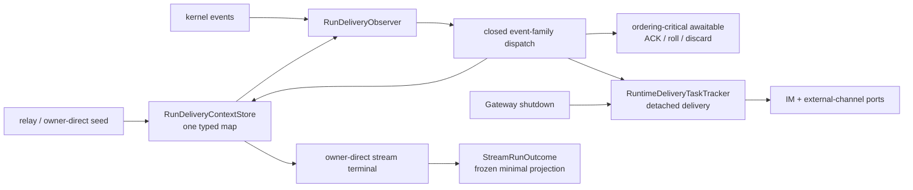
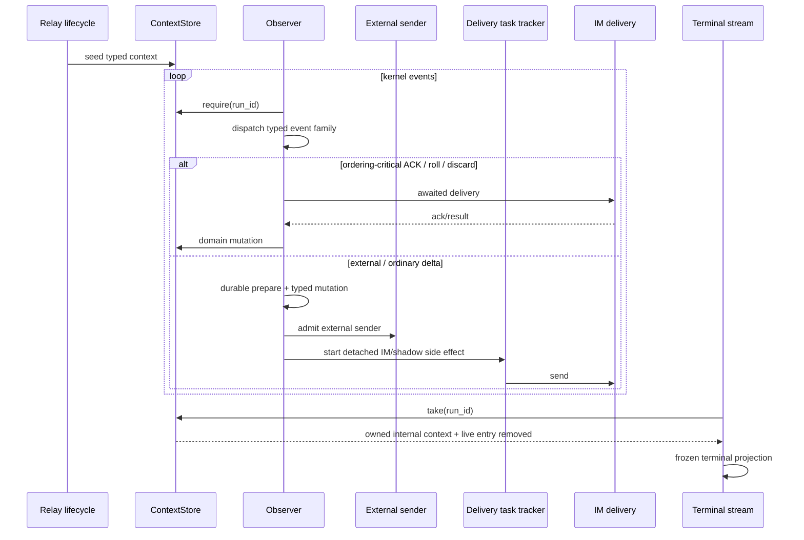

# refactor-480: 完成运行投递上下文类型化切换 — 技术方案

> 对齐：motivation.md v2

## Changelog

- v2（2026-07-25）：按生产 observer 的十一类事件补齐 await/detach dispatch
  matrix，保留 process-scoped task tracker 与 shutdown drain；将 terminal 输出拍死为
  最小 frozen projection，并明确 relay/owner-direct 两类 cleanup owner。

## 现状分析

### 涉及范围

- `src/personal_assistant/gateway/runtime_delivery/context.py`：typed `RunDeliveryContext`、legacy dict 投影、`MutableMapping` façade、双 store 同步。
- `src/personal_assistant/gateway/runtime_delivery/observer.py`：一个大型 observer closure，以字符串 key 读取/修改 context，并处理 message/reasoning/tool/permission/terminal 等全部事件。
- `src/personal_assistant/gateway/runtime_delivery/stream.py`：owner-direct background stream 仍接受 dict 或 typed store，结束时转回 legacy dict。
- `src/personal_assistant/gateway/runtime_delivery/lifecycle.py`：relay lifecycle 仍接受 dict 或 typed store，两条 seed/ack 路径并存。
- `scheduler/heartbeat_runner.py`：读取 terminal context 的唯一生产消费者，用
  `conversation_id` 是否建立判断 owner-direct silent transcript。
- `scheduler/cron_execution_service.py` / `CronRunTerminalConsumer`：共用 stream helper，
  但只消费 status/final_text/error。
- Gateway composition/runtime：装配唯一 typed store 与 process-scoped
  `RuntimeDeliveryTaskTracker`，shutdown 在关闭 IM transport 前 drain。

生产调用链是：

relay lifecycle 或 heartbeat/cron seed typed context → observer 取得 dict-shaped runtime
view → 字符串写入同步到 typed + legacy mirror → ordering-critical ACK/roll 由调用栈 await，
普通投递交共享 tracker detached → terminal stream 转为 dict 并 discard。

### 既有约束

- refactor-454：`runtime_delivery` 是 run-to-IM delivery owner；owner-direct 与 shadow 是不同 target，不能混同。
- IMConnectionManager 只拥有 transport，不接管 delivery policy。
- 每个 `run_id` 只有一个 context；seed 不覆盖 live run；terminal 必须 cleanup。
- `turn_start` ack 可回填 conversation/message id；rolling、visibility、discard-empty 与 provisional bubble 顺序保持。
- `turn_start` ACK、lazy start、bubble roll、steer roll 与 provisional discard 是
  ordering-critical awaitable；普通 message/tool/permission/end/reconcile/liveness 投递
  是 tracker-owned detached task，二者不能统一成一种 await 策略。
- 外部 channel 的 durable shadow prepare 先于外部 sender；IM shadow mirror 是
  best-effort detached side effect，IM 离线不得阻塞外部回复。
- `skill_created` 配置同步在 IM connected gate 之前执行；`run_heartbeat` 是 relay
  liveness，不是可省略 UI telemetry。
- tracker 是 process-scoped owner；Gateway shutdown 必须先 drain tracker，再 drain/close
  IM transport。

### 可复用能力

- **保留并深化** `RunDeliveryContext` / `RunDeliveryTarget` / `RunDeliveryContextStore`。
- **保留** lifecycle seed 与现有 visibility policy。
- **改** observer 为按事件族组织的 handler，但所有 handler共享同一 typed context 和 delivery dependencies。
- **删除** `_legacy_contexts`、`to_legacy_dict`、`RunDeliveryRuntimeView`、`runtime_value/set/pop`，以及 observer/stream/lifecycle 的全部 dict fallback。

### 相关历史

- refactor-454 已完成 owner 抽取并把 typed context 设为权威，legacy map 明确是过渡层。
- refactor-463 的 inbound ownership 与 refactor-470 的 transport ownership均要求 delivery 不回流到 pipeline/connection。
- canonical `docs/specs/gateway/routing-delivery.md` 与 `relay-protocol.md` 已描述当前可观察行为。

## 与 Claude Code 的源码对照

CC 没有与 Nano shadow/owner-direct IM delivery context 完全对应的概念。近似之处是
`QueryEngine.submitMessage()` 在边界产出 SDK message，bridge 把解析后的 message 交给
对应 handler，transport 不维护 Nano 式 runtime context mirror。CC 当前生成的
`SDKMessage` 是 open record，ingress guard 也只检查 string `type`，本设计不把它描述为
严格封闭 discriminated union。

因此本 unit不复制 CC 模块，只采用“内部单一 typed state、边界一次投影”的原则。Nano 的投递 target、provisional bubble 与 rolling 是自有领域模型，继续留在 `runtime_delivery`。

## 架构总览



Before：typed state 与 legacy dict 双写，observer 仍通过 mapping façade工作。
After：typed state 是唯一 representation；handler 通过意图化 API 修改。

## 关键决策

### 决策 1：store 只保存 `dict[run_id, RunDeliveryContext]`

删除 legacy mirror 和所有 dict 兼容入口。`seed/get/discard` 继续由 store 负责；对外不暴露底层 map。context 字段使用正确 Python 类型，布尔状态不再编码为 `"1"`。

删除测试成立：去掉 legacy 层不会把业务复杂度搬到调用方，只会消除同步和字符串转换，因此它是假 seam。

### 决策 2：mutation 用领域动作，不做 typed 字段万能 setter

store/context 暴露诸如 ack backfill、start/replace bubble、append external text、mark visible、mark discard、begin/end rolling 等意图化方法。拒绝 `set_field(name, value)` 或通用 dataclass setattr；那只会把字符串 key 换成 enum，仍泄漏状态机。

### 决策 3：observer 是单一 dispatch owner，但明确保留两种执行所有权

外部仍只有一个 `RunDeliveryObserver.observe(event)` 入口。它先取得 typed context，再分派到
少量稳定事件族 handler；handler 接收 typed context 与窄 delivery ports，不各自持有
context map、subscriber 或私有 task set。拆分目的是隐藏状态机，不是“每种 event 一个类”。

process-scoped `RuntimeDeliveryTaskTracker` 原样保留并由 composition 注入。observer 返回的
awaitable 只表示“后续 event 必须等待本次 ACK/roll/discard 建立新状态”；其余 I/O 必须通过
tracker detached，异常被隔离。Gateway runtime 继续在关闭 IM transport 前
`close_and_drain(deadline)`。不得把所有 handler 改成 inline await，也不得让 handler 自建
untracked task。

封闭 dispatch matrix 如下；表中未列出的 event 只做明确 no-op/diagnostic，不能借 fallback
进入任一 handler：

| Kernel event | Handler owner | IM/offline gate 与状态顺序 | `observe()` 执行语义 |
|---|---|---|---|
| `skill_created` | config side-effect handler | 在 IM gate 之前从 context 取 agent id；不读写 bubble；IM 离线仍执行 | `to_thread` 交共享 tracker，返回 `None` |
| `run_status(running)` | turn-start handler | owner-direct 等首个可见正文；普通 target 先 await ACK，再回填 message id | 返回 ordering-critical awaitable |
| `assistant_message`（含 reasoning） | assistant/bubble handler | 先做 silence/visibility/kernel-message typed mutation；lazy start、missing-start 与换气泡都须 ACK/roll 后再写新 id；普通 delta/reasoning 不阻塞 event stream | ACK/roll 分支返回 awaitable；普通 IM delta 交 tracker |
| `turn_end` | bubble-terminal handler | 先清 reasoning/in-flight、判 discard；外部回复先同步 durable prepare，再调用/登记 external sender，IM shadow mirror 与普通 completion 不阻塞；IM 离线只跳过 IM side effect | discard 返回 awaitable；其余 external/IM awaitable 交 tracker |
| `run_heartbeat` | liveness handler | 只在已有 message id 且 IM connected 时发 liveness，不改变正文/context | 交 tracker |
| `tool_start` | tool handler | 先同步登记 in-flight tool，并在需要时把前一外部正文作为 intermediate；IM 离线仍允许外部主路径继续 | IM/external awaitable 交 tracker |
| `tool_end` | tool handler | 先同步移除 in-flight，再投影 completed/failed payload | IM awaitable 交 tracker |
| `permission_request` | permission handler | 先构造唯一 request；external sender 不受 IM connected gate 影响，IM card 仅在可连时发送 | external/IM awaitable 交 tracker |
| `permission_resolved` | permission handler | external first-wins completion 不受 IM connected gate 影响，IM card 仅在可连时发送 | external/IM awaitable 交 tracker |
| `injection_consumed` | bubble-roll handler | 保留同一 run；先完成旧泡、ACK 新泡、回填 id，保证 steer 用户消息之后才出现新回复 | 返回 ordering-critical awaitable |
| `run_terminal_reconcile` | abnormal-terminal handler | 先同步清 reasoning/in-flight；为未闭 tool 和 bubble 构造确定 terminal payload，context 仍留给 lifecycle/stream cleanup owner | 每个 IM terminal side effect 交 tracker |

外部 shadow 的顺序是一个明确 partial order：`durable prepare` 必须先于 external sender
与 IM shadow mirror；external sender 在同一次 observer 调用中执行或登记，mirror 交 tracker
detached，二者之间没有 await 依赖。tracker 既拥有 IM send，也拥有返回 coroutine 的 external
sender 和 shadow mirror，因此 shutdown drain 覆盖所有已接收 side effect。

### 决策 4：terminal 只暴露最小 frozen projection

stream 只接受 `RunDeliveryContextStore`。新增：

```python
@dataclass(frozen=True, slots=True)
class RunDeliveryTerminalProjection:
    resolved_conversation_id: str | None
```

`StreamRunOutcome` 的最终字段名固定为
`delivery: RunDeliveryTerminalProjection | None`。`None` 表示 store 中已经没有该 run；
projection 存在但 `resolved_conversation_id is None` 表示 owner-direct run 从未建立可见
conversation；投影时用 `context.conversation_id.strip() or None` 归一化。heartbeat 据此执行
silent transcript trim。cron 不读取 `delivery`。不得把
mutable `RunDeliveryContext`、target、bubble ids、rolling 或 external marker 暴露给
scheduler。

### 决策 5：两类运行各有唯一 cleanup owner，共享幂等 store contract

`RunDeliveryContextStore.take(run_id) -> RunDeliveryContext | None` 是同步原子 pop；missing
返回 `None`。它只向 `runtime_delivery.stream` 暴露内部 owned context，stream 在 pop 后立即
投影为 `RunDeliveryTerminalProjection`，不把 context 传出模块。owner-direct stream 在
`finally` 中始终调用一次 `take`，所以 completed/failed/cancelled/iterator exception/提前
close 都先删除 live entry，再返回 outcome 或传播异常。

relay run 的唯一 cleanup owner 仍是 lifecycle terminal callback；它调用
`discard(run_id) -> bool`，completed/failed/cancelled 或重复 terminal 上 missing 均返回
`False` 且 no-op。`discard` 与 `take` 共享同一个内部 pop primitive。observer 永不删除
context；detached task 只能捕获已构造 payload/不可变 projection，不能在 cleanup 后再读取
live context。

## 接口与数据流

typed 边界包括：

- `RunDeliveryContextStore.seed_*()`：创建一次；
- `require(run_id)` / `get(run_id)`：读取 live typed context；
- 领域 mutation：只表达合法状态跃迁；
- `take(run_id)`：owner-direct stream 原子取得内部 context 并删除；
- `discard(run_id)`：relay lifecycle 幂等删除并返回是否存在；
- `StreamRunOutcome.delivery`：`RunDeliveryTerminalProjection | None`。



## 契约层增量 (delta-spec)

- kernel: no spec delta
- im: no spec delta
- gateway: no spec delta
- cli: no spec delta

## 风险与回退

- **隐含字符串真值差异**：现有每个 key 建立字段对账表，测试 false/empty/absent 三态后再删除 façade。
- **handler 拆分破坏顺序/并发**：dispatch matrix 是实现契约；trace 测试覆盖
  turn-start/lazy-start/rolling/steer 的 awaited path，以及普通 delta、tool、permission、
  terminal、liveness 的 tracker path；shutdown 断言 tracker 在 IM close 前 drain。
- **外部 channel 被 IM 拖累**：IM offline 真栈与故障 fixture 断言 durable prepare 后 external
  reply 继续，shadow mirror failure 不阻塞主路径。
- **context 提前 take**：owner-direct 正常/失败/cancel/stream-close 四条路径断言 pop 后只
  留 frozen projection；relay completed/failed/cancelled/重复 terminal 断言幂等 discard，
  且 terminal handler 在 cleanup 前可见 context。
- **回退**：整体回滚 typed-only 切换；不重新引入双写兼容期。

## Runbook for Reviewer

本 unit 修改 Gateway 运行投递，需重启 worktree IM + Gateway。

| 服务 | 停止命令 | 启动命令 | 健康检查 |
|---|---|---|---|
| worktree IM + Gateway | `./scripts/e2e-down.sh` | `PATH=/Users/czj/Repos/nano-multiagent/.venv/bin:$PATH ./scripts/e2e-up.sh` | `source .e2e-ports.env && curl -fsS "$IM_URL/openapi.json"` |

**Review 驱动方式**：端到端真栈；本 unit不改客户端面，可用 Web IM 实际发送消息的同一 HTTP/WS 入口驱动 direct、group/shadow、permission/tool 与失败取消，再真开 Web IM 核对 provisional/rolling bubble。

**验收前置**：worktree e2e config 与账号由脚本创建；外部 channel shadow 场景使用仓库测试 channel/fixture，LLM 按联调文档或 HTTP fixture 可用。

## Milestones

默认单 M1：typed-only authority、observer 和 stream outcome 必须同一次切换；分层拆分会制造 legacy/typed 双写中间态。

| ID | 标题 | 依赖 | 并行组 | 范围 | 退出标准 |
|---|---|---|---|---|---|
| refactor-480-M1 | Run delivery typed authority 最终切换 | 无 | delivery | context/store、observer handlers、relay lifecycle、stream、heartbeat runner、cron terminal consumer、composition/runtime integration、测试 | [reviewer] motivation 中普通/owner-direct、shadow/rolling、IM-offline external、工具权限/liveness、skill-created、终态/shutdown Scenario 真栈不变；[worker] 删除 legacy mirror/mapping 与全部 dict fallback，十一类 event dispatch trace 逐项覆盖 await/detach/offline/mutation 顺序，tracker 在 IM close 前 drain；[worker] `RunDeliveryTerminalProjection` 最小接口和 take/discard 幂等测试通过，所有终态无 context 泄漏；[worker] Gateway 相关非 e2e pytest、contract、ruff 通过 |
