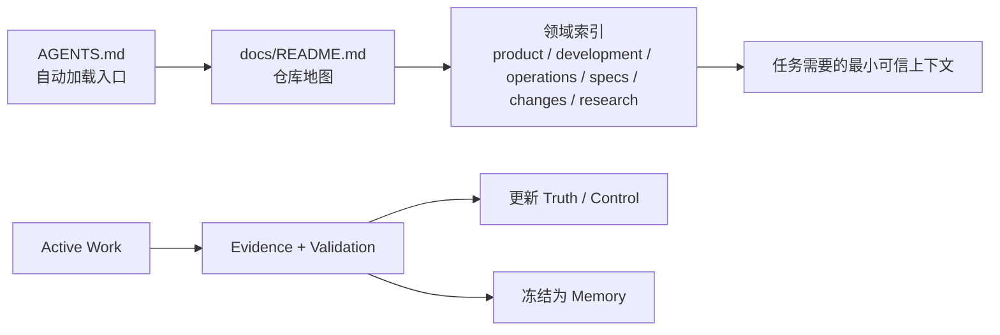

# Agent-Native 仓库知识体系迁移计划

> Unit：`refactor-486-agent-native-repository-knowledge-system`
>
> 状态：Active
>
> 目标：按 Agent-Native 代码仓知识体系重构整个 nano-multiagent 仓库，而不只是缩短 `AGENTS.md`。
>
> 权威边界：本文是迁移期间的工作计划，不覆盖 [`docs/README.md`](../../README.md)、[`SPEC.md`](../../../SPEC.md)、[`docs/specs/`](../../specs/README.md) 或已经生效的开发流程。
>
> 执行方式：用户已明确授权本次文档整理直接增量实施，不要求套用完整 `change-*` 生命周期。每个阶段仍拆成可独立审阅的提交，完成一段就停下来对齐。

## 一、目标与完成定义

本次工作的目标是把仓库变成 Coding Agent 可以稳定理解、执行、验证、恢复和积累经验的 Repository Harness。最终需要同时满足：

1. Agent 从根入口能够发现与当前任务有关的文档，而不依赖偶然搜索。
2. 产品、架构、current behavior、开发流程、运行手册、进行中工作、证据、研究和历史不会互相冒充。
3. 环境安装、真实服务启动、快速验证、质量门禁和安全恢复都有可执行入口。
4. 一个长任务可以跨 session 恢复，任务状态、决定、未决问题和证据不只存在于聊天历史。
5. change 完成后，验证过的增量进入 current Truth，过程材料冻结为 Memory。
6. 高后果约束由测试、CI、脚本、权限或审批机械保护，Markdown 负责解释和路由。
7. 文档新增、移动、归档和退役有固定规则，链接和状态漂移能够被 CI 发现。
8. 使用代表性 Coding Agent 任务验证体系有效，而不只检查目录是否整齐。

### 非目标

- 不批量改写 `docs/changes/archive/` 中已经冻结的 completed units。
- 不因为整理文档而改变现有产品行为或 change 门禁政策；流程政策变化必须单独对齐。
- 不把本机 LLM 日志、secret、数据库、PID、截图缓存等原始运行数据提交进 Git。
- 不为代码已经能够准确表达的实现细节再维护一份长期手写说明。
- 不为了得到漂亮目录一次性搬动所有 legacy 文件；先停止新写入，再按价值迁移历史。

## 二、目标模型

### 五个知识平面

| 平面 | 在本仓负责什么 | 主要承载位置 |
|---|---|---|
| Truth | 产品原则、跨包架构、current behavior、现行开发与操作规则 | `README.md`、`SPEC.md`、`docs/product/`、`docs/specs/`、`docs/development/`、`docs/operations/`、代码/schema/config |
| Work | 准备改变什么、当前做到哪里、怎样恢复 | `docs/changes/<active-unit>/` |
| Evidence | 凭什么相信结果、某次运行发生了什么 | tests、CI、unit 内 `evidence/` 与验收报告、runtime state、外部 LLM 日志 |
| Memory | 为什么这样决定、过去发生过什么 | `docs/changes/archive/`、`docs/research/`、`docs/archive/`、Git/PR history |
| Control | 去哪里找、如何执行、谁负责、什么被允许 | `AGENTS.md`、`docs/README.md`、领域索引、skills、scripts、CI、permissions |

### 五项 Repository Harness 能力

| 能力 | 本次迁移必须提供的支持 |
|---|---|
| 上下文地图 | 根指令、全仓地图、领域索引、文档摘要、显式链接和状态标记 |
| 环境就绪 | 本地安装、主服务启动、worktree 隔离、健康检查和依赖前置 |
| 快速反馈 | 最窄测试、lint/build、关键路径 E2E、runtime observation 和日志入口 |
| 质量门禁 | change verifier、产品 reviewer、code review、本地 CI 与远端 CI |
| 变更安全 | dirty worktree 保护、隔离端口/config、权限边界、可恢复任务状态和回退说明 |

### 知识流转



## 三、执行原则

1. **按能力迁移，不按文件批量搬家。** 每次移动都要说明它解决的 Agent 问题和新的权威位置。
2. **语义修改与机械改路径分开。** 内容重写、文件移动、引用替换分别提交，便于确认是否改变了规则。
3. **每个提交保持可导航。** 新权威建立前不删除旧入口；必要时保留兼容跳转，避免中间提交出现断链。
4. **先停止错误写入，再迁移历史。** `TASKS/`、`PROGRESS/`、`ACCEPTANCE/` 等 legacy 路径先冻结，历史搬迁另做机械提交。
5. **默认链接，不复制正文。** 路由页保留用途、状态和链接，完整事实只写在 canonical source。
6. **外部关键入口直接可见。** 参考仓和 LLM 日志无法从本仓代码推导，必须从 `AGENTS.md` 一跳可达。
7. **代码与文档各自承担优势部分。** 实现结构、类型、schema 和配置由代码表达；设计思想、跨模块约束、产品语义和历史理由由文档表达。
8. **不覆盖用户 dirty worktree。** 所有重建工作继续在独立 worktree 完成，只提交明确属于本计划的文件。
9. **每阶段更新本文。** 完成项改为 Completed，记录提交、迁移结果、遗留问题和下一阶段入口。

## 四、阶段计划

### 阶段 0：建立迁移基线

状态：Completed

#### 要解决的问题

原 PR 把权威地图、change 流程、本地开发、runtime、skills 引用和 `AGENTS.md` 瘦身混在一个 23 文件的大提交中，无法逐项判断内容是否正确。

#### 已完成

- 基于最新 `main` 建立独立重建 worktree，保留主工作树 dirty 内容。
- 新增顶层文档地图，并将 `SPEC.md` 收回为跨包架构权威。
- 将 change lifecycle 与 change unit storage 分成两个 owner。
- 抽取本地开发环境、测试入口、测试身份和提交格式。

#### 已提交

| Commit | 内容 |
|---|---|
| `f146a1f37` | 建立仓库文档地图和架构文档边界 |
| `d71386a1a` | 分离 change workflow 与 unit storage |
| `77599d013` | 抽取 local development |

#### 退出条件

- [x] 每个提交只有一个主要职责。
- [x] 没有修改 skills 的流程语义。
- [x] spec review 仍为可选，Gate 2 复用同一 design reviewer。
- [x] 所有新链接目标存在。

### 阶段 1：完成 Control 与 Repository Harness 入口

状态：In Progress

#### 当前进度

- [x] 建立 `docs/development/worktree-runtime.md`，并从 `docs/README.md` 接入全仓文档图。
- [ ] 将 AGENTS、开发文档、runbook、skills 和 tests 中的 live 引用迁到新 owner。
- [ ] 建立 development 与 operations 领域入口，最终缩减根 `AGENTS.md`。

#### 要解决的问题

Agent 已经能看到 `docs/README.md`，但自动加载的 `AGENTS.md` 仍包含大量服务启动、PID、config 和完整架构正文；runtime、operations 和开发规范也缺少稳定领域入口。

#### 工作项

1. 新增 `docs/development/worktree-runtime.md`，承接：
   - worktree 端口分配；
   - Gateway config 隔离；
   - PID 和进程组清理；
   - IM JWT、数据库与 workspace 隔离；
   - auto-bind；
   - `e2e-up.sh` / `e2e-down.sh` 与手工 fallback。
2. 建立 `docs/operations/`：
   - `README.md`：操作任务入口；
   - `local-stack.md`：主 IM + Gateway + Web IM 的启动与健康检查；
   - `gateway.md`：持久化 config、start/stop/restart、状态文件和恢复；
   - `troubleshooting.md`：常见故障、症状、证据和恢复路径。
3. 建立 `docs/development/README.md`，索引 change workflow、local development、runtime、testing、commenting、E2E 与 LLM integration。
4. 将现有开发规则迁入：
   - `docs/TESTING_GUIDE.md` → `docs/development/testing.md`；
   - `COMMENTING_GUIDE.md` → `docs/development/commenting.md`；
   - `docs/e2e-critical-paths.md` → `docs/development/e2e-critical-paths.md`；
   - `docs/可用LLM_API与联调说明.md` → `docs/development/llm-integration.md`。
5. 先更新 live consumers，再保留旧路径兼容跳转：
   - skills；
   - scripts；
   - tests；
   - current docs。
6. 最终重写 `AGENTS.md`，只保留：
   - 项目定位；
   - 跨包架构红线；
   - dirty worktree、secret、生成文件和隔离运行红线；
   - change workflow 触发入口；
   - 文档地图、本地开发、运行、测试路由；
   - 参考项目与 LLM 交互日志。
7. `CLAUDE.md` 继续作为工具适配器引用根 `AGENTS.md`，不复制正文。

#### 建议提交拆分

1. `docs: add worktree runtime guide`
2. `docs: migrate runtime consumers to canonical guide`
3. `docs: establish operations documentation`
4. `docs: consolidate development guides`
5. `docs: slim root agent instructions`

#### 退出条件

- [ ] `AGENTS.md` 不再保存完整 runbook、配置样例、PID helper 或架构树。
- [ ] 参考仓和 LLM 日志仍能从 `AGENTS.md` 直接发现。
- [ ] 从 `docs/README.md` 能进入 development 和 operations 的领域索引。
- [ ] skills、scripts 和 tests 不再引用已经移走的 `AGENTS.md` 段落。
- [ ] 本地开发、主服务运行和 worktree 隔离各有唯一 owner。
- [ ] 所有启动命令至少有静态核对，关键脚本能够执行 `--help` 或最小 dry-run。

### 阶段 2：规整 Truth 平面

状态：Pending

#### 要解决的问题

仓库已有架构和 current behavior 层，但产品原则仍散在 `docs/需求.md`、`docs/IM前端蓝图.md` 等草稿中；部分实现叙事与代码、spec 的边界不清。

#### 工作项

1. 建立 `docs/product/README.md`，说明产品文档的范围和权威。
2. 从 `docs/需求.md` 中蒸馏仍成立的产品定位、目标用户和长期原则，写入 `docs/product/vision.md`。
3. 从 `docs/IM前端蓝图.md` 中蒸馏仍成立的 Web IM 交互原则，写入 `docs/product/web-im-principles.md`。
4. 原始需求稿和蓝图在完成对账后移入 `docs/archive/product-source-materials/`，保留历史语境。
5. 保持 `SPEC.md` 只负责跨包职责、依赖方向、部署拓扑和架构不变量。
6. 审核 `docs/specs/`：
   - 每个包的 `spec.md` 只做入口和包级边界；
   - area 文档承载具体 current Requirement/Scenario；
   - active delta 未完成归并前不能覆盖 current。
7. 将 `docs/SPEC_GUIDE.md` 的 canonical 内容迁到 `docs/specs/CONTRIBUTING.md`，旧路径保留兼容跳转。
8. 审视 `docs/内核设计细化/`：
   - 代码、类型、schema 已能准确表达的内容删除长期副本；
   - 稳定的跨模块思想或约束归并到 `SPEC.md`、current specs 或代码注释；
   - 仅有历史价值的实现说明进入 archive/research。
9. 处理 `docs/spec-implementation-conflicts.md`：
   - 未解决的问题建立 active change/issue；
   - 已解决的审计结果转入历史；
   - 不允许它继续悬在 current 文档附近。

#### 建议提交拆分

1. `docs: establish product truth layer`
2. `docs: distill product principles from legacy drafts`
3. `docs: move spec authoring guide under current specs`
4. `docs: reconcile implementation narratives with code and specs`
5. `docs: retire resolved migration and conflict reports`

#### 退出条件

- [ ] 产品定位、跨包架构和单包行为分别有明确 owner。
- [ ] `docs/需求.md`、`docs/IM前端蓝图.md` 不再被当作 current 权威。
- [ ] 同一个 current behavior 不在多个文档中维护完整副本。
- [ ] 实现说明逐项回答“为什么必须长期写文档，而不是由代码表达”。
- [ ] current 文档与代码存在的已知 drift 都被修复或登记为 active work。

### 阶段 3：规整 Work 平面

状态：Pending

#### 要解决的问题

新 change unit 与根目录旧 `TASKS/`、`PROGRESS/`、`ACCEPTANCE/`、`data/dev-tasks.json` 并存，Agent 无法仅凭目录判断哪个是当前工作状态，也难以稳定恢复中断任务。

#### 工作项

1. 审核 `docs/changes/` 活动区：
   - Active；
   - Paused；
   - 已完成但未归档；
   - 完成证据不足；
   - 与开放 PR/branch/worktree 的对应关系。
2. 将 `docs/changes/readme.md` 改为标准 `docs/changes/README.md`，历史路径保留兼容跳转或同步修正 live consumers。
3. 为 active unit 明确最小恢复信息：
   - 状态；
   - 当前 branch/worktree；
   - 已完成 milestone；
   - 未决问题；
   - 下一动作；
   - evidence 入口。
4. 冻结 legacy 写入路径：
   - 更新所有 skills/scripts，不再向根 `TASKS/`、`PROGRESS/`、`ACCEPTANCE/` 写入新内容；
   - 确认 `data/dev-tasks.json` 是否仍有运行时消费者。
5. 只有在生产者和消费者全部迁移后，才移动 legacy 历史。
6. 长任务恢复以 unit 文件和 Git 状态为权威，聊天历史和模型记忆只作为辅助。

#### 建议提交拆分

1. `docs: classify active change units`
2. `docs: define active unit recovery contract`
3. `chore: stop legacy task and progress writes`
4. `docs: normalize change index naming and routes`
5. `docs: migrate legacy work records`（单独机械提交，必要时拆分）

#### 退出条件

- [ ] 新工作只有一个 active 写入体系。
- [ ] 任一 active unit 可以在新 session 中从仓库状态恢复。
- [ ] 根 legacy 目录没有新的写入者。
- [ ] active/archive 同一 `unit_id` 不会歧义。
- [ ] 不依据目录年龄猜测 change 是否完成。

### 阶段 4：规整 Evidence 平面

状态：Pending

#### 要解决的问题

测试、CI、截图、验收、runtime state 和 LLM 日志的可信方式不同；目前部分证据散落在根目录或本机路径，没有统一检索和 promotion 规则。

#### 工作项

1. 明确 evidence 分类：
   - 可长期执行的回归保护 → tests/CI；
   - unit 临时验收证据 → `<unit>/M*/evidence/`；
   - unit 级结论 → acceptance/verification/review 报告；
   - 本机运行证据 → gitignored runtime/log path；
   - LLM 交互记录 → `/Users/czj/Repos/LLM_PROXY/logs/<session_id>/`。
2. 在 `docs/development/README.md` 和 `AGENTS.md` 保留 LLM 日志的直接入口，并在 LLM integration 文档说明 session 定位、常见诊断方式和保留边界。
3. 审核 `ACCEPTANCE/` 的现有生产者，迁移到 unit evidence。
4. 对每类验证写清：
   - 证明什么；
   - 不证明什么；
   - 运行命令；
   - 结果保存位置；
   - 何时 promotion 为长期测试或 current 规则。
5. 对齐 tests、lint、build、E2E、本地 CI 和远端 CI 的职责，避免多份“完整验证命令”互相漂移。

#### 建议提交拆分

1. `docs: define evidence ownership and retention`
2. `docs: document LLM interaction log discovery`
3. `chore: move acceptance writers into change units`
4. `docs: align feedback and quality gate entry points`

#### 退出条件

- [ ] Agent 知道某条证据能证明什么、在哪里找。
- [ ] 新验收证据不写入根 `ACCEPTANCE/`。
- [ ] 一次性截图/日志不会冒充长期规范。
- [ ] 值得长期保护的缺陷有回归测试或明确不固化理由。
- [ ] LLM session 能从任务或运行线索定位到对应日志。

### 阶段 5：规整 Memory 平面

状态：Pending

#### 要解决的问题

external comparisons、brainstorms、迁移计划和退役设计目前靠文件名猜状态；本地主工作树还存在由 skill 生成但尚未纳入 Git 的 architecture review snapshots。它们都容易被 Agent 当作 current。

#### 工作项

1. 建立 `docs/research/README.md`，索引研究主题、状态、日期、基线和 current 替代项。
2. 建立 `docs/research/upstreams.md`，维护参考项目、用途和本地路径；`AGENTS.md` 保留高价值摘要与一跳入口。
3. 迁移：
   - `docs/tools-diff-cc/` → `docs/research/comparisons/claude-code-tools/`；
   - `docs/kernel-diff-cc/` → `docs/research/comparisons/claude-code-kernel/`；
   - `docs/brainstorms/` → `docs/research/brainstorms/`；
   - architecture review snapshots → `docs/research/architecture-reviews/`。
4. 先修改 `improve-codebase-architecture` 的输出约定，再逐份判断本地主工作树中尚未跟踪的 `docs/architecture-reviews/` 是否值得提交；不把生成目录整体带入本分支。
5. research 文档补充：
   - 状态；
   - 日期；
   - 本仓 commit 基线；
   - 外部项目版本/commit；
   - 已被哪份 current 文档吸收。
6. `docs/IM-user-stream-migration-plan.md` 等已实施计划移入 `docs/archive/migration-plans/`。
7. `docs/archive/README.md` 说明 retired independent docs 与 completed change history 的区别。
8. 保留 `docs/changes/archive/` 原貌，不批量修正文案或历史链接。

#### 建议提交拆分

1. `docs: establish research and archive indexes`
2. `docs: catalog upstream reference repositories`
3. `docs: classify comparisons and architecture reviews`
4. `docs: archive completed migration plans`

#### 退出条件

- [ ] research/history 从路径和页面头部即可识别为非 current。
- [ ] 每份重要研究都能追溯代码与外部基线。
- [ ] 已验证结论已经进入 Truth/Control，而不只留在研究报告里。
- [ ] completed change 与 retired independent docs 有不同入口和语义。

### 阶段 6：完成显式链接图

状态：Pending

#### 要解决的问题

Agent 能搜索文件，但没有显式入口的正确文档仍可能在任务中近似不存在；只有文件清单也不足以说明何时读取、是否 current。

#### 工作项

1. 固化入口链：
   - `AGENTS.md` → `docs/README.md`；
   - `docs/README.md` → 领域 `README.md`；
   - 领域入口 → 具体文档；
   - 具体文档 → 相关 current、work、evidence 或 memory。
2. `docs/README.md` 同时提供：
   - 有哪些领域和重要文档；
   - 每份文档写什么；
   - 什么任务应该从哪里开始；
   - 哪类事实由谁负责；
   - 文档的生命周期。
3. 每个领域 `README.md` 提供文件链接、一句话摘要、状态和相邻知识入口。
4. 查找不可达 live 文档，并选择：
   - 加入索引；
   - 迁入 research/archive；
   - 删除由代码已经表达的重复内容。
5. 大型 archive 不逐文件进入常驻索引，通过 unit id、目录索引和搜索按需访问。

#### 建议提交拆分

1. `docs: add domain indexes and cross-links`
2. `docs: classify unreachable live documents`
3. `docs: complete repository documentation graph`

#### 退出条件

- [ ] 所有 live 长期文档从根入口可达。
- [ ] 索引不是裸路径清单，每项都有用途和状态。
- [ ] research/archive 不进入 current 的默认阅读路径。
- [ ] 删除、移动一份 current 文档时，能够枚举所有 live 入口。

### 阶段 7：加入机械治理与 promotion 闭环

状态：Pending

#### 要解决的问题

仅靠维护者记忆，链接、状态、引用和 `AGENTS.md` 会再次膨胀或漂移。

#### 工作项

1. 新增 `scripts/docs-check`，至少检查：
   - Markdown 本地链接；
   - live 文档是否被领域索引覆盖；
   - 已退役路径是否仍被 live 文档引用；
   - research metadata；
   - `AGENTS.md` 行数/字节预算；
   - change workflow 与关键 skills 的核心不变量；
   - active/archive unit id 唯一性。
2. 将 `scripts/docs-check` 接入 CI。
3. 在 `docs/development/documentation-system.md` 固化本仓已经验证的规则：
   - 知识角色与 owner；
   - 新文档归位；
   - authority 和 lifecycle；
   - active → current/memory promotion；
   - 退役与兼容跳转；
   - generated projection 规则。
4. CODEOWNERS、branch protection、tests、permissions 等已有机械约束在文档地图中给出入口，不用 Markdown 假装授予权限。

#### 建议提交拆分

1. `docs: codify repository knowledge lifecycle`
2. `chore: add documentation integrity checks`
3. `ci: enforce repository knowledge invariants`

#### 退出条件

- [ ] 断链、不可达 live 文档和退役引用能在 CI 中失败。
- [ ] `AGENTS.md` 超预算会触发审计。
- [ ] change 流程关键不变量漂移能被发现。
- [ ] 新信息能够按明确规则进入 Truth、Work、Evidence、Memory 或 Control。
- [ ] 完成的 change 会同时更新 current 文档并冻结历史。

### 阶段 8：用真实 Agent 工作循环验收

状态：Pending

#### 要解决的问题

结构合理不等于 Agent 实际能够正确消费。最终必须用代表性任务验证上下文发现、执行、反馈、门禁和恢复。

#### 验收任务

| 任务 | 预期找到的入口 | 成功标准 |
|---|---|---|
| 判断四个顶层包的依赖边界 | `AGENTS.md` → `SPEC.md` | 不读取旧蓝图作为 current，并能指出 contract tests |
| 修改一个 IM 用户可观察行为 | docs map → IM current spec → change workflow | 正确区分 current 与 proposed delta |
| 在 worktree 启动真实 IM/Gateway | worktree runtime | 使用隔离端口/config，结束后无孤儿进程 |
| 诊断一次模型调用异常 | AGENTS → LLM integration → session logs | 能从 session 线索定位日志并区分 evidence 与规范 |
| 恢复一个中断的 active unit | changes index → unit recovery state | 找到 branch、进度、未决问题、下一动作和 evidence |
| 查询一个历史架构选择 | research/change archive | 找到历史理由，同时回到 current architecture 验证 |
| 完成一次 change 收尾 | workflow → gates → spec promotion → archive | current、evidence 和 memory 同步更新 |

#### 执行方式

1. 为每项任务使用新的 Agent session，避免依赖本次迁移对话上下文。
2. 记录：
   - 首次读取路径；
   - 错读或漏读文档；
   - 完成时间和额外搜索次数；
   - 运行或验证阻塞；
   - 误把 research/history 当 current 的情况。
3. 失败先归因到：
   - 上下文地图；
   - 环境就绪；
   - 快速反馈；
   - 质量门禁；
   - 变更安全；
   - 领域事实本身。
4. 根据失败模式修改体系，再重复验收。

#### 退出条件

- [ ] 代表性任务均能从根入口找到正确上下文。
- [ ] Agent 不依赖本次聊天历史即可启动、验证和恢复。
- [ ] 没有 research/history 冒充 current 的关键错误。
- [ ] 环境、反馈、门禁和清理流程能够真实执行。
- [ ] 失败后能够定位到具体知识或 Harness 缺口，而不是靠人临场补充。

## 五、现有内容迁移表

| 当前路径 | 目标位置 | 处理方式 |
|---|---|---|
| `AGENTS.md` 大段 runbook/架构/索引 | development、operations、`SPEC.md`、docs map | 先建 owner，再删除重复正文 |
| `COMMENTING_GUIDE.md` | `docs/development/commenting.md` | 迁移 canonical，旧路径保留兼容跳转 |
| `docs/TESTING_GUIDE.md` | `docs/development/testing.md` | 迁移 canonical，更新 skills，旧路径兼容 |
| `docs/e2e-critical-paths.md` | `docs/development/e2e-critical-paths.md` | 迁移并加入 development index |
| `docs/可用LLM_API与联调说明.md` | `docs/development/llm-integration.md` | 保留 provider、代理、日志与诊断入口 |
| `docs/operator-runbook.md` | `docs/operations/` | 按 local stack、Gateway、troubleshooting 拆分 |
| `docs/SPEC_GUIDE.md` | `docs/specs/CONTRIBUTING.md` | 与 current specs 放在同一领域，旧路径兼容 |
| `docs/需求.md` | `docs/product/vision.md` + archive 原稿 | 蒸馏 current 原则，原稿只作历史 |
| `docs/IM前端蓝图.md` | `docs/product/web-im-principles.md` + archive 原稿 | 蒸馏稳定体验原则 |
| `docs/内核设计细化/` | code/spec/comment 或 archive/research | 逐篇做 code-as-documentation 判断 |
| `docs/spec-implementation-conflicts.md` | active issue/change 或 history | 核对未决项后分流 |
| `docs/IM-user-stream-migration-plan.md` | `docs/archive/migration-plans/` | 已实施计划归档 |
| `docs/tools-diff-cc/` | `docs/research/comparisons/claude-code-tools/` | 补日期、代码基线和状态 |
| `docs/kernel-diff-cc/` | `docs/research/comparisons/claude-code-kernel/` | 补日期、代码基线和状态 |
| `docs/brainstorms/` | `docs/research/brainstorms/` | 标记非 current |
| 本地主工作树未跟踪的 `docs/architecture-reviews/` | `docs/research/architecture-reviews/` | 先改生成者，再逐份判断是否值得纳入 Memory |
| 根 `TASKS/`、`PROGRESS/`、`ACCEPTANCE/` | `docs/archive/legacy-development-records/` | 先停写，再单独机械迁移 |
| `data/dev-tasks.json` | 视消费者审计结果决定 | 不在确认无运行时消费者前移动 |
| `docs/changes/readme.md` | `docs/changes/README.md` | 标准化入口并更新 live consumers |
| `docs/changes/archive/` | 原地保留 | 不批量重写 completed history |

## 六、最终目标目录树

下面是 canonical 目录的目标形态。迁移期间旧路径可以保留一行兼容跳转；完成 live consumer 迁移后，再决定是否长期保留。

```text
.
├── AGENTS.md                         # 自动加载：硬约束、关键路由、参考仓、LLM 日志
├── CLAUDE.md                         # 工具适配器，引用 AGENTS.md
├── README.md                         # 产品介绍与最短可用路径
├── SPEC.md                           # 跨包架构、依赖方向、部署拓扑
├── src/                              # 实现、类型、schema、配置
├── tests/                            # 可重复执行的长期验证
├── scripts/                          # 稳定动作接口与 docs-check
└── docs/
    ├── README.md                     # 全仓地图、任务路由、权威与生命周期
    │
    ├── product/
    │   ├── README.md                 # 产品知识入口
    │   ├── vision.md                 # 产品定位、目标用户、长期原则
    │   └── web-im-principles.md      # Web IM 稳定交互原则
    │
    ├── development/                  # 修改仓库：开发环境、流程、反馈与临时隔离运行
    │   ├── README.md                 # 开发任务路由
    │   ├── documentation-system.md   # 本仓验证后的知识体系与维护规则
    │   ├── change-workflow.md        # 生命周期、Full/lite、角色和门禁
    │   ├── local-development.md      # 依赖安装、开发命令、测试身份
    │   ├── worktree-runtime.md       # 为开发/E2E 临时隔离端口、config、PID 和数据
    │   ├── testing.md                # 测试分层和长期测试判据
    │   ├── commenting.md             # 注释与 docstring 约定
    │   ├── e2e-critical-paths.md     # 由自动化长期守护的真实用户旅程
    │   └── llm-integration.md        # provider 协议、代理联调、live/fake 测试和日志定位
    │
    ├── operations/                   # 运行 current 系统：启动、观察、排障与恢复
    │   ├── README.md                 # 运行任务路由
    │   ├── local-stack.md            # 启动主 IM + Gateway + Web IM 并检查健康
    │   ├── gateway.md                # 持久配置、start/stop/restart、状态和恢复
    │   └── troubleshooting.md        # 运行故障的症状、证据、定位和恢复
    │
    ├── specs/
    │   ├── README.md                 # current behavior 总入口
    │   ├── CONTRIBUTING.md           # spec 与 delta-spec 写法
    │   ├── kernel/
    │   │   ├── spec.md
    │   │   └── <area>.md
    │   ├── im/
    │   │   ├── spec.md
    │   │   └── <area>.md
    │   ├── gateway/
    │   │   ├── spec.md
    │   │   └── <area>.md
    │   └── cli/
    │       └── spec.md
    │
    ├── changes/
    │   ├── README.md                 # unit 目录、文件归属、active/archive
    │   ├── <active-unit>/
    │   │   ├── <first-document>.md
    │   │   ├── design.md
    │   │   ├── design-review.md
    │   │   ├── specs/                # proposed delta
    │   │   └── M<N>-<slice>/
    │   │       ├── tasks.md
    │   │       ├── progress.md
    │   │       └── evidence/
    │   └── archive/
    │       └── <completed-unit>/      # 冻结的完整 change history
    │
    ├── research/
    │   ├── README.md                 # 研究索引、状态与基线
    │   ├── upstreams.md              # 参考项目与本地入口
    │   ├── agent-era-repository-knowledge-system.md
    │   ├── comparisons/
    │   │   ├── claude-code-tools/
    │   │   └── claude-code-kernel/
    │   ├── architecture-reviews/
    │   └── brainstorms/
    │
    └── archive/
        ├── README.md                 # retired 独立文档入口
        ├── retired-specs/
        ├── product-source-materials/
        ├── migration-plans/
        └── legacy-development-records/
            ├── TASKS/
            ├── PROGRESS/
            └── ACCEPTANCE/
```

### 仓外但必须可发现的 Evidence

```text
/Users/czj/Repos/LLM_PROXY/logs/<session_id>/   # LLM 原始交互日志
```

该路径继续从 `AGENTS.md` 直接可见，并在 `docs/development/llm-integration.md` 中解释如何定位和消费。它不进入 Git，也不因为仓外存储而从知识地图中消失。

## 七、PR 与提交组织

建议按能力拆成多个 PR，而不是把整个目录迁移压成一个大 PR：

| PR | 主要能力 | 典型内容 |
|---|---|---|
| A：Control + Harness entry | 上下文地图、环境就绪、变更安全 | 当前重建分支、runtime、operations、AGENTS |
| B：Truth | 产品、架构、current behavior | product、specs、实现说明对账 |
| C：Work + Evidence | 任务恢复、验证与日志 | active changes、legacy 停写、evidence |
| D：Memory + Links | 历史、研究、显式知识图 | research、archive、领域索引 |
| E：Governance + Validation | 防漂移和真实任务验收 | docs-check、CI、Agent task suite |

每个 PR 内继续遵守：

- 语义变更与机械移动分开；
- 每个 commit 有单一主要目的；
- 不混入用户主工作树的无关内容；
- 阶段退出条件通过后再进入下一阶段；
- PR body 用中文说明权威变化、迁移映射、验证证据和未完成范围。

## 八、最终完成判据

- [ ] 根 `AGENTS.md` 是高价值 resident bootstrap，不是 runbook 或全量知识副本。
- [ ] `docs/README.md` 能回答“有哪些文档、写什么、什么时候读、谁是权威、处于什么状态”。
- [ ] Truth、Work、Evidence、Memory、Control 均有清晰 owner 和 promotion 关系。
- [ ] 产品、架构、current behavior、开发和操作文档边界明确。
- [ ] active work 可跨 session 恢复，legacy 路径停止新写入。
- [ ] 参考仓和 LLM 日志从根入口直接可发现。
- [ ] research、history、retired 文档不会覆盖 current。
- [ ] 所有 live 文档可从显式链接图到达。
- [ ] docs-check 与 CI 能阻止主要漂移。
- [ ] 代表性 Agent 工作任务全部通过，并记录过至少一轮基于失败模式的改进。
- [ ] 验证后的稳定方法已经进入 `docs/development/documentation-system.md`。
- [ ] 本计划归档到 `docs/changes/archive/refactor-486-agent-native-repository-knowledge-system/`。
