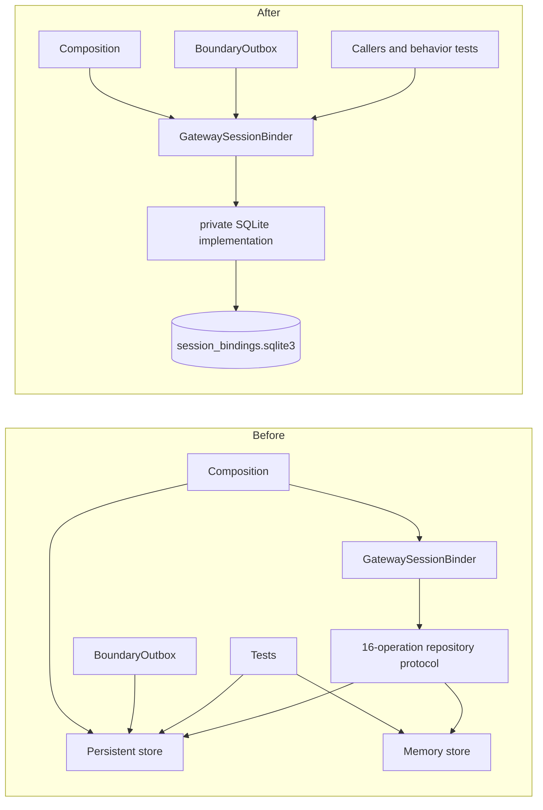
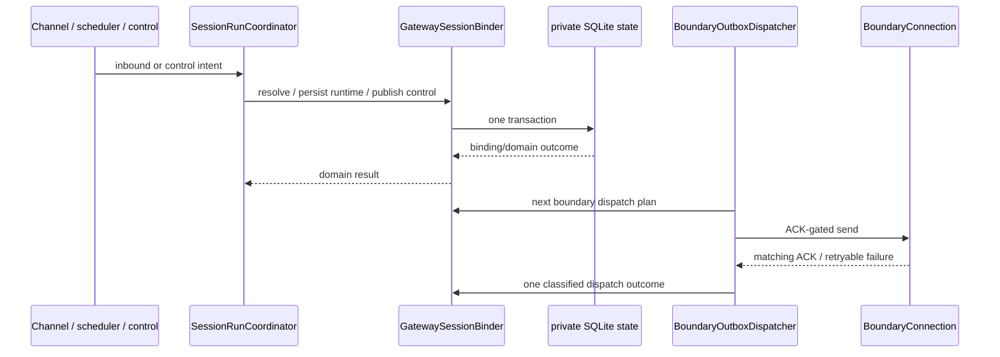

# refactor-522: Gateway session continuity owner — 技术方案

> 对齐: motivation.md v1
>
> Unit branch: `unit/refactor-522` (will be created by orchestrator)

## Changelog

- 2026-08-10: Gate 2 R1 closure — 将 boundary outbox 收敛为两步 domain transition seam，并补 Gateway-only restart 与 external partial-recovery 真栈旅程。
- 2026-08-10: Gate 2 R2 closure — 固定 partial-recovery 为 test-only 双 subprocess launcher + 进程外 barrier/ledger，不扩 production composition API。

## 现状分析

### 涉及范围

- `GatewaySessionBinder` 已拥有 session key resolution、Kernel session create/reuse、workspace/revision guard、reply refresh、runtime/config identity、reset/control outcome、superseded run、reverse lookup 与 canonical direct lookup。
- binder 通过一个含 16 类操作的私有 repository protocol 调用 `session_keys.py`；后者同时公开内存 `SessionBindingStore`、SQLite `PersistentSessionBindingStore` 与全局实例。
- production composition 同时持有 binder 和 raw SQLite store：binder 处理大部分 continuity，`BoundaryOutboxDispatcher` 与 pending-boundary promotion 绕过 binder 使用 store。
- 内存实现无法表达 crash-safe pending boundary：相关写入只更新 runtime，promotion 永远返回空；因此它不是生产 SQLite 语义的真实替代 adapter。
- 约 40 个测试文件直接认识 store；当前约 150 个 memory-store symbol references、105 个 memory constructor calls、35 个 SQLite constructor calls，很多产品测试通过浅持久化 interface 准备或断言内部状态。
- SQLite implementation 仍保留已移除 Kernel HTTP client 的 docstring、字段和 setter；当前 live session 校验已由 binder 经进程内 Kernel 完成。

### 既有约束

- Gateway 重启必须继续使用 `runtime_dir/session_bindings.sqlite3` 恢复同一 session、reply context、runtime identity、boundary/control/supersession 状态。
- 不改变现有六类表、WAL、`BEGIN IMMEDIATE`、legacy-column migration、reply-context JSON、session key 或 external identity 格式。
- feat-501 的 `/new` 原子发布、operation idempotency、pending external control 与 `/compact` FIFO/superseded 语义保持。
- `SessionRunCoordinator` 继续拥有 admission、FIFO、generation 与 visibility；binder 不吸收 run lifecycle。
- `BoundaryConnection` 是 remote-owned IM seam，继续保留 production/fake adapter；本地 SQLite 不升级为公开 port。
- 不复活 retired refactor-481 的 YAML/config writer 目标，也不触碰 active refactor-478 的 RPC correlation ownership。

### 可复用能力

- 保留 `SessionBinding`、boundary/control value objects、session-key/reply-context builders 与当前 SQLite schema/transaction implementation。
- 复用 `GatewaySessionBinder` 现有领域操作作为唯一 external seam；补齐 boundary outbox 与 pending-boundary promotion 的领域级操作。
- 复用 SQLite `:memory:` 作为普通测试 stand-in、临时文件作为 restart/durability stand-in；不再维护语义不完整的平行内存实现。
- 复用 `BoundaryOutboxDispatcher` 的 ACK/retry 状态机，只把它的本地 state dependency 从 raw store 收敛到 binder。

### 相关历史

- refactor-463 已建立 binder 为 session business owner，但当时判定 memory/SQLite 是两个真实 adapter；feat-501 后新增的 durable boundary/control 证明该假设已失效。
- feat-501 是本 unit 的直接行为 predecessor；其 reset、compact、control outcome 与 external recovery contract 必须完整继承。
- retired refactor-481 处理已不存在的 local config owner，只有具体 config/token/writer incident 才重开；本 unit 只处理 session continuity SQLite。
- active refactor-478 可能在 `composition.py` 产生机械冲突，语义上不改变 binder 或 persistence owner。
- current `docs/specs/gateway/routing-delivery.md` 把 busy `/compact` 写成拒绝，但 feat-501、生产代码和 admission tests 都是占 FIFO 位后执行；本 unit 修正文档 drift，不倒改代码。

## 架构总览

本 unit 命中 `codebase-design`：它把持久化 seam 从调用方 interface 收回 deep module 内部，重新选择测试面，并删除一个不真实的 adapter。



Before 的调用方和测试需要选择 adapter 并理解事务步骤。After 的 binder interface 同时服务 production caller 与行为测试，SQLite seam 留在 module implementation 内。

## 关键决策

### 决策 1: GatewaySessionBinder 独占 continuity persistence，并提供深的 boundary transition seam

**composition 只创建并持有 binder；所有 binding、boundary、control、supersession 与 recovery state 只经 binder 访问。Boundary dispatcher 只使用 `next_boundary_dispatch()` 与 `complete_boundary_dispatch(...)` 两个 domain operation。**

- **理由**: 这些状态共享 session identity、事务顺序与 crash recovery invariant；单一 owner 提高 locality。
- **拒绝**: 保留 raw store 给 outbox/promotion、新增另一层 repository façade，或把 `delivery_ready/ack/record_error/defer_retry/next_delay` 五个 store 动作原样抬到 binder；它们分别继续泄漏 owner、层叠浅 interface 或只换接收者。
- **风险**: binder 接管 durable retry schedule，但不接管 remote send/ACK 分类；两步 seam 的输入输出和 deletion test 在接口段固定。

### 决策 2: SQLite 是 local-substitutable implementation，不是公开 adapter

**binder 接收确定的 DB path 并内部创建一个私有 SQLite implementation；普通测试用 `:memory:`，restart 测试用临时文件。**

- **理由**: SQLite 本地可替代且足以覆盖 production transactions；语义不完整的内存 store 只让测试绕开真实恢复行为。
- **拒绝**: 保留 memory/persistent 两个公开 class、引入通用 persistence port 或 mock SQLite。
- **风险**: SQLite 测试可能稍慢；聚焦 suite 用 `:memory:`，durability case 才重开文件 DB。

### 决策 3: 保留 SQLite layout 与数据兼容

**私有化 implementation 不搬迁数据库、不改 schema、表名、序列化或现有 migration。**

- **理由**: 本 unit 改 ownership，不改 durable contract；现有生产数据必须原地恢复。
- **拒绝**: 趁机重命名表、合表、重写 JSON 或移动 DB path。
- **风险**: class/module 重命名不能成为 schema 重构借口；worker 证据逐表重开验证。

### 决策 4: 删除 dead HTTP validation 与 public helpers

**删除无调用的 Kernel HTTP client 字段/setter、全局 store、公开 store classes 与绕过 binder 的 bind helper。**

- **理由**: Kernel 已是进程内 library，live validation 由 binder 完成；这些 interface 留下错误 lifecycle 暗示。
- **拒绝**: 保留 deprecated alias 或兼容 shim；仓库内所有 caller 同一 M1 原子迁移。
- **风险**: tests 可能把 public helper 当 fixture；迁移到 binder intent，而不是重建同名 test helper。

### 决策 5: coordinator 与 remote delivery ownership 不变

**`SessionRunCoordinator` 继续拥有 FIFO/transition/visibility；`BoundaryOutboxDispatcher` 继续拥有 remote send、matching ACK 与错误分类，binder 拥有 durable ready/retry/quarantine transition。**

- **理由**: 删除 store seam 不等于合并相邻 lifecycle；remote `BoundaryConnection` 仍有两个真实 adapter。
- **拒绝**: 把 run queue、IM connection 或 external saga materialization并入 binder。
- **风险**: dispatcher 的 retry policy 参数不再逐次传到 storage；initial/max policy 在 binder 构造时固定，避免 remote loop 与 durable schedule 双 authority。

### 决策 6: 修正 `/compact` canonical drift

**canonical Gateway spec 改为当前真实 FIFO barrier 行为；implementation 不为此改变。**

- **理由**: feat-501 design、production coordinator 和 admission tests 一致，busy-reject 文字是 current spec drift。
- **拒绝**: 为匹配旧文字把 `/compact` 改回拒绝，或把 drift 隐藏在本 unit 文档而不修 current owner。
- **风险**: verifier 必须先证明代码/测试确为 FIFO，再归并 delta-spec。

## 接口与数据流

binder external interface 保留现有领域 DTO/operations，并补齐两个当前 bypass：一个深的 boundary dispatch transition seam，以及 shadow anchor 就绪后的 pending-boundary promotion。caller 不接收 repository、connection 或 SQL handle。

boundary seam 的准确契约为：

```text
next_boundary_dispatch() -> BoundaryDispatchPlan
  Ready(intent: BoundaryIntent)
  Wait(delay_seconds: float)
  Idle

complete_boundary_dispatch(
  boundary_id: str,
  outcome: BoundaryDispatchOutcome,
) -> None
  Acked
  PermanentlyRejected(reason: str)
  RetryableFailure(reason: str)
```

`BoundaryOutboxDispatcher` 只循环取 plan：`Ready` 时发 remote frame 并把 matching ACK/确定性拒绝/可重试失败分类成 outcome，`Wait` 时按给定时长 sleep，`Idle` 时退出。binder/private SQLite 在一次 outcome transition 内完成 ACK 删除、quarantine 或 retry-attempt/backoff deadline；initial/max retry policy 随 binder construction 固定，不由 dispatcher 透传。pending shadow anchor 则使用单独的 `promote_pending_shadow_boundary(saga_id, shadow_ref)` 领域方法，因为它是 session runtime 与 shadow anchor 的原子 promotion，不属于 remote dispatch loop。



调用规则：

- composition 只传 `db_path` 给 binder，并把同一个 binder 注入 coordinator、scheduler、fork/distill、outbox 与 shadow promotion。
- binder 是唯一能触发 continuity persistence 的 module interface；private SQLite implementation 可留在 `session_keys.py`，无需为文件大小搬动。
- `BoundaryOutboxDispatcher` 继续只知道两步 dispatch transition 和独立 `BoundaryConnection`；它不知道 schema、store class、retry attempt、deadline 或 quarantine mutation。
- reset、runtime+boundary、control+pending-external intent 继续使用当前原子事务。
- 测试从 raw `bind/get/pending` setup 迁到 binder intent/outcome；仅 binder-owned persistence tests 可以直接触达 private implementation 以验证 schema migration、transaction failure 和 race。
- deletion test 要求 `BoundaryOutboxStore` protocol 消失，composition/outbox 无 raw repository，binder 不出现旧五动作的同义 pass-through；删掉任一两步 domain operation 才会迫使 dispatcher 重新学习持久化细节。

### Persistence compatibility matrix

| Durable state | 保持的契约 | 行为测试面 |
|---|---|---|
| session bindings | key、Kernel session、reply context、runtime identity、created-at | binder resolve/lookup + restart |
| boundary outbox | actual-applied boundary、retry/quarantine、ACK | binder + dispatcher |
| pending shadow boundary | saga/ref promotion | binder promotion + restart |
| control operations | `(session_key, operation_id, kind)` 幂等 outcome | binder control interface |
| superseded runs | reset 后旧输出 fence | binder/coordinator outcome |
| pending external control | materialized/handoff recovery | binder + materializer |

### 依赖分类与测试 seam

- SQLite：local-substitutable；`:memory:` 覆盖普通行为，临时文件重建 binder 覆盖 durability/migration。
- IM BoundaryConnection：remote-but-owned；保留 production WebSocket adapter 与 deterministic fake。
- Kernel：进程内 `agent.sdk` dependency；binder 的 existing fake Kernel seam 保留用于 create/reuse/failure。
- 测试采用 replace-don't-layer：binder behavior coverage 完整后删除 memory-store contract tests，不叠加一套 compatibility suite。

## 契约层增量 (delta-spec)

- kernel: no spec delta
- im: no spec delta
- gateway: [`specs/gateway/routing-delivery.md`](specs/gateway/routing-delivery.md) — 仅修正 `/compact` current drift
- cli: no spec delta

## 风险与回退

- **测试迁移掩盖行为缺口**: 先建立 binder+SQLite red tests，再删旧 store tests；restart、reset/control、outbox 与 reverse lookup 均需直接证据。
- **SQLite `:memory:` connection lifetime**: 每个 binder 持有自己的 private connection；跨重启 case 必须用临时文件，不能把重新构造 `:memory:` 当 durability。
- **composition 与 active 478 冲突**: unit worktree final sync 后只重做 wiring hunk，并重跑 runtime composition/control tests；不修改 478 correlation owner。
- **binder 变成相邻 lifecycle 巨石**: 只吸收 continuity persistence intents；run FIFO、visibility、remote ACK 和 saga delivery继续由现有 module 拥有。
- **生产数据兼容**: 逐表打开已有格式、运行 migration、重建 binder 验证；无 schema/data migration。
- **回退**: 整体 revert本 unit 恢复公开 store wiring；现有 DB 文件不需恢复或重写，Kernel transcripts 与用户历史不变。

## Runbook for Reviewer

先在 unit worktree 初始化变量；`NANO_MAIN_ROOT` 必须指向含项目 `.venv` 的主 checkout：

```bash
REPO_ROOT="$(git rev-parse --show-toplevel)"
WT_ROOT="$REPO_ROOT"
: "${NANO_MAIN_ROOT:?export NANO_MAIN_ROOT=/absolute/path/to/main-checkout}"
E2E_UP="$REPO_ROOT/scripts/e2e-up.sh"
E2E_DOWN="$REPO_ROOT/scripts/e2e-down.sh"
cleanup() { trap - EXIT INT TERM; "$E2E_DOWN" --wt "$WT_ROOT"; }
trap cleanup EXIT INT TERM
PATH="$NANO_MAIN_ROOT/.venv/bin:$PATH" "$E2E_UP" --wt "$WT_ROOT" --feishu
source "$WT_ROOT/.e2e-ports.env"
```

| 动作 | 可复制命令 | 成功判据 |
|---|---|---|
| full-stack stop | `"$E2E_DOWN" --wt "$WT_ROOT"` | worktree PID 消失、端口释放 |
| Gateway-only restart，保留 IM/config/runtime DB/workspace | `REPLACEMENT_STARTED_AFTER="$(PATH="$NANO_MAIN_ROOT/.venv/bin:$PATH" PYTHONPATH="$REPO_ROOT:$REPO_ROOT/src" WT_ROOT="$WT_ROOT" IM_PORT="$IM_PORT" "$NANO_MAIN_ROOT/.venv/bin/python" -c 'import os; from tests.e2e.critical_paths._im_gateway import restart_gateway; print(restart_gateway(os.environ["WT_ROOT"], os.environ["IM_PORT"]))')"` | `curl -fsS "$IM_URL/openapi.json"` 仍通；Web/Feishu journey 等到同一 `NODE_ID` 在 `$REPLACEMENT_STARTED_AFTER` 之后出现新 online generation，再发后续消息 |
| restart continuity 自动旅程 | `NANO_MULTIAGENT_RUN_LIVE_PROXY_E2E=1 PYTHONPATH=src "$NANO_MAIN_ROOT/.venv/bin/pytest" -xvs tests/e2e/critical_paths/test_restart_session_continuity_critical_path.py` | restart 前后同一 conversation 回复包含随机 sentinel |
| external ingress/profile probe | `PATH="$NANO_MAIN_ROOT/.venv/bin:$PATH" "$REPO_ROOT/scripts/e2e-feishu-probe.py" --wt "$WT_ROOT"` | 专用 App/Bot/user identity 通过且 Gateway durable saga count 增加 |

**Review 驱动方式**: 端到端真栈；Web IM 普通连续性在真实 conversation/history 中核对。restart 使用上面的 Gateway-only helper，保留 IM、`.gateway-config.yaml`、runtime DB 与 workspace。external 正常路径使用专用 Feishu profile。

M1 还必须新增 deterministic cross-process partial-recovery journey（放在 `tests/e2e/critical_paths/`）。它不调用上面的 `personal_assistant.main` restart helper，也不改 `compose_gateway()` 签名；唯一拓扑如下：

```text
pytest parent
  ├─ real isolated IM process (A/B 两轮之间不重启)
  ├─ shared temp runtime/
  │    ├─ session_bindings.sqlite3
  │    ├─ external_shadow_sagas.sqlite3
  │    ├─ barrier-state.json
  │    └─ fake-external-chat.jsonl
  ├─ subprocess A: test launcher -> production binder/outbox/shadow/control owners
  └─ subprocess B: same launcher -> same DB/barrier/ledger -> recovery
```

专用 test launcher 只位于 `tests/e2e/critical_paths/`，直接装配本 unit 的 production owners 与真实 temp-file SQLite/IM HTTP client；它不调用或复制 `compose_gateway()`，也不新增 production factory、environment hook、failpoint 或进程外 protocol。`BoundaryConnection` 与 external adapter 使用现有 remote port protocol 的 file-backed deterministic test implementations：barrier 与 outbound JSONL ledger 都在 parent 管理的 shared temp runtime，因此 subprocess B 能重新取得与 A 相同的阻塞状态和可见消息账本。parent 只在 launcher 写出“durable commit reached” marker 后终止 A，再启动 B；launcher 不在生产代码里识别测试模式。

两条 journey：

1. **pending shadow boundary**：deterministic external event 先提交 runtime + pending boundary；remote adapter barrier 阻止 shadow anchor/ACK，确认 durable pending 后终止 Gateway。用同 runtime 重启、释放 barrier，观察同一 external event 最终只产生一个 IM shadow anchor、一个 applied boundary，且未在 anchor 前宣告成功。
2. **pending external control**：external `/new` 先提交 control outcome + pending handoff；external adapter barrier 阻止用户确认，随后终止 Gateway。重启并释放 barrier后，外部聊天只收到一次确认、IM shadow 只补一次终态，下一条普通消息使用新 generation。

barrier 只能放在上述 test-only remote port implementations，不能新增 production failpoint；test driver 必须在 `fake-external-chat.jsonl` 与真实 IM shadow conversation 上断言唯一结果，不能只查 SQLite row。普通 Gateway conversation restart 仍由上表的真实 `personal_assistant.main` helper 单独验证；两种 launcher 各证其负责的 seam，不互相冒充。

**验收前置**: 仓库 `config/e2e/gateway.yaml` 提供可用 LLM catalog；Feishu 使用 `docs/development/worktree-runtime.md` 规定的 private profile，不能继承个人 config。restart/partial recovery 只操作 worktree 隔离 runtime；不得读取或修改用户 production DB。partial-recovery journey 若未观察到两条唯一用户结果，不能用普通 restart case 顶替。

## Milestones

单 M1：production cutover 与测试 cutover 必须原子完成；拆开会制造公开双 seam 和临时 compatibility layer。大量测试修改是同一行为面的机械迁移，不是独立产品增量。

| ID | 标题 | 依赖 | 并行组 | 范围 | 退出标准 |
|---|---|---|---|---|---|
| refactor-522-M1 | continuity-owner-cutover | — | A | `src/personal_assistant/gateway/{session_binder.py,session_keys.py,boundary_outbox.py,composition.py}`；必要的 binder caller；`tests/helpers/inbound_pipeline.py`；binder/outbox/control/composition/restart/session-control 相关 unit/integration/e2e tests；`docs/specs/gateway/routing-delivery.md` | `[reviewer]` motivation 的普通隔离、Gateway-only restart、两条 deterministic external partial recovery、`/new`、FIFO `/compact` Scenario 与重构前一致；`[worker]` continuity persistence/recovery 只经 binder，composition 不持有 raw `session_store`；`[worker]` boundary outbox 只见两步 domain transition，旧五动作 protocol/pass-through 删除；`[worker]` 删除公开 memory/persistent store、全局实例、dead Kernel HTTP seam 与绕过 binder helper；`[worker]` 现有 DB path/schema/transactions/serialization 原样兼容并有重建 binder证据；`[worker]` binder+SQLite tests 替代浅 store tests，聚焦 suite、Gateway-only restart 与 partial-recovery critical paths、非 E2E 全量、Ruff check/format-check 全绿；`[worker]` `/compact` canonical drift 校正与当前 code/tests 一致 |
