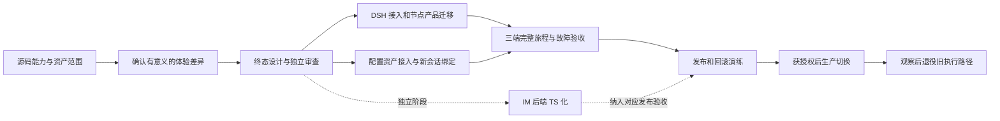

# refactor-581：整体迁移规划与能力取舍

> 2026-10-09，正式设计配套迁移计划。基于 Nano `4915c44c` 与 DSH `5badb150` 的源码核查。需求和产品取舍已收口，完整实施契约见 [design.md](design.md)，Q22—Q24修订已通过独立Round 3复审；未实施或生产切换。
>
> 阅读顺序：[用户原话与范围](motivation.md) → [能力与公开接口核查](capability-plugin-map.md) → 本文 → [正式设计](design.md)与[终态架构](target-architecture.md)。本文负责工作依赖、数据范围、取舍和交付顺序，不重复展开运行接口。

## 1. 组织原则与本轮结论

Q22要求DSH源码零改动；Q23要求5个Feature独立插件生命周期。修订已通过独立R3 Approved。终态架构§5.4/§10为当前权威。

**原生缺失的现有能力迁移保留；已有相近机制才衡量替代；部分覆盖拆成原生复用与缺失补迁。** 不再先定“3＋1 插件”，也不把每个不同的工具名、参数、目录或脚本语言变成兼容需求。需要确认的是用户能完成什么工作、哪些保证会改变，而不是内部实现是否同构。

本轮由Nano实际注册、current specs和DSH能力目录双向核对，新增跨领域[覆盖处置审计](capability-plugin-map.md#8-全量覆盖与处置审计)，逐项记录原生体验、可退役职责、最小接入及缺失补迁。此前对Workflow分析更深、非Workflow原生替代比较不足的问题已修正；不能再宣称只剩用户答卷。正式接口与验收设计已在design及配套详述闭合；定向资产转换与验收执行属于实施阶段。

默认保住产品骨架：个人助手、global/single_thread、Web/原生 iOS/飞书、公司/聊天访问资格、Inbox、显式发送及真实回执、共享任务图、配置归属；旧聊天兼容按C4退出本次范围。默认优先换成 DSH 的通用执行：文件/shell/web/MCP、Skills 加载、子 Agent、基础 Workflow、会话与压缩。用户已确认保留 Workflow 四项控制能力；其余实质差异见第 3 节及 [产品决定](pending-decisions.md)。

计划采用以下顺序：

这是工作依赖，不是每个方框都要单独建插件、进程或 change unit。实施时用能够独立验证的纵向切片组织工作，不按数据库/API/UI机械拆开。

## 2. 哪些事情由我安排，哪些交用户确认

| 类别 | 处理方式 |
|---|---|
| 能力核查、源码引用、依赖排序、文档一致性、分派审查 | 主 Agent 自主推进 |
| 插件归并、接口细节、原生包装配、实现语言及工程切片 | 在已确认产品范围内给出有依据的方案；不让用户替我做源码分析 |
| 微小用法变化 | 按一类体验集中说明并确认，不逐参数反复提问 |
| 能力消失、恢复/权限保证改变、显著操作负担或服务费用变化 | 明确旧体验、原生替代、保留代价和推荐，请用户选择 |
| 生产停机窗口、切换与不可逆操作 | 先准备可审查的具体方案及回退证据；部署另按生产授权执行 |

不能把“用户愿意考虑原生替代”记录成“已批准删除高级能力”。也不因暂未选定某个高级能力，就停下其他独立分析和规划。

## 3. 需要确认的具体取舍

产品取舍已按Q1—Q24收口，以下保留范围和成本依据；当前决定集中于[产品决定](pending-decisions.md)，正式接口及milestone见[design.md](design.md)。

### C1：基础工具与 Workflow 的原生工作方式

| 体验 | 当前与原生的差别 | 建议与代价判断 |
|---|---|---|
| 读写、shell、网络、Skill 调用 | 工具名、schema、命令写法、输出展示有所不同 | 采用原生；更新实际使用的产品提示/Skill 引用，不复刻旧工具全集 |
| 多 Agent 编排 | 受限 Python 改为 JS；原生也有并行、流水线、结构化结果、阶段/日志和后台运行 | **JavaScript已确认**；不额外维护受限Python Workflow执行器，四项控制仍保留 |
| 命名/保存脚本与一层嵌套 | 原生执行 script/meta/args；旧系统有专门发现/命名入口和一层嵌套 | **已确认按原有行为保留**，在JavaScript Workflow provider中补命名catalog与一层嵌套，共享父运行限额/停止/预算 |
| 暂停、指定逻辑 child 重启、复用已完成前缀 | DSH 没有同等控制。失败后由主 Agent重新安排不等价 | **已确认保留**；复用 DSH child执行，补足调用身份、结果记录、派发控制和恢复条件 |
| Workflow 共享 token budget | 原生提供 child 总数、并发和 item 限制，不是同一 token 预算 | **已确认保留**同 turn 父子 output-token累计、余额查询及耗尽后停止新派发；不以并发/数量上限代替 |
| 脚本执行约束 | Nano 禁止脚本直接产生系统副作用；DSH Node VM 不是安全边界，受所选文件 sandbox 约束且网络并非由该 policy 限制 | 独立说明并确认约束选择；不把它藏在“换语言”里 |

四项控制的验收按 [current Workflow 契约](../../archive/pre-dsh-581/kernel/workflows.md)：暂停不启动新 child，live resume恢复派发；重启替换同一 logical call的 attempt；恢复创建新 run并复用同 parent session内最长相同完成前缀，保留调用开始与完成顺序，遇到变化/缺失即停止后续复用；预算计父子 output tokens，耗尽后拒绝新 `agent()`，无 target时不添加上限。完成前缀恢复包括原终态记录在进程重启后的显式恢复，不承诺任意语言栈续跑。

脚本语言已确认JavaScript，保存/命名复用及一层嵌套已确认保留。子Agent审批已确认补迁；原问题10转为具体运行边界的工程核查；旧聊天兼容按C4排除，不扩大解释已确认决定。

已确定的四项接入方案及验收切片见 [Workflow控制设计](workflow-control-design.md)。产品取舍已收口，见[产品决定](pending-decisions.md)。

### C2：Agent 自建工具与知识维护

| 体验 | 原生替代 | 何时需要额外实现 |
|---|---|---|
| Agent给自己或共享层创建工具 | **已选A**：标准DSH bundle/plugin；全局挂共享层，workspace按可信绑定挂对应scope | 两层、局部同名优先与同workspace多会话一致必须验收；安装不自动全局启用；现有Python程序可保留，旧Tool适配转换 |
| Skill 发现、加载、文件创作 | 原生 provider/loader/文件工具，采用其命令和名称规则 | 产品名单与 preview 一致需要受控装配；任意社区全局贡献的统一过滤存在 registry 接口缺口 |
| 记忆文件 | 保留文件内容，复用原生文件/执行能力；受控注入由产品装配 | **已确认迁移**memory add/replace/remove、来源审计、并发更新与注入策略 |
| 后台自动维护记忆、Skill 使用计数/归档/自动生成启用 | DSH没有对应维护机制，child/jobs/events仅提供执行基础 | **已确认必须迁移**Nano触发、统计、维护、成功写入事实与配置调和；保留现有行为，内部实现适配DSH |

自建工具已确认采用原生标准格式，必须同时保留全局共享与workspace局部两层、同名覆盖；按[两层装配设计](capability-plugin-map.md#43-已选a标准插件格式保留全局workspace两层)实现。**知识内容及记忆/Skill自动管理策略均已确认迁移保留**，撤销改为手动的候选；DSH的发现/加载与执行原语不等于自动维护机制。

### C3：权限与审批交互

| 体验 | 已查明的原生行为 | 建议 |
|---|---|---|
| 可信真人/Agent/系统/引用的区分、跨聊天访问资格 | stock Auto 的来源模型不能直接理解 Nano Inbox；身份校验仍属产品 | 保留这些边界；不能靠伪造 user 来源换取兼容 |
| 普通 child 越权后的处理 | 原生 never：拒绝并把限制反馈给父 Agent | 优先采用原生 |
| Workflow child 直接向原启动消息弹卡 | 原生默认不会；公开初始化生命周期可以改policy并接审批 | 按缺失机制补迁原审批路由，不再询问是否删去；复用child引擎与ApprovalService |
| 专用Auto审核模型、拒绝计数、global短确认、无人值守回退 | stock Auto不完整提供相同配置和规则 | 缺失部分直接补迁；复用gate/approval/LLM。问题6已确认默认Nano判定规则、支持配置切换DSH默认规则，维护一个policy consumer |

Auto规则选择与生效边界见[能力地图](capability-plugin-map.md#74-原生-auto来源和专用审核模型不是配置项)。验收默认Nano及配置切换DSH后的实际判定，并确认专用审核模型、可信来源与人工审批路由仍有效。

审批展示可变与授权真实性不可变是两件事。一个方案即使减少弹卡，也不能扩大模型可自行授予的权限。

### C4：开发态的新会话起点

用户已确认当前是开发态，旧聊天无需专项兼容。迁移后从新DSH上下文开始，不做旧事件转换、摘要交接、旧消息fork或旧档案蒸馏适配，原问题8随问题7一起撤销。不为旧聊天设计迁移器或增加交付门禁；保留原文件不等于维护旧读取服务。

新DSH历史的保存、重启继续、按消息分支与受控读取/Skill蒸馏仍属于产品能力，直接基于新格式接入。账号配置、workspace、Memory、Skills、工具及外部发送事实等非旧聊天上下文资产按第4节处理。本轮不删除任何现有数据。[P03]

### C5：可靠性、模型与外部服务

| 项目 | 已定迁移要求 |
|---|---|
| 进程重启时正在执行的 child/Workflow | 明确显示中断，由新执行继续；不承诺保存 JS 栈。已接收输入、已持久结果和实际外发事实仍须可对账 |
| 完成后尚未交付的 Workflow 结果 | 保住持久交付，复用原生引擎、调整结果 consumer；不把在线通知当跨重启保证 |
| 自动模型fallback | 同模型retry复用原生；按终态架构§10.2的公开插件在原生turn终态与下一次准入间完成模型切换及重新装配，Nano policy负责备用链/粘性/公开输出边界 |
| Web search 服务 | 原 provider 为 DDG/Brave/SearXNG，DSH 第一方为 DeepSeek/Exa/Perplexity。保留现有 provider 接入及实际配置，不擅自引入付费服务 |
| OAuth/代理/MCP | 本机脱敏核查为Anthropic协议经本地代理，存在thinking请求扩展；优先保留该路由并定向验证wire。DSH直连OAuth是另一路径，MCP是可复用新增能力；不把名字或包存在当已接通 |

### C5补充：停止、压缩和工具行为的部分覆盖

- 取消传播及受管资源收口复用DSH。自有工具/RPC必须传递signal；Nano旧Task.cancel也不是任意代码强杀。验收实际采用的LLM等待、shell、审批和工具等待，收口后同session能继续；不新增通用隔离项目，也不丢弃未结束的副作用Promise。
- 自动压缩复用原生算法；手动focus和幂等receipt、消息fork锚点/历史配置、Skill压缩后可用等附加行为保留。
- 文件工具、continuable child、jobs、prompt装配与provider计量复用原生。现有搜索后端、web_fetch的prompt提取、共享Python工具及hooks逐项接入；原生命名/参数、截断续读和后台输出读取已按Q21采用，不复刻旧schema。

### C6：上线约束与服务端改写范围

**DSH 换核与 IM 后端 TS 化分成可独立验收的阶段**，对应正式设计M1—M4与M5。IM不直接调用Agent，因此中心重写不是第一条换核链的技术前置；先保持中心API/认证/数据稳定，再完成全TypeScript终态。节点接入、资产和客户端适配均纳入对应纵向阶段。

这部分工程依赖和切片由主 Agent 安排，不要求用户决定类、进程通信库或测试框架。具体生产切换时再核对可接受中断与未完成工作处置；“先保留旧IM实现作为迁移步骤”不改变已定全TypeScript终态，也不把临时 Python↔TS 互操作扩建成长期多内核抽象。

维护窗口长度在实际运行资产盘点和演练后提出具体值，不凭源码猜分钟数。计划先按短维护窗口切换，停收/排空后只有一个新旧消费者和调度者；若用户要求零停机，再单独评估成本，不默认建设双写或双活平台。

### C7：定时机制的真实原生替代

11a已确认采用原生`schedule_create/list/update/delete`及ScheduleService：任务绑定创建它的主会话，到点回到同一会话并沿用上下文。single_thread使用创建时的聊天会话，global使用数字人主会话；不建立独立Cron会话或每任务专用会话。DSH持有唯一安排、timer、日历/时区、冷恢复及收件历史，退出Nano旧fresh-session定时派发。

Nano仍接入身份/来源、管理视图、立即运行、执行终态/错误历史及实际渠道交付；schedule收据不是执行成功。结果已在主认知产生，无需隔离Cron上下文再次回灌。11b已确认原生恢复后补发过期一次性提醒，不增加过期跳过策略；已有per-agent开关以独立原生Schedule owner的插件卸载/重挂保留，配置生效/补发边界见[终态架构§10.1](target-architecture.md#101-主动机制原生时间引擎与产品执行策略分开)。Heartbeat缺失的任务选择、activeHours、busy-skip、静默与目标策略继续迁移，本决定不将Heartbeat替换成普通reminder。同一安排不双写/双调度。[来源与逐项差异](capability-plugin-map.md#83-主动执行子agent与权限的处置)

## 4. 数据与资产范围

实施期定向盘点、已转换的原生工具、搜索/模型映射与隔离证据见[非聊天资产迁移记录](asset-migration.md)。生产切换仍按后文演练与授权执行。

这是源码层的迁移范围，**不是已盘点生产数量、字节数或有效凭据**。后续只在确定的节点 runtime/workspace 和 IM 数据目录做定向只读盘点，不扫描整盘，也不把秘密正文写入文档。

| 资产 | 原事实 owner/入口 | 迁移要求与目标 |
|---|---|---|
| IM 身份、认证、owner、节点、Agent profile 与配置操作 | IM SQLite schema | 保留 ID、资格、密码哈希/会话语义和操作回执；若暂保留 IM 实现无需先改表 |
| 聊天、成员、消息、事件、配置分界、Work/metrics、工具明细 | IM SQLite/事件记录 | 新DSH事件映射到产品呈现；旧聊天不做专门转换/读取兼容，也不以新日志覆盖旧文件 |
| 共享任务图与 mutation receipts | IM task_graphs/receipt 表 | 保留图 ID、revision、权限和幂等结果，不转换成 session todo |
| 附件/图片/文件本体与授权引用 | IM/节点媒体存储和消息引用 | 新系统保持文件和访问资格关联；不为旧聊天附件建立专项转换验收 |
| 全局 Inbox、读取/摄取记录、工作事实、publication ledger | `global_agent.sqlite3` 等节点仓储 | 保留待读、来源、交付及未知结果；具体字段映射在正式设计列出 |
| 群背景缓冲、relay 去重、会话绑定 | `group_context_buffer.sqlite3`、`relay_dedup.sqlite3`、`session_bindings.sqlite3` | 保留 accepted/dedup/binding 身份；旧内核 session 与新 DSH session 显式映射 |
| 外部影子消息与中断 saga、图片投递记录 | `external_shadow_sagas.sqlite3`、reply-images ledger | 核对外部成功/未知状态，不能切换时盲目重发 |
| desired/effective 配置及应用回执 | IM profile、节点 config、`config-apply-receipts-v1.json` | 保留 revision和指纹含义；转换不伪造“节点已生效” |
| 渠道加密 manifest 与节点密钥 | `channel-manifest-v1.json`、`channel-credentials-v1.pem` | 保留稳定 key identity 与关联，或显式重新封装；不能重生成 key 后仍假定旧密文可读 |
| IM/节点运行凭据、provider OAuth、渠道 token | 各自现有 credential owner | 单独定义导入/重新认证方案和文件权限；不把认证迁移与业务数据库复制混为一谈 |
| Cron 定义、last-due、运行历史、Heartbeat 内容与节律 | 节点 scheduler与 workspace | 不仅复制 job；保留开关、时区、触发与执行历史；错过规则采用已确认原生行为，结果已在主会话不另做认知回灌 |
| workspace 工作文件、MEMORY/USER/HEARTBEAT、Skills、工具/hooks | 各数字人 workspace及共享 roots | 内容原地保留或副本迁移；改格式的工具单独列兼容处理，不批量删除旧文件 |
| 旧内核 JSONL、压缩/分支和绑定 | 旧 session storage | 按C4不转换、不建设兼容读取路径；原件不删除，新DSH会话独立建立 |
| 新 DSH sessions 与运行配置 | DSH 单一 owner | 新格式独立保存；保留宿主 ID映射、来源、使用版本和结果交付记录 |

依据：[节点装配与存储](https://github.com/Mrchen116/nano-multiagent/blob/4915c44cb7f7b829414a19087877ad9b73d69ea1/src/personal_assistant/gateway/composition.py)、[IM schema](https://github.com/Mrchen116/nano-multiagent/blob/4915c44cb7f7b829414a19087877ad9b73d69ea1/src/IM/infra/db.py)、[渠道加密实现](https://github.com/Mrchen116/nano-multiagent/blob/4915c44cb7f7b829414a19087877ad9b73d69ea1/src/personal_assistant/channels/channel_credentials.py)、[Cron scheduler](https://github.com/Mrchen116/nano-multiagent/blob/4915c44cb7f7b829414a19087877ad9b73d69ea1/src/personal_assistant/scheduler/cron_scheduler.py)。本轮确认相关源码与最新 Nano 主线仅存在不影响本盘点的配置指纹三行增量。

正式转换方案必须为每类数据回答：继续使用还是转换、旧/新标识如何对应、失败后如何重跑、如何校验、回滚后谁持有新写入。这里不预设新数据库或把所有数据塞进 DSH session。

### 4.1 已查明的数据转换边界

推荐保持现有业务 ID 和存储事实，只在执行上下文与事件处做映射。以下约束来自源码，正式设计不能用“复制数据库”一笔带过：

| 范围 | 转换与对账要求 |
|---|---|
| IM 账号、节点、Agent、聊天 | 保留 owner/node/agent/conversation/message ID、认证撤销状态、节点 epoch、成员资格和幂等键。TS 化时兼容认证算法和刷新轮换；不能通过重新初始化公司恢复数据 |
| IM schema | 按最终初始化链及追加 migration 读取，不能只看初始建表字符串。例如任务图 mutation receipt 的最终表已取消 graph 外键，图删除后仍须保留其原操作结果。[M01] |
| Global Inbox 与绑定 | 业务来源、seq、未摄取分片继续保留；旧 session/tool receipt 只证明旧执行曾摄取。`save_global_session` 禁止更换既有 session/workspace，换核要走显式转换，不能假设现有 API 可以直接改绑。[M02] |
| 普通聊天绑定 | 保留业务 session key、reply context 和原 `created_at`，建立旧内核→DSH session 映射；canonical 直聊依赖最早绑定时间，重新插入时刷新时间可能改掉 Heartbeat 的目标。[M03] |
| 未完成操作 | 配置 prepared/applied、渠道删除与状态 ACK、绑定操作、图片 dispatch、shadow saga 分别对账。已外发但缺镜像只补镜像；未知外发不得换 key 重发。`device-binding-operation.json` 是待完成绑定的恢复材料，不能当缓存删除 |
| 密钥与媒体 | 保留渠道 key identity 与加密 manifest 的对应；媒体同时核对本体、摘要/尺寸、引用和访问资格。清理上传 reservation 前先停止上传；不能将历史空 owner 强填为任意用户 |
| 调度 | 一并移交 job、last-due、Heartbeat 状态及运行历史。旧 Cron 的残留 accepted/running 在重启时标记失败，不把历史记录转换成仍在运行的新 DSH 工作 |
| 执行档案 | 旧transcript、压缩及旧Workflow运行记录不做兼容转换；Skill及知识配置按C2接入。旧 consent 不自动变成新调用的授权；PID、进程出生信息和 launcher 状态由新进程重建 |

**普通 single_thread 排队输入当前在内存中；普通 relay 先记去重键再调用入站处理，global 则另走持久 Inbox。** 因此去重表不能证明输入正文或执行状态已经持久化，必须先停收、排空或明确结束在途工作，再对账切换。群背景缓冲中尚未采纳的消息要保留，不能以“排空”为名直接删除。[队列实现](https://github.com/Mrchen116/nano-multiagent/blob/4915c44cb7f7b829414a19087877ad9b73d69ea1/src/personal_assistant/gateway/run_queue.py)、[relay入口][M04]。

对账最低覆盖四类证据：业务键与引用不变、媒体及资格可解析、每项未决操作有终态或持久移交、旧/新执行身份可追踪。仅比较记录行数不能证明这些条件。

### 4.2 产品协议与运行事件的迁移边界

IM↔节点现有协议继续表达产品行为；节点将 DSH 事件投影为这些行为，避免把 DSH 内部类型直接扩散到 Web/iOS/飞书。正式设计仍须列出实际字段和版本，以下是完整协议组的处置范围：[M05]

| 协议组 | 保留与适配 |
|---|---|
| 注册、心跳、relay、delivery receipt | 保留节点/owner、消息/任务/幂等键和来源；映射 input/session。连接建立不等于 ready，接收、消费、终态、真实投递分开确认 |
| streaming delta、工具、thinking、reply process | 保留产品 run/message/tool 关联与增量完成校正；映射 DSH事件，不能把原生 `turn/end` 机械等同于一次产品回复结束；长工具/审批状态须有真实活性信号 |
| 显式 agent message、system message、配置 boundary、report | 保留发送 key、目标与消息锚点；系统和后台来源不冒充真人，重放事件不再次外发 |
| Work append/ACK | 保留 journal/seq 与 `through_seq` 对账；映射 session/turn/item。延续旧 journal 就接续序号，或显式开启新 journal，不从旧 journal 的 1 重新写 |
| conversation query、task graph command | 保留访问身份和 mutation request key；重试返回原 receipt，不能把共享图改成 session todo |
| 聊天审批、Work审批 | 两条产品路由都接到具体 DSH pending action；旧卡片不能批准新调用。Work的 `decision_unconfirmed` 仍表示尚未确认，不能以 WebSocket发送成功展示已批准。[M06] |
| 配置/能力/preview/Heartbeat/Cron/Skill RPC | 保留 operation/revision，将已确认的能力和原生命名如实投影到配置及 UI；移除的控制项一起退役 |
| fork、distill | 面向新DSH历史保留产品关联与消息锚点；旧transcript兼容排除。失败不留下半成品聊天/绑定 |
| channel reconcile/reconnect/status/runtime metadata | 继续由产品负责 revision、removal token、incarnation/sequence及 ACK，不引入 DSH session依赖 |

以上是静态接口范围；实际生产 schema、目录、未决数量与恢复能力仍要在发布前定向盘点和演练。

## 5. 建议工作包与退出证据

下表是工作范围分解；正式5个milestone已在design.md归并，Q22—Q24修订已通过独立Round 3复审。此表不另建10个实施单元。

| 包 | 依赖与可分工范围 | 交付与退出证据 |
|---|---|---|
| A 能力与范围核查 | 当前阶段；原生与产品双向盘点 | 覆盖表逐项有用户任务、native证据、可退役职责、最小接入、自研理由、状态/未知；实际模型/工具/hooks/周期按owner节点定向盘点 |
| B 产品取舍收口 | A | 各独立选项有决定；原生缺失能力直接纳入Requirement，不再让用户重选；Scenario反映实际变化 |
| C 终态正式设计 | B；源码明确的技术部分可提前准备 | 职责、插件边界、依赖、协议、数据、UI增量、迁移/回滚、两轨退出标准；完成独立设计审查 |
| D 第一条 DSH 产品纵向链 | C | 一个真实 single_thread 对话从入站、上下文/工具、审批、事件到正式交付闭环；含取消与长工具状态；不是仅调用模型成功 |
| E 两种模式及全部产品入口 | D；稳定协议后分派独立渠道/客户端部分 | global Inbox、single_thread 群复核、跨聊天显式发送、任务图、Cron/Heartbeat、配置和内置命令；普通/Workflow child正确继承身份与能力 |
| F 配置资产接入与新会话绑定 | C，可与 D/E 并行开发；集成依赖新绑定/协议 | 接入账号配置、workspace及知识/工具资产；建立新DSH绑定；按C4排除旧聊天转换和续接兼容 |
| G 知识/自建能力及条件策略 | B/C，接入依赖 D | 必须迁移Memory/Skill自动维护、已有工具/后端、fallback及权限缺失策略；已选Workflow能力全部补齐；原生工具/定时/风险政策按决定适配 |
| H IM 后端 TS 化（终态必需） | C；无需阻塞 D；按独立发布边界安排 | 原认证、API/WS、SQLite、媒体与配置行为通过契约和客户端验收；不顺便重设计身份/存储 |
| I 集成验收与发布演练 | E/F/G，H按对应发布是否纳入 | 最终集成版本的产品、代码和一致性门禁；窄测试后适当扩大；备份恢复、切换、回滚演练；契约归并、PR和CI |
| J 生产切换与退役 | I及具体生产授权 | 两节点真实 revision/cwd/PID/owner、Mini-only IM、HTTPS/WSS、真实收发/审批/调度/历史证据；观察后退出旧运行路径 |

顺序先证明最短完整产品链，再扩大模式与渠道；不会先写所有底层抽象、最后才发现消息无法正确交付。F 的配置资产接入可先在副本离线开发；H 的中心服务重写隔离发布风险。生产数据转换和真正切换仍按同一个演练过的顺序执行。

### 5.1 交付切片的边界

- D 的范围是可运行的完整新路径：实际 DSH 版本与 profile可识别、节点能收输入、模型能调用一个原生工具、产品能显示过程与最终消息。测试 fixture和启动脚本必须选择该路径，不能实际仍启动旧 Kernel。
- E 按完整场景扩展：先两种会话模式与真实身份/投递，再主动调度和各渠道；配置更改要贯穿运行装配、UI选项及下一轮生效，不只改一个配置表。
- F 只处理实际需要的配置/资产格式与新会话绑定；不编写旧聊天转换器、摘要交接或旧历史读取服务。源文件不原地改写，半成品不能绑定到正式聊天。
- G的每块对应覆盖表的原生复用或缺失补迁，不以“用户尚未再次确认”阻止原有能力迁移。自有provider/policy写明原生不足的具体行为，工具安装、calendar、jobs等已有引擎不复制；旧UI开关映射到真实新owner。
- H 与节点切换分开验收和部署；共享 API/WS语义保持时允许单独交付。任何协议或数据库不向后兼容的变化，都必须标出哪组版本能够共存，不能以“都是 TS”代替兼容性说明。

正式设计已按分阶段可运行验证和中心独立发布边界，将上述范围归并为M1—M5；目录与两轨退出标准见design.md，不再额外按A—J创建目录。

## 6. 产品验收必须覆盖的组合

| 用户旅程 | 必须同时看见的结果 |
|---|---|
| 普通聊天/执行中插话/停止/新会话 | 回复归正确输入与目标，晚到事件不污染新会话，长工具/审批等待不误判失活 |
| global 跨聊天工作 | Inbox 来源和摄取事实真实，草稿不自动外发，群更正可以阻止尚未提交的旧回复 |
| single_thread 内置群 | 普通正文、同群工具和后台回流均遵守已接受输入的发言前复核；不扩大原唤醒范围 |
| 多数字人/child/Workflow | cwd、模型、Skill、权限和结果归属正确；基础并行和值传递来自真正多 Agent执行 |
| 记忆/Skill/自建工具 | 可创作、发现、启用、使用，显式空名单与来源可解释；记忆自动整理、Skill使用去重/阈值维护/归档/生成启用按原契约触发，仅成功写入才记录完成，并验证前台结束后的配置调和 |
| Heartbeat/Cron | Cron回到创建它的主会话；Heartbeat静默/忙时/活跃时段及两者错过策略、手动运行、历史与追问符合确认范围 |
| 故障与重启 | 已接受未处理、处理中断、已完成未交付、外发未知分别显示；不靠盲目重放副作用恢复 |
| Web/原生 iOS/飞书 | 登录恢复、媒体资格、消息/工具/审批/Work与配置可用；iOS有独立前后台和真实设备证据，飞书有实际平台证据 |
| 新DSH历史 | 保存、重启继续、fork、读取与distill正常；不以旧聊天兼容作为验收门槛 |

运行证据属于实现验收，不将本轮源码核查描述为“已通过产品测试”。沿用现有 [测试规则](../../development/testing.md) 与 [证据规则](../../development/evidence.md)；已有有效检查不因角色更换重复执行。

### 6.1 既有验证资产怎么迁移

现有测试是行为来源，不是必须逐行移植的实现。下表为已定位的代表入口，实施时只维护受影响的具体保护；本轮没有运行它们，也不把文件存在算作通过。

| 风险与既有入口 | 迁移处置 | 新证据应观察什么 |
|---|---|---|
| [global Inbox关键路径](../../../tests/e2e/critical_paths/test_global_agent_inbox_critical_path.py) | 保留旅程，更新旧 `agent` 工具/参数及 Work提取器；不强迫新工具模拟旧schema | 两聊天来源、真实摄取、同child追加、正确目标交付 |
| [审批关键路径](../../../tests/e2e/critical_paths/test_permission_approval_critical_path.py) | 保留批准/拒绝副作用断言；替换依赖旧 `.gitconfig` dangerous-basename 的触发方式 | 新审批链实际产生请求，批准后执行、拒绝不执行；不是仅展示一张卡 |
| [运行接收/竞态](https://github.com/Mrchen116/nano-multiagent/blob/4915c44cb7f7b829414a19087877ad9b73d69ea1/tests/integration/test_session_run_coordinator_real_kernel.py) | 旧 Python Kernel fixture退出后重写为新接入契约；不要保留其私有运行对象断言 | FIFO、插话归属、输出/取消与后台回流不串到下一输入 |
| [重启续接关键路径](../../../tests/e2e/critical_paths/test_restart_session_continuity_critical_path.py) | 保留同新运行时重启旅程，更新启动/在线判据 | 同DSH上下文重启后继续；不另设旧聊天迁移样本 |
| [分支](../../../tests/e2e/critical_paths/test_message_fork_critical_path.py)、[蒸馏路径](https://github.com/Mrchen116/nano-multiagent/blob/4915c44cb7f7b829414a19087877ad9b73d69ea1/tests/unit/personal_assistant/test_gateway_distill_prompt_resolver.py) | 改用新DSH历史与消息锚点，按C4排除旧格式适配 | 新历史指定消息分支、受控蒸馏、来源资格与缺失错误 |
| [Cron](../../../tests/e2e/critical_paths/test_cron_push_critical_path.py)、[Heartbeat](../../../tests/e2e/critical_paths/test_heartbeat_bubble_critical_path.py) | 保留产品行为；新调度接线不得沿旧Kernel stub取得虚假通过 | 正确会话、静默、错过策略、运行历史、结果回流与追问 |
| [single_thread群复核](https://github.com/Mrchen116/nano-multiagent/blob/4915c44cb7f7b829414a19087877ad9b73d69ea1/tests/unit/personal_assistant/test_reply_revalidation_delivery.py) | 纯业务规则可移植；接入层另覆盖实际发送边界 | 已接受更正挡住未提交旧稿；后台与同群发送工具一致 |
| [任务图API](https://github.com/Mrchen116/nano-multiagent/blob/4915c44cb7f7b829414a19087877ad9b73d69ea1/tests/im_service/integration/test_task_graph_api.py) | IM保留阶段继续使用；TS化时复用HTTP/WS请求/响应语义，替换FastAPI TestClient装配 | 同图读写、revision、幂等、原子性和访问资格保持 |
| [前端用户流](../../../src/IM/frontend/src/realtime/user-stream/user-stream.test.ts)、[聊天API](../../../src/IM/frontend/src/features/chat/chat-api.test.ts) | 产品协议稳定则保留；经确认的schema变化集中适配 | 重放/迟到事件、工具过程、审批与最终消息，不仅编译成功 |
| [Swift能力契约][V01]、[Swift会话契约][V02] | 保留身份/地址/会话隔离，按新能力元数据更新工具及功能选项 | 显式空选择、登录刷新、旧响应不得污染新server/account；真机另验 |
| [旧SDK边界](https://github.com/Mrchen116/nano-multiagent/blob/4915c44cb7f7b829414a19087877ad9b73d69ea1/tests/contract/test_agent_sdk_boundary_contract.py)、[CLI边界](https://github.com/Mrchen116/nano-multiagent/blob/4915c44cb7f7b829414a19087877ad9b73d69ea1/tests/contract/test_cli_sdk_only_contract.py) | 随旧路径退役而替换/删除，先建立新包依赖边界保护 | 产品代码不调用DSH私有实现，IM不驱动Agent loop；PA运维入口仍可用 |
| [Workflow控制与恢复](https://github.com/Mrchen116/nano-multiagent/blob/4915c44cb7f7b829414a19087877ad9b73d69ea1/tests/unit/agent/platform/workflows/test_manager_resume_restart.py) | 已确认保留四项行为；把旧Python对象断言改为新owner的暂停、attempt替换、前缀及预算契约 | 明确保留边界，同时验真实并行、值传递和进程重启后终态前缀恢复；不复制旧loop实现 |

测试分三层推进：最窄的产品规则/公开接入契约保护 → 真进程/故障集成 → Web、原生iOS与飞书旅程。DSH自身工具、loop、语言运行时的内部测试不复制到Nano；只保留Nano装配和产品接入承担的风险。一次转换和发布演练的结果作为当次证据，不把临时脚本变为长期框架测试。

## 7. 切换与回滚的设计输入

生产默认继续现有两节点 topology：IM 只在 Mac mini `:8011`，两个 Gateway 分别绑定正确 node identity与 owner；不因语言重写迁移中心位置。[P04]

建议切换顺序：

1. 确认待发布版本、两节点兼容范围、迁移副本校验和恢复演练结果；记录数据检查点。
2. 在维护窗口停止旧入站消费与调度触发，按策略收拢当前运行、审批和投递。未结束的工具/任务明确中断或排空，不能假装转入 DSH继续执行。
3. 在稳定检查点转换/绑定数据，保留旧源与凭据；验证 owner、节点、Agent、聊天、媒体、配置和待投递关系。
4. 启动新运行时与产品服务，确认只有一个渠道消费者和一个调度 owner；恢复入站后做真实关键旅程和未交付对账。
5. 观察实际收发、后台结果、调度、配置和资源释放；验证后退役旧执行入口，旧聊天不再维持兼容读取路径。

两节点可顺序升级，但不是默认允许任意新旧协议混用。正式设计要列出协议/配置版本的共存窗口；若暂不支持，停收两个节点再完成切换，不引入未经需要的双活协议。

**回滚分界以新写入为准：**

- 尚未接收新业务或产生 DSH新写入：停止新服务，恢复检查点并启动旧版本，核对唯一消费者。
- 已有新消息、新配置、实际外发或 DSH历史：先保存增量并对账。共享业务数据若向后兼容可继续沿用；新 DSH认知历史无法直接交给旧内核时，保留档案并建立新上下文，不做跨内核上下文转换。不能简单恢复旧数据库快照而丢失切换后的工作。

回滚演练须证明失败点、检测方式和恢复结果。维护窗口和具体命令在运行资产盘点、实现与演练后生成；本文的顺序不构成现在执行生产操作的指令。

## 8. 旧路径退役与完成定义

停用的是自研 Coding Agent CLI 和旧 Agent执行路径，不能误删个人助手启停命令、IM enroll/admin运维入口。退役范围包括启动提示/脚本、包依赖、CI/架构契约、文档和旧扩展引用；历史数据的保留与代码的删除分别处理。

整体完成至少分清：方案已确认、设计审查通过、实现及独立验收通过、PR/CI/合并、实际生产部署、真实产品与多节点验收、旧运行路径退役。任何一个状态都不替代后一个。

下一步在产品取舍收口的同时，把已定能力的公开接口、配置/事件映射和资产转换写实；Cron主会话投递及过期补发均已确定采用DSH原生，其余缺失能力直接补迁。规划完成以能力有去向、复用有证据、自研有理由、变化有决定及关键旅程/数据/切换可验收为准，不以仅答完问卷为准。

“整个迁移计划完成”的判据与“迁移已经实施完成”分开：计划完成需要能力/数据/协议范围闭合，用户已确认实质体验取舍，正式设计及独立审查收口，工作包、验收和发布回退可执行；并不要求在本轮先实施这些工作。当前产品取舍已确认，正式设计仍须独立审查；不能仅因问卷答完或文档存在就标记规划完成。

[P03]: https://github.com/Mrchen116/nano-multiagent/blob/4915c44cb7f7b829414a19087877ad9b73d69ea1/docs/specs/gateway/relay-protocol.md#L254
[P04]: ../../operations/prod-fleet.md
[V01]: https://github.com/Mrchen116/nano-multiagent/blob/4915c44cb7f7b829414a19087877ad9b73d69ea1/src/IM/ios/Tests/AgentContractsTests.swift
[V02]: https://github.com/Mrchen116/nano-multiagent/blob/4915c44cb7f7b829414a19087877ad9b73d69ea1/src/IM/ios/Tests/SessionTests.swift
[M01]: https://github.com/Mrchen116/nano-multiagent/blob/4915c44cb7f7b829414a19087877ad9b73d69ea1/src/IM/infra/task_graph_schema.py
[M02]: https://github.com/Mrchen116/nano-multiagent/blob/4915c44cb7f7b829414a19087877ad9b73d69ea1/src/personal_assistant/gateway/global_inbox.py
[M03]: https://github.com/Mrchen116/nano-multiagent/blob/4915c44cb7f7b829414a19087877ad9b73d69ea1/src/personal_assistant/gateway/session_keys.py
[M04]: https://github.com/Mrchen116/nano-multiagent/blob/4915c44cb7f7b829414a19087877ad9b73d69ea1/src/personal_assistant/channels/web_relay_adapter.py
[M05]: https://github.com/Mrchen116/nano-multiagent/blob/4915c44cb7f7b829414a19087877ad9b73d69ea1/src/IM/ws/gateway/protocol.py
[M06]: https://github.com/Mrchen116/nano-multiagent/blob/4915c44cb7f7b829414a19087877ad9b73d69ea1/src/IM/ws/gateway/work.py
