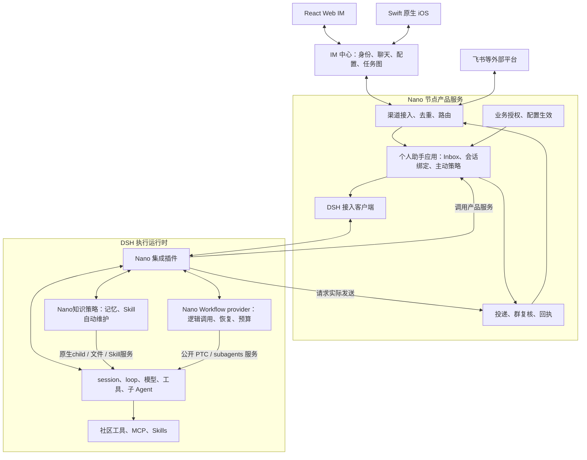
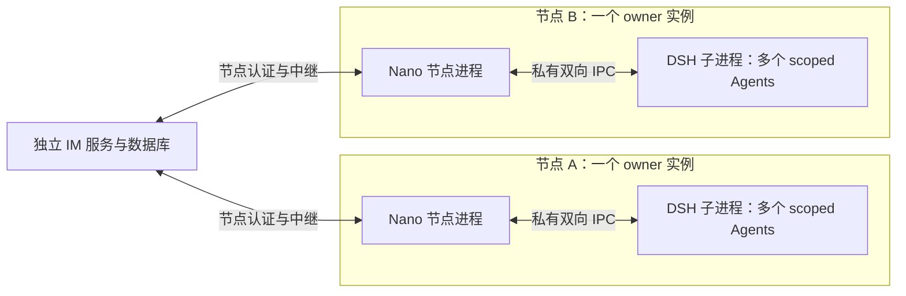
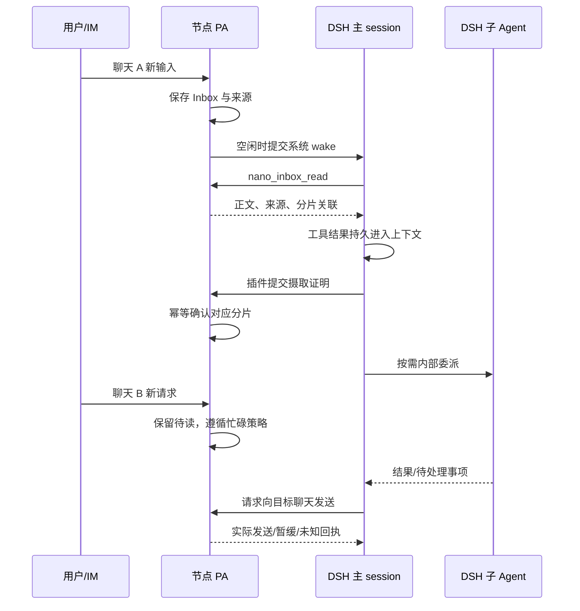
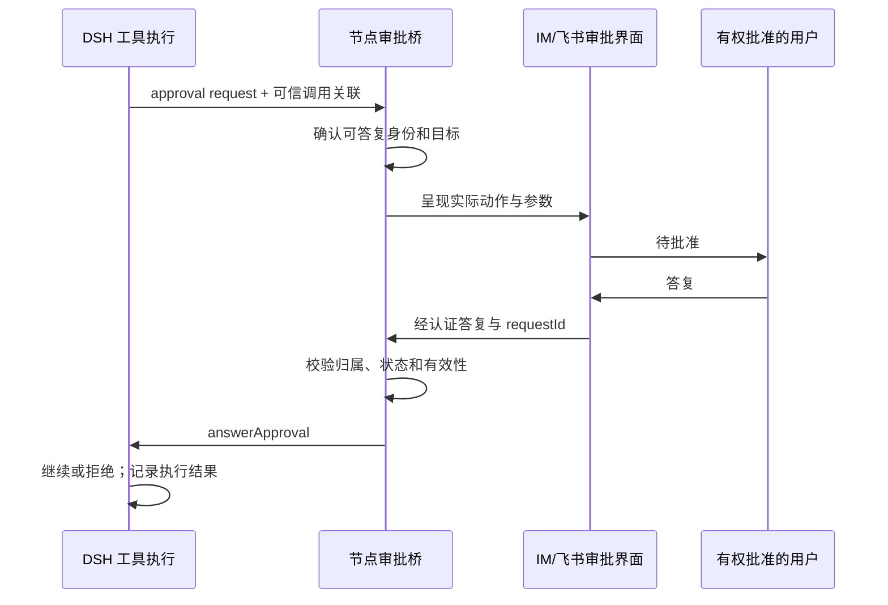

# refactor-581：个人助手采用 DSH 的终态架构

> 2026-10-09，正式设计的终态架构详述。回答“最终由谁负责、如何协作、为何这样划分”，不安排迁移阶段。
>
> 用户已确认：采用 DSH 替换自研 Agent 内核，只发展个人助手、停用自研 Coding CLI；尽量保住体验，允许讨论高成本兼容的原生替代；语言可以重新选择。本文的进程、包结构和接口已纳入正式design；Q22—Q24修订已通过独立Round 3复审。原话与范围见 [motivation.md](motivation.md)，早期方案比较见 [architecture-options.md](architecture-options.md)。

> **当前状态：Q1—Q24产品取舍已收口，DSH源码零改动与五项Feature独立启停已纳入修订，独立Round 3 Approved，0 CRITICAL / 0 WARNING；见审查记录及作者消歧。** [能力源码核查](capability-plugin-map.md) 已撤回提前确定“3＋1 插件”和实验优先的安排；用户要求优先原生复用，小幅差异确认后接受。整体依赖、数据与切换安排见 [迁移规划](migration-plan.md)。正式实施入口为[design.md](design.md)，证据见[独立审查记录](design-review.md)；尚未实施或部署。

> 已确认保留的四项Workflow控制另有 [接入设计](workflow-control-design.md)。产品决定集中在 [产品决定](pending-decisions.md)，不再将四项控制列为可省去候选。

## 1. 结论和阅读路线

建议把 Nano 建成一个**拥有自己业务状态的个人助手产品**，把 DSH 作为**可管理的 Agent 执行运行时**。两者之间保留专门面向 DSH 的集成层及已确认的Workflow扩展，不再维护自研 loop，也不把 Gateway 整体改成 DSH 插件。

具体建议：

- IM 中心持有账号、公司、聊天、数字人配置与共享任务图；节点产品服务持有渠道接入、跨聊天 Inbox、主动调度、配置生效与真实投递。
- DSH 持有模型调用、上下文、工具执行、session 日志、内部子 Agent 和通用扩展。产品工具仅通过集成插件进入它的执行世界。
- Nano Workflow provider持有已确认的逻辑调用控制、结果前缀和共享预算，真实child与脚本进程复用DSH；这是一段需要维护的host/guest实现，不是普通事件映射。
- 每个节点的 owner 实例默认管理一个 DSH 子进程，多个数字人在其中用独立 session／scope 运行。IM 仍是独立中心服务。
- 自有服务端与 Web 以 TypeScript 为主；原生 iOS 保留 Swift，工具／Skill 脚本按需保留 Python 等语言。统一语言不要求统一进程或插件框架。
- 先守住已有业务不变量，不因换核新增一套通用任务调度平台。共享任务图仍不自动执行；工作视图仍是事实投影。

独立 DSH进程是当前推荐。源码已查明持久输入、flush、消费日志、来源、审批及child创建生命周期的公开接入面；产品协议如何组合它们见第7—10节。官方SDK wire仍不够用，需专用serving插件；实现后按第15节验证崩溃恢复与实际交付，不能把源码可行性当成运行验收。

第 2 节说明最新基线；第 3—6 节解释职责、进程、代码和数据；第 7—11 节推演真实旅程；第 12—15 节列出取舍、成本和决定架构能否落地的验证。

## 2. 分析基线与证据边界

本轮已对两个仓库执行成功的 `git fetch origin`，不是只依据旧工作目录推测远端状态。

| 仓库 | 本轮远端基线 | 分析方式 |
|---|---|---|
| Nano | `origin/main` = `4915c44cb7f7b829414a19087877ad9b73d69ea1` | 首轮隔离checkout分析；本轮以git show固定提交及已核对相同的本地源码读取。写作在main@76fe1d7e，保留既有dirty/untracked |
| DeepSeek Harness | `origin/master` = `5badb15009ae1756c3afe0ae0cef1faafc290ccc`，`0.2.1-alpha.1` | fetch 后本地 HEAD 与远端一致，工作区干净 |

Nano 比早期分析使用的 `76fe1d7e...` 新 94 个提交。在相关路径中，内核与 PA 主体没有结构变化，PA 增量是配置指纹归一化；重要产品增量是原生 iOS 客户端与移动 Web 修正。因此先前关于执行边界的分析仍有来源支撑，但“主产品都用 TS”需要明确排除原生 Swift 客户端。[N1][N2]

证据分三层：

1. **当前事实**：下文引用的 current spec、公开导出类型和源码行为，均来自上述固定提交。
2. **终态建议**：本文规定的 owner、接口、恢复规则与包边界，尚未实现。
3. **证据边界**：机制及公开扩展点先由源码核查，不能一概推给 PoC；已接入产品的正确性、性能和实际交付由后续实施验收证明。本轮没有接入测试、性能测试或生产验收结论。

DSH 公开 API 有能力不等于 Nano 已获得相同产品体验；current spec 规定一种体验也不代表本轮已重新验收线上系统。

## 3. 从用户旅程推导职责

### 3.1 必须解释得通的六类事情

| 用户正在做什么 | 产品应保住的事实 | 执行运行时负责什么 |
|---|---|---|
| 在 Web、iPhone 或飞书继续聊天 | 身份、聊天成员关系、附件、消息去向、断线后历史 | 读取上下文、调用模型／工具、形成回复 |
| 一个数字人处理多个聊天的工作 | 待读来源、跨聊天主上下文绑定、该由谁交付 | 主 session 连续认知，按需内部委派 |
| 群里刚补充了更正 | 已接收更正不能被旧草稿越过；正式发言有真实回执 | 读取新信息、重作判断 |
| 让助手定时检查并反馈 | 何时触发、针对哪个数字人、时区、静默和错过周期规则 | 执行这次被唤醒的工作 |
| 修改模型、Skills 或能力 | 配置目标与节点实际生效状态可区分 | 在正确 scope／边界应用执行配置 |
| runtime、网络或节点重启 | 已收到的消息、未确定投递、工作归属可以解释和恢复 | 根据 session 持久日志恢复执行事实 |

这些事情不能只靠一个大 prompt 解决。prompt／Skill 能描述行为，调度器能触发执行，session 日志能保存认知，但“消息到哪了”“谁能批准”“哪条正文确实已摄取”仍需要相应的持久事实和机制。

### 3.2 逻辑架构



方框是职责，不都是独立服务。Gateway 的许多现有职责会成为节点内的普通模块；执行接入和Workflow扩展进入DSH插件作用域。节点产品仍拥有业务身份与渠道交付，Workflow provider只管理自身run/call/attempt及结果记录，不接管IM消息库。

### 3.3 插件的准入标准

需要注册模型可见工具、提供 prompt／来源上下文、安装 per-agent 限制、监听执行事件或对接审批的部分进入插件。Agent 还没启动或 DSH 已经退出时仍有意义的产品业务，留在节点或 IM。

以发送消息为例：插件提供 schema、真实调用身份关联、取消信号和工具结果；产品服务决定访问资格、目标、是否因群更正暂缓、实际发送与回执。插件不另存一份“已发送消息”，产品也不执行模型下一步。

以任务图为例：工具入口在插件，业务记录在 IM。保存计划不隐式开工，更新节点不自动解锁其他节点或创建 subagent。这是 current 契约，不在换核时偷偷扩大。[N5]

**全局模式的DSH接入作为独立模式插件装配。** 它负责global主会话的模式提示、Inbox/来源上下文接线、摄取确认事件，以及普通执行正文不自动外发、由显式发送产生正式发言的模式规则；复用共享产品工具和运行事件接入，不复制发送或统计实现。节点继续拥有跨聊天Inbox、主会话绑定、唤醒准入、渠道路由与交付回执，插件通过既有产品接口调用它们。用户选择`global`或`single_thread`决定相应模式装配，不新增第六项Feature开关。全局模式同样保留Work工具明细与轮次用量统计；这些由共享事件投影提供。模式切换沿既有配置安全边界收口，撤下模式贡献不删除Inbox、会话或工作记录。

## 4. 部署与进程：推荐分开生命周期

### 4.1 同一组需求下比较三个方案

| 方案 | 内部调用形态 | 主要收益 | 主要代价 | 判断 |
|---|---|---|---|---|
| 节点产品与 DSH 同进程、普通模块分层 | 直接公共 API／scope／事件 | 接入短，取消、审批和工具回调容易关联 | 插件阻塞、fatal 异常和 runtime 升级会影响渠道接入 | 有价值的备选，不是职责混合的同义词 |
| 每个节点 owner 实例一个 DSH 子进程 | 专用双向本地协议 | DSH 重启时产品仍能接收消息、持有回执并显示故障 | 输入持久确认、事件补读、工具回调须跨进程 | **推荐默认**，以第 15 节验证通过为条件 |
| 每个数字人一个 DSH 进程 | 多组相同协议／运行目录 | 进程故障和插件依赖可分别隔离 | 重复插件树、连接与生命周期管理，运维成本更高 | 只在确有独立故障域或依赖需求时使用 |

DSH `agents.create/resume` 支持独立 cwd、模型配置和 unpublished scoped setup；不同数字人的 prompt、工具和监听器可以按 scope 装配。因此“模型／workspace 不同”本身不要求每人一个进程。[D1]

独立进程隔离的是执行可用性和生命周期。相同 OS 用户下运行的社区插件、bash 和文件工具仍可能访问同一用户的数据；它不是恶意代码安全沙箱。当前不为同机不可信租户承诺强隔离。

### 4.2 物理部署



一个数字人的执行绑定到明确节点；owner 在两台节点上运行，不意味着跨机器共享同一个 runtime。默认不增加自动抢占、跨节点 session 漂移或分布式选主。节点离线时如实显示离线，已持久消息按现有接收／恢复契约处理。

跨 owner 使用独立节点实例和数据目录。IM 的 owner／公司／聊天权限不因 DSH scope 而自动成立，仍由产品验证。[N6]

### 4.3 生命周期

节点先打开业务存储和渠道接入，再启动锁定版本的 DSH profile，完成协议版本／能力握手，恢复需要继续的绑定后才标记“可执行”。渠道在线、runtime 就绪、Agent 可用是不同状态。

产品负责子进程启动、退出识别和有界重启；DSH 负责其 Agents、工具和内部子任务的生命周期。终止 session 通过持有的 Agent handle／公共 API，不直接杀任意子进程。退出时先停止新执行、处理所属运行的取消与落盘，再关闭 runtime；已接受业务输入和不确定投递留有记录。

本地协议默认采用双向 stdio JSON-RPC，stdout 只写协议，日志走 stderr。DSH 仍通过其 launcher／profile 装配；Nano serving 插件是唯一 stdio 协议写入方，不同时挂上 stock SDK server。profile 必须包含所需持久化、工具、provider、审批和扩展依赖；不能把只装了 Agent registry 当成完整执行环境。[D2][D3]

审批答复、取消和产品工具回调不能排在一个正在等待模型结束的串行请求后面。传输读写持续运行，按 request ID 分发；只对需要保护一致性的单 session 控制／单业务记录更新局部串行。

## 5. 语言、代码组织与依赖

### 5.1 语言选择

| 部分 | 推荐 | 理由／限度 |
|---|---|---|
| Nano 节点与集成插件 | TypeScript | 与 DSH 公共类型和插件开发一致，减少跨语言转换 |
| IM 后端 | TypeScript 独立应用 | 与节点和 Web 共享产品协议与工具链；这是长期维护选择，不是接 DSH 的前提 |
| Web IM | 现有 React + TypeScript | 保留产品 UI，不换成 DSH Web 的外壳 |
| 原生 iOS | 现有 Swift | 保留最新主线的原生业务页面和平台能力；只共享线协议契约 |
| Skills／专项工具／评测脚本 | 适用语言，包括 Python | 不为语言统一重写工具脚本 |

统一 TS 不自动解决跨进程校验、幂等、数据库事务或恢复，也没有语言本身带来性能提升的证据。IM 后端重写的收益小于节点同语言接入的直接收益，其成本需要独立评估，不能拿“DSH 是 TS”充当充分理由。

### 5.2 建议代码边界

以下是职责目录示意，正式目录名和包管理工具可后定；不要求每行发布一个 npm 包。

```text
apps/
  im-server/              # 中心 API、认证、聊天、配置操作、任务图
  node/                   # 节点启动、渠道连接、生命周期
  web/                    # 现有 Web 产品界面
  ios/                    # 原生 Swift 客户端
packages/
  product-contracts/      # IM/节点/Web 的产品 DTO、校验与版本
  personal-assistant/     # Inbox、会话绑定、唤醒与交付业务
  channels/               # IM relay、飞书等接入与发送实现
  dsh-integration/        # 本地协议、节点客户端、DSH 插件、事件映射
    workflow/             # 自有 Workflow provider、控制/前缀/预算；不含 Agent loop
    knowledge/            # 已确认的记忆/Skill管理、自动维护及事实事件
    policy/               # 产品Auto/fallback；复用原生gate/LLM/approval
```

约束：`im-server`、`product-contracts` 和客户端不 import DSH；PA 业务不 import Cordis／Agent loop 类型。DSH 依赖集中在 integration 的 runtime 部分。产品契约不包含数据库实体或上游 session 全量对象。Swift 用公开 HTTP／WS schema 与契约样例校验，不承诺直接共享 TS 类型。

应用层调用的是具体业务能力和明确面向 DSH 的控制口，不复刻旧 `Kernel`，也不造“以后支持任意内核”的多后端框架。插件只依赖公开package exports与documented services。Q22要求DSH源码零改动：禁止fork/源码patch、安装期重写、运行时monkeypatch及私有路径导入；公开接口组合尚不足时明确列出限制，不得默认改上游。

### 5.3 保留的开发资产

保留产品场景、协议样例、权限与故障回归、前端／iOS 测试、workspace 内容和可靠脚本。Python 单测可以作为行为证据，但不机械翻译所有旧类测试。自研 CLI 与旧内核退出终态运行依赖；历史实现及数据如何退役属于后续迁移决定。

### 5.4 Feature就是可独立撤销的插件单元

Q23以现有Web IM Features为启停入口。**确定5个Feature插件单元**：截图中的Task Graphs、Memory Curation、Skill Creation、Cron、Heartbeat。Q24明确Workflow是常规工具，可用插件实现，仍按工具选择配置管理，不新增Feature开关。它们可共用一个Nano bundle发布，但各有独立plugin/fiber与scope生命周期；不能把5个开关做成一个不可拆卸大插件内部的布尔分支。公开`ctx.plugin`、`ctx.effect`、`ctx.on`及注册API返回的disposer承担资源撤销。[D11]

| Feature插件 | 启用时贡献 | 关闭时撤销 / 保留 |
|---|---|---|
| Task Graphs | task_graph工具、任务图提示及产品API接入 | 撤下本Agent的工具与提示；IM任务图记录、其他Agent和Tasks页面保留 |
| Memory Curation | 记忆管理工具、记忆指导/注入及自动维护触发 | 撤下本feature贡献及后续维护触发；MEMORY/USER等已有文件保留，通用文件工具权限不因本feature替代 |
| Skill Creation | Skill管理/生成、使用统计和自动维护触发 | 撤下创建/维护能力；已有Skill文件与独立Skill选择/加载继续按各自配置生效，不连带清空Skill名单 |
| Cron | 每数字人原生ScheduleService及会话原生工具/提示 | 等待该服务卸载，撤下工具和未来timer；保留安排、历史，重开按原生规则恢复，详见§10.1 |
| Heartbeat | 在产品服务登记该数字人的周期唤醒订阅、任务选择/忙时/静默策略与提示 | 注销未来唤醒与该feature提示；保留HEARTBEAT文件和配置，不另在DSH挂第二套timer |

**生命周期分三层**：数字人长期owner持有需要跨会话的服务/存储；会话Feature scope持有工具、prompt、command与事件订阅；已接收工作以独立run scope持有完成、清理和必要审批资源。卸载可用性scope不能顺带销毁已确认工作的结果和交付owner。Cron按原生dispose收拢在途投递。其他已开始维护按取消信号/原子写边界收拢，未开始的自动触发撤销；不承诺逆转已经写入或外发的事实。

产品Feature配置仍为单一真源，通过原配置operation/revision控制插件装配。下一轮在安全边界看到整套新prompt/工具/命令；关闭先阻止新准入，实际卸载/收拢未完成则返回pending而非伪报effective。重新开启从同一资产重建贡献，不能累积重复listener/timer或重复自动任务。A的操作不修改B的scope，工具/Skill选择继续在Feature允许范围内生效，保留既有feature→所需工具的配置联动。

**共享底座仍保持稳定**：stdio接入、身份/来源、配置协调、审批、fallback与实际运行结果持久消费不能被任意一个Feature卸载。Memory与Skill插件可复用knowledge算法和记录服务，但各自的触发/工具/提示拥有独立disposer；共享服务本身不擅自启动已关闭Feature的维护。Task Graphs插件只提供接入，IM业务数据与HTTP/WS服务不变成插件私有资产。

M2验证Task Graphs/Cron/Heartbeat开关，M3验证Memory/Skill；M5在最终树回验全部5项。每项至少验证on→off→on、进程重启、两个Agent隔离、有效prompt与工具/命令变化、后台触发不残留、数据保留及在途工作收口。插件卸载撤销的是以后行为与运行资源，保留已发生的持久事实。

### 5.5 工具与Skill选择：每Agent配置、统一筛选、实际调用约束

保留截图的Skills分组和Tool Allowlist交互。**Feature开关、工具选择、Skill选择是三个配置维度**：Feature决定是否装配一组产品能力；工具选择决定这个Agent可调用哪些工具；Skill选择决定发现及加载哪些指导包。Workflow属于常规工具选择，Skill Creation关闭不清空Skill选择，勾选Skill也不自动授予它提到的工具。

```text
节点发现目录：workspace / global / compatibility + 已安装插件贡献
                          ↓ 可信owner/workspace绑定、同名覆盖
Agent配置：Features + tool allowlist + skill selection + revision
                          ↓ Nano能力装配插件
该Agent的DSH scope：可见且可调用的工具 + 过滤后的Skill provider
```

- **目录与选择分开。** 节点从该Agent绑定workspace、owner共享roots、已配置Claude/Codex兼容roots和安装声明发现候选，返回名称、来源组与实际命中版本；沿用当前同名优先规则。截图Workspace/Global/Compatibility是来源展示，不是三个彼此绕过名单的加载器。未选项仍可在设置页中供用户选择。
- **配置持久化并按Agent生效。** IM保存变更operation，节点校验并持久化tool/skill名单及revision；DSH只接收派生结果。未配置/default沿用发现规则，显式空集合表示全部禁用，不能把`[]`回退成默认。组全选/清空转换为同一配置语义，不另立“全部”权限通道；显式名单下新安装项不自动获准。重启按同一配置恢复，A的选择不修改B。
- **工具选择落实到实际可用集合。** 复用原生scope注册/卸载及继承过滤，把未选工具排除于该Agent的有效工具集合；schema、查找和执行共用此集合。模型即使从旧上下文发出调用，原生执行器也会返回`UNKNOWN_TOOL`，无需额外名单guard。`tools.restrict()`不屏蔽本层注册，因此装配时也要过滤本层注册，不能只隐藏提示词。共享、workspace、MCP、社区和运行时生成的工具使用同一规则，并验收PTC内部派发。子Agent继承允许范围，并与自己的配置取交集；冷恢复仍执行相同约束。
- **Skill统一发现和加载。** 使用公开Skill文件provider处理原内容；Nano包装其`list/get`，使目录注入、Skill加载工具及显式Skill命令均只能取得选中项。受控profile只挂经过筛选的Skill提供方，bundle/runtime贡献也从此入口登记，不同时装一个未经筛选的全局provider。任意第三方插件若自行绕开该入口注册，不能原样启用并承诺名单有效；须通过公开适配纳入，不能修改DSH registry补洞。
- **生效有明确边界。** 增加能力、prompt和名单整体装配在下一次执行安全边界生效；撤销立即阻止新的受控调用，已经执行的动作按原取消/收尾契约处理。配置未装配完成展示pending，完成后回报effective revision。工具仍需满足Feature依赖、业务身份与审批要求；保留现有Feature与所需工具的配置联动，不让单独勾选工具偷偷重开已关闭Feature。

例如截图中的`ongoing-work`被取消后，它仍留在workspace和设置目录中，但不再进入该Agent的Skill目录，也不能通过Skill加载入口取得。取消Workflow工具后，该Agent不能再调用它开启新Workflow；已有run的查询/停止和终态交付按既有契约保留。取消一个Skill不自动取消其使用的工具，取消工具也不自动删除Skill文件。

这里保证的是产品能力目录、Skill加载和工具派发的选择，不把它描述为操作系统文件隔离：若Agent仍有一般read/bash权限，Skill文件能否直接读取由文件权限决定；已经进入上下文的文本也不会因取消选择被抹掉。不为名单功能另造一套文件沙箱。

实施在M3覆盖default/显式空、分组选择、同名覆盖、两个Agent隔离、重启、社区/MCP/动态来源、子Agent及工具/PTC/Skill显式入口绕过；Workflow本体在M4验证。全部使用未修改DSH的公开注册/provider/事件接口。

### 5.6 Nano自有插件完整清单

按本设计的顶层装配单元计，**Nano自有主插件共11种：4种基础接入/策略、1种全局模式、1种Workflow工具、5种Feature。** 这是本项目维护的插件职责清单；同一种插件可按Agent/scope创建多个实例，内部模块、原生依赖、用户安装的社区插件和具体专项工具适配不另算一种主插件。可以在同一Nano bundle发布，不要求11个npm包或进程。此前能力分析中的“3＋1”与职责分组不作为当前插件计数。

| 插件 | 职责 | 装配与生命周期 |
|---|---|---|
| `nano-runtime` 运行接入 | 唯一stdio服务；通过原生Controller管理会话/输入/取消/恢复；承接通用产品工具RPC及审批答复；把执行、工具、子任务、用量事件投影到Work/客户端，保存必要结果与补读游标；接入新历史fork/导出及手动压缩operation | 节点运行时基础插件；业务Inbox、发送账本和IM数据仍在产品服务，通用执行仍在DSH |
| `nano-agent-config` Agent配置与能力装配 | 把有效配置revision映射到Agent scope；装配身份/workspace/prompt、工具与Skill选择、共享/局部/兼容来源及社区扩展；挂载模式和Feature；本层注册过滤与继承限制形成原生有效工具集合 | 每Agent独立配置作用域；实际配置真源在节点，包安装与启用分开；不额外加工具名单guard |
| `nano-approval` 审批策略 | 接入已确认的Nano/DSH Auto规则选择、专用审核模型、可信来源、有人/无人值守分流及child策略；共用DSH原生审批服务和runtime答复通道 | 基础策略插件，按既有配置生效边界装配；一次判定只有一个Auto consumer |
| `nano-model-policy` 模型策略 | 将Agent模型/effort映射到公开prompt/request事件；执行有限fallback、成功后粘性、逻辑运行归因与输入/输出资格规则 | 基础策略插件；原生provider、同模型retry及compaction保持各自职责，按§10.2衔接原生turn |
| `nano-global-mode` 全局模式 | global提示、跨聊天来源/Inbox工具接线、持久摄取确认和显式发言规则 | 仅global装配；single_thread使用公共接入的逐聊天会话/输出路径，节点负责路由与唤醒；不是Feature开关 |
| `nano-workflow` Workflow工具 | JS Workflow工具/provider、保存/命名/一层嵌套、暂停继续、指定child重启、完成前缀、共享预算及结果持久 | 常规工具，按工具选择控制新调用；已接收run由稳定provider收尾；调用公开PTC/subagent执行原语 |
| `nano-task-graphs` Task Graphs | 注册任务图工具和提示，连接IM任务图业务API | 对应Task Graphs Feature；卸载不删除IM任务图 |
| `nano-memory-curation` Memory Curation | 记忆管理/指导/注入与自动整理触发，执行受控更新并报告成功写入事实 | 对应Memory Curation Feature；撤销自身贡献，保留记忆文件 |
| `nano-skill-creation` Skill Creation | Skill创建/管理、使用统计、阈值维护、归档与自动生成启用 | 对应Skill Creation Feature；关闭不影响已有Skill按名单发现/加载 |
| `nano-cron` Cron | 装配每Agent独立的原生ScheduleService、原生定时工具，以及产品管理/执行归因接线 | 对应Cron Feature；通过原生服务挂载/卸载启停，不另写timer/安排库 |
| `nano-heartbeat` Heartbeat | 登记/撤销产品Heartbeat订阅，接入任务选择、忙时跳过、活跃时段及静默规则与提示 | 对应Heartbeat Feature；节点运行周期策略，不在DSH再挂第二个timer |

上述名称为本设计的模块标识，不要求立即发布同名npm包。前四项不是新增用户Feature开关；它们支撑已确认的配置与运行契约。Memory与Skill可共用普通knowledge代码，但分别持有自己的注册/订阅；用量统计属于runtime公共投影，single_thread与global共用。

**装配关系**：runtime先提供节点通信和公共会话接入；agent-config读取已验证配置，建立每Agent作用域并挂载相应模式、Feature及工具贡献。approval与model-policy通过公开生命周期/事件安装，model-policy仍遵守§10.2的Controller setup后顺序。工具、Skill选择统一作用于最终有效集合，不能因贡献来自Feature或另一个插件就自动绕过。Feature卸载不带走公共runtime、审批答复、模型策略或已接收工作的结果owner。

**直接复用的DSH插件另计**：Agent loop/session/persistence、FS/shell工具、MCP、Skill文件发现和加载、模型provider、token-meter、同模型retry、compaction、subagent/jobs、PTC、Schedule等，按锁定profile加载。这些是依赖，不由Nano重做；实际原生插件及社区插件数量由启用配置决定。IM后端、渠道接入、消息路由和持久交付继续是产品模块。

## 6. 数据权威、身份与事务边界

### 6.1 每种事实只有一个业务 owner

| 数据／事实 | 权威 owner | 其他层可以保存什么 |
|---|---|---|
| 账号、公司资格、聊天成员、公开消息、中心附件 | IM | 经授权的客户端／节点缓存；不是新的访问权来源 |
| 数字人身份、owner、节点绑定 | IM 产品模型 | 节点和插件的验证后绑定 |
| 用户提交的配置变更操作 | IM | 节点接收／冲突／失败回执 |
| 节点实际配置及生效 revision | 节点 | IM mirror；DSH scope 的派生配置，不另设可独立编辑来源 |
| 渠道事件去重、外部聊天映射、已接受入站 | 节点产品存储 | IM 的聊天镜像／来源展示 |
| 跨聊天 Inbox、正文分片与消费回执 | PA 业务存储 | UI 投影；DSH 中已摄取的正文及来源证据 |
| 数字人主session、单聊天session及schedule归属关联 | PA 业务存储 | DSH接入关联；Cron回到创建它的主会话，不建独立会话 |
| 执行日志、pending 输入、工具调用、子 Agent lineage | DSH session persistence | 工作视图所需投影和补读游标 |
| Workflow逻辑run/call/attempt、完成前缀、共享turn预算 | Nano Workflow provider的节点本地记录 | DSH真实child的session身份与usage来源；产品Work/控制视图 |
| Heartbeat配置、Cron安排与触发历史 | Heartbeat策略在节点；Cron安排/触发由DSH schedule持有 | IM管理视图与产品执行/交付记录；安排不双写 |
| 对外发送意图、复核状态、平台回执／未知结果 | 节点 delivery ledger | IM 正式消息与发送状态镜像 |
| 共享任务图 | IM | Agent 工具结果与界面缓存 |
| workspace 的指令、Skills、记忆／工作文件 | 对应节点 workspace | DSH 按配置读取；不再复制一套同义记忆库 |

“配置在 IM”要细分请求与实际值：当前已有 Gateway-owned 配置、IM 操作记录和 mirror 机制，终态继续区分 desired 与 effective，不引入 IM、节点文件、DSH settings 三方自由写入。[N7]

### 6.2 不能混成一个 ID 的对象

- `ownerId / nodeId / productAgentId`：谁拥有、在哪执行、代表哪个长期数字人。
- `conversationId / channelMessageId`：用户在哪说了哪句话；外部 ID 按渠道账户命名空间去重。
- `runtimeSessionId / parentSessionId`：哪段执行上下文及内部委派关系；session 更换不改变数字人身份。
- `inputId / runtimeMessageId`：一次稳定的产品输入与 DSH 输入关联，用于查重和补确认。
- `toolCallId / publicationId`：执行里的工具调用与产品发送意图；流重连不重新生成发送动作。
- `sessionSeq / projectionCursor`：执行持久日志的位置与产品已投影位置；不承担业务授权。

插件回调的 owner／数字人／父子关系从受信任绑定与运行上下文构造。模型只填写业务目标和正文等参数，不能通过 `owner_id`、显示名或 prompt 文本改换身份。终态要求子 Agent 获得数字人的产品身份和必要能力；DSH 原生继承父 preset 组合，不等于复制 parent 临时 scope，须通过接入装配验证。但它不因此获得消费主 Inbox 或向外部员工派工的权限。[N3]

### 6.3 三个存储边界，不做跨库事务

中心 IM、节点业务存储、DSH session persistence 分别提交。节点业务默认继续采用本地 SQLite；DSH 使用自己的 session 后端。没有需求要求先引入 Redis、Kafka 或分布式数据库。节点不直接改写 DSH 日志，DSH 不直接更新 IM 业务表。

跨边界用稳定操作 ID、持久回执和补查恢复；能在节点同库完成的 Inbox／发送记录更新使用本地事务。遇到“对方可能已完成但响应丢失”，查已有结果或保留未知，不能把超时直接当未执行。

UI 工作视图允许延迟，由 DSH durable events 增量投影并按 cursor 补读。实时 token 是短暂展示，不作为权威历史；恢复后以已提交 assistant／tool 记录校正，不从 token 重放触发外发。[D1]

## 7. 执行接入：能力足够，语义仍须证明

### 7.1 为什么不直接套官方 SDK

官方 SDK wire 只定义 `initialize`、`session/prompt`、`shutdown`，初始化 cwd／provider／model 为进程级；没有 Nano 所需的取消、实际审批答复和完整恢复控制。prompt 返回 `messageId`，不是该用户请求完成；server 路径调用 followup 后返回，不能仅依据协议注释的 durable 字样推断达到 Nano 所需落盘边界。[D3]

更完整的 Session Controller 有 prompt 查重、恢复／取消与订阅，但会把 prompt 来源固定为 `kind: 'user'`，并依赖 workspace、attachments、fileUploads、Typert 等服务。Heartbeat／系统 wake 不能不经区别走该真人入口。[D4]

采用原生SessionController作为所有顶层会话的唯一创建/恢复入口，Nano serving插件只承担stdio传输、身份校验、来源明确的输入和产品回调；不使用stock SDK server或controller.prompt作为统一入口。Controller的Typert宿主依赖不要求开放另一套公网或stdio服务。

主会话创建/冷恢复的具体装配顺序已收口：[D10]

1. 节点先读有效配置和持久业务绑定；启动DSH基础profile、唯一stdio serving和产品回调，注册LLM/provider、持久化、session查询/投影、workspace registry、附件/fileUploads、Typert宿主及AgentPresetRegistry。
2. 为数字人注册稳定命名preset（例如`nano:<productAgentId>`），其中装配Nano身份、prompt、工具/Skill限制、模型和Auto策略。preset为节点有效配置的派生组合；不是第二个可独立编辑的配置权威。workspace绑定与子Agent能力按能力地图§4.3和§7.2处理。
3. 全部Nano preset、可信业务绑定和真实flush listener就绪后，装配SessionController，再装配ScheduleService；后者加载任务后立即drive，不能先于这些依赖补发过期提醒。
4. `ensureSession`校验产品身份/cwd/已有runtimeSessionId后调用公开`sessionController.create({sessionId,cwd,agentPreset})`，再`resolveAgent(sessionId)`取得handle。新建与重启恢复都沿同一路径。恢复从持久agentPreset投影重新mount preset；不假设任意`agents.create({setup})`闭包会被恢复。
5. 正常输入通过Agent公共followup/steer/inject提交真实来源。原生schedule直接resolve同一会话、构造`source.kind=schedule`的输入、followup并flush；Nano只观察/投影其归属，不再包装一次真人prompt。

模型装配使用同一Nano scope policy：在prompt assembly提供完整有效模型/推理/上下文参数，在公开`agent/request`替换对应call config；首次和冷恢复后的请求均读取同一有效快照，不用Controller的全局默认模型代替数字人配置，也不调用会修改全局默认的`selectModel`为每个数字人初始化。监听顺序在同一集成模块内固定并验证，重试/fallback边界见能力地图§7.6。

业务绑定保存session归属与配置代次；从新历史fork时保存该消息对应的配置快照，恢复可重新装配该快照。模型/能力下一轮更新由产品配置规则控制，不能靠同名preset自动给所有在跑Agent热换配置。缺少绑定或preset时报告不可执行，不回退到默认身份/工具集合。

新历史分支统一使用公开`sessionController.fork({sessionId, atSeq})`，它承担事件前缀、preset composition与Agent创建；不直接调用底层`sessions.fork`后遗漏配置。Nano先校验业务消息锚点与历史配置，在受信任fork operation中供preset装配取得对应快照，成功后提交新conversation绑定；失败清理暂存绑定并通知IM回滚。

蒸馏可读文件由integration历史导出器生产：监听成功持久化后的事件边界，通过公开session query读取新DSH事件并原子更新受控本机JSONL导出及其seq清单，不把默认压缩存储路径直接交给distiller。prompt RPC只校验binding、清单与可读路径，不在该RPC读取transcript；导出未追到所需持久边界时返回未就绪，不能返回过期/部分prompt。后续普通distiller会话才读导出内容；这不增加旧历史转换器。

schedule绑定原始runtimeSessionId；single_thread用户`/new`后不自动把旧安排迁到新上下文，沿用DSH原会话语义。产品保留安排所属聊天关联以便管理和投递；新触发有独立身份，旧普通运行的迟到事件仍按原规则隔离。global仍绑定数字人主会话，不因聊天重置改变主上下文。

### 7.2 最小控制面草案

下列是目标契约，不是声称已经存在的 SDK：

```ts
ensureSession(binding, effectiveConfig) // 创建或恢复，返回实际配置版本
submit(sessionId, { inputId, source, mode, content })
lookupInput(sessionId, inputId)         // 回执丢失后查已接受/已摄取/已终止证据
observe(sessionId, { afterSeq })        // durable 补读 + live 展示
cancel(sessionId, { keepPending: true })
answerApproval(requestId, decision)
releaseSession(sessionId)              // 回收 live handle，不删除历史
```

配置／协议能力握手和 shutdown 属于进程控制。业务工具反向调用产品口：Inbox 读取、conversation 查询、发送、任务图和调度；答复返回真实业务状态。

控制协议需表达的最少错误有：会话不可用、来源／身份不匹配、配置不兼容、已取消、执行失败、产品依赖离线、动作结果未知。避免所有问题变成一个可盲重试的 `ToolError`。

### 7.3 输入方式与来源是两个维度

| 产品情形 | 执行方式建议 | 来源 |
|---|---|---|
| 普通单聊天新消息 | followup，按其正常会话规则排队 | 验证后的真人／Agent 原始来源 |
| 用户明确更正当前工作 | steer，在下一执行边界纳入 | 原始发言身份与原文 |
| 全局 Agent 忙时其他聊天新消息 | 先入产品 Inbox；不把每条直接 steer | wake 摘要如需注入为系统来源 |
| 全局 Agent 空闲且命中触发规则 | 可合并的 wake，随后自主读取 Inbox | 系统 wake；真实发言者在读取结果中 |
| 仅需写入认知的后台结果 | inject／不唤醒，或依产品策略安排后续 | 系统或内部子 Agent 来源 |
| Heartbeat | 空闲时在对应主上下文触发；忙时跳过 tick | 系统自动入口 |
| Cron | DSH schedule将到期输入送回创建它的主会话 | 系统自动入口，保留schedule来源 |

DSH followup／steer／inject 分别对应 next-turn、next-step 和不唤醒输入；cancel 默认会清 inbox，Nano “仅停止当前执行”必须显式选择保留 pending，并单独定义用户要求丢弃哪些工作。[D1]

DSH `MessageSourceMap` 可扩展，插件应声明 Nano 来源种类和可信元数据。模型 API 中采用 user role 不等于拥有真人授权；runtime 的原生审批、Nano 的来源上下文与审计必须看见同一来源，不能只在 UI 标签上区分。[D5]

### 7.4 一次输入至少有五个不同结果

| 结果 | 成立证据 | 不能推导什么 |
|---|---|---|
| 产品已接收 | 节点已持久保存稳定入站 ID／正文或安全附件引用 | DSH 已开始 |
| DSH 已持久接收 | 对应输入存在于可恢复日志，达到 persistence flush 屏障 | 模型已消费 |
| 内容已进入可恢复上下文 | 对应 step／tool result 的持久内容和关联证明，恢复后可用 | 用户任务完成 |
| 某次执行结束 | 对应 turn 的明确结束原因及被消费输入关联 | 所有 queued 输入完成或已经发言 |
| 对外已送达 | 对应渠道的确认／可核实消息记录 | 用户的长期目标已达成 |

`agent/inbox/claimed` 表示从队列取出，pre-step admission也不等于commit；`whenIdle()`更不是某个input的完成回执。`sessions.flush(session)`必须成功且返回true，才表明有持久化监听器参与，不能只看调用未抛异常就发durable ACK。对应机制已由源码查明，崩溃时的实际接线在实现后验收。[D1][D6]

`submit`必须按 `(runtimeSessionId, inputId)`串行查重并复用同一消息身份，不能在回执丢失后新造ID重送。插件结合完整持久Inbox splice日志、pending投影和user/tool history重建接受证据；不能仅采用stock controller对pending和user/message的查重，因为claim删除队列项与写user/message之间存在窗口。已接受但处理中断与从未接受分开呈现，状态未知不盲目重投。[能力核查7.9](capability-plugin-map.md#79-接收摄取和恢复原生持久原语存在官方-wire-不等于产品契约)

## 8. 跨聊天 Inbox、内部委派与群发言

先区分输出去向，不能把每条 DSH assistant event 都转成聊天消息：[N3][N4]

| 执行模式 | 哪些内容成为正式发言 | 谁决定去向 |
|---|---|---|
| single-thread 普通聊天 | 与原始输入关联的可交付最终输出自动生成发送意图；中间流按现有产品展示规则处理 | 节点持久保存的原通道／原目标绑定 |
| global 主 Agent | assistant 输出默认进工作视图；正式发言经显式产品工具 | 经授权的工具目标与 delivery 规则 |
| 内部 child | 结果回主 Agent／工作视图，不自动发到父聊天 | 主 Agent 后续交付；授权的显式外发仍受产品校验 |
| Cron／Heartbeat | 按主动机制的汇报／静默策略生成发送意图 | 安排记录、数字人上下文和目标策略 |

DSH普通 `followup`的公开契约是每条普通消息拥有自己的turn；实际Inbox claim在turn入口只取一条next-turn输入，同时纳入next-step内容。因此single-thread普通消息优先直接复用原生FIFO，不再仅为防止合并而增加“上一产品回复结束后才交下一条”的第二层执行排队。[D1][D9]

节点仍持久记录已接受输入、原目标与稳定input ID，接入层按真实claim/user-message/turn关联产品回复；steer更正绑定当前工作，后台inject不冒充新的真人输入。一个turn可涉及更正和后台上下文，所以不能把任意turn/end或idle当作任意输入已交付。这里新增的是跨进程交接与业务归属记录，DSH仍独占step和内部执行调度。

上述持久接收是终态接入要求；当前ordinary single_thread队列仍在内存中，旧数据切换必须先收拢在途工作，不能宣称现有数据库复制即可满足。详见 [迁移计划数据边界](migration-plan.md#41-已查明的数据转换边界)。

自动与显式发送都归同一 delivery ledger。恢复补读可按稳定输出身份幂等补建遗漏的发送意图；已有发送记录继续查回执，不因为重新看到 assistant 记录再次发言。普通聊天的关联与 FIFO 也纳入 P0 验证。

### 8.1 Inbox 消费的真正边界

产品 Inbox 回答“哪些来源还有未完整摄取的正文”；DSH inbox 回答“已经交给执行器的输入什么时候进入一步执行”。二者职责不同，不能只保留其中一个，也不能各自调度同一份模型工作。

读取分两步：产品返回正文、稳定分页快照和读取回执关联；插件在该工具结果及来源进入可恢复主上下文后，再确认具体分片。确认须匹配数字人、主 session、tool call、内容摘要／分片，且可幂等重放。未写入、截断、只看到摘要和附件未完成均保留未消费状态。聊天历史查询不改 Inbox 或人的已读。[N3]

消费确认应由宿主插件根据持久执行证据产生，不要求模型再调用一个“我已读完”工具，也不在业务工具返回的瞬间清空 Inbox。无法证明时保守保留待读并报告可恢复错误，不能伪造完成。源码已明确持久结果与 flush 接口；实现后需以崩溃恢复验收验证接线，不能只检查调用过 flush。

### 8.2 全局工作旅程



产品数字人可以有一个主session和若干按聊天session；Cron绑定创建它的主会话，不另建会话。内部子Agent是DSH lineage中的执行单元。其他IM数字人是外部协作对象，不能用DSH child的执行权限替代公司分工授权。

工作视图按真实 parent／child 和 session 事件呈现，能区分主执行、内部委派和 Cron。子 Agent final 不自动表示主 Agent 已向用户交付。DSH continuable child 在父 Agent 存活时有完成唤醒机制，但 parent 缺席时不等于有持久 mailbox；普通 jobs 的记录还是进程内状态。后台结果在退出前尚未进入持久记录时不能凭结束事件重建，详见能力地图第 5.1 节。

### 8.3 群更正与发送复核

保留 current 的范围：全局 Agent 向内置 IM 群发言时复核按配置需要处理的新消息；不把它扩大到所有外部聊天／单聊。[N3]

1. 插件提交带稳定操作键的发送意图，例如 `(runtimeSessionId, toolCallId, 操作槽位)`；节点在同一受理事务内查重并绑定唯一 `publicationId`，记录目标与草稿。自动回复则用持久输入绑定与可交付输出事件身份构造等价操作键。
2. delivery 在进入实际渠道 dispatch 前，与该群入站接收顺序协调检查未读更正。
3. 若已有适用更正，返回 `held_for_revalidation`，草稿只进工作视图；Agent 读取后重新判断，不能先把旧稿公开。
4. 再次发送仍检查当前更正，第一次通过不构成永久许可。
5. 没有待处理更正才进入 dispatch；平台确认后记录并镜像正式消息。

检查与“开始 dispatch”的本地边界需明确串行，保证此前 Gateway 已接收的更正不会穿过竞态窗口。边界之后才到达的消息属于后续输入；不能承诺与远端真实到达时间构成分布式原子事务。

### 8.4 对外发送不承诺普遍 exactly-once

首次回调响应丢失时，插件即使尚未拿到 `publicationId`，也必须按原稳定操作键查询或重试，节点返回原记录；不得新建第二条发送意图。对相同 `publicationId` 的重试复用产品回执。支持幂等键或查询消息的渠道，沿其能力补查；平台可能已发送但响应丢失时记为 `unknown`，不能无条件重发。取消若发生在 dispatch 前可阻止发送；dispatch 后不能声称已经撤回。

DSH 重放执行日志只重建视图与未补齐的回执，不重新执行外部发送。IM 镜像成功不能证明飞书已收到，正文生成完也不能显示“已发送”。[N4]

### 8.5 single_thread 群发言也有独立复核

current 的内置群运行在普通正文、同群发送工具及后台结果回流时，均在发言提交前复核该运行已接受的新消息。MENTION 背景缓冲、外部渠道和跨群通知仍按各自原规则处理，不能照搬 global 规则扩大唤醒。迁移需同时保留这条 single_thread 旅程，见 [current 规则](../../specs/gateway/routing-delivery.md#requirement-内置当前群运行在发言提交前复核已接受消息)。

## 9. 权限、审批与等待

产品授权判断谁可访问哪个聊天、workspace、Agent 配置和任务图；DSH 执行权限判断这次工具动作是否允许执行。二者对象不同，但**同一个工具动作只通过一条执行审批链**。

推荐保留 DSH 的工具执行／审批入口，Nano 提供身份、来源、产品资源约束和必要的交互答复。是否保留 Nano 当前 Auto 分类语义需要单独选择；不把现有 Auto 与 DSH 审批并排各审一次。[N3][D7]



答复处理必须独立于正在等待工具的输出流，否则会出现“模型等审批、审批等模型结束”的死锁。DSH approval 请求限于活跃 turn，缺少 answerer 会返回不可用；不能用永远 pending 模拟兼容。

runtime 退出时，UI 中原审批要变成失效／需重新发起；旧批准不能自动套给恢复后参数可能变化的新工具调用。具体重启后是否能恢复同一审批，只有上游能力被验证才可承诺。

当前全局subagent审批失败回主处理；Workflow child原启动消息上的审批按现有能力补迁，不再作为删减问题。DSH默认将child设为 `approval=never`，但公开 `agent/created`会在首次执行前等待监听器，Nano可基于可信Workflow归属设置初始policy，并同步delegation提示、cold resume及原启动消息路由。这些入口已经查明，无需为了弹卡重写child provider；只加UI answerer则不够。[能力核查7.5](capability-plugin-map.md#75-子-agent-人工审批默认拒绝是显式契约不是缺少-ui)

stock Auto只识别其规定的human来源，不能直接把Nano Inbox tool result当真人指令。问题6已确认默认保留Nano审核规则，并支持配置切换DSH默认规则；复用原生gate/approval/LLM接口维护一个Nano Auto policy，包含可信来源、专用审核模型和无人值守规则。不能只改source标签，也不同时启用两套Auto分类器。[N3]

## 10. 主动运行、配置与扩展

### 10.1 主动机制：原生时间引擎与产品执行策略分开

Heartbeat保留主上下文、HEARTBEAT.md任务选择、活跃时段、忙时跳过和静默；DSH周期followup没有这些策略，迁移到节点产品服务。时间计算、输入唤醒与执行复用原生，不另写Agent loop。[N8]

11a已确认采用DSH原生schedule：`schedule_create`绑定创建它的主会话，到点输入同一会话并沿用上下文。single_thread使用对应聊天会话，global使用数字人主会话；不建立独立Cron会话或每任务专用持续会话。

DSH持有唯一安排、timer、日历/时区、冷恢复与入Inbox收据，Nano对应定时引擎退役。产品接入owner/创建来源、管理视图、立即运行、执行终态/结果历史与真实发送；收件不等于执行成功。结果已在主会话产生，不再维护隔离Cron到主上下文的回灌路径。证据见[全量审计S1—S4](capability-plugin-map.md#83-主动执行子agent与权限的处置)。

11b已确认直接采用DSH：恢复后补发过期的一次性提醒。撤销旧跳过策略的兼容分支；以下停用门禁只落实已有per-agent开关，不改变原生到期算法。

**已选定的无源码修改方案：每数字人一个长期原生Schedule owner，Feature开关控制插件生命周期。** Nano只管理公开Cordis作用域、配置与fiber；原生ScheduleService继续独占该数字人的安排、timer、calendar和收件历史。[D11]

```text
共享DSH Host：agents / sessions / sessionController / sessionPersistence
└─ Nano按productAgentId持有唯一长期schedule owner
   ├─ 独立Cordis服务realm + 稳定数据目录
   ├─ 原生Storage + storage-json + storage-domain
   └─ Cron启用时挂原生ScheduleService
各session/preset revision → 同一schedule realm → 原生tool-schedule
```

公开`ctx.isolate(name, label)`可将不同插件scope接到同一服务空间。隔离键包含`schedule`、`storage`、`storageDomain`、`storage.backend.json`，JSON root按productAgentId稳定分目录。只隔离schedule会撞原生固定domain名；只换目录也不能解决同storage hub重复mount，因此两者一起装配。共享Agent/session服务不拆进程，每份安排只有一个原生owner。

- 启动先加载可信session绑定、有效开关、named presets和结果接入，再为enabled数字人挂ScheduleService；构造时会立即drive，不能全部挂完后再关闭。
- 开启时以公开`ctx.plugin(ScheduleService)`挂入该owner；关闭时`await scheduleFiber.dispose()`，等待timer停止、已接受投递及串行管理操作收拢、domain关闭后，才报告effective revision。卸载生效前已接受的输入按事实继续，不宣称撤回；普通聊天和其他数字人不受影响。
- 关闭期间保留存储及主会话，只卸载该ScheduleService。重新开启在同realm、同root加载原服务，沿原生过期一次性补发/最近周期/合批规则恢复，不删除重建任务。
- `tool-schedule`在各会话Feature scope通过`isolate('schedule', ownerLabel)`解析同一服务；公开`ctx.inject(['schedule'])`使服务卸载时工具撤回、重挂时恢复，再按Agent能力名单过滤。owner不放在preset revision里，更新preset或建立多个会话不会另建timer。
- 当前Cron关闭即移出工具，关闭期间不提供创建/编辑/立即运行。管理视图如需查看存量，只能在服务完全卸载后通过公开`scheduleDomain`/DomainFacility打开、读取、关闭原domain，并与启用串行；不得为查看临时挂ScheduleService触发补发。执行历史仍由产品记录展示。

Nano的小接口只负责`ensureOwner(productAgentId)`、`attachTools(presetCtx, productAgentId)`和`applyEnabled(productAgentId, enabled)`。不替换原生schedule实现、不读取其私有runtime、不修改实例方法。M2核查A关闭不再入队、B照常、跨重启保持关闭、重开原生补发、preset更新不增加owner及冷恢复配置。

触发/交付身份为：唯一安排 → 稳定trigger ID → 创建时绑定的主会话 → 模型执行终态 → 静默/真实交付。系统输入保持真实schedule/heartbeat来源，不升级为真人许可；渠道目标仍受产品路由和访问资格约束。

### 10.2 配置生效不是“保存按钮成功”

IM 保存操作请求，节点验证 owner、revision 和规范化指纹，记录有效配置，插件在安全边界装配 scope 后返回 effective revision。UI 区分已提交、已落地、待下次执行和失败。

最新主线把 `heartbeat_json="{}"` 与空运行配置的指纹统一，同时保留 wire 上 `{}` 的清空语义；TS 终态共享 canonical schema 与契约测试必须保存这一区别，不能机械比较 JSON 文本。[N7]

模型／prompt／Skill／工具集一般在下一次执行的明确边界切换，避免忙碌运行半途混装；资格撤销和安全限制不能等待一次长任务结束才阻止新的动作。workspace、持久后端或插件依赖变化可能需要受控重建 scope／runtime，应回报实际状态，不宣称热更新所有字段。

具体采用稳定preset作为执行底座，由Nano配置层管理可变的模型、prompt、工具和Skill scoped effects，在下一轮边界替换其注册与配置。不在已经开始过turn的session上调用 `agentPresets.select()`或将它强行当blank Agent做recompose。整个preset/依赖树更换属于运行时重建或上游契约扩展，另报实际状态；日常产品配置不走这条重建路径。[能力核查7.7](capability-plugin-map.md#77-配置更新新-session-的装配与旧-session-下一轮更新不同)

provider 凭据留在指定节点秘密存储，由 runtime 获得必要配置；产品 DTO、日志和共享类型不包含密钥。每项设置只有一个可编辑来源，DSH settings 作为执行投影时不能同时成为另一个配置控制台。

**已选定的无源码修改方案：Nano fallback插件在同一产品逻辑运行内编排多个DSH原生turn。** 不要求在DSH同一个step内部换模型；每次备用尝试都由未修改的原生loop重新执行assemble/request/provider。Nano维护有限候选链、输入归属与发布资格，不接管token/工具循环。[D12]

1. 同模型优先使用原生`llm-retry`的有限normal策略；AUTH/无效密钥不在同模型重试集合，不使用always。耗尽、准备阶段失败和transport/finish终态失败最终从公开`session/event`的`turn/end(error)`观察。只选择现有可用性错误，取消、工具错误、持久化错误及上下文超长不切备用。
2. observer只登记失败候选与待处理任务，**不在同步回调直接followup，也不await其中的异步工作**。异常路径会跳过原生turn尾部的pending恢复；此时仍running，直接排队不能保证唤醒。由受管异步任务`await agent.whenIdle()`，再走公开`runMaintenance()`预留切换/持久化边界。
3. 准入检查使用Nano实际发布和工具dispatch记录：本产品运行尚无真实正文或工具时间线/已执行工具动作，原Agent仍live、输入/配置代次有效、无后续人工输入、未取消。每个await后重验，新输入/取消优先；`agent/pre-step`作最后一次准入guard。每个失败候选仍展示带模型名的失败提示，它和切换说明不计真实正文。无需用户重发。
4. 持久保存`logicalRunId → fallbackAttempt → nativeTurn`映射、选定模型及待投输入身份，真实flush成功才准入。原消息已有`user/message`时只投递自动来源`nano-fallback` continuation；原消息被claim但prepare失败尚未入账时，从durable inbox splice恢复原ID/content/source后重交，不重交canceled removal。该source为扩展的自动化来源（wire role可以是user），不伪造真人kind/rpcId，不产生新授权。
5. Nano拥有每次尝试的模型决定，通过公开事件接线，不再安装第二份`installModelSelection`，也不调用会写全局默认的`controller.selectModel`。在Controller完成setup后的、被await的`agent/created`阶段，注册Agent scope的`prepend: true`外层waterfall：`system-prompt/assemble`先await next，再将provider/model变量覆盖为本次固定候选；`agent/request`同样先await next，移除旧模型所属的reasoningEffort/maxTokens，再应用候选模型自己的默认effort/限制。模板在assemble结束后渲染，原生prepare/build据此记录匹配的模型、effort及contextWindow并调用原provider。Nano自己的模型相关section函数在waterfall前运行，必须直接读取同一准入时固定的候选，不能指望事后变量覆盖改变已经生成的文本。
   同一装配阶段安装外层`agent/pre-step`，await next后仅移除Controller注入的`source.kind=model-selection`通知，改为由实际previous header到Nano候选的准确通知；不过滤人工输入、工具结果或其他上下文。所有Nano产品运行均使用这一模型权威，Controller内部selection只是上游实现状态，不投射为产品有效配置。插件组合固定上述外层顺序，验收覆盖其他模型插件同时存在时的prompt/request/通知一致性；不依赖未承诺的“越窄scope越优先”规则。
6. 容量恢复沿已接受的原生压缩机制：第一次pre-step可能仍依据旧request/header；新备用请求生成新header/context后，原生overflow恢复按新模型处理。**不承诺第一条备用请求前必然完成新窗口预压缩**；不伪造header、不改冻结的LLM请求、不导入私有range selector。溢出只在同模型原生恢复，失败按上下文错误返回，不继续换模型。
7. 在maintenance中排入稳定身份的followup并flush，退出后由原生wake latch驱动新turn。若新输入/取消先到，通过公开`agent.inbox.remove(messageId)`撤销尚未claim的fallback消息，并撤销该attempt选择，原消息的接收事实保留；不能用清掉其他输入的全局cancel来只撤销fallback。恢复先对照queued/claimed/admitted证据，不能因回执丢失二次投递。模型/工具出站前以原生checkpoint policy保证落盘。
8. 备用成功结算后提交session粘性并发送原产品切换说明；失败候选不提交粘性，配置revision改变重置。同一产品运行的全部native turn一起累计usage、请求次数和墙钟预算；Workflow父子预算以产品逻辑轮次为准，不因native turn变化清零。失败turn保留为工作轨迹，产品不把中间失败当整次请求终态。

M3验证prepare/stream/finish失败、401、上下文超长、已发布输出、取消/新输入、原输入未入账/已入账、重启与flush失败、备用prompt/effort/窗口和成功后粘性，至少一条真实代理备用链。只复用公开事件、maintenance、followup、模型选择与checkpoint，不替换AgentFactory、不复制loop、不维护DSH补丁。

取消按**实际执行器收口**确认：原生FS/shell/LLM/approval优先复用，Nano工具与RPC在异步等待中传递AbortSignal并清理受管资源。Nano旧Task.cancel也不承诺任意同步代码强杀；本方案不为不合作插件建立通用进程池。若某个实际provider无法解除等待，修复该provider的具体边界，不用Promise.race丢弃仍可能产生副作用的工作后报告已停止。

### 10.3 社区能力复用到什么程度

| 扩展 | 默认路径 | 产品仍需负责 |
|---|---|---|
| 文件、shell、网络等通用工具 | 直接采用 DSH 工具 | 能力配置、权限、通用工具卡和错误展示 |
| MCP server | 采用 DSH MCP client | 配置、凭据、工具可用性和必要展示 |
| 文件 Skills | 保留内容与路径，按受控DSH provider装配 | 纳入所有来源的allowlist、提示/preview可见性、旧名称引用映射 |
| 子 Agent／compaction | 优先原生机制 | 产品身份、Work投影及已选择的审批策略 |
| Workflow | JavaScript，自有provider复用DSH PTC/subagents | 已确认四项控制、命名复用及一层嵌套；子任务审批补迁，脚本运行边界做具体工程核查 |
| DSH Web UI 插件 | 不自动复用到 Nano UI | 有价值的交互单独接入 Web 与 iOS |
| 模型 provider | 优先 DSH 现成 provider | 用户实际模型、OAuth、代理与额度展示的兼容验证 |

工具命名须避免冲突：DSH `send_message` 是内部 Agent 通信语义，Nano 的对外发送建议显式用 `nano_send_message`，其他产品工具同理。旧 Skills 引用需要调整，不能同名覆盖后让模型误用。是否采用统一前缀属于接口细节，职责区分是硬要求。

受控profile中的工具/Skill来源统一纳入产品选择。`tools.restrict()`不能过滤当前scope新注册工具，需过滤注册；实际调用直接复用原生有效集合及UNKNOWN_TOOL反馈，不另加名单guard；Skill provider返回空集合也不会屏蔽其他global/scope来源。默认由Nano受控装配所有提供方，任意社区插件自行注册的条目不能自动获得“已满足全局名单”的保证；按§5.5通过公开适配纳入受控提供方后才能启用，不修改上游registry。文件provider包装本身不等于完整空名单支持。[能力核查7.1—7.2](capability-plugin-map.md#71-自建工具共享和同名覆盖原语已足够旧加载方式不兼容)

自建工具已确认采用DSH标准格式，并保持两层：全局扩展挂本节点owner共享层，workspace扩展由可信workspace绑定装配到对应会话的Agent scope。同一workspace多会话使用同一份持久声明；同名局部覆盖共享，其他workspace不受影响。包安装不自动全局启用，重启按声明恢复。具体接口边界与验收例子见[两层装配设计](capability-plugin-map.md#43-已选a标准插件格式保留全局workspace两层)。

### 10.4 通用机制直接复用，附加能力单独补迁

- 会话/输入/自动压缩/fork、continuable子Agent及jobs直接使用原生服务，退出旧loop、普通队列、child执行器、压缩算法与后台registry。Nano只保留业务消息→输入/事件、历史配置、结果→交付的关联；不把整个DSH session复制为业务run状态机。
- 基础文件/shell、Skill provider/loader、MCP、指令和prompt装配复用原生；自建工具、hooks、搜索后端、网页prompt提取按资产接入。名称/schema/截断等用法差异集中确认，原生缺失的用户能力保留。
- 原生compactNow缺少现有focus与幂等结果查询，补operation receipt和受支持摘要定制；新fork补产品消息锚点/配置代次，旧聊天兼容已按开发态排除。
- Knowledge保留受控记忆读写、Skill使用去重/来源/阈值/归档/review/生成启用；原生child和文件/Skill服务执行维护，产品消费成功事件调和配置。后台维护文本不成为普通聊天回复，成功写入才投递通知。
- LLM主路线复用pi-ai和retry；保留现代理，已用thinking等参数逐项映射。DSH inputTokens为uncached，产品用量按cache buckets归一且按reply归属，不能直接拿session总数展示。

以上自有部分分别补当前用户任务的缺口；依据和可退役职责统一见[覆盖审计](capability-plugin-map.md#8-全量覆盖与处置审计)，不再以“Nano以前有这个模块”为保留理由。

## 11. 恢复、可观察性与故障边界

| 中断位置 | 恢复依据 | 必须避免 |
|---|---|---|
| 入站已保存，DSH 未接收 | 稳定 input ID 与节点记录 | 把用户消息当失败丢弃 |
| DSH 已接收，回执丢失 | 查询 durable inbox／history 并补确认 | 换 ID 重送导致双执行 |
| Inbox read 返回后、未持久进入上下文 | 分片未消费；恢复后可再读 | 仅因工具函数成功就清待读 |
| 工具结果已持久、消费回执未到节点 | 重放摄取证据，幂等补确认 | 重放产品副作用 |
| DSH 退出，节点仍在线 | 显示执行不可用、保留业务状态、按策略恢复 | 显示空闲即表示所有工作完成 |
| 外发成功与否不确定 | publication ledger 与渠道查询能力 | 一律标成功或无限重发 |
| IM 暂不可达 | 本地已接收事实、明确缓存边界 | 绕过在线权限检查执行受保护写操作 |
| 节点整体停机后恢复 | session 日志、业务记录、主动机制错过规则 | 对所有过期 Cron 全量补跑 |
| 恢复 session 遇到不兼容日志／插件版本 | 明确不可恢复状态，保留原数据 | 静默新建空 session 冒充连续工作 |

每个产品入口的接收回执只能覆盖自己确实持久接受的范围；飞书平台是否重投和 IM relay 的 ACK／重发沿对应协议处理，不能假设平台无限期代存所有消息。

执行存活检测必须区分有进展但无文本的长工具、等待模型、等待审批与真正失去响应；不能用“多久没 token”统一取消。当前看门狗依赖 liveness，并豁免审批等待；接入层需提供可验证的对应信号，超时后取消和释放 single-thread 门控也要保持明确归属。[N4]

关联日志至少能用数字人、session、input、tool call、publication 找到一条链。记录 enqueue、摄取、执行、审批等待、实际 dispatch 和确认时间；用户看业务状态，排障页再看 DSH 错误与关联 ID。遥测不成为状态权威，避免把敏感正文和凭据写进公共日志。

备份分别覆盖 IM、节点业务数据、workspace 和 DSH sessions。单独备份 IM 聊天不能恢复 Agent 认知，单独备份 DSH 也不能恢复平台发送状态。跨存储恢复按回执／cursor 对账，不要求凭空提供全系统原子快照。

## 12. 保留体验与接受原生替代的决策表

“默认保留”表示正式设计需提供等价旅程与验证，**不是本轮已证明兼容**。“候选替代”表示必须写明差异再决定，不能凭用户允许考虑就删除功能。

| 能力 | 推荐终态 | 主要差异／成本判断 |
|---|---|---|
| Web／飞书／原生 iOS、认证、聊天和媒体 | 默认保留 | 传输、媒体授权、前后台恢复继续属于产品；iOS 不改成 Web 容器 |
| global／single-thread 两种上下文模式 | 默认保留 | 以绑定规则表达，不照搬旧 run coordinator |
| Inbox 完整摄取、来源、群更正复核 | 默认保留 | 这是高价值产品语义；也是 P0 接入风险 |
| 内部并行委派、主 Agent 接回结果 | 优先 DSH 原生 | 工具名和调用方式可变；可见归属、主醒来与交付需真测 |
| 共享任务图 | 保留为业务记录 | 不与 DSH todo／workflow 合并，不自动执行 |
| Heartbeat／Cron | Heartbeat缺失策略迁移；Cron已选原生主对话投递 | 复用schedule引擎与存储，产品执行/交付接入保留；11b已确认原生过期补发 |
| read／write／bash／web／compaction | 原生替代优先 | 不复刻所有旧工具参数和摘要格式；验证日常场景 |
| Nano Auto、全局权限、短回复确认 | 原生gate/approval＋缺失产品策略迁移 | 专用模型/来源/拒绝分流保留；默认Nano风险判定规则，支持配置切换DSH默认规则，不复刻底层审批broker |
| Workflow 控制与恢复 | **已确认保留**暂停/继续、指定child重启、完成前缀复用、共享output-token预算 | JavaScript、命名复用与一层嵌套已确认；补足控制与持久结果机制及原审批路由；风险政策已确认默认Nano并可切换DSH；原问题10转为具体运行边界核查，见迁移规划C1 |
| 记忆与Skill自动整理 | **已确认迁移保留** | Nano知识维护扩展保留记忆管理、使用统计、自动review/归档/生成启用；复用DSH child/jobs，配置调和归产品服务 |
| 模型、OAuth、代理 | 以实际使用集合为保留范围 | provider 存在不代表现有登录和代理链可直接导入 |
| 迁移前IM聊天 | 不做专项历史兼容 | 保留原文件，不建设旧读取/转换服务；新聊天访问资格保持 |
| 旧Agent会话续接 | **已排除**，开发态从新DSH上下文开始 | 不做旧事件转换、摘要交接、旧消息fork及旧档案蒸馏适配 |
| 自研 Coding CLI | 停用 | 维护通用编码入口不再是 Nano 产品责任 |

## 13. 长期演进：哪些变化会触及哪一层

| 后续变化 | 正常应修改 | 不应被迫修改 |
|---|---|---|
| 新增一个普通 MCP 查询工具 | DSH 配置／能力选择；必要权限 | IM 账号模型和 Inbox 状态机 |
| 新增一个外部聊天平台 | channels、路由／媒体映射与产品验收 | DSH loop |
| 变更公司的聊天访问政策 | IM／产品授权、对应工具拒绝结果 | 模型执行算法 |
| DSH 升级工具事件或审批能力 | integration、边界契约和必要 UI | 所有 PA 业务模块 |
| 增加一种主动提醒策略 | PA 调度规则、管理视图 | DSH inbox 的内部实现 |
| 改进子 Agent 执行效率 | DSH 依赖及相关产品旅程验证 | 再造 Nano 子 Agent 调度器 |
| IM 后端更换存储实现 | IM 仓储与服务 | DSH session 文件格式 |

这张表是架构质量的检验：若新增通用工具每次都要求改 Gateway，集成层过度枚举上游；若改聊天权限必须进入 DSH loop，业务边界泄漏；若节点保持一套与 DSH 完全同义的 run 状态并驱动 step，则没有真正退出自研内核。

锁定未经修改的DSH runtime、profile和插件依赖版本，使用原生plugin-manager兼容检查。Nano自有插件与上游包分开维护；升级调整公开接口接线并回归输入/取消/审批/后台/配置/历史和Feature启停，不重放DSH补丁。构建/CI核对依赖来自锁定上游版本、无patch配置/安装重写/私有导入；禁止复制loop/schedule实现后改名规避。公开接口发生破坏性变化时修订Nano插件兼容版本。

## 14. 成本和未采用方案

主要开发成本依次来自：已有产品语义重新接线和验证、跨进程确认与恢复、PA／IM语言改写、配置/非聊天资产接入、社区扩展呈现。模型调用封装本身不是最大部分。代码行数不能作为重写工期；本轮不提供未经实施验证的人日或性能数字。

- **保留 Python 节点 + DSH 子进程**：保住现有代码最多，适合降低近期实施量；长期仍维护 Python／TS 协议两侧。这是合理实现路线，但用户当前要求终态，不能仅按近期少改代码决定长期架构。
- **所有 Gateway 业务做成 DSH 插件**：同语言、直接调用的便利成立，但业务状态和渠道生命周期会受 runtime 装配影响。把生命周期独立的消息服务放进 Agent scope 得不偿失，因此不推荐。
- **TS 节点与 DSH 同进程**：保留全部职责边界，减少跨进程桥，是推荐方案验证失败时最先复核的备选。但它不能解决 DSH 自身缺少持久摄取证据的问题，也不能以同进程名义绕过来源／审批语义。
- **每个请求／session 启一个进程**：与持续主上下文、多会话共享运行依赖不相称，增加冷启动和资源管理；当前没有采用理由。
- **先建通用任务平台、动态进程池、多内核抽象**：超出当前替换目标，没有实际需求支撑，不纳入终态基础设施。

独立进程的价值主要在于保住业务接入与执行升级的独立生命周期；“全 TS”的价值主要在于团队维护与公共类型复用。两项选择的收益不同，不能相互充当论据。

## 15. 收口之前必须证明的事

以下保留为**后续实现验收场景候选**，不是设计前必须全部运行的 PoC，也不是本轮已执行的测试。公开能力可行性以最新源码核查为准；只有源码无法决定且会改变设计的问题才单列实验。整体迁移安排见 [migration-plan.md](migration-plan.md)。

| 优先级 | 最小验证 | 通过证据 | 若不通过 |
|---|---|---|---|
| P0 | single-thread 连续两条输入、执行中更正、审批等待与恢复 | 同会话普通输入逐条推进，回复归原目标；global／child 草稿不自动公开；静默长工具不误判失活 | 明确入场／输出关联和 liveness 接入，不用任意 turn/end 冒充单输入完成 |
| P0 | 同 runtime 两个数字人，不同 cwd／模型／Skill／产品权限，含内部 child | 无配置串扰；child 归属真实；一个 session 取消不误伤其他工作 | 明确哪些服务实际进程级，再决定拆 runtime；不先建进程池 |
| P0 | 提交已落盘后断桥、重试同 input ID；在 claim／step 前后退出恢复 | 单一接受身份；明确 pending／消费／结束状态，无重复副作用 | 查公共 durability／查询能力缺口；不能拿 SDK messageId 作成功证据 |
| P0 | Inbox 分页结果写入前／后强制退出，turn 未结束 | 重启仍能恢复正文；只确认真实持久分片；回执补放幂等 | 请求上游明确公共 hook 或改变摄取方案；保持待读不能算兼容完成 |
| P0 | 真人、Agent、Heartbeat、引用四种来源贯穿工具审批 | 模型与审批看到一致来源，自动输入不扩大授权；审批答复不死锁 | 调整入口／审批接入，明确行为差异，不贴 user 标签凑通 |
| P0 | cancel 保留 pending、child 返回、断桥后事件补读 | 可解释谁被取消、谁继续；主 Agent 接回结果；不重发旧输出 | 复核 native 语义与上游接入面，显式收口差异 |
| P1 | 群更正到达 dispatch 边界；平台发送成功后断线 | 旧稿被及时拦截；已发／未知按真实证据显示 | 修业务边界，不让模型猜发送状态 |
| P1 | Heartbeat忙碌、Cron重启过期、主会话执行与交付 | Cron回到原主会话；Heartbeat静默保留；过期策略按11b，投递结果可核对 | 采用已选原生schedule路线并补产品策略 |
| P1 | 当前实际 OAuth／代理、图片、文件、MCP、Skill | 真正调用成功，身份与工具展示可解释 | 逐项标成本和不支持范围 |
| P1 | Web／原生 iOS／飞书的聊天、审批、Work 和配置 | 客户端看到同一业务结果；脱离 DSH Web UI 仍可使用 | 完成产品呈现映射，不宣称 UI 插件自动兼容 |

设计依据用户确认的范围、源码扩展面和独立审查收口；上表对应的实际行为在实施与发布前验收。集成层是否“小型”由最终保留的策略决定，不用该称呼预判成本。只保留解决具体问题所需的机制，不为假设性边界继续扩框架。

Workflow控制、知识自动维护及其他产品取舍均已收口，见[产品决定](pending-decisions.md)。正式设计按已确认范围审查，脚本执行边界等实现保真要求由工程验证，不再作为未回答问卷。

## 16. 对 current 架构文档的影响

本提案不改写现有 `SPEC.md` 和 `docs/specs/`。正式决定并实现后，需要同步修改跨包依赖、CLI 退役、执行存储、Gateway／IM 配置与工作视图契约；原先“产品只 import agent.sdk”的架构检查也必须随真实替换改写，不能通过保留一个旧壳假装约束未变。

没有新增当前已经存在的“完整持久责任平台”这一事实。个人助手承诺管理可以继续通过既有任务图、工作文件、Skills 和主动机制协作；它是否足以满足更强的长期自动跟进是另一个产品问题，不能借本次换核宣布已解决。

## 17. 本轮实际复核记录

- 完成两仓远端更新与固定提交源码分析；未运行 DSH 接入 PoC，未修改产品实现、部署或生产配置。
- 独立架构分析先质疑进程隔离、Inbox 持久摄取、系统输入来源、审批和调度边界；这些约束已纳入正文。
- 完整初稿再经一次独立只读复核，发现 single-thread 自动回复与 global 显式发言分界不够明确，以及首次发送回执丢失时的操作身份缺口；已按第 8 节补齐。该复核不是正式 Gate 2 结论。
- 用户确认Workflow四项控制后，完成专项设计和一次独立技术复核；再对本文做一次有界一致性复核，已同步Workflow owner、fallback、Skill过滤、旧session配置与child审批五项。另根据公开followup契约及Inbox实现，去掉为防止普通输入合并而重复设置的产品执行队列；业务持久交接与回复归属仍保留。
- 本轮补做非Workflow的双向覆盖审计，两项独立只读核查覆盖调度/子Agent/权限及会话/工具/模型；新增原生schedule候选、calendar直接复用、continuable/jobs处置、手动压缩与代理参数缺口，并修正对任意代码强取消的过度推断。源码结论与本机脱敏资产事实已分开。
- 本 unit 的 Markdown 相对链接、固定提交源码路径、代码围栏与空白已做定向校验。全仓 `docs_check.py` 另报告 5 项已有 dirty 文档引用未跟踪文件的问题，涉及生产隧道与两份研究目录，均不在本 unit；未修改这些已有工作。

## 18. 固定版本来源

下列源码和 current spec 支撑本文事实；设计推论和未执行验证已在正文分开。链接固定到 fetch 后的提交，避免本地工作目录或未来 upstream 漂移。

- [N1] [Nano 最新提交与变更](https://github.com/Mrchen116/nano-multiagent/commit/4915c44cb7f7b829414a19087877ad9b73d69ea1)、[跨包 SPEC](https://github.com/Mrchen116/nano-multiagent/blob/4915c44cb7f7b829414a19087877ad9b73d69ea1/SPEC.md)。
- [N2] [iOS current 契约](https://github.com/Mrchen116/nano-multiagent/blob/4915c44cb7f7b829414a19087877ad9b73d69ea1/docs/specs/im/ios-client.md)。
- [N3] [global-agent current](https://github.com/Mrchen116/nano-multiagent/blob/4915c44cb7f7b829414a19087877ad9b73d69ea1/docs/specs/gateway/global-agent.md)、[Inbox 消费实现](https://github.com/Mrchen116/nano-multiagent/blob/4915c44cb7f7b829414a19087877ad9b73d69ea1/src/personal_assistant/gateway/global_inbox.py)。
- [N4] [路由投递 current](https://github.com/Mrchen116/nano-multiagent/blob/4915c44cb7f7b829414a19087877ad9b73d69ea1/docs/specs/gateway/routing-delivery.md)、[delivery ledger](https://github.com/Mrchen116/nano-multiagent/blob/4915c44cb7f7b829414a19087877ad9b73d69ea1/src/personal_assistant/gateway/delivery_ledger.py)。
- [N5] [任务图 current](https://github.com/Mrchen116/nano-multiagent/blob/4915c44cb7f7b829414a19087877ad9b73d69ea1/docs/specs/gateway/task-graphs.md)。
- [N6] [身份与租户 current](https://github.com/Mrchen116/nano-multiagent/blob/4915c44cb7f7b829414a19087877ad9b73d69ea1/docs/specs/im/auth-tenancy.md)。
- [N7] [节点配置同步](https://github.com/Mrchen116/nano-multiagent/blob/4915c44cb7f7b829414a19087877ad9b73d69ea1/src/personal_assistant/gateway/agent_config_sync.py)、[IM 配置操作](https://github.com/Mrchen116/nano-multiagent/blob/4915c44cb7f7b829414a19087877ad9b73d69ea1/src/IM/application/agent_config_operations.py)。
- [N8] [Heartbeat／Cron current](https://github.com/Mrchen116/nano-multiagent/blob/4915c44cb7f7b829414a19087877ad9b73d69ea1/docs/specs/gateway/heartbeat-cron.md)。
- [D1] [Agent 公共契约](https://github.com/deepseek-ai/deepseek-harness/blob/5badb15009ae1756c3afe0ae0cef1faafc290ccc/packages/core/agent/README.md)、[创建／恢复／setup](https://github.com/deepseek-ai/deepseek-harness/blob/5badb15009ae1756c3afe0ae0cef1faafc290ccc/packages/core/agent/src/index.ts)、[控制和事件类型](https://github.com/deepseek-ai/deepseek-harness/blob/5badb15009ae1756c3afe0ae0cef1faafc290ccc/packages/core/agent/src/runtime-types.ts)。
- [D2] [DSH 架构与 profile](https://github.com/deepseek-ai/deepseek-harness/blob/5badb15009ae1756c3afe0ae0cef1faafc290ccc/docs/architecture.md)、[启动与失败契约](https://github.com/deepseek-ai/deepseek-harness/blob/5badb15009ae1756c3afe0ae0cef1faafc290ccc/packages/boot/app-boot/README.md)。
- [D3] [SDK 协议](https://github.com/deepseek-ai/deepseek-harness/blob/5badb15009ae1756c3afe0ae0cef1faafc290ccc/packages/sdk/protocol/src/types.ts)、[SDK server](https://github.com/deepseek-ai/deepseek-harness/blob/5badb15009ae1756c3afe0ae0cef1faafc290ccc/packages/sdk/server/src/server.ts)。
- [D4] [Session Controller 依赖](https://github.com/deepseek-ai/deepseek-harness/blob/5badb15009ae1756c3afe0ae0cef1faafc290ccc/packages/api/session-controller/src/index.ts)、[prompt 来源和查重](https://github.com/deepseek-ai/deepseek-harness/blob/5badb15009ae1756c3afe0ae0cef1faafc290ccc/packages/api/session-controller/src/commands.ts)。
- [D5] [可扩展 MessageSource](https://github.com/deepseek-ai/deepseek-harness/blob/5badb15009ae1756c3afe0ae0cef1faafc290ccc/packages/llm/llm/src/message.ts)。
- [D6] [Session persistence 与 flush](https://github.com/deepseek-ai/deepseek-harness/blob/5badb15009ae1756c3afe0ae0cef1faafc290ccc/packages/session/session-persistence/src/index.ts)、[持久日志上的消费归因](https://github.com/deepseek-ai/deepseek-harness/blob/5badb15009ae1756c3afe0ae0cef1faafc290ccc/packages/core/agent/src/consumed-work.ts)。
- [D7] [Approval 类型](https://github.com/deepseek-ai/deepseek-harness/blob/5badb15009ae1756c3afe0ae0cef1faafc290ccc/packages/interaction/user-approval/src/types.ts)、[审批实现](https://github.com/deepseek-ai/deepseek-harness/blob/5badb15009ae1756c3afe0ae0cef1faafc290ccc/packages/interaction/user-approval/src/index.ts)。
- [D8] [DSH schedule 契约与限制](https://github.com/deepseek-ai/deepseek-harness/blob/5badb15009ae1756c3afe0ae0cef1faafc290ccc/packages/schedule/schedule/README.md)。
- [D9] [DSH Inbox逐turn claim](https://github.com/deepseek-ai/deepseek-harness/blob/5badb15009ae1756c3afe0ae0cef1faafc290ccc/packages/core/agent-loop/src/inbox.ts#L112)、[followup发送入口](https://github.com/deepseek-ai/deepseek-harness/blob/5badb15009ae1756c3afe0ae0cef1faafc290ccc/packages/core/agent-loop/src/agent.ts#L154)。

- [D10] [Controller创建/恢复与preset装配](https://github.com/deepseek-ai/deepseek-harness/blob/5badb15009ae1756c3afe0ae0cef1faafc290ccc/packages/api/session-controller/src/agent.ts#L381)、[公开创建参数](https://github.com/deepseek-ai/deepseek-harness/blob/5badb15009ae1756c3afe0ae0cef1faafc290ccc/packages/api/session-controller/src/commands.ts#L105)、[Controller依赖](https://github.com/deepseek-ai/deepseek-harness/blob/5badb15009ae1756c3afe0ae0cef1faafc290ccc/packages/api/session-controller/src/index.ts#L104)、[schedule冷恢复及真实来源](https://github.com/deepseek-ai/deepseek-harness/blob/5badb15009ae1756c3afe0ae0cef1faafc290ccc/packages/schedule/schedule/src/runtime.ts#L101)、[schedule装配后立即drive](https://github.com/deepseek-ai/deepseek-harness/blob/5badb15009ae1756c3afe0ae0cef1faafc290ccc/packages/schedule/schedule/src/index.ts#L125)。

- [D11] [Cordis公开isolate](https://github.com/deepseek-ai/deepseek-harness/blob/5badb15009ae1756c3afe0ae0cef1faafc290ccc/vendor/cordis/src/context.ts#L109)、[fiber卸载](https://github.com/deepseek-ai/deepseek-harness/blob/5badb15009ae1756c3afe0ae0cef1faafc290ccc/vendor/cordis/src/fiber.ts#L265)、[schedule原生清理](https://github.com/deepseek-ai/deepseek-harness/blob/5badb15009ae1756c3afe0ae0cef1faafc290ccc/packages/schedule/schedule/src/index.ts#L143)、[工具动态依赖](https://github.com/deepseek-ai/deepseek-harness/blob/5badb15009ae1756c3afe0ae0cef1faafc290ccc/packages/schedule/tool-schedule/src/index.ts#L435)、[domain唯一打开](https://github.com/deepseek-ai/deepseek-harness/blob/5badb15009ae1756c3afe0ae0cef1faafc290ccc/packages/storage/storage-domain/src/index.ts#L64)、[JSON存储root](https://github.com/deepseek-ai/deepseek-harness/blob/5badb15009ae1756c3afe0ae0cef1faafc290ccc/packages/storage/storage-json/src/index.ts#L22)。
- [D12] [Controller模型装配](https://github.com/deepseek-ai/deepseek-harness/blob/5badb15009ae1756c3afe0ae0cef1faafc290ccc/packages/api/session-controller/src/agent.ts#L283)、[Controller写全局默认](https://github.com/deepseek-ai/deepseek-harness/blob/5badb15009ae1756c3afe0ae0cef1faafc290ccc/packages/api/session-controller/src/commands.ts#L151)、[公开事件prepend与waterfall](https://github.com/deepseek-ai/deepseek-harness/blob/5badb15009ae1756c3afe0ae0cef1faafc290ccc/vendor/cordis/src/events.ts#L225)、[prompt装配](https://github.com/deepseek-ai/deepseek-harness/blob/5badb15009ae1756c3afe0ae0cef1faafc290ccc/packages/core/system-prompt/src/index.ts#L558)、[原生模型选择](https://github.com/deepseek-ai/deepseek-harness/blob/5badb15009ae1756c3afe0ae0cef1faafc290ccc/packages/core/agent/src/model-selection.ts#L63)、[maintenance与wake](https://github.com/deepseek-ai/deepseek-harness/blob/5badb15009ae1756c3afe0ae0cef1faafc290ccc/packages/core/agent-loop/src/agent.ts#L183)、[新turn装配与错误收口](https://github.com/deepseek-ai/deepseek-harness/blob/5badb15009ae1756c3afe0ae0cef1faafc290ccc/packages/core/agent-loop/src/agent.ts#L267)、[输入提交边界](https://github.com/deepseek-ai/deepseek-harness/blob/5badb15009ae1756c3afe0ae0cef1faafc290ccc/packages/core/agent-loop/src/agent.ts#L404)、[原生压缩目标](https://github.com/deepseek-ai/deepseek-harness/blob/5badb15009ae1756c3afe0ae0cef1faafc290ccc/packages/compaction/compaction-basic/src/index.ts#L190)、[请求前checkpoint](https://github.com/deepseek-ai/deepseek-harness/blob/5badb15009ae1756c3afe0ae0cef1faafc290ccc/packages/session/session-checkpoint-policy/src/index.ts#L63)。
