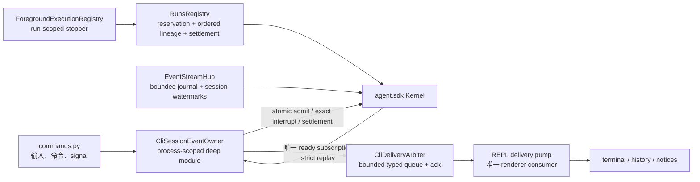
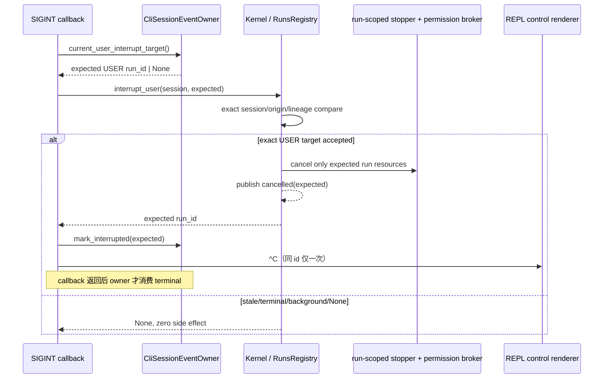
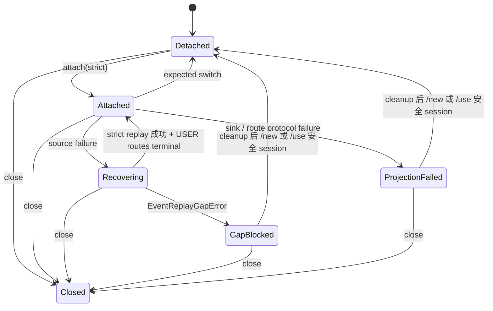
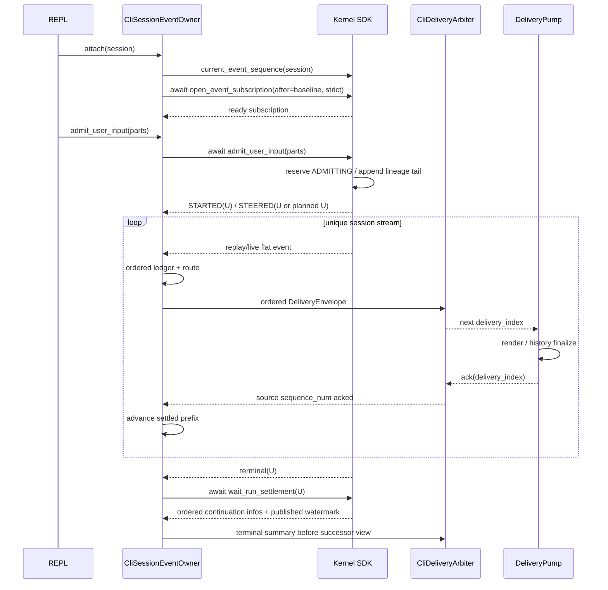

# refactor-477: 建立 CLI 单一会话事件流所有者 — 技术方案

> 对齐：motivation.md v4
>
> Unit branch: `unit/refactor-477` (will be created by orchestrator)

## Changelog

- v5（2026-07-25）：补全 admission `ADMITTING` reservation/失败回滚与晚到 settlement 查询；
  把混合 origin continuation 建模为有序 lineage；Ctrl-C 改走 expected USER id 精确中断；renderer
  failure 改为复用旧订阅的 truthful fail-stop，并补真实后台/前台交错 Runbook。

## 现状分析

### 生产调用链与改动落点

- `src/coding_cli/main.py` → `commands.run_cli()` → `_run_repl()` 是真实产品入口；本 unit 的
  owner 和 admission seam 落在生产路径，不另造测试专用 runtime。
- `_run_repl()` 当前在 `/new`、`/use`、首次懒创建后启动 `_ensure_stream_for_session()`；
  初始 `--resume` 只设置 `active_session_id`，没有启动持久 subscriber。
- 普通消息由 `_run_repl()` 创建 `_send_message_async()` task；后者再次调用
  `kernel.stream(session_id)` 并自己积累、渲染到 terminal。因此同 session 同时存在持久 drain 和
  per-send drain 两个 subscriber。
- Ctrl-C 的全局 signal handler 当前只调用 `kernel.interrupt(session_id)`；per-send 路径另有本地
  `_interrupted` flag。`Kernel.interrupt()` 返回被中断的 `run_id`，且在返回前同步发布
  `status=cancelled`；公开 event 不区分 user interrupt 与普通 cancel。
- `_active_run` task 当前同时承担“REPL 正在等哪个结果”和“下一条输入 steer 到谁”两种职责。Kernel
  在异常终态后可为 stranded USER steer 自动创建 continuation；该新 `run_id` 不经过
  `_active_run`，所以现有输入 admission 看不见它。
- Registry 的 `_target_completed()` 先从 active map 移除 run，再创建异步 `_finish()` task；terminal
  status 与 carrier cleanup 可先于 `_settle_terminal_pending()` 可见，后者仍可能 hold 消息或创建
  USER continuation。因此 terminal event、`get_run().status` 和“CLI 暂时没看到 active route”都不是
  settlement barrier。
- Registry 当前从 `_lock` 外调用 executor；executor 持自己的 `_guard` 同步回调
  `_RegistryCompletionSink.bind_target()`，回调再获取 Registry `_lock`。所以新 USER 创建不能持
  Registry `_lock` 穿过 executor admission；若释放锁前又没有 `ADMITTING` reservation，并发 caller
  会同时观察到 IDLE。
- `_settle_terminal_pending()` 按 pending 的**连续 origin batch**逐个 submit。合法的
  `USER → BACKGROUND_TASK → USER` stranded 序列会产生两个 USER successor 和一个 background
  successor；单个 `run_id` slot 无法同时表达 FIFO 与唯一 steer target。
- `_target_started()` 在 run 真正取得 session turn gate 前就更新 `_active_run_by_session`；同 session
  后排的 background/queued run 可覆盖正在生成的 USER run。因此 session active-map 可服务旧
  `interrupt(session_id)` 兼容行为，却不能作为 CLI Ctrl-C 的精确 USER identity。
- `src/coding_cli/events/background_runs.py` 遇到 user-origin `run_status` 会直接返回，但该 run
  更早到达的无 origin event 已可能留在 `pending_events`。
- `src/coding_cli/events/event_pipeline.py` 只有 view builder 进入生产；normalizer 仍按旧嵌套
  `data` shape 读取，而 SDK 现在产出 flat dict。其 dedupe/phase helper 主要由结构测试引用，不是
  stream owner。

### SDK replay 的真实边界

- `Kernel.stream()` 委托 `EventStreamHub.stream_session()`；每个 subscriber 有独立 queue，Hub
  对匹配 subscriber fan-out，而不是把事件交给单一竞争消费者。
- `Kernel.stream()` 返回 lazy async iterator；Hub 直到第一次迭代才完成 gap 检查、history snapshot
  与 subscriber registration。仅构造 iterator 不能证明 cleanup 期间的 terminal/continuation 已被接住。
- Hub 生产默认只保留全局最近 2000 个 event。当前
  `stream(after_sequence=C)` 只筛选仍在 history 中、`sequence_num` 大于 C 的该 session 事件；若该
  session 在 C 之后已有事件被淘汰，调用方不会收到 gap 信号。
- 公开 flat event 的字段名是 `sequence_num`。它在 Hub 内全局单调，因此同 session 相邻事件的数字
  可以不连续；不能用
  `next == previous + 1` 判断丢失。
- Hub 的 iterator 在正常 EOF、异常和调用方 `aclose()` 三条路径都尚未承诺“先 unregister 再把终止
  交给消费者”；ready replacement 若不补这个生命周期契约，source recovery 仍可能短暂双订阅。
- `Kernel.current_event_sequence()` 已在代码中公开、多个 Gateway/heartbeat 调用方使用无参全局
  anchor，但 `docs/specs/kernel/sdk-boundary.md` 的稳定方法集没有列它，属于 canonical drift。
- Hub 已有锁保护的 history snapshot + subscriber registration；可在同一临界区补充 per-session
  eviction watermark 检查，无需把 journal 持久化，也无需改变 event dict schema。

### 既有约束与可复用能力

- `coding_cli` 只许 import `agent.sdk`；owner、renderer adapter、route 和 delivery state 都留在
  CLI 产品层。只有 Registry 独占的 USER admission/settlement 事实，以及 Hub 独占的 ready replay
  能力，经产品中立的 SDK seam 暴露。
- 同 session 可交错 USER、background、heartbeat 与 session-level event；只有明确的 USER
  queued/running route 可成为 CLI 输入 steer 目标，background run 永远不是 fallback target。
- `kernel.try_steer(expected_run_id=...)` 已提供“只注入指定 run、失败零副作用”的原子 seam，但它把
  fallback 决策留给调用者，无法与 terminal settlement/continuation 原子互斥；本 unit 以新的
  `admit_user_input()` 收口 CLI 的 steer-or-create 决策，既有接口保持兼容。
- `kernel.cancel(run_id)` 可强制终止已知 live run；source failure cleanup 用 cancel，不冒充用户
  Ctrl-C。既有 `kernel.interrupt(session_id)` 的 session-current 选择语义要为 Gateway/外部消费者
  保持；CLI 另用 expected-id 精确 seam。
- `PermissionBroker.cancel_all_pending(run_id=<id>)` 已能按 run 精确解除权限等待；无需为精确中断
  cancel 同 session 的所有权限。相反，`ForegroundExecutionRegistry` 仍只按 session 注册 stopper，
  本 unit 需把内部 stopper key 深化为 `(session_id, run_id)`，否则 queued USER Ctrl-C 仍可能误杀
  正在执行的 background foreground tool。
- 现有 TTY/non-TTY tool lines、thinking indicator、view builder、history append 与
  `_finalize_run_payload()` 的输出风格继续复用。
- `BackgroundRunEventProcessor` 保留 non-user origin header、pending 与格式化的深逻辑，但只接收
  owner 已确认的 background route。

### 相关历史与契约 grounding

- feat-338 的持久 stream 意图是一个 background owner；当前 per-send subscriber 偏离了该边界。
- bugfix-417 固定 Ctrl-C → `kernel.interrupt()`、排空 terminal、REPL 继续的语义。
- bugfix-426 固定运行中输入使用 expected run identity 做 steer，以及异常终态可能产生 USER
  continuation 的语义。
- `docs/specs/cli/spec.md` 与真实代码一致地要求：运行中输入进入当前 run，空闲输入才开新 run；
  普通轮次错误内联显示且 REPL 继续。但 replay gap/source failure 后阻断该 session 普通输入是新增
  稳定行为，必须有 CLI delta 明确它与普通轮次错误的条件边界。
- kernel canonical 对 `stream()` flat event、`try_steer()`、interrupt/cancel 的大部分描述与代码
  一致；`current_event_sequence()` 未进入稳定方法集，strict bounded replay 也尚无契约。此外
  `docs/specs/kernel/runs.md` 的头两个 Requirement 仍写 SDK 返回内部 `Session` / `RunRecord`，与
  真实 `SessionInfo` / `RunInfo` 和 SDK boundary canonical 漂移，本 unit 同区修正。
- canonical `interrupt(session_id)` 只承诺 session-current 行为；CLI 若新增 expected USER id seam，
  必须以新增方法进入 SDK/runs delta，不能暗改旧方法让 Gateway 语义漂移。

## 与 Claude Code 的源码对照

CC 的 `src/screens/REPL.tsx` 对一次 conversation 维护一条
`for await (event of query(...))` 主消费链；`src/QueryEngine.ts` 为每次 submit 返回一条
generator。`src/utils/sdkEventQueue.ts` 是 non-interactive side-event queue，不是对同一
conversation stream 的第二订阅。

CC 的 REPL 文件同样很大，因此本 unit 不复制 CC 的文件拆法。迁移原则只有两个：conversation event
进入 UI 的权威入口唯一；旁路通知从该入口做 typed projection，不再次订阅同一 source。

## 架构总览



Before：REPL persistent drain、per-send drain 与 `_active_run` 分别持有 stream、route、terminal 和
input admission 的碎片知识。
After：`CliSessionEventOwner` 同时拥有唯一 subscription、USER route、ordered commit ledger 与
delivery sequencing；Registry 原子拥有 USER reservation、有序 successor lineage 和 run settlement；
所有 session event projection 只经一个有界 delivery arbiter，由独立 REPL pump 顺序渲染并 ack。

该 module 通过删除测试：删掉它以后，subscription、replay gap、USER route、steer identity、
control waiter、backpressure 与 failure cleanup 会重新散回 `commands.py`、sender 和 background
processor；它不是为缩短文件增加的 pass-through。其外部 interface 只保留 session attach、输入
admission、中断标记、USER idle gate、delivery lifecycle 和 close，复杂度留在实现内部。

## 关键决策

### 决策 1：REPL process 只建立一个 `CliSessionEventOwner`

**选择 process-scoped owner；任一时刻至多一个 active-session stream task。**

- `attach(session_id)` 必须先停止并 await 旧 subscription，再切换 active session；`detach()` 只停
  live subscription，保留该 session 的 cursor、uncommitted ledger、run route 和 queued delivery；
  `close()` 才终结整个 owner。
- 初始 `--resume` 在读取第一行输入前 attach；`/new`、`/use` 和懒创建都走同一个 attach seam。
- slash command 不再只等 `commands.py::_active_run`；正常 attached 状态下，执行 session-control
  command 前调用 `owner.wait_user_idle()`，因此 tracked 与 adopted USER run 都会先
  terminal/finalize。`GAP_BLOCKED/PROJECTION_FAILED` 时只放行 `/new`、`/use <其他安全
  session>`、`/exit` 作为逃生路径；旧 session 在本 owner 生命周期内保持 blocked，不在其中接受普通
  输入，也不允许同进程重新 attach 它。
- `_send_message_async()` 不再调用 `kernel.stream()`；普通消息也不再由 `commands.py` 直接
  `submit/try_steer`。所有 plain-input admission 走 owner（决策 4）。
- 拒绝保留第二 subscriber 再用 fingerprint 去重；那会留下两个 terminal authority。
- active reader、subscription registration 与 generation 是一个不可拆的 ownership token。正常
  switch 必须 `aclose()` 并 await reader 退出后再 open 新 session；source error/EOF 必须已由
  subscription 自行 unregister、reader task 完成后才 open replacement；renderer failure 则复用
  **同一个**健康 reader 进入 control-only quarantine，绝不另开第二 subscription。

### 决策 2：SDK 提供 ready strict subscription，不把 lazy iterator 冒充已订阅

**选择“窗口内 exact replay，窗口外 typed gap，返回即 ready”，不把 2000 条内存 history 冒充无限
日志，也不改变既有 `stream()` 的 lazy/best-effort 行为。**

SDK interface 精确为：

| Interface | 契约 |
|---|---|
| `current_event_sequence(session_id: str \| None = None) -> int` | 无参保持既有“全 Hub 最新 `sequence_num`”；传 session 时返回该 session 最新已发布 `sequence_num`（即使已淘汰），无事件返回 0。 |
| `stream(session_id, *, after_sequence=0)` | 现有 lazy/best-effort async iterator 原样保留；不偷偷改变所有既有消费者的建立时机与异常控制流。 |
| `await open_event_subscription(session_id, *, after_sequence=0, require_replay=True) -> SessionEventSubscription` | 在返回前完成 gap 检查、subscriber registration 和 replay snapshot；返回对象是 SDK-owned async iterator，带幂等异步 `aclose()`。CLI owner 只用此接口。 |
| `EventReplayGapError` | SDK-owned；fields 固定为 `session_id`、`requested_after_sequence`、`evicted_through_sequence`、`latest_sequence`。 |

Hub 在既有 bounded history 之外只维护两个小 watermark：

- `last_sequence_by_session[session]`：该 session 最新发布 `sequence_num`；
- `evicted_through_by_session[session]`：该 session 已从 journal 淘汰的最大 `sequence_num`。

`open_event_subscription()` 在**同一把 Hub lock**内依次：

1. 判断 `requested_after_sequence < evicted_through_by_session[session]`；
2. strict gap 时不注册 subscriber，由 SDK 抛 `EventReplayGapError`；
3. 无 gap 时注册 subscriber，并截取 `sequence_num > after_sequence` 的 replay snapshot；
4. 构造持有 snapshot、live queue 和 unregister closure 的 `SessionEventSubscription` 后才返回。

因此调用方拿到对象即代表 subscriber 已 ready，不需要先 `__anext__()`；snapshot 与 live queue 之间
没有注册窗口。跨 session 的全局数字空洞不参与 gap 判断。`require_replay=False` 只用于 future-only
quarantine/recovery：仍先注册再返回，但允许从当前 anchor 开始而不宣称旧区间完整。

`SessionEventSubscription` 还承担 registration 的唯一释放权：显式 `await aclose()` 返回前必须
unregister；iterator 正常 EOF 或 source error 必须在把 EOF/error 交给 owner **之前**在自己的
`finally` 中 unregister。三条路径经同一个幂等 closure，且 owner 可 await reader task 证明旧
generation 已退出。这个 postcondition 是“任一时刻至多一个 ready subscriber”在 recovery 路径的
必要条件，不靠 task cancellation 的时机猜测。

首次 attach 某 session 时，owner 读取 `kernel.current_event_sequence(session_id)` 作为 baseline，再
await ready open；它有意跳过 CLI 启动前的旧历史。baseline 与 open 之间若已有该 session event 被
淘汰，strict open 明确 gap。再次 attach 则从 owner 的 committed cursor strict-open。

拒绝把 journal 改为 durable storage：本 unit 的消费者需求是同进程 REPL 切换/恢复；持久化完整
event log 会把 CLI ownership 重构扩大成 persistence 项目。拒绝改 event dict schema：raw key 保持
`sequence_num`，gap 是一次 subscription 建立失败，不是假业务 event。

### 决策 3：per-session ordered commit ledger 取代“读到就推进”的 scalar cursor

**cursor 只指向 owner 已按 session 顺序完成归属、并由唯一 renderer 可见消费且 ack 的最后一个
`sequence_num`。**

每个访问过的 session 保存：

- `committed_sequence_num`；
- 按收到顺序排列的 bounded `uncommitted` ledger；
- `route_by_run` 与 USER control waiter；
- 当前 subscription generation。

ready subscription 已按该 session 的发布顺序产出 event，但全局 `sequence_num` 可跳号，因此
“连续”定义为
**该 session 收到顺序的 settled prefix**，不是数值 `+1`：

1. normalize 后先把 event 放入 `uncommitted`；
2. owner 为已知 route 构造决策 5 的一个或多个 `DeliveryEnvelope`；只有这些 envelope 全部被 delivery
   pump 成功渲染并 ack 后，该 source event 才标记 settled；
   纯 route/status metadata 若不产生任何可见 payload，则在内部状态更新完成后直接 settled；
3. 未知 run/origin 的 event 保留原 `sequence_num`，不 settled；后续带 origin 的 `run_status` 可先建立
   route metadata，再按 ledger 原顺序释放；
4. 只从 ledger 头部连续弹出 settled event，并把 `committed_sequence_num` 更新为最后弹出的
   `sequence_num`；
   后继 event 不得越过前面的 unresolved event；
5. replay 中 `sequence_num <= committed_sequence_num` 或已在 `uncommitted` 的重复 event 不再次投影。

`uncommitted` 固定最多 256 个 event / 32 个未知 run。正常 detach/failure 保留它，并和 replay
按 `sequence_num` 合并；route 到达后仍按原顺序释放。buffer 超界，或 event shape 已能证明不可能形成合法
route 时，不能把未知 event 偷塞 background：逐 run 产生含原
`sequence_num/run_id/event_name` 的 `UnroutableEventNotice`；该 notice 对应 envelope 被 renderer ack
后 event 才可 settled。若 strict replay 已报告 gap，则缺失区间使 unresolved ledger 不再可证明，
保持 cursor 不变并进入 `GAP_BLOCKED`，不借 diagnostic 越过缺口。若 delivery backpressure 仍未解除，
cursor 同样不前进，交给决策 5/7 的失败路径，不静默丢弃。

### 决策 4：Registry 用 reservation + 有序 lineage 原子拥有 USER admission 与 run settlement

**创建期先占 `ADMITTING` reservation；混合 origin successor 进入一条 FIFO lineage，新增 USER 输入
只能进入 lineage 的唯一 tail USER admission target。**

CLI owner 仍拥有显示 route；“输入加入既有 USER flow 还是开新 flow”、successor FIFO、创建失败回滚与
terminal settlement 都由 RunsRegistry 拥有。Registry 为每个 session 维护下面的私有状态，而不再把
`_active_run_by_session` 当 admission 事实：

| 状态 | 持有事实 | admission 行为 / 退出条件 |
|---|---|---|
| `IDLE` | 无 live USER lineage | 第一个 caller 在 Registry lock 内写入唯一 `ADMITTING(token, future)` 后释放锁；只有 reservation owner 可走 executor 创建。 |
| `ADMITTING` | 尚未 bind 的 token；没有可 steer controller | 其他 caller **只 await reservation future 后重试**，不能向未 bind target 返回 `STEERED`。bind 成功后原子转 `ACTIVE`；失败按下述 rollback 回 `IDLE`。 |
| `ACTIVE` | 一个 ordered lineage、`execution_head` 与唯一 `admission_head` | 输入只注入/追加到 `admission_head`；background node 永不成为 target。当前 node terminal 后转 `SETTLING`。 |
| `SETTLING` | 当前 run + settlement future；successor plan 尚未封口 | admission 释放 lock 等 future，再重新判断；carrier cleanup、pending 分批、lineage 更新与 queued publication 全完成才退出。 |
| `CONFLICT` | 兼容 `submit()` 造成两个无 predecessor 关系的 live USER lineage | `admit_user_input()` 抛 SDK-owned `UserAdmissionConflictError`，零注入、零 fallback；不以“最后一个 run”猜测。 |

#### 创建期 reservation 与锁序

`IDLE → ADMITTING` 是 steer-or-create 的线性化点，不是 executor bind：

1. reservation owner 在 Registry lock 内只登记 token、自己的 parts/held-input commit intent 与 future，
   随即释放 lock；
2. 它在**不持 Registry lock**时调用 executor。executor 仍可持 `_guard` 回调
   `bind_target(token)`；callback 获取 Registry lock，校验当前 reservation token 后登记 run/controller/
   target token，并把状态转为 `ACTIVE`；
3. bind + executor admission 完整成功后才 resolve reservation success 并向 owner 返回
   `STARTED`。等待者醒来后重试，看到 `ACTIVE` 才能 `STEERED`；
4. 创建/bind 任一步失败时，Registry 先确保已分配的 record/controller/token 不会留下 live orphan，
   恢复尚未 commit 的 held input，再把同一 token 原子 rollback 为 `IDLE` 并 resolve failure。reservation
   owner 收到原异常；其他 caller 各自仍持有自己的 parts，醒来重试，没人收到“已 steer”假成功。

锁序固定为：**任何 Registry `_lock` 临界区都不得调用 executor 或等待 future**；允许的跨组件方向只有
executor `_guard` → 短暂 Registry bind callback。Registry 调 executor、event publish 与 future
resolve 都在释放 `_lock` 后进行。若 executor 在 bind 成功后仍报告 admission failure，先精确 cancel +
完成该 run settlement，再释放 reservation，不把半绑定 run 当 `STARTED`。

#### 混合 origin successor 的 ordered lineage

一个 lineage 是按原始到达顺序排列的 node 队列；node 固定携带 `run_id`、`origin`、parts、公开
`QUEUED/RUNNING/terminal` 状态，以及私有 `PLANNED/BOUND/SETTLED` 执行态。

- terminal drain 仍把 pending 按连续 origin batch 分组，但所有 batch 按 FIFO **追加到既有 lineage
  尾部**；合法 `USER1 → BACKGROUND → USER2` 会形成 `U1 → B1 → U2`，不覆盖任何 USER id。
- 新 node 在 settlement 完成前先拥有稳定 run id/`RunInfo` 并发布 queued `run_status`；lineage 内只有
  最早未终态的 `execution_head` 可 bind executor。后继 node 保持私有 `PLANNED`，前驱 settlement 后才
  依次 bind，因此 `_target_started()` 的抢跑不会让同一 lineage 并行执行。
- 公开为 QUEUED 的 `PLANNED` node 必须继续满足既有 `cancel(run_id)`：cancel 在 bind 前把它原子置为
  cancelled、发布 terminal、完成 retained settlement，scheduler 随后跳过它；不能因“尚无 executor
  token”把 queued cancel 当 no-op。
- `admission_head` 必须是 lineage **尾部的 USER node**。若尾部正是唯一 active USER 且后面没有已排队
  node，输入可注入其 controller；若已有后继，则输入追加到尾部尚未 bind 的 USER node，或在
  background 尾后新建一个 planned USER node。由此新输入永远排在既有 `U1/B1/U2` 之后，不会为“steer
  当前 run”反向越过更早的 background/USER pending。
- admission 追加到既有 lineage 一律返回 `STEERED`，即使 target 是尚未 bind 的 planned USER node；
  `UserInputAdmission.action` 是该新接口的权威，不能拿旧 `RunInfo.injected` 猜 node 是否已有
  controller。只有 `IDLE → ADMITTING` 成功才返回 `STARTED`。
- unrelated background run 不创建/占用 USER lineage；它可以按既有 session turn gate 与 USER
  execution 串行，但永远不成为 admission target。由某 USER settlement 产生的 background node 是
  lineage 的 FIFO 成员，却仍不接收 USER parts。
- 当前 node 在执行期间新产生的 stranded pending 发生在既有 planned tail 之后，settlement 必须把它们
  追加到整个 lineage 尾部，而不是插到当前 node 后面；这是跨 settlement 保住 FIFO 的关键。

因此一个 session 可以合法同时有多个 predecessor→successor USER route，但始终只有一个尾部
`admission_head`。只有 legacy `submit()` 造出的无 lineage 关系 live USER run 才是 protocol conflict。

#### SDK admission 与可晚到查询的通用 settlement

| Interface | 线性化保证 |
|---|---|
| `await Kernel.admit_user_input(session_id, parts, workspace_root, model) -> UserInputAdmission` | `IDLE` 走 reservation 后返回 `STARTED`；`ACTIVE` 只追加到唯一 tail USER target 并返回 `STEERED`；`ADMITTING/SETTLING` 不持锁等待后重试；background 永不接收输入。 |
| `await Kernel.wait_run_settlement(run_id) -> RunSettlement` | 对任意 origin 的已知 run 可调用；返回前保证 carrier cleanup ack、terminal status publication、pending hold/continuation plan、所有新 continuation queued publication 均完成。 |

`RunSettlement` 固定含 `session_id`、`run_id`、按 FIFO 排列的
`continuations: tuple[RunContinuationInfo, ...]`、`held_for_next_input` 与
`published_through_sequence_num`；每个 `RunContinuationInfo` 含 SDK-owned `RunInfo` 与 `RunOrigin`。
`published_through_sequence_num` 至少覆盖该 run terminal 与本次 settlement 新发布的最后一个
continuation status。

settlement future 在 run record 注册/规划时即创建；完成后 immutable result 与该 `RunInfo` 保持相同
可查询生命周期，直到 run record 被显式清除或 Kernel close。因此 owner 在 terminal event 之后晚到
调用会立即得到相同结果，不会因 future 已 resolve 而“查不到 barrier”。已知 nonterminal run 会等待；
未知/已清除 id 抛 SDK-owned `RunSettlementNotFoundError`。接口对 non-USER run 同样有效，source
cleanup 才能沿 `U1 → B1 → U2` 精确 cancel + await，而不是把 background 中间节点当已清理。

`submit()` / `try_steer()` / `interrupt(session_id)` 保持兼容；只有 CLI plain input 使用新 admission。
确定性 contract tests 必须覆盖：

- 两个 caller 同时从 IDLE 进入，第二个在 bind 前只能等待；首次 bind 失败时 reservation rollback、两条
  parts 都不丢且没有 false `STEERED`；
- terminal status 已发布但 settlement 尚未执行，以及 settlement 已完成后才首次 wait，两者返回同一
  retained result；
- `USER1 → BACKGROUND → USER2` 形成三 node FIFO，U1 执行期与 B1 执行期再次 admission 都只追加到
  lineage 尾部 USER target，不并行 fallback、不注入 B1；
- 多个 caller 从 settlement 同时醒来，至多一个建立新 lineage，其余只 steer 该 lineage。

CLI owner 的显示 route 封闭为 `TRACKED_USER`、`ADOPTED_USER`、`USER_TERMINAL`、
`USER_IDLE` 与 `RECOVERING/BLOCKED`。多个有 predecessor→continuation 关系的 USER route 按 lineage
顺序共存；无关系的两个 USER route触发 `CliRouteProtocolError`。route 只决定事件归属/显示，不再作为
admission 事实源。

`owner.admit_user_input(...)` 先检查 attached/recovery gate，再 await Kernel seam；等待期间决策 5 的
delivery pump 继续运行。返回后按同一 `run_id` 合并先到的 ADOPTED route。tracked/adopted 共用
`UserRunProjectionState`，不直接渲染；terminal event 到达后 await
`wait_run_settlement(run_id)`，按 settlement 的 FIFO continuation info 建 route，并把 terminal summary
排在 successor view 前。summary 至少含 `session_id`、`run_id`、`status`、`assistant_content`、
`usage`、`stop_reason`、`interrupted`、typed `error | None` 与 `final_view`。

### 决策 5：所有 session event projection 只经一个有界、按序、带 ack 的 delivery arbiter

**取消 Immediate sink、NoticeQueue 和 terminal future 三条可见路径；owner 是唯一 producer，专用
REPL delivery pump 是唯一 renderer consumer。**

这里的“唯一”覆盖由 session event 派生的 view/notice/terminal/history；prompt、slash command 回执与
signal callback 的即时 `^C` 是 REPL control-plane 输出，不冒充 event projection。它们只在同一个
REPL event-loop 线程执行同步 block write（不会在一次 envelope 的同步 render 中途抢占），不能消费 raw
event 或建立第二个 event sink。

`CliDeliveryArbiter` 的 queue 固定 maxsize 256，元素为：

```text
DeliveryEnvelope(
  delivery_index,                 # owner 内部严格递增，只用于全序与 ack
  source_sequence_num | None,     # 对应 raw SDK event；合成项可为空
  source_subindex,                # 同一 source event 的稳定子序
  payload                         # closed typed union
)
```

payload 封闭为 `UserRunView`、`UserRunTerminalSummary`、`BackgroundLivenessNotice`、
`BackgroundCompletionNotice`、`SessionNotice`、`UnroutableEventNotice` 与
`StreamFailureNotice`。raw SDK dict 不出 owner。tracked/adopted 只影响 route 建立方式，不产生两种
terminal renderer。`UserRunTerminalSummary` 是 history append、最终响应、usage/error 的唯一触发器；
控制 waiter 只有在该 summary 成功渲染并 ack 后才完成，不携带另一份可见内容。
terminal history finalize 使用稳定 effect key `(session_id, run_id, "terminal-history")`，同一 owner
正常路径只执行一次；这个 key 用来拦截代码误入双 finalize，不把 stdout/history 包装成虚构事务。

顺序与 cursor 规则：

1. owner 按 session source 顺序为 event 构造 envelope；同一 event 多个 payload 按
   `source_subindex` 固定次序；
2. terminal settlement 生成的 summary 使用前驱 terminal event 的 `source_sequence_num`，并在任何
   successor continuation view 前入队；
3. delivery pump 严格按 `delivery_index` 调用现有 TTY/non-TTY renderer/history helper，成功后
   `ack(delivery_index)`；
4. 一个 source event 的全部 envelope ack 后，ordered ledger 才 settled；仅入队不推进
   `committed_sequence_num`；
5. renderer exception 不 ack，owner 进入决策 7 的 `PROJECTION_FAILED`，cursor 停在坏 envelope
   对应 event 之前；该 envelope 不在本 owner 内 retry/replay。

专用 delivery pump 是 REPL process-lifetime task，与 prompt/input/slash command task 分离；它从
attach 前启动，直到 owner `close()` 后 drain/stop。`owner.admit_user_input()`、
`wait_user_idle()`、session switch 只等待控制 future，绝不亲自消费 queue，所以 admission 等
settlement/ledger 时 pump 仍持续释放容量。若 input-ready 与 delivery-ready 同时发生，pump 不受 input
调度分支影响；terminal renderer 由该单 consumer 自然串行，不需要两个 coroutine 抢 stdout。

背压规则：

- `BackgroundLivenessNotice` 可在**分配 delivery_index 之前**按
  `(session_id, run_id, kind)` 合并为最新状态；一旦入队就不可越序替换；
- terminal、completion、session、unroutable、failure 均不合并、不丢弃；满队列时 owner
  `await put()`，source event 保持 uncommitted；
- 若这导致 Hub subscriber overflow，按 source failure 从 committed cursor strict-reopen；journal
  窗口内可重放未 ack event，gap 则明确阻断。不存在 `put_nowait(...); pass`。
- source replay 命中已存在的 uncommitted event/envelope 时只与原 ledger 合并，不再分配
  `delivery_index`；因此 source replacement 不会复制一个仍由健康 renderer 处理的 envelope。

同一 stream generation 的 failure 使用
`(session_id, generation, cause_kind)` coalesce key。若当前 USER flow 尚有 terminal summary，则
cause 只进入该 summary 的 typed error；否则只生成一个 `StreamFailureNotice`，两者不双显。
`UnroutableEventNotice` 始终只有这一条 arbiter 出口。

确定性测试必须覆盖：

- background/session notice(`sequence_num=N`) 先于 USER view(`N+1`) 可见且 ack；
- 前驱 terminal summary 先于 adopted continuation 的首个 view；
- queue 满与 input-ready 同时发生时 pump 持续 ack，admission 最终有进展且不反序。
- terminal history finalize 误入两次仍由 effect key 拒绝第二次；renderer 在 stdout 第 k 次 write
  后抛错时进入 fail-stop，不重试第 1..k 次，也不把该 envelope 标成完整。

### 决策 6：Ctrl-C 携带 owner 的 expected USER id 做精确中断

**新增 `interrupt_user(session_id, expected_run_id)`；CLI 不再让 session active-map 替它选择目标，
既有 `interrupt(session_id)` 保持原语义给其他消费者。**

signal handler 的同步调用链固定为：

1. `expected = owner.current_user_interrupt_target()`：取当前 CLI-owned lineage 中最早仍未 terminal、且
   control waiter 尚未完成的 USER node；只有 background route 时返回 `None`；
2. `accepted = kernel.interrupt_user(session_id, expected_run_id=expected)`：Registry 在同一 lock 内校验
   id 存在、属于该 session、origin=USER、属于当前 lineage 且未 terminal。任一不成立返回 `None` 且零
   副作用；**不读取 `_active_run_by_session`**；
3. `accepted` 存在时，在同一 callback、任何 await/task handoff 前调用
   `owner.mark_interrupted(accepted)`，随后清 thinking indicator 并输出一次 `^C 已中断当前操作。`。

`interrupt_user()` 保留既有 user-interrupt 的同步语义：返回前把 exact run 标成 cancelled、同步发布其
terminal status、请求 exact carrier cancel。区别是所有附带清理也按 run identity 缩窄：

- `PermissionBroker.cancel_all_pending(run_id=expected)` 只解除该 run 的权限请求；不再 `run_id=None`
  扫掉 background/其他 run；
- `ForegroundExecutionRegistry` 的私有 key 从 session 深化为 `(session_id, run_id)`；内部
  `ToolContext` 把当前 hook metadata 的 run id 带到 foreground bash/agent 注册，stopper port 改为
  `stop_for_run(session_id, run_id)`；为既有 `interrupt(session_id)` / `cancel` 保留
  `stop_for_session(session_id)` 聚合兼容入口。只有 expected run 的 subprocess tree 会被精确 reap；
  queued USER Ctrl-C 不会误杀此刻占 session turn gate 的 background foreground tool；
- expected 本身若仍是 planned node，其 parts；expected controller 中尚未消费的 USER pending；以及
  lineage 中 expected 之后尚未 bind 的 USER node parts，均按 FIFO 移到 session held-input。这些
  planned USER record 进入 cancelled settlement，下一次真 USER admission 才 prepend，保持 canonical
  `/stop`“不丢、不自动续跑”；
- 同一 pending/lineage 中的 non-USER batch 保留 origin 并继续自己的 ordered chain；unrelated
  background run 完全不动。Ctrl-C 不以“收口 USER”为名取消后台工作。

现有 `Kernel.interrupt(session_id)` 与其 Gateway/外部消费者可见的 session-current 选择、返回形态均不
改变。新增 exact 方法是 opt-in；`cancel(run_id)` 仍是非 benign 的按 id 强制取消。全局 signal handler
与 in-loop `KeyboardInterrupt` fallback 复用同一个 helper，删除 per-send `_interrupted` 事实源。

- `expected/accepted is None`：不 mark、不输出 active-run 中断提示；idle Ctrl-C 保持既有退出语义；
- 同 id 重复 SIGINT：第一次已同步 terminal，第二次 exact validation 返回 `None`；提示与 benign
  outcome 各一次；
- owner 尚未消费本次同步 cancelled event 时仍接受 mark；不能以 `get_run().status` 已 terminal
  拒绝刚返回的 accepted id；
- 只有 accepted id 的 summary 得到 `interrupted=True`；planned USER 的附带取消、普通 cancel 与
  source-failure cleanup 均不伪装 benign Ctrl-C。



确定性测试必须制造“background run 最后写 active-map、USER run 仍是 owner target”和“USER queued
在 background foreground tool 后”的交错：Ctrl-C 只取消 expected USER，background permission、
subprocess 与 completion notice 均继续；旧 `interrupt(session_id)` contract tests 原样通过。

### 决策 7：source failure 可 strict-recover；projection failure 必须 truthful fail-stop

**source 的旧 registration 已终止，才允许开 replacement；renderer 仍健康 source 时绝不开第二
subscription。TTY/history 不可事务化，所以 projection failure 不自动 replay。**

#### Source failure：串行替换 subscription 后收口 lineage

主动 session switch/close 造成的 subscription cancel 是 expected detach，不产生
`StreamFailureNotice`。source exception、非预期 iterator EOF 与 subscriber overflow 进入：

1. owner 状态切为 `RECOVERING`，关闭 plain-input admission，保留 route、control waiter、
   `committed_sequence_num`、uncommitted ledger 与尚未 ack 的原 envelope；
2. 旧 `SessionEventSubscription` 按决策 2 在 error/EOF 暴露前已 unregister；owner 再 await reader
   task 完整退出。只有两个条件都成立才调用
   `open_event_subscription(after_sequence=committed_sequence_num, require_replay=True)`；
3. replacement open 返回 ready 后才启动新 reader。replay 命中 ledger 中已有
   `sequence_num/source_subindex` 时复用原 envelope，不重做 renderer side effect；
4. 对每个已知 TRACKED/ADOPTED lineage node 调 `kernel.cancel(run_id)`，随后
   `await kernel.wait_run_settlement(run_id)`。按 `RunSettlement.continuations` 的 FIFO（含 USER 和
   background 中间 node）继续 cancel + wait，直到所有分支明确返回空；cancel 返回的 terminal
   `RunInfo` 或 route 集暂时为空都不能替代 barrier；
5. 等 ordered ledger ack 到每个 settlement 的 `published_through_sequence_num`。当前 USER flow 的
   `CliStreamUnavailable` 只进入唯一 terminal summary；没有 USER summary 才入一个
   `StreamFailureNotice`；
6. replacement 仍健康、lineage 全 settlement 且错误 envelope 已 ack 后，owner 才回 `ATTACHED`。

若 strict-open 抛 `EventReplayGapError`，此时旧 subscription 已不存在；owner 读取当前 anchor，再
`open_event_subscription(after_sequence=anchor, require_replay=False)` 建一个 future-only quarantine，
ready 后才执行 cancel + settlement traversal。cleanup 完成后关闭该 quarantine。gap 作为 visible fatal
`GAP_BLOCKED` 保留：barrier 能收口已知 lineage，却不能证明缺口中没有未知 route；该 session 在本
owner 生命周期不再接受 plain input，也不允许 reset anchor/同 session reattach。只允许 `/new`、
`/use <其他安全 session>`、`/exit`。错误仍经 terminal summary 或一个 `StreamFailureNotice` 二选一。

#### Projection failure：复用原 reader 做 control-only quarantine，不承诺 exactly-once 补写

renderer/history helper 抛错时 source subscription 仍健康，协议与 source recovery **不同**：

1. delivery pump 停在坏 envelope，不 ack；owner 原子进入永久 `PROJECTION_FAILED`，关闭该 session
   admission。坏 event 与之后 event 不再产生普通 projection；
2. **不调用 `open_event_subscription()`**。当前 reader/registration 原地切为 `CONTROL_ONLY`，只消费
   run status、origin、terminal 与 settlement 所需 control fact，不分配新 `DeliveryEnvelope`，也不
   推进 committed cursor；
3. owner cancel + await 已知 lineage，并沿每个 `RunSettlement.continuations`（所有 origin）收口。
   若 control-only source 随后也失败，它先自行 unregister；本分支不再开 replacement，后续只依赖
   Registry retained settlement result 完成 cleanup；
4. lineage 收口后 `await subscription.aclose()` 并 await reader 退出。failed session id 保存在
   owner 的 process-lifetime blocked set；`/use` 回到同一 id 直接拒绝，不从旧 cursor replay；
5. pump 捕获异常后可用一个**不消费 session event 的 best-effort stderr emergency writer**提示
   “projection incomplete; switch session or exit”。它若也失败只记录 diagnostic；不把这条 fallback
   计作 envelope ack 或“错误已 exactly-once 显示”。

stdout 的一次 write 可能写入部分字节后抛错，history append 也可能在调用方未知的点产生副作用；两者
无法靠内存 ack 组成事务。因此保证被明确收窄为：

- renderer 正常时，ordered ledger + effect key 保证每个 projection 至多一次且完整；
- source failure、renderer 健康时，uncommitted merge 不复制 envelope；
- renderer 失败时，用户可能已看到/记录一次**部分** projection；CLI 不 retry、不 replay、不宣称完整，
  以 session fail-stop 换取“不自动制造第二份未知副作用”。进程重启是新的 CLI baseline，不被描述为
  对坏 envelope 的恢复。

`CliRouteProtocolError` 同样进入 `PROJECTION_FAILED` 的 control-only/fail-stop 清理（通常没有 partial
stdout，但仍不猜 route）。process `close()` 先关闭 admission，按当前 branch 停 reader，再用 retained
settlement 收口 lineage；最后以 `OwnerClosed` 完成未 ack control waiter 并关闭 arbiter/pump。
expected close 不报 stream failure。



## 接口与数据流

### owner 对 `commands.py` 的最小 interface

| Interface | 调用方义务 / owner 保证 |
|---|---|
| `attach(session_id)` | `/resume`、`/new`、`/use`、懒创建唯一入口；切换前 await 旧 reader/registration，await ready strict subscription 后才完成；process blocked set 中的 session 拒绝重 attach。 |
| `admit_user_input(parts, workspace_root, model)` | 普通输入唯一入口；委托 Kernel reservation/lineage seam，返回 `STEERED(run_id)` 或 `STARTED(run_id)`，绝不误 steer background、越过 FIFO 或在 settlement 空窗 fallback。 |
| `current_user_interrupt_target()` | 同步返回当前 CLI-owned lineage 中最早待完成 USER id；只有 background/idle 时返回 None。 |
| `mark_interrupted(run_id)` | 只记录 `kernel.interrupt_user(...expected...)` 刚接受的 Ctrl-C identity，幂等；不自行中断。 |
| `wait_user_idle()` | slash command 前等待 tracked/adopted USER settlement、terminal envelope ack 与 history finalization。 |
| `start_delivery_pump(renderer)` | process-lifetime 唯一 consumer；输入/命令等待期间持续 render+ack。 |
| `close()` | 按 source/projection branch 终止唯一 ready subscription、用 retained settlement cleanup、关闭 arbiter/pump 与 control waiter；幂等。 |

`commands.py` 不再接触 raw stream event、不保存 run route/high-water、不向
`BackgroundRunEventProcessor` 直接投递，也不实现 source retry；所有 terminal/history 输出只由
delivery pump 触发。

### 普通 submit / adopted continuation 主流程



### strict catch-up 的精确成功条件

对 session A 的 committed cursor `C`：

1. owner await `open_event_subscription(A, after_sequence=C, require_replay=True)`；
2. SDK 在返回前原子判断 `C >= evicted_through_by_session[A]`、注册 subscriber、截取 snapshot；
3. 成立：返回 ready subscription，依次交付 journal 中 A 的 `sequence_num > C`，再交付 live；owner 以 ordered ledger 去掉
   reconnect duplicate；renderer 正常时每个 typed projection 至多一次；
4. 不成立：open 直接抛 `EventReplayGapError`，没有任何 replay/live 产出，owner 不改 committed
   cursor，进入决策 7。

这份保证是“有界 journal 内 exact + 窗口外 visible gap”，不是无界 exactly-once，也不把 renderer
partial failure 宣称为可重放事务。

## 契约层增量 (delta-spec)

- kernel:
  - `specs/kernel/sdk-boundary.md`：MODIFIED 稳定 Kernel 方法集与 SDK-owned 类型，纳入
    `current_event_sequence()`、`open_event_subscription()`、`admit_user_input()`、
    `wait_run_settlement()`、`interrupt_user()` 及 admission/continuation/settlement/replay
    边界类型与 typed errors；
  - `specs/kernel/runs.md`：MODIFIED `SessionInfo`/`RunInfo` 漂移；ADDED ready bounded replay、
    typed gap、`ADMITTING` reservation、有序 USER lineage 与 retained run-settlement barrier；
    MODIFIED interrupt/cancel requirement，新增 expected USER id 精确中断而保留旧
    `interrupt(session_id)`。
- cli:
  - `specs/cli/spec.md`：ADDED unsafe session event failure 契约，明确 source failure cleanup 后可恢复、
    replay gap 显式阻断、renderer partial failure fail-stop 与逃生命令；普通轮次错误仍遵循既有
    “内联后继续”；ADDED REPL Ctrl-C 只中断 exact USER flow、不回退 background。
- im: no spec delta。
- gateway: no spec delta；既有 Gateway `stream()` 调用不改变。

## 风险与回退

- **SDK surface 扩大**：`current_event_sequence()` 无参语义和既有 lazy `stream()` 必须原样保留；
  surface allowlist、SDK-owned admission/continuation/settlement/replay 类型与 errors、contract tests
  同步。回退必须连同 CLI owner 一起回退，不能只删 ready/gap/barrier 留下错误承诺。
- **Registry reservation 死锁/假成功**：Registry lock 不得跨 executor admission；`ADMITTING`
  waiter 不得先返回 steer；bind 后失败必须先 terminalize/settle 再 rollback。确定性测试用可控 bind
  barrier 与失败注入证明无双 create、无输入丢失。
- **lineage FIFO 漂移**：`USER/BACKGROUND/USER` 与当前 node 新 stranded 必须追加在既有 tail 后；
  execution head 单独 bind、admission head 固定为 tail USER。状态机与 contract test 同时守住，禁止退回
  `_active_run_by_session`“最后写入者”。
- **late settlement 内存**：immutable result 与 run record 同生命周期，增加每 run 小对象；不另设比
  RunInfo 更短的 TTL，否则 terminal consumer 会随机查不到。Kernel close/未来显式 run purge 同步清理。
- **ordered ledger 头阻塞**：unknown route 或 notice backpressure 会阻止 cursor 前进。上限、typed
  diagnostic、独立 delivery pump 和 strict replay 共同保证“阻塞或显式失败”，不通过跳过事件求活。
- **source failure cleanup 触发 continuation**：generic cancel 可能让 stranded steer 变成 USER
  continuation；ready recovery subscription 先建立、admission 先关闭，按通用 RunSettlement 返回的
  ordered continuation（包括 background 中间 node）继续 cancel+barrier，不以 route 集为空猜测。
- **gap 后无法证明 session 安全**：保持 `GAP_BLOCKED`，允许 `/new`/`/use`，不允许该 session
  plain input。回退不能改成 silent baseline reset。
- **精确 Ctrl-C 资源误杀**：expected USER id、run-scoped permission/foreground stopper 与 exact target
  token 必须一起切换；保留旧 `interrupt(session)` contract tests，并增加 background foreground tool
  不被 CLI Ctrl-C reaped 的 interleaving test。
- **终端输出不可事务化**：唯一 delivery_index、单 renderer 与 ack 只承诺健康 renderer 正常路径；
  sink exception 后原 reader control-only、session fail-stop且不 replay。接受一次 partial projection，
  拒绝声称 exactly-once；测试必须在 history 成功/stdout partial 后抛错并证明没有第二次 side effect。
- **subscription teardown 漂移**：source EOF/error/aclose 都必须先 unregister；source replacement 在
  reader task 完成后才能 open，projection failure 不 open。用 subscriber-count probe 覆盖每条异常线。
- **整体回退**：revert 单 M1，恢复旧订阅模型仅作为短期代码回滚；禁止同时保留新 owner 与 per-send
  subscriber，禁止用内容 fingerprint 长期补洞。

## Runbook for Reviewer

CLI 与 Kernel 均为进程内对象，本 unit 不改常驻服务。

| 服务 | 停止命令 | 启动命令 | 健康检查 |
|---|---|---|---|
| 无常驻服务 | N/A | N/A | N/A |

### 验收前置

- 真实上游：本机 LLM proxy `http://127.0.0.1:4000`，模型
  `kimiCoding:K2.6`，Anthropic Messages 接口。来源：
  `/Users/czj/Repos/LLM_PROXY`。
- 2026-07-25 设计取证时，下面 health 与最小 model request 均返回 HTTP 200；reviewer 必须在自己的
  验收时刻重跑，不能沿用这次结论。
- 若任一检查失败，真实 LLM 旅程阻断；现有 `anthropic_sse_ok_recording.py` 不具备 background、
  steer、Ctrl-C 或 continuation 行为，不能替代。除非本 unit 实际新增并在此处给出可运行路径，否则不
  宣称存在 fixture fallback。

```bash
curl --fail --silent --show-error http://127.0.0.1:4000/health

curl --fail --silent --show-error http://127.0.0.1:4000/v1/messages \
  -H 'Content-Type: application/json' \
  -d '{
    "model": "kimiCoding:K2.6",
    "max_tokens": 32,
    "messages": [{"role": "user", "content": "Reply with exactly: pong"}]
  }'
```

### 真 CLI 启动

`NANO_MULTIAGENT_LLM_CONFIG_JSON` 优先级高于三个独立 env，必须显式清除；用 repo 共享 venv 的绝对
Python，避免 PATH 或 system Python 漂移：

```bash
env -u NANO_MULTIAGENT_LLM_CONFIG_JSON \
  NANO_MULTIAGENT_LLM_PROVIDER=anthropic \
  NANO_MULTIAGENT_LLM_MODEL='kimiCoding:K2.6' \
  NANO_MULTIAGENT_LLM_BASE_URL='http://127.0.0.1:4000' \
  PYTHONPATH=src \
  /Users/czj/Repos/nano-multiagent/.venv/bin/python -m coding_cli.main
```

### Review 驱动方式

一律驱动上述真实 CLI，不以 owner 单测替代：

1. 普通消息触发流式文本与至少一次工具调用，核对每条只出现一次、终态与用量正常。
2. **后台/前台真实交错（逐行照搬）**：
   - 输入：
     `请调用 bash，command 必须是 "sleep 30 && printf ARCH477_BG_OK"，description 是
     "arch477 background"，run_in_background 必须为 true。启动后立即回复 task_id，并在收到完成通知后
     原样回复 ARCH477_BG_OK。`
   - 如出现权限选择，允许本次调用。看到后台启动回执/task id 后、不要等 30 秒，立刻输入：
     `后台任务仍在运行。现在不要调用工具，立即只回复 ARCH477_FG_OK。`
   - 预期先且只出现一次 `ARCH477_FG_OK`；后台完成后恰好出现一次
     `── background wake (task_id=...) ──`，后续回复含且只含一次 `ARCH477_BG_OK`。两者 run 的
     origin header/输出不得互串，CLI 全程仍可输入。
   - 这条 live 旅程若模型拒绝按指定参数调用工具即判验收前置不满足，不把 mock 冒充 live 通过。worker
     另必须留下可控 clock 的
     `test_background_then_foreground_delivery_is_fifo_and_once` 作为 origin/FIFO 确定性证据。
3. 在 USER run 仍执行时继续输入，核对 steer 回复仍在同一 lineage；用异常终态 fixture/worker 的
   `test_user_background_user_successor_lineage_has_one_admission_head` 补充多 successor 确定性边界，
   真实上游不稳定时不得伪造 live 结论。
4. 保持第 2 步后台命令仍运行，再启动一条明确的 USER 前台长生成并按 Ctrl-C；核对只出现一次中断提示、
   REPL 不退出、后台最终仍给出 completion header/`ARCH477_BG_OK`，同 session 下一条消息正常。确定性
   补证必须运行
   `test_exact_user_interrupt_does_not_cancel_background_permission_or_foreground`。
5. `/new` 得到 B、`/use <A>` 切回 A，核对 journal 窗口内 catch-up 不重复；journal gap、notice
   saturation、source failure 与 renderer partial failure 用确定性 contract/owner 测试验证，因为真实
   LLM 不能稳定制造 2000+ event 淘汰、subscriber overflow 或 stdout write failure。

实现后的确定性补证命令固定为（这些测试由本 M1 创建，不存在即验收失败）：

```bash
PYTHONPATH=src /Users/czj/Repos/nano-multiagent/.venv/bin/pytest -q \
  tests/unit/test_cli_session_event_owner.py \
  tests/unit/agent/runs/test_user_admission_lineage.py \
  tests/unit/agent/events/test_ready_subscription.py
```

## Milestones

保持单 M1：SDK ready strict subscription、Registry USER admission/settlement、CLI owner、单一
delivery arbiter 与 failure cleanup 共同组成一个垂直切片。拆开会产生“CLI 已开始 cleanup 但
subscription 尚未 ready”、terminal 已见却 continuation 未 settlement、双 subscriber 或多显示出口的
不可交付中间态。

| ID | 标题 | 依赖 | 并行组 | 范围 | 退出标准 |
|---|---|---|---|---|---|
| refactor-477-M1 | cli-session-stream-owner | — | A | `src/agent/core/events/hub.py`、`src/agent/core/runs/registry.py`；`src/agent/core/background_tasks/foreground_registry.py`、内部 ToolContext 与 foreground bash/agent wiring 的 run identity；`src/agent/sdk/` ready subscription、USER admission、exact interrupt、run settlement API/types/surface；`src/coding_cli/commands.py`、`src/coding_cli/events/`、产品装配；Kernel SDK contract + CLI owner/render tests；本 unit kernel + CLI delta-spec | [reviewer] motivation 的普通前台、Runbook 第 2/4 步真实后台-前台交错与精确 Ctrl-C、journal 窗口内 A→B→A、source failure 后不混旧 run、renderer failure fail-stop 旅程/可控故障证据通过；真实 CLI 普通/steer/Ctrl-C 使用本 Runbook 的 `kimiCoding:K2.6` 上游。[worker] 任一时刻 process 至多一个 registered ready subscription；open 返回前完成 gap check+register+snapshot，EOF/error/aclose 先 unregister，窗口外首 event 前 typed gap。[worker] Registry 状态表完整覆盖 `IDLE/ADMITTING/ACTIVE/SETTLING/CONFLICT`；bind 前并发 caller 只等待、失败 rollback 无 orphan/false success/输入丢失，且 Registry lock 不跨 executor。[worker] `USER1→BACKGROUND→USER2` 形成 ordered lineage、单 execution head 与唯一 tail USER admission head；settlement 期间输入和多个 caller 不并行 fallback、不注入 background；retained `wait_run_settlement` 对 terminal 前/后 waiter 与所有 origin 返回同一 FIFO continuation/watermark。[worker] CLI Ctrl-C 调 `interrupt_user(expected USER id)` 后同步 mark；旧 `interrupt(session)` 契约不变，run-scoped permission/foreground stop 不碰 background，planned USER held/FIFO 保持。[worker] source failure 只在旧 reader unregister+退出后 strict-open replacement；renderer failure 复用原 reader control-only、部分 stdout/history 不重试不 replay、同 session process-lifetime blocked。[worker] 所有 session event view/notice/terminal summary 只经一个 bounded arbiter；notice(N)→view(N+1)、terminal summary→continuation、queue 满+input ready 均不反序且有进展；critical 不丢、liveness 仅入队前合并、failure 不双显。[worker] 修复 runs canonical DTO drift；Runbook 指定三文件窄测、相关 integration/contract、`pytest -m "not e2e"`、`ruff check` 与 `ruff format --check` 通过。 |
