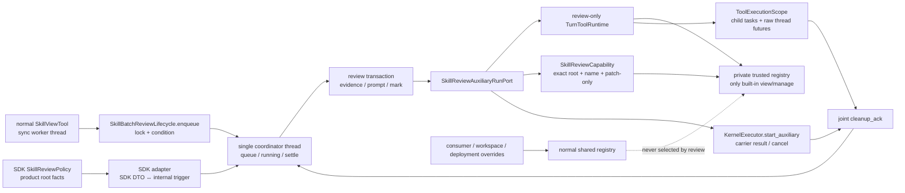
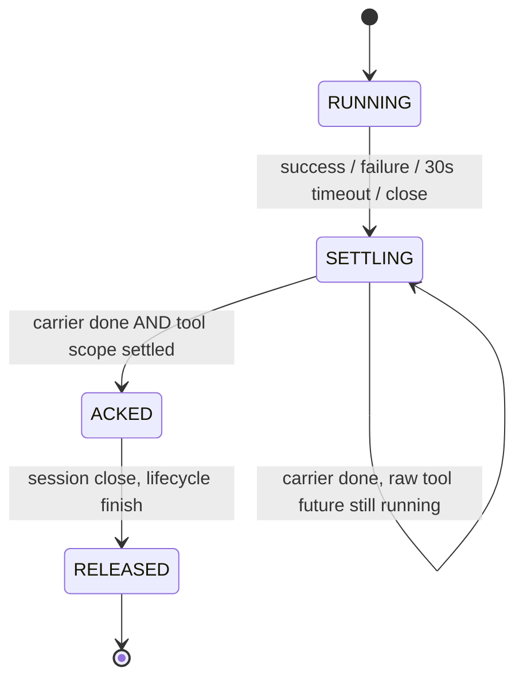
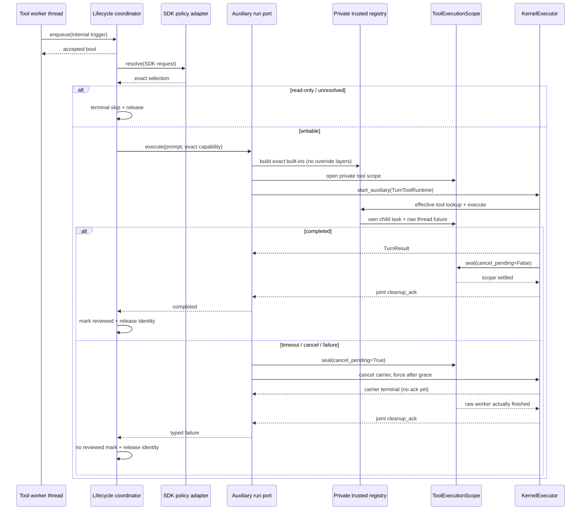

# refactor-479: 收拢 Skill 批量复盘生命周期 — 技术方案

> Unit branch: `unit/refactor-479` (will be created by orchestrator)
>
> 对齐：motivation.md v3

## Changelog

## 现状分析

### 涉及范围

- `platform/tools/builtins/skill_view.py`：同步 tool worker 中 bump usage，enqueue 成功才
  reset counter。
- `core/agent/runtime.py`：queued/running/trigger sets 与 product scheduler callback。
- `sdk/kernel.py`：pop、platform review、finally finish，以及产品可见 drain/scheduler 方法。
- `platform/background/skill_batch_review.py`：evidence、prompt、analysis、mark reviewed。
- CLI/Gateway：各自 create session→submit→`300 × 0.1s` polling，并自行 `create_task` drain。
- `KernelExecutor` / `AuxiliaryHandle`：已有线程安全 admission、result、cancel 与 shutdown
  owner；现有 `cleanup_ack` 在 carrier task unwind 后即置位，未覆盖 carrier 取消后仍运行的
  `asyncio.to_thread` 工具线程。

真实 enqueue 发生在 ToolRegistry 的 `asyncio.to_thread` worker；该线程没有 running event
loop。当前 product scheduler 直接 `asyncio.create_task`，其线程假设并不成立。当前
`writable_skill_root` 也只做 equality guard：analysis session 内 `skill_manage(scope=agent)`
仍从 session workspace 派生 writer，无法保证与 evidence root 相同。生产 tool catalog
又允许 consumer `tools=`、workspace `.nano/tools` 和 deployment `tool_search_roots`
依次 `replace=True` 覆盖 built-in；共享 registry 只按 name dispatch，所以仅在 built-in
叶子检查 capability 仍可被同名 override 绕过。

`docs/specs/kernel/skills.md` 还保留 `scope: "agent" | "pa"` 与 PA root 词汇，生产 schema /
root resolver 已是 `"agent" | "global"` / `global_skill_root`。这是相关 canonical drift：
本 unit 以生产代码为实施基线，并通过 `specs/kernel/skills.md` delta 一并校正文档，不把
`pa` 恢复进代码。

### 既有约束

- 产品只能经 `agent.sdk` 注入产品事实；不得看到 core `F4Trigger`。
- `.nanocode` / `.nanoassistant`、live Agent catalog、global/compat root 分类由产品拥有。
- identity 是 normalized owning root + skill name；同名不同 root 不合并。
- enqueue 是同步、快速、best-effort；当前用户 turn 不等待 review。
- analysis result deadline 保持 30 秒；timeout/cancel/close 必须先 settle carrier、tool
  child task 与真实同步 worker future，再允许同 identity 重试或报告 close 完成。
- evidence、tool read/write、curator state 必须指向同一 exact root；不得 fallback 到同名。
- analysis tool allowlist 仍只有 `skill_view` / `skill_manage`，prompt 与 threshold 不改。
- 正常会话的三层同名 tool override 是既有能力；review 只能绕开 override，不能删除或改变
  正常 catalog 的 precedence。

### 可复用能力

- **深化** `platform/background/skill_batch_review.py` 为 queue→run→finish owner。
- **复用并补深** `KernelExecutor.start_auxiliary()` / `AuxiliaryHandle`：保留 typed
  result/cancel，不造 EventHub waiter；把 target settlement 延伸到本 turn 的真实 tool
  execution scope 后才发 cleanup ack。
- **新增内部约束** `SkillReviewCapability` 与 private trusted registry；capability 随
  review-only `TurnToolRuntime` 进入 ToolContext，绑定 exact root/name/allowed actions，
  trusted registry 不加载任何 override layer。
- **新增具体内部 module** `ToolExecutionScope`：review turn 的 child task 与 raw
  `concurrent.futures.Future` 都由它拥有；使用 review-private worker pool，与普通用户工具的
  default `to_thread` pool 隔离。
- **保留**产品 policy，但改为 build-time SDK-owned Protocol；产品不再调 drain/scheduler。
- **删除** AgentEngine 的 review 状态与 SDK/product polling glue。

### 相关历史

- 历史修复过 startup-only drain、`.nano` 路径、closure workspace 捕获和同名 root，证明
  workspace identity 与 scheduler 是一个事务。
- `docs/specs/kernel/skills.md` 承载自动 batch review 行为。
- 本 unit 与 476/477 无逻辑前置；共享 kernel/CLI 热点，开发可并行、集成序列化。

## 与 Claude Code 的源码对照

CC 的 `src/services/skillLearning/runtimeObserver.ts` 由 `setup.ts` 初始化一次，service 内部
拥有 ingestion、watermark、throttle、backend、upsert 与 auto-evolve 闭环。它不要求每个
产品事件 caller 再建 scheduler。

Nano 只借鉴“安装一次、service 关完生命周期”。阈值、evidence JSONL、产品 root policy、
受限 analysis turn 与 30 秒边界仍是本项目语义。

## 架构总览



Before：queue 在 core、scheduler/runner 在两个产品、terminal/finish 在 SDK/platform。

After：一个 platform lifecycle 拥有 admission 到真实工具 settlement；产品只提供解析事实。
正常会话继续使用 layered shared registry，review turn 则同时替换 catalog 与 execution owner，
使同名 override 不进入 authority path。

## 关键决策

### 决策 1：lifecycle 自己拥有 coordinator，不注入产品 asyncio scheduler

`SkillBatchReviewLifecycle` 状态机为 `NEW → OPEN → CLOSING → CLOSED`，unexpected coordinator
failure 进入 `FAILED`。它持有一把 condition lock、queued/running identity map、一个
coordinator thread 和至多一个 active auxiliary handle；不创建 per-trigger task。

`enqueue(trigger) -> bool` 可从任意线程调用：

1. 在同一 lock 内规范化 `(skill_root, skill_name)`；
2. `NEW/CLOSING/CLOSED/FAILED`、非法 identity 或 queued/running duplicate 返回 `False`，
   不改变 queue；`skill_view` 因而不 reset usage counter；
3. `OPEN` 时先写入 queue，再在同一 critical section `notify` coordinator；只有两步都成功
   才返回 `True`，`skill_view` 才 reset 本批 counter；
4. coordinator 已死或 wake admission 失败时回滚刚插入项、转 `FAILED`、返回 `False`。

policy 解析、evidence I/O 与 analysis 全在 coordinator，不占用 tool worker。read-only/
unresolved selection 也属于一次已接受的 terminal skip：不启动 run、不 mark reviewed，
release identity；下一批 usage 达阈值后可重新解析，而不是每次 view hot-loop。

### 决策 2：build-time SDK policy 是唯一产品 seam

`agent.sdk` 新增三个 SDK-owned frozen DTO 与一个 SDK-owned Protocol：

```python
@dataclass(frozen=True, slots=True)
class SkillReviewEvidence:
    session_id: str
    transcript_path: Path | None

@dataclass(frozen=True, slots=True)
class SkillReviewRequest:
    skill_name: str
    skill_root: Path
    skill_location: Path | None
    evidence: tuple[SkillReviewEvidence, ...]

@dataclass(frozen=True, slots=True)
class SkillReviewSelection:
    analysis_workspace_root: Path
    target_skill_root: Path
    writable: bool
    reason: str | None = None

class SkillReviewPolicy(Protocol):
    def resolve(
        self, request: SkillReviewRequest
    ) -> SkillReviewSelection | None: ...
```

`build_kernel(..., skill_review_policy: SkillReviewPolicy | None = None)` 是唯一安装点。
`None` 时不构造 lifecycle、ToolContext enqueue callback 为空。传入 policy 时，SDK adapter
把 internal `F4Trigger` 映射为 SDK request，调用 policy，再映回 platform internal selection；
platform 不 import SDK。adapter 必须验证 selection 的 normalized `target_skill_root` 与 request
root 完全相等；不等即 terminal skip，产品不能把 review 重定向到同名 root。

不新增 `Kernel.configure_*`、`run_queued_*` 或 scheduler setter。上述四个 SDK 类型加入精确
export allowlist；delta-spec 修改 build surface。policy 的 `resolve` 会在 coordinator thread
调用，产品实现必须同步、快速、线程安全。

### 决策 3：CLI/Gateway policy 对 writable 与动态 workspace 做封闭分类

CLI policy 持有 build repo/workspace 与声明 roots：

- `<workspace>/.nanocode/skills`：该 workspace 为 analysis workspace，writable；
- `~/.nanocode/skills`：产品 global root，选当前 CLI workspace分析，writable；
- `~/.codex/skills`：compat root，read-only；
- 其他 root：unresolved/read-only，不 fallback。

CLI factory 同时把 `global_skill_root=~/.nanocode/skills` 传给既有 kernel tool root config，
使正常交互与 review 对 product global root 的权威一致。

Gateway 在构造 kernel **之前**创建 `LiveAgentCatalog`，policy 每次 resolve 原子读取
`values_snapshot()`，不缓存/替换 policy：

- 与某 live agent `<workspace>/.nanoassistant/skills` 相等：该 workspace，writable；
- `~/.nanoassistant/skills`：product global，按 evidence transcript 命中的 live workspace，
  无命中时用稳定的首个 catalog workspace，writable；
- `~/.claude/skills` / `~/.codex/skills`：compat，read-only；
- 其他：unresolved/read-only。

因此 config sync 后新 Agent 无需第二次 configure；下一次 resolve 自动看到 catalog revision。
kernel/lifecycle 在 composition 返回前已 `OPEN`，早于 channel/session admission。

### 决策 4：review 使用 private trusted registry，capability 检查不可被同名 override 替换

新增 core-owned、不可持久化的 `SkillReviewCapability`，字段为 normalized
`target_skill_root`、`target_skill_name` 与固定 `allowed_actions={"view", "patch"}`。它只由
已验证的 internal selection 创建，不放 session metadata，也不进入 SDK `ToolContext`
Protocol；`Kernel.create_session(metadata=...)` 与模型参数都不能伪造。

authority 不是普通 shared registry 中某个可替换 tool 的属性。每次 writable review 都由
`SkillReviewAuxiliaryRunPort` 新建 private trusted registry：

- 只注册 kernel 自己构造的 `SkillViewTool` 与 `SkillManageTool` 两个实例；不执行
  `tools=`、workspace `.nano/tools`、deployment `tool_search_roots` 任一加载步骤；
- private base `ToolContext` 持有 capability 且 review enqueue callback 为 `None`，避免复盘
  内 `skill_view` 再递归 enqueue；
- core-internal `TurnToolRuntime(registry, execution_scope)` 随 `TurnRequest` 只覆盖这一 turn。
  `AgentEngine` / `AgentLoop` 必须从同一个 effective registry（override 或 normal shared）
  完成 tool specs、session allowlist、permission hook metadata、concurrency lookup、execute 与
  result serialization；禁止出现“展示 trusted spec、实际 dispatch shared override”之类混用；
- 正常 turn 没有 `TurnToolRuntime`，继续使用 shared registry，三层同名 override precedence
  原样保留。

trusted built-in 再执行第二层 capability guard：

- `SkillViewTool` 只接受 target name，并用 `SkillRegistry(search_roots=(exact_root,))`；
- `SkillManageTool` 只接受 target name + `patch`，直接使用 exact registry 的
  `SkillWriter(exact_root, exact_registry)`；拒绝 create/edit/write_file/remove_file/list、
  其他 name 与任意 root 重定向；
- capability mode 不走普通 `scope` root resolver；review prompt 保留现有
  `scope="agent"` 字面，但该字段不能改变已绑定 target；
- evidence load、target SKILL、writer 与 `.curator_state.json` 都使用同一 trigger root。

两层不可互相替代：删除 private registry 会让同名 override 绕过 guard；删除 capability 则会让
trusted built-in 重新接受普通 root resolver 与多 action。组合后，catalog authenticity 与
exact-root/action authority 分别只有一个 owner。

workspace/product-global root 可获得 writable capability；compat/unresolved root 不创建
auxiliary run。任何 location 不存在、name/location 不在 root 下或 policy root mismatch 均
terminal skip，不得退到 session workspace 或其他同名 skill。

### 决策 5：analysis 复用 AuxiliaryHandle，但由 ToolExecutionScope 拥有真实工具执行

`SkillReviewAuxiliaryRunPort` 由 SDK composition 使用现有 `SessionDirectory`、
`KernelExecutor` 与 engine 构造。它为一次 review 建独立 internal analysis session
（workspace 为 `selection.analysis_workspace_root`），并创建上节 private registry 与一个
core-owned `ToolExecutionScope`。该 scope 是具体 in-process module，不新增 product/SDK port：

| Interface | 语义 |
|---|---|
| `run_sync(call)` | 在 review-private、单 worker 的 `ThreadPoolExecutor` 提交同步 tool call；先登记 raw `concurrent.futures.Future`，再把可 await wrapper 交给 tool pipeline |
| `own_task(task)` | 登记 `StreamingToolExecutor` 为本 turn 创建的 child task；task 的 done callback 才解除登记 |
| `seal(cancel_pending)` | 原子拒绝新登记；cancel 路径同时取消 queued child task 与尚未开始的 raw future，已经运行的 Python thread 只允许真实完成，不宣称可被 kill |
| `settled` | 仅当 scope 已 sealed，且 child task 与 raw future 都实际 done 后置位；随后 join private worker |

`AgentLoop` 从 `TurnToolRuntime` 把同一 scope 传给 `StreamingToolExecutor`；后者所有
`create_task` 都经 `own_task` 登记，private `ToolRegistry` 则以 `run_sync` 取代
`asyncio.to_thread`。`TurnRequest` 中的同一 scope 也交给 `KernelExecutor` 作为 target 的
settlement barrier。normal turn 没有 scope，继续走现有 tool task / `to_thread` 路径。

raw future 的 done callback 独立于 await wrapper：carrier 取消即使让 wrapper 先收到
`CancelledError`，也不会把仍运行的 thread 从 scope 删除。private worker 不占普通用户工具的
default `to_thread` pool；卡住的 review 最多阻塞 review coordinator，不阻塞 normal turn。

port 的正常路径为：

1. 建 `RunController`、capability、private registry、scope 与 `TurnToolRuntime`；
2. `KernelExecutor.start_auxiliary(review_id, session, TurnRequest(...))`；
3. 等 `AuxiliaryHandle.result(timeout=30.0)`；
4. 无论 result/exception/cancel，都等同一 handle 的 joint `cleanup_ack`；
5. ack 后关闭 analysis session；只有 `TurnResult.completed=True` 且未 cancel 才允许 platform
   mark reviewed。

没有用户契约要求 review 出现在 normal `RunInfo` / EventHub，因此不经 `Kernel.submit`，也不
维护第二套 terminal protocol。failed/cancelled/timeout 均不 mark reviewed。

### 决策 6：30 秒只截止 result；cleanup ack 等 carrier 与真实工具 scope 共同 settle

Python 无法安全终止已运行的 thread，因此 `cancel(force=True)` 只表示强制取消 asyncio
carrier，绝不表示工具 worker 已结束。normal timeout、lifecycle close 或 coordinator
cancellation 按唯一顺序收口：

1. `RunController.abort()`，同时对 scope 执行 `seal(cancel_pending=True)`；
2. `AuxiliaryHandle.cancel()` 请求 cooperative carrier cancel；bounded grace 后仍未退出可
   `cancel(force=True)`；
3. `KernelExecutor` 记录 carrier terminal，并确保 scope 已 seal（成功/普通失败用
   `cancel_pending=False`，取消路径沿用 `True`），但不从 active targets 移除，也不置
   `cleanup_ack`；target 进入 `SETTLING`，后续 force cancel 不得取消 settlement finalizer；
4. settlement finalizer 等 scope 的所有 child task 与 raw sync future done，并 join private
   worker；只有 carrier terminal **且** scope settled 才移除 target、置 joint cleanup ack；
5. port 收到 ack 后关闭 analysis session并抛 typed timeout/cancel；lifecycle `finally` 最后
   移除 running identity。

成功 result 也必须额外等 joint ack，因为 result future 可早于 executor finalizer。超时到真实
worker 结束之间，同一 identity 保持 quarantined，duplicate enqueue 被拒绝，review queue 可等待；
当前用户 turn 继续走 normal shared registry/private pool 之外的执行路径。



Kernel shutdown 精确顺序：

1. lifecycle `seal()`：拒绝 enqueue，清理未启动 queue；
2. `RunsRegistry.begin_shutdown()`：拒绝 normal run；
3. lifecycle `cancel_active()`：abort carrier并 seal tool scope；
4. `RunsRegistry.shutdown()` / `KernelExecutor.shutdown()` 取消 carriers；review target 若仍为
   `SETTLING` 就继续计入 active targets，owner loop、directory/resources 与 lifecycle 都不得
   提前关闭；
5. scope settled → joint ack → analysis session close 后，`lifecycle.finish_close()` 才 join
   coordinator、验证 running 为空并进入 CLOSED。

因此 `Kernel.close/aclose` 可能等待一个已运行的 trusted local tool 真正返回，但绝不在其仍可
写文件时返回“已关闭”。若未来要求可杀且有界的 worker，必须另行改用 subprocess 隔离；本 unit
不以 Python thread 的假 force-kill 承诺该语义。

### 决策 7：两阶段构造只解决真实 tool-registry cycle

normal ToolContext 需要 enqueue callback，而 auxiliary analysis 又需要已绑定 engine /
executor 与 private registry factory。
SDK 按唯一顺序解决：

1. 构造 lifecycle 为 NEW，把 `lifecycle.enqueue` 放入 base ToolContext；
2. 完成 normal shared registry 的 built-in/custom/workspace/deployment 注册，并
   `engine.bind_tool_registry`；这只决定 normal turn precedence；
3. 构造 `SkillReviewAuxiliaryRunPort`；它持有“按 verified selection 新建 capability +
   private trusted registry + ToolExecutionScope”的 factory，不复用 shared registry 的
   effective tool instances；
4. `lifecycle.start(port)` 原子进入 OPEN；
5. 只有全部成功才返回 Kernel；start 失败则关闭 executor/resources并让 build 失败。

NEW 状态 enqueue 返回 False，但 production 无 caller 能在 `build_kernel` 返回前执行 tool。
这里没有 service locator、可替换 global 或产品后置 configure。

### 决策 8：startup maintenance 保留，产品 drain/scheduler 全删

确定性的 `kernel.run_skill_maintenance(workspace_root)` 可继续由产品在现有 startup/session
时机调用；它不拥有 batch queue。即时 trigger 由 lifecycle 自动 wake。删除：

- AgentEngine review sets/scheduler；
- `Kernel.run_queued_skill_batch_reviews` /
  `set_skill_batch_review_drain_scheduler`；
- CLI/Gateway create-session→submit→poll helper 与 `create_task` drain。

## 接口与数据流



## 契约层增量 (delta-spec)

- kernel: `specs/kernel/sdk-boundary.md` 修改 build-time policy 与 SDK export（只写消费者
  可观察契约；trusted registry/scope/ack 机制只留在本 design）
- kernel: `specs/kernel/skills.md` 把已 drift 的 `scope="pa"` / PA root 校正为生产现状
  `scope="global"` / product global root；这是 canonical repair，不改运行时行为
- im: no spec delta
- gateway: no spec delta
- cli: no spec delta

## 风险与回退

- **cross-thread admission**：从真实 `ToolRegistry.execute → to_thread → SkillViewTool.run`
  驱动；NEW/OPEN/duplicate/closing/coordinator-failure 每格断言 queue 与 counter reset。
- **override 绕过 authority**：分别以 consumer `tools=`、workspace `.nano/tools`、
  deployment `tool_search_roots` 覆盖 `skill_view` / `skill_manage`。normal turn 必须仍命中
  override；review turn 必须命中 trusted built-in，override marker/副作用为零。
- **root capability 漂移**：workspace/global/compat、两个同名 root、伪造 session metadata、
  模型请求其他 name/action 的矩阵测试；evidence、SKILL.md 与 curator state 全部按同一 root
  对账。
- **thread orphan / 假 ack**：用 latch 阻塞已经进入 private worker 的 tool。30 秒到点后断言
  carrier terminal 但 `cleanup_ack=False`、executor target 与 lifecycle identity仍在、同
  identity 无法重入；释放 latch 后断言 `worker_finished < cleanup_ack < identity_release`，
  且 ack/close 后无文件写入。
- **隔离与关闭**：上述 worker 阻塞期间，normal user turn 仍可执行；`close/aclose` 保持等待且
  不进入 CLOSED，释放 latch 后才按顺序完成。
- **dynamic catalog 漏接**：Gateway build 前 catalog、运行中 publish新 Agent，然后经真实
  skill_view trigger解析新 workspace。
- **两阶段构造失败**：port start fault injection 断言 build 不返回半初始化 Kernel。
- **回退**：整体回滚；不得临时恢复第二 scheduler/EventHub waiter、保留双 queue，或以
  carrier target count 代替 raw worker completion。

## Runbook for Reviewer

本 unit 同时影响 CLI 进程内运行与 Gateway 常驻进程。

| 服务 | 停止命令 | 启动命令 | 健康检查 |
|---|---|---|---|
| worktree IM + Gateway | `./scripts/e2e-down.sh` | `PATH=/Users/czj/Repos/nano-multiagent/.venv/bin:$PATH ./scripts/e2e-up.sh` | `source .e2e-ports.env && curl -fsS "$IM_URL/openapi.json"` |

**Review 驱动方式**：真 CLI 与 Web IM入口触发真实 skill_view threshold；准备 workspace、
product-global、compat 三类 root、同名 skill，以及 normal catalog 的同名 tool override。
检查 normal turn 仍执行 override、review 不执行 override、当前对话不阻塞、exact target修改、
read-only skip、curator state，以及 timeout/close 返回后无 auxiliary target或迟到文件写入。

**验收前置**：隔离 workspace/同名 skill/evidence 由 worker 在 unit 验收目录创建。LLM 使用
联调文档当前可用上游；同时新增 purpose-built deadline + latch fixture，通过 internal trusted
tool factory 阻塞真实 sync worker（不能靠 product override 注入），用于 timeout/cancel/close
settlement，不以普通 SSE smoke 或 carrier 计数替代。

## Milestones

默认单 M1：thread-safe admission、policy、trusted exact capability、真实 worker settlement 与
两产品迁移是一个 queue→cleanup 事务；拆层会产生双 queue/双 runner。与 476/477 可并行开发，
kernel/CLI 集成按 476→479 串行，477 在 CLI lane rebase。

| ID | 标题 | 依赖 | 并行组 | 范围 | 退出标准 |
|---|---|---|---|---|---|
| refactor-479-M1 | Skill 批量复盘生命周期单 owner 切换 | 无 | skill-review | platform lifecycle/reviewer/private trusted aux run port；core exact capability、TurnToolRuntime、ToolExecutionScope、ToolRegistry/StreamingToolExecutor/KernelExecutor settlement；SDK policy DTO/adapter/build+close；CLI/Gateway live policy；engine/product 旧 queue/polling 删除；kernel SDK/skills delta 与测试 | [reviewer] motivation 中两产品 threshold、同名 workspace/global、compat read-only、三层同名 tool override、失败/timeout/close Scenario 走真入口且当前对话不阻塞；[worker] 真实 to_thread admission 状态矩阵、dynamic catalog、exact-root action/name guard通过；consumer/workspace/deployment 的 view/manage override 在 normal turn 保留、review turn 均不可达；[worker] latch 证明 deadline 后 `worker_finished < cleanup_ack < identity_release`，worker 未结束时 active target/identity/close 不提前归零，ack/close 后无迟到写入；[worker] 无 normal RunRegistry/EventHub waiter、无产品 polling/scheduler，SDK delta 只含消费者契约、skills drift delta 与生产 schema一致，kernel/CLI/Gateway 非 e2e pytest、contract、ruff 通过 |
