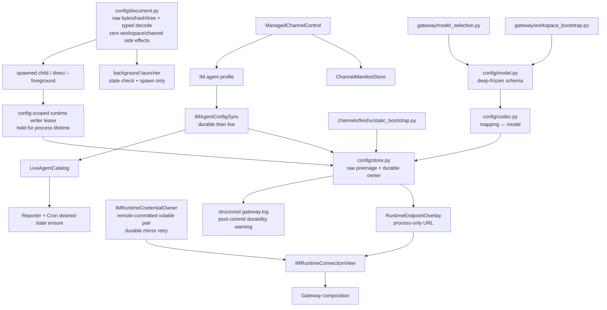
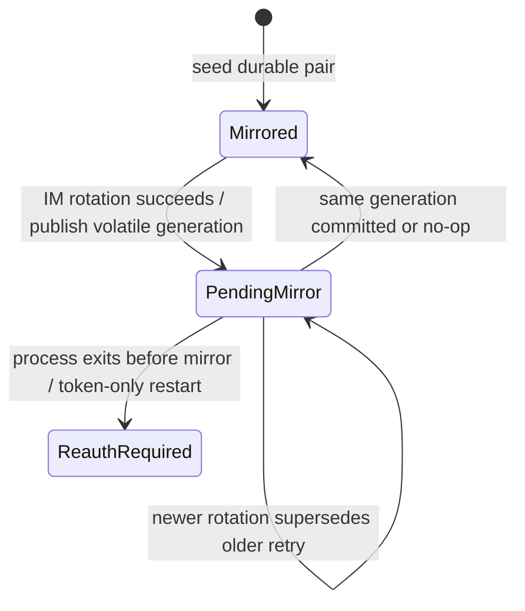

# refactor-481: 重建 Gateway 本地配置所有权 — 技术方案

> 对齐：motivation.md v3
>
> Unit branch: `unit/refactor-481` (will be created by orchestrator)

## Changelog

## 现状分析

### 涉及范围

- `src/personal_assistant/config/local_store.py`：schema、parser/serializer、两套 writer、
  runtime snapshot、workspace seed、model policy、Gateway startup 与 static Feishu
  provisioning。
- `gateway/process_lifecycle.py`：background parent 在检查既有实例前调用带写副作用的
  runtime loader；foreground child 再执行一次同一路径。direct `--foreground` 从 CLI
  直接进入 `run_gateway`，不经过只覆盖 lifecycle command 的 config-scoped lock。
- `gateway/composition.py`、`agent_config_sync.py`、auth/reporter/schedulers：共享
  `RuntimeConfigOwner`，并依赖 persist-first→live publish 顺序。
- IM token rotation：IM 服务在 refresh 响应前先撤销旧 refresh jti；Gateway 当前先替换
  process fields，再同步 persist，persist 抛错会阻断 token listener/返回值。token-only
  配置没有 username/password fallback。
- Agent config/model：IM profile 的 `default_model` 经 config sync 持久化并发布到
  `LiveAgentCatalog`；下一轮 session/run 从 catalog snapshot 按 explicit→agent→product
  precedence 解析模型。相同 profile 当前可由 owner 的 model equality 跳过写盘。
- Cron follower：create handler 单独调用 `on_agent_created`；重连会全量
  `reconcile_all_agents`，但相同 config publish no-op 后没有补 cron。cron registry 自身已按
  agent presence 幂等。
- static Feishu：identity probe、first-sender owner bind、skill provision 写本地 YAML。
- managed Feishu：identity/owner metadata 写 generation-scoped manifest；skill 以 IM
  profile 为权威，再由 config sync 镜像本地。

当前 frozen dataclass 内仍含 caller 可变 dict；`source_path` 同时存在 model 与 I/O owner。
decode 只投影已知字段并丢弃未知 raw YAML，encode 又重建 canonical YAML；所以只看 typed
snapshot 无法安全判断真实 preimage 是否含未来 secret，也不能在语义 no-op 时以“bytes 不同”
为由改写用户注释/格式。
普通 writer 为默认主配置做最多 30 份 backup，敏感 writer 则 mode 0600 + fsync + atomic
replace 且不备份。选择哪套策略由业务 caller 注入 callable，而非持久化 owner 判断。

### 既有约束

- YAML schema、默认路径 `~/.nano-assistant/config.yaml`、缺省值和 round-trip 保持。
- 同一 resolved config 只有取得 lifetime runtime writer lease 的 foreground 进程可以
  seed/probe/provision/update；background parent 与 lease loser 只读。
- durable commit 成功后才能发布 `LiveAgentCatalog`；写失败不得让下一轮使用未落盘配置。
- IM token rotation 的总 commit point 在远端；远端已提交的新 pair 是该进程的 runtime
  authority，本地 store 只是 durable mirror，不能套用普通 config 的 pre-commit rollback。
- static 与 managed Feishu 代码可共享纯 probe/transform，但不得合并 durable authority。
- worktree 显式 config 不在主配置 `backups/` 留痕。
- workspace 默认文件只补缺，不覆盖用户内容。
- `--im-service-url` 是 process overlay，不得进入 durable snapshot。
- typed semantic no-op 不得读取/重写原 YAML，也不得增加 catalog revision；但 follower
  convergence 仍必须执行。
- 产品 schema 归 personal_assistant，不借 `agent` 内部类型。

### 可复用能力

- **复用**现有 config-scoped `fcntl.flock` 路径派生模式；新增独立 lifetime runtime lease，
  不延长 background parent 已持有的 lifecycle command lock。
- **保留**现有字段、解析缺省值、YAML 投影、feat-386 建立的 backup retention=30 与 secure
  atomic write primitives；backup 只保留给真实 raw old/new 都可证明无 secret 的默认主配置。
- **深化**为 deep-frozen `LocalConfig`、read-only `LocalConfigDocument` 和唯一可写
  `LocalConfigStore`。
- **复用**cron registry 的 presence-idempotent registration，将 create-only callback 改成
  desired-state ensure。
- **迁移** workspace seeding、run model resolution、static Feishu bootstrap 到各自 owner。
- **保留** `ManagedChannelControl` / `ChannelManager` / `ChannelManifestStore` 与
  `IMAgentConfigSync` 的 managed authority。
- **删除** `local_store.py` 聚合导出和 caller-supplied writer/sensitivity 参数。

### 相关历史

- refactor-406 将 LLM wire schema归 personal_assistant；本 unit保持。
- bugfix-424/429 与 feat-394 固定 workspace/model/heartbeat 字段语义。
- feat-386 建立默认主配置的 30 份写前备份；feat-464 证明 secret-bearing 路径不得生成明文
  backup。本 unit由 store 用 raw document 统一裁决两条既有安全语义。
- refactor-464 固定 managed channel manifest 与 IM profile authority。
- refactor-470 要求 composition root 显式装配 owner。
- canonical 依据为 `service-lifecycle.md`、`agent-capabilities.md` 与
  `external-channels.md`。

## 与 Claude Code 的源码对照

本机 CC commit `0991eac5` 的 `src/utils/settings/settings.ts` 同样很大，协调 source/path/
parse/read/write/cache；它不是“所有大文件都拆”的依据。本机当前 working tree 另把 provider
registry 放在 `src/services/providerRegistry/loader.ts`；该文件不是 commit `0991eac5` 的
内容，因此这里只作为 working-tree 架构对照，不伪称同一快照证据。

Nano 采用相同变化轴原则：schema/codec/store 不理解 Feishu 远端身份；static 与 managed
provider bootstrap 归 channel domain，但各自只调用自己的 durable authority。

## 架构总览



Before：launcher/child/direct foreground 可重复写，远端 credential 与本地 commit point
混淆，model/path 与两套 writer/Feishu authority 混在一个模块。
After：launcher/loser read-only；lifetime lease winner 的 store 是唯一 YAML writer；raw
preimage 与 semantic snapshot 各有权威；endpoint overlay、volatile rotating credentials、
static/managed authority 和幂等 follower 显式分叉。

## 关键决策

### 决策 1：model deep-freeze，path 只归 document/store

`config/model.py` 只定义 immutable dataclasses/constants。所有 list 序列化为 tuple；所有
`settings`、`features`、`extra_request_body` 等嵌套 JSON mapping/list 经
`deep_freeze_json()` 转成不可变 mapping/tuple。codec 是唯一 `deep_thaw_json()` caller。
store 在接受 transform 结果后再次 normalize/deep-freeze，防止 caller 偷渡 mutable value。

`LocalConfig` 删除 `source_path`。`load_local_config_document(path)` 返回
`LocalConfigDocument(path, raw_bytes, raw_sha256, raw_tree, snapshot)`：

- `raw_bytes` 是本次真实读取的 UTF-8 preimage，backup 与 external-divergence 以它为准；
- `raw_tree` 是完整 YAML tree 的 deep-frozen 形式，包含 typed model 不认识的字段，供安全分类；
- `snapshot` 只含 current schema 的 semantic model；
- decode 不 seed workspace、不安装 skill、不 probe/provision、不写任何文件。

raw document 只负责 no-op/conflict/classification/exact backup，不升级成 comment-preserving YAML
AST；semantic change 仍沿用 current known-schema projection，未知字段没有新增 round-trip 保证。

foreground `LocalConfigStore` 独占 `.path` / `.runtime_dir` 和当前 raw preimage；composition、
state/log/database path helper 显式接收 document/store path context，transform 不能改变写入
目标。workspace seeding 下沉到 lease winner 的 `workspace_bootstrap`。

### 决策 2：所有 foreground 入口竞争同一 config-scoped lifetime writer lease

**background parent 永远只读；spawned child 与 direct `--foreground` 只有拿到同一 lifetime
lease 才能打开 store 或执行任何 bootstrap 副作用。**

background launcher 的闭合流程：

1. `load_local_config_document(path)` 纯读取 lifecycle timing 与 state/log path；
2. 在 lifecycle lock 下检查 existing process；已运行则直接报错；
3. 只把 config path 与 runtime endpoint overlay 传给 child；命令回显的 IM endpoint 由
   durable A + 本次 overlay B 在内存计算，parent 不改 document；
4. `run_gateway` 的所有调用方（spawned child 与 direct foreground）在纯 decode 后立刻
   `GatewayRuntimeLease.acquire(resolved_config_path)`。lease 使用独立的
   `.<config-name>.gateway-runtime.lock` 非阻塞 `flock`，不能复用 parent 正持有的 lifecycle
   command lock。winner 在 acquire 返回前把 PID/process birth/resolved config 写入 lock
   metadata；loser 若撞到 metadata 尚未写完的窗口，只做有界读取/重新抢锁，winner 退出则接管，
   否则据 metadata 报告 holder PID；
5. winner 写 process state，并以 `LocalConfigStore.open(document, lease)` 打开 store；该接口
   要求 live lease capability。随后才 seed workspace、安装内置 skill、probe/provision Feishu
   与 build runtime；
6. lease fd 保持到 runtime producers/resources 全部 close、state 清理完成后才释放。进程异常
   退出时由 OS 释放，stale state 只是诊断信息，不能冒充 writer authority。

loser 在 lease acquisition 处返回“gateway is already running (pid=…)”错误；不调用 store open，
不 seed workspace，不安装/写 skill，不做 Feishu network probe/provision，不改 config/state。
background↔background 仍先由 lifecycle command lock 串行；foreground↔foreground 与
foreground↔background 的竞态由 lifetime lease 决胜。三种组合都只有一个 writer。

```mermaid
sequenceDiagram
    participant P as Background parent
    participant D as Read-only document
    participant F as Child / direct foreground
    participant L as Runtime writer lease
    participant S as LocalConfigStore
    P->>D: decode(path), no side effects
    P->>P: lifecycle state check
    alt already running
        P-->>P: fail, zero probe/write
    else spawn
        P->>F: argv(path, endpoint overlay)
        F->>D: decode(path), no side effects
        F->>L: non-blocking acquire(resolved path)
        alt lease lost
            F-->>P: fail; zero store/bootstrap/probe
        else lease won
            F->>S: open(document, lease)
            F->>S: workspace/static bootstrap updates
            F->>L: hold through runtime close
        end
    end
```

### 决策 3：store 以 semantic snapshot 判 no-op，以真实 raw preimage 判安全与冲突

**保留 feat-386 的 non-secret 默认主配置备份，但 store 必须同时拥有 semantic 与 raw-byte
authority；业务 caller 不再传 `sensitivity` 或 writer callable。**

`update(transform) -> ConfigCommitResult` 在同一进程锁内按固定顺序执行：

1. normalize/deep-freeze transform 结果。若 `updated_snapshot == current_snapshot`，立即返回
   `changed=False`；不 encode、不 reread、不 backup、不写盘。于是相同 `default_model`/profile
   的 update 不会 canonicalize 用户注释、缩进或未知字段。
2. 仅在 semantic change 时重新读取目标 bytes，并与 store 持有的 `raw_sha256` 比较。不同则抛
   `ConfigConflictError`，原文件/内存均不变；caller 必须 reopen/reconcile，不能覆盖外部编辑。
3. encode 新 snapshot；对实际 old `raw_tree` 与完整 new encoded tree 分类。以下任一命中即
   secret-bearing：已知 token/refresh/password/secret/credential/private-key 路径，任一非空
   `channels[].settings`，任一非空 provider `extra_request_body`，或 current schema 不认识且
   值非空的任意 raw path/subtree。unknown 默认敏感，不能因 typed decode 丢字段而误建 backup。
4. 仅当 old/new 都可证明无 secret、目标是默认主 config 且已有 preimage 时，把**已核 hash 的
   exact raw bytes**写入 mode `0600` backup；绝不从 typed model 重编码 backup。
5. secure atomic commit 后更新 snapshot/raw bytes/raw tree/hash；只有这一步后普通 config
   consumer 才能看见新 snapshot。

semantic change 却 encode 成与 preimage 相同 bytes 属 codec invariant violation，抛错而不
静默 publish。保留 backup 分支不是为未来猜测：feat-386 已把默认主配置的 30 份恢复历史定义为
既有能力；本 unit只把它限制到“真实 old/new document 均证明无 secret”的安全子集。

写盘矩阵：

| 条件 | Backup | 文件/目录权限 | transaction |
|---|---|---|---|
| normalized model equality（不论 raw bytes 是否 canonical） | 无 | 零 I/O | 返回 `changed=False`，不 publish |
| semantic change 前发现 raw hash 外部漂移 | 无 | 不触碰 | `ConfigConflictError`，不 publish |
| 实际 old 或 new document secret-bearing/unknown | 无 | config/temp `0600` | temp write → file fsync → atomic replace → dir fsync → publish |
| 两侧均证明无 secret、默认主 config、目标已存在 | exact raw preimage，最多最近 30 份 | backup/config/temp `0600`，backups dir `0700` | backup fsync → temp fsync → replace → dir fsync → publish |
| 两侧均无 secret、默认主 config 首次写 | 无 | config/temp `0600` | secure atomic transaction |
| 任意显式非默认/worktree path | 无 | config/temp `0600` | secure atomic transaction |
| backup 创建失败 | 无 commit | 原目标不变 | 抛 pre-commit error，不 publish |
| temp write/file fsync/replace 失败 | 已成功创建的 backup 可保留 | 原目标不变，temp 清理 | 抛 pre-commit error，不 publish |
| replace 成功、directory fsync 失败 | 按上表 | 新目标已是 commit point | publish 新 snapshot；返回 `durability_warning`，不得假装回滚 |

backup pruning 在 commit 后 best-effort 执行；单次保留上限仍为 30，失败记录 warning，不把已
commit 配置倒回。`ConfigCommitResult` 精确包含 `snapshot`、`changed`、
`durability_warning`。commit point 后不抛“未提交”异常。

`LocalConfigStore` 是 warning 的不可绕过消费 owner：directory fsync 失败时在返回前无条件向
`gateway.log` 发一条结构化 `gateway_config_durability_warning`（resolved path、stage、
exception type、commit revision；不含配置值/secret）。Agent sync、auth 与 static bootstrap
都把结果当“committed with warning”，不重抛 pre-commit error，也不重复记录；本 unit不新增 IM
health/RPC schema。返回字段保留给 operation metrics/测试，正确性不依赖 caller 记得消费。
backup pruning 失败另记 `gateway_config_backup_prune_failed`，不冒充 commit durability。

### 决策 4：endpoint overlay 与 remote-committed rotating credentials 分属两个 owner

**`RuntimeEndpointOverlay` 只覆盖 URL；`IMRuntimeCredentialOwner` 以服务端成功 rotation 为
不可回退 commit point，本地 store 只是可重试 mirror。**

`IMRuntimeConnectionView` 只暴露 IM 连接需要的动态字段：

- endpoint = durable URL + 本进程 `--im-service-url` overlay；
- credential = `IMRuntimeCredentialOwner.current_pair()`；
- username/password = durable recovery credential。

LLM、channels、node 与 lifecycle timing 等 startup topology 不在这个 view 中，不被误当成
热更新。任何 `LocalConfigStore.update` 仍只以 durable snapshot 为 baseline；overlay 无
encoder，因此 URL A 在以 B 运行期间经历 token/Agent 写回后仍是 A。

token rotation 的闭合顺序：

1. refresh/login 请求使用 credential owner 当前最新 pair；
2. IM 返回新 pair 即表示旧 refresh token 已被远端撤销。owner 以单调 generation 发布新 pair，
   先通知 WS/config-sync listeners，并让 `get_token()` 返回新 access token；
3. owner 再请求 `LocalConfigStore.update` 镜像该 generation。pre-commit failure 不撤销
   generation、不恢复 durable old pair、不阻断当前 reconnect；记录结构化
   `im_token_mirror_pending` 并由单一 bounded-backoff task 重试最新 generation；
4. newer rotation 覆盖 pending older generation；迟到 retry 用 generation compare-and-set，
   不能把新 pair 写回旧值。store commit/no-op 后才清除对应 pending；
5. replace 已成功但 dir-fsync 失败属于 committed-with-warning：mirror 视为已写入，store 的
   durability warning 出口负责告警。

进程存活期间 reconnect 永远优先 volatile current pair，并会触发 pending local retry，不再拿
旧 durable pair 覆盖它。graceful shutdown 在有 pending 时做一次有界 final mirror；仍失败则
记录 ERROR 后按关闭预算退出，不能无限卡住 shutdown，也不能宣称远端 rotation 已回滚。若进程在
mirror 成功前退出：

- 有 username/password 的配置可在下次启动通过 login 获得新 pair并重新镜像；
- token-only 配置只剩已撤销的 durable refresh token，必须以明确
  “refresh rejected and no credential fallback; re-authenticate”失败，不能永久 401 重试或
  假装旧 pair 可恢复；
- 本 unit不引入另一个 secret sidecar；在本地 durable write 失败时承诺 crash-safe 恢复是不真实的。



### 决策 5：static 与 managed Feishu 共享纯逻辑，不共享 durable owner

- `channels/feishu/static_bootstrap.py` 只处理 YAML `channels[]`：bot probe、first-sender
  owner bind、static agent `feishu-doc` provision 都通过 foreground `LocalConfigStore`。
- managed runtime 继续由 `ManagedChannelControl` / `ChannelManager` 拥有：
  bot/owner metadata 只写 generation-scoped encrypted `ChannelManifestStore`；credential
  不进 config YAML。
- managed skill activation 先 patch IM 权威 agent profile，再由 `IMAgentConfigSync` 镜像
  committed profile 到 LocalConfigStore 与 live catalog；channel bootstrap 不直接写 store。
- 两路可共享 `probe_feishu_runtime()` 和纯 metadata transform，但不共享 save callback、
  generation guard 或 skill authority。

测试分别覆盖 static YAML round-trip，以及 managed manifest generation guard、IM profile
first、local mirror second；不能用一条“Feishu bootstrap”测试替代。

### 决策 6：IM Agent 配置由 config sync 完成 durable→live publication

`IMAgentConfigSync` 继续是该用户动作的 orchestration owner，不新增第二个 config service。
精确顺序：

1. 在 runtime lease 已持有的前提下 decode/validate desired agent，并完成 workspace default
   seeding；
2. `LocalConfigStore.update`；pre-commit 失败则停止，catalog/reporter/cron 零 publication；
3. commit/no-op 后比较 `LiveAgentCatalog`，仅在 config 不同时发布一次完整 snapshot；
4. 无论 config 是否 changed，都以 committed store snapshot 幂等更新 reporter；
5. 无论 create/edit、store/catalog no-op，还是 reconnect full reconcile，都对 committed
   agent 调 `GatewayCronRuntime.ensure_agent_registered(agent_id, workspace_root)`；
6. 下一轮 run/heartbeat/cron 从 `LiveAgentCatalog` 读取 snapshot。真实 `default_model`
   变化因此只 commit/publish 一次，下一轮 session admission 按
   explicit→agent→product precedence reconfigure；相同 model/profile 不写 YAML、不增加
   catalog revision，但仍执行步骤 4/5。

catalog publish 是无 I/O 的 correctness-critical follower；若意外失败，sync 操作报错且下一次
IM reconcile 从 durable snapshot 重试。reporter/cron 是 desired-state follower：

- `ensure_agent_registered` 取代 create-only `on_agent_created`。registry 的
  `register_if_absent` 是唯一创建点；已存在时复用同一 service，不重复 start、stale-run
  convergence 或 job enqueue。若初始化在 register 后失败，pending 状态挂在同一 service，
  retry 继续它而非再建一个实例。
- follower failure 写入 pending agent set；当前同步 batch 结束后做一次有界 same-connection
  retry。后续任一相同 profile sync 仍重试，即使 durable/catalog 都 no-op。
- `reconcile_all_agents` 在每次 register-ready（含重连）末尾对**全部 committed agent**做
  follower pass；即使某 profile fetch 失败、IM version 被跳过或 config equality no-op，也从
  durable/catalog desired state 补齐 pending follower。
- failure 不回滚已 commit YAML/catalog；成功后从 pending 删除。相同调用可重复，registry
  service identity/count 与已执行初始化副作用保持一次。

### 决策 7：按依赖目的直连，原子删除聚合 façade

schema 从 `config.model` 导入，codec/document/store/overlay 各有唯一入口；
workspace/model/static Feishu 策略从其领域模块导入。所有 active production/test caller
同一 M1 迁移后删除 `RuntimeConfigOwner` 与 `local_store.py`，不留 re-export。snapshot
serialization 与 durable transaction 共同隐藏在 `LocalConfigStore.update`，不再叠一个浅 owner。

这是一次大 import diff，但保留 façade会制造第二 public surface；单 M1 是 owner cutover，
不能按 schema/codec/store 横切成双 writer 过渡期。

按 deep-module 删除测试，三个新 module 都在赚取 locality，而不是搬代码：

- 删除 `LocalConfigStore.update` 会把 raw conflict、classifier、backup、commit point 与 warning
  重新散到 auth/config-sync/static Feishu callers；
- 删除 `GatewayRuntimeLease.acquire` 会让三种启动入口各自理解 lock metadata 与进程身份；
- 删除 `IMRuntimeCredentialOwner` 会让 WS、auth 与 config sync 各自猜 remote/local commit
  precedence。

`RuntimeEndpointOverlay` 只是 `IMRuntimeConnectionView` 的 immutable input，不另造 Protocol/
factory；filesystem 是 local-substitutable dependency，也不把 fault-injection seam暴露给业务
caller。新测试以这三个 module 的 interface 和 `IMAgentConfigSync` orchestration interface 为
test surface，替换直接测试旧 façade 私有 helper 的用例。

## 接口与数据流

闭合接口：

- `decode_local_config(raw_tree) -> LocalConfig`
- `encode_local_config(config) -> Mapping[str, object]`
- `load_local_config_document(path) -> LocalConfigDocument`
- `GatewayRuntimeLease.acquire(resolved_config_path) -> GatewayRuntimeLease`
- `LocalConfigStore.open(document, lease)`, `.path`, `.runtime_dir`, `.snapshot()`
- `LocalConfigStore.update(transform) -> ConfigCommitResult`
- `IMRuntimeCredentialOwner.current_pair()`、
  `.accept_remote_pair(access, refresh) -> generation`、`.flush_pending()`
- `IMRuntimeConnectionView.endpoint()` / `.credential()`
- `GatewayCronRuntime.ensure_agent_registered(agent_id, workspace_root)`
- static Feishu 只依赖 `LocalConfigStore`；managed Feishu 不 import config store。

Agent model update 不新增专用 writer：`IM agent profile.default_model → IMAgentConfigSync →
LocalConfigStore → LiveAgentCatalog → SessionRunCoordinator/InProcessKernelClient →
resolve_run_model(explicit, agent, product)`。产品级 `llm.default_model/providers` 仍是 startup
topology，不承诺运行期热换；本 unit只保证既有 per-agent model 更新在下一轮读取 catalog
snapshot 生效。

```mermaid
sequenceDiagram
    participant IM as IM Agent config
    participant S as IMAgentConfigSync
    participant D as LocalConfigStore
    participant C as LiveAgentCatalog
    participant F as Reporter/Cron followers
    IM->>S: desired profile
    S->>S: validate + workspace seed
    S->>D: update(transform)
    alt pre-commit failure
        D-->>S: error
        S-->>IM: failure; zero live publication
    else committed or no-op
        D-->>S: ConfigCommitResult(snapshot)
        S->>C: publish if changed
        S->>F: ensure from committed snapshot even on no-op
        alt follower failure
            S->>F: record pending + bounded same-connection retry
            Note over S,F: every reconnect runs a full follower pass
        end
        S-->>IM: success
    end
```

```mermaid
sequenceDiagram
    participant A as IM auth server
    participant O as IMRuntimeCredentialOwner
    participant D as LocalConfigStore
    participant W as WS/config-sync consumers
    O->>A: refresh(current refresh token)
    A-->>O: new pair; old refresh already revoked
    O->>O: publish volatile generation N
    O->>W: notify/use access N
    O->>D: mirror generation N
    alt local pre-commit failure
        D-->>O: error
        O->>O: keep N + mark pending + retry
        W->>O: reconnect reads N, never durable old pair
    else commit or committed-with-warning
        D-->>O: ConfigCommitResult
        O->>O: clear pending N
    end
```

## 契约层增量 (delta-spec)

- kernel: no spec delta
- im: no spec delta
- gateway: `specs/gateway/service-lifecycle.md` MODIFIED 后台服务管理 Requirement，完整保留
  原 Scenarios 并强化 repeated-start 的 all-mode lease + zero side-effect；ADDED
  process-only IM URL override 与 remote-committed token rotation failure semantics。
  `heartbeat-cron.md` no spec delta：本 unit只是让实现重新满足既有“重连全量对账后调度收敛”。
- cli: no spec delta

## 风险与回退

- **schema/raw authority 漂移**：fixture 做 semantic round-trip；opaque mapping deep-freeze；
  未知 raw field 保留在 classifier input。相同 model/profile + 非 canonical YAML/注释时断言
  bytes/hash/mtime/backup 均不变；semantic change 前外部改 bytes 必须 conflict，不覆盖。
- **writer 事务漂移**：写盘矩阵逐格 fault injection，覆盖 exact-raw backup、secret/unknown
  no-backup、mode、retention=30、backup/temp/replace/dir-fsync commit point。
- **durability 降级静默**：dir-fsync post-commit fault 断言 store 仍 publish 新 snapshot，
  `ConfigCommitResult.durability_warning` 非空且 `gateway.log` 恰有一条无 secret 的结构化
  warning；caller 不把它误报为 rollback。
- **第二 writer 复发**：foreground↔foreground、foreground↔background、
  background↔background 三组进程竞争；loser 的 store-open/workspace/skill write/Feishu
  probe spies 全为零，winner lease 保持到 runtime close。
- **remote/local commit point 混淆**：真实 IM refresh 成功 + local pre-commit failure 后，
  current reconnect 使用 volatile new pair；旧 refresh 已 401；本地重试最终写入。另覆盖
  pending 时 graceful stop、token-only restart 的 actionable re-auth 与 credential login recovery。
- **authority 混淆**：static/managed 双路径 contract scan，managed modules 禁止 import
  `LocalConfigStore` 作为 metadata owner。
- **durable/live/follower 分叉**：persist failure、model no-op/changed、edit/create、catalog
  publish 与 cron first-failure；同连接 retry + reconnect full pass 补齐，registry service
  count/identity和初始化副作用不重复。下一轮真实 run读取新 model revision。
- **overlay 污染**：A→runtime B→token/Agent write→无 override重启，断言 disk仍为 A。
- **回退**：整体代码回滚；YAML schema未变，无数据 migration。新 secure backup 与原文件
  都是 YAML，可直接恢复。

## Runbook for Reviewer

本 unit修改 Gateway startup/config 写回，需重启隔离 Gateway 与 IM。

| 服务 | 停止命令 | 启动命令 | 健康检查 |
|---|---|---|---|
| worktree IM + Gateway | `./scripts/e2e-down.sh` | `PATH=/Users/czj/Repos/nano-multiagent/.venv/bin:$PATH ./scripts/e2e-up.sh` | `source .e2e-ports.env && curl -fsS "$IM_URL/openapi.json"` |

**Review 驱动方式**：真栈创建/编辑 Agent（含相同/变化 `default_model`）、token refresh、带
override 重启，以及同一 worktree config 的 direct foreground/background 交叉重复启动；检查
loser 零 workspace/config 写与零 Feishu probe、隔离 YAML raw bytes/mode/backup、结构化
durability warning、cron registry 和下一轮 run model。token local-mirror fault 只在隔离 config
目录注入，确认当前 WS 用远端新 pair 重连、随后恢复权限可补写；static Feishu 用 YAML 测试
channel，managed Feishu 用 IM manifest control surface，分别核对 authority。

**验收前置**：worktree config 由 `scripts/e2e-up.sh` 派生且不得写主文件。Feishu journey
需要可用测试 app 的 `appId/appSecret` 与测试用户；实施接管前由 orchestrator 在验收目录
登记来源并以 bot identity probe 成功作为检查。缺失时该 Scenario 阻断最终验收，不以单测
静默替代。token-only restart 子旅程使用该隔离 IM 的测试账号先签发 pair，再从 worktree 副本
移除 username/password；不得修改 `~/.nano-assistant/config.yaml`。

## Milestones

采用单 M1：schema/codec/store、launcher/child 与全部 caller 必须共同切换才能删除 façade；
按层拆会制造双入口/双 writer。它与 refactor-478/480 可并行开发，但都改 composition，
集成按 478→480→481 串行并逐次重跑 Gateway contract/e2e。

| ID | 标题 | 依赖 | 并行组 | 范围 | 退出标准 |
|---|---|---|---|---|---|
| refactor-481-M1 | Gateway config owners 原子切换 | 无 | A | config model/codec/document/store、runtime writer lease、IM endpoint/credential owners、process lifecycle、workspace/model policy、static Feishu bootstrap、managed authority guards、config sync/catalog/reporter/cron convergence、全部 caller 与测试 | [reviewer] motivation 中既有 YAML 启停、all-mode single writer、runtime URL A→B→A、remote rotation + local mirror failure、Agent 写回/follower retry、模型/workspace、static/managed Feishu Scenarios 真栈通过；<br>[worker] deep-freeze/path/raw preimage 单权威、semantic model no-op 零 I/O、external divergence、old/new classifier、exact backup/retention/权限/commit-point fault matrix和结构化 durability warning通过；<br>[worker] foreground↔foreground、foreground↔background、background↔background loser 零 store/bootstrap/probe，remote token generation/retry/token-only restart，cron same-connection/reconnect ensure且不重复，model changed/no-op→下一轮 run回归通过；<br>[worker] YAML schema semantic round-trip，`local_store.py`/旧 import删除，Gateway 非 e2e pytest、contract、ruff通过 |
