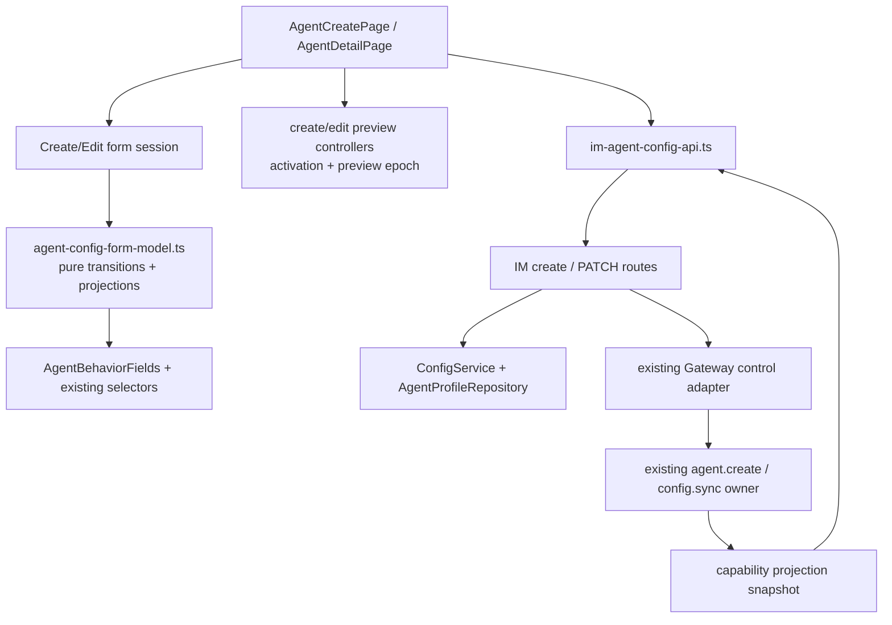
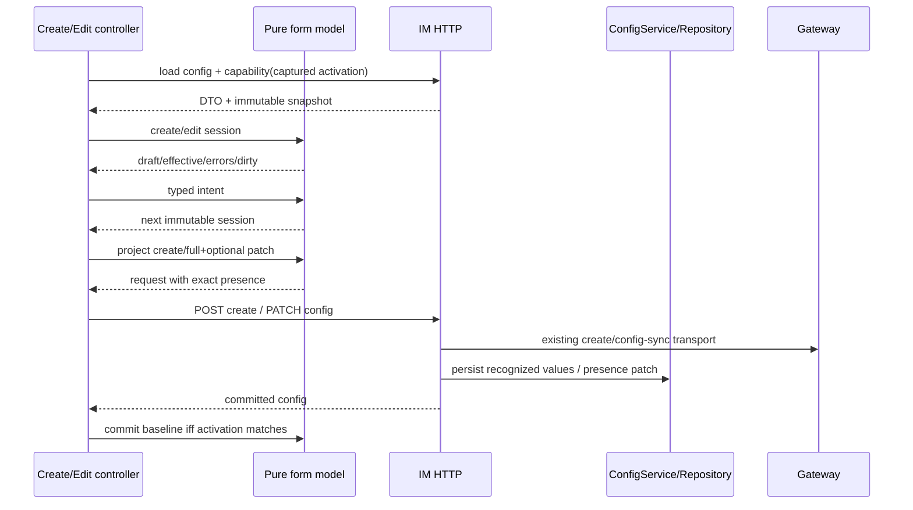

# refactor-483: 统一 Web Agent 配置表单模型 — 技术方案

> 对齐：motivation.md v3
>
> Unit branch: `unit/refactor-483` (will be created by orchestrator)

## Changelog

## 现状分析

### 涉及范围

- `agent-create-page.tsx` 同时拥有 create draft/default、node/capability lifecycle、
  normalization/validation、feature/tool 联动、preview 和 submit。
- `agent-detail-page.tsx` 把 `AgentConfig` DTO 直接当 draft，重复相同规则，并同时拥有
  dirty/refetch/save、heartbeat/cron、channel/skill/session 等 detail-only lifecycle。
- `im-agent-config-api.ts` 同时承载 wire DTO、response normalization 和页面所需 capability
  projection；两页目前都能把网络类型当本地 state 类型。
- `src/IM/api/routes/nodes.py` 的 create request 没有 `features/custom_prompt`，所以浏览器发送的值被
  Pydantic 丢弃；后续 Gateway create handler其实已经能接收、返回这两个字段。
- `src/IM/api/routes/agents.py` 给 PATCH optional block 填默认值，route 又无条件下传，因而
  “字段 absent”会被物化成默认值；application/repository 的 `None` 同时表示 preserve 与合法 clear，
  不能表达完整 presence。
- `ConfigService` / `AgentProfileRepository` 是配置持久化的既有 module；本 unit 扩展它们的
  create/partial-update interface，不新增第二个存储 owner。
- `SkillSourceSelector` 已按 location 分组展示 skill，但选中与 payload 仍是 name list；同名不同
  location 的展示 identity 与持久化 identity不能混成一个概念。
- `agent-create.test.tsx`、`agent-detail-page.test.tsx`、IM config contract tests 是现有回归面；
  当前 create contract test没有发送/断言 `features/custom_prompt`，所以没有发现真实链路断点。

### 既有约束

- Web 客户端只调用 IM HTTP；IM 与 Gateway 继续只走现有 WebSocket control frame，不新增跨包 import。
- Gateway capability projection 是 runtime 候选与 feature metadata 的产品语义 owner；前端只消费
  immutable snapshot，不复制 FEATURE_REGISTRY。
- IM Bearer 身份是 owner authority。create body中的 `owner_id` 不能覆盖
  `current_user.owner_id`。
- `tool_allowlist: []` 是“无工具”的存储真值；feature missing key按 capability `default_on` 展示，
  explicit `false` 必须覆盖 default。
- create 和 edit 的 preview endpoint不同；共享 view/model不得根据 ID 形状猜 endpoint。
- HTTP response当前总会物化 `features` 为 object、`custom_prompt` 为 string/null。PATCH field
  presence是“本次是否修改”的请求语义，不承诺 response保留历史 wire absence。

### 可复用能力

- 复用现有 `ConfigService`、`AgentProfileRepository`、Gateway `agent.create` handler及 config-sync
  链路；它们已经能存储/传播 recognized config fields，只补缺失的 create/presence连接。
- 复用现有 create/detail routes、React Query cache、selectors、Heartbeat/Cron/Workspace cards和
  desktop `AgentsRailDesktop`；不造通用 form framework或第二套 design system。
- 复用 capability DTO的 `name/location/default_on/requires_tool/provider` 信息，但由新 form model
  一次性投影成稳定 lookup。
- 不复用“API DTO即draft”、ref heuristics和 `JSON.stringify` dirty；删除新 module后这些复杂度会
  重新散回两页，说明共享 form model通过 deletion test，应该存在于 settings feature seam。

### 契约层 grounding 与相关历史

- `docs/specs/im/agents-nodes.md` 承诺 Agent config可读可改、create返回与 GET同形配置；真实代码对
  create `features/custom_prompt` 与 PATCH presence已经 drift，本 unit负责修正。
- `docs/specs/gateway/agent-capabilities.md` 当前写“停用 cron feature则 cron tool移出”，但真实
  create/detail代码及 `feat-379` 原始决策都是“关 feature不删 tool；显式移除 tool才关闭依赖
  feature”。本 unit以已验证代码/原始决策为 current truth，通过 Gateway delta-spec纠正文案；这是
  canonical drift correction，不是新增 Gateway runtime行为。
- `bugfix-468` 已把空 tool allowlist定义为真空集；本 unit不得重新引入“空即默认工具”。
- `feat-430` 要求同名不同 location 的 skill分开展示；当前 payload仍只存 name，本 unit保持这个
  wire限制并把两种 identity显式分开。
- kernel、CLI均无消费者行为变化。

## 与 Claude Code 的源码对照

Claude Code没有等价的 Agent create/detail UI。可比概念是
`src/utils/settings/settings.ts` 先把原始 settings投影到稳定 settings model并集中 merge/cache，
而 `src/services/providerRegistry/loader.ts` 独立加载、校验 provider catalog。调用方不各自解释
provider规则。

Nano采用相同分权：form model拥有配置 normalization/presence/dirty/linkage，Gateway capability
snapshot只是输入；create/edit controller拥有网络与生命周期。不同点是 Nano 的 IM/Gateway是远程
owned dependency，因此真实 HTTP/WS adapter contract也必须纳入同一 M1，不能只做浏览器内快照。

## 架构总览



Before：配置语义散在两页，HTTP create/presence断点被 TS 类型掩盖。After：一个深 form module隐藏
normalization、provenance、linkage、payload与dirty；IM route/application
补齐真实持久化 interface，两个页面 controller只拥有各自生命周期。

## 关键决策

### 决策 1：共享 core只含 create/edit共同可编辑语义

**选择 typed core draft + create/edit session extension；不做万能详情页 state。**

```ts
type AgentConfigCoreDraft = Readonly<{
  displayName: string;
  description: string;
  customPrompt: string;
  featureOverrides: Readonly<Record<string, boolean>>;
  skills: readonly string[];
  tools: readonly string[];
  groupReplyPolicy: string;
  defaultModel: string | null;
}>;
```

- `featureOverrides` 保留每个 key的 presence；missing key、explicit false和unknown key不合并。
- `CreateAgentFormSession` 另含 `agentId`、selected node、skill/tool provenance和capability activation。
- `EditAgentFormSession` 另含 readonly identity、baseline core、heartbeat cadence baseline、profile
  version及 update必须回传的 hidden `system_prompt`。
- owner/workspace/node/status/updated、cron jobs、channels、diagnostics、skill usage不进入共同 core。
- 拒绝把 `AgentConfig` / `NodeAgentCreateRequest` 直接当 state，也拒绝为了两个入口引入通用 form
  framework；它们会扩大 interface而没有增加 leverage。

### 决策 2：补齐真实 create与PATCH presence契约

**选择在同一 M1根治 IM contract，而不是把“round-trip”缩成浏览器对象测试。**

Create链路：

1. Web `NodeAgentCreateRequest` 不再发送可信 `owner_id`；IM始终使用
   `current_user.owner_id`。为兼容旧 client，请求体即使携带 legacy `owner_id`也不能改变 owner。
2. IM `CreateNodeAgentRequest` 正式接收 `features: dict[str,bool]` 与
   `custom_prompt: str | null`，连同 skills/tools/model转发到既有 Gateway `agent.create` frame。
3. Gateway既有 handler创建 workspace并回传这些字段；IM以 Gateway response为准，旧 Gateway缺字段
   时回落请求值，再由 `ConfigService.create_profile` 一次持久化。
4. 201 response和随后 GET必须返回同一 recognized config值。

PATCH链路用 request presence，而不是默认值猜意图：

```text
AgentOptionalConfigPatch
  features      = UNSET | SET(dict[str, bool])
  custom_prompt = UNSET | SET(str | null)
  heartbeat     = UNSET | SET(HeartbeatCadence | null)
```

- route从 Pydantic `model_fields_set` 生成内部 patch value；validator不得在记录 presence前移除
  `heartbeat` key。
- `UNSET` 从 route穿过 application/repository并保持原值；`SET({})` 清空 feature overrides；
  `SET(null)` 清空 custom prompt或heartbeat cadence。
- required full-replacement字段继续按当前协议提交；workspace/owner/node/runtime metadata仍不可更新。
- response继续使用当前稳定字段集，不暴露 `UNSET`。
- “unknown round-trip”只指 recognized容器里的 unknown feature key、skill/tool name或当前 catalog
  暂未广告的 model name；不承诺任意 top-level JSON field透传。

这会修改 IM消费者可观察行为，因此产 `specs/im/agents-nodes.md` delta；Gateway frame形状已能承载
这些字段，不新增 Gateway schema。

### 决策 3：feature操作接管 required-tool selection provenance

**选择 feature toggle追加 required tool时把 tools provenance切成 `explicit`。**

```ts
type SelectionProvenance =
  | Readonly<{ kind: "auto"; nodeId: string; capabilityEpoch: number }>
  | Readonly<{ kind: "explicit" }>;
```

Create规则：

1. 选择/切换 node递增 capability epoch；skills/tools重置为该 activation的 auto空 selection。
2. 只有 node id与epoch仍匹配的 capability response可把 `default_on=true` names写入 auto selection。
3. 任意用户 skill/tool action变为 explicit，包括选成 `[]`。
4. 启用带 `requires_tool` 的 feature时，只追加该 tool，并无条件把 tools provenance变为 explicit；
   即使该 tool本已来自 auto default也切换，保证后续 refetch不能替换这组值。
5. 同节点 capability refetch只更新 options；explicit selection永不被 default覆盖。切到新 node才重新
   进入新 activation的 auto状态。

Edit从加载起就是 explicit，包括 `[]`。关闭 feature保留 tool；显式移除 tool会给所有依赖该 tool的
catalog feature写 explicit false。unknown key/value除非用户明确删除，否则保持。

该选择比“auto base + required overlay”少一套可合并状态；代价是用户开启 feature后，tools默认集合
被冻结为显式值。这个代价与“feature选择已经是用户配置动作”一致。

### 决策 4：capability snapshot区分展示identity与持久化identity

**选择按每类 option的真实可表达能力定义 identity，不用一个通用 name dedupe。**

| 类型 | 展示 / dedupe identity | selection / payload identity | orphan规则 |
|---|---|---|---|
| feature | `key` | `key` | draft unknown key保留在payload并合成readonly orphan row；无metadata时不可切换 |
| skill | `(trim(name), normalize(location))` | `trim(name)` | 已选name在catalog无任何同名项时合成location未知的orphan row |
| tool | `trim(name)` | `trim(name)` | 已选但未广告时合成orphan row |
| model | `trim(name)`；provider是metadata | `trim(name)` | 当前值未广告时置顶orphan option |

- `normalize(location)` 统一斜杠、去尾斜杠；同名不同 location保留多行，满足 canonical展示要求。
- 因 wire只存 skill name，同名不同 location不能独立持久化选择：这些行共享 name-level选中态，点击
  任一行都切换同一个 name。设计不伪造 location-level persistence。
- 完全重复 identity按首次出现保留；后到 metadata不得让 option顺序改变导致 dirty。
- `effectiveFeatures` 对catalog key用 `hasOwn(overrides,key) ? override : defaultOn`；不把 default写回
  draft。Behavior、heartbeat/cron显示条件和preview都消费同一 effective map。

### 决策 5：所有配置规则通过pure transition暴露

**选择一个小 interface隐藏所有规则；页面和shared view只能发typed intent。**

Form model interface：

- `createSession` / `editSession`；
- `applyCapabilitySnapshot`；
- `setCoreField` / `setSkills` / `setTools` / `toggleFeature`；
- `effectiveFeatures` / `validateCreate` / `validateEdit`；
- `projectCreateRequest` / `projectUpdateRequest`；
- `isEditDirty` / `commitEditBaseline`。

精确不变量：

- normalization：text trim；allowlist trim、去空、首次出现去重；blank model → `null`；
- feature on写 explicit true并满足 required tool；feature off写 explicit false但不删 tool；
- setTools移除某 tool时关闭所有依赖它的catalog feature，不改变无关 feature；
- projectUpdate只对 normalized值相对baseline发生变化的 optional block发 `SET(...)`，相同则
  `UNSET`；发送 features时包含完整map，保住unknown keys；
- shared view和页面不得重写以上逻辑。

测试只穿过这个 interface断言下一 session、payload、errors与dirty；旧页面helper测试在新interface
覆盖后删除，避免在浅 module上叠第二层测试。

### 决策 6：dirty是submit语义比较，不是DTO序列化比较

**选择 normalized comparison projection，排除readonly/capability噪声。**

- text按submit normalization；
- skills/tools按normalized集合比较，payload仍保留首次出现顺序；
- features按排序key + key presence/value比较，missing与explicit false不同；
- blank model与`null`同义；
- heartbeat按 cadence field presence及normalized every/active hours比较；
- profile version、node status、option order、provenance、readonly metadata不参与。

save仅 `valid && dirty` 可用。matching success用server response重新adapter并同时更新
baseline/draft；失败保留两者。dirty期间同agent refetch只更新readonly/options，不覆盖draft或baseline。

### 决策 7：page controller拥有activation与mutation生命周期

**选择 `{entityId, activationEpoch}` 作页面异步结果的提交门禁。**

- create controller拥有 node list/capability query、node activation、create mutation/cache/navigate。
- edit controller拥有 agent activation、detail query、save banner/update mutation。
- entity切换即递增activation；旧 capability/query/create/save response不得写当前session、error、
  cache commit或navigation。
- clean edit可用同agent refetch rebase；dirty edit只更新readonly/status/options，保存仍携原profile
  version，让既有409 conflict path显式处理竞争。
- matching create/save success才提交cache/navigation或新baseline。

### 决策 8：preview controller按activation + preview epoch实现latest-wins

**选择两个endpoint owner、一个共同latest-result规则；shared Behavior view不发请求。**

每个 create/edit preview controller持有：

```text
PreviewRequestIdentity = { activationKey, previewEpoch }
```

- 每次 projection相关draft变化，在安排debounce前递增 `previewEpoch`；请求捕获identity。
- 可以用 `AbortController` 尽力取消旧请求，但正确性不依赖abort：只有仍等于当前
  `{activationKey, previewEpoch}` 的最新请求可写 `text/error/loading`。
- 旧请求的 success、failure和finally都不得覆盖新结果或清掉新请求的loading。
- node/agent切换、关闭preview panel、controller unmount都会递增epoch并abort in-flight request。
- create继续调用 node preview并携 selected node + candidate agent id；edit继续调用 agent preview。
  两者使用同一个form projection（effective features、tools、skills、custom prompt）。

## 接口与数据流



Create持久化顺序：IM验证 current owner下的在线node → Gateway创建workspace/config → IM持久化Gateway
回包（旧回包缺optional field时回落请求值）→ 返回201。任何一步失败都不在前端commit成功状态。

PATCH顺序：route先保留raw field presence → application将 `UNSET/SET` 连同profile version交给
repository → 一个乐观锁更新提交 → config sync沿既有路径通知Gateway。不存在“先默认化、后猜用户
是否改过”的中间态。

## 规则与契约测试矩阵

| 轴 | 必验组合 |
|---|---|
| create HTTP | token owner覆盖legacy body owner；features/custom prompt/unknown key经Gateway回包、IM persistence、GET round-trip；旧Gateway缺optional回包时回落请求值 |
| PATCH presence | features/custom prompt/heartbeat分别 absent→preserve、present empty/null→clear；profile version conflict零写入 |
| feature | missing+default true/false、explicit true/false、unknown key |
| tools | edit explicit `[]`、create auto `[]`、user explicit `[]`、required add、removed tool关闭全部dependents、feature off保留tool |
| provenance | auto → enable requires-tool feature → tools explicit → same-node refetch/late response仍保留required tool；node switch进入新auto epoch |
| option identity | 同名不同location skills保留两行且共享name选择；tool/model按name去重；unknown selection合成orphan |
| payload | create constants、edit hidden passthrough、recognized unknown values、blank model null、trim/dedupe、optional block presence |
| dirty | order-only allowlist、feature key presence、heartbeat、runtime metadata-only refetch、save success rebase |
| async | dirty detail + status refetch、agent switch + late save、node switch + late capability/create |
| preview | node/agent切换、rapid edits、panel close/unmount时旧success/error/finally均不能写当前view |

真实IM contract test必须发HTTP并断言repository后的GET，不能只mock `createNodeAgent` 检查TS object。

## 前端原型

- 原型文件：[prototype.html](prototype.html)
- 直达状态：[`#create`](prototype.html#create)、
  [`#create-invalid`](prototype.html#create-invalid)、
  [`#detail-clean`](prototype.html#detail-clean)、
  [`#detail-dirty`](prototype.html#detail-dirty)、
  [`#mobile-create`](prototype.html#mobile-create)、
  [`#mobile-edit`](prototype.html#mobile-edit)。
- 覆盖范围是当前真实 create/config detail的no-redesign基线；prototype不是灵感稿。

### 现有 UX grounding

| 当前产品入口 / 组件 | 必须继承的 UX 特征 | 本次增量如何嵌入 |
|---|---|---|
| `/settings/agents/new` | 独立header；Identity、Behavior、Access & Model cards；desktop上下actions，mobile返回+底部主action | 只换session/controller，不改结构 |
| `/settings/agents/:id` Config section | desktop Agents rail；header Open chat/Save；Overview/Config/Channels/Skills/Sessions tabs；Identity/Behavior/Heartbeat/Cron/Access/Workspace纵排 | common fields由共享model驱动，detail-only cards保持原owner |
| Detail mobile | 无desktop rail；header返回；sections可横向查看；Config底部Open chat/Discard/Save | mobile edit不能退化成create-like页面 |
| Behavior/Access | custom instructions、feature rows、preview、group policy、skill/tool pills、model select | shared view复用现有tokens；required-tool结果由pure transition驱动 |

### 原型对齐契约

| 原型区域 / 状态 | 对齐级别 | 产品入口 | 必验 viewport / 状态 | 下游验收投影 |
|---|---|---|---|---|
| [`#create`](prototype.html#create) / [`#create-invalid`](prototype.html#create-invalid) | `must-match` | `/settings/agents/new` | 1440px；initial/validation/submitting feedback | M1 reviewer #1/#4；worker #4 |
| [`#detail-clean`](prototype.html#detail-clean) / [`#detail-dirty`](prototype.html#detail-dirty) | `must-match` | `/settings/agents/:id` Config | 1440px；rail+tabs+all current cards；clean/dirty | M1 reviewer #2/#4；worker #4 |
| required-tool visible result in [`#detail-dirty`](prototype.html#detail-dirty) | `must-match` | Behavior + Access | feature on、required tool present、Save enabled | M1 reviewer #3；worker #2 |
| [`#mobile-create`](prototype.html#mobile-create) | `must-match` | create mobile | 375px；back/header/stack/bottom action | M1 reviewer #5；worker #4 |
| [`#mobile-edit`](prototype.html#mobile-edit) | `must-match` | detail Config mobile | 375px；tabs/detail-only cards/footer actions | M1 reviewer #5；worker #4 |
| 示例agent/capability文案 | `may-adapt` | 全部 | 任意 | 真实API数据、i18n文案可替换；信息层级不可删 |

## 契约层增量 (delta-spec)

- kernel: no spec delta。
- im: `specs/im/agents-nodes.md`（create持久化、token owner与PATCH presence）。
- gateway: `specs/gateway/agent-capabilities.md`（纠正既有feature/tool联动canonical drift；runtime行为不变）。
- cli: no spec delta。

## 风险与回退

- **前后端半迁移**：create/PATCH contract与form projector必须同一M1切换；真实HTTP tests先红后绿，
  不保留只在TS成立的compat层。
- **presence再次坍缩**：route/application/repository都用显式 `UNSET/SET`；contract分别测absent与
  present empty/null，禁止以truthiness判断。
- **unknown值丢失**：payload snapshot逐字段断言 recognized unknown key/name；snapshot缺项只合成
  orphan display，不从draft删除。
- **required tool被refetch抹掉**：feature toggle切tools为explicit；provenance/epoch矩阵覆盖late
  capability。
- **同名skill误导**：展示identity含location，wire identity仍是name；UI明确共享选中态，不声称
  location级持久化。
- **preview旧响应覆盖**：latest-wins不依赖abort；三类late response测试必须覆盖success/error/finally。
- **detail UI回归**：prototype保留rail、五tabs、heartbeat/cron、Workspace与两种mobile入口；
  worker提交真实1440/375截图对照。
- **回退**：整单回滚到旧页面与旧route行为；无数据库schema迁移。若回滚，创建时
  features/custom prompt丢失这个既有缺陷会恢复，不能称为无影响降级。

## Runbook for Reviewer

本 unit修改Web客户端和IM配置HTTP，并依赖在线Gateway capability。Reviewer必须使用隔离worktree，
不能复用主仓8011实例。

| 服务 | 停止命令 | 启动命令 | 健康检查 |
|---|---|---|---|
| worktree IM + primary Gateway | `./scripts/e2e-down.sh` | `cd src/IM/frontend && npm run build && cd ../../.. && PATH=/Users/czj/Repos/nano-multiagent/.venv/bin:$PATH ./scripts/e2e-up.sh` | 下方authenticated fixture probe同时验证IM、Gateway和capability |
| second Gateway fixture | 按下方cleanup block逐字执行 | 按下方“第二节点fixture”逐字执行 | 同一probe必须看到两个online node |

### 第二节点 / capability fixture

来源是 `e2e-up.sh` 生成的 worktree-local `.gateway-config.yaml`。下面复制到独立目录，改成唯一node和
agent id、独立workspace/state文件，再连同一个ephemeral IM；不依赖仓库外账号或手工准备。

```bash
source .e2e-ports.env
FIXTURE_ROOT="$PWD/.refactor-483-fixture"
SECOND_NODE_ID="${NODE_ID}-fixture-b"
mkdir -p "$FIXTURE_ROOT/workspaces"
cp .gateway-config.yaml "$FIXTURE_ROOT/config.yaml"
FIXTURE_CONFIG="$FIXTURE_ROOT/config.yaml" FIXTURE_ROOT="$FIXTURE_ROOT" SECOND_NODE_ID="$SECOND_NODE_ID" \
  /Users/czj/Repos/nano-multiagent/.venv/bin/python - <<'PY'
import os
import yaml

path = os.environ["FIXTURE_CONFIG"]
root = os.environ["FIXTURE_ROOT"]
with open(path, encoding="utf-8") as source:
    config = yaml.safe_load(source)
config.setdefault("node", {})["node_id"] = os.environ["SECOND_NODE_ID"]
config["node"]["workspace_base"] = os.path.join(root, "workspaces")
for agent in config.get("agents", []):
    agent["agent_id"] = f"{agent['agent_id']}-fixture-b"
    agent["workspace_root"] = os.path.join(root, "workspaces", agent["agent_id"])
    os.makedirs(agent["workspace_root"], exist_ok=True)
for channel in config.get("channels", []):
    if str(channel.get("name", "")).startswith("feishu:"):
        channel["enabled"] = False
with open(path, "w", encoding="utf-8") as target:
    yaml.safe_dump(config, target, allow_unicode=True, sort_keys=False)
PY
PYTHONPATH=src /Users/czj/Repos/nano-multiagent/.venv/bin/python -m personal_assistant.main \
  --config "$FIXTURE_ROOT/config.yaml" \
  --im-service-url "$IM_URL" \
  --foreground \
  --auto-bind \
  > "$FIXTURE_ROOT/gateway.log" 2>&1 &
echo $! > "$FIXTURE_ROOT/gateway.pid"
export SECOND_NODE_ID
```

Availability check同时验证两个node online，并验证每个snapshot至少有一个default tool、两个tools、
一个带`requires_tool`的feature和一个model；不满足就阻断验收，不能降级成单node或mock：

```bash
ACCESS_TOKEN="$(
  curl -fsS -X POST "$IM_URL/im/v1/auth/login" \
    -H 'Content-Type: application/json' \
    -d '{"username":"nano","password":"nano1234"}' |
  /Users/czj/Repos/nano-multiagent/.venv/bin/python -c \
    'import json,sys; print(json.load(sys.stdin)["access_token"])'
)"
IM_URL="$IM_URL" ACCESS_TOKEN="$ACCESS_TOKEN" NODE_A="$NODE_ID" NODE_B="$SECOND_NODE_ID" \
  /Users/czj/Repos/nano-multiagent/.venv/bin/python - <<'PY'
import json
import os
import time
import urllib.request

base = os.environ["IM_URL"]
headers = {"Authorization": f"Bearer {os.environ['ACCESS_TOKEN']}"}

def get(path):
    request = urllib.request.Request(base + path, headers=headers)
    with urllib.request.urlopen(request, timeout=5) as response:
        return json.load(response)

wanted = {os.environ["NODE_A"], os.environ["NODE_B"]}
for _ in range(60):
    nodes = get("/im/v1/nodes")
    online = {item["node_id"] for item in nodes if item.get("status") == "online"}
    if wanted <= online:
        break
    time.sleep(0.5)
else:
    raise SystemExit(f"two online nodes not ready: wanted={wanted}, nodes={nodes}")

for node_id in sorted(wanted):
    snapshot = get(f"/im/v1/nodes/{node_id}/capabilities")
    tools = snapshot.get("tools", [])
    features = snapshot.get("features", [])
    models = snapshot.get("models", [])
    assert len(tools) >= 2, (node_id, tools)
    assert any(item.get("default_on") is True for item in tools), (node_id, tools)
    assert any(item.get("requires_tool") for item in features), (node_id, features)
    assert models, (node_id, models)
    print(node_id, "capability fixture ready")
PY
```

**Review驱动方式**：真栈、真浏览器。1440px走create/custom behavior持久化、detail
clean/dirty/save+reload、orphan值保持、feature/tool联动和preview；375px分别走create与detail Config。
在create的两个online node间快速切换后再启用requires-tool feature并触发refetch；在detail dirty时触发
status/capability refresh；rapid编辑preview后立即切node/agent或关闭panel，确认旧结果不覆盖。

**验收前置**：无仓库外账号/凭据。需要 `~/.nano-assistant/config.yaml` 已满足项目e2e启动前置、
本仓库 `.venv`、Node/npm及浏览器；第二node由上面确定性fixture创建。验收结束先停second Gateway，再
执行 `./scripts/e2e-down.sh`。second Gateway cleanup：

```bash
if test -f .refactor-483-fixture/gateway.pid; then
  FIXTURE_PID="$(cat .refactor-483-fixture/gateway.pid)"
  if kill -0 "$FIXTURE_PID" 2>/dev/null; then
    kill "$FIXTURE_PID" 2>/dev/null
    for _ in $(seq 1 20); do
      kill -0 "$FIXTURE_PID" 2>/dev/null || break
      sleep 0.1
    done
    kill -0 "$FIXTURE_PID" 2>/dev/null && kill -9 "$FIXTURE_PID" 2>/dev/null || true
  fi
  rm -f .refactor-483-fixture/gateway.pid
fi
./scripts/e2e-down.sh
```

## Milestones

默认单 M1：HTTP presence、共享model和两页迁移必须原子落地；拆开会留下“前端认为已round-trip，
服务端仍丢字段”或“两页规则继续分叉”的不可交付中间态。

| ID | 标题 | 依赖 | 并行组 | 范围 | 退出标准 |
|---|---|---|---|---|---|
| refactor-483-M1 | Agent form model与真实配置契约原子切换 | 无 | web-agent-form | `src/IM/api/routes/{nodes,agents}.py`、`src/IM/application/config_service.py`、`src/IM/infra/repositories/agents.py`、IM config contract tests；frontend form model/API adapter/create/detail/shared fields/selectors/tests；unit evidence | [reviewer] #1 创建自定义说明/features/allowlists/model后刷新保持且owner归当前用户；#2 只改显示名不覆盖optional config、orphan值保存不丢；#3 requires-tool在同node refetch后仍保持；#4 1440px真实create/detail与原型desktop must-match；#5 375px真实create/edit与原型mobile must-match；[worker] HTTP create/PATCH presence矩阵经真实repository全绿，Gateway create既有字段兼容test全绿；[worker] pure form interface覆盖identity/provenance/linkage/payload/dirty矩阵，preview late-response矩阵全绿；[worker] architecture contract证明form model无React/I/O、两页无重复规则/API DTO draft；[worker]真实浏览器1440/375截图/录屏与原型对照证据落unit目录，`npm test`、`npm run build`及最窄Python测试全绿 |
