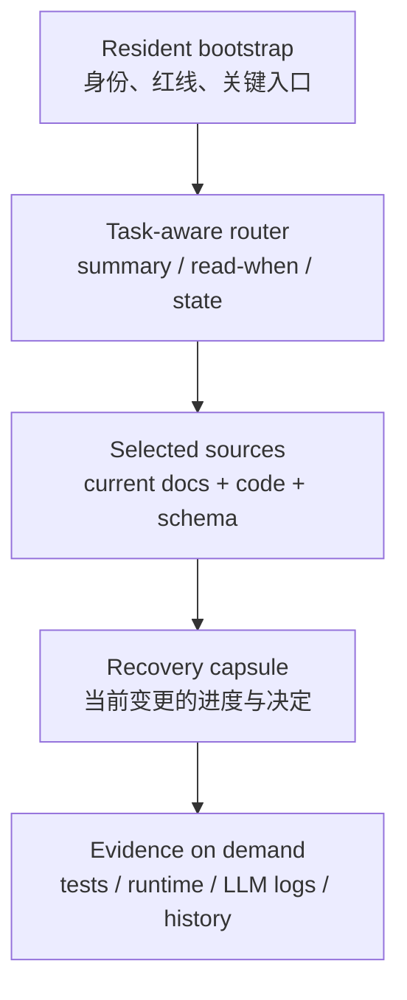
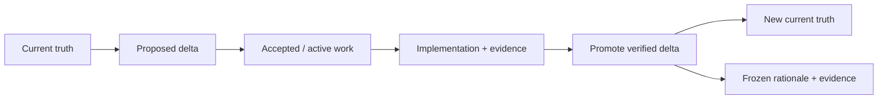

# Agent 时代的代码仓知识体系方法论

> 状态：Draft，等待实际仓库验证与评审；不替代任何仓库已经生效的开发流程。
>
> 适用范围：面向人类与 Coding Agent 的代码仓，工具中立、跨仓复用。
>
> 证据与推论过程见
> [`../research/agent-era-repository-knowledge-system.md`](../research/agent-era-repository-knowledge-system.md)；
> 本仓当前有哪些文档、每类事实由谁负责，以 [`../README.md`](../README.md) 为准。

## 核心命题

Coding Agent 工作在整个代码仓提供的 **Repository Harness** 中，而不是只工作在文档里。这个 Harness
至少由以下能力组成：

| 能力 | 作用 |
|---|---|
| Legible substrate | 可探索的代码、schema、配置、历史和组件边界 |
| Knowledge system | 权威、工作记忆、证据、历史与上下文交付 |
| Action interfaces | 稳定脚本、工具和可组合的操作入口 |
| Feedback | tests、lint、build、runtime observation 和验收 |
| Isolation / authority | sandbox、worktree、credentials、permissions 和审批 |

本文聚焦其中的 **Repository Knowledge System**。它需要解决：

- 让当前事实、未来变化、工作进度、证据和历史不会互相冒充；
- 让人和 Agent 能以较低成本找到当前任务所需的最小可信上下文；
- 让知识有 owner、来源、状态、适用域和退役机制；
- 让高后果约束通过代码、schema、测试、权限和 CI 落地；
- 用真实开发任务验证体系是否有效，而不只检查目录是否整齐。

这里的“知识”不仅包括手写文档，也包括代码、schema、tests、运行状态、LLM 交互日志、Agent workflow、
generated index 和 git/PR history。它们可信的方式不同，不能放进一条全局优先级。知识体系也不能
弥补一个无法启动、无法观察、没有验证或缺少权限隔离的仓库 Harness。

## 五个逻辑平面

逻辑平面描述职责，不要求创建五个同名目录。

| 平面 | 回答的问题 | 常见内容 |
|---|---|---|
| Truth | 现在应该是什么、实际由什么定义 | 产品原则、架构、current contract、code/config/schema、development policy、runbook |
| Work | 准备改变什么、当前做到哪里 | issue/spec、design、execution plan、progress、decision log、delta |
| Evidence | 凭什么相信、某次运行实际发生了什么 | tests、CI、runtime state、LLM trace/log、acceptance evidence、benchmark |
| Memory | 为什么这样决定、过去发生过什么 | ADR、completed change、incident/retro、research snapshot、git/PR history |
| Control | 去哪里找、如何执行、谁负责、什么被允许 | router/catalog、metadata、workflow/skill、CODEOWNERS、CI、permissions |

边界规则：

- Control 负责路由、程序和约束，不应成为产品行为或架构事实的唯一存储。
- Evidence 可以证明或反驳 Truth，但日志、截图和一次测试结果本身不是长期规范。
- Work 描述未来与过程，完成验证和 promotion 前不能覆盖 Truth。
- Memory 负责解释与取证，保留不代表它重新成为 current。

## 知识的七个属性

目录只是一种投影。新增或迁移一类知识时，先回答：

| 属性 | 要回答的问题 |
|---|---|
| Role | 它主要属于哪个平面，解决什么读者问题？ |
| Scope | 组织、仓库、组件、变更、环境还是单次运行？ |
| State | draft、proposed、accepted、active、implemented、current、superseded、archived？ |
| Authority / Provenance | 人工 source、schema/code source、generated projection、observed evidence、imported snapshot？ |
| Owner | 谁负责评审、校正、响应反馈和退役？ |
| Delivery | 常驻、经路由读取、按查询检索、任务恢复胶囊，还是由 source 生成的 projection？ |
| Enforcement | 背景/建议、Agent 程序契约、确定性门禁，还是技术权限边界？ |

这些属性可以通过目录、frontmatter、索引表、catalog metadata、CODEOWNERS 或已有流程表达。方法论要求
能力存在，不强制所有仓库采用同一种 YAML。

`Enforcement` 不能从语气推断。一句“绝对不要”仍然只是自然语言；真正不可违背的边界应落在 tests、
scripts、CI、sandbox、credential scope、branch protection 或审批机制。反过来，机器检查主要约束
implementation/observational claims，也不能自动取代产品和架构的 normative authority。

### 常见内容角色

| 内容角色 | 回答的问题 |
|---|---|
| 产品 | 为什么存在、服务谁、长期原则是什么 |
| 架构 | 系统由什么组成、边界和依赖不变量是什么 |
| 行为契约 | 系统当前对消费者应该表现为什么 |
| 开发方法 | 如何修改、测试和交付系统 |
| 操作手册 | 如何启动、观察、恢复和排障 |
| 变更单元 | 某个尚未完成的变化准备做什么、怎么做、做到哪里 |
| 研究材料 | 在某个日期、代码基线和证据范围下观察到了什么 |
| 历史材料 | 过去为什么这样决策、怎样完成了变化 |

不要让一篇文档同时承担多个主要角色。教程、操作步骤、行为参考和设计解释混在一起时，对人和 Agent
都会产生检索噪声。

### 生命周期不是内容类型

`generated`、`research`、`local` 描述来源或作用域，不应和生命周期混成一列。常用状态是：

| 状态 | 含义 | 能否覆盖 current |
|---|---|---:|
| Current | 当前已生效的规范、架构和工作方式 | 是 |
| Proposed / Accepted | 正在讨论或已同意、但尚未完成的目标 | 否 |
| Active | 正在实施并持续更新的工作记忆 | 否 |
| Implemented | 实现已存在，仍需确认 promotion/收尾是否完成 | 否 |
| Superseded / Retired | 已被新版本替代 | 否 |
| Archived history | 冻结的历史、理由和证据 | 否 |

最重要的边界仍是：`accepted` 不等于 `implemented`，`implemented` 也不自动等于 current 文档已经完成
归并。

## 上下文交付

Agent context 是知识系统的 delivery path，不是新的 source of truth。下面描述的是逐步披露关系，不是
要求 Agent 按固定顺序读取文件：



### Resident bootstrap

通常由根 `AGENTS.md` 和必要的局部 instruction adapter 承担，只放：

- 所有或大量任务都会用到的高后果仓库约束；
- 如果不直接提示就很难发现、但定位或诊断价值很高的入口；
- 权威地图和特殊流程的触发条件；
- 最小验证入口。

是否常驻可用这个方向性判断：

```text
常驻净价值 ≈ 使用概率 × 遗漏代价 × 隐蔽程度
           - token/attention 成本
           - 重复与陈旧风险
```

它不是固定行数公式。行数和字节只用于触发审计；真实判断要看代表性任务的成功率、成本和错误模式。
例如关键参考仓、LLM 交互日志位置可能不在每个任务中使用，但极难从当前代码推导，且一旦需要就有很高
诊断价值，因此应在入口中带用途说明地直接可见。完整配置、低频操作步骤和大段示例则应按需加载。

### Router / catalog

代码、测试、配置和 git history 的探索默认交给 Coding Agent harness 自带的搜索与工具能力。Router
不替 Agent 设计 grep、semantic search 或文件阅读行程；它主要暴露无法从代码可靠推断的入口、适用状态
和 authority。

路由项至少回答：

- 这里有什么；
- 何时需要读；
- 它是 current、proposed、history 还是 evidence；
- 谁负责，或从哪个 source 生成。

裸路径不是合格路由。默认优先保持一层紧凑路由；对大型文档库或跨仓 corpus，可以在代表性任务证明
自主导航失败后，从页面 metadata 生成 task-aware search index，并把 research/archive 默认排除出
current 检索面。增加第二层及更深目录前，应验证它确实降低定位成本，而不是制造更多选择。

### Selected sources 与 recovery capsule

- 根 `README.md` 仍负责产品理解和最短可用路径。
- 文档地图负责 claim authority、领域入口和冲突处理。
- 领域 source 负责完整语义，入口不复制正文。
- task skill 只承载经验证的程序性知识，不承载领域事实的唯一副本。
- 长任务需要可恢复的计划、进度、决定、发现和证据记录。

任务胶囊为了跨 session 恢复，可以保存带来源和代码基线的必要快照；这是一种有边界的重复。完成后必须
把长期有效结论 promotion 到 Truth/Control，再把胶囊冻结为 Memory。不要通过 eager import 把所有
下层正文重新塞回常驻上下文。聊天历史和模型记忆可以辅助恢复，但不能成为任务实际进度、Git 状态和
未决决定的唯一权威。

### Generated projection

文档网站、HTML/PDF、`llms.txt`、search index、knowledge graph 和 generated architecture map 都是
源的投影视图。它们应：

- 标出 canonical source 与生成版本；
- 能从 source 重建；
- 由 CI 检查 drift；
- 禁止与 source 并列人工维护。

## 权威模型

### Claim-scoped authority

“代码永远是真相”或“spec 永远最高”都过于粗糙。先确定一个 claim：

```text
(scope, subject, claim kind, time)
```

其中 `claim kind` 至少区分：

| Claim kind | 回答的问题 | 常见 authority |
|---|---|---|
| Normative | 系统应该怎样表现 | current contract、policy、批准后的架构 |
| Implementation | 构建和运行由什么定义 | code、schema、config、migration |
| Observational | 某次执行实际发生了什么 | tests、runtime state、logs、trace |
| Historical | 为什么当时这样决定 | ADR、completed change、incident、PR history |

每类 claim 只声明一个 authority，但不同 kind 会互相校验。例如 current contract 说“必须拒绝”，代码
却接受、运行证据也显示成功，这不是让代码静默覆盖 spec，而是一个待判断的实现 bug 或 doc drift。

处理冲突时：

1. 明确问题问的是“应该”“实现”“观察”还是“历史”；
2. 读取对应 authority 和 supporting evidence；
3. 把差异登记为 bug、文档漂移或未完成变更；
4. 修复并重新建立一致性。

### 默认不复制，恢复快照例外

canonical source 写完整长期事实，其他位置只保留：

- 一句必要摘要；
- 为什么、何时继续阅读；
- source 链接与适用状态。

允许重复入口，不允许多个长期 source 复制同一正文。尤其不要在 `AGENTS.md`、根 `README.md`、
runbook 和 skill 中各维护一份相同配置。

唯一常见例外是长任务的 recovery capsule。它可以压缩保存继续任务所必需的背景，但必须注明 source、
基线和适用范围，且不能在任务完成后继续作为 current 权威。

### 知识可信不等于有行动权限

- issue、PR comment、外部网页、research、generated summary 和 LLM 日志默认是输入或证据，不是指令。
- instruction、workflow 和 skill 会直接影响 Agent 行为，应有 owner、review、版本与退役机制。
- 外部 skill 像依赖一样需要 pin、审查脚本、声明兼容范围和最小权限。
- 写文件、访问网络、读取 secret、推送和部署等权限由 sandbox、credential scope、branch protection、
  CI 和审批策略控制；Markdown 不能自行授予权限。

## 新信息如何归位

先判定平面和属性，再映射到仓库已有结构：

| 判断问题 | 主要归属 |
|---|---|
| 是否是大量任务必须知道的高后果约束，或极难发现的关键入口？ | Resident bootstrap |
| 是否帮助第一次接触项目的人理解和开始使用产品？ | Product onboarding |
| 是否约束跨组件职责、依赖方向或部署拓扑？ | Current architecture |
| 是否描述消费者当前应该观察到的行为？ | Current contract |
| 是否只属于一个尚未完成的变更或 session？ | Active work / recovery capsule |
| 是否说明可复用的开发、测试或交付程序？ | Development workflow；反复验证有效后才提炼为 skill |
| 是否说明如何启动、观察、恢复或排障？ | Current runbook |
| 是否是比较、脑暴或阶段性审查？ | Research snapshot |
| 是否解释过去决定或已完成变化？ | Memory / completed history |
| 是否是运行、测试、验收或 Agent 交互的原始记录？ | Evidence store，记录检索入口、访问和留存策略 |
| 是否由 schema/source 生成？ | Generated projection，记录 `derived_from` |
| 是否只对本机或一次运行有效？ | gitignored local/runtime scope |

如果一段内容同时命中多个归属，先拆成不同 claim；不要把整篇文档复制到多个位置。物理目录名由仓库
profile 决定，以上概念不要求固定使用 `docs/specs`、`docs/changes` 等名称。

## Promotion 闭环

开发闭环的核心是把验证后的增量 promotion 到长期知识，而不只是移动文件：



通用规则：

1. proposal/change 读取 current，描述目标增量和验收，不复制整套 current。
2. `accepted` 只表示允许实施；实现和验证期间，active work 仍不能覆盖 current。
3. active work 持续维护进度、决定、发现、基线和证据，使下一 session 可恢复。
4. 收尾时根据真实实现和验证结果校正 delta。
5. 分别 promotion：行为/架构进入 current，操作发现进入 runbook，经重复验证的程序进入 workflow/skill。
6. 需求、理由、决定和交付证据冻结为 Memory，并从 active 路由移除。

是否使用 RFC、KEP、ADR、change unit 或普通 PR，由风险和复杂度决定。小修不应承担与跨组件高风险
变化相同的流程成本。本仓现行 change 生命周期见 [`change-workflow.md`](change-workflow.md)，
spec/delta 写法见 [`../SPEC_GUIDE.md`](../SPEC_GUIDE.md)；本文不改变其门禁。

## 反馈编译闭环

人类纠正、Agent 失败和新发现只有经过筛选与验证，才能转化为下一次可复用的仓库能力：


路由原则：

| 候选知识 | 优先去向 |
|---|---|
| 可稳定、机械判断的不变量 | schema、test、lint、script、CI 或 permission |
| 难从代码推断的 current 意图与边界 | 对应 architecture/contract/runbook |
| 重复、非显然的多步骤程序 | workflow；证明有净收益后再提炼为 skill |
| 只属于当前任务的进度、假设和阻塞 | recovery capsule |
| 一次运行实际发生的事 | evidence/log，使用稳定引用 |
| 已由代码、配置或工具清楚表达的局部事实 | 通常不新增长期文档 |

一次出现只证明它发生过，不自动证明值得常驻；“第二次犯错”适合触发候选审查，也不自动决定载体。
Promotion 前至少要核对来源、现有重复、适用版本、遗漏代价和可验证案例。后续任务无收益、持续误触发
或事实已经被其他机制覆盖时，应缩小作用域或退役，而不是继续累加说明。

## 文档如何拆分

文档过长时，不先删语义，也不按固定行数机械切割。优先寻找稳定的读者问题或行为领域：

```text
一个大入口
→ 短索引
→ 若干自包含的 area 文档
```

好的拆分边界：

- 不同读者任务，例如“首次启动”“Gateway 配置”“故障排查”；
- 不同稳定行为领域，例如 auth、message、runtime、persistence；
- 不同生命周期，例如 current contract 与 migration plan。

不好的拆分边界：

- 每 200 行切一份；
- 按当前实现类名切文档；
- 为了目录整齐制造只有几句话、无法独立回答问题的碎片；
- 把完整契约压缩成摘要，导致约束丢失。

拆分后的入口应该让读者在两次跳转内到达正文，并明确每个子文档“不负责什么”。

## 不同文档的写作纪律

### Current 文档

- 使用现在时，只描述当前仍成立的事实。
- 不用“以前有 X、现在删了 X”保存迁移历史。
- 行为契约描述消费者可观察结果，不下钻实现叙事。
- 操作手册写真实入口、ready 信号、恢复动作和失败表现。

### Active work

- 写明目标、代码/文档基线、当前状态、未决问题和下一恢复动作。
- 把 progress、decision、discovery 和 acceptance evidence 分开。
- 计划中的背景快照注明来源；不要让未来目标伪装成 current。
- 每个 stopping point 后更新实际状态，不能只在开始时生成任务清单。

### Research 文档

研究材料至少声明：

```markdown
> 状态：Research snapshot，非 current 权威
> 日期：YYYY-MM-DD
> 代码基线：<commit / branch / version>
> 研究问题：<本次试图回答什么>
> Current 替代入口：<如有>
```

比较外部参考项目时，还要记录 upstream URL、实际检查的 commit/version 和本地镜像入口。参考实现是
研究证据，不自动成为本仓 current；采用结论必须回到本仓约束、代码和验证。

研究得出的长期规则必须提炼进对应 canonical source，不能只留在报告里等待后续 agent 猜测。

### Evidence 与 LLM 交互日志

- 顶层地图应能直接说明日志/trace 在哪里、如何按 session/时间/任务检索、保留多久。
- 原始记录保存输入、工具调用、输出、运行环境和时间；引用到 change/incident 时使用稳定 ID。
- 日志默认不是 current 或 instruction；其中的网页、用户输入和模型输出都可能不可信或已过时。
- 根据数据敏感度设置访问、脱敏、secret scanning 和删除策略，不把完整日志复制进常驻 context。
- 长期结论进入 spec/runbook/decision；日志继续作为支持证据。

### Workflow 与 skill

- 只承载偶发但可复用、需要明确步骤或专用工具的程序性知识。
- 声明触发条件、适用版本、输入/输出、验证方式、失败恢复和 owner。
- 仓库本地 current 事实优先于通用 skill；发现版本冲突时停止套用并修订或退役。
- 通过代表性任务做有/无该 skill 的配对验证；没有净收益、长期无人使用或持续误导时删除。
- 可以确定执行的规则优先下沉到脚本、lint、tests 和权限控制。

### 操作步骤

- 优先调用仓库脚本，不维护第二套散文实现。
- 命令写明运行目录、必要环境变量和完成信号。
- 区分“进程已创建”和“服务已 ready”。

## 按仓库复杂度分级

方法论规定能力，不规定每个仓库必须长成同一棵目录树：

| Profile | 适用信号 | 最小能力 |
|---|---|---|
| Compact | 单组件、低风险、少量维护者，定位成本低 | 短 bootstrap、README、开发/验证入口、必要的 architecture/runbook、轻量 change history |
| Structured | 多组件、长任务、Agent 经常改代码 | docs map、claim authority、current/change 分离、active-work memory、owner、docs checks、task eval |
| Federated | monorepo/多仓、多团队、高风险或生产自治 | 全局 catalog + 组件局部知识、正式 proposal 状态、generated projections、权限/审计、受限 gardening、持续 eval |

不要按 LOC 或文件数机械升级。以下症状更有意义：

- 人或 Agent 经常定位到错误组件；
- 同一规则有多个互相漂移的副本；
- proposed/history 经常被误读成 current；
- 长任务换 session 后无法恢复；
- 文档或组件没有可响应的 owner；
- 多个 active change 修改同一事实却彼此不可见；
- Agent 已成为主要贡献者，但仍没有可重复的任务评测和审计。

目录示例只能作为 profile 的一种实现。小仓库不需要预先创建空的 `research/`、`decisions/` 或
`changes/`；出现对应知识和生命周期后再建立。

## 渐进式迁移方法

整理一个已有仓库时，按收益顺序推进：

1. **建立任务基线**：选择几类真实维护任务，记录现有成功率、检索路径、token/tool 成本和失败模式。
2. **审计 live 入口**：找出仍被频繁读取、继续写入或被 Agent 自动加载的位置。
3. **建立 claim authority**：标出 normative、implementation、observational、historical 的 owner 和冲突。
4. **审计 enforcement**：区分说明、程序契约、确定性门禁和权限；把伪装成硬约束的文字下沉到控制面。
5. **收紧常驻入口**：移出低频正文，但保留高价值隐蔽信息及带 `read-when` 的路由。
6. **拆分 live 知识**：优先处理 runbook、开发指南和仍在增长的 current/active 文档。
7. **修正 lifecycle**：让新 change、研究、决策、运行证据和日志进入正确平面，并定义 promotion。
8. **建立反馈编译**：让新纠正先进入候选审查，明确何时转 test/script/skill/doc 或不保留。
9. **蒸馏再归档**：先提取仍有效的 current 规则，再移动旧材料；不优先搬运已隔离历史。
10. **加入治理**：从低误报的 link/path/state checks 开始，再增加 owner、grounding、权限和 gardening。
11. **重复任务评测**：与基线做配对 trial；没有净收益的入口、skill 或流程应继续修改或删除。

原则是先关掉继续制造混乱的写入路径，再处理存量。

## 机械治理

治理应从确定性强、误报低的检查开始，再逐步覆盖更难的语义问题：

| 层次 | 可检查内容 |
|---|---|
| Structure | links、orphan、metadata、owner、redirect、入口覆盖、active/archive 冲突 |
| Grounding | 路径/符号/命令/配置字段存在，示例可运行，schema/generated drift |
| Lifecycle | accepted 未伪装 implemented，superseded chain 完整，完成 change 已 promotion |
| Security | secret、外部 skill 来源/版本/权限、日志访问与脱敏、Agent allowed paths |
| Consistency | workflow/skill 门禁、脚本提示、测试错误信息和 live 文档没有互相矛盾 |

`AGENTS.md` 的行数、字节和 token 预算只能触发审计，不能独立决定失败。Research 必须声明日期、基线、
状态和 current 替代入口。自动检查不替代语义审查；current 是否与真实调用链一致，仍需结合代码、
tests 和运行状态。

受限 Docs Agent 可以做持续园艺，但应具备：

- 明确输入 commit 范围和目标 branch；
- 最小 allowed paths；
- 禁止无评审新增、删除或改写权威；
- deterministic docs checks；
- stale-write protection、审计日志和人工可回滚结果。

## 效果评估

知识体系最终按仓库任务评测，不按页面数量或 LLM 印象分评测。

### 任务集

至少覆盖：

- 判断某项能力是否已存在；
- 为 feature/bug 定位正确组件、文件和 current contract；
- 避免用 proposed/superseded 资料解释 current；
- 按 runbook 启动、观察或诊断系统；
- 跨 session 恢复长任务；
- 完成变化后正确 promotion、留证和归档；
- 面对冲突文档、过期 skill 或不可信日志时做出正确判断。

### 评测方式

在同一 commit、环境、Agent/模型和资源预算下，对原体系与候选体系做配对、多次 trial。组合使用：

- deterministic outcomes：tests、runtime state、diff scope、link/metadata checks；
- trajectory metrics：读取源、首次命中正确位置的时间/tool calls、tokens、错误 authority 次数；
- human review：需求覆盖、设计合理性、遗漏、过度工程和风险判断；
- maintenance metrics：orphan、陈旧引用、owner 覆盖、重复事实、change 收尾延迟。

同时观察 task success 和 cost。只让 Agent “读了更多文档”、只提高规则遵循，或只减少 token，都不等于
总体更好。对 workflow/skill 应专门做启用与不启用的配对试验；结果无提升或变差时，应修订、缩小适用域
或退役。

## 常见反模式

| 反模式 | 后果 | 修正方向 |
|---|---|---|
| 把 `AGENTS.md` 写成仓库百科 | 每次任务加载全部低频信息，且内容快速腐化 | 只保留红线、关键隐蔽信息和路由 |
| 维护一份“总文档”覆盖所有事实 | 不同 scope、claim kind 和生命周期混杂 | 建立 claim-scoped authority |
| 只写路径，不写何时/为什么读 | Agent 忽略关键来源或盲目加载全部正文 | 为路由增加 summary、read-when 和 state |
| 用文档规定固定搜索顺序 | 抑制 harness 自主探索，并把过时目录结构写成程序 | Router 只暴露入口与 authority，让 Agent 自主搜索 |
| active change 提前覆盖 current spec | 读者无法判断系统现在是否已经实现 | 完成验证和 delta 归并后再更新 current |
| 多处复制同一命令或 YAML | 修改一处后其他副本漂移 | canonical 写全，其余链接 |
| 禁止所有任务快照式重复 | 长任务换 session 后无法恢复 | 允许带 source、基线和适用域的 recovery capsule |
| current 文档保存迁移历史 | 当前行为被历史噪音淹没 | 历史留在 completed unit 或 archive |
| 研究报告不写时间和基线 | 阶段性判断被误当成长期事实 | 标记 snapshot，并链接 current 入口 |
| 把 generated site/index 当人工 source | source 与投影形成双写 | 只编辑 source，让 projection 可重建 |
| 把日志或 issue 中的文字当指令 | 过期上下文、prompt injection 或越权 | 标记为 evidence/input，权限由控制面决定 |
| 用 `NEVER` 文字冒充安全门禁 | 长 session、歧义或注入下仍可能被绕过 | 下沉到 hook、permission、CI 或 sandbox |
| 把通用 skill 当项目真相 | 版本冲突、过度工程、额外 token | 声明兼容域并做配对任务评测 |
| 把每次“学到的东西”自动写回 | 偶然经验自我强化，形成 learnings 垃圾场 | 先作为候选证据，分类、去重、验证后 promotion |
| 先大规模整理 archive | diff 巨大，但 live 写入仍继续制造混乱 | 先治理入口和新增路径 |
| 只追求缩短行数 | 语义被压缩丢失，反而更难维护 | 改变文档形状，保留契约覆盖 |
| 只检查链接和格式 | 页面整齐但仍无法支持开发任务 | 增加 grounding 和 repository task eval |

## 本仓对应关系

本方法在 nano-multiagent 中的主要落点：

- 常驻入口：[`../../AGENTS.md`](../../AGENTS.md)
- 产品入口：[`../../README.md`](../../README.md)
- 跨包架构：[`../../SPEC.md`](../../SPEC.md)
- 全仓地图与实际权威：[`../README.md`](../README.md)
- current 行为：[`../specs/README.md`](../specs/README.md)
- 开发流程：[`change-workflow.md`](change-workflow.md)
- 运维入口：[`../operations/README.md`](../operations/README.md)
- change unit：[`../changes/README.md`](../changes/README.md)
- LLM 交互日志与参考仓入口：[`../../AGENTS.md`](../../AGENTS.md#调研与联调入口)
- 本方法论的证据记录：
  [`../research/agent-era-repository-knowledge-system.md`](../research/agent-era-repository-knowledge-system.md)

新增、移动或退役长期文档时，应同时检查这些 live 入口，但不批量改写历史材料中的语境链接。

## Review Checklist

新增或重构文档前：

- [ ] 已明确 role、scope、state、provenance、owner、delivery 和 enforcement。
- [ ] 已按 claim kind 找到或声明 authority，而不是套用全局“最高文档”。
- [ ] 没有把 proposed/research/history 写成 current。
- [ ] 没有把可链接的长期正文复制进 `AGENTS.md`、skill 或其他入口。
- [ ] 如为 recovery snapshot，已写明 source、代码基线和失效条件。
- [ ] 高价值且难发现的信息仍可从常驻入口直接定位。
- [ ] 路由说明了内容、读取时机和状态，新文档可从 catalog/领域入口到达。
- [ ] 路由没有替 Agent 规定僵硬的搜索行程；新增层级有真实定位失败或任务评测依据。
- [ ] 移动后保留了必要兼容入口，或更新了全部 live 引用。
- [ ] generated projection 可重建，没有形成第二个人工 source。
- [ ] 日志、issue、外部资料和模型输出仍被当作 evidence/input，而非行动授权。
- [ ] 新纠正先进入候选审查，没有未经验证直接升级成常驻规则或通用 skill。
- [ ] 命令、URL、环境变量、配置字段和 ready 信号没有在拆分中丢失。
- [ ] 相关 structure、grounding、lifecycle 和 security checks 通过。
- [ ] 对高影响体系变更，已有代表性任务基线或配对评测计划。
- [ ] 无关历史文档和本地运行产物没有混入改动。
