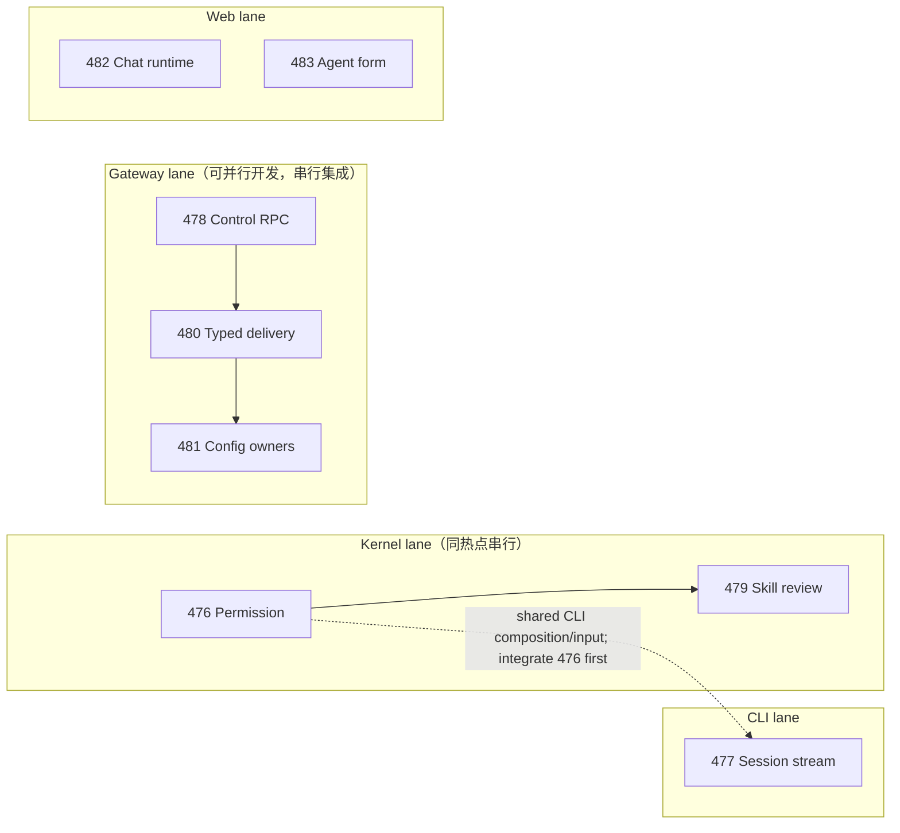

# nano-multiagent 架构重构组合（2026-07-25）

> 基线：`efe2ffd08034f611897b58b994547fcf71753f7e`（审计时 `origin/main`）
>
> 范围：`src/` 生产代码、核心 contract/behavior tests、当前 canonical specs，以及本地 Claude Code 源码 `/Users/czj/Repos/opensource-hub/claude-code`。
>
> 判据：LOC 只用于发现候选；是否是重要架构问题，以真实生产调用链、状态/生命周期所有权、依赖方向和删除测试为准。

## 结论

本轮确认 **8 个仍需独立重构的重要架构问题**，另有 **1 个可直接删除的假 seam** 已形成 PR。没有把所有大文件都判为巨石：多个超过千行的文件是明确的 transaction/aggregate/composition owner，机械拆分只会搬复杂度。

| 优先级 | 问题 | 当前破裂点 | CC 对照结论 | 处置 |
|---|---|---|---|---|
| P0 | 权限请求事务所有权分裂 | engine 闭包与 broker 共同知道 pending、竞态、取消、liveness，且穿透私有状态 | `useCanUseTool` 是完整 transaction owner；借鉴单 owner，不复制 React | [refactor-476](../../changes/refactor-476-permission-transaction-owner/) |
| P0 | CLI 同一 session 双 stream subscriber | persistent drain 与每轮 sender 同时消费 replay/live，后台 processor 留 user-run buffer | CC conversation 只有一条主消费链；SDK side queue 不是第二订阅 | [refactor-477](../../changes/retired/refactor-477-cli-session-stream-owner/) |
| P0 | IM↔Gateway control RPC 生命周期按 operation 复制，transport 混入领域分派 | IM 11 组 waiter；PA connection 同时管 wire 与 config/prompt/fork/heartbeat/cron/skill | CC bridge 分 transport 与 typed control handler；Nano 另保留远端 waiter owner | [refactor-478](../../changes/refactor-478-gateway-control-rpc-boundary/) |
| P1 | Skill 批量复盘没有 queue-to-terminal owner | core queue、SDK drain、两产品 scheduler/polling、platform review 横跨 | CC 无完全等价功能；skill learning observer 展示一次安装、service 闭环 | [refactor-479](../../changes/retired/refactor-479-skill-review-lifecycle-owner/) |
| P1 | Run delivery typed authority 未完成切换 | typed context、legacy mirror、mapping façade、terminal dict 同时存在 | CC 无相同 IM 领域；借鉴内部 typed union、边界一次投影 | [refactor-480](../../changes/archive/refactor-480-typed-run-delivery-context/) |
| P1 | Gateway 本地配置混合六个变化轴 | schema/codec/write/snapshot/workspace/model/Feishu 同处 `local_store.py` | CC settings 也大，但 provider registry/auth 生命周期不在通用 codec | [refactor-481](../../changes/retired/refactor-481-gateway-config-ownership/) |
| P1 | Web Chat 页面与 MessagePane 共享运行时所有权 | timeline/live、composer、group/fork/distill/scroll 经 page state 与 26 props 隐式连接 | CC REPL 也大；Messages/PromptInput 说明 view 可分，巨大 props 又证明只拆 JSX 不够 | [refactor-482](../../changes/refactor-482-web-chat-runtime-ownership/) |
| P1 | Agent create/edit 重复配置领域规则 | normalization、validation、feature defaults、feature→tool、空 allowlist 两套实现 | CC 无直接 UI 等价；采用 settings model/registry 的单一规则投影原则 | [refactor-483](../../changes/retired/refactor-483-web-agent-config-form-model/) |
| 已处理 | `agent.platform.tools.registry` 假 seam | 5 行纯 re-export，无生产调用，测试维护旧入口 | 无需寻找 CC 抽象；删除后复杂度不会转移 | Ready PR #212；Python/Frontend CI 通过 |

## 大文件清单与判定

下表是当前物理 LOC 较高的生产文件。测试巨石单列；“不建 unit”不等于永不整理，而是当前没有证据支持单独改变 ownership。

| LOC | 文件 | 判定 |
|---:|---|---|
| 2240 | `agent/core/agent/runtime.py` | 大型 engine；确认的 permission 与 skill-review 子事务分别进入 476/479，其余部分不因 LOC 拆 |
| 2125 | `agent/sdk/kernel.py` | 对外 façade + 装配；476/477/479 会把穿透 lifecycle 收拢为窄 SDK seam，保留单一外表 |
| 1985 | `agent-detail-page.tsx` | 内部已有组件，但共享表单规则重复是真问题 → 483 |
| 1945 | `personal_assistant/ws/im_connection.py` | transport 与领域 dispatch 混合 → 478；transport owner 本身保留 |
| 1497 | `coding_cli/commands.py` | 双 stream ownership 与 REPL orchestration 混合 → 477 |
| 1478 | `IM/infra/channel_control_store.py` | **不建 unit**：具体、深的 durable transaction owner，拆后不变量会外泄 |
| 1390 | `personal_assistant/config/local_store.py` | 六个独立变化轴 → 481 |
| 1252 | `chat-workspace-page.tsx` | timeline/composer/actions ownership → 482 |
| 1233 | `runtime_delivery/observer.py` | stringly context + 多事件族 → 480；仍保留一个同步 observer 入口 |
| 1228 | `gateway/session_keys.py` | **观察项**：内存/持久实现接口平行但边界清晰，尚无生产 owner 泄漏证据 |
| 1199 | `gateway/session_run_coordinator.py` | **不建 unit**：refactor-463 建立的 run/subscriber/lifecycle owner |
| 1190 | `IM/infra/repositories/messages.py` | **不建 unit**：消息 durable transaction owner；路由层未复制其规则 |
| 1189 | `agent/core/agent/loop.py` | **不建 unit**：单 turn model/tool loop aggregate，当前调用面深且一致 |
| 1158 | `message-pane.tsx` | runtime/view props 膨胀 → 482 |
| 1014 | `IM/api/routes/agents.py` | **观察项**：route 聚合较大，但主要翻译 HTTP 到既有 owner，未证实状态所有权泄漏 |
| 1005 | `auto_mode_gate.py` | **不建 unit**：permission policy owner；476 只移事务，不拆 policy |
| 957 | `gateway/channel_manager.py` | **观察项**：channel lifecycle owner，当前删除测试证明有深度 |
| 951 | `channels/feishu/client.py` | **观察项**：第三方 adapter 较大，尚无跨产品 owner 分裂证据 |
| 940 | `agent/core/runs/registry.py` | **不建 unit**：run identity/status authority |
| 897 | `agent/core/session/transcript.py` | **不建 unit**：conversation history authority |
| 787 | `IM/ws/gateway/control.py` | 11 套 correlation 样板 → 478 |

### 测试巨石

| LOC | 文件 | 处理 |
|---:|---|---|
| 2382 | `message-pane.test.tsx` | 随 482 按 timeline/composer/view interface 重组，不单建“拆测试”unit |
| 2000 | `chat-workspace.integration.test.tsx` | 随 482 保留少量整页旅程，其余下沉 owner contract |
| 1482 | `agent-detail-page.test.tsx` | 随 483 把共享规则移到 pure model tests，保留页面集成回归 |
| 1360 | `tool-calls-panel.test.tsx` | 当前 renderer 行为矩阵较多但 owner 清楚，列观察项 |

## 明确拒绝的候选

| 候选 | 拒绝原因 |
|---|---|
| `InboundPipeline` | 当前约 291 行，只拥有 route/gate/shadow sequencing；run/media/subscriber 已委托 `SessionRunCoordinator`，旧“1962 行 god class”判断已过时 |
| `gateway/composition.py` | 大但属于 composition root，显式 object graph 是正确局部性；删除只会把 wiring 藏到别处 |
| `InProcessKernelClient` | 集中 agent snapshot/session config/origin/DTO 的 product→SDK adapter；删除会让 heartbeat、cron、inbound 重复投影 |
| 按 RPC 创建 11 个类 | refactor-472 已证明每 RPC 一类会制造浅模块；478 用具名 API + 单 correlation owner |
| 为投递保留 legacy compatibility façade | 生产无独立 consumer，删除后复杂度消失；480 直接 typed-only cutover |
| 仅按 React 组件或 Python 文件行数平均拆分 | 不改变状态/事务 owner，只增加跳转与 props/adapter |

## Unit 关系与实施并行性

8 个 unit **没有产品行为上的 hard dependency**。实现可在独立 worktree 并行，但 SDK/canonical
增量与共享热点决定了集成顺序；“有 delta”表示把真实边界写进长青契约，不等于 unit 之间存在业务前置。

| Unit | 长青契约增量 |
|---|---|
| 476 | kernel SDK/runs + CLI non-TTY：新增可取消本地权限 port、per-Kernel 关闭隔离；非 TTY 可观察行为不变，移除对具体 reader 的绑定 |
| 477 | kernel SDK/runs + CLI：ready strict subscription、原子 USER admission/settlement；gap/source failure 的阻断与恢复 |
| 478 | 无；收敛既有 IM↔Gateway control wire 行为 |
| 479 | kernel SDK/skills：批量复盘从 queue 到 terminal 的消费者可观察 lifecycle |
| 480 | 无；typed-only 内部 cutover |
| 481 | gateway service lifecycle：配置 writer lease、remote token rotation 与重连 follower |
| 482 | 无；Web Chat 行为保持 |
| 483 | IM + Gateway：补齐 create/PATCH presence 与 feature→required-tool 联动的 canonical drift；用户行为目标保持 |

这里的箭头是 **merge/conflict lane**，不是业务前置：

- 476 与 479 都改 `runtime.py/kernel.py`，先合 476 再让 479 rebase/revalidate。
- 476 为解决可取消 permission picker 会建立 CLI terminal input owner，477 会重写
  `commands.py` 的 session stream orchestration；两者可在独立 worktree 并行开发，但
  集成必须先 476，再让 477 rebase 并重跑 permission + stream 全回归。
- 478/480/481 分别改 control、delivery、config，但都会触碰 Gateway composition，开发可并行，合入按 478 → 480 → 481。
- 477 与 479 除 CLI product composition 外基本独立；二者各自 rebase 476 后可并行集成，
  最后补一次 CLI/kernel 全回归。
- 482 与 483 生产文件基本无交集，可完全并行；共享 frontend build 是验证资源，不是代码依赖。

在 4 个并发 slot 下，推荐调度：

1. 第一批：476、477、478、482。
2. 第二批：479（rebase 476）、480（rebase 478）、483。
3. 第三批：481（rebase 478/480）+ 全局 contract/e2e。

最终开始条件：用户一次性确认本组合；在确认前不启动上述 8 个 unit 的实现。
