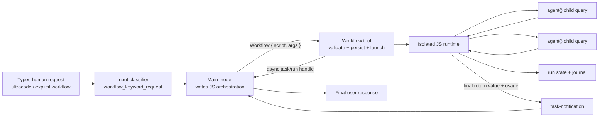

# Claude Code Dynamic Workflows 运行机制

> 研究快照：2026-08-08；installed CLI 2.1.226；结论不代表 nano-multiagent current 行为。
>
> 原始来源、commit、session ID 和能力边界见 [`research.md`](research.md)。

## 结论先行

Claude Code 的 Dynamic Workflows 不是一个“更强的 Agent tool”，而是给主模型增加了一层**可持久化的 JavaScript 编排 runtime**：

1. 人工输入明确 opt in；
2. 主模型把任务编译为一个受限 JavaScript 程序；
3. `Workflow` 工具验证、保存并后台启动程序，立即把 task/run handle 还给主会话；
4. 程序通过 `agent()` 创建独立子 agent，把返回值放进普通脚本变量；
5. `parallel()`、`pipeline()` 和 JavaScript 控制流决定调度与组合；
6. journal/run state 保存每个 agent 的开始、结果、用量和恢复边界；
7. runtime 完成后用 task notification 把最终值送回主会话，主模型再回应用户。

它最重要的设计并不是“最多开多少个 agent”，而是把**动态规划**和**执行期状态**分开：LLM 负责生成图，确定性的 runtime 负责运行图；大量中间结果留在 workflow 内，不持续膨胀主对话。



## 1. 激活并非单一关键词匹配

[官方文档](https://code.claude.com/docs/en/workflows)列出几种 opt-in：typed prompt 中的 `ultracode`、明确要求创建 workflow、复杂任务的自然语言意图、Skill 指令或调用保存过的 workflow。这里包含两层判断：

- **Harness 层**识别输入 origin 和强关键词。2.1.210 以后，`-p`、SDK 非人工输入、scheduled task 或 webhook 即使包含 `ultracode`，也不因此自动激活。
- **模型层**拿到 opt-in reminder 和 `Workflow` 工具定义后，决定脚本结构、agent 类型、prompt、阶段和并发形状。

Luna 实验的 transcript 直接出现：

```text
origin.kind = human
promptSource = typed
attachment.type = workflow_keyword_request
```

另一次 trace 的主模型 context 出现短 reminder：

```text
The user included the keyword "ultracode", opting this turn into multi-agent
orchestration — use the Workflow tool to fulfill the request.
```

因此，兼容实现不能只在 system prompt 写“看到 ultracode 就调用工具”。输入层必须先保留可信 origin，防止自动化消息伪装为人工授权；模型只负责 opt-in 后的编排。

`ultracode` 还同时表示 xhigh effort 和自动多 agent orchestration，但两者应在实现中保持为不同概念：effort 是模型推理参数，Workflow 是工具/runtime 能力。当前 installed CLI 的 `--help` 只显示到 `max`，而官方文档把 `--effort ultracode` 记为 2.1.203+；这是 help surface 与产品文档的差异，不能据此断言 runtime 不支持。

## 2. 主模型产出的是程序，不是静态 DAG JSON

`Workflow` 的主要输入是 inline `script`，也可用 `scriptPath` 重跑已保存的脚本。脚本是普通 JavaScript 子集，支持顶层 `await`、变量、循环、条件和字符串处理。它不是任意 Node 程序：不能 import，不能直接读写文件、调用 shell 或使用 Node API。

每份脚本必须导出纯 literal metadata：

```js
export const meta = {
  name: 'stable-name',
  description: 'what this workflow does',
  whenToUse: 'optional selection hint',
  phases: [
    { title: 'Research', detail: 'Gather independent evidence' },
    { title: 'Synthesis', detail: 'Combine evidence' },
  ],
}
```

这里有三个值得复刻的选择：

- **脚本本身是可审查 artifact**：tool 会把 inline script 落到 session 下，并返回 `scriptPath`；主模型可以 Edit 后按路径重跑，不用再次把整段代码塞进 tool input。
- **metadata 与执行分离**：`meta` 可在不运行任意代码的情况下用于名称、说明和 UI phase 展示，所以必须是 pure literal。
- **控制流在运行时确定**：一个 agent 的结构化结果可以决定后续分支或生成下一批 items；这比预先声明固定 DAG 更适合探索任务。

### Runtime globals

当前 tool contract 暴露以下 primitive：

| Primitive | 语义 |
|---|---|
| `agent(prompt, opts)` | 启动一个独立子 agent；返回 final text，提供 schema 时返回结构化对象；跳过或 terminal error 可返回 `null`。 |
| `pipeline(items, ...stages)` | 默认组合方式；每个 item 连续经过 stages，不等待所有 item 完成同一 stage。 |
| `parallel(thunks)` | 显式 barrier；同时运行一组 thunk，全部结束后按输入位置返回结果。 |
| `phase(title)` | 更新 UI/进度阶段。 |
| `log(value)` | 写 workflow 运行日志。 |
| `workflow(nameOrRef, args)` | 调一个保存的 workflow；只允许一层嵌套。 |
| `args` | 调用者传入的 JSON-compatible 参数。 |
| `budget` | runtime 提供的预算状态。 |

`agent` options 至少包含 `label`、`phase`、`schema`、`model`、`effort`、`isolation: 'worktree'` 和 `agentType`。官方上限和 tool contract 共同给出：并发上限为 `min(16, cpu - 2)`，总 agent 上限 1000，单个 `parallel`/`pipeline` 最多 4096 个 item。上限是安全边界，不是默认规模建议。

### 为什么 pipeline 是默认值

如果有 N 个独立对象，每个依次经过 research → review → polish，`pipeline` 可以在对象 A 完成 research 后立即进入 review，不必等 B...N 都结束 research。只有下一步必须同时看到全部上一步结果时，才使用 `parallel` barrier：

```js
const reports = await parallel([
  () => agent('Inspect source', { label: 'source' }),
  () => agent('Inspect docs', { label: 'docs' }),
])

const synthesis = await agent(
  `Reconcile these reports:\n${reports.join('\n\n')}`,
  { label: 'synthesis' },
)

return synthesis
```

从工程视角看，`parallel` 不是 agent API，而是 runtime 对一组 `agent()` effect 的并发收集器。Script 保留数组顺序；具体执行可以乱序完成，journal 负责记录真实时间线。

## 3. `Workflow` 工具是“编译入口 + 异步任务入口”

主模型调用的不是隐藏 HTTP orchestration API，而是一个 model-facing tool。当前输入面可以还原为：

```ts
type WorkflowInput = {
  script?: string
  scriptPath?: string
  name?: string
  args?: unknown
  resumeFromRunId?: string
}
```

- `script`：首次运行的常见路径；runtime 保存它。
- `scriptPath`：编辑后重跑，避免把代码再次放入 context。
- `name`：解析保存的项目级/用户级 workflow。
- `args`：进入全局 `args`。
- `resumeFromRunId`：从相同调用前缀复用结果。

tool 做完语法/metadata/permission 检查后不会等待所有 agent。最小实验的 tool result 立刻返回：

```text
status: async_launched
taskId: wtcw4djow
runId: wf_be7ccbcb-d39
scriptPath: .../workflows/scripts/workflow-lifecycle-minimal-wf_be7ccbcb-d39.js
transcriptDir: .../subagents/workflows/wf_be7ccbcb-d39
```

这让主会话保持可响应，也复用 Claude Code 已有 task notification 机制。完成消息不是 assistant tool result 的“第二段”，而是一条稍后入队的合成 user message：

```xml
<task-notification>
  <task-id>...</task-id>
  <status>completed</status>
  <result>"WORKFLOW_LIFECYCLE_OK"</result>
  <diagnostics>journal locator and resume instructions</diagnostics>
  <usage>agent counts, tokens, tool uses, duration</usage>
</task-notification>
```

因此 runtime 和 conversation loop 之间只需要两个稳定接缝：`launch -> task handle` 与 `terminal state -> queued notification`。

## 4. 子 agent 是独立 query loop，final text 是返回值

[普通 subagent 文档](https://code.claude.com/docs/en/sub-agents)说明其 context 与主会话隔离；本轮 proxy trace 对 Workflow 子 agent 给出更明确的专用 addendum：

```text
You are a subagent spawned by a workflow orchestration script.
Your final text response is returned verbatim as a string to the calling script.
Do NOT output confirmations like "Done." or "Sent."
```

它解决了角色歧义：子 agent 的读者是调用脚本，而不是最终用户。于是：

- plain text 直接成为 `agent()` 的字符串值；
- 有 `schema` 时，runtime 可以要求并解析严格 JSON；
- agent 不需要也不应该用消息工具向用户交付结果；
- prompt 必须要求“数据本身”，不能让 agent 输出人类式完成确认。

最小 Luna worker 的 request 仍携带 24 个 tool schema；“不要调用工具”只约束实际调用，不移除工具定义。这说明 Workflow runtime 复用了 Claude Code 子 agent 的完整 query harness，而不是为脚本创建一个裸 Messages API completion。

本地重建源码与此吻合：`AgentTool/runAgent.ts` 最终仍进入同一个 `query()` loop，只是换成独立 system/messages/context。复刻时应让 Workflow runtime 调已有 agent runner，而不是并行维护第二套模型循环。

## 5. 提示词不是一份，而是六层协议

如果只“观察系统提示词”，会漏掉真正决定行为的 tool description、输入 attachment 和 task notification。可复现的 prompt stack 是：

| 层 | 生产者 | 作用 | 稳定性 |
|---|---|---|---|
| 1. Base system | CLI harness | 通用 coding agent 身份、权限、仓库规则 | 随版本/仓库变化 |
| 2. Opt-in reminder | input/harness | 明确本 turn 进入 multi-agent workflow | 短而稳定 |
| 3. Workflow tool description | CLI/tool registry | 教主模型写合法脚本、选择 primitive、理解限制与 resume | 功能核心 prompt |
| 4. Generated script/task prompts | 主模型 | 为本任务动态生成图和每个 worker 的局部目标 | 每次不同 |
| 5. Workflow child addendum | child runner | 把 final text 定义为脚本返回值，保留权限边界 | 短而稳定 |
| 6. Task notification | task runtime | 把 result、diagnostics、usage 和 resume hint 重新注入主会话 | 结构化运行协议 |

主请求中的总输入也远大于“base system 字符数”：实验里 base system 约 8,970 字符，但首次调用输入为 30,712 tokens，因为 tool schemas、skills、agent listing、repository context 和 messages 都计入。做提示词复刻时必须分别统计，不能把 API input tokens 全部称作 system prompt。

### 可用于兼容实现的 surrogate prompt

下面是基于可观察契约编写的替代指令，不是 Anthropic 未公开 prompt 的逐字副本：

```text
Call Workflow only after explicit workflow opt-in from an eligible human input,
a named saved workflow, or an authorized skill instruction.

Generate a plain JavaScript orchestration script with a pure-literal exported
meta object. The script may use agent, pipeline, parallel, phase, log, args,
budget, and one-level nested workflow calls. It may not import modules or access
the filesystem, shell, Node APIs, or network directly; delegate those operations
to agents under the current permission policy.

Prefer pipeline for independent per-item stages. Use parallel only when the next
step requires all results. Keep the agent count at the current size guideline.
Each agent prompt must be self-contained because the child does not inherit the
main conversation. Treat the child's final text as a program value. Return the
workflow's final user-relevant result from the script.

For iteration, edit and reuse scriptPath. When resuming, pass resumeFromRunId;
unchanged agent calls may replay from cache, so inspect the journal before
diagnosing an empty result.
```

这段 prompt 加上严格 tool schema 足以让另一模型生成相同行为类别；真正的安全边界仍必须由 input origin、sandbox、permission system 和 runtime limits 执行，不能靠自然语言。

## 6. Durable state 与 resume 是执行语义，不是对话记忆

一次 run 至少有三类 artifact：

```text
<session>/workflows/scripts/<name>-<run-id>.js
<session>/workflows/<run-id>.json
<session>/subagents/workflows/<run-id>/journal.jsonl
```

最小实验的 run JSON 记录 completed status、默认模型、agent 状态、总 tokens、tool calls、duration 和最终 result。Journal 则按事件保存：

```json
{"type":"started","agentId":"a138d2573eb615e5a"}
{"type":"result","agentId":"a138d2573eb615e5a","result":"WORKFLOW_LIFECYCLE_OK"}
```

官方与 tool description 共同限定 resume 的外部语义：按 agent 调用顺序比较 `(prompt, opts)`，复用最长未变化前缀；相同脚本和参数可以完全命中，首次变化后重新执行后续调用。实现可以用下面的抽象：

```ts
type AgentCallRecord = {
  ordinal: number
  signature: string       // canonical hash(prompt, behavior-relevant opts)
  status: 'started' | 'result' | 'error' | 'skipped'
  result: unknown
  usage: Usage
}
```

```text
resume_cursor = 0
for each agent effect in deterministic script order:
  if previous[resume_cursor].signature == current.signature:
    replay previous result
    resume_cursor += 1
  else:
    disable further prefix replay
    execute and journal current effect
```

后续二进制静态取证确认，2.1.226 的实际 key 使用版本前缀 `v2`，对“上一个 key + NUL + prompt + NUL + canonical options”做 SHA-256；canonical options 包含 `schema`、`model`、`effort`、`isolation`、`agentType`，对象 key 排序后 JSON 序列化。它把前一次 key 链入下一次 key，因此实现了最长相同调用前缀。`label` 和 `phase` 不进入该 options 集合。Journal 的 fsync/crash consistency、并发 effect ordinal 细节和跨版本迁移仍未完整建立。

禁用无参 `new Date()`、限制 `Date.now()`/`Math.random()`等可重放性规则，说明 runtime 需要让脚本在 resume 时产生稳定 effect 序列；否则“最长相同前缀”无法可靠定义。

## 7. Permission 边界仍属于 Harness

Workflow script 自己没有文件、shell 和网络权限，所有有副作用的动作只能通过 `agent()` 下沉到 Claude Code tool layer。根据官方契约：

- 正常交互模式下，workflow 启动前可做整体审批；
- permission bypass/non-interactive 模式不会突然在后台弹出人工确认；
- 子 agent 接受 edits，并继承主 session allowlist；
- agent 间消息不能冒充用户授权，也不能改变 permission settings 或仓库 instructions。

这形成两个隔离圈：

```text
JS sandbox: 只能编排，没有 OS authority
child agent: 有工具，但受现有 permission policy 和 allowlist 约束
```

若复刻时直接给 JavaScript `fs`/`exec`，就绕过了用户已有的审计与权限模型；功能看似更简单，安全语义却已经不兼容。

## 8. 本地开源仓为什么“有入口、没实现”

固定 commit `0991eac5...` 的 `WorkflowTool` 目录是自动生成 stubs，但外层已经出现完整接缝：feature gate、tool registry、command registry、permission component 和 subagent recursive-tool denylist。这很像一个从分发包反编译/重建出的“剥离骨架”：外围引用被还原，核心模块内容没有还原。

它仍然告诉我们应把功能放在哪里：

```text
tools.ts / commands.ts
    └── feature gate + tool/command registration
WorkflowTool/
    ├── input schema + tool prompt
    ├── permission request UI
    ├── saved workflow command discovery
    └── runtime launch adapter
AgentTool + runAgent + query
    └── actual child query loops
StreamingToolExecutor / task system
    └── concurrency and async notification seams
```

因此源码 lane 的价值不是“找到隐藏实现”，而是确定兼容实现应复用哪些现有机制、避免跨错层。

## 9. 二进制揭示：AST 辅助，但由真实 JS 引擎执行

对 installed 2.1.226 的只读静态取证消除了一个关键未知。固定对象是 SHA-256 `013a1cf17df5ff1dcc189d5d6fd3fdd5f097ddc3cd41aa9992e99805574febbe` 的 arm64 Mach-O `claude.exe`；它是 Bun 1.4.0 / JavaScriptCore 单文件程序。

Workflow 的实际编译执行链是：

```text
Acorn 8.15 parse
    ↓
提取 pure-literal meta
    ↓
再次遍历 AST：拒绝 with/import，插桩 await/async return/yield/for-await
    ↓
new vm.Script(transformedSource, filename="workflow.js")
    ↓
vm.createContext({ injected workflow globals },
                 { codeGeneration: { strings: false, wasm: false } })
    ↓
vmScript.runInContext(context, timeout=30000)
    ↓
await returned Promise
```

所以它既“用了 AST”，也“直接运行 JS”，但二者职责不同：

- AST 不负责解释全部控制流；它负责 metadata 提取、静态限制和跨 VM async 边界插桩。
- 改写后的代码由 Bun/JavaScriptCore 提供的 Node-compatible `vm.Script` 真正编译和执行。
- Local Workflow 是 in-process task，不是另起一个 `node workflow.js` 子进程。
- Context 里不提供 `process`、`require`、文件和 shell，只注入桥接后的 workflow primitives、timer、budget 和 JSON-cloned args。
- Dynamic import 被 compile/runtime hook 拒绝；字符串/wasm code generation 被关闭；`Date.now`、`Math.random` 和无参 `new Date` 被替换为抛错 shim。

这也说明“二进制里搜到 `node:vm`”本身不是充分证据：Bun 会捆绑大量通用 runtime 字符串。强证据来自 Workflow 编译器构造 `vm.Script`、launcher 传递该对象、runner 调用 `runInContext` 的完整 feature-specific call chain。详细基线和调用点见 [`research.md`](research.md#installed-package--二进制静态取证)。

## 10. 最小可复刻架构

按依赖顺序可以分成四个里程碑，每一步都能单独验证：

### M0：Activation 与 model-facing contract

- 输入事件保留 `origin`，只对 eligible human input 添加 workflow opt-in attachment。
- feature gate 控制 `Workflow` 工具是否进入主 agent 工具池。
- 定义 `script/scriptPath/name/args/resumeFromRunId` schema 和 surrogate tool prompt。
- 禁止 child agent 再调用 Workflow，避免无界递归。

验证：同一文本从 typed human 输入可见 tool/reminder，从 `-p` 或 task notification 输入不自动 opt in。

### M1：Sandbox runtime 与 agent effects

- 解析 pure-literal `meta`，拒绝 import/Node/FS/shell。
- 暴露 `agent/parallel/pipeline/phase/log/args/budget`。
- `agent()` 适配现有 child runner；final text/structured output 回到脚本。
- 实施并发、总量、per-combinator 上限。

验证：单 agent 返回固定字符串；两节点 parallel 保持结果位置；pipeline 表现为 per-item 流水。

### M2：Durable run、journal、resume 与 task notification

- inline script 落盘，run state 与 append-only journal 分离。
- tool launch 异步返回 task/run locator。
- terminal state 入队为 task notification，携带 result/diagnostics/usage。
- resume 按相同 agent-call prefix 回放已完成结果。

验证：主会话 launch 后可继续；完成 notification 可独立恢复；修改第二个 agent prompt 只重跑第二个及其后续。

### M3：产品入口与治理

- `.claude/workflows/` 和用户级目录的保存/发现/参数入口。
- `/workflows` 或等价进度 UI、phase 展示、取消与诊断。
- permission request 与 allowlist 继承。
- workflow size guideline、禁用开关、模型/effort routing 和成本可见性。

验证：保存的 workflow 可按名调用；正常权限和 bypass 权限分别符合契约；取消/错误/空结果都有可定位 journal。

## 11. 复刻时最容易做错的地方

- 把 tool description 当文档附件：它实际是教主模型写 orchestration program 的核心 prompt，必须版本化和测试。
- 把 `ultracode` 只实现成字符串匹配：必须同时验证输入 origin。
- 让 JS runtime 直接碰 OS：会绕过 child-agent permission boundary。
- 用全局 stage barrier 实现所有多阶段工作：会丢掉 `pipeline` 的吞吐优势。
- 每次重跑整张图：会失去 script artifact + prefix resume 的迭代价值。
- 把每个子结果都重新注入主对话：会重新制造 context 爆炸。
- 默认用高价模型或大量 agent 做探索：最小实验已证明单个 no-tool Luna child 也有约 20K 输入 tokens。
- 从开源 stub 猜 vendor 内部实现：stub 只能定位 seam；兼容性应由 public contract 和 live behavior 判定。
- 从二进制里出现某个 parser/VM 字符串就推断 Workflow 使用它：必须恢复 feature-specific validation → compile → execute 调用链。

## 12. 当前认知边界

我们已经能复现对外运行模型、提示词分层、tool 输入、脚本语言、异步生命周期、子 agent 返回值语义、artifact 形状、通知与 resume 的兼容契约。尚不能声称知道：

- 完整未公开 system/tool prompt 的逐字内容；
- journal 的 crash consistency、并发 effect ordinal 和跨版本迁移；
- VM bridge、value sanitization 与 hostile-script hardening 的全部安全性质；
- 普通 permission 模式下所有 UI 状态；
- cancellation、process crash、跨版本 run state migration 的内部细节。

这些未知不阻碍做一个行为兼容的第一版。只有当实现选择依赖它们时，才应按 [`research.md`](research.md#仍需实验的未知项) 中的 Luna 最小实验继续取证。
