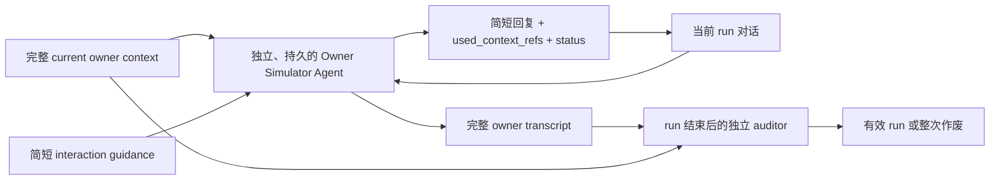

# 面向 Agent 评测的受控用户模拟

当一个 Agent 的能力包括“向用户把需求问清楚”，静态输入输出评测就不够了。评测必须有人回答它的问题：有些答案只在 Agent 真正发现那个决策后才应出现，有些信息本来可以从仓库查到，不该由用户喂给它；如果 Agent 完全不问却猜错，最终质量应下降，而不是由评测环境主动救场。

让另一个 LLM 扮演用户似乎很自然，但它也会改写实验。它可能比真人更愿意配合，提前把相邻信息一起说出；也可能为了“像某种人格”而夸张表演；如果它看过完整 gold spec，还可能在不知不觉中替被测 Agent 补齐答案。最终成绩既包含被测 Agent 的能力，也包含模拟用户放水或刁难的程度。

因此需要校准和审计模拟用户。但“存在风险”不自动推出“必须先建复杂控制管道”；反过来，“复杂管道尚未被证明更好”也不意味着应当未经审计地相信 Native。合理方案必须保留开放对话能力，同时让模拟失真不能悄悄进入实验结果。

## 模拟用户不是数字分身

交互式 benchmark 已经形成了几个反复出现的做法。

[τ-bench](https://github.com/sierra-research/tau2-bench/blob/668d3bcd135c02aa3438f987ef45735b7c163ee3/data/tau2/user_simulator/simulation_guidelines.md) 给 simulator 一份私有 scenario，要求未提供的信息保持 unknown、等待具体问题后逐步披露；最终评价标准由另一个 evaluator 持有。它还另外审计 simulator 是否编造事实、提前泄漏，或因为自身错误帮助/阻碍被测 Agent。

[UserBench](https://arxiv.org/html/2507.22034) 更进一步：先判断 Agent 当前发言具体触及哪项用户偏好，再由环境决定是否披露，而不是让回复模型拿着完整 profile 自由发挥。[τ²-bench](https://arxiv.org/abs/2506.07982) 和 [ToolSandbox](https://arxiv.org/abs/2408.04682) 则通过角色视图、环境状态和受控工具缩小 simulator 能做的事情。

另一组研究说明了为什么这些约束必要。[SimulatorArena](https://aclanthology.org/2025.emnlp-main.1786/) 发现用真实用户背景和交互风格形成 profile，可以提高 simulator 与真人评价的相关性；[RealUserSim](https://arxiv.org/abs/2605.20204) 同时发现，抽象、强烈的行为指令容易被模型放大成不自然的行为。[Mind the Sim2Real Gap](https://arxiv.org/abs/2603.11245) 直接比较真人与多种 simulator，观察到模拟者通常更合作、风格更统一，模型能力更强也不保证更像真人。

这些证据支持一个较窄、但可以审计的目标：不追求逐字模仿某个用户，而是尽量复现他已经确认的语义判断、信息边界和互动习惯。它们没有直接比较“单一 native simulator”与“router/controller/speaker/verifier 多层方案”，也没有证明后者更好。

## 先从实验真正需要什么出发

feat-532 不是在做通用数字分身。它只需要一个实验端点，在 Candidate 提问时复现 owner 已确认的语义判断，并让“少问但写对”和“少问只是因为乱猜”能被区分。由此得到六个同时成立的约束：

1. 能理解开放、复合和新措辞问题，不能依赖封闭 decision 路由；
2. 回复受 current owner context 约束，不能创造新的产品立场；
3. 只回答当前问题，不能替弱 Candidate 主动补全 spec；
4. Baseline、Treatment 与 repetition 之间尽量一致；
5. 每个实质回答能追溯到 owner context；
6. 控制机制本身不能成为另一个与 Candidate 互动的 spec co-author。

单一 Native Simulator 最符合第一项，也最简单自然；但它不能自动满足其余五项。相反，每轮都经过 router/controller/speaker/verifier 的管道容易控制披露，却把“理解发散问题”变成了“先命中预设 ontology”，而且任何 mapping 错误都会成为全系统瓶颈。

## Native 的优势和失真机制

| 机制 | Native 为什么擅长 | 为什么会破坏评测 |
|---|---|---|
| 完整上下文推理 | 能组合多条原则回答从未见过的问题 | 可能把 context 当成待传达清单，向宽泛问题倾倒相邻答案 |
| 语言模型补全 | 能自然处理省略、指代和模糊表达 | 信息缺口也可能被补成看似合理的新 owner 判断 |
| 顺着对话协作 | 能对 Candidate 的建议作自然确认或纠正 | 容易被推荐措辞锚定，或过度配合地替 Candidate 完成思考 |
| 行为提示 | 可以模仿回复简洁、先听推荐等习惯 | 复杂 persona 指令可能被夸张执行，产生不真实风格 |
| 自报引用 | 成本低，便于过程分析 | `used_context_refs` 可能漏报、错报，不能自己证明回复有依据 |

这些风险不会因为两个 arm 使用同一 Simulator 就自然抵消：不同方案产生的问题、推荐和错误假设不同，恰好会触发不同偏差。解决方向也不应直接删除 Native 的长处，而应把检测放到不干预对话的位置。

## 采用方案：Native 对话核心 + 非介入式审计

以 spec 对齐为例，owner 先校对一份 current owner context。它不只是封闭问答表，可以包含完整 owner-answer bank、相关产品原则、只有 owner 知道的事实、明确的未知和委托边界，以及每项来源。它与 judge 使用的 gold spec、rubric 和 accepted outcomes 分开。



每个 Candidate run 配一个新的 Owner Simulator session。Simulator 首轮拿到完整 current owner context 和简短 interaction guidance，之后在同一个 session 里接收 Candidate 问题并直接回复。问题可以是开放、复合或从未出现过的措辞；Simulator 自己在已有信息中查找、组合和推理，不先投影到预设 decision。

每轮输出同时包含隐藏的 `used_context_refs` 和状态：正常回答、要求 Author 自查、没有明确偏好，或现有信息不足而需要真实 owner。引用用于过程分析，不要求自然语言问题和某个 decision 一对一对应。

这个方案保留 LLM 处理发散问答的能力，但不把 trace 留给人事后随缘抽查。每次 Candidate–Simulator 对话结束后，一个全新 auditor 只读冻结 owner context 和完整 owner transcript，检查无依据的实质判断、未被当前问题触发的披露、前后矛盾与错误引用。它看不到 arm、Memory、gold spec 和质量 rubric，不向 Candidate 发言、不修改回复，也不 review 最终 spec。发现 critical simulator error 时，整次 run 作废。

单次 transcript 不能证明跨 run 一致性。同 case 的所有 repetitions 完成后，还要将 owner transcripts 去除 arm 与质量结果并随机排序，做一次批次一致性审计。实质等价问题若得到冲突产品判断，作废整个 case batch，而不是选择性删除对某个方案不利的 run。

post-run audit 解决的是“失真不能静默进入结果”，而不是“让这次对话变正确”。它不能挽救已受错误回复影响的 Candidate，所以必须作废整次 run；这也正是它比事中 controller 更少干预因果过程的地方。

只有 qualification 观察到 full-context Native 持续失败时，才沿固定阶梯比较下一种方案：先试同一个 Simulator 自主按需检索 owner context；仍有 critical failure，再比较选择性披露 controller。每一步都在同一组 fixtures 上报告语义 fidelity、critical leakage、unsupported judgment、一致性、成本和时延，而不是把复杂度当作可靠性的替代指标。

## 它根据哪些信息回答

Native Owner Simulator 在每次运行中读取四类信息：

| 状态 | 内容 | 为什么需要 |
|---|---|---|
| 公开任务 | owner 已经说出的 brief | 判断 Agent 是否在要求用户重复公开信息 |
| owner context | owner 校对后的事实、判断、原则、未知、委托边界和来源 | 提供足够语义背景，让 Simulator 自己处理发散问题 |
| 对话状态 | 当前 run 的完整对话 | 处理同义追问、复合问题和前后指代 |
| 互动规则 | 简短、task-blind、经真实 owner 确认的回答习惯 | 保持直接、要求具体问题、拒绝替 Agent 做 grounding |

它不读取完整 gold spec、private rubric、accepted outcomes、Candidate Memory、实验组身份、其他 run、父仓历史或 judge 结果。互动规则可以来自真实历史对话，但应排除评测任务 lineage，只描述“怎样互动”；当前产品答案由 owner 校对后的 context 提供。

## 什么情况下说话

“只在被问到时回答”不能靠有没有问号判断，但边界仍应足够严格：

- Agent 明确询问一个具体产品判断：披露回答当前问题所需的 support。
- Agent 提出具体推荐并明确请求确认：确认或纠正这一项。
- Agent 问 brief 已说过的内容：只复述，并记录一次额外用户负担。
- Agent 问仓库可以查到的事实：不代查，要求它自己用证据解决。
- Agent 把实现选型推给 owner：指出这是 design 责任。
- Agent 泛问“还有什么要求”或要求列出全部偏好：不倾倒 bank，要求提出具体问题。
- Agent 换措辞重复问：重放同一答案，并再次记录用户被迫补充。
- Agent 没有提问，只是写下一个错误假设：不主动纠正，最终质量裁判负责发现。

最后一条看似不够“像真人”，却对 feat-532 的因果比较很重要。如果 simulator 在完成时主动列出所有遗漏，它会免费修复一个不做 grounding、不问问题的 Candidate。Memory 方案是否真的能少问且仍然写对，就再也测不出来。

[SWE-Together](https://arxiv.org/abs/2606.29957) 的 completion correction 对重放真实 coding 协作有价值，但不适合这个 estimand。可复用的是默认不发言、结构化 action、硬状态和完整 trace；不能照搬的是把历史最终方案交给 simulator，再让它择机纠偏。

## 信息不足时怎样处理

问题是发散的，owner context 不可能枚举所有未来问法。Simulator 可以直接组合其中多项信息，也可以依据已确认的互动习惯说“这个从仓库查”“你先给一个有依据的推荐”或“我没有明确偏好”。这些都是自然用户回复，不需要预先把问题分进某个 decision。

如果 Simulator 判断当前信息确实不足，而且问题需要一个会影响 spec 的新 owner 选择，它返回 `needs_real_owner`：

1. Runner 保留原问题并将其改写成不带 Candidate 推荐倾向的中性问题。
2. 真实 owner 确认后，current owner context 和实验 seal 一起升版。
3. 受影响 case 的 Baseline 与 Treatment 都在新版本下重跑；不能只把新答案发给后来的 arm。

如果一个问题必须看到某个 arm 的完整候选才能回答，它不是可跨 arm 共享的预封存答案。这时正确结论是“当前 benchmark 无法公平比较这一项”，而不是让 simulator 猜一个用户选择。

## 用户负担从实际回复计算

消息条数不是用户负担。一条消息问五个产品判断，用户仍提供了五项内容。Simulator 每次回复同时保存结构化 trace：

```json
{
  "turn": 7,
  "status": "answered",
  "used_context_refs": ["D03", "D04"],
  "contribution_items": 2,
  "reply": "..."
}
```

每个独立事实、判断、确认、纠正或重定向计一项。Candidate 批量包装不减少数量；同一判断重问再次计数；Candidate 不问但猜错时负担为零、质量变差。这样“少对齐”和“最终效果”保持两条独立轴，不会互相抵分。

## 先评 simulator，再用它评 Agent

Native Owner Simulator 需要自己的 qualification set：

- 真实历史问题及同义改写；
- 正确推荐和错误推荐；
- 复合问题和重复问题；
- 可查事实、实现问题、泛问全部偏好；
- unknown、新产品判断和 prompt injection；
- 预埋的无依据判断、主动泄漏和错误引用，验证 auditor 能识别 critical error。

每条 fixture 保存真实 owner 认可的语义回答边界，并专门覆盖没有单项 decision、需要组合多项背景才能回答的问题。unknown 被编造成答案、明显提前倾倒无关 owner 信息或严重偏离真实 owner 判断，都应阻止实验 seal。真实 owner 再抽查少量回复，只回答“这个位置我会不会表达相同判断”，不要求模型复刻口头禅。

每次正式 run 记录 simulator model、prompt、temperature、owner context identity、`used_context_refs`、最终消息、状态与 auditor 结果。三次重复运行都从空状态开始。Baseline 与 Treatment 使用同一个冻结 Simulator 和 auditor；胜出方案正式采用前，再用另一个 simulator backbone 或少量真人交互检查结论方向。

## 能证明什么，不能证明什么

这套方法能证明的是：在一个由真实 owner 校准、且通过非介入式审计的 Native Simulator 下，某个 Agent 方案是否减少了必须重放的 owner 判断，同时保持最终质量。

它不能证明 simulator 已成为真实用户，也不能消除所有 sim-to-real 偏差。真正的用户可能更不耐烦、会打断错误假设、会临时改变判断，或者用完全不同的措辞理解问题。现有研究也不能证明多层控制架构一定优于这个 native 方案；是否需要 hardening 必须由实际 qualification、pilot 或运行失败来决定。

它不能证明 auditor 已经捕获全部模拟失真，也不能证明 full-context、按需检索或 controller 中哪一种永远最好。feat-532 选择的是低干预起点和基于已观察失败的升级规则；固定来源、逐项源码证据和采用差异见 [`research.md`](research.md)。
