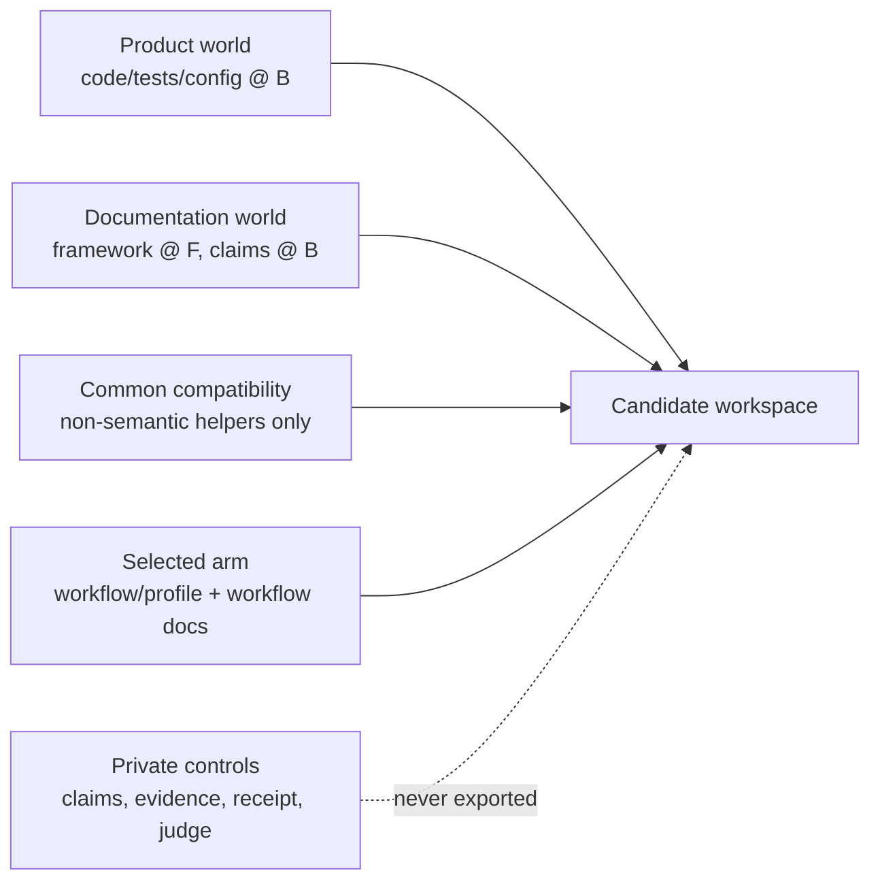

# Counterfactual-latest base repository methodology

> Method id: `counterfactual-latest-base-v1`
>
> Projection level: `DP1-counterfactual-latest-v1`
>
> Status: normative design contract; a case cannot become `ready` until its concrete manifests and validation receipt satisfy this document and the active experiment [protocol](experiments/feat_397_agent_team/protocol.md).

## 1. The invariant

A historical evaluation workspace must combine four independently frozen truths:

```text
Code@B + ProductClaims@B + DocsFramework@F + Workflow@W
```

- `B` is the last safe product commit before the target requirement leaves a trace.
- `F` is the suite-frozen latest documentation framework: authority topology, lifecycle states, canonical-spec grammar, route/index rules and the builder that materializes them.
- `W` is the suite-frozen workflow closure for the selected arm.
- Product behavior, architecture and executable repository instructions remain true at `B`, even when their documents are organized using `F`.

The candidate therefore works in a counterfactual repository where the old product has already adopted the latest documentation system, but has not acquired later product behavior or knowledge. “Latest documentation” never means copying the current documentation tree into an old code checkout.

## 2. Evidence boundary

This methodology separates three kinds of statement.

| Kind | What supports it | What it does not prove |
|---|---|---|
| Repository observation | A pinned Git tree, path, blob hash, test or reproducible probe | That the same fact holds at another commit |
| Protocol decision | This method, its schemas and a frozen suite seal | That the decision is the only possible evaluation design |
| Semantic judgment | A claim/evidence review over `B` and the projected document | Runtime behavior unless an executable check also observes it |

The existing evaluation protocol directly demonstrates why the clocks must remain separate: its historical cases intentionally use historical product and knowledge clocks with current workflow/model clocks. The new decision is to split the documentation framework from product knowledge as well. This is an experimental-control choice, not a claim that real repositories evolve in independent clocks.

Static source evidence can support an implementation or architecture claim; it cannot prove a user journey occurred. A passing baseline test or focused probe supports only its exercised behavior. The validation receipt must preserve these limits rather than converting “source found” into “behavior verified”.

## 3. Why not use the latest repository and delete the target

The default historical construction keeps code at `B`. Removing a target from the latest code is a different experiment because later commits may depend on the target’s API, persistence model, tests, UI surface or documentation contract.

A separate `latest-minus-causal-cone` case is admissible only when all of the following are true:

1. the target implementation commit set is complete and unambiguous;
2. every semantic descendant is enumerated and classified before candidate runs;
3. removing the target and its dependent descendants preserves all preregistered non-target current behavior;
4. the resulting current documentation can be closed against the reduced code without manual, case-aware hints;
5. the removal patch, descendant ledger and validation evidence are frozen as a different dataset version.

Failure of any condition retires that construction. It does not justify silently widening `B`, deleting inconvenient tests or calling a manually repaired latest tree “historical”. The main `counterfactual-latest-base-v1` method does not perform causal-cone subtraction.

## 4. Independent clocks and truth domains

The base repository has six clocks.

| Clock | Historical case | Prospective case | Governs |
|---|---|---|---|
| Product | pre-target `B` | sealed current commit | code, tests, config and product-owned assets |
| Knowledge | facts available at `B` | facts available at brief freeze | repository and reference knowledge |
| Documentation | framework `F`, claims at `B` | framework and claims at the same sealed current commit | document topology versus repository facts |
| Workflow | suite-frozen `W` | same | skills, role prompts and workflow-bearing repository instructions |
| User | cross-fitted current profile where enabled | same | stable user preferences without target lineage |
| Model/tool | suite-frozen build and permissions | same | execution capability and budget |

Every candidate-visible documentation slice belongs to exactly one truth domain:

| Truth domain | Clock | Examples | Evidence requirement |
|---|---|---|---|
| `framework` | `F` | authority roles, spec grammar, lifecycle definitions | exact frozen framework fragment |
| `navigation` | generated | indexes, route tables, counts | deterministic output manifest |
| `product_current` | `B` | README behavior, `SPEC.md`, canonical specs, runnable commands | baseline code/test/doc evidence |
| `history_or_proposed` | no later than `B` | completed archive history and dated research snapshots | source existed by `B`, status is explicit and the clean-room visibility policy permits it |
| `workflow` | selected arm’s `W` | change lifecycle routing and role instructions | arm dependency closure |

An unclassified slice is an error. A `framework` slice may explain how current specs are written, but it may not state that the product implements a feature. The lifecycle vocabulary still recognizes active, completed and retired states, but visibility is separate from classification: pre-existing direct active-unit roots and `docs/changes/retired/**` are private source material and never enter the candidate tree. Completed `docs/changes/archive/**` history may remain visible only when it already existed at and is consistent with `B`; it cannot masquerade as current truth.

## 5. Logical workspace layers

The candidate tree is the conflict-free union below:



The layers have separate manifests and hashes:

1. **Product world** contains the scrubbed primary product tree without candidate-visible repository documentation or outer Agent harness.
2. **Documentation world** contains the complete DP1 projection shared by all arms. “Complete” means every baseline document is classified; it does not mean every classified source is exported. The clean-room policy excludes pre-existing direct active units and retired change units.
3. **Common compatibility** remains limited to treatment-neutral, non-semantic helpers. DP1 is not N0 or N1.
4. **Arm bundle** contains exactly one workflow/profile closure and every workflow-bearing document or repository-instruction fragment it owns.
5. **Private controls** contain the projection source map, claim/evidence inventory, validation receipt, authority map and judge materials.

Reference repositories are product evidence, not extensions of Nano’s documentation system. They keep their own historical files after the common outer-harness scrub and use `reference_passthrough_scrubbed`; DP1 applies only to the primary repository.

Documentation ownership is resolved before projection. Product-owned Markdown embedded in implementation roots—such as built-in runtime skills, fixtures or package assets—remains in product world and is not reorganized as repository guidance. `baseline-document staging` means the primary repository’s guidance/contract/history graph selected by the suite-wide ownership rule, not every file with a Markdown suffix.

## 6. Versioned control artifacts

Three structured contracts define the method:

- [schema/doc-system.schema.json](schema/doc-system.schema.json) / [template](templates/runtime/doc-system.json): suite-wide framework `F`, authority topology, lifecycle, transforms, workflow-owned paths, latest-source current-claim inventory and builder closure.
- [schema/doc-projection.schema.json](schema/doc-projection.schema.json) / [template](templates/runtime/doc-projection.json): per-case DP1 inputs, output files, source slices, product claims and evidence.
- [schema/doc-validation.schema.json](schema/doc-validation.schema.json) / [template](templates/runtime/doc-validation.json): per-case validation results, executable evidence, independent review and final assertions.

These assets are runner/control-plane inputs and are never candidate-visible. A future integration revision must bind them explicitly from case, layer, treatment, suite-seal and run-ledger contracts; until then, the existing draft cases cannot be sealed under DP1 merely because the files exist.

The identities are immutable:

- method changes create a new `method_id`;
- framework/profile or builder changes create a new `framework_clock_id` and require a full-suite rerun;
- a case projection change creates a new `projection_id` and invalidates its old results;
- validation evidence is bound to one exact product tree and projected documentation tree.

## 7. End-to-end construction lifecycle

### 7.1 Freeze suite-level framework assets

Before materializing cases, freeze:

1. a clean, content-addressed `F` commit/tree rather than a mutable checkout;
2. a `doc-system` profile derived from `F`;
3. a private inventory of product current claims found in the latest documentation source tree, used only to prove supported/rewritten/omitted closure;
4. the DP1 builder and its complete dependency manifest;
5. epoch-wide path maps and generated-index rules;
6. the workflow-owned path list;
7. the suite-wide clean-room path policy, B-noncompleted archive-reference rule and lifecycle index allowlist;
8. the task-blind author/reviewer protocol.

The profile is allowed to extract structural rules from `F`. It must not include current product contracts, later change history, case names, target symbols, briefs, authority maps or private rubrics.

### 7.2 Acquire and partition the baseline

For each case:

1. archive `B` and verify its commit, tree and archive hashes;
2. apply the suite-wide treatment scrub to the primary and reference roots; for the primary root, derive the direct active/retired unit-id set from B, scan every completed archive unit's text for references to that set, and remove each matching archive unit as one whole root under `drop_noncompleted_cross_references_v1`;
3. partition the primary tree into `product input` and `baseline-document staging`;
4. preserve the complete baseline document staging manifest privately, including active, retired and completed change-unit sources before their visibility disposition is applied;
5. reject symlinks, path collisions, undeclared instruction roots and any source newer than the permitted clock.

Partitioning is not relevance filtering. Every primary-repository documentation path at `B` receives a lifecycle disposition, even when it appears unrelated to the case brief.

### 7.3 Author the projection without target knowledge

DP1 authoring receives only:

- the scrubbed product tree at `B`;
- the full baseline-document staging tree;
- the frozen doc-system profile and epoch recipe;
- generic validation tools.

It does not receive the case title, brief, authority map, target commit, held-out implementation, decision inventory, rubric, profile or any arm output. For already known historical cases, the authoring record must honestly say `post_case_task_blind_independent`; it cannot claim prospective blindness retroactively.

The author produces a complete projected document tree plus the frozen `doc-projection` manifest. Every staged path receives a disposition even when clean-room policy removes it. Runtime construction then replays bytes and recipes only; no model rewrites documentation during an arm run.

### 7.4 Materialize DP1

DP1 permits only five materializers:

| Materializer | Allowed use | Required lineage |
|---|---|---|
| `copy_exact` | keep a baseline document at the same path | one `B` blob |
| `move_exact` | apply an epoch-wide latest-taxonomy path move | one `B` blob plus frozen path-map entry |
| `framework_slice` | install product-neutral rules from `F` | exact fragment and bytes hash |
| `generate_index` | derive route/index content from the output manifest | generator id, inputs and output hash |
| `frozen_claim_render` | express a baseline fact in the latest document grammar | one or more baseline evidence items and reviewed output claim |

`arm_overlay` is recorded by the projection as a slot, but materialized by the selected arm rather than DP1.

The following are forbidden:

- copying the latest docs tree and deleting target names;
- selecting only documents named by the private authority map;
- importing post-`B` current specs, tests, archives, research or change units;
- exporting any pre-existing direct `docs/changes/<unit>/**` root or any `docs/changes/retired/**` content;
- retaining a completed archive unit that imports claims from a unit still direct-active or retired at `B`, or deleting only matching words/files instead of the whole archive unit root;
- using the target’s final implementation to reverse-author baseline requirements;
- adding “not implemented”, “removed for evaluation” or similar target-shaped tombstones;
- generating call-path summaries, module hints or recommended designs;
- resolving uncertainty by asserting a current behavior without baseline evidence.

When a latest-framework area has no baseline-supported current content, omit that area from generated navigation. Do not create an empty page whose absence statement hints at the evaluated target.

### 7.5 Preserve lifecycle semantics under the clean-room policy

DP1 projects the latest lifecycle vocabulary and index rules, not every historical unit instance:

- `current` authorities are rebuilt and verified against `B`;
- every direct active-unit source at `docs/changes/<unit>/**` receives `drop_clean_room_change_unit` and is absent from the candidate tree;
- every source under `docs/changes/retired/**` receives the same disposition and is absent from the candidate tree;
- completed history under `docs/changes/archive/**` may be copied or moved only when it already existed at and is consistent with `B`; an archive unit that textually references a B-noncompleted unit receives `drop_noncompleted_cross_references_v1` as one whole-root disposition;
- a legacy documentation epoch may declare one task-blind `drop_proposed_control` path list before case selection; H01 uses the frozen list for obsolete root control records and proposal documents, records presence/removal per path, and cannot add target-shaped exceptions;
- research remains dated, baseline-scoped evidence rather than current truth;
- operations/development commands remain only when valid at `B`;
- latest lifecycle vocabulary is retained, while navigation is generated from the paths that actually survive projection and therefore cannot name or link an excluded unit.

This is a suite-wide, task-blind path rule, not relevance filtering. Source bytes and their baseline lifecycle states remain in the private staging/disposition ledger so completeness is auditable. No post-`B` completion state may be back-propagated: a later archive location is structural evidence only, and its later content and lifecycle outcome are excluded.

The incident that motivated the archive rule showed later-authored completed units importing the still-active treatment unit: `feat-397` first appeared at `ee7b51717f68d0870fb8d6fe278b239f17606c9c` (2026-06-04 author time), while `feat-421`, `bugfix-507`, and `bugfix-509` first appeared later at `a5b40b5ff967282f99190640558a48a0a96418b4`, `ee5f657b754642569d64685b064e960ed66dfff1`, and `1e20b25f76fc455e380bb766961447575deed47a`. Those timestamps diagnose provenance but are not recipe selection inputs: the formal rule uses only B's unit topology and archive text, and the validator independently recomputes every whole-root disposition.

Workflow-bearing framework files are projected by hash-bound slices when a whole F file would assert later repository state. H01’s `docs/changes/README.md` keeps F bytes from the start of the file through the end of `## 唯一定位`; its recipe binds the full source hash, the unique next-heading marker, and the slice output hash. Per-file required/forbidden assertions preserve lifecycle grammar while excluding the later evidence/migration sections, and every declared relative link must resolve in the materialized B world. Native-epoch H02/H03/H04/H05/H07/P01/P02 keep the W file byte-exact and do not inherit this H01 transform.

### 7.5.1 Suite extension ledger

Suite growth is a versioned control-plane change, not an isolated new folder. Before authoring private truth, record each candidate as accepted or rejected and reserve its id; rejected ids remain in diagnostics. For an accepted historical case, prove the first target trace and use its parent as B, then freeze source-root hashes and the task-blind archive closure before target-specific assertions are added. Public input must stop at the knowledge available when the requirement began; later owner answers and review corrections belong only in private semantic truth.

An extension is complete only when the same case set is bound by dataset, source roots, recipes, treatment lock/schema, suite seal/schema, stable receipt, validator/tests, protocol and owner-review navigation. Recompute the recipe-registry manifest and replay every formal root. If two independently pinned B commits converge after the registered clean-room transform, retain both source identities and record the shared output hash rather than collapsing the cases into one source.

### 7.6 Install arm-specific workflow documents

Workflow-bearing documents are treatment assets because they can route candidate behavior. At minimum, the doc-system profile must classify:

- the change-workflow authority;
- repository instructions that select spec/design roles;
- workflow-specific templates or artifact contracts.

A and A+USER receive byte-identical workflow documents and workflow closure. B receives the team workflow’s corresponding closure. Common product/documentation layers cannot tell B to invoke A’s workflow, and B’s team instructions cannot be hidden in common documentation.

If a physical file mixes product rules and workflow routing, the builder either:

1. moves the workflow route to a dedicated arm-owned file while preserving the frozen latest topology; or
2. records a deterministic composed-file template whose common slices are byte-identical across arms and whose only differing slices are arm-owned.

The selected strategy and final per-arm file hashes belong in the treatment lock. Silent overlapping writes are forbidden.

### 7.7 Build the fresh root

After product, documentation, common and selected-arm manifests pass:

1. materialize their exact conflict-free union;
2. inject the public brief only as the initial user message;
3. verify that private controls and other arms are absent;
4. create the canonical single-root local Git repository defined by the protocol;
5. record the final content-tree and commit hashes.

## 8. Claim and evidence contract

The private projection manifest covers the **current-authority closure**: every current document reachable from root instructions, product entry, docs map, `SPEC.md`, canonical specs, development and operations indexes.

Each normative product claim records:

- one stable `claim_id`;
- its output file, selector and statement bytes hash;
- claim class and truth clock;
- all source fragments used to render it;
- one or more evidence items at `B`;
- whether evidence is direct or corroborating;
- the validation checks that exercise or review it.

Every output fragment also records its `source_clock`. Framework slices are owned by `documentation_framework`; product-current and preserved completed-history slices are owned by `product_baseline`; generated navigation is owned by `generated_navigation`. Workflow text is not a DP1 fragment and is owned by the selected treatment overlay. A fragment/clock mismatch is a validation failure.

At minimum, claims cover:

- every canonical `Requirement` and its scenario group;
- every architecture invariant in `SPEC.md` or root repository instructions;
- every user-facing startup or operational command represented as current;
- every current README statement whose truth changes what a user or contributor expects.

Navigation and framework prose use their own truth domains and do not need code evidence. Preserved completed history requires baseline provenance and explicit lifecycle status, not proof that its old design remains current. Active and retired change-unit content remains private even when its baseline provenance is valid.

Every current product claim found in `F` receives one closure disposition:

- `supported_at_baseline`: the same claim is valid at `B`;
- `rewritten_from_baseline`: DP1 emits a baseline-equivalent current claim;
- `omitted`: the current claim is not valid at `B` and has no candidate-visible replacement.

There is no default “carry over”. Missing a closure disposition is a projection failure.

## 9. Validation receipt

The validation receipt binds one exact `B`, one doc-system profile and one projected documentation tree. It includes the following gates.

### 9.1 Reproducibility and structure

- re-create every output byte from declared inputs and materializers;
- verify framework/profile, builder, path-map and source hashes;
- run the frozen latest docs checker in a case-sensitive environment;
- validate links, generated indexes, canonical area counts and lifecycle routes;
- prove every source path receives exactly one disposition and every output slice one truth domain.
- prove every output fragment’s truth domain, materializer and `source_clock` agree.

### 9.2 Baseline truth

- resolve all evidence refs at `B` or one of its ancestors;
- reject current claims sourced only from later commits or held-out target artifacts;
- run the baseline’s applicable tests rather than blindly imposing latest product tests;
- run focused hidden probes for canonical behavior where available;
- run static import/architecture contracts for architecture claims;
- smoke-test current commands in the sealed runner environment;
- record code-only or review-only evidence with its weaker evidence class.

### 9.3 Leakage and absence

- scan for target units, post-cutoff unit ids, current-only symbols and direct answer phrases;
- prove all direct active-unit and `docs/changes/retired/**` sources are assigned `drop_clean_room_change_unit`, absent from output files and absent from generated navigation;
- recompute `drop_noncompleted_cross_references_v1` from B, prove every declared archive disposition matches exactly, and prove every preserved `docs/changes/archive/**` file resolves to `B` or an ancestor without importing B-noncompleted claims;
- require `docs/changes/feat-397-spec-design-agent-team` as a forbidden path and `feat-397` as a case-insensitive path/text atom over every formal root;
- run preregistered negative probes that establish the target behavior is absent at `B` for historical cases;
- verify no target-shaped tombstone or relevance-selected route was added;
- verify claim/evidence maps and validation outputs are not candidate-visible.

A string scan alone is not proof of absence; it is one check alongside ancestry, manifest and behavior evidence.

### 9.4 Arm identity

- prove the product and DP1 documentation trees are byte-identical across arms;
- prove A and A+USER workflow closures, including workflow documents, are byte-identical;
- prove the only A+USER versus A difference is the registered user profile;
- prove B’s workflow-document differences are registered treatment dependencies;
- verify no workflow-bearing route remains in the common layer.

### 9.5 Independent semantic review

The reviewer sees `B`, the doc-system profile, the projected documentation and validation evidence. The reviewer cannot see the brief, target name, authority map, held-out implementation, judge inventory or arm outputs. The receipt records this exposure boundary and one of:

- `approved`;
- `changes_required`;
- `insufficient_evidence`.

Only `approved`, zero unresolved current claims and zero failed required checks may be frozen.

## 10. Adding a case

A new case reuses suite-level `F`, doc-system profile, builder and workflow clocks. Case onboarding supplies only:

1. a product/knowledge baseline `B` with cutoff evidence;
2. a documentation epoch selected without reading the brief;
3. a complete primary/references source manifest;
4. one DP1 projection manifest;
5. one validation receipt;
6. the existing case, treatment and private-judge assets.

The builder must process the whole primary repository and apply the same clean-room path policy before any case-specific output exists. A new case cannot add a case-specific transform or unit exception to a shared epoch recipe after seeing the target. If a genuinely new historical layout requires another transform, version the doc-system profile, rerun every affected case and report the new epoch explicitly.

Prospective cases use `identity_current` only when product claims and documentation framework are frozen from the same clean tree. They still produce a projection manifest and validation receipt; “current” is not evidence that documentation has no drift.

## 11. Sensitivity and interpretation

At least one historical case from every documentation epoch used by the confirmatory suite should run a paired sensitivity:

```text
raw historical docs versus DP1 counterfactual-latest docs
×
A versus B
```

Report quality, owner burden, cost and pairwise arm ranking in both worlds. A ranking reversal is evidence of a documentation-world interaction. It must be reported as such and cannot be resolved by selecting the more favorable world.

DP1 improves ecological validity for current skills but may also reduce task difficulty by making authorities easier to discover. The paired sensitivity measures this interaction; it does not make the synthetic document world historically real.

## 12. Failure and retirement rules

A case cannot become `ready` when any of the following remains true:

- a current claim lacks baseline evidence or a closure disposition;
- a post-cutoff product fact is candidate-visible as current;
- a direct active unit or `docs/changes/retired/**` path survives in the candidate tree, or a generated index refers to one;
- completed archive history lacks ancestry and consistency evidence at `B`;
- an output fragment is owned by the wrong source clock;
- projection authoring used the brief, target or private oracle;
- the framework/profile or builder is mutable or incompletely hashed;
- a case-specific relevance transform is required;
- workflow-bearing content leaks into common documentation;
- the output cannot be regenerated byte-for-byte;
- required baseline tests/probes fail without a resolved evidence-bound explanation;
- independent review is not approved.

If a baseline is too old for the latest document framework to be projected without large, judgment-heavy invention, retire or replace the case. Complexity of migration is not permission to weaken the truth invariant.

## 13. Migration from the legacy historical-world/N0 design

The current draft assets remain useful as source/cutoff evidence, but they are not sufficient for DP1:

1. keep existing cutoff refs, archives, briefs, private inventories and treatment lineage;
2. stop exporting primary-repository docs as an inseparable part of `historical_world`;
3. retain N0 only for non-semantic compatibility that remains after DP1;
4. create the suite-level doc-system profile and builder closure;
5. classify every staged change-unit path, recompute the task-blind archive-reference closure, apply the clean-room rule and generate one projection and receipt per case;
6. extend case/layer/treatment/seal/ledger contracts in a subsequent integration milestone;
7. rerun raw-versus-DP1 sensitivity before interpreting arm differences.

Legacy cases stay `draft` during this transition. A pending hash is not a waiver, and a valid old N0 alias does not establish conformance with the latest documentation framework.
