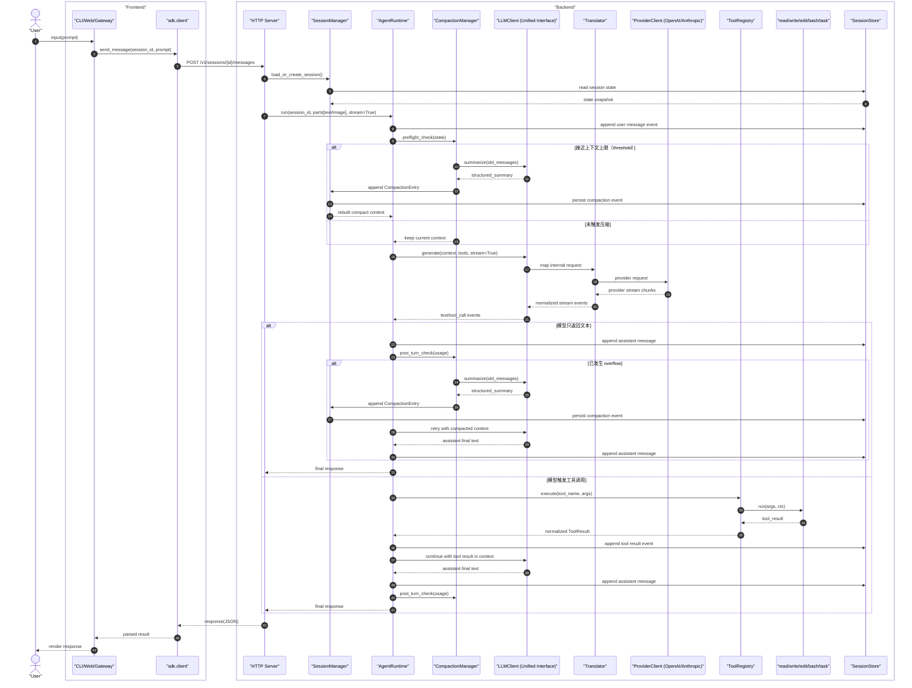
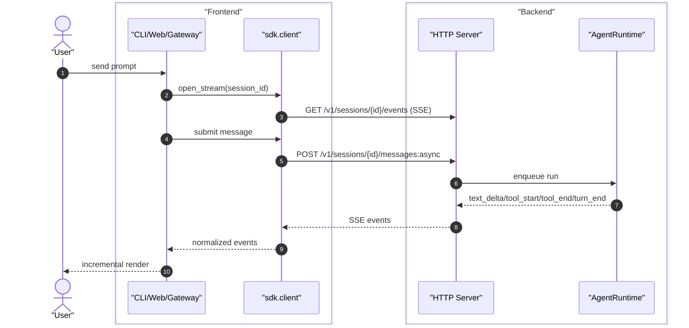
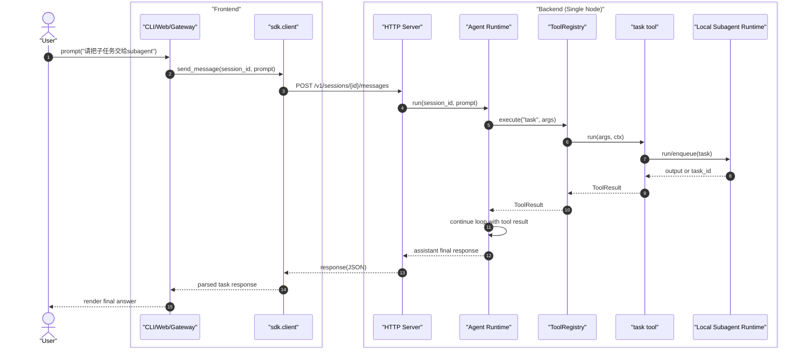

# nano-multiagent 内核设计蓝图

本文档定义一个纯后端的 Python 多模型 Agent 内核。
目标：对上层应用提供统一的 Agent 运行时接口，同时通过可插拔协议适配器支持多个 LLM 提供方（如 OpenAI、Anthropic）。

## 1. 设计目标

1. 对上层 Agent 应用提供统一运行时。
2. 支持多 Provider，且 Provider 细节不泄漏到运行时/工具/会话层。
3. Agent Loop 可重放、可审计、可调试。
4. 模块边界清晰，后续重构不破坏行为。

## 2. 建议项目结构

```text
nano-multiagent/
├─ pyproject.toml
├─ README.md
├─ .env.example
├─ src/
│  └─ nano_multiagent/
│     ├─ core/
│     │  ├─ types.py
│     │  ├─ events.py
│     │  ├─ errors.py
│     │  └─ ids.py
│     ├─ llm/
│     │  ├─ interfaces.py
│     │  ├─ factory.py
│     │  ├─ model_registry.py
│     │  ├─ translator.py
│     │  └─ protocols/
│     │     ├─ openai_compat/
│     │     │  ├─ client.py
│     │     │  └─ mapper.py
│     │     └─ anthropic/
│     │        ├─ client.py
│     │        └─ mapper.py
│     ├─ agent/
│     │  ├─ runtime.py
│     │  ├─ loop.py
│     │  ├─ state.py
│     │  ├─ policies.py
│     │  ├─ prompting.py
│     │  └─ compaction/
│     │     ├─ policy.py
│     │     ├─ planner.py
│     │     ├─ summarizer.py
│     │     ├─ applier.py
│     │     └─ types.py
│     ├─ tools/
│     │  ├─ base.py
│     │  ├─ registry.py
│     │  ├─ safety.py
│     │  └─ builtins/
│     │     ├─ read.py
│     │     ├─ write.py
│     │     ├─ edit.py
│     │     ├─ bash.py
│     │     └─ task.py
│     ├─ session/
│     │  ├─ manager.py
│     │  ├─ serializers.py
│     │  ├─ entries.py
│     │  └─ stores/
│     │     ├─ base.py
│     │     ├─ sqlite_store.py
│     │     └─ jsonl_store.py
│     ├─ server/
│     │  ├─ app.py
│     │  ├─ deps.py
│     │  ├─ auth.py
│     │  ├─ sse.py
│     │  └─ routes/
│     │     ├─ global.py
│     │     ├─ session.py
│     │     ├─ run.py
│     │     └─ tool.py
│     ├─ observability/
│     │  ├─ logger.py
│     │  └─ tracing.py
│     ├─ sdk/
│     │  └─ client.py
│     └─ cli/
│        ├─ main.py
│        ├─ commands.py
│        └─ http_client.py
└─ tests/
   ├─ server/
   ├─ agent/
   ├─ llm/
   ├─ tools/
   └─ session/
```

## 3. 模块职责（边界契约）

### 3.1 `core/`

- 放跨模块稳定契约：
  - `types.py`：`Message`、`ToolSpec`、`ToolCall`、`ToolResult`、`TurnResult`
  - `events.py`：运行时事件（`turn_start`、`tool_start`、`text_delta` 等）
  - `errors.py`：类型化异常（`ModelError`、`ToolError`、`PolicyViolation`）
  - `ids.py`：session/turn/message/tool-call ID 生成
- 不允许依赖 provider 或存储实现。

### 3.2 `llm/`

- `interfaces.py`：运行时唯一依赖的抽象接口，例如：
  - `generate(context, tools, stream=False) -> LLMResult | Iterator[LLMEvent]`
- `factory.py`：按配置选择具体 provider 客户端。
- `model_registry.py`：provider/model 元数据与能力描述。
- `translator.py`：统一格式转换层：
  - 内部消息格式 -> provider 请求格式
  - provider 响应格式 -> 内部统一格式
  - 调用 LLM provider 时必须携带请求头 `X-Session-Id: <runtime_session_id>`
- `protocols/*`：各 provider 具体实现。
- 规则：`agent` 只能依赖 `llm.interfaces`，不能直接依赖 `protocols/*`。

### 3.3 `agent/`

- `runtime.py`：上层统一 API（`run`、`continue_turn`、`get_session`）
- `loop.py`：核心状态机：
  - 构建上下文 -> 调用 LLM -> 如有 tool call 则执行工具 -> 追加结果 -> 继续
- `state.py`：会话与轮次内存状态
- `policies.py`：最大轮次、最大工具调用、token 预算策略开关
- `prompting.py`：system prompt 与工具说明拼装
- 规则：这里不做文件 IO、DB 操作、Shell 执行。

### 3.4 `agent/compaction/`（上下文压缩子系统，必须有）

- `policy.py`：压缩触发判定
  - `should_compact(context_tokens, context_window, reserve_tokens)`
  - 区分两种触发：`threshold`（接近上限）与 `overflow`（已溢出）
- `planner.py`：切点规划
  - 优先按“完整 turn”切分
  - 禁止把工具调用和对应工具结果拆开
  - 维护 `first_kept_event_id`
- `summarizer.py`：摘要生成
  - 通过统一 `LLMClient` 调用摘要模型（可与主模型不同）
  - 输出固定结构摘要（目标/约束/进展/决策/下一步/关键上下文）
- `applier.py`：压缩结果应用
  - 写入 `CompactionEntry`
  - 重建有效上下文：`system + compaction_summary + kept_recent_messages`
- `types.py`：压缩相关类型
  - `CompactionReason`、`CompactionSettings`、`CompactionResult`
- 规则：
  - 压缩是 `agent` 内核能力，不放到 `cli` 或应用层。
  - 运行时在每次 LLM 调用前可进行预检查，结束后可进行后检查。

### 3.5 `tools/`

- `base.py`：`Tool` 接口（`name`、`schema`、`run(args, ctx)`）
- `registry.py`：注册/分发/执行工具，参数校验
- `safety.py`：路径沙箱、命令白黑名单、超时、输出长度限制
- `builtins/read.py`：读文件
- `builtins/write.py`：写文件/覆盖（带安全路径校验）
- `builtins/edit.py`：结构化编辑（search/replace 或 patch）
- `builtins/bash.py`：受控 shell 执行
- `builtins/task.py`：本地临时子任务执行（拉起同节点 subagent，支持 `blocking | non_blocking`）
- 规则：工具应尽量无状态、可单测。

### 3.6 `session/`

- `manager.py`：创建/加载/切换/归档会话
- `entries.py`：会话事件定义（含 `CompactionEntry`）
- `stores/base.py`：持久化抽象接口（保存事件、加载会话、追加轮次）
- `stores/sqlite_store.py`：生产默认（可靠、可查询）
- `stores/jsonl_store.py`：调试与回放友好
- `serializers.py`：版本化序列化，支持迁移
- 规则：运行时不能直接写 SQL，只通过 `SessionStore`。

### 3.7 `observability/`

- 结构化日志（带 session/turn/tool-call 关联 ID）
- 可选 tracing（LLM 延迟、工具延迟）
- 不承载业务逻辑。

### 3.8 `cli/`

- 薄入口层
- 用户输入 -> 调用 `sdk.client` -> HTTP 请求 `server`
- 渲染流式事件与最终响应
- 不嵌入运行时核心逻辑，不允许直接 import `agent.runtime`

### 3.9 `server/`（HTTP 接口层，必须有）

- 对外暴露统一 API（OpenAPI + SSE）
- 参数校验、鉴权、限流、幂等控制、错误映射
- 将 HTTP 请求转换为对 `agent.runtime`、`session.manager`、`tools.registry` 的调用
- 对 CLI、Web/Gateway 提供一致接口
- 规则：`server` 不承载业务决策，不实现 Agent Loop，仅做协议适配与编排入口

## 4. 依赖方向（必须保持）

1. `cli -> sdk.client -> server`
2. `server -> (agent, llm.interfaces, tools.registry, session.manager, core)`
3. `agent.compaction -> (llm.interfaces, session.manager, core)`
4. `llm.protocols -> llm.interfaces + core`
5. `tools.* -> core`
6. `session.* -> core`
7. `core` 不依赖任何上层模块

若破坏该方向，provider 细节和存储细节会反向污染运行时，扩展性会快速退化。

## 5. 内核 Runtime API（内部）

HTTP 层以下保持统一 Runtime 接口，供 `server` 调用：

```python
class AgentRuntime:
    def run(self, session_id: str, parts: list[dict], *, stream: bool = True): ...
    def continue_turn(self, session_id: str, *, stream: bool = True): ...
    def get_session(self, session_id: str): ...
```

- `parts` 仅支持两种输入：`text`、`image`。
- 音频/文件/视频等非原生输入由外部应用先落盘；内核只接收文本与图片（例如把本地文件路径作为 `text` 传入，由工具自行读取）。

Provider 切换必须是配置行为：

```yaml
provider: openai_compat   # 或 anthropic
model: gpt-4.1-mini
```

切换 provider 时，不需要改 `server/cli/web` 代码。

## 6. 对外 HTTP API 设计（v1）

### 6.0 统一约定（所有接口）

- 鉴权：`Authorization: Bearer <token>`
- 请求追踪：`X-Request-Id`，响应回传 `trace_id`
- 幂等：创建类 `POST` 支持 `Idempotency-Key`
- 错误格式统一：
  - `{ "error": { "code": "...", "message": "...", "retryable": false, "trace_id": "..." } }`

### 6.1 全局

- `GET /v1/health`
  - 用途：健康检查
  - 返回：`{ healthy: true, version: string, node_id: string }`
- `GET /v1/capabilities`
  - 用途：查询当前节点支持的模型与工具
- `GET /v1/openapi.json`
  - 用途：供 CLI/Web 自动生成客户端

### 6.2 会话与消息（主入口）

- 说明：用户/前端只应调用本节接口；`task` 子任务调度不作为用户直接入口。

- `POST /v1/sessions`
  - 用途：创建会话
  - body：`{ title?, metadata? }`
- `GET /v1/sessions`
  - 用途：查询会话列表
- `GET /v1/sessions/{session_id}`
  - 用途：读取会话详情
- `PATCH /v1/sessions/{session_id}`
  - 用途：更新会话标题、归档状态等
- `POST /v1/sessions/{session_id}/messages`
  - 用途：发送消息并同步等待最终答复
  - body：`{ message_id?, parts, model?, stream? }`
  - `parts`：仅允许 `text` 与 `image` 两类
- `POST /v1/sessions/{session_id}/messages:async`
  - 用途：异步提交消息
  - 返回：`202 { run_id }`
- `GET /v1/sessions/{session_id}/messages`
  - 用途：分页读取消息
- `POST /v1/sessions/{session_id}/abort`
  - 用途：中断当前运行
- `POST /v1/sessions/{session_id}/compact`
  - 用途：手动触发压缩

### 6.3 运行与事件流（SSE）

- `GET /v1/events`
  - 用途：全局事件流
- `GET /v1/sessions/{session_id}/events`
  - 用途：会话级事件流（`text_delta/tool_start/tool_end/turn_end/...`）
- `GET /v1/runs/{run_id}`
  - 用途：查询异步运行状态
- `POST /v1/runs/{run_id}/cancel`
  - 用途：取消异步运行

### 6.4 工具与扩展

- `GET /v1/tools`
  - 用途：查询可用工具与 schema（内置五个：`read/write/edit/bash/task`）
- `POST /v1/tools/register`
  - 用途：注册工具（本地插件或 MCP 映射）
- `DELETE /v1/tools/{tool_name}`
  - 用途：卸载工具

### 6.5 `task` 子任务调度（进程内能力，无HTTP接口）

- `task` 由 `ToolRegistry` 执行后，在当前进程内拉起临时 subagent 完成子任务。
- 支持两种模式：`blocking | non_blocking`。
- 该能力不对外暴露单独 HTTP API；外部入口始终是 `sessions/messages`。
- subagent 发起的 LLM 请求必须沿用主 agent 的同一个 `X-Session-Id`（同一 runtime session）。
- 注意：这里的 `X-Session-Id` 与 `task` 参数中的 `session_id`（用于 continuation）不是同一个概念，禁止混用。

## 7. 时序图（前后端分离）



### 7.1 流式事件（SSE）



### 7.2 `task` 作为普通工具（本地临时 subagent）



## 8. 类图（核心对象与扩展点）

```mermaid
classDiagram
    class AgentRuntime {
      +run(session_id, parts, stream)
      +continue_turn(session_id, stream)
      +get_session(session_id)
      -_execute_loop(state, stream)
    }

    class AgentLoop {
      +step(state) TurnResult
      +should_continue(state) bool
    }

    class CompactionManager {
      +preflight_check(state) AgentState
      +post_turn_check(state, usage) AgentState
      +compact(state, reason) CompactionResult
    }

    class CompactionPolicy {
      +should_compact(tokens, window, reserve) bool
    }

    class CompactionPlanner {
      +plan_cut(messages, keep_recent_tokens) CutPlan
    }

    class CompactionSummarizer {
      +summarize(messages, instructions) str
    }

    class CompactionApplier {
      +apply(state, summary, plan) AgentState
    }

    class AgentState {
      +session_id: str
      +messages: list
      +turn_index: int
      +policy_state: dict
    }

    class LLMClient {
      <<interface>>
      +generate(context, tools, stream)
    }

    class OpenAICompatClient {
      +generate(context, tools, stream)
    }

    class AnthropicClient {
      +generate(context, tools, stream)
    }

    class LLMFactory {
      +create(config) LLMClient
    }

    class Tool {
      <<interface>>
      +name: str
      +schema: dict
      +run(args, ctx) ToolResult
    }

    class ToolRegistry {
      +register(tool)
      +execute(name, args, ctx) ToolResult
    }

    class SessionManager {
      +load(session_id) AgentState
      +save(state)
      +append_compaction(entry)
      +build_context() AgentState
    }

    class SessionStore {
      <<interface>>
      +load_session(session_id)
      +append_event(session_id, event)
      +save_snapshot(session_id, state)
    }

    class SQLiteSessionStore {
      +load_session(session_id)
      +append_event(session_id, event)
      +save_snapshot(session_id, state)
    }

    AgentRuntime --> AgentLoop
    AgentRuntime --> CompactionManager
    AgentRuntime --> AgentState
    AgentRuntime --> LLMClient
    AgentRuntime --> ToolRegistry
    AgentRuntime --> SessionManager

    CompactionManager --> CompactionPolicy
    CompactionManager --> CompactionPlanner
    CompactionManager --> CompactionSummarizer
    CompactionManager --> CompactionApplier
    CompactionManager --> LLMClient
    CompactionManager --> SessionManager

    LLMFactory --> LLMClient
    OpenAICompatClient ..|> LLMClient
    AnthropicClient ..|> LLMClient

    ToolRegistry --> Tool
    SessionManager --> SessionStore
    SQLiteSessionStore ..|> SessionStore
```



## 9. 内核硬约束（不可破坏）

1. `agent.runtime` 不得 import 具体 provider 实现类。
2. CLI/Web/Gateway 必须统一走 HTTP API，禁止直接调用 `agent.runtime`。
3. 所有工具执行必须经 `ToolRegistry`。
4. 每次状态变更都要产生事件并通过 `SessionStore` 持久化。
5. 内置五工具 `read/write/edit/bash/task` 默认启用工作区安全约束。
6. 新 provider 必须通过同一套 `LLMClient` 契约测试。
7. 压缩必须落盘为 `CompactionEntry`，并保留 `first_kept_event_id` 以保证可重建与可审计。
8. `task` 子任务调用必须具备超时与幂等键，且仅允许在本节点内执行。
9. 所有发往 LLM provider 的请求必须带 `X-Session-Id`，且 subagent 与其主 agent 保持相同值；该值与 `task.session_id` 参数无关。

## 10. 落地顺序（低风险）

1. 先定义 `core` 契约与事件类型。
2. 先落 `server` 骨架（鉴权、错误码、幂等、中间件、OpenAPI）。
3. 实现 `llm.interfaces` + 一个 provider（`openai_compat`）。
4. 实现 `tools` 与安全护栏（`read/write/edit/bash/task`）。
5. 实现 `session.sqlite_store` 与事件回放。
6. 实现 `agent.compaction`（threshold + overflow + manual compact）。
7. 实现 `agent.loop` 与 `agent.runtime`（接入 compaction pre/post check）。
8. 实现 `task` 的进程内 subagent 调度（`blocking | non_blocking`）。
9. 实现薄 CLI（仅 `sdk.client` 调 HTTP）。
10. 再加第二个 provider（`anthropic`），仅改 `llm/protocols/*` + `llm/factory.py`。

## 11. 最小验收标准

1. 相同 prompt + 相同 session snapshot 可以稳定重放。
2. 切换 provider 只改配置，不改 runtime/tool/session 代码。
3. CLI 对内核所有调用均经过 HTTP（代码层无 `agent.runtime` 直连 import）。
4. `read/write/edit/bash/task` 能通过模型 tool-call 正常触发。
5. 进程重启后可恢复会话。
6. 能从日志/事件完整追踪一轮执行链路。
7. 在长会话下可自动压缩且不中断主流程（overflow 后可恢复重试）。
8. `task` 能在本节点拉起临时 subagent，`blocking` 与 `non_blocking` 均可工作。
